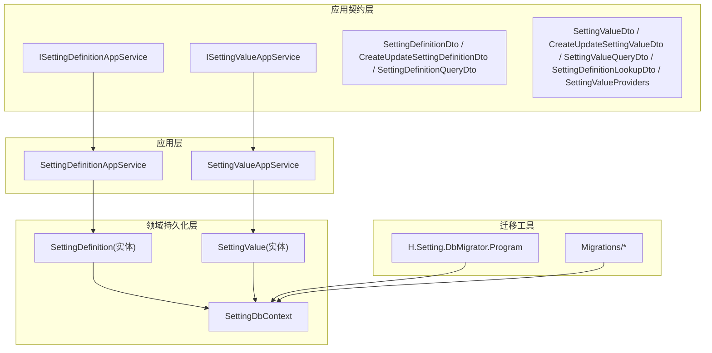
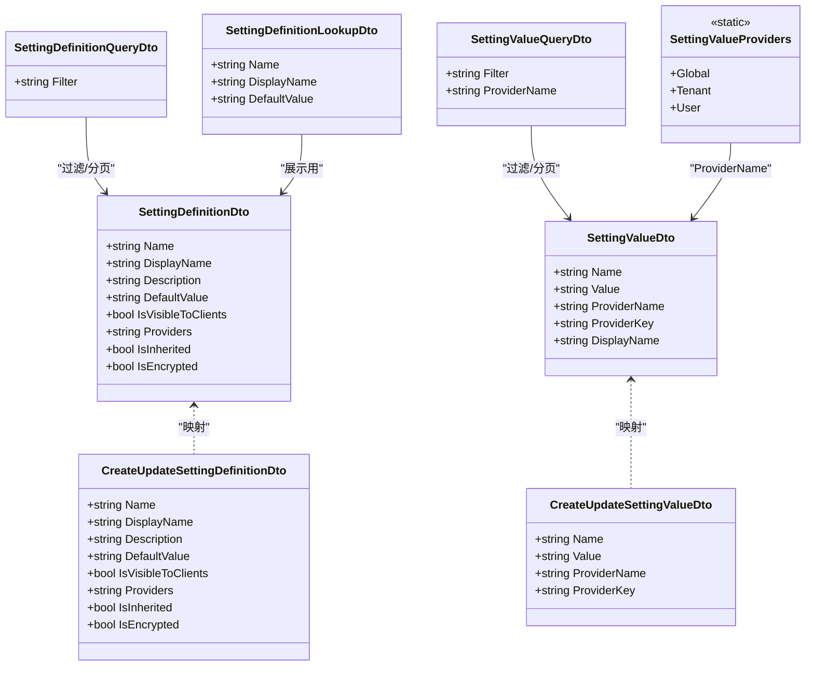
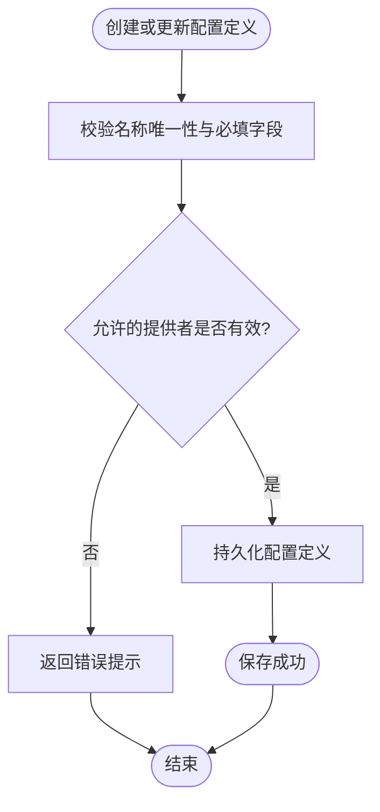
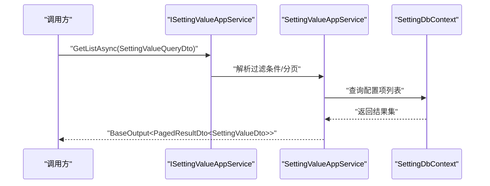
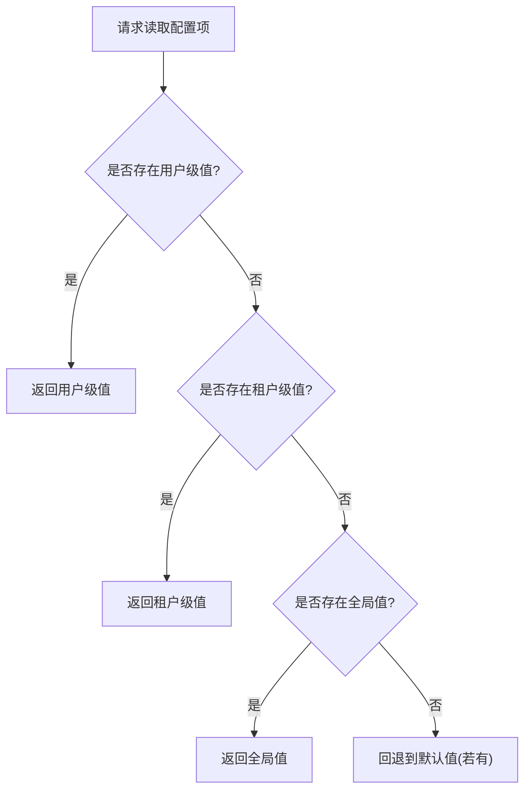
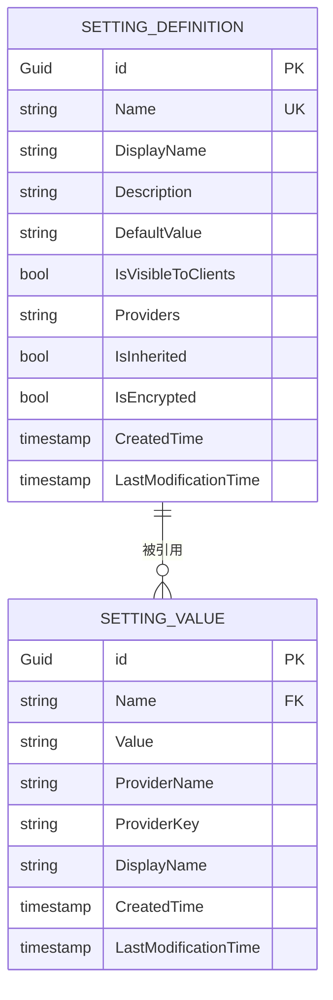
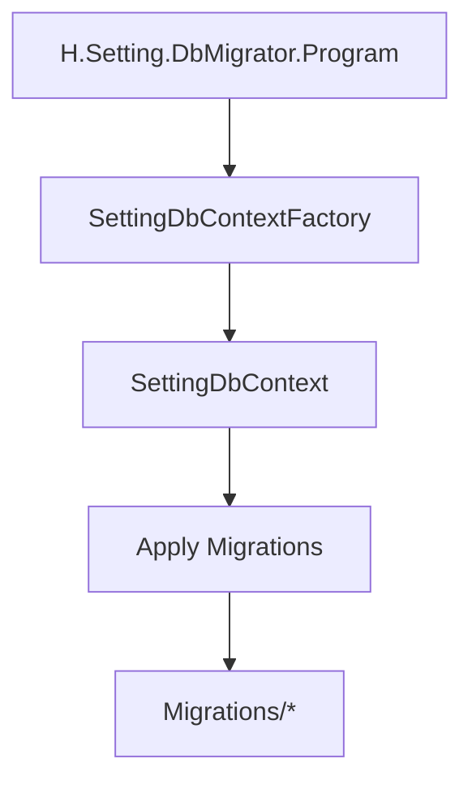
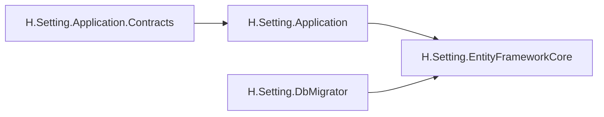

# 配置服务

<cite>
**本文引用的文件**   
- [SettingDefinitionDtos.cs](file://src/Services/Setting/H.Setting.Application.Contracts/Dtos/SettingDefinitionDtos.cs)
- [SettingValueDtos.cs](file://src/Services/Setting/H.Setting.Application.Contracts/Dtos/SettingValueDtos.cs)
- [ISettingDefinitionAppService.cs](file://src/Services/Setting/H.Setting.Application.Contracts/Services/ISettingDefinitionAppService.cs)
- [ISettingValueAppService.cs](file://src/Services/Setting/H.Setting.Application.Contracts/Services/ISettingValueAppService.cs)
- [SettingApplicationContractsModule.cs](file://src/Services/Setting/H.Setting.Application.Contracts/SettingApplicationContractsModule.cs)
- [SettingDefinitionAppService.cs](file://src/Services/Setting/H.Setting.Application/Services/SettingDefinitionAppService.cs)
- [SettingValueAppService.cs](file://src/Services/Setting/H.Setting.Application/Services/SettingValueAppService.cs)
- [SettingDefinition.cs](file://src/Services/Setting/H.Setting.EntityFrameworkCore/Entities/SettingDefinition.cs)
- [SettingValue.cs](file://src/Services/Setting/H.Setting.EntityFrameworkCore/Entities/SettingValue.cs)
- [SettingDbContext.cs](file://src/Services/Setting/H.Setting.EntityFrameworkCore/SettingDbContext.cs)
- [SettingEntityFrameworkCoreModule.cs](file://src/Services/Setting/H.Setting.EntityFrameworkCore/SettingEntityFrameworkCoreModule.cs)
- [Program.cs](file://src/Tools/H.Setting.DbMigrator/Program.cs)
- [SettingDbContextFactory.cs](file://src/Tools/H.Setting.DbMigrator/SettingDbContextFactory.cs)
- [20260724162708_InitSetting.cs](file://src/Tools/H.Setting.DbMigrator/Migrations/20260724162708_InitSetting.cs)
- [20260801151929_Drop_IsDelete.cs](file://src/Tools/H.Setting.DbMigrator/Migrations/20260801151929_Drop_IsDelete.cs)
- [SettingDbContextModelSnapshot.cs](file://src/Tools/H.Setting.DbMigrator/Migrations/SettingDbContextModelSnapshot.cs)
</cite>

## 目录
1. [简介](#简介)
2. [项目结构](#项目结构)
3. [核心组件](#核心组件)
4. [架构总览](#架构总览)
5. [详细组件分析](#详细组件分析)
6. [依赖关系分析](#依赖关系分析)
7. [性能与缓存特性](#性能与缓存特性)
8. [安全特性](#安全特性)
9. [使用示例](#使用示例)
10. [故障排查](#故障排查)
11. [结论](#结论)

## 简介
本模块为 H.AppLab 的“配置服务”，围绕 ABP 的配置体系提供可扩展、可审计、可分层的键值配置管理能力。它通过“配置定义”和“配置项”两个核心概念，将配置的元数据与运行时值分离，支持全局、租户、用户三级提供者，并提供加密存储、可见性控制、继承控制等能力。同时提供独立的数据库迁移工具，确保配置相关表结构的版本化演进。

该服务对外暴露两类应用接口：
- 配置定义管理：用于注册、查询、修改、删除配置定义（即配置键的元数据）。
- 配置项管理：用于按提供者维度增删改查配置值，并支持从定义中获取下拉选择项。

当前代码库中未直接实现客户端热重载与跨进程广播机制；服务端缓存策略亦未在现有文件中显式体现。后续扩展可按文档建议引入 ABP 配置刷新事件或分布式缓存以增强实时性与一致性。

## 项目结构
配置服务由三个主要子项目构成：
- H.Setting.Application.Contracts：应用契约与 DTO，定义对外 API 的数据模型与方法。
- H.Setting.Application：应用服务实现，承载业务编排逻辑。
- H.Setting.EntityFrameworkCore：实体、DbContext 及 EF Core 模块装配。
- H.Setting.DbMigrator：独立命令行工具，负责配置服务的数据库迁移执行。

图示来源
- [ISettingDefinitionAppService.cs](file://src/Services/Setting/H.Setting.Application.Contracts/Services/ISettingDefinitionAppService.cs)
- [ISettingValueAppService.cs](file://src/Services/Setting/H.Setting.Application.Contracts/Services/ISettingValueAppService.cs)
- [SettingDefinitionDtos.cs](file://src/Services/Setting/H.Setting.Application.Contracts/Dtos/SettingDefinitionDtos.cs)
- [SettingValueDtos.cs](file://src/Services/Setting/H.Setting.Application.Contracts/Dtos/SettingValueDtos.cs)
- [SettingDefinitionAppService.cs](file://src/Services/Setting/H.Setting.Application/Services/SettingDefinitionAppService.cs)
- [SettingValueAppService.cs](file://src/Services/Setting/H.Setting.Application/Services/SettingValueAppService.cs)
- [SettingDefinition.cs](file://src/Services/Setting/H.Setting.EntityFrameworkCore/Entities/SettingDefinition.cs)
- [SettingValue.cs](file://src/Services/Setting/H.Setting.EntityFrameworkCore/Entities/SettingValue.cs)
- [SettingDbContext.cs](file://src/Services/Setting/H.Setting.EntityFrameworkCore/SettingDbContext.cs)
- [Program.cs](file://src/Tools/H.Setting.DbMigrator/Program.cs)
- [20260724162708_InitSetting.cs](file://src/Tools/H.Setting.DbMigrator/Migrations/20260724162708_InitSetting.cs)
- [20260801151929_Drop_IsDelete.cs](file://src/Tools/H.Setting.DbMigrator/Migrations/20260801151929_Drop_IsDelete.cs)

章节来源
- [SettingApplicationContractsModule.cs:1-9](file://src/Services/Setting/H.Setting.Application.Contracts/SettingApplicationContractsModule.cs#L1-L9)

## 核心组件
- 配置定义 DTO 与查询参数
  - 定义配置键的元数据，包括名称、显示名、描述、默认值、是否对客户端可见、允许提供者、是否可继承、是否加密等。
  - 新增/修改 DTO 与分页查询参数统一命名风格，便于前端表单与列表复用。
- 配置项 DTO 与常量
  - 定义配置值的实体字段，包含关联的名称、值、提供者名称、提供者键、冗余显示名。
  - 内置常用提供者常量：G=全局、T=租户、U=用户，简化上层调用。
- 应用服务接口
  - ISettingDefinitionAppService：定义配置定义的 CRUD 与分页查询。
  - ISettingValueAppService：定义配置项的 CRUD、分页查询以及定义下拉选项查询。
- 领域实体与上下文
  - SettingDefinition 与 SettingValue 对应持久化模型。
  - SettingDbContext 提供 DbSet 访问入口，供应用服务进行数据读写。
- 迁移工具
  - Program 作为迁移工具入口。
  - 初始化与变更迁移脚本管理表结构演进。

章节来源
- [SettingDefinitionDtos.cs:1-57](file://src/Services/Setting/H.Setting.Application.Contracts/Dtos/SettingDefinitionDtos.cs#L1-L57)
- [SettingValueDtos.cs:1-72](file://src/Services/Setting/H.Setting.Application.Contracts/Dtos/SettingValueDtos.cs#L1-L72)
- [ISettingDefinitionAppService.cs:1-16](file://src/Services/Setting/H.Setting.Application.Contracts/Services/ISettingDefinitionAppService.cs#L1-L16)
- [ISettingValueAppService.cs:1-19](file://src/Services/Setting/H.Setting.Application.Contracts/Services/ISettingValueAppService.cs#L1-L19)

## 架构总览
配置服务采用典型三层结构：契约层定义对外 API，应用层实现业务编排，EF Core 层完成持久化。迁移工具独立运行，保障数据库结构与应用版本一致。

图示来源
- [SettingDefinitionDtos.cs:1-57](file://src/Services/Setting/H.Setting.Application.Contracts/Dtos/SettingDefinitionDtos.cs#L1-L57)
- [SettingValueDtos.cs:1-72](file://src/Services/Setting/H.Setting.Application.Contracts/Dtos/SettingValueDtos.cs#L1-L72)

## 详细组件分析

### 配置定义（元数据）
配置定义用于声明系统可用的配置键及其行为属性，例如：
- Name：唯一标识，作为配置项的关联键。
- Providers：逗号分隔的允许提供者集合，如 G,T,U。
- IsInherited：是否允许下层提供者继承上层值。
- IsEncrypted：值是否需要加密存储。
- IsVisibleToClients：是否向客户端暴露。

这些属性直接影响配置值的读取优先级、可见性与安全性。

图示来源
- [ISettingDefinitionAppService.cs:1-16](file://src/Services/Setting/H.Setting.Application.Contracts/Services/ISettingDefinitionAppService.cs#L1-L16)
- [SettingDefinitionDtos.cs:1-57](file://src/Services/Setting/H.Setting.Application.Contracts/Dtos/SettingDefinitionDtos.cs#L1-L57)

章节来源
- [SettingDefinitionDtos.cs:1-57](file://src/Services/Setting/H.Setting.Application.Contracts/Dtos/SettingDefinitionDtos.cs#L1-L57)
- [ISettingDefinitionAppService.cs:1-16](file://src/Services/Setting/H.Setting.Application.Contracts/Services/ISettingDefinitionAppService.cs#L1-L16)

### 配置项（键值对）
配置项表示某一配置定义在特定提供者维度下的具体值，支持：
- ProviderName：G=全局、T=租户、U=用户。
- ProviderKey：当 ProviderName 为 T 或 U 时，需设置对应的租户 ID 或用户 ID。
- DisplayName：冗余字段，用于列表快速展示。
- Value：实际配置值，若定义标记为加密则应加密后存储。

图示来源
- [ISettingValueAppService.cs:1-19](file://src/Services/Setting/H.Setting.Application.Contracts/Services/ISettingValueAppService.cs#L1-L19)
- [SettingValueDtos.cs:1-72](file://src/Services/Setting/H.Setting.Application.Contracts/Dtos/SettingValueDtos.cs#L1-L72)

章节来源
- [ISettingValueAppService.cs:1-19](file://src/Services/Setting/H.Setting.Application.Contracts/Services/ISettingValueAppService.cs#L1-L19)
- [SettingValueDtos.cs:1-72](file://src/Services/Setting/H.Setting.Application.Contracts/Dtos/SettingValueDtos.cs#L1-L72)

### 配置值提供者层次与优先级
虽然当前代码未直接实现 ABP 的 SettingManager 级联读取逻辑，但通过以下字段已具备分层语义：
- ProviderName 区分层级：全局 > 租户 > 用户。
- ProviderKey 定位具体租户或用户。
- SettingDefinition.Providers 限定允许使用的提供者集合。
- SettingDefinition.IsInherited 指示是否允许下层继承上层值。

典型优先级规则（建议实现方式）：
1. 先查找最细粒度提供者（用户），若无则回退到租户，再回退到全局。
2. 若定义允许继承且更高层存在值，则合并或覆盖策略由业务决定。
3. 若定义限制 Providers，则忽略不允许的提供者。

图示来源
- [SettingValueDtos.cs:1-72](file://src/Services/Setting/H.Setting.Application.Contracts/Dtos/SettingValueDtos.cs#L1-L72)
- [SettingDefinitionDtos.cs:1-57](file://src/Services/Setting/H.Setting.Application.Contracts/Dtos/SettingDefinitionDtos.cs#L1-L57)

### 数据模型与持久化
领域实体与 DbContext 负责持久化配置定义与配置项。EF Core 模块用于在宿主程序中注册数据库上下文。

图示来源
- [SettingDefinition.cs](file://src/Services/Setting/H.Setting.EntityFrameworkCore/Entities/SettingDefinition.cs)
- [SettingValue.cs](file://src/Services/Setting/H.Setting.EntityFrameworkCore/Entities/SettingValue.cs)
- [SettingDbContext.cs](file://src/Services/Setting/H.Setting.EntityFrameworkCore/SettingDbContext.cs)

章节来源
- [SettingDefinition.cs](file://src/Services/Setting/H.Setting.EntityFrameworkCore/Entities/SettingDefinition.cs)
- [SettingValue.cs](file://src/Services/Setting/H.Setting.EntityFrameworkCore/Entities/SettingValue.cs)
- [SettingDbContext.cs](file://src/Services/Setting/H.Setting.EntityFrameworkCore/SettingDbContext.cs)

### 数据库迁移
迁移工具 H.Setting.DbMigrator 提供独立可执行程序，用于在部署阶段执行数据库迁移。其入口 Program 与工厂类 SettingDbContextFactory 配合，使用 EF Core 迁移脚本保证结构演进。

图示来源
- [Program.cs](file://src/Tools/H.Setting.DbMigrator/Program.cs)
- [SettingDbContextFactory.cs](file://src/Tools/H.Setting.DbMigrator/SettingDbContextFactory.cs)
- [20260724162708_InitSetting.cs](file://src/Tools/H.Setting.DbMigrator/Migrations/20260724162708_InitSetting.cs)
- [20260801151929_Drop_IsDelete.cs](file://src/Tools/H.Setting.DbMigrator/Migrations/20260801151929_Drop_IsDelete.cs)
- [SettingDbContextModelSnapshot.cs](file://src/Tools/H.Setting.DbMigrator/Migrations/SettingDbContextModelSnapshot.cs)

章节来源
- [Program.cs](file://src/Tools/H.Setting.DbMigrator/Program.cs)
- [SettingDbContextFactory.cs](file://src/Tools/H.Setting.DbMigrator/SettingDbContextFactory.cs)
- [20260724162708_InitSetting.cs](file://src/Tools/H.Setting.DbMigrator/Migrations/20260724162708_InitSetting.cs)
- [20260801151929_Drop_IsDelete.cs](file://src/Tools/H.Setting.DbMigrator/Migrations/20260801151929_Drop_IsDelete.cs)
- [SettingDbContextModelSnapshot.cs](file://src/Tools/H.Setting.DbMigrator/Migrations/SettingDbContextModelSnapshot.cs)

## 依赖关系分析
- 契约层不依赖应用层与持久化层，仅定义接口与 DTO，利于前后端解耦与远程代理生成。
- 应用层依赖契约层接口，并通过 EF Core 上下文访问数据库。
- EF Core 模块通过模块装配类注入 DbContext 与实体映射。
- 迁移工具独立于应用服务，避免启动依赖。

图示来源
- [SettingApplicationContractsModule.cs:1-9](file://src/Services/Setting/H.Setting.Application.Contracts/SettingApplicationContractsModule.cs#L1-L9)
- [SettingEntityFrameworkCoreModule.cs](file://src/Services/Setting/H.Setting.EntityFrameworkCore/SettingEntityFrameworkCoreModule.cs)

章节来源
- [SettingApplicationContractsModule.cs:1-9](file://src/Services/Setting/H.Setting.Application.Contracts/SettingApplicationContractsModule.cs#L1-L9)
- [SettingEntityFrameworkCoreModule.cs](file://src/Services/Setting/H.Setting.EntityFrameworkCore/SettingEntityFrameworkCoreModule.cs)

## 性能与缓存特性
- 当前代码未显式实现内存缓存或分布式缓存。建议在应用服务层引入 ABP 的 SettingManager 或自定义缓存层，基于 Key(Name+ProviderName+ProviderKey) 做短 TTL 缓存，降低数据库压力。
- 对于只读场景，可在网关或前端侧结合 CDN/浏览器缓存减少重复请求。
- 批量操作（如导入导出）应在应用层使用事务与批量写入，避免逐条提交。

[本节为通用性能建议，不直接分析具体源码]

## 安全特性
- 加密存储
  - SettingDefinition 提供 IsEncrypted 标志位，用于标识配置值是否需要加密。
  - 建议在 SettingValueAppService 的写路径中对 Value 进行加密，并在读路径解密；敏感配置应避免落盘明文。
- 可见性控制
  - IsVisibleToClients 用于控制定义是否向客户端暴露，防止敏感配置被前端误用。
- 提供者约束
  - Providers 字段限定允许的提供者集合，避免非法提供者写入。
- 审计字段
  - DTO 继承 AuditedEntityDto，自动记录创建与修改时间，便于审计追踪。

章节来源
- [SettingDefinitionDtos.cs:1-57](file://src/Services/Setting/H.Setting.Application.Contracts/Dtos/SettingDefinitionDtos.cs#L1-L57)
- [SettingValueDtos.cs:1-72](file://src/Services/Setting/H.Setting.Application.Contracts/Dtos/SettingValueDtos.cs#L1-L72)

## 使用示例

### 应用参数配置
- 步骤：
  1. 通过 ISettingDefinitionAppService 创建配置定义，指定 Name、DisplayName、DefaultValue、IsVisibleToClients、Providers、IsInherited、IsEncrypted。
  2. 通过 ISettingValueAppService 为不同提供者设置具体值。
  3. 业务代码按需读取配置值，遵循提供者优先级规则。

参考接口与 DTO
- [ISettingDefinitionAppService.cs:1-16](file://src/Services/Setting/H.Setting.Application.Contracts/Services/ISettingDefinitionAppService.cs#L1-L16)
- [ISettingValueAppService.cs:1-19](file://src/Services/Setting/H.Setting.Application.Contracts/Services/ISettingValueAppService.cs#L1-L19)
- [SettingDefinitionDtos.cs:1-57](file://src/Services/Setting/H.Setting.Application.Contracts/Dtos/SettingDefinitionDtos.cs#L1-L57)
- [SettingValueDtos.cs:1-72](file://src/Services/Setting/H.Setting.Application.Contracts/Dtos/SettingValueDtos.cs#L1-L72)

### 功能开关控制
- 将某功能开关定义为布尔型字符串值，IsVisibleToClients=false 隐藏给前端，仅在服务端启用。
- 通过租户或用户级别覆盖默认开关状态，实现精细化控制。

参考字段
- [SettingDefinitionDtos.cs:1-57](file://src/Services/Setting/H.Setting.Application.Contracts/Dtos/SettingDefinitionDtos.cs#L1-L57)
- [SettingValueDtos.cs:1-72](file://src/Services/Setting/H.Setting.Application.Contracts/Dtos/SettingValueDtos.cs#L1-L72)

### 国际化设置
- 将语言包 URL、字体资源等作为配置项，IsVisibleToClients=true 允许前端获取。
- 通过全局或租户级别切换语言包地址，支持多租户差异化主题与文案。

参考字段
- [SettingDefinitionDtos.cs:1-57](file://src/Services/Setting/H.Setting.Application.Contracts/Dtos/SettingDefinitionDtos.cs#L1-L57)
- [SettingValueDtos.cs:1-72](file://src/Services/Setting/H.Setting.Application.Contracts/Dtos/SettingValueDtos.cs#L1-L72)

### 配置项编辑时的定义下拉
- 调用 ISettingValueAppService.GetDefinitionLookupAsync 获取可用定义列表，前端渲染下拉框。
- 下拉项包含 Name、DisplayName、DefaultValue，便于预览默认值。

参考接口
- [ISettingValueAppService.cs:1-19](file://src/Services/Setting/H.Setting.Application.Contracts/Services/ISettingValueAppService.cs#L1-L19)
- [SettingValueDtos.cs:1-72](file://src/Services/Setting/H.Setting.Application.Contracts/Dtos/SettingValueDtos.cs#L1-L72)

## 故障排查
- 配置项无法保存
  - 检查 Name 是否已在 SettingDefinition 中存在。
  - 检查 ProviderName 是否在定义允许的 Providers 列表中。
  - 检查 ProviderKey 是否为空（当 ProviderName 为 T/U 时必须填写）。
- 读取不到预期值
  - 确认提供者优先级是否正确：用户 > 租户 > 全局。
  - 检查 IsInherited 是否开启，以及更高层是否有值。
- 加密值异常
  - 检查 IsEncrypted 是否与读写加解密逻辑一致。
  - 检查存储的值是否已正确加密/解密。
- 迁移失败
  - 确认 H.Setting.DbMigrator 已正确连接目标数据库。
  - 检查迁移脚本顺序与模型快照是否一致。

章节来源
- [ISettingDefinitionAppService.cs:1-16](file://src/Services/Setting/H.Setting.Application.Contracts/Services/ISettingDefinitionAppService.cs#L1-L16)
- [ISettingValueAppService.cs:1-19](file://src/Services/Setting/H.Setting.Application.Contracts/Services/ISettingValueAppService.cs#L1-L19)
- [SettingDefinitionDtos.cs:1-57](file://src/Services/Setting/H.Setting.Application.Contracts/Dtos/SettingDefinitionDtos.cs#L1-L57)
- [SettingValueDtos.cs:1-72](file://src/Services/Setting/H.Setting.Application.Contracts/Dtos/SettingValueDtos.cs#L1-L72)
- [Program.cs](file://src/Tools/H.Setting.DbMigrator/Program.cs)
- [SettingDbContextFactory.cs](file://src/Tools/H.Setting.DbMigrator/SettingDbContextFactory.cs)

## 结论
H.AppLab 配置服务通过“定义+值”的双模型设计，实现了可配置、可审计、可扩展的配置管理能力。当前代码提供了清晰的契约层、应用层与持久化层，并配有独立的迁移工具。为实现完整的生产级体验，建议后续补充：
- 服务端缓存与失效策略（如基于 Key 的短 TTL 缓存）。
- 客户端同步与热重载（通过事件总线或 WebSocket 推送变更）。
- 配置备份与恢复（导出/导入 JSON 或 CSV）。
- 版本管理与灰度发布（结合 Git 或配置中心）。
- 审计日志与权限控制（对接 ABP 审计与权限框架）。

[本节为总结性内容，不直接分析具体源码]