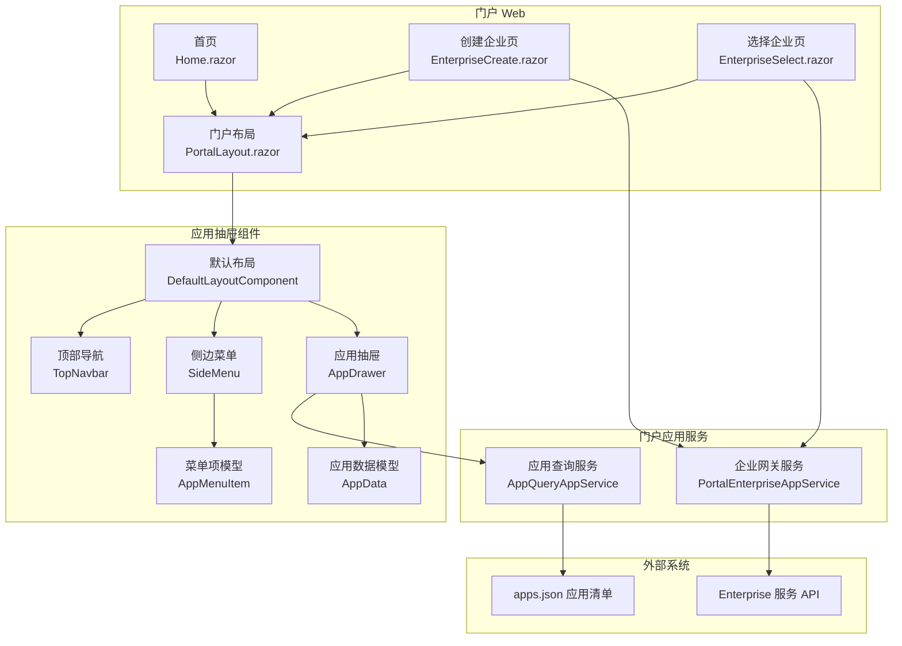
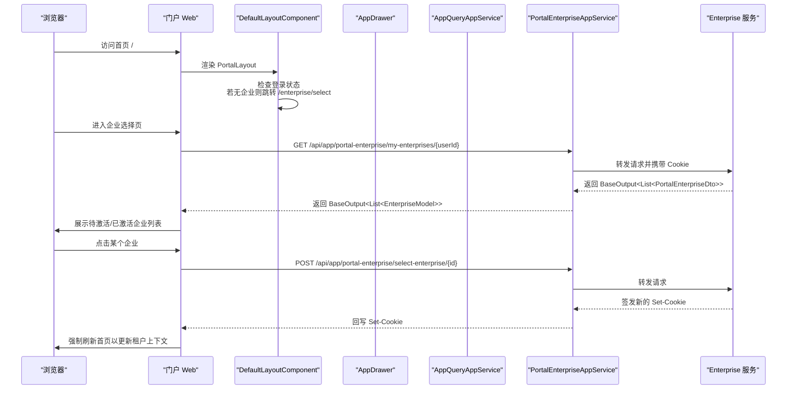
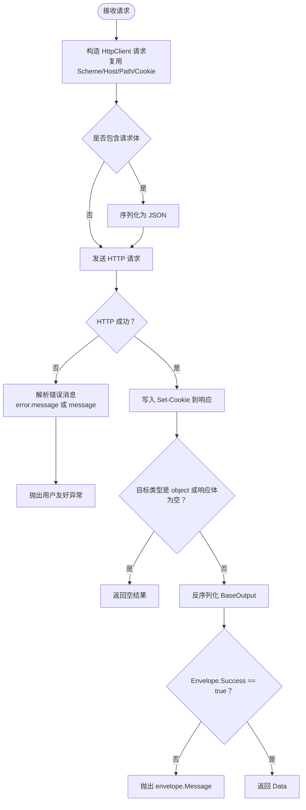
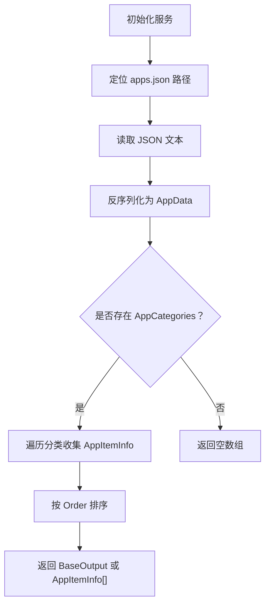
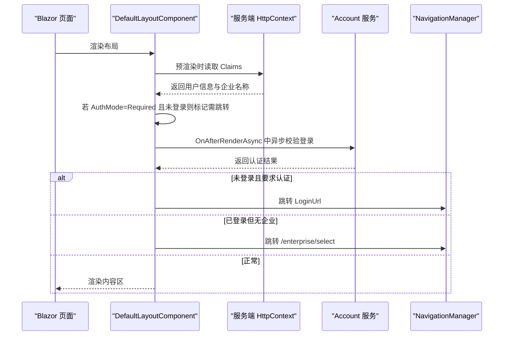
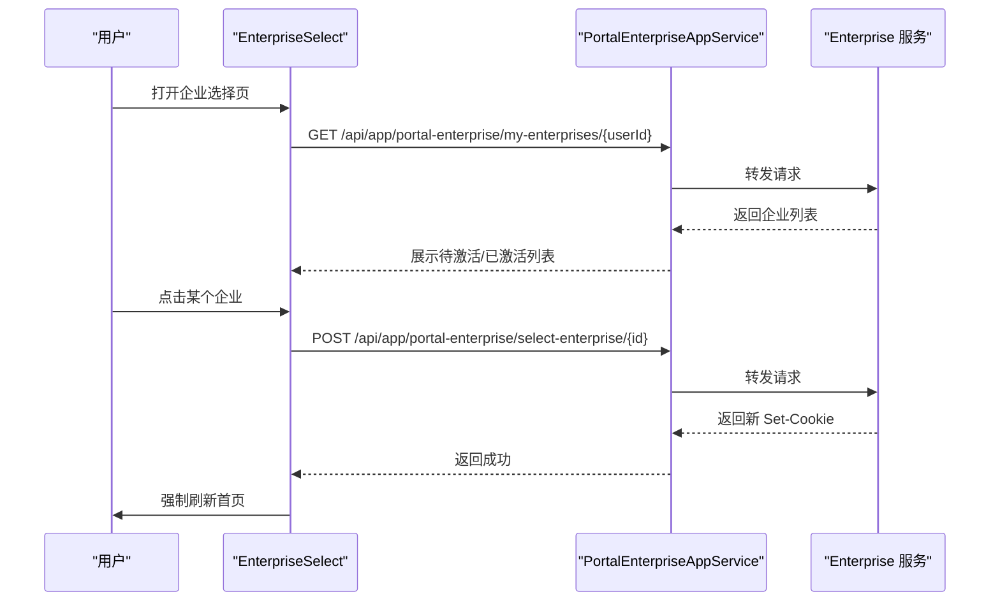
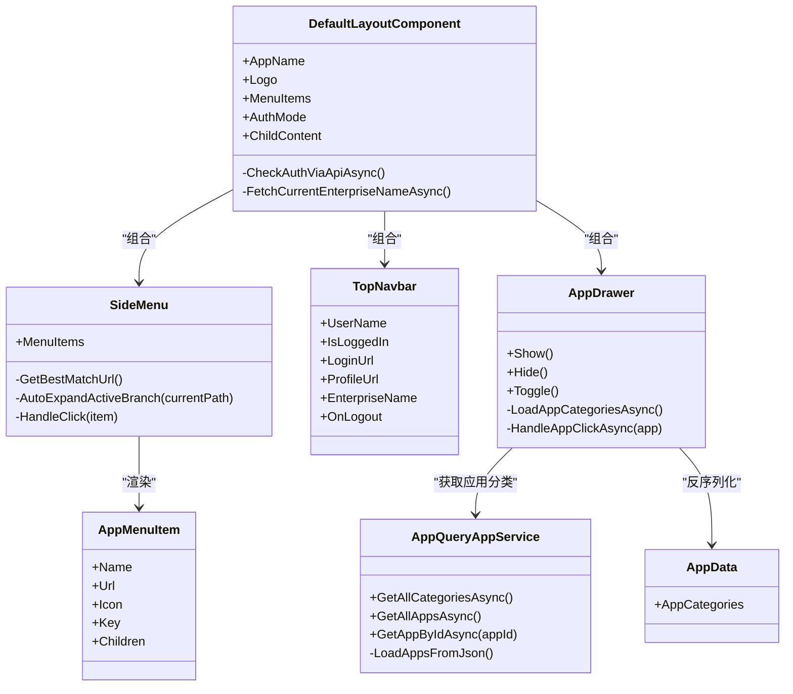
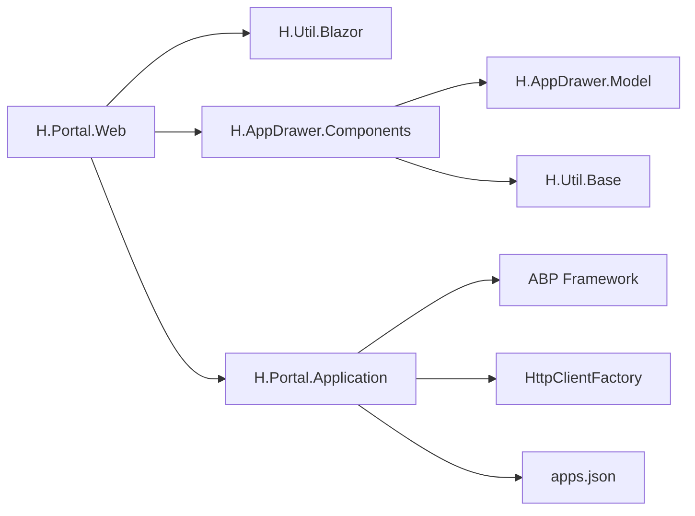

# 门户服务

<cite>
**本文引用的文件**   
- [README.md](file://README.md)
- [PortalEnterpriseAppService.cs](file://src/Services/Portal/H.Portal.Application/Services/PortalEnterpriseAppService.cs)
- [PortalEnterpriseDtos.cs](file://src/Services/Portal/H.Portal.Application/Dtos/PortalEnterpriseDtos.cs)
- [AppQueryAppService.cs](file://src/Services/Portal/H.Portal.Application/Services/AppQueryAppService.cs)
- [Home.razor](file://src/Services/Portal/H.Portal.Web/Pages/Home.razor)
- [PortalLayout.razor](file://src/Services/Portal/H.Portal.Web/Layout/PortalLayout.razor)
- [EnterpriseCreate.razor](file://src/Services/Portal/H.Portal.Web/Pages/Enterprise/EnterpriseCreate.razor)
- [EnterpriseSelect.razor](file://src/Services/Portal/H.Portal.Web/Pages/Enterprise/EnterpriseSelect.razor)
- [EnterpriseModels.cs](file://src/Services/Portal/H.Portal.Web/Models/EnterpriseModels.cs)
- [DefaultLayoutComponent.razor](file://src/Components/AppDrawer/H.AppDrawer.Components/Components/DefaultLayoutComponent.razor)
- [AppDrawer.razor](file://src/Components/AppDrawer/H.AppDrawer.Components/Components/AppDrawer.razor)
- [SideMenu.razor](file://src/Components/AppDrawer/H.AppDrawer.Components/Components/SideMenu.razor)
- [TopNavbar.razor](file://src/Components/AppDrawer/H.AppDrawer.Components/Components/TopNavbar.razor)
- [AppMenuItem.cs](file://src/Components/AppDrawer/H.AppDrawer.Model/AppMenuItem.cs)
- [AppData.cs](file://src/Components/AppDrawer/H.AppDrawer.Model/AppData.cs)
</cite>

## 目录
1. [引言](#引言)
2. [项目结构](#项目结构)
3. [核心组件](#核心组件)
4. [架构总览](#架构总览)
5. [详细组件分析](#详细组件分析)
6. [依赖关系分析](#依赖关系分析)
7. [性能与可扩展性](#性能与可扩展性)
8. [故障排查指南](#故障排查指南)
9. [结论](#结论)
10. [附录：常见使用场景](#附录常见使用场景)

## 引言
H.AppLab 门户服务模块围绕“多应用聚合、页面布局与菜单管理、企业隔离与切换”展开。它通过一个轻量级 Blazor Web 应用提供门户入口，将系统级企业能力与应用元数据解耦，并以可复用的 AppDrawer 组件统一整体布局、顶部导航、侧边菜单与应用抽屉。后端以 ABP Application Service 暴露网关接口，把认证 Cookie 转发给下游 Enterprise 服务，从而在不引入编译期 System 层依赖的前提下完成企业创建、查询与切换；同时通过 JSON 文件加载应用分类与应用清单，为前端抽屉、菜单等提供统一的数据源。

## 项目结构
门户相关代码分为两部分：
- 服务端应用层：`H.Portal.Application` 暴露门户网关接口和应用查询接口。
- 客户端 Web 层：`H.Portal.Web` 提供首页、企业选择/创建页面以及统一的门户布局。
- 共享 UI 组件：`H.AppDrawer.Components` 与 `H.AppDrawer.Model` 提供默认布局、顶部导航、侧边菜单、应用抽屉及菜单模型。

图示来源
- [Home.razor:1-7](file://src/Services/Portal/H.Portal.Web/Pages/Home.razor#L1-L7)
- [PortalLayout.razor:1-9](file://src/Services/Portal/H.Portal.Web/Layout/PortalLayout.razor#L1-L9)
- [EnterpriseCreate.razor:1-115](file://src/Services/Portal/H.Portal.Web/Pages/Enterprise/EnterpriseCreate.razor#L1-L115)
- [EnterpriseSelect.razor:1-233](file://src/Services/Portal/H.Portal.Web/Pages/Enterprise/EnterpriseSelect.razor#L1-L233)
- [AppQueryAppService.cs:1-141](file://src/Services/Portal/H.Portal.Application/Services/AppQueryAppService.cs#L1-L141)
- [PortalEnterpriseAppService.cs:1-163](file://src/Services/Portal/H.Portal.Application/Services/PortalEnterpriseAppService.cs#L1-L163)
- [DefaultLayoutComponent.razor:1-200](file://src/Components/AppDrawer/H.AppDrawer.Components/Components/DefaultLayoutComponent.razor#L1-L200)
- [TopNavbar.razor:1-200](file://src/Components/AppDrawer/H.AppDrawer.Components/Components/TopNavbar.razor#L1-L200)
- [SideMenu.razor:1-200](file://src/Components/AppDrawer/H.AppDrawer.Components/Components/SideMenu.razor#L1-L200)
- [AppDrawer.razor:1-200](file://src/Components/AppDrawer/H.AppDrawer.Components/Components/AppDrawer.razor#L1-L200)
- [AppMenuItem.cs:1-21](file://src/Components/AppDrawer/H.AppDrawer.Model/AppMenuItem.cs#L1-L21)
- [AppData.cs:1-9](file://src/Components/AppDrawer/H.AppDrawer.Model/AppData.cs#L1-L9)

章节来源
- [README.md:1-73](file://README.md#L1-L73)

## 核心组件
- 门户企业网关服务：对外暴露 `/api/app/portal-enterprise/*`，内部通过 `HttpClient` 调用同宿主的 Enterprise 服务，并透传 Cookie、回写 Set-Cookie，实现认证上下文与企业租户上下文传递。
- 应用查询服务：从 `data/apps.json` 或仓库路径下的 `System/SystemPortal/data/apps.json` 读取应用分类与应用清单，供 AppDrawer 展示。
- 门户布局与页面：PortalLayout 包裹 DefaultLayoutComponent，Home 作为入口；EnterpriseCreate 与 EnterpriseSelect 负责企业注册与选择流程。
- 应用抽屉组件族：DefaultLayoutComponent 统一布局、认证检查与企业引导；TopNavbar 提供登录、用户下拉、组织切换入口；SideMenu 渲染带层级和激活态的菜单；AppDrawer 拉取应用列表并支持新标签页或当前页打开。

章节来源
- [PortalEnterpriseAppService.cs:1-163](file://src/Services/Portal/H.Portal.Application/Services/PortalEnterpriseAppService.cs#L1-L163)
- [AppQueryAppService.cs:1-141](file://src/Services/Portal/H.Portal.Application/Services/AppQueryAppService.cs#L1-L141)
- [PortalLayout.razor:1-9](file://src/Services/Portal/H.Portal.Web/Layout/PortalLayout.razor#L1-L9)
- [Home.razor:1-7](file://src/Services/Portal/H.Portal.Web/Pages/Home.razor#L1-L7)
- [EnterpriseCreate.razor:1-115](file://src/Services/Portal/H.Portal.Web/Pages/Enterprise/EnterpriseCreate.razor#L1-L115)
- [EnterpriseSelect.razor:1-233](file://src/Services/Portal/H.Portal.Web/Pages/Enterprise/EnterpriseSelect.razor#L1-L233)
- [DefaultLayoutComponent.razor:1-200](file://src/Components/AppDrawer/H.AppDrawer.Components/Components/DefaultLayoutComponent.razor#L1-L200)
- [TopNavbar.razor:1-200](file://src/Components/AppDrawer/H.AppDrawer.Components/Components/TopNavbar.razor#L1-L200)
- [SideMenu.razor:1-200](file://src/Components/AppDrawer/H.AppDrawer.Components/Components/SideMenu.razor#L1-L200)
- [AppDrawer.razor:1-200](file://src/Components/AppDrawer/H.AppDrawer.Components/Components/AppDrawer.razor#L1-L200)

## 架构总览
门户服务采用“网关 + 静态配置 + 可复用布局组件”的架构：
- 网关层：PortalEnterpriseAppService 是门户与 Enterprise 之间的薄封装，避免前端直接依赖 Enterprise 契约，也避免门户服务对 System 层产生编译期耦合。
- 配置层：AppQueryAppService 基于 JSON 文件维护应用分类与应用清单，便于快速扩展新应用而无需改动业务服务。
- 表现层：PortalLayout 注入 DefaultLayoutComponent，统一管理认证、企业名称显示、未登录跳转、无企业时跳转到企业选择流程。
- 交互层：TopNavbar 提供登录、个人资料、退出、组织切换；SideMenu 根据路由匹配高亮菜单；AppDrawer 拉取应用列表并支持不同打开方式。

图示来源
- [PortalLayout.razor:1-9](file://src/Services/Portal/H.Portal.Web/Layout/PortalLayout.razor#L1-L9)
- [DefaultLayoutComponent.razor:1-200](file://src/Components/AppDrawer/H.AppDrawer.Components/Components/DefaultLayoutComponent.razor#L1-L200)
- [EnterpriseSelect.razor:1-233](file://src/Services/Portal/H.Portal.Web/Pages/Enterprise/EnterpriseSelect.razor#L1-L233)
- [PortalEnterpriseAppService.cs:1-163](file://src/Services/Portal/H.Portal.Application/Services/PortalEnterpriseAppService.cs#L1-L163)

## 详细组件分析

### 门户企业网关服务
该服务是门户服务的关键编排者，承担以下职责：
- 获取当前用户的企业列表。
- 创建企业（用户自行注册，后续由管理员激活）。
- 切换企业：调用 Enterprise 服务重新签发包含企业信息的 Cookie，并通过响应头回传给浏览器。
- 错误处理：兼容 ABP 错误体与普通响应体，提取 message 或 error.message 字段转换为友好提示。

图示来源
- [PortalEnterpriseAppService.cs:1-163](file://src/Services/Portal/H.Portal.Application/Services/PortalEnterpriseAppService.cs#L1-L163)

章节来源
- [PortalEnterpriseAppService.cs:1-163](file://src/Services/Portal/H.Portal.Application/Services/PortalEnterpriseAppService.cs#L1-L163)
- [PortalEnterpriseDtos.cs:1-49](file://src/Services/Portal/H.Portal.Application/Dtos/PortalEnterpriseDtos.cs#L1-L49)

### 应用查询服务
该服务只读地读取应用清单，为 AppDrawer 提供应用分类与应用信息。其关键特性包括：
- 自动定位 `data/apps.json`：优先从工作目录或输出目录查找；若不存在则向上递归搜索仓库中的 `System/SystemPortal/data/apps.json`。
- 提供三类接口：获取所有分类、扁平化获取全部应用、按 ID 获取单个应用。
- 容错加载：JSON 缺失或解析失败时返回空集合，避免阻塞门户功能。

图示来源
- [AppQueryAppService.cs:1-141](file://src/Services/Portal/H.Portal.Application/Services/AppQueryAppService.cs#L1-L141)
- [AppData.cs:1-9](file://src/Components/AppDrawer/H.AppDrawer.Model/AppData.cs#L1-L9)

章节来源
- [AppQueryAppService.cs:1-141](file://src/Services/Portal/H.Portal.Application/Services/AppQueryAppService.cs#L1-L141)
- [AppData.cs:1-9](file://src/Components/AppDrawer/H.AppDrawer.Model/AppData.cs#L1-L9)

### 门户布局与认证流程
PortalLayout 使用 DefaultLayoutComponent 提供统一布局，并通过 AuthenticationMode.Optional 允许匿名访问入口，但组件内部会根据登录状态和企业上下文做智能跳转：
- 服务端预渲染阶段：通过 HttpContext 快速获取用户名、企业名称和登录状态。
- WASM 首次渲染后：异步调用账户接口验证 Cookie；若未登录且要求认证则跳转登录页；若已登录但没有企业则重定向至 `/enterprise/select`。
- 用户名与企业名展示：在 TopNavbar 的用户下拉中显示，并提供“组织切换”入口。

图示来源
- [PortalLayout.razor:1-9](file://src/Services/Portal/H.Portal.Web/Layout/PortalLayout.razor#L1-L9)
- [DefaultLayoutComponent.razor:1-200](file://src/Components/AppDrawer/H.AppDrawer.Components/Components/DefaultLayoutComponent.razor#L1-L200)

章节来源
- [PortalLayout.razor:1-9](file://src/Services/Portal/H.Portal.Web/Layout/PortalLayout.razor#L1-L9)
- [DefaultLayoutComponent.razor:1-200](file://src/Components/AppDrawer/H.AppDrawer.Components/Components/DefaultLayoutComponent.razor#L1-L200)

### 企业选择与创建流程
企业选择页面在企业列表为空、待激活或已有激活企业时分别展示不同界面，并与网关服务交互：
- 未登录：引导去登录，登录后再次加载企业列表。
- 无企业：展示“创建企业”按钮，提交后跳转到企业选择页查看激活状态。
- 切换企业：POST 调用网关选择企业，成功后强制刷新首页以更新 Cookie 中的租户信息。

图示来源
- [EnterpriseSelect.razor:1-233](file://src/Services/Portal/H.Portal.Web/Pages/Enterprise/EnterpriseSelect.razor#L1-L233)
- [PortalEnterpriseAppService.cs:1-163](file://src/Services/Portal/H.Portal.Application/Services/PortalEnterpriseAppService.cs#L1-L163)

章节来源
- [EnterpriseSelect.razor:1-233](file://src/Services/Portal/H.Portal.Web/Pages/Enterprise/EnterpriseSelect.razor#L1-L233)
- [EnterpriseCreate.razor:1-115](file://src/Services/Portal/H.Portal.Web/Pages/Enterprise/EnterpriseCreate.razor#L1-L115)
- [EnterpriseModels.cs:1-29](file://src/Services/Portal/H.Portal.Web/Models/EnterpriseModels.cs#L1-L29)

### 应用抽屉与菜单机制
AppDrawer 负责从 AppQueryAppService 拉取应用分类，并在抽屉中展示每个应用的图标、名称和目标打开方式；SideMenu 负责渲染侧边栏菜单并根据路由高亮当前菜单项，自动展开祖先节点。

图示来源
- [AppDrawer.razor:1-200](file://src/Components/AppDrawer/H.AppDrawer.Components/Components/AppDrawer.razor#L1-L200)
- [AppQueryAppService.cs:1-141](file://src/Services/Portal/H.Portal.Application/Services/AppQueryAppService.cs#L1-L141)
- [DefaultLayoutComponent.razor:1-200](file://src/Components/AppDrawer/H.AppDrawer.Components/Components/DefaultLayoutComponent.razor#L1-L200)
- [TopNavbar.razor:1-200](file://src/Components/AppDrawer/H.AppDrawer.Components/Components/TopNavbar.razor#L1-L200)
- [SideMenu.razor:1-200](file://src/Components/AppDrawer/H.AppDrawer.Components/Components/SideMenu.razor#L1-L200)
- [AppMenuItem.cs:1-21](file://src/Components/AppDrawer/H.AppDrawer.Model/AppMenuItem.cs#L1-L21)
- [AppData.cs:1-9](file://src/Components/AppDrawer/H.AppDrawer.Model/AppData.cs#L1-L9)

章节来源
- [AppDrawer.razor:1-200](file://src/Components/AppDrawer/H.AppDrawer.Components/Components/AppDrawer.razor#L1-L200)
- [SideMenu.razor:1-200](file://src/Components/AppDrawer/H.AppDrawer.Components/Components/SideMenu.razor#L1-L200)
- [TopNavbar.razor:1-200](file://src/Components/AppDrawer/H.AppDrawer.Components/Components/TopNavbar.razor#L1-L200)
- [AppMenuItem.cs:1-21](file://src/Components/AppDrawer/H.AppDrawer.Model/AppMenuItem.cs#L1-L21)
- [AppData.cs:1-9](file://src/Components/AppDrawer/H.AppDrawer.Model/AppData.cs#L1-L9)

## 依赖关系分析
门户服务在运行时依赖如下：
- ABP 框架：Application Service、RemoteService、AbpModule、IAppService 约定。
- .NET HttpClientFactory：用于门户网关转发 Enterprise 请求。
- Blazor 运行时：Razor 组件、NavigationManager、IJSRuntime、HttpContextAccessor。
- AppDrawer 组件库：DefaultLayoutComponent、TopNavbar、SideMenu、AppDrawer。
- JSON 文件系统：apps.json 提供应用分类与应用清单。

图示来源
- [AppQueryAppService.cs:1-141](file://src/Services/Portal/H.Portal.Application/Services/AppQueryAppService.cs#L1-L141)
- [PortalEnterpriseAppService.cs:1-163](file://src/Services/Portal/H.Portal.Application/Services/PortalEnterpriseAppService.cs#L1-L163)
- [DefaultLayoutComponent.razor:1-200](file://src/Components/AppDrawer/H.AppDrawer.Components/Components/DefaultLayoutComponent.razor#L1-L200)

章节来源
- [README.md:1-73](file://README.md#L1-L73)

## 性能与可扩展性
- 应用清单加载：AppQueryAppService 在服务启动时定位 JSON 文件，并在每次请求时读取并反序列化。由于应用数量通常较小，该方案简单可靠；若未来应用规模扩大，可考虑缓存 AppData 或使用远端配置中心。
- Cookie 转发：PortalEnterpriseAppService 每次请求都构造 HttpRequestMessage 并复制 Cookie，这是必要的鉴权开销；在高并发下可通过连接池与超时参数优化 HttpClient 生命周期。
- 前端懒加载：README 指出宿主采用 Blazor WebAssembly 懒加载策略，首页仅加载必要程序集，其余按需下载，有助于减少首屏体积。
- 主题与样式：AppDrawer 组件使用 CSS 变量控制边框、背景、主色等主题属性，便于通过站点级样式覆盖实现主题切换。
- 可扩展点：
  - 新增应用：在 apps.json 中添加分类与应用条目即可被 AppDrawer 展示。
  - 新增菜单：通过 DefaultLayoutComponent 的 MenuItems 参数注入 AppMenuItem 树，SideMenu 会自动高亮与展开。
  - 新增企业维度能力：在 PortalEnterpriseAppService 中扩展转发逻辑，保持与 Enterprise 服务解耦。

[本节为通用指导，不直接分析具体文件]

## 故障排查指南
- 应用列表为空：
  - 确认服务器可执行文件同级 data/apps.json 存在，或仓库路径下 System/SystemPortal/data/apps.json 存在。
  - 检查 AppQueryAppService 日志输出，确认是否发生 JSON 解析异常。
- 企业列表无法加载：
  - 确认用户已登录且 userId 有效。
  - 检查 PortalEnterpriseAppService 是否能访问同宿主的 Enterprise 服务，以及 Cookie 是否正确转发。
- 切换企业后仍停留在旧企业：
  - 确认 Enterprise 服务返回了新的 Set-Cookie，并且 PortalEnterpriseAppService 将其写回响应。
  - 确认 EnterpriseSelect 在成功后调用了强制刷新首页。
- 未登录或无企业导致白屏：
  - 检查 DefaultLayoutComponent 的 AuthMode 设置是否为 Optional 或 Required。
  - 确认未登录时跳转到了 LoginUrl，无企业时跳转到了 /enterprise/select。

章节来源
- [AppQueryAppService.cs:1-141](file://src/Services/Portal/H.Portal.Application/Services/AppQueryAppService.cs#L1-L141)
- [PortalEnterpriseAppService.cs:1-163](file://src/Services/Portal/H.Portal.Application/Services/PortalEnterpriseAppService.cs#L1-L163)
- [EnterpriseSelect.razor:1-233](file://src/Services/Portal/H.Portal.Web/Pages/Enterprise/EnterpriseSelect.razor#L1-L233)
- [DefaultLayoutComponent.razor:1-200](file://src/Components/AppDrawer/H.AppDrawer.Components/Components/DefaultLayoutComponent.razor#L1-L200)

## 结论
H.AppLab 门户服务以最小成本实现了多应用聚合与企业隔离。通过门户网关服务与 JSON 应用清单，它将 Enterprise 服务的复杂性与应用元数据的灵活性解耦到门户层；同时借助 AppDrawer 组件族提供一致的布局、导航与体验。该设计易于扩展新应用与新菜单，适合企业门户、部门门户与个人工作台等常见场景。权限控制与访问审计方面，门户本身不实现领域权限，而是复用下游 Enterprise 与 Account 服务的认证上下文，并通过 Cookie 透传保证租户一致性；审计能力可由 Enterprise 与 Account 服务提供，门户仅负责入口与导航。

[本节为总结性内容，不直接分析具体文件]

## 附录：常见使用场景
- 企业门户搭建：
  - 在 apps.json 中定义企业级应用分类与图标。
  - 使用 PortalLayout 包裹 DefaultLayoutComponent，设置 AppName 与 Logo。
  - 通过 TopNavbar 展示企业名称与用户信息，并提供“组织切换”入口。
- 部门门户配置：
  - 在 apps.json 中按部门维度划分应用分类，或在前端根据用户角色过滤菜单。
  - 使用 SideMenu 的 MenuItems 配置部门专属菜单树，实现快速导航。
- 个人工作台：
  - 利用 AppDrawer 展示常用应用，支持新标签页或当前页打开。
  - 结合最近使用记录（可在前端本地存储或后端扩展）提升用户体验。
- 权限控制与访问审计：
  - 门户通过 DefaultLayoutComponent 检查登录与企业上下文，未满足条件时跳转登录或企业选择。
  - 权限判断建议在 Enterprise 与 Account 服务中实现，门户仅负责导航与入口保护。

[本节为概念性说明，不直接分析具体文件]