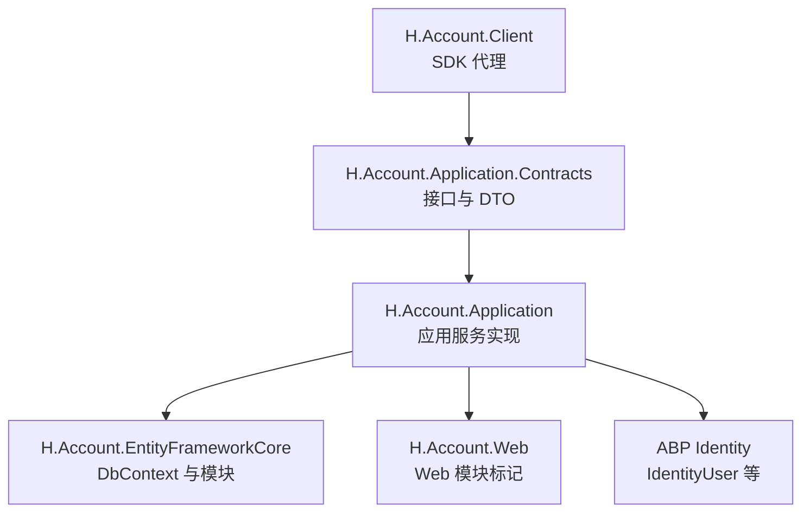
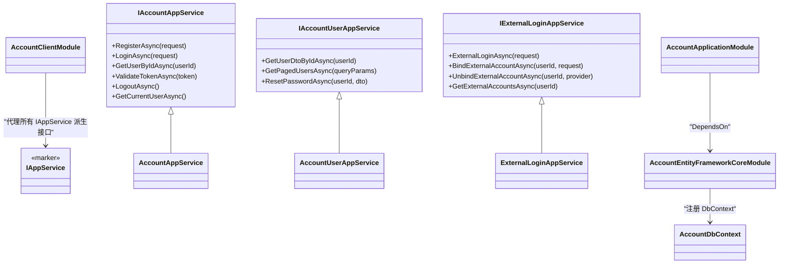
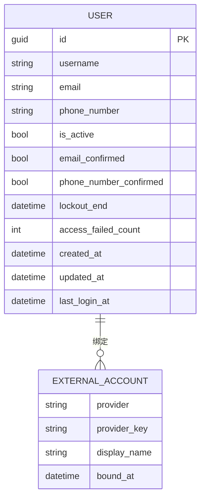
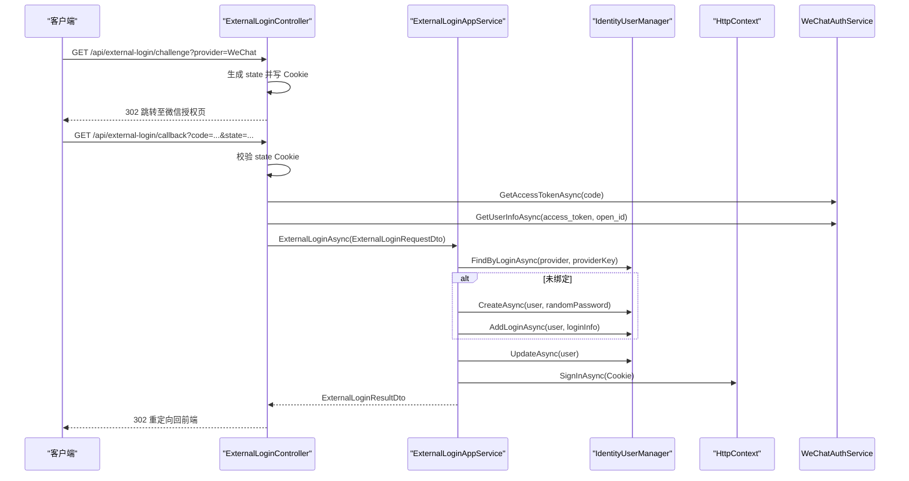
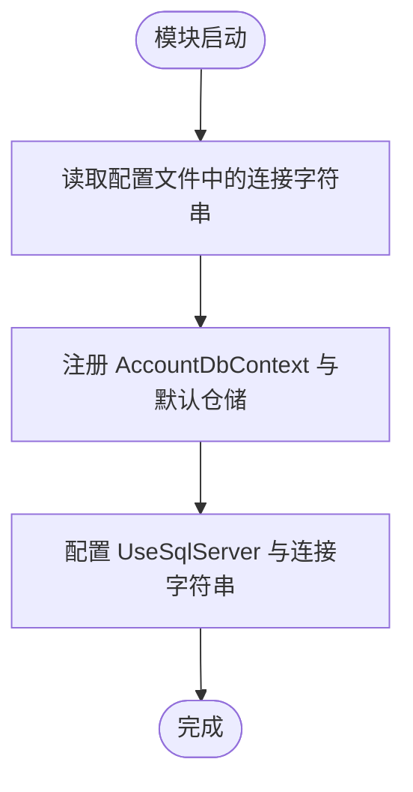
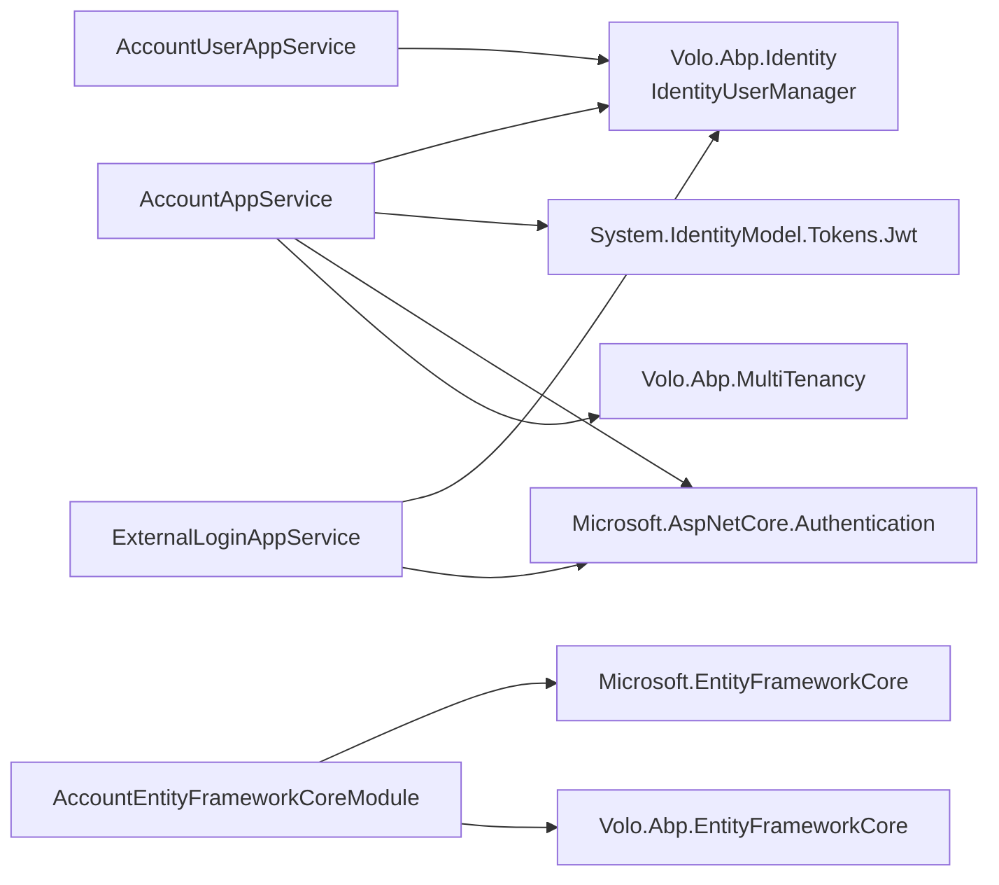

# Account 账户管理

<cite>
**本文引用的文件**   
- [README.md](file://src/Services/Account/README.md)
- [IAccountAppService.cs](file://src/Services/Account/H.Account.Application.Contracts/Services/IAccountAppService.cs)
- [IAccountUserAppService.cs](file://src/Services/Account/H.Account.Application.Contracts/Services/IAccountUserAppService.cs)
- [IExternalLoginAppService.cs](file://src/Services/Account/H.Account.Application.Contracts/Services/IExternalLoginAppService.cs)
- [AccountDtos.cs](file://src/Services/Account/H.Account.Application.Contracts/Dtos/AccountDtos.cs)
- [ExternalLoginDtos.cs](file://src/Services/Account/H.Account.Application.Contracts/Dtos/ExternalLoginDtos.cs)
- [AccountApplicationContractsModule.cs](file://src/Services/Account/H.Account.Application.Contracts/AccountApplicationContractsModule.cs)
- [AccountApplicationModule.cs](file://src/Services/Account/H.Account.Application/AccountApplicationModule.cs)
- [AccountAppService.cs](file://src/Services/Account/H.Account.Application/Services/AccountAppService.cs)
- [AccountUserAppService.cs](file://src/Services/Account/H.Account.Application/Services/AccountUserAppService.cs)
- [ExternalLoginAppService.cs](file://src/Services/Account/H.Account.Application/ExternalLogin/ExternalLoginAppService.cs)
- [WeChatAuthService.cs](file://src/Services/Account/H.Account.Application/ExternalLogin/WeChatAuthService.cs)
- [DingTalkAuthService.cs](file://src/Services/Account/H.Account.Application/ExternalLogin/DingTalkAuthService.cs)
- [ExternalLoginController.cs](file://src/Services/Account/H.Account.Application/ExternalLogin/ExternalLoginController.cs)
- [AccountEntityFrameworkCoreModule.cs](file://src/Services/Account/H.Account.EntityFrameworkCore/AccountEntityFrameworkCoreModule.cs)
- [AccountDbContext.cs](file://src/Services/Account/H.Account.EntityFrameworkCore/AccountDbContext.cs)
- [AccountWebModule.cs](file://src/Services/Account/H.Account.Web/AccountWebModule.cs)
- [AccountClientModule.cs](file://src/Services/Account/H.Account.Client/AccountClientModule.cs)
- [IAppService.cs](file://src/Utils/H.Abp.Application.Contracts/IAppService.cs)
</cite>

## 目录
1. [引言](#引言)
2. [项目结构](#项目结构)
3. [核心组件](#核心组件)
4. [架构总览](#架构总览)
5. [详细组件分析](#详细组件分析)
6. [依赖关系分析](#依赖关系分析)
7. [性能与扩展性](#性能与扩展性)
8. [故障排查指南](#故障排查指南)
9. [结论](#结论)
10. [附录：API 参考](#附录api-参考)

## 引言
Account 账户管理服务是一个基于 ASP.NET Core 和 ABP Framework 的领域服务，提供用户注册、登录认证、会话管理、外部账号绑定等能力。其设计遵循分层架构：应用契约层定义 IAppService 接口和数据传输对象；应用层实现业务逻辑；EntityFrameworkCore 层负责数据库访问；Web 层暴露 HTTP API；Client 层为其他应用提供 SDK 代理。

该服务复用 ABP Identity 的用户体系（IdentityUser），并在其上构建企业级用户查询、分页、密码重置等能力，同时支持微信、钉钉等第三方登录的扫码授权流程。

## 项目结构
Account 服务由以下主要程序集组成：
- H.Account.Application.Contracts：应用契约，包含 IAppService 接口、DTO、枚举及模块标记。
- H.Account.Application：应用服务实现，处理注册、登录、令牌验证、用户管理、外部登录等业务流程。
- H.Account.EntityFrameworkCore：EF Core 配置与 DbContext，复用 ABP Identity 实体。
- H.Account.Web：Web 模块标记类，配合宿主项目启用 Web 功能。
- H.Account.Client：客户端代理注册，用于其他应用通过 HTTP 调用 Account 服务。

图表来源
- [AccountClientModule.cs:1-22](file://src/Services/Account/H.Account.Client/AccountClientModule.cs#L1-L22)
- [AccountApplicationContractsModule.cs:1-9](file://src/Services/Account/H.Account.Application.Contracts/AccountApplicationContractsModule.cs#L1-L9)
- [AccountApplicationModule.cs:1-22](file://src/Services/Account/H.Account.Application/AccountApplicationModule.cs#L1-L22)
- [AccountEntityFrameworkCoreModule.cs:1-37](file://src/Services/Account/H.Account.EntityFrameworkCore/AccountEntityFrameworkCoreModule.cs#L1-L37)
- [AccountWebModule.cs:1-8](file://src/Services/Account/H.Account.Web/AccountWebModule.cs#L1-L8)

章节来源
- [README.md:1-99](file://src/Services/Account/README.md#L1-L99)

## 核心组件
- 应用服务接口
  - IAccountAppService：提供注册、登录、令牌验证、登出、获取当前用户等能力。
  - IAccountUserAppService：提供按 ID 获取用户、分页查询、重置密码等企业级用户管理能力。
  - IExternalLoginAppService：提供外部登录、绑定、解绑、查询已绑定账号的能力。
- 数据传输对象
  - UserDto、AuthResponseDto、LoginRequestDto、RegisterRequestDto、ResetPasswordDto、UserQueryParams、PagedResult<T>、ExternalLoginRequestDto、ExternalLoginResultDto、ExternalAccountDto 等。
- 外部登录提供者
  - WeChatAuthService、DingTalkAuthService：封装微信开放平台与钉钉新版 OAuth2 流程。
  - ExternalLoginController：处理外部登录跳转、回调、状态校验与安全重定向。

章节来源
- [IAccountAppService.cs:1-18](file://src/Services/Account/H.Account.Application.Contracts/Services/IAccountAppService.cs#L1-L18)
- [IAccountUserAppService.cs:1-26](file://src/Services/Account/H.Account.Application.Contracts/Services/IAccountUserAppService.cs#L1-L26)
- [IExternalLoginAppService.cs:1-30](file://src/Services/Account/H.Account.Application.Contracts/Services/IExternalLoginAppService.cs#L1-L30)
- [AccountDtos.cs:1-123](file://src/Services/Account/H.Account.Application.Contracts/Dtos/AccountDtos.cs#L1-L123)
- [ExternalLoginDtos.cs:1-48](file://src/Services/Account/H.Account.Application.Contracts/Dtos/ExternalLoginDtos.cs#L1-L48)

## 架构总览
Account 服务采用典型的应用服务分层：

图表来源
- [IAppService.cs:1-8](file://src/Utils/H.Abp.Application.Contracts/IAppService.cs#L1-L8)
- [IAccountAppService.cs:1-18](file://src/Services/Account/H.Account.Application.Contracts/Services/IAccountAppService.cs#L1-L18)
- [IAccountUserAppService.cs:1-26](file://src/Services/Account/H.Account.Application.Contracts/Services/IAccountUserAppService.cs#L1-L26)
- [IExternalLoginAppService.cs:1-30](file://src/Services/Account/H.Account.Application.Contracts/Services/IExternalLoginAppService.cs#L1-L30)
- [AccountAppService.cs:1-357](file://src/Services/Account/H.Account.Application/Services/AccountAppService.cs#L1-L357)
- [AccountUserAppService.cs:1-115](file://src/Services/Account/H.Account.Application/Services/AccountUserAppService.cs#L1-L115)
- [ExternalLoginAppService.cs:1-235](file://src/Services/Account/H.Account.Application/ExternalLogin/ExternalLoginAppService.cs#L1-L235)
- [AccountEntityFrameworkCoreModule.cs:1-37](file://src/Services/Account/H.Account.EntityFrameworkCore/AccountEntityFrameworkCoreModule.cs#L1-L37)
- [AccountDbContext.cs:1-28](file://src/Services/Account/H.Account.EntityFrameworkCore/AccountDbContext.cs#L1-L28)
- [AccountApplicationModule.cs:1-22](file://src/Services/Account/H.Account.Application/AccountApplicationModule.cs#L1-L22)
- [AccountClientModule.cs:1-22](file://src/Services/Account/H.Account.Client/AccountClientModule.cs#L1-L22)

## 详细组件分析

### 应用契约层：接口与数据模型
- IAccountAppService 定义了认证与用户上下文的核心操作：注册、登录、令牌验证、登出、根据 ID 获取用户、获取当前用户。
- IAccountUserAppService 聚焦企业级用户管理：按 ID 查询、分页搜索、重置密码。
- IExternalLoginAppService 提供第三方账号绑定与登录统一入口。
- DTO 中 UserDto 表示用户视图模型，包含基本属性、锁定信息、审计字段以及外部账号列表；AuthResponseDto 是认证操作的通用响应；LoginRequestDto 与 RegisterRequestDto 支持多种注册类型与登录方式；ExternalLoginRequestDto 描述第三方登录请求。

图表来源
- [AccountDtos.cs:1-123](file://src/Services/Account/H.Account.Application.Contracts/Dtos/AccountDtos.cs#L1-L123)
- [ExternalLoginDtos.cs:1-48](file://src/Services/Account/H.Account.Application.Contracts/Dtos/ExternalLoginDtos.cs#L1-L48)

章节来源
- [IAccountAppService.cs:1-18](file://src/Services/Account/H.Account.Application.Contracts/Services/IAccountAppService.cs#L1-L18)
- [IAccountUserAppService.cs:1-26](file://src/Services/Account/H.Account.Application.Contracts/Services/IAccountUserAppService.cs#L1-L26)
- [IExternalLoginAppService.cs:1-30](file://src/Services/Account/H.Account.Application.Contracts/Services/IExternalLoginAppService.cs#L1-L30)
- [AccountDtos.cs:1-123](file://src/Services/Account/H.Account.Application.Contracts/Dtos/AccountDtos.cs#L1-L123)
- [ExternalLoginDtos.cs:1-48](file://src/Services/Account/H.Account.Application.Contracts/Dtos/ExternalLoginDtos.cs#L1-L48)

### 应用层：业务实现
- AccountAppService
  - 注册：根据注册类型（用户名、邮箱、手机号）创建 IdentityUser，返回统一响应。
  - 登录：自动识别登录输入（邮箱、手机号、用户名），检查激活状态与密码，更新最后登录时间，写入 Cookie 认证，并支持记住我。
  - 令牌验证：使用 JWT 参数进行签名、发行者、受众与有效期校验。
  - 登出：清除 Cookie 认证。
  - 获取当前用户：从 ClaimsPrincipal 解析用户 ID，切换 Host 上下文查询用户。
  - 内部方法：生成 JWT、映射用户到 UserDto、检测登录类型。
- AccountUserAppService
  - 按 ID 获取用户。
  - 分页查询：支持关键字搜索（用户名、邮箱、手机号）、激活状态筛选。
  - 重置密码：生成密码重置令牌并设置新密码。
- ExternalLoginAppService
  - 外部登录：查找已绑定用户，未绑定时自动创建用户并绑定第三方登录；检查激活状态；更新最后登录时间；写入 Cookie。
  - 绑定/解绑：确保唯一性与安全策略（防止解绑后无法登录）。
  - 查询已绑定账号：列出 Provider、ProviderKey、DisplayName、BoundAt。

图表来源
- [ExternalLoginController.cs:1-202](file://src/Services/Account/H.Account.Application/ExternalLogin/ExternalLoginController.cs#L1-L202)
- [ExternalLoginAppService.cs:1-235](file://src/Services/Account/H.Account.Application/ExternalLogin/ExternalLoginAppService.cs#L1-L235)
- [WeChatAuthService.cs:1-118](file://src/Services/Account/H.Account.Application/ExternalLogin/WeChatAuthService.cs#L1-L118)

章节来源
- [AccountAppService.cs:1-357](file://src/Services/Account/H.Account.Application/Services/AccountAppService.cs#L1-L357)
- [AccountUserAppService.cs:1-115](file://src/Services/Account/H.Account.Application/Services/AccountUserAppService.cs#L1-L115)
- [ExternalLoginAppService.cs:1-235](file://src/Services/Account/H.Account.Application/ExternalLogin/ExternalLoginAppService.cs#L1-L235)

### 数据访问层：EntityFrameworkCore
- AccountEntityFrameworkCoreModule
  - 依赖 AbpIdentityEntityFrameworkCoreModule。
  - 注册 AccountDbContext 与默认仓储。
  - 配置 UseSqlServer 与连接字符串（AccountDb、AbpIdentity）。
- AccountDbContext
  - 标注 ConnectionStringName("AccountDb")。
  - 暴露 Users、UserLogins 集合。
  - 使用 modelBuilder.ConfigureIdentity() 配置 ABP Identity 实体映射。

图表来源
- [AccountEntityFrameworkCoreModule.cs:1-37](file://src/Services/Account/H.Account.EntityFrameworkCore/AccountEntityFrameworkCoreModule.cs#L1-L37)
- [AccountDbContext.cs:1-28](file://src/Services/Account/H.Account.EntityFrameworkCore/AccountDbContext.cs#L1-L28)

章节来源
- [AccountEntityFrameworkCoreModule.cs:1-37](file://src/Services/Account/H.Account.EntityFrameworkCore/AccountEntityFrameworkCoreModule.cs#L1-L37)
- [AccountDbContext.cs:1-28](file://src/Services/Account/H.Account.EntityFrameworkCore/AccountDbContext.cs#L1-L28)

### Web 层与客户端 SDK
- AccountWebModule：作为 Web 模块标记类，便于宿主项目组合模块。
- AccountClientModule：提供 AddAccountClientProxies 扩展，将 Account 契约程序集中的所有 IAppService 派生接口注册为 HttpClient 代理，供其他应用远程调用。

章节来源
- [AccountWebModule.cs:1-8](file://src/Services/Account/H.Account.Web/AccountWebModule.cs#L1-L8)
- [AccountClientModule.cs:1-22](file://src/Services/Account/H.Account.Client/AccountClientModule.cs#L1-L22)

## 依赖关系分析
Account 服务的依赖主要包括：
- ABP Framework：IdentityDomainModule、IdentityEntityFrameworkCoreModule、AbpModularity、AbpMultiTenancy 等。
- Microsoft.AspNetCore：CookieAuthentication、ClaimsPrincipal、HttpContext、HttpClient。
- System.IdentityModel.Tokens.Jwt：JWT 令牌签发与验证。
- EF Core：Sql Server 存储与模型映射。
- H.Abp.Application.Contracts：IAppService 标记接口。

图表来源
- [AccountAppService.cs:1-357](file://src/Services/Account/H.Account.Application/Services/AccountAppService.cs#L1-L357)
- [AccountUserAppService.cs:1-115](file://src/Services/Account/H.Account.Application/Services/AccountUserAppService.cs#L1-L115)
- [ExternalLoginAppService.cs:1-235](file://src/Services/Account/H.Account.Application/ExternalLogin/ExternalLoginAppService.cs#L1-L235)
- [AccountEntityFrameworkCoreModule.cs:1-37](file://src/Services/Account/H.Account.EntityFrameworkCore/AccountEntityFrameworkCoreModule.cs#L1-L37)

章节来源
- [AccountApplicationModule.cs:1-22](file://src/Services/Account/H.Account.Application/AccountApplicationModule.cs#L1-L22)
- [AccountEntityFrameworkCoreModule.cs:1-37](file://src/Services/Account/H.Account.EntityFrameworkCore/AccountEntityFrameworkCoreModule.cs#L1-L37)

## 性能与扩展性
- 用户查询与分页
  - AccountUserAppService 在内存中进行 Where/Skip/Take 分页，适合小规模数据集；对于大数据量应改用数据库端分页与投影以减少内存占用。
- 登录类型检测
  - DetectLoginType 使用正则判断邮箱与手机号，避免多次数据库查询；但全表扫描用户以匹配手机号存在性能风险，建议增加索引或优化查询策略。
- 令牌验证
  - ValidateTokenAsync 使用固定密钥与宽松配置，适合快速验证；生产环境应强化密钥管理与时钟偏差策略。
- 外部登录
  - WeChatAuthService 与 DingTalkAuthService 使用 HttpClient 直接调用第三方 API，注意超时与重试策略；建议在模块中集中注入 IHttpClientFactory。
- 多租户
  - Account 服务多处使用 ICurrentTenant.Change(null) 切换 Host 上下文，保证全局用户查询不受租户过滤影响；这是正确的跨租户访问模式。

[本节为通用性能建议，不直接分析具体代码行]

## 故障排查指南
- 登录失败
  - 检查用户是否被禁用（IsActive 为 false）。
  - 检查密码错误次数与锁定时间（AccessFailedCount、LockoutEnd）。
  - 确认 Cookie 认证是否成功写入与浏览器是否接受 Cookie。
- 外部登录异常
  - 检查 state Cookie 是否过期或无效。
  - 检查第三方授权码是否正确传递（微信 code、钉钉 authCode）。
  - 检查第三方 API 返回状态与必要字段（access_token、open_id、unionid）。
- 令牌验证失败
  - 检查 Jwt:SecretKey、Jwt:Issuer、Jwt:Audience 配置是否正确。
  - 检查客户端发送的令牌是否为服务器签发的有效 JWT。
- 用户查询为空
  - 确认是否在 Host 上下文查询（Account 为全局数据）。
  - 确认 EF Core 连接字符串与数据库迁移是否执行。

章节来源
- [AccountAppService.cs:120-208](file://src/Services/Account/H.Account.Application/Services/AccountAppService.cs#L120-L208)
- [AccountAppService.cs:222-279](file://src/Services/Account/H.Account.Application/Services/AccountAppService.cs#L222-L279)
- [ExternalLoginController.cs:1-202](file://src/Services/Account/H.Account.Application/ExternalLogin/ExternalLoginController.cs#L1-L202)

## 结论
Account 账户管理服务围绕 ABP Identity 构建了完整的用户认证与企业级用户管理能力，并通过外部登录服务集成微信、钉钉等第三方身份源。其分层清晰、职责明确，适用于多租户场景下的全局用户管理。通过 Application.Contracts 暴露的 IAppService 接口，其他应用可便捷地引用并调用这些能力。

[本节为总结，不直接分析具体代码行]

## 附录：API 参考

### 认证相关
- POST /api/auth/register
  - 请求体：RegisterRequestDto（UserName/Email/PhoneNumber、Password、ConfirmPassword、RegisterType、可选 EmailCode/PhoneCode）
  - 响应：BaseOutput<AuthResponseDto>
- POST /api/auth/login
  - 请求体：LoginRequestDto（Account、Password、RememberMe）
  - 响应：BaseOutput<AuthResponseDto>
- GET /api/auth/validate
  - 查询参数：token
  - 响应：BaseOutput<bool>
- GET /api/auth/current-user
  - 响应：BaseOutput<UserDto?>

### 用户管理相关
- GET /api/users/{userId}
  - 路径参数：userId（Guid）
  - 响应：BaseOutput<UserDto?>
- GET /api/users
  - 查询参数：Keyword、IsActive、PageIndex、PageSize
  - 响应：BaseOutput<PagedResult<UserDto>>
- POST /api/users/{userId}/reset-password
  - 路径参数：userId（Guid）
  - 请求体：ResetPasswordDto（NewPassword、ConfirmPassword）
  - 响应：BaseOutput
- DELETE /api/users/{userId}
  - 路径参数：userId（Guid）
  - 响应：BaseOutput

### 外部登录相关
- GET /api/external-login/challenge
  - 查询参数：provider（WeChat/DingTalk）、returnUrl（可选）
  - 行为：生成 state Cookie 并 302 跳转到第三方授权页
- GET /api/external-login/callback
  - 查询参数：code（微信）、authCode（钉钉）、state
  - 行为：校验 state、换取用户信息、调用 ExternalLoginAppService 并 302 重定向

章节来源
- [README.md:40-99](file://src/Services/Account/README.md#L40-L99)
- [IAccountAppService.cs:1-18](file://src/Services/Account/H.Account.Application.Contracts/Services/IAccountAppService.cs#L1-L18)
- [IAccountUserAppService.cs:1-26](file://src/Services/Account/H.Account.Application.Contracts/Services/IAccountUserAppService.cs#L1-L26)
- [IExternalLoginAppService.cs:1-30](file://src/Services/Account/H.Account.Application.Contracts/Services/IExternalLoginAppService.cs#L1-L30)
- [ExternalLoginController.cs:1-202](file://src/Services/Account/H.Account.Application/ExternalLogin/ExternalLoginController.cs#L1-L202)