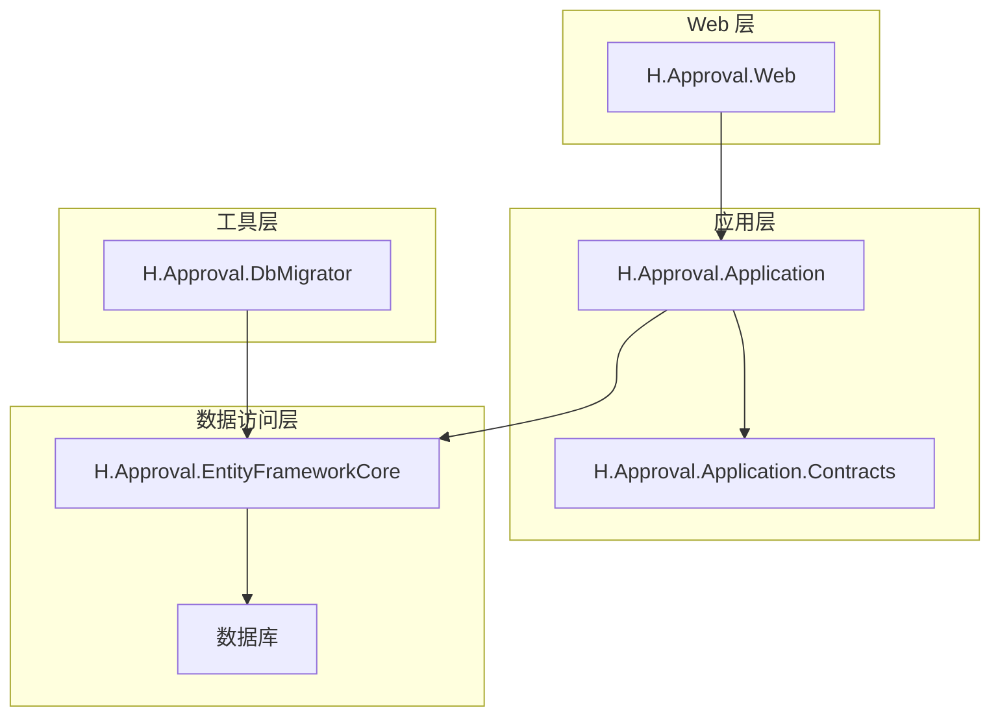
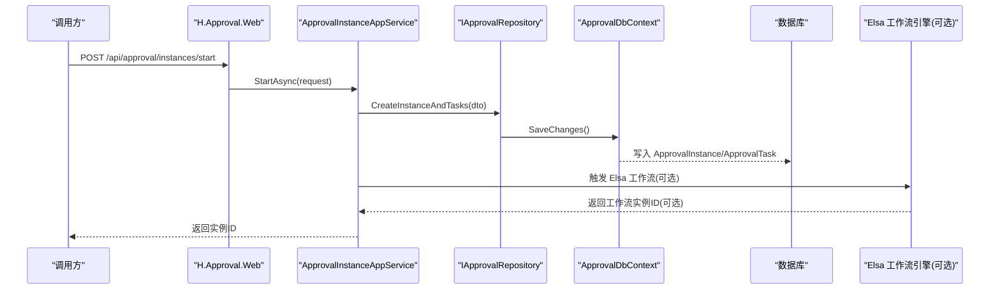
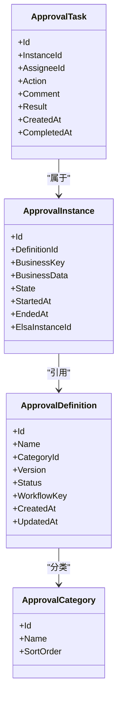
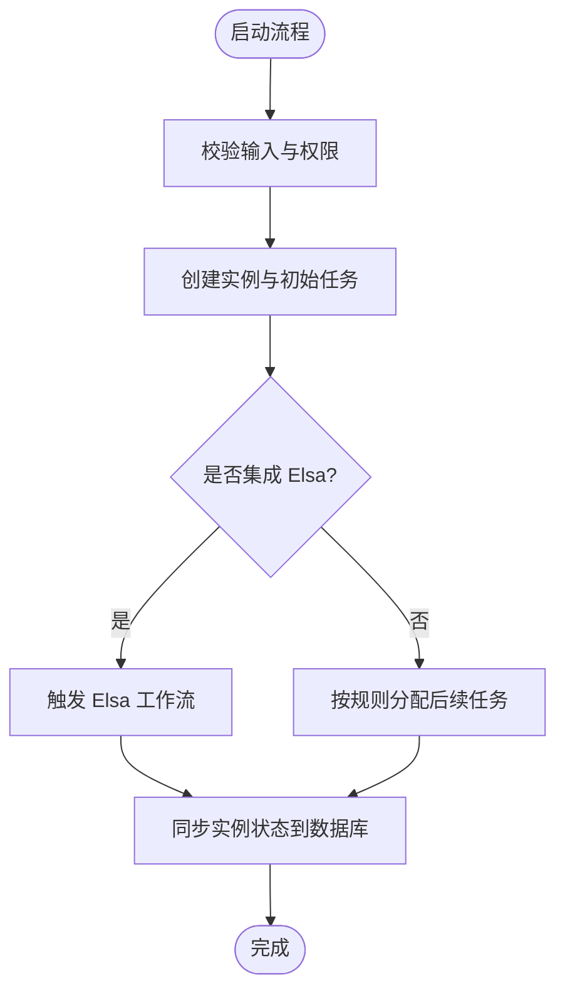
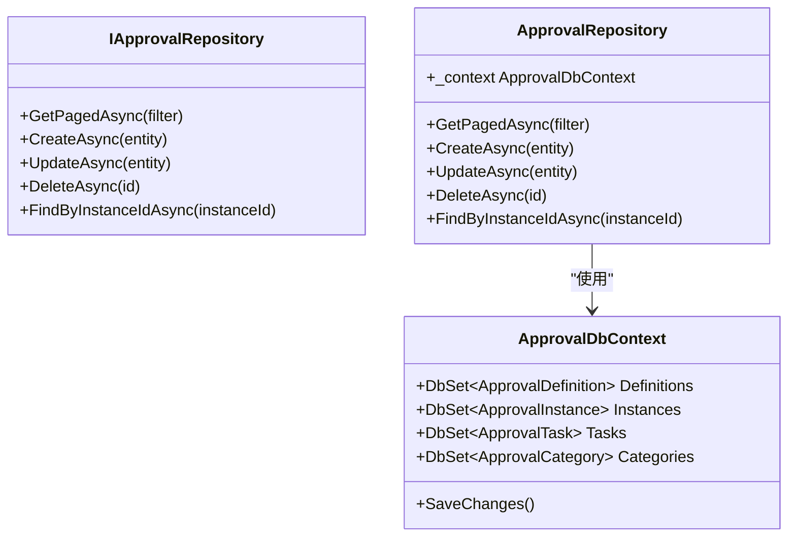
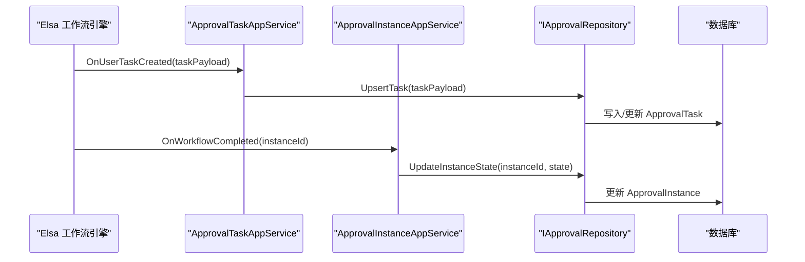
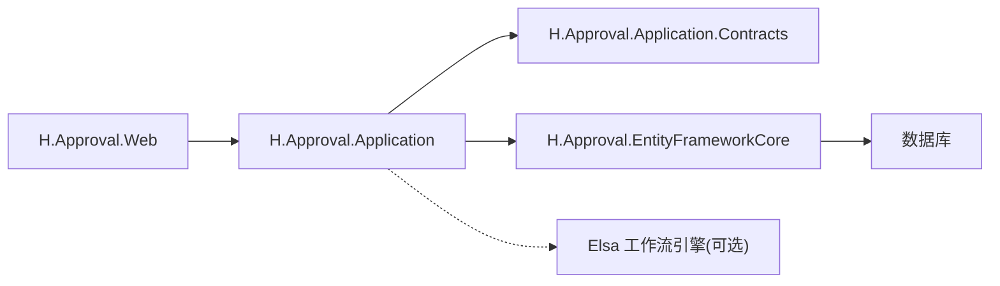

# Approval 审批流程

<cite>
**本文引用的文件**   
- [ApprovalApplicationModule.cs](file://src/src/Services/Approval/H.Approval.Application/ApprovalApplicationModule.cs)
- [ApprovalEntityFrameworkCoreModule.cs](file://src/src/Services/Approval/H.Approval.EntityFrameworkCore/ApprovalEntityFrameworkCoreModule.cs)
- [ApprovalDbContext.cs](file://src/src/Services/Approval/H.Approval.EntityFrameworkCore/ApprovalDbContext.cs)
- [ApprovalDefinition.cs](file://src/src/Services/Approval/H.Approval.EntityFrameworkCore/Entities/ApprovalDefinition.cs)
- [ApprovalInstance.cs](file://src/src/Services/Approval/H.Approval.EntityFrameworkCore/Entities/ApprovalInstance.cs)
- [ApprovalTask.cs](file://src/src/Services/Approval/H.Approval.EntityFrameworkCore/Entities/ApprovalTask.cs)
- [ApprovalCategory.cs](file://src/src/Services/Approval/H.Approval.EntityFrameworkCore/Entities/ApprovalCategory.cs)
- [IApprovalRepository.cs](file://src/src/Services/Approval/H.Approval.EntityFrameworkCore/Repositories/IApprovalRepository.cs)
- [ApprovalRepository.cs](file://src/src/Services/Approval/H.Approval.EntityFrameworkCore/Repositories/ApprovalRepository.cs)
- [ApprovalDefinitionAppService.cs](file://src/src/Services/Approval/H.Approval.Application/Services/ApprovalDefinitionAppService.cs)
- [ApprovalInstanceAppService.cs](file://src/src/Services/Approval/H.Approval.Application/Services/ApprovalInstanceAppService.cs)
- [ApprovalTaskAppService.cs](file://src/src/Services/Approval/H.Approval.Application/Services/ApprovalTaskAppService.cs)
- [ApprovalCategoryAppService.cs](file://src/src/Services/Approval/H.Approval.Application/Services/ApprovalCategoryAppService.cs)
- [Program.cs](file://src/src/Tools/H.Approval.DbMigrator/Program.cs)
- [H.Approval.Web.csproj](file://src/src/Services/Approval/H.Approval.Web/H.Approval.Web.csproj)
- [H.Approval.Application.csproj](file://src/src/Services/Approval/H.Approval.Application/H.Approval.Application.csproj)
- [H.Approval.EntityFrameworkCore.csproj](file://src/src/Services/Approval/H.Approval.EntityFrameworkCore/H.Approval.EntityFrameworkCore.csproj)
</cite>

## 目录
1. [引言](#引言)
2. [项目结构](#项目结构)
3. [核心组件](#核心组件)
4. [架构总览](#架构总览)
5. [详细组件分析](#详细组件分析)
6. [依赖关系分析](#依赖关系分析)
7. [性能与扩展性](#性能与扩展性)
8. [故障排查指南](#故障排查指南)
9. [结论](#结论)
10. [附录：API 使用示例](#附录api-使用示例)

## 引言
本文件为 Approval 审批流程服务的完整技术文档。该服务基于 ABP 模块化架构，提供审批定义、流程实例、审批任务与审批分类的领域建模与应用服务；在数据层通过 Entity Framework Core 持久化业务实体，并通过仓储接口统一访问。服务同时预留与 Elsa 工作流引擎的集成位置，用于承载基于 Elsa 3.8 的工作流编排能力（流程定义、节点类型、条件分支、并行审批等），并在 UI 侧由 H.Approval.Web 暴露 Web API。

## 项目结构
Approval 服务采用典型的分层与模块化组织：

- 应用层 H.Approval.Application：应用服务与模块装配
- 契约层 H.Approval.Application.Contracts：DTO、枚举与接口契约
- 数据访问层 H.Approval.EntityFrameworkCore：DbContext、实体、迁移、仓储实现
- Web 层 H.Approval.Web：Web API 控制器与中间件配置
- 工具层 src/Tools/H.Approval.DbMigrator：数据库迁移执行器

图表来源
- [H.Approval.Web.csproj](file://src/src/Services/Approval/H.Approval.Web/H.Approval.Web.csproj)
- [H.Approval.Application.csproj](file://src/src/Services/Approval/H.Approval.Application/H.Approval.Application.csproj)
- [H.Approval.EntityFrameworkCore.csproj](file://src/src/Services/Approval/H.Approval.EntityFrameworkCore/H.Approval.EntityFrameworkCore.csproj)

章节来源
- [H.Approval.Application/ApprovalApplicationModule.cs](file://src/src/Services/Approval/H.Approval.Application/ApprovalApplicationModule.cs)
- [H.Approval.EntityFrameworkCore/ApprovalEntityFrameworkCoreModule.cs](file://src/src/Services/Approval/H.Approval.EntityFrameworkCore/ApprovalEntityFrameworkCoreModule.cs)

## 核心组件
- 模块装配
  - 应用模块 ApprovalApplicationModule：注册应用服务、启用 ABP 特性
  - EF 模块 ApprovalEntityFrameworkCoreModule：注册 DbContext、仓储与 EF 相关配置
- 领域实体
  - 审批定义 ApprovalDefinition：描述一个可重复使用的审批流程模板
  - 审批实例 ApprovalInstance：一次具体的审批流程运行
  - 审批任务 ApprovalTask：需要被处理的审批动作，通常对应某个审批人
  - 审批分类 ApprovalCategory：对审批定义的分组管理
- 仓储
  - IApprovalRepository / ApprovalRepository：封装对审批相关实体的查询与操作
- 应用服务
  - ApprovalDefinitionAppService：审批定义 CRUD 与版本管理
  - ApprovalInstanceAppService：流程实例启动、查询、挂起/恢复、终止
  - ApprovalTaskAppService：任务查询、处理（同意/拒绝/转交/加签）、历史查看
  - ApprovalCategoryAppService：分类维护

章节来源
- [ApprovalApplicationModule.cs](file://src/src/Services/Approval/H.Approval.Application/ApprovalApplicationModule.cs)
- [ApprovalEntityFrameworkCoreModule.cs](file://src/src/Services/Approval/H.Approval.EntityFrameworkCore/ApprovalEntityFrameworkCoreModule.cs)
- [ApprovalDefinition.cs](file://src/src/Services/Approval/H.Approval.EntityFrameworkCore/Entities/ApprovalDefinition.cs)
- [ApprovalInstance.cs](file://src/src/Services/Approval/H.Approval.EntityFrameworkCore/Entities/ApprovalInstance.cs)
- [ApprovalTask.cs](file://src/src/Services/Approval/H.Approval.EntityFrameworkCore/Entities/ApprovalTask.cs)
- [ApprovalCategory.cs](file://src/src/Services/Approval/H.Approval.EntityFrameworkCore/Entities/ApprovalCategory.cs)
- [IApprovalRepository.cs](file://src/src/Services/Approval/H.Approval.EntityFrameworkCore/Repositories/IApprovalRepository.cs)
- [ApprovalRepository.cs](file://src/src/Services/Approval/H.Approval.EntityFrameworkCore/Repositories/ApprovalRepository.cs)
- [ApprovalDefinitionAppService.cs](file://src/src/Services/Approval/H.Approval.Application/Services/ApprovalDefinitionAppService.cs)
- [ApprovalInstanceAppService.cs](file://src/src/Services/Approval/H.Approval.Application/Services/ApprovalInstanceAppService.cs)
- [ApprovalTaskAppService.cs](file://src/src/Services/Approval/H.Approval.Application/Services/ApprovalTaskAppService.cs)
- [ApprovalCategoryAppService.cs](file://src/src/Services/Approval/H.Approval.Application/Services/ApprovalCategoryAppService.cs)

## 架构总览
Approval 服务遵循 ABP 的分层与模块化原则：Web 层暴露 RESTful API，调用应用层的服务方法；应用层协调领域逻辑并调用仓储访问数据；EF 层负责对象关系映射与数据库交互。Elsa 作为可选的外部工作流引擎，可通过以下集成点接入：
- 在 ApprovalDefinition 中保存 Elsa 流程定义标识或序列化内容
- 在 ApprovalInstance 中记录 Elsa 工作流实例 ID，驱动状态同步
- 在 ApprovalTaskAppService 中根据 Elsa 回调更新任务状态与审计信息

图表来源
- [ApprovalInstanceAppService.cs](file://src/src/Services/Approval/H.Approval.Application/Services/ApprovalInstanceAppService.cs)
- [IApprovalRepository.cs](file://src/src/Services/Approval/H.Approval.EntityFrameworkCore/Repositories/IApprovalRepository.cs)
- [ApprovalDbContext.cs](file://src/src/Services/Approval/H.Approval.EntityFrameworkCore/ApprovalDbContext.cs)

## 详细组件分析

### 领域模型与数据流
- ApprovalDefinition：描述流程元数据（名称、分类、版本、状态、Elsa 关联信息等）
- ApprovalInstance：绑定具体业务数据，记录流程开始/结束时间、当前阶段、业务键等
- ApprovalTask：代表一个待办审批项，包含处理人、意见、结果、时间戳等
- ApprovalCategory：用于审批定义的归类管理

图表来源
- [ApprovalDefinition.cs](file://src/src/Services/Approval/H.Approval.EntityFrameworkCore/Entities/ApprovalDefinition.cs)
- [ApprovalInstance.cs](file://src/src/Services/Approval/H.Approval.EntityFrameworkCore/Entities/ApprovalInstance.cs)
- [ApprovalTask.cs](file://src/src/Services/Approval/H.Approval.EntityFrameworkCore/Entities/ApprovalTask.cs)
- [ApprovalCategory.cs](file://src/src/Services/Approval/H.Approval.EntityFrameworkCore/Entities/ApprovalCategory.cs)

### 应用服务职责
- ApprovalDefinitionAppService
  - 定义增删改查、启用/禁用、版本管理
  - 将 Elsa 流程定义 Key 与本地定义建立关联
- ApprovalInstanceAppService
  - 启动流程：创建实例、生成初始任务、可选触发 Elsa
  - 查询实例：按业务键、状态、时间段过滤
  - 生命周期控制：挂起、恢复、终止
- ApprovalTaskAppService
  - 任务列表：按处理人、状态、实例筛选
  - 任务处理：同意/拒绝/转交/加签，记录意见与结果
  - 历史追踪：按实例获取完整审批轨迹
- ApprovalCategoryAppService
  - 分类维护：排序、命名、统计使用次数

图表来源
- [ApprovalInstanceAppService.cs](file://src/src/Services/Approval/H.Approval.Application/Services/ApprovalInstanceAppService.cs)
- [ApprovalTaskAppService.cs](file://src/src/Services/Approval/H.Approval.Application/Services/ApprovalTaskAppService.cs)

### 数据访问与仓储
- ApprovalDbContext：集中声明 ApprovalDefinition、ApprovalInstance、ApprovalTask、ApprovalCategory 的 DbSet，并配置关系、索引、审计字段
- IApprovalRepository：抽象出常用查询与事务边界
- ApprovalRepository：实现 EF Core 查询优化（分页、排序、联合条件），并提供批量操作

图表来源
- [ApprovalDbContext.cs](file://src/src/Services/Approval/H.Approval.EntityFrameworkCore/ApprovalDbContext.cs)
- [IApprovalRepository.cs](file://src/src/Services/Approval/H.Approval.EntityFrameworkCore/Repositories/IApprovalRepository.cs)
- [ApprovalRepository.cs](file://src/src/Services/Approval/H.Approval.EntityFrameworkCore/Repositories/ApprovalRepository.cs)

### Elsa 工作流集成要点
- 流程定义映射：在 ApprovalDefinition 中保存 WorkflowKey 或 Elsa DefinitionId，便于从业务视角检索流程模板
- 流程实例映射：在 ApprovalInstance 中记录 ElsaInstanceId，以便与外部引擎实例一一对应
- 任务同步：当 Elsa 推进到“用户任务”节点时，可回调 ApprovalTaskAppService 创建或更新任务
- 状态回写：Elsa 完成后，调用 ApprovalInstanceAppService 更新实例最终状态

图表来源
- [ApprovalTaskAppService.cs](file://src/src/Services/Approval/H.Approval.Application/Services/ApprovalTaskAppService.cs)
- [ApprovalInstanceAppService.cs](file://src/src/Services/Approval/H.Approval.Application/Services/ApprovalInstanceAppService.cs)
- [IApprovalRepository.cs](file://src/src/Services/Approval/H.Approval.EntityFrameworkCore/Repositories/IApprovalRepository.cs)

## 依赖关系分析
- 模块依赖
  - H.Approval.Web 依赖 H.Approval.Application
  - H.Approval.Application 依赖 H.Approval.Application.Contracts 与 H.Approval.EntityFrameworkCore
  - H.Approval.EntityFrameworkCore 依赖 EF Core 运行时与数据库提供者
- 外部依赖
  - Elsa 工作流引擎（可选）：通过接口或服务调用方式集成
- 数据库依赖
  - 通过 H.Approval.DbMigrator 执行 EF 迁移，初始化表结构与种子数据

图表来源
- [H.Approval.Web.csproj](file://src/src/Services/Approval/H.Approval.Web/H.Approval.Web.csproj)
- [H.Approval.Application.csproj](file://src/src/Services/Approval/H.Approval.Application/H.Approval.Application.csproj)
- [H.Approval.EntityFrameworkCore.csproj](file://src/src/Services/Approval/H.Approval.EntityFrameworkCore/H.Approval.EntityFrameworkCore.csproj)

章节来源
- [Program.cs](file://src/src/Tools/H.Approval.DbMigrator/Program.cs)

## 性能与扩展性
- 查询性能
  - 使用分页与排序参数减少大数据量传输
  - 在 ApprovalDbContext 中对常用查询字段添加索引（如实例状态、处理人、业务键）
- 事务与一致性
  - 在 ApprovalInstanceAppService 中开启短事务，确保实例与任务的原子性写入
  - 对外部系统（如 Elsa）回调进行幂等设计，避免重复更新
- 可扩展点
  - 自定义审批节点：通过 ApprovalTask 的 Action/Result 扩展不同审批策略
  - 外部系统集成：在 ApprovalInstanceAppService 中增加对外部系统的异步调用与重试机制
  - 动态表单渲染：结合低代码渲染引擎，依据 ApprovalDefinition 的动态表单配置在前端渲染审批表单

[本节为通用指导，不直接分析具体文件]

## 故障排查指南
- 数据库连接失败
  - 检查 H.Approval.DbMigrator 的配置文件是否正确
  - 确认数据库服务器可达且账号权限正确
- 迁移未执行或版本不一致
  - 重新运行 H.Approval.DbMigrator 以应用最新迁移
- 流程实例无法启动
  - 检查 ApprovalDefinition 是否已启用且版本有效
  - 若集成 Elsa，确认 Elsa 服务可用且回调地址正确
- 任务状态不同步
  - 核对 ApprovalTask 的 CompletedAt、Result 是否与业务实际一致
  - 检查是否存在并发更新导致的覆盖问题

章节来源
- [Program.cs](file://src/src/Tools/H.Approval.DbMigrator/Program.cs)
- [ApprovalDbContext.cs](file://src/src/Services/Approval/H.Approval.EntityFrameworkCore/ApprovalDbContext.cs)

## 结论
Approval 审批流程服务提供了完整的审批定义、实例与任务管理能力，并通过仓储抽象和 EF Core 实现稳定可靠的数据持久化。在服务中预留了与 Elsa 工作流引擎的集成点，支持更复杂的工作流编排能力。建议在生产环境中完善 Elsa 回调的幂等性与错误重试机制，并对高频查询字段建立合适的索引以提升性能。

[本节为总结性内容，不直接分析具体文件]

## 附录：API 使用示例
以下为常见 API 的使用说明与请求/响应结构建议（请根据实际 DTO 调整字段名）：

- 启动审批流程
  - 方法：POST
  - 路径：/api/approval/instances/start
  - 请求体字段建议：
    - definitionId：审批定义标识
    - businessKey：业务主键
    - businessData：业务数据 JSON
    - initiator：发起人
  - 响应字段建议：
    - instanceId：新创建的实例 ID
    - firstTaskId：首个任务 ID（可选）

- 查询我的待办任务
  - 方法：GET
  - 路径：/api/approval/tasks/my-pending
  - 查询参数：
    - assigneeId：处理人 ID
    - status：任务状态（进行中、已完成等）
    - page、pageSize：分页参数

- 处理审批任务
  - 方法：POST
  - 路径：/api/approval/tasks/{taskId}/handle
  - 请求体字段建议：
    - action：同意/拒绝/转交/加签
    - comment：审批意见
    - targetUserId：转交目标用户（当 action=转交）
    - additionalTasks：加签任务列表（当 action=加签）
  - 响应字段建议：
    - success：是否成功
    - message：提示信息
    - nextTaskIds：后续生成的任务 ID（可选）

- 查询审批历史
  - 方法：GET
  - 路径：/api/approval/instances/{instanceId}/history
  - 响应字段建议：
    - tasks：任务历史数组，包含处理人、意见、结果、时间戳

- 查询实例详情
  - 方法：GET
  - 路径：/api/approval/instances/{instanceId}
  - 响应字段建议：
    - instance：实例基本信息
    - currentStage：当前阶段
    - state：流程状态
    - startedAt、endedAt：起止时间

- 查询审批定义
  - 方法：GET
  - 路径：/api/approval/definitions/{definitionId}
  - 响应字段建议：
    - definition：定义信息
    - categories：所属分类
    - workflowKey：Elsa 流程 Key（可选）

章节来源
- [ApprovalDefinitionAppService.cs](file://src/src/Services/Approval/H.Approval.Application/Services/ApprovalDefinitionAppService.cs)
- [ApprovalInstanceAppService.cs](file://src/src/Services/Approval/H.Approval.Application/Services/ApprovalInstanceAppService.cs)
- [ApprovalTaskAppService.cs](file://src/src/Services/Approval/H.Approval.Application/Services/ApprovalTaskAppService.cs)
- [ApprovalCategoryAppService.cs](file://src/src/Services/Approval/H.Approval.Application/Services/ApprovalCategoryAppService.cs)