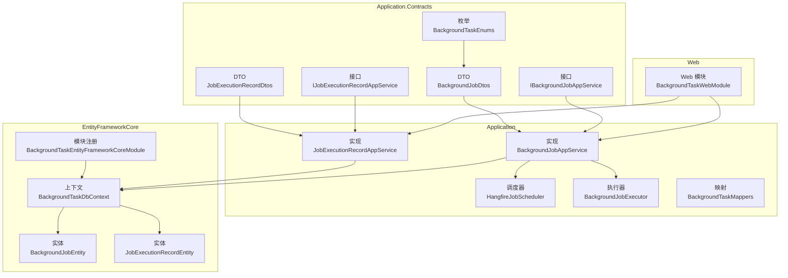
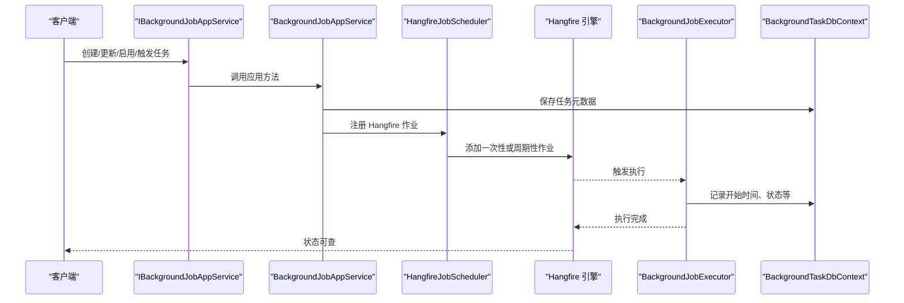
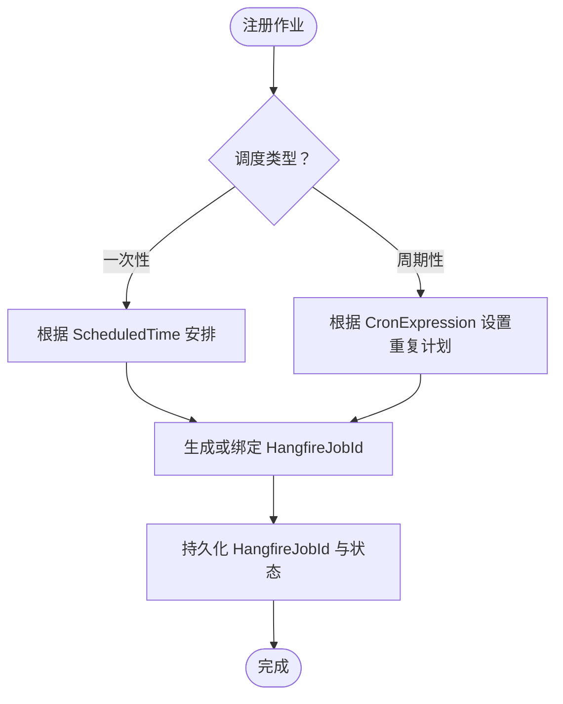
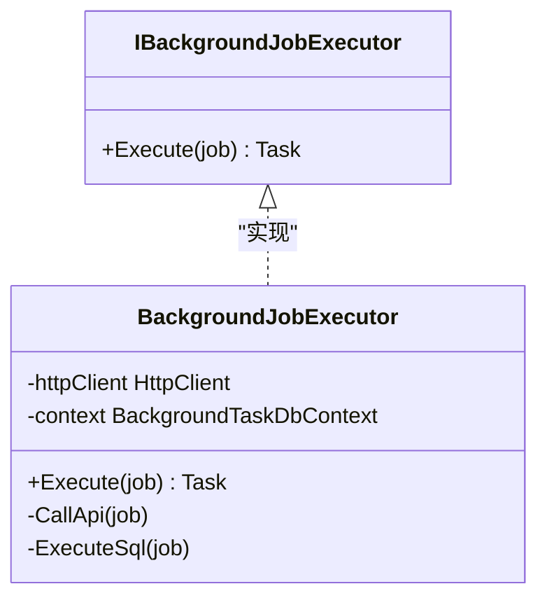
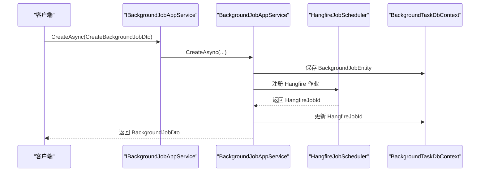
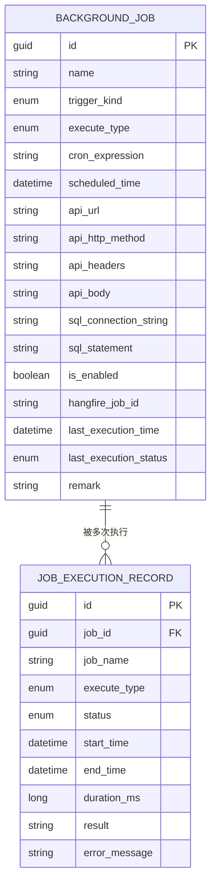
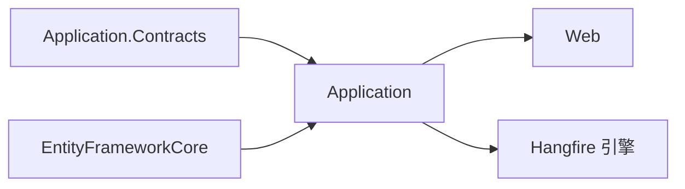

# BackgroundTask 后台任务

<cite>
**本文引用的文件**   
- [BackgroundTaskEnums.cs](file://src/Services/BackgroundTask/H.BackgroundTask.Application.Contracts/Enums/BackgroundTaskEnums.cs)
- [BackgroundJobDtos.cs](file://src/Services/BackgroundTask/H.BackgroundTask.Application.Contracts/Dtos/BackgroundJobDtos.cs)
- [JobExecutionRecordDtos.cs](file://src/Services/BackgroundTask/H.BackgroundTask.Application.Contracts/Dtos/JobExecutionRecordDtos.cs)
- [IBackgroundJobAppService.cs](file://src/Services/BackgroundTask/H.BackgroundTask.Application.Contracts/Services/IBackgroundJobAppService.cs)
- [IJobExecutionRecordAppService.cs](file://src/Services/BackgroundTask/H.BackgroundTask.Application.Contracts/Services/IJobExecutionRecordAppService.cs)
- [BackgroundJobAppService.cs](file://src/Services/BackgroundTask/H.BackgroundTask.Application/Services/BackgroundJobAppService.cs)
- [JobExecutionRecordAppService.cs](file://src/Services/BackgroundTask/H.BackgroundTask.Application/Services/JobExecutionRecordAppService.cs)
- [HangfireJobScheduler.cs](file://src/Services/BackgroundTask/H.BackgroundTask.Application/Services/HangfireJobScheduler.cs)
- [IJobScheduler.cs](file://src/Services/BackgroundTask/H.BackgroundTask.Application/Services/IJobScheduler.cs)
- [IBackgroundJobExecutor.cs](file://src/Services/BackgroundTask/H.BackgroundTask.Application/Services/IBackgroundJobExecutor.cs)
- [BackgroundJobExecutor.cs](file://src/Services/BackgroundTask/H.BackgroundTask.Application/Services/BackgroundJobExecutor.cs)
- [BackgroundTaskMappers.cs](file://src/Services/BackgroundTask/H.BackgroundTask.Application/Mapping/BackgroundTaskMappers.cs)
- [BackgroundTaskDbContext.cs](file://src/Services/BackgroundTask/H.BackgroundTask.EntityFrameworkCore/BackgroundTaskDbContext.cs)
- [BackgroundTaskEntityFrameworkCoreModule.cs](file://src/Services/BackgroundTask/H.BackgroundTask.EntityFrameworkCore/BackgroundTaskEntityFrameworkCoreModule.cs)
- [BackgroundJobEntity.cs](file://src/Services/BackgroundTask/H.BackgroundTask.EntityFrameworkCore/Entities/BackgroundJobEntity.cs)
- [JobExecutionRecordEntity.cs](file://src/Services/BackgroundTask/H.BackgroundTask.EntityFrameworkCore/Entities/JobExecutionRecordEntity.cs)
- [BackgroundTaskWebModule.cs](file://src/Services/BackgroundTask/H.BackgroundTask.Web/BackgroundTaskWebModule.cs)
</cite>

## 目录
1. [引言](#引言)
2. [项目结构](#项目结构)
3. [核心组件](#核心组件)
4. [架构总览](#架构总览)
5. [详细组件分析](#详细组件分析)
6. [依赖关系分析](#依赖关系分析)
7. [性能与分布式特性](#性能与分布式特性)
8. [API 使用示例](#api-使用示例)
9. [故障排查指南](#故障排查指南)
10. [结论](#结论)

## 引言
BackgroundTask 后台任务服务提供基于 Hangfire 的任务队列管理能力，覆盖一次性延迟任务、按 Cron 表达式周期性任务的创建、调度、执行、监控、启停与删除。系统通过 ABP 应用服务暴露 RESTful API，持久化任务元数据与执行记录，并提供可插拔的执行器以支持调用 HTTP API 或执行 SQL 两种任务类型。该服务适合在微服务或多进程部署环境中作为统一的任务调度与观测中心。

## 项目结构
BackgroundTask 服务采用 ABP 模块化分层：
- Application.Contracts：对外 DTO、枚举与应用服务接口定义。
- Application：应用服务实现、任务调度器、任务执行器、映射配置。
- EntityFrameworkCore：领域实体、数据库上下文与 EF Core 模块注册。
- Web：Web 层模块注册，将应用服务暴露为 RESTful API。

图示来源
- [BackgroundTaskEnums.cs:1-37](file://src/Services/BackgroundTask/H.BackgroundTask.Application.Contracts/Enums/BackgroundTaskEnums.cs#L1-L37)
- [BackgroundJobDtos.cs:1-115](file://src/Services/BackgroundTask/H.BackgroundTask.Application.Contracts/Dtos/BackgroundJobDtos.cs#L1-L115)
- [JobExecutionRecordDtos.cs:1-48](file://src/Services/BackgroundTask/H.BackgroundTask.Application.Contracts/Dtos/JobExecutionRecordDtos.cs#L1-L48)
- [IBackgroundJobAppService.cs:1-35](file://src/Services/BackgroundTask/H.BackgroundTask.Application.Contracts/Services/IBackgroundJobAppService.cs#L1-L35)
- [IJobExecutionRecordAppService.cs:1-16](file://src/Services/BackgroundTask/H.BackgroundTask.Application.Contracts/Services/IJobExecutionRecordAppService.cs#L1-L16)
- [BackgroundJobAppService.cs](file://src/Services/BackgroundTask/H.BackgroundTask.Application/Services/BackgroundJobAppService.cs)
- [JobExecutionRecordAppService.cs](file://src/Services/BackgroundTask/H.BackgroundTask.Application/Services/JobExecutionRecordAppService.cs)
- [HangfireJobScheduler.cs](file://src/Services/BackgroundTask/H.BackgroundTask.Application/Services/HangfireJobScheduler.cs)
- [BackgroundJobExecutor.cs](file://src/Services/BackgroundTask/H.BackgroundTask.Application/Services/BackgroundJobExecutor.cs)
- [BackgroundTaskMappers.cs](file://src/Services/BackgroundTask/H.BackgroundTask.Application/Mapping/BackgroundTaskMappers.cs)
- [BackgroundTaskDbContext.cs](file://src/Services/BackgroundTask/H.BackgroundTask.EntityFrameworkCore/BackgroundTaskDbContext.cs)
- [BackgroundTaskEntityFrameworkCoreModule.cs](file://src/Services/BackgroundTask/H.BackgroundTask.EntityFrameworkCore/BackgroundTaskEntityFrameworkCoreModule.cs)
- [BackgroundJobEntity.cs](file://src/Services/BackgroundTask/H.BackgroundTask.EntityFrameworkCore/Entities/BackgroundJobEntity.cs)
- [JobExecutionRecordEntity.cs](file://src/Services/BackgroundTask/H.BackgroundTask.EntityFrameworkCore/Entities/JobExecutionRecordEntity.cs)
- [BackgroundTaskWebModule.cs](file://src/Services/BackgroundTask/H.BackgroundTask.Web/BackgroundTaskWebModule.cs)

章节来源
- [BackgroundTaskEnums.cs:1-37](file://src/Services/BackgroundTask/H.BackgroundTask.Application.Contracts/Enums/BackgroundTaskEnums.cs#L1-L37)
- [BackgroundJobDtos.cs:1-115](file://src/Services/BackgroundTask/H.BackgroundTask.Application.Contracts/Dtos/BackgroundJobDtos.cs#L1-L115)
- [JobExecutionRecordDtos.cs:1-48](file://src/Services/BackgroundTask/H.BackgroundTask.Application.Contracts/Dtos/JobExecutionRecordDtos.cs#L1-L48)

## 核心组件
- 枚举与 DTO
  - JobTriggerKind：一次性任务与周期任务。
  - JobExecuteType：HTTP API 与 SQL 两种执行类型。
  - JobExecutionStatus：成功与失败。
  - BackgroundJobDto / CreateBackgroundJobDto / UpdateBackgroundJobDto / BackgroundJobQueryDto：任务建模与查询。
  - JobCaseExecutionRecordDto / JobExecutionRecordQueryDto：执行结果与查询。
- 应用服务接口
  - IBackgroundJobAppService：任务 CRUD、启用/禁用、立即触发。
  - IJobExecutionRecordAppService：执行记录分页与详情。
- 应用服务实现
  - BackgroundJobAppService：协调任务调度器与执行器，完成生命周期管理。
  - JobExecutionRecordAppService：读取并返回执行记录。
- 调度与执行
  - IJobScheduler / HangfireJobScheduler：封装 Hangfire 的一次性与周期性任务调度。
  - IBackgroundJobExecutor / BackgroundJobExecutor：根据 ExecuteType 选择 HTTP 或 SQL 执行逻辑。
- 数据访问
  - BackgroundTaskDbContext：任务与执行记录的 EF 上下文。
  - BackgroundJobEntity / JobExecutionRecordEntity：持久化模型。
  - BackgroundTaskEntityFrameworkCoreModule：EF Core 模块注册。
- Web 接入
  - BackgroundTaskWebModule：将应用服务暴露为 REST API。

章节来源
- [IBackgroundJobAppService.cs:1-35](file://src/Services/BackgroundTask/H.BackgroundTask.Application.Contracts/Services/IBackgroundJobAppService.cs#L1-L35)
- [IJobExecutionRecordAppService.cs:1-16](file://src/Services/BackgroundTask/H.BackgroundTask.Application.Contracts/Services/IJobExecutionRecordAppService.cs#L1-L16)
- [BackgroundTaskMappers.cs](file://src/Services/BackgroundTask/H.BackgroundTask.Application/Mapping/BackgroundTaskMappers.cs)
- [BackgroundTaskDbContext.cs](file://src/Services/BackgroundTask/H.BackgroundTask.EntityFrameworkCore/BackgroundTaskDbContext.cs)
- [BackgroundTaskEntityFrameworkCoreModule.cs](file://src/Services/BackgroundTask/H.BackgroundTask.EntityFrameworkCore/BackgroundTaskEntityFrameworkCoreModule.cs)

## 架构总览
BackgroundTask 服务的运行流程如下：
- 客户端通过 ABP 自动生成的控制器调用 IBackgroundJobAppService。
- 应用服务负责持久化任务元数据，并通过 HangfireJobScheduler 注册到 Hangfire。
- Hangfire 在工作进程上按延迟或 Cron 规则触发任务。
- BackgroundJobExecutor 根据任务类型执行 HTTP API 或 SQL，并将执行结果写入执行记录表。
- 客户端通过 IJobExecutionRecordAppService 查看执行历史与状态。

图示来源
- [IBackgroundJobAppService.cs:1-35](file://src/Services/BackgroundTask/H.BackgroundTask.Application.Contracts/Services/IBackgroundJobAppService.cs#L1-L35)
- [BackgroundJobAppService.cs](file://src/Services/BackgroundTask/H.BackgroundTask.Application/Services/BackgroundJobAppService.cs)
- [HangfireJobScheduler.cs](file://src/Services/BackgroundTask/H.BackgroundTask.Application/Services/HangfireJobScheduler.cs)
- [BackgroundJobExecutor.cs](file://src/Services/BackgroundTask/H.BackgroundTask.Application/Services/BackgroundJobExecutor.cs)
- [BackgroundTaskDbContext.cs](file://src/Services/BackgroundTask/H.BackgroundTask.EntityFrameworkCore/BackgroundTaskDbContext.cs)

## 详细组件分析

### 任务调度引擎：HangfireJobScheduler
HangfireJobScheduler 封装了 Hangfire 的调度能力，承担以下职责：
- 一次性延迟任务：根据 ScheduledTime 安排在未来某个时间点执行；若未指定时间则立即执行。
- 周期性任务：根据 CronExpression 设置重复执行计划。
- 作业标识管理：维护 HangfireJobId，便于后续查询与运维操作。
- 与任务状态联动：结合任务启用状态决定是否加入或移除 Hangfire 计划。

关键设计要点：
- 调度方式由 JobTriggerKind 决定。
- 执行参数（如 HTTP 地址、SQL 语句）通常随作业载荷传递或由执行器从持久化数据中读取。
- 与 BackgroundJobAppService 协作，在创建/更新/启用/禁用时同步 Hangfire 计划。

图示来源
- [BackgroundTaskEnums.cs:1-37](file://src/Services/BackgroundTask/H.BackgroundTask.Application.Contracts/Enums/BackgroundTaskEnums.cs#L1-L37)
- [HangfireJobScheduler.cs](file://src/Services/BackgroundTask/H.BackgroundTask.Application/Services/HangfireJobScheduler.cs)
- [IJobScheduler.cs](file://src/Services/BackgroundTask/H.BackgroundTask.Application/Services/IJobScheduler.cs)

章节来源
- [BackgroundTaskEnums.cs:1-37](file://src/Services/BackgroundTask/H.BackgroundTask.Application.Contracts/Enums/BackgroundTaskEnums.cs#L1-L37)
- [IJobScheduler.cs](file://src/Services/BackgroundTask/H.BackgroundTask.Application/Services/IJobScheduler.cs)
- [HangfireJobScheduler.cs](file://src/Services/BackgroundTask/H.BackgroundTask.Application/Services/HangfireJobScheduler.cs)

### 任务执行器：BackgroundJobExecutor
BackgroundJobExecutor 是任务的具体执行者，依据 JobExecuteType 分发到不同执行路径：
- HTTP API：构造 HttpClient 请求，携带 ApiHttpMethod、ApiHeaders、ApiBody，调用 ApiUrl。
- SQL：根据 SqlConnectionString 连接目标数据库，执行 SqlStatement，记录影响行数或结果内容。

执行过程包含：
- 开始时间记录。
- 执行成功/失败状态判断。
- 耗时统计。
- 结果与错误信息写入执行记录。

图示来源
- [IBackgroundJobExecutor.cs](file://src/Services/BackgroundTask/H.BackgroundTask.Application/Services/IBackgroundJobExecutor.cs)
- [BackgroundJobExecutor.cs](file://src/Services/BackgroundTask/H.BackgroundTask.Application/Services/BackgroundJobExecutor.cs)

章节来源
- [BackgroundTaskEnums.cs:1-37](file://src/Services/BackgroundTask/H.BackgroundTask.Application.Contracts/Enums/BackgroundTaskEnums.cs#L1-L37)
- [BackgroundJobDtos.cs:1-115](file://src/Services/BackgroundTask/H.BackgroundTask.Application.Contracts/Dtos/BackgroundJobDtos.cs#L1-L115)
- [IBackgroundJobExecutor.cs](file://src/Services/BackgroundTask/H.BackgroundTask.Application/Services/IBackgroundJobExecutor.cs)
- [BackgroundJobExecutor.cs](file://src/Services/BackgroundTask/H.BackgroundTask.Application/Services/BackgroundJobExecutor.cs)

### 应用服务：BackgroundJobAppService 与 JobExecutionRecordAppService
- BackgroundJobAppService
  - 提供任务的增删改查、启用/禁用、手动触发。
  - 在创建或更新任务时，调用调度器同步 Hangfire 作业。
  - 在删除任务时，清理 Hangfire 作业。
  - 在启用/禁用时，恢复或暂停 Hangfire 计划。
  - 在手动触发时，立即向 Hangfire 提交一次执行。
- JobExecutionRecordAppService
  - 提供执行记录的分页查询与单条查询。
  - 用于监控任务执行历史、成功率、耗时等指标。

图示来源
- [IBackgroundJobAppService.cs:1-35](file://src/Services/BackgroundTask/H.BackgroundTask.Application.Contracts/Services/IBackgroundJobAppService.cs#L1-L35)
- [BackgroundJobAppService.cs](file://src/Services/BackgroundTask/H.BackgroundTask.Application/Services/BackgroundJobAppService.cs)
- [HangfireJobScheduler.cs](file://src/Services/BackgroundTask/H.BackgroundTask.Application/Services/HangfireJobScheduler.cs)
- [BackgroundTaskDbContext.cs](file://src/Services/BackgroundTask/H.BackgroundTask.EntityFrameworkCore/BackgroundTaskDbContext.cs)

章节来源
- [IBackgroundJobAppService.cs:1-35](file://src/Services/BackgroundTask/H.BackgroundTask.Application.Contracts/Services/IBackgroundJobAppService.cs#L1-L35)
- [IJobExecutionRecordAppService.cs:1-16](file://src/Services/BackgroundTask/H.BackgroundTask.Application.Contracts/Services/IJobExecutionRecordAppService.cs#L1-L16)
- [BackgroundJobAppService.cs](file://src/Services/BackgroundTask/H.BackgroundTask.Application/Services/BackgroundJobAppService.cs)
- [JobExecutionRecordAppService.cs](file://src/Services/BackgroundTask/H.BackgroundTask.Application/Services/JobExecutionRecordAppService.cs)

### 数据模型与持久化
- BackgroundJobEntity：存储任务名称、调度方式、执行类型、Cron 表达式、计划时间、API 参数、SQL 参数、启用状态、HangfireJobId、最近执行时间与状态、备注。
- JobExecutionRecordEntity：存储任务 ID、任务名称冗余字段、执行类型、执行状态、开始/结束时间、耗时、执行结果、错误信息。
- BackgroundTaskDbContext：提供 DbSet 与 EF Core 配置。
- BackgroundTaskEntityFrameworkCoreModule：注册 EF Core 相关服务。

图示来源
- [BackgroundJobEntity.cs](file://src/Services/BackgroundTask/H.BackgroundTask.EntityFrameworkCore/Entities/BackgroundJobEntity.cs)
- [JobExecutionRecordEntity.cs](file://src/Services/BackgroundTask/H.BackgroundTask.EntityFrameworkCore/Entities/JobExecutionRecordEntity.cs)
- [BackgroundTaskDbContext.cs](file://src/Services/BackgroundTask/H.BackgroundTask.EntityFrameworkCore/BackgroundTaskDbContext.cs)
- [BackgroundTaskEntityFrameworkCoreModule.cs](file://src/Services/BackgroundTask/H.BackgroundTask.EntityFrameworkCore/BackgroundTaskEntityFrameworkCoreModule.cs)

章节来源
- [BackgroundJobDtos.cs:1-115](file://src/Services/BackgroundTask/H.BackgroundTask.Application.Contracts/Dtos/BackgroundJobDtos.cs#L1-L115)
- [JobExecutionRecordDtos.cs:1-48](file://src/Services/BackgroundTask/H.BackgroundTask.Application.Contracts/Dtos/JobExecutionRecordDtos.cs#L1-L48)
- [BackgroundTaskDbContext.cs](file://src/Services/BackgroundTask/H.BackgroundTask.EntityFrameworkCore/BackgroundTaskDbContext.cs)
- [BackgroundTaskEntityFrameworkCoreModule.cs](file://src/Services/BackgroundTask/H.BackgroundTask.EntityFrameworkCore/BackgroundTaskEntityFrameworkCoreModule.cs)

### 映射与转换：BackgroundTaskMappers
BackgroundTaskMappers 负责 DTO 与实体之间的映射，确保：
- 创建/更新 DTO 正确转换为实体。
- 实体转换为 DTO 返回给客户端。
- 保持枚举、布尔值、空值处理的一致性。

章节来源
- [BackgroundTaskMappers.cs](file://src/Services/BackgroundTask/H.BackgroundTask.Application/Mapping/BackgroundTaskMappers.cs)

## 依赖关系分析
BackgroundTask 服务内部模块依赖清晰：
- Application 层依赖 Application.Contracts 中的接口与 DTO。
- Application 层依赖 EntityFrameworkCore 层的 DbContext 与实体。
- Web 层依赖 Application 层的应用服务。
- Hangfire 作为外部调度引擎，通过 HangfireJobScheduler 接入。

图示来源
- [BackgroundTaskWebModule.cs](file://src/Services/BackgroundTask/H.BackgroundTask.Web/BackgroundTaskWebModule.cs)
- [BackgroundTaskEntityFrameworkCoreModule.cs](file://src/Services/BackgroundTask/H.BackgroundTask.EntityFrameworkCore/BackgroundTaskEntityFrameworkCoreModule.cs)
- [BackgroundJobAppService.cs](file://src/Services/BackgroundTask/H.BackgroundTask.Application/Services/BackgroundJobAppService.cs)
- [HangfireJobScheduler.cs](file://src/Services/BackgroundTask/H.BackgroundTask.Application/Services/HangfireJobScheduler.cs)

章节来源
- [BackgroundTaskWebModule.cs](file://src/Services/BackgroundTask/H.BackgroundTask.Web/BackgroundTaskWebModule.cs)
- [BackgroundTaskEntityFrameworkCoreModule.cs](file://src/Services/BackgroundTask/H.BackgroundTask.EntityFrameworkCore/BackgroundTaskEntityFrameworkCoreModule.cs)
- [BackgroundJobAppService.cs](file://src/Services/BackgroundTask/H.BackgroundTask.Application/Services/BackgroundJobAppService.cs)

## 性能与分布式特性
- 分布式支持
  - Hangfire 天然支持多工作进程共享同一个任务队列与数据库，多个 BackgroundTask 实例可同时消费任务，实现水平扩展。
  - 通过共享数据库（Hangfire 存储）保证任务幂等与去重，避免重复执行。
- 故障转移
  - 当某个工作进程崩溃，Hangfire 会将未完成的任务重新分配给其他可用进程。
  - 建议在 BackgroundJobExecutor 中对执行逻辑进行幂等设计与重试控制。
- 性能优化建议
  - 合理设置 Cron 表达式与并发度，避免集中式高峰导致队列积压。
  - 对 HTTP API 调用使用连接池与超时限制，防止阻塞线程。
  - 对 SQL 执行使用独立连接字符串与最小权限账户，避免影响主业务库。
  - 定期归档或清理长时间保留的执行记录，降低数据库压力。

[本节为通用指导，不直接分析具体源码文件]

## API 使用示例
以下为基于 IBackgroundJobAppService 的典型 API 调用场景（ABP 自动生成控制器）：

- 创建一次性延迟任务（HTTP API 类型）
  - 端点：POST /api/background-jobs
  - 请求体字段参考 CreateBackgroundJobDto：Name、TriggerKind=OneTime、ExecuteType=Api、ScheduledTime、ApiUrl、ApiHttpMethod、ApiHeaders、ApiBody、IsEnabled。
  - 响应：BaseOutput<BackgroundJobDto>，包含 HangfireJobId 与 LastExecutionTime。
  - 适用场景：定时发送邮件、拉取远端数据。

- 创建周期性任务（SQL 类型）
  - 端点：POST /api/background-jobs
  - 请求体字段参考 CreateBackgroundJobDto：Name、TriggerKind=Recurring、ExecuteType=Sql、CronExpression、SqlConnectionString、SqlStatement、IsEnabled。
  - 适用场景：每日统计、清理过期数据。

- 查询任务列表
  - 端点：GET /api/background-jobs
  - 查询参数参考 BackgroundJobQueryDto：Filter、TriggerKind、ExecuteType、IsEnabled、分页参数。
  - 响应：BaseOutput<PagedResultDto<BackgroundJobDto>>。

- 获取单个任务
  - 端点：GET /api/background-jobs/{id}
  - 响应：BaseOutput<BackgroundJobDto>。

- 更新任务（同步 Hangfire 调度）
  - 端点：PUT /api/background-jobs/{id}
  - 请求体参考 UpdateBackgroundJobDto。
  - 行为：更新持久化任务后，重新注册或删除 Hangfire 作业。

- 删除任务（同时移除 Hangfire 作业）
  - 端点：DELETE /api/background-jobs/{id}
  - 行为：删除任务元数据与 Hangfire 作业。

- 启用/禁用任务
  - 端点：POST /api/background-jobs/{id}/enable 与 POST /api/background-jobs/{id}/disable
  - 行为：在启用时恢复 Hangfire 计划，禁用时暂停或移除计划。

- 手动立即触发一次执行
  - 端点：POST /api/background-jobs/{id}/trigger
  - 行为：立即向 Hangfire 提交一次执行，适用于测试与补跑。

- 查询执行记录
  - 端点：GET /api/job-execution-records
  - 查询参数参考 JobExecutionRecordQueryDto：JobId、Status、分页参数。
  - 响应：BaseOutput<PagedResultDto<JobCaseExecutionRecordDto>>。

章节来源
- [IBackgroundJobAppService.cs:1-35](file://src/Services/BackgroundTask/H.BackgroundTask.Application.Contracts/Services/IBackgroundJobAppService.cs#L1-L35)
- [IJobExecutionRecordAppService.cs:1-16](file://src/Services/BackgroundTask/H.BackgroundTask.Application.Contracts/Services/IJobExecutionRecordAppService.cs#L1-L16)
- [BackgroundJobDtos.cs:1-115](file://src/Services/BackgroundTask/H.BackgroundTask.Application.Contracts/Dtos/BackgroundJobDtos.cs#L1-L115)
- [JobExecutionRecordDtos.cs:1-48](file://src/Services/BackgroundTask/H.BackgroundTask.Application.Contracts/Dtos/JobExecutionRecordDtos.cs#L1-L48)

## 故障排查指南
常见问题与定位步骤：
- 任务未执行
  - 检查任务 IsEnabled 是否为真。
  - 确认 HangfireJobId 是否已持久化。
  - 检查 Hangfire 服务端是否正常运行且能访问数据库。
- 执行失败
  - 查看 JobCaseExecutionRecordDto 的 ErrorMessage 与 Status。
  - 对于 HTTP API 类型，检查 ApiUrl、ApiHttpMethod、ApiHeaders、ApiBody 是否有效。
  - 对于 SQL 类型，检查 SqlConnectionString 与 SqlStatement 是否正确。
- 重复执行或丢失
  - 确保执行逻辑具备幂等性。
  - 检查 Hangfire 与数据库连接配置，避免多实例冲突。
- 性能问题
  - 观察 DurationMs 分布，识别慢任务。
  - 调整 Cron 表达式或减少并发任务数量。
  - 对 SQL 与 HTTP 调用增加超时与重试上限。

章节来源
- [JobExecutionRecordDtos.cs:1-48](file://src/Services/BackgroundTask/H.BackgroundTask.Application.Contracts/Dtos/JobExecutionRecordDtos.cs#L1-L48)
- [BackgroundJobDtos.cs:1-115](file://src/Services/BackgroundTask/H.BackgroundTask.Application.Contracts/Dtos/BackgroundJobDtos.cs#L1-L115)

## 结论
BackgroundTask 后台任务服务通过 ABP 应用服务与 Hangfire 调度引擎，提供了完整的一体化任务生命周期管理能力。其优势在于：
- 统一的 API 入口，简化任务创建、调度与监控。
- 支持一次性延迟与 Cron 周期两类任务。
- 支持 HTTP API 与 SQL 两种执行模式，适配多种业务场景。
- 借助 Hangfire 的分布式能力，易于扩展到多进程环境，具备良好的容错与恢复机制。

在实际使用中，建议结合业务需求完善执行器的重试策略、日志采集与告警通知，并对执行记录进行长期归档与可视化展示，从而形成稳定可靠的后台任务平台。