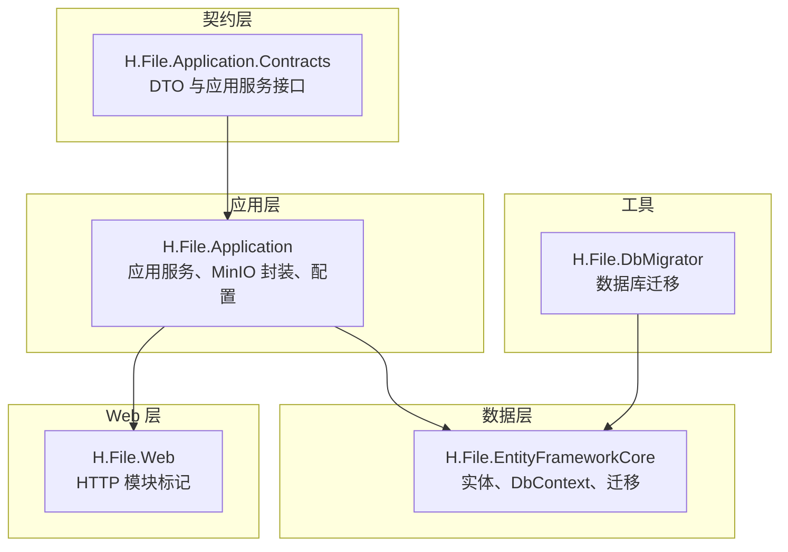
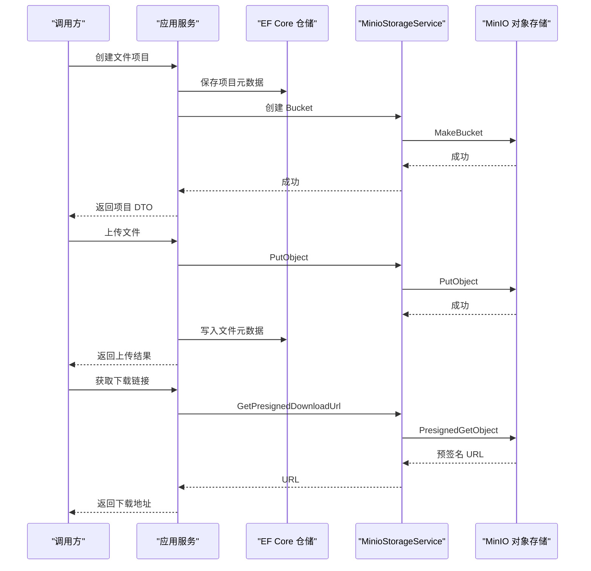
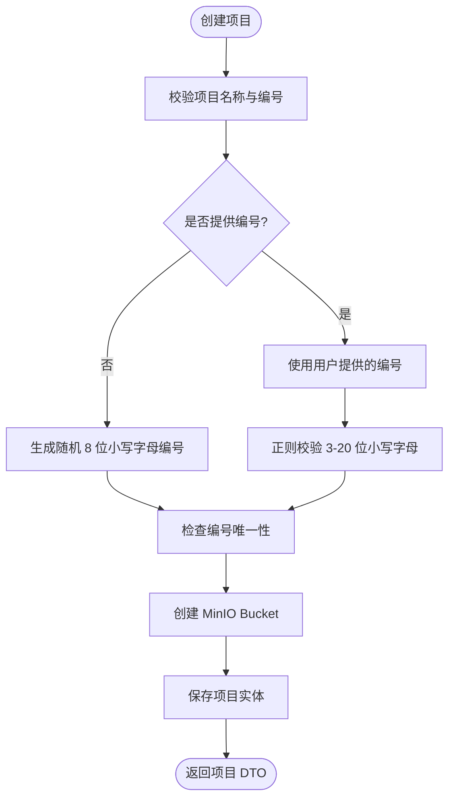
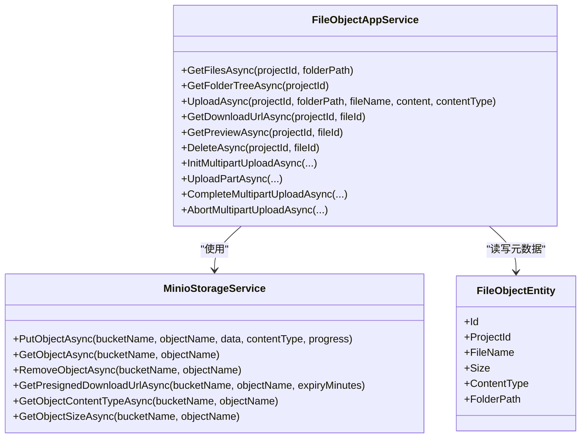
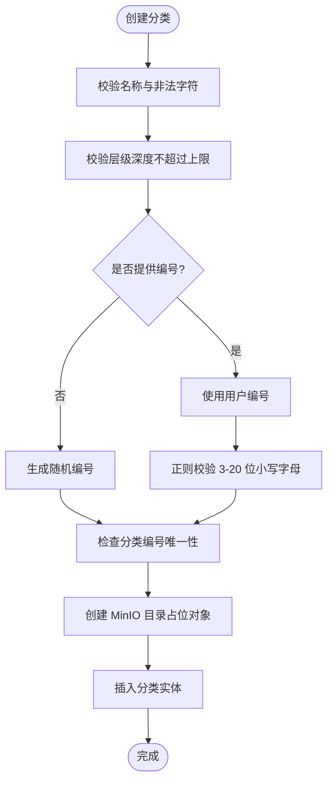
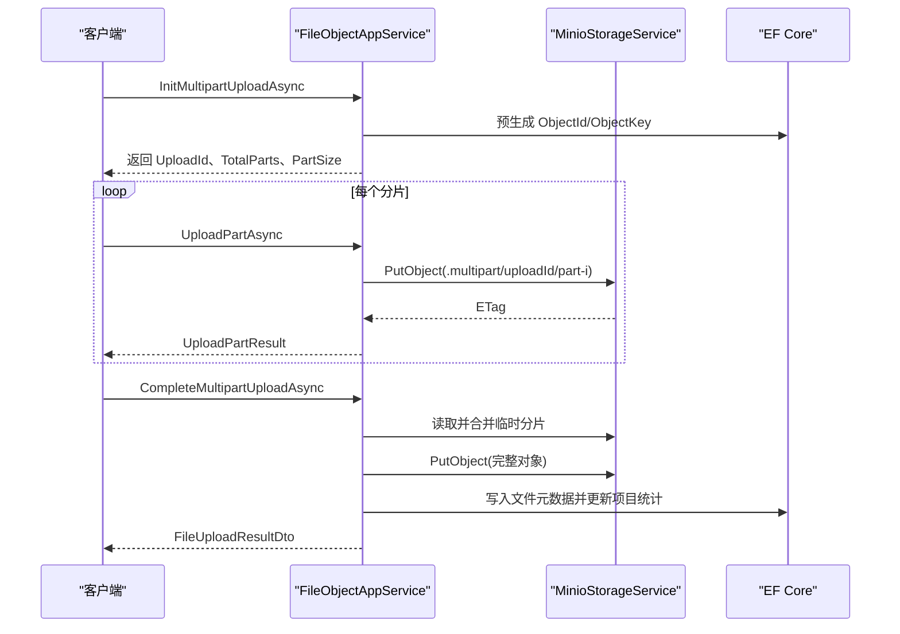
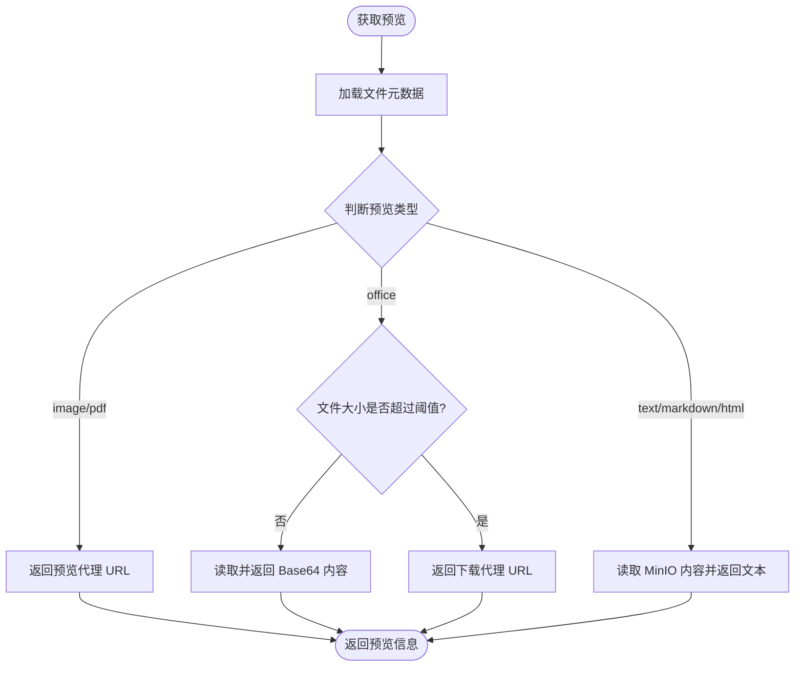
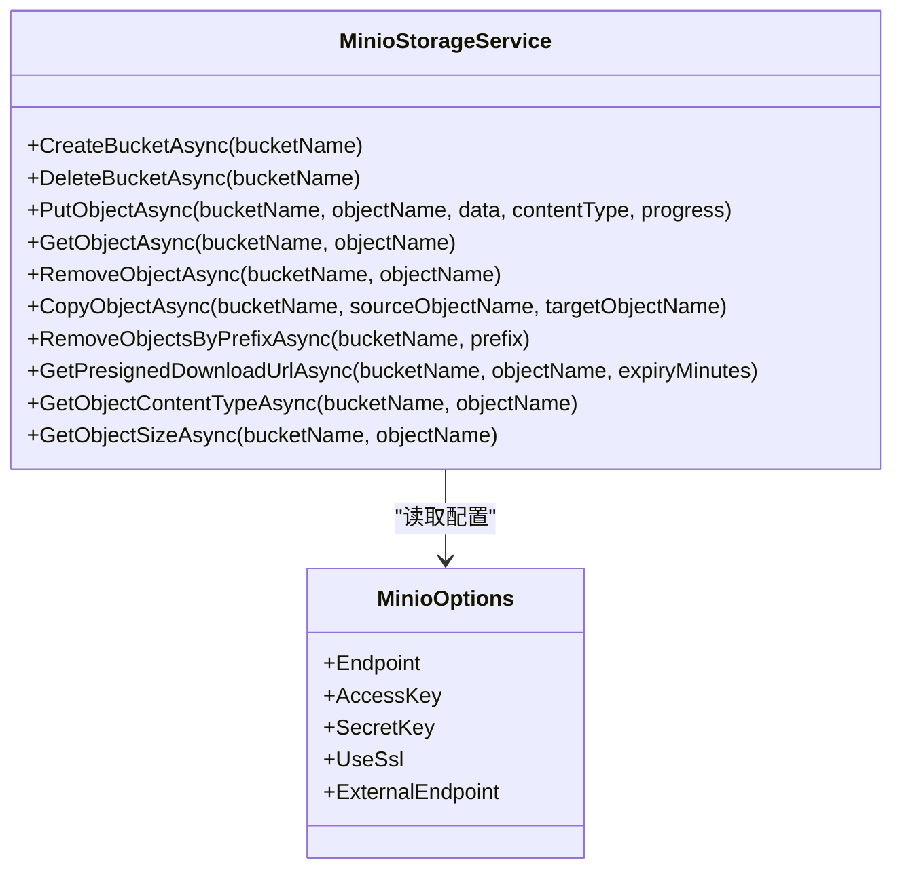
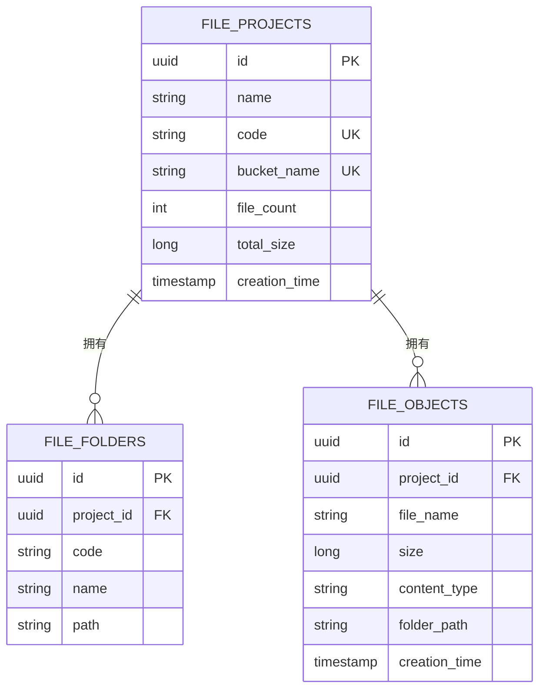
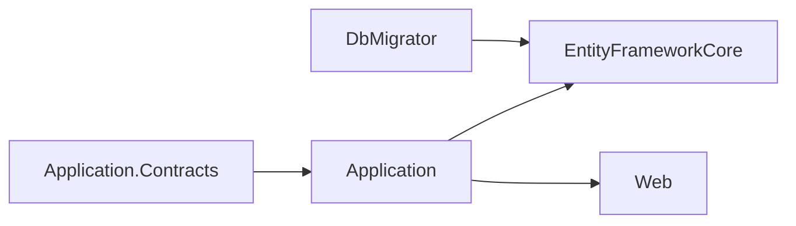

# File 文件服务

<cite>
**本文引用的文件 **
- [FileDtos.cs](file://src/Services/File/H.File.Application.Contracts/Dtos/FileDtos.cs)
- [IFileObjectAppService.cs](file://src/Services/File/H.File.Application.Contracts/Services/IFileObjectAppService.cs)
- [IFileProjectAppService.cs](file://src/Services/File/H.File.Application.Contracts/Services/IFileProjectAppService.cs)
- [FileApplicationContractsModule.cs](file://src/Services/File/H.File.Application.Contracts/FileApplicationContractsModule.cs)
- [FileObjectAppService.cs](file://src/Services/File/H.File.Application/Services/FileObjectAppService.cs)
- [FileProjectAppService.cs](file://src/Services/File/H.File.Application/Services/FileProjectAppService.cs)
- [MinioOptions.cs](file://src/Services/File/H.File.Application/MinioOptions.cs)
- [MinioStorageService.cs](file://src/Services/File/H.File.Application/Services/MinioStorageService.cs)
- [FileFolderEntity.cs](file://src/Services/File/H.File.EntityFrameworkCore/Entities/FileFolderEntity.cs)
- [FileProjectEntity.cs](file://src/Services/File/H.File.EntityFrameworkCore/Entities/FileProjectEntity.cs)
- [FileObjectEntity.cs](file://src/Services/File/H.File.EntityFrameworkCore/Entities/FileObjectEntity.cs)
- [FileDbContext.cs](file://src/Services/File/H.File.EntityFrameworkCore/FileDbContext.cs)
- [FileWebModule.cs](file://src/Services/File/H.File.Web/FileWebModule.cs)
- [Program.cs](file://src/Tools/H.File.DbMigrator/Program.cs)
- [20260804143050_Init.cs](file://src/Tools/H.File.DbMigrator/Migrations/20260804143050_Init.cs)
- [README.md](file://README.md)
</cite>

## 目录
1. [引言](#引言)
2. [项目结构](#项目结构)
3. [核心组件](#核心组件)
4. [架构总览](#架构总览)
5. [详细组件分析](#详细组件分析)
6. [依赖关系分析](#依赖关系分析)
7. [性能与扩展性](#性能与扩展性)
8. [API 使用示例](#api-使用示例)
9. [故障排查指南](#故障排查指南)
10. [结论](#结论)

## 引言
File 文件服务是一个基于 .NET、ABP 模块化架构的独立微服务，负责企业级文件上传、下载、预览、分类管理以及 MinIO 对象存储集成。其核心目标包括：
- 将业务文件持久化到 MinIO 对象存储，并通过数据库记录文件元数据，实现快速查询和统计。
- 提供文件项目（Bucket）与文件对象的统一管理能力。
- 支持文件分片上传流程框架、断点续传扩展点、临时访问链接生成等高级能力。
- 通过 ABP 应用服务接口暴露标准 API，便于前端或其他服务调用。

该服务采用典型分层结构：
- Application.Contracts：定义 DTO、枚举与应用服务接口契约。
- Application：应用服务实现、MinIO 客户端封装、配置选项。
- EntityFrameworkCore：领域实体、EF Core DbContext 及迁移。
- Web：对外暴露的 HTTP API 模块标记。
- Tools：数据库迁移工具。

**章节来源**
- [README.md:1-73](file://README.md#L1-L73)

## 项目结构
File 服务按 ABP 约定组织为多个程序集：

**图表来源**
- [FileApplicationContractsModule.cs:1-9](file://src/Services/File/H.File.Application.Contracts/FileApplicationContractsModule.cs#L1-L9)
- [FileWebModule.cs:1-8](file://src/Services/File/H.File.Web/FileWebModule.cs#L1-L8)
- [FileDbContext.cs:1-59](file://src/Services/File/H.File.EntityFrameworkCore/FileDbContext.cs#L1-L59)

**章节来源**
- [FileApplicationContractsModule.cs:1-9](file://src/Services/File/H.File.Application.Contracts/FileApplicationContractsModule.cs#L1-L9)
- [FileWebModule.cs:1-8](file://src/Services/File/H.File.Web/FileWebModule.cs#L1-L8)
- [FileDbContext.cs:1-59](file://src/Services/File/H.File.EntityFrameworkCore/FileDbContext.cs#L1-L59)

## 核心组件
- 应用服务接口：
  - IFileProjectAppService：管理文件项目（对应 MinIO Bucket）。
  - IFileObjectAppService：管理文件对象、文件夹树、上传、下载、预览、分片上传。
- DTO 模型：
  - FileProjectDto、CreateFileProjectDto、UpdateFileProjectDto
  - FileObjectDto、FileFolderDto、CreateFolderInput
  - FileUploadResultDto、FileDownloadResultDto、FilePreviewDto
  - 分片上传相关 DTO：MultipartUploadDto、UploadPartInput、UploadPartResult、CompleteMultipartUploadInput、UploadedPartDto
- 存储抽象：
  - MinioStorageService：封装 MinIO SDK 的 Bucket 管理、对象上传/下载、预签名 URL、对象信息读取。
- 领域实体：
  - FileProjectEntity：项目与 Bucket 映射，缓存文件数量和总大小。
  - FileFolderEntity：分类目录元数据，映射 MinIO 目录前缀。
  - FileObjectEntity：文件对象元数据，主键即 MinIO 对象名的一部分。
- 配置：
  - MinioOptions：Endpoint、AccessKey、SecretKey、UseSsl、ExternalEndpoint。

**章节来源**
- [IFileProjectAppService.cs:1-25](file://src/Services/File/H.File.Application.Contracts/Services/IFileProjectAppService.cs#L1-L25)
- [IFileObjectAppService.cs:1-52](file://src/Services/File/H.File.Application.Contracts/Services/IFileObjectAppService.cs#L1-L52)
- [FileDtos.cs:1-191](file://src/Services/File/H.File.Application.Contracts/Dtos/FileDtos.cs#L1-L191)
- [MinioStorageService.cs:1-190](file://src/Services/File/H.File.Application/Services/MinioStorageService.cs#L1-L190)
- [FileProjectEntity.cs:1-33](file://src/Services/File/H.File.EntityFrameworkCore/Entities/FileProjectEntity.cs#L1-L33)
- [FileFolderEntity.cs:1-24](file://src/Services/File/H.File.EntityFrameworkCore/Entities/FileFolderEntity.cs#L1-L24)
- [FileObjectEntity.cs:1-33](file://src/Services/File/H.File.EntityFrameworkCore/Entities/FileObjectEntity.cs#L1-L33)
- [MinioOptions.cs:1-14](file://src/Services/File/H.File.Application/MinioOptions.cs#L1-L14)

## 架构总览
文件服务的整体交互如下：

**图表来源**
- [FileProjectAppService.cs:1-158](file://src/Services/File/H.File.Application/Services/FileProjectAppService.cs#L1-L158)
- [FileObjectAppService.cs:1-200](file://src/Services/File/H.File.Application/Services/FileObjectAppService.cs#L1-L200)
- [MinioStorageService.cs:1-190](file://src/Services/File/H.File.Application/Services/MinioStorageService.cs#L1-L190)

## 详细组件分析

### 文件项目（Bucket）管理
- 功能要点：
  - 项目编号校验与自动生成，确保全局唯一。
  - 根据租户 ID 生成带前缀的 Bucket 名称。
  - 同步创建或删除 MinIO Bucket。
  - 从数据库直接读取项目统计信息，避免频繁调用 MinIO。
- 关键类与方法：
  - FileProjectAppService.CreateAsync：校验输入、生成唯一 Code、创建 Bucket、插入实体。
  - FileProjectAppService.DeleteAsync：删除 Bucket 后删除项目实体。
  - FileProjectAppService.GetListAsync：直接读取数据库统计。

**图表来源**
- [FileProjectAppService.cs:1-158](file://src/Services/File/H.File.Application/Services/FileProjectAppService.cs#L1-L158)

**章节来源**
- [FileProjectAppService.cs:1-158](file://src/Services/File/H.File.Application/Services/FileProjectAppService.cs#L1-L158)
- [FileProjectEntity.cs:1-33](file://src/Services/File/H.File.EntityFrameworkCore/Entities/FileProjectEntity.cs#L1-L33)

### 文件对象管理与上传
- 功能要点：
  - 普通上传：内容非空校验，预生成 Guid 作为对象名，写入 MinIO，更新数据库与项目统计。
  - 列表与文件夹树：基于数据库中的 FolderPath 构建层级树。
  - 预览：文本类型直接读取内容；图片/PDF 走服务端预览代理；Office 文件 Base64 或提示下载。
  - 下载：返回服务端代理地址，避免中文对象名在预签名 URL 中异常。
- 关键类与方法：
  - FileObjectAppService.UploadAsync：上传并写入元数据。
  - FileObjectAppService.GetFilesAsync、GetFolderTreeAsync：读取数据库构建响应。
  - FileObjectAppService.GetPreviewAsync：判断预览类型并读取内容或返回预览 URL。
  - FileObjectAppService.GetDownloadUrlAsync：返回 /api/file/download 代理地址。

**图表来源**
- [FileObjectAppService.cs:1-200](file://src/Services/File/H.File.Application/Services/FileObjectAppService.cs#L1-L200)
- [MinioStorageService.cs:1-190](file://src/Services/File/H.File.Application/Services/MinioStorageService.cs#L1-L190)
- [FileObjectEntity.cs:1-33](file://src/Services/File/H.File.EntityFrameworkCore/Entities/FileObjectEntity.cs#L1-L33)

**章节来源**
- [FileObjectAppService.cs:1-200](file://src/Services/File/H.File.Application/Services/FileObjectAppService.cs#L1-L200)
- [FileObjectEntity.cs:1-33](file://src/Services/File/H.File.EntityFrameworkCore/Entities/FileObjectEntity.cs#L1-L33)

### 分类（文件夹）管理
- 功能要点：
  - 创建分类时校验名称、路径深度与编号唯一性。
  - 在 MinIO 中创建空对象占位目录，并在数据库中记录分类元数据。
  - 重命名仅修改显示名称；删除包含子目录与所有文件元数据。
- 关键类与方法：
  - FileObjectAppService.CreateFolderAsync：校验、生成唯一 Code、创建目录、插入分类实体。
  - FileObjectAppService.RenameFolderAsync：更新分类名称。
  - FileObjectAppService.DeleteFolderAsync：批量删除 MinIO 对象与数据库记录，更新项目统计。

**图表来源**
- [FileObjectAppService.cs:201-512](file://src/Services/File/H.File.Application/Services/FileObjectAppService.cs#L201-L512)

**章节来源**
- [FileObjectAppService.cs:201-512](file://src/Services/File/H.File.Application/Services/FileObjectAppService.cs#L201-L512)
- [FileFolderEntity.cs:1-24](file://src/Services/File/H.File.EntityFrameworkCore/Entities/FileFolderEntity.cs#L1-L24)

### 分片上传与断点续传
- 当前实现状态：
  - InitMultipartUploadAsync：预生成 ObjectId 与 ObjectKey，计算总分片数与每片大小。
  - UploadPartInput/UploadPartResult：上传分片至临时目录 `.multipart/{uploadId}/part-{index}`。
  - CompleteMultipartUploadAsync：顺序读取临时分片并合并，最终写入完整对象并写库。
  - ListUploadedPartsAsync：当前返回空列表，未实现真正查询已上传分片。
  - AbortMultipartUploadAsync：当前为空实现，未清理临时分片。
- 建议改进：
  - 在 Init 阶段记录 BucketName，避免后续分片上传时推断错误。
  - 实现 ListUploadedPartsAsync，查询 MinIO Multipart Upload 列表，支持断点续传。
  - 完善 AbortMultipartUploadAsync，清理 `.multipart` 下的临时分片。
  - 考虑使用 MinIO SDK 原生 multipart upload API，减少内存占用与网络往返。

**图表来源**
- [FileObjectAppService.cs:201-512](file://src/Services/File/H.File.Application/Services/FileObjectAppService.cs#L201-L512)
- [FileDtos.cs:1-191](file://src/Services/File/H.File.Application.Contracts/Dtos/FileDtos.cs#L1-L191)

**章节来源**
- [FileObjectAppService.cs:201-512](file://src/Services/File/H.File.Application/Services/FileObjectAppService.cs#L201-L512)
- [FileDtos.cs:1-191](file://src/Services/File/H.File.Application.Contracts/Dtos/FileDtos.cs#L1-L191)

### 下载与预览
- 下载：
  - GetDownloadUrlAsync 返回服务端代理地址 `/api/file/download?projectId=...&fileId=...`，避免预签名 URL 对中文对象名的兼容性问题。
  - 实际下载逻辑应由 Web 控制器实现，从 MinIO 流式返回文件或返回预签名 URL。
- 预览：
  - 文本类文件：直接读取 MinIO 内容并以 UTF-8 解码返回。
  - 图片/PDF：返回服务端预览代理地址 `/api/file/preview?projectId=...&fileId=...`。
  - Office 文件：若小于阈值则返回 Base64 内容供前端解析，否则返回下载链接。

**图表来源**
- [FileObjectAppService.cs:1-200](file://src/Services/File/H.File.Application/Services/FileObjectAppService.cs#L1-L200)

**章节来源**
- [FileObjectAppService.cs:1-200](file://src/Services/File/H.File.Application/Services/FileObjectAppService.cs#L1-L200)

### MinIO 存储服务集成
- 能力概览：
  - Bucket 管理：创建、删除（递归删除对象后删除 Bucket）。
  - 对象操作：上传、下载、删除、复制、按前缀批量删除。
  - 元信息查询：ContentType、Size。
  - 预签名 URL：用于临时访问下载。
- 注意事项：
  - 上传空字节数组时 SDK 要求至少一个字节，代码中做了兜底处理。
  - 预签名 URL 默认过期时间 60 分钟，可按需调整。
  - ExternalEndpoint 可用于生成外部可访问的预览/下载 URL。

**图表来源**
- [MinioStorageService.cs:1-190](file://src/Services/File/H.File.Application/Services/MinioStorageService.cs#L1-L190)
- [MinioOptions.cs:1-14](file://src/Services/File/H.File.Application/MinioOptions.cs#L1-L14)

**章节来源**
- [MinioStorageService.cs:1-190](file://src/Services/File/H.File.Application/Services/MinioStorageService.cs#L1-L190)
- [MinioOptions.cs:1-14](file://src/Services/File/H.File.Application/MinioOptions.cs#L1-L14)

### 数据库模型与元数据管理
- 表结构要点：
  - FileProjects：项目基础信息与统计字段。
  - FileFolders：分类目录元数据，含 ProjectId、Code、Name、Path。
  - FileObjects：文件对象元数据，含 ProjectId、FileName、Size、ContentType、FolderPath。
- 索引与约束：
  - BucketName 唯一索引。
  - ProjectId 与 FolderPath 组合索引。
  - 各表包含审计字段（CreationTime 等）与多租户标识 TenantId。

**图表来源**
- [FileDbContext.cs:1-59](file://src/Services/File/H.File.EntityFrameworkCore/FileDbContext.cs#L1-L59)
- [FileProjectEntity.cs:1-33](file://src/Services/File/H.File.EntityFrameworkCore/Entities/FileProjectEntity.cs#L1-L33)
- [FileFolderEntity.cs:1-24](file://src/Services/File/H.File.EntityFrameworkCore/Entities/FileFolderEntity.cs#L1-L24)
- [FileObjectEntity.cs:1-33](file://src/Services/File/H.File.EntityFrameworkCore/Entities/FileObjectEntity.cs#L1-L33)

**章节来源**
- [FileDbContext.cs:1-59](file://src/Services/File/H.File.EntityFrameworkCore/FileDbContext.cs#L1-L59)

## 依赖关系分析
- 契约层被应用层引用，应用层依赖 EF Core 数据层。
- Web 层仅提供模块标记，具体 API 路由由 ABP 自动发现应用服务接口。
- DbMigrator 依赖 EF Core 模型进行数据库迁移。

**图表来源**
- [FileApplicationContractsModule.cs:1-9](file://src/Services/File/H.File.Application.Contracts/FileApplicationContractsModule.cs#L1-L9)
- [FileWebModule.cs:1-8](file://src/Services/File/H.File.Web/FileWebModule.cs#L1-L8)
- [Program.cs:1-200](file://src/Tools/H.File.DbMigrator/Program.cs#L1-L200)

**章节来源**
- [FileApplicationContractsModule.cs:1-9](file://src/Services/File/H.File.Application.Contracts/FileApplicationContractsModule.cs#L1-L9)
- [FileWebModule.cs:1-8](file://src/Services/File/H.File.Web/FileWebModule.cs#L1-L8)
- [Program.cs:1-200](file://src/Tools/H.File.DbMigrator/Program.cs#L1-L200)

## 性能与扩展性
- 性能优化策略：
  - 元数据缓存：项目统计信息（FileCount、TotalSize）保存在数据库中，避免每次查询都调用 MinIO。
  - 分片上传：支持大文件分片上传流程框架，减少单次请求体积，提高上传成功率。
  - 流式处理：MinIO 客户端使用流式上传与下载，避免一次性加载大文件到内存。
  - 预览类型判断：根据扩展名快速分类，减少不必要的 IO 操作。
- 可扩展点：
  - 自定义存储后端：通过替换 MinioStorageService 实现其他对象存储（如阿里云 OSS、腾讯云 COS）。
  - 文件转码处理：在上传完成后触发后台任务，对视频、图片等进行转码或压缩。
  - 病毒扫描：在上传流程中集成杀毒引擎，扫描文件后再落盘。
  - 版本控制：在 FileObjectEntity 中增加版本号字段，保留历史版本。
  - 访问日志：记录文件访问、下载、预览等操作日志，便于审计与监控。
  - CDN 加速：通过 ExternalEndpoint 指向 CDN 域名，结合预签名 URL 实现安全加速。
  - 负载均衡：部署多个 File 服务实例，MinIO 集群横向扩展。

[本节为通用指导，不直接分析具体文件]

## API 使用示例
以下为常见 API 调用场景说明（以接口契约为准，实际 HTTP 路由由 ABP 约定生成）：

- 创建文件项目
  - 接口：IFileProjectAppService.CreateAsync
  - 输入：CreateFileProjectDto{Name, Code?, Description?, Icon?}
  - 输出：FileProjectDto
  - 行为：校验项目编号、生成 Bucket、写入数据库并返回项目信息。

- 获取项目列表
  - 接口：IFileProjectAppService.GetListAsync
  - 输出：List<FileProjectDto>
  - 行为：返回所有项目及其统计信息。

- 上传文件
  - 接口：IFileObjectAppService.UploadAsync
  - 输入：projectId, folderPath?, fileName="", content=null, contentType=null
  - 输出：FileUploadResultDto
  - 行为：校验内容非空，写入 MinIO 与数据库，更新项目统计。

- 获取下载链接
  - 接口：IFileObjectAppService.GetDownloadUrlAsync
  - 输入：projectId, fileId
  - 输出：FileDownloadResultDto{Url}
  - 行为：返回服务端代理下载 URL。

- 获取预览信息
  - 接口：IFileObjectAppService.GetPreviewAsync
  - 输入：projectId, fileId
  - 输出：FilePreviewDto{FileName, ContentType, Size, PreviewType, PreviewUrl?, TextContent?, Base64Content?}
  - 行为：根据扩展名判断预览类型，返回文本内容、预览 URL 或 Base64。

- 初始化分片上传
  - 接口：IFileObjectAppService.InitMultipartUploadAsync
  - 输入：projectId, folderPath?, fileName="", fileSize=0, contentType=null
  - 输出：MultipartUploadDto{UploadId, ObjectId, ObjectKey, TotalParts, PartSize}
  - 行为：预生成对象名与分片信息。

- 上传单个分片
  - 接口：IFileObjectAppService.UploadPartAsync
  - 输入：UploadPartInput{UploadId, ObjectKey, BucketName, PartIndex, Data}
  - 输出：UploadPartResult{PartIndex, ETag, Success, Message?}
  - 行为：将分片写入临时目录。

- 查询已上传分片
  - 接口：IFileObjectAppService.ListUploadedPartsAsync
  - 输入：uploadId, objectKey
  - 输出：List<UploadedPartDto>
  - 行为：当前返回空列表，需扩展实现。

- 完成分片上传
  - 接口：IFileObjectAppService.CompleteMultipartUploadAsync
  - 输入：CompleteMultipartUploadInput{ProjectId, UploadId, ObjectId, ObjectKey, FileName, FileSize, ContentType?, FolderPath?, Parts[]}
  - 输出：FileUploadResultDto
  - 行为：合并临时分片、写入完整对象与元数据、更新项目统计。

- 取消分片上传
  - 接口：IFileObjectAppService.AbortMultipartUploadAsync
  - 输入：uploadId, objectKey
  - 输出：BaseOutput
  - 行为：当前为空实现，需扩展清理临时分片。

**章节来源**
- [IFileProjectAppService.cs:1-25](file://src/Services/File/H.File.Application.Contracts/Services/IFileProjectAppService.cs#L1-L25)
- [IFileObjectAppService.cs:1-52](file://src/Services/File/H.File.Application.Contracts/Services/IFileObjectAppService.cs#L1-L52)
- [FileDtos.cs:1-191](file://src/Services/File/H.File.Application.Contracts/Dtos/FileDtos.cs#L1-L191)

## 故障排查指南
- 上传失败：
  - 检查 FileObjectAppService.UploadAsync 是否抛出 UserFriendlyException（内容为空）。
  - 检查 MinIO 连接配置是否正确（Endpoint、AccessKey、SecretKey、UseSsl）。
  - 查看 MinioStorageService.PutObjectAsync 是否捕获异常并返回成功标志。
- 下载异常：
  - 确认 GetDownloadUrlAsync 返回的服务端代理地址是否可达。
  - 检查实际下载控制器是否存在并正确处理 projectId 与 fileId。
- 预览失败：
  - 检查 FileObjectAppService.GetPreviewAsync 中的预览类型判断逻辑。
  - 对于 Office 文件，确认文件大小是否超过阈值导致返回下载链接。
- 分片上传问题：
  - 确认 InitMultipartUploadAsync 正确生成 UploadId 与 ObjectKey。
  - 检查 UploadPartAsync 是否正确写入临时目录。
  - 完善 ListUploadedPartsAsync 与 AbortMultipartUploadAsync 以实现断点续传与清理。
- 数据库迁移：
  - 使用 H.File.DbMigrator 执行迁移，确保 FileDbContext 模型与数据库一致。
  - 检查 20260804143050_Init.cs 中的初始迁移脚本。

**章节来源**
- [FileObjectAppService.cs:1-512](file://src/Services/File/H.File.Application/Services/FileObjectAppService.cs#L1-L512)
- [MinioStorageService.cs:1-190](file://src/Services/File/H.File.Application/Services/MinioStorageService.cs#L1-L190)
- [20260804143050_Init.cs:1-200](file://src/Tools/H.File.DbMigrator/Migrations/20260804143050_Init.cs#L1-L200)

## 结论
File 文件服务以 ABP 模块化架构为基础，围绕 MinIO 对象存储构建了完整的文件管理能力。其核心优势包括：
- 清晰的层次划分与职责分离。
- 完善的文件项目与对象元数据管理。
- 支持分片上传框架与多种预览类型。
- 易于扩展的存储抽象与服务接口。

未来可在断点续传、病毒扫描、版本控制、访问日志等方面进一步增强，同时结合 CDN 与缓存机制提升性能与用户体验。