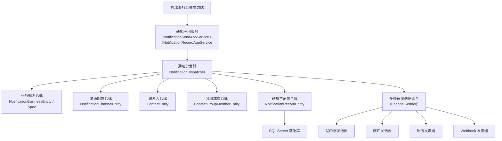
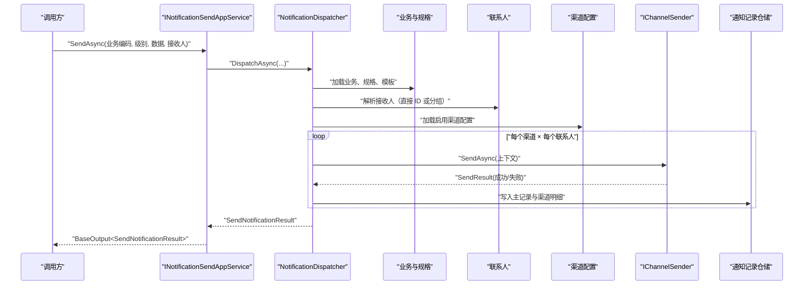
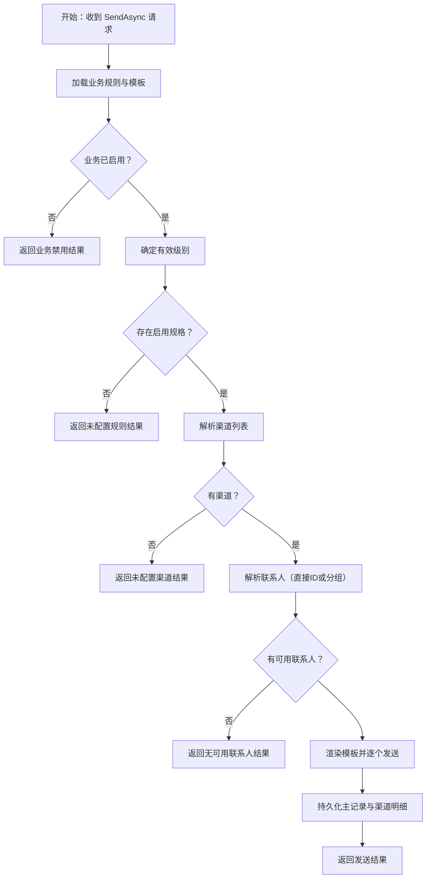
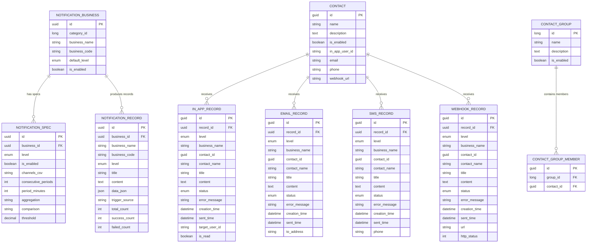

# Notification 通知中心

<cite>
**本文引用的文件**   
- [README.md](file://README.md)
- [NotificationApplicationModule.cs](file://src/Services/Notification/H.Notification.Application/NotificationApplicationModule.cs)
- [NotificationEntityFrameworkCoreModule.cs](file://src/Services/Notification/H.Notification.EntityFrameworkCore/NotificationEntityFrameworkCoreModule.cs)
- [NotificationWebModule.cs](file://src/Services/Notification/H.Notification.Web/NotificationWebModule.cs)
- [INotificationAppService.cs](file://src/Services/Notification/H.Notification.Application.Contracts/Services/INotificationAppService.cs)
- [NotificationSendAppService.cs](file://src/Services/Notification/H.Notification.Application/Services/NotificationSendAppService.cs)
- [NotificationRecordAppService.cs](file://src/Services/Notification/H.Notification.Application/Services/NotificationRecordAppService.cs)
- [ContactAppService.cs](file://src/Services/Notification/H.Notification.Application/Services/ContactAppService.cs)
- [ContactGroupAppService.cs](file://src/Services/Notification/H.Notification.Application/Services/ContactGroupAppService.cs)
- [NotificationBusinessAppService.cs](file://src/Services/Notification/H.Notification.Application/Services/NotificationBusinessAppService.cs)
- [NotificationCategoryAppService.cs](file://src/Services/Notification/H.Notification.Application/Services/NotificationCategoryAppService.cs)
- [NotificationChannelAppService.cs](file://src/Services/Notification/H.Notification.Application/Services/NotificationChannelAppService.cs)
- [NotificationDispatcher.cs](file://src/Services/Notification/H.Notification.Application/Sending/NotificationDispatcher.cs)
- [IChannelSender.cs](file://src/Services/Notification/H.Notification.Application/Sending/IChannelSender.cs)
- [InAppSender.cs](file://src/Services/Notification/H.Notification.Application/Sending/InAppSender.cs)
- [EmailSender.cs](file://src/Services/Notification/H.Notification.Application/Sending/EmailSender.cs)
- [SmsSender.cs](file://src/Services/Notification/H.Notification.Application/Sending/SmsSender.cs)
- [WebhookSender.cs](file://src/Services/Notification/H.Notification.Application/Sending/WebhookSender.cs)
</cite>

## 目录
1. [引言](#引言)
2. [项目结构与定位](#项目结构与定位)
3. [核心能力概览](#核心能力概览)
4. [架构总览](#架构总览)
5. [关键组件与职责](#关键组件与职责)
6. [通知分发与投递流程](#通知分发与投递流程)
7. [数据模型与持久化](#数据模型与持久化)
8. [API 使用指南](#api-使用指南)
9. [性能与可靠性设计](#性能与可靠性设计)
10. [扩展点与二次开发](#扩展点与二次开发)
11. [常见问题排查](#常见问题排查)
12. [结论](#结论)

## 引言
Notification 通知中心是一个面向企业级应用的多渠道通知服务。它把站内信、邮件、短信、Webhook 等渠道统一抽象，通过业务编码、通知级别、联系人组、消息模板和规则配置，实现“业务事件 → 路由决策 → 模板渲染 → 多渠道发送 → 回执记录”的完整闭环。该服务基于 .NET 模块化架构，采用 ABP 分层模式，提供 Application、Application.Contracts、EntityFrameworkCore、Web 四个层次，便于单体部署或按服务独立部署。

## 项目结构与定位
从仓库结构看，Notification 属于 Services 层中的基础服务能力之一，遵循与其他服务一致的模块组织方式：
- H.Notification.Application.Contracts：对外暴露的应用契约、DTO、枚举、模块标记。
- H.Notification.Application：应用服务、领域编排逻辑、模板渲染、多渠道发送器。
- H.Notification.EntityFrameworkCore：实体、DbContext、EF Core 模块注册。
- H.Notification.Web：Web 模块标记类，用于宿主集成。

根目录 README 说明该项目支持模块化架构、Abp 风格的服务划分、前端通过 HttpClientProxy 动态调用 IAppService，以及工具链包含各服务的 DbMigrator。Notification 模块也提供了独立的迁移工具入口。

**章节来源**
- [README.md:1-73](file://README.md#L1-L73)

## 核心能力概览
- 多渠道通知发送：统一抽象 InApp、Email、Sms、Webhook 四种渠道。
- 业务通知规则：每个业务可定义默认级别、规格（级别→渠道→阈值/聚合策略）、模板、绑定的联系人组。
- 联系人管理：联系人可绑定多个分组，支持启用状态、多种目标地址字段。
- 通知记录查询：主记录 + 各渠道明细记录，支持分页、过滤、状态筛选。
- 模板渲染：标题和内容支持基于业务数据的模板替换。
- 可扩展发送器：通过 IChannelSender 扩展新渠道。
- 测试与 API 触发：支持 Api 触发和 Test 触发两种来源标记。

**章节来源**
- [INotificationAppService.cs:1-108](file://src/Services/Notification/H.Notification.Application.Contracts/Services/INotificationAppService.cs#L1-L108)
- [NotificationDispatcher.cs:1-200](file://src/Services/Notification/H.Notification.Application/Sending/NotificationDispatcher.cs#L1-L200)

## 架构总览
Notification 服务采用典型 ABP 分层：
- Web 层仅承载 HTTP 接口；
- Application 层提供 IAppService 应用服务和通知分发编排；
- EntityFrameworkCore 层负责数据访问与数据库连接；
- Contracts 层暴露 DTO、枚举和应用契约。

**图表来源**
- [NotificationApplicationModule.cs:1-26](file://src/Services/Notification/H.Notification.Application/NotificationApplicationModule.cs#L1-L26)
- [NotificationEntityFrameworkCoreModule.cs:1-32](file://src/Services/Notification/H.Notification.EntityFrameworkCore/NotificationEntityFrameworkCoreModule.cs#L1-L32)
- [NotificationDispatcher.cs:1-200](file://src/Services/Notification/H.Notification.Application/Sending/NotificationDispatcher.cs#L1-L200)
- [IChannelSender.cs:1-50](file://src/Services/Notification/H.Notification.Application/Sending/IChannelSender.cs#L1-L50)

## 关键组件与职责

### 应用契约与入口
INotificationAppService 定义了通知中心的六大能力域：
- 通知分类管理：INotificationCategoryAppService。
- 联系人管理：IContactAppService。
- 联系人分组管理：IContactGroupAppService。
- 通知渠道管理：INotificationChannelAppService。
- 通知业务与规则管理：INotificationBusinessAppService。
- 通知发送与测试：INotificationSendAppService。
- 通知记录查询：INotificationRecordAppService。

这些接口统一返回 BaseOutput<T>，并复用 ABP 的分页与基础输出类型。

**章节来源**
- [INotificationAppService.cs:1-108](file://src/Services/Notification/H.Notification.Application.Contracts/Services/INotificationAppService.cs#L1-L108)

### 通知发送应用服务
NotificationSendAppService 是对外发送入口，将业务编码、级别、数据、接收人列表与触发来源交给 NotificationDispatcher 处理，并把结果包装为 BaseOutput<SendNotificationResult>。

**章节来源**
- [NotificationSendAppService.cs:1-28](file://src/Services/Notification/H.Notification.Application/Services/NotificationSendAppService.cs#L1-L28)

### 通知分发器
NotificationDispatcher 是整个通知系统的编排核心，承担以下职责：
- 根据 businessCode 加载业务、规格、模板；
- 计算有效级别、解析渠道列表；
- 解析联系人（直接指定或按业务绑定联系人组）；
- 加载启用的渠道配置；
- 渲染标题与内容；
- 遍历渠道 × 联系人，逐个调用对应 IChannelSender；
- 写入主记录与各渠道明细记录；
- 汇总成功/失败计数并返回 SendNotificationResult。

**章节来源**
- [NotificationDispatcher.cs:1-200](file://src/Services/Notification/H.Notification.Application/Sending/NotificationDispatcher.cs#L1-L200)
- [NotificationDispatcher.cs:201-338](file://src/Services/Notification/H.Notification.Application/Sending/NotificationDispatcher.cs#L201-L338)

### 多渠道发送器
所有发送器实现 IChannelSender，并通过依赖注入被分发器发现：
- InAppSender：站内信，落库即视为送达，无需额外网络调用。
- EmailSender：基于 System.Net.Mail.SmtpClient，读取 JSON 配置的 SMTP 参数。
- SmsSender：当前为桩实现，打印日志后返回成功，预留接入真实短信网关的能力。
- WebhookSender：HTTP POST，支持自定义请求头，使用 IHttpClientFactory 创建客户端。

**章节来源**
- [IChannelSender.cs:1-50](file://src/Services/Notification/H.Notification.Application/Sending/IChannelSender.cs#L1-L50)
- [InAppSender.cs:1-23](file://src/Services/Notification/H.Notification.Application/Sending/InAppSender.cs#L1-L23)
- [EmailSender.cs:1-97](file://src/Services/Notification/H.Notification.Application/Sending/EmailSender.cs#L1-L97)
- [SmsSender.cs:1-32](file://src/Services/Notification/H.Notification.Application/Sending/SmsSender.cs#L1-L32)
- [WebhookSender.cs:1-101](file://src/Services/Notification/H.Notification.Application/Sending/WebhookSender.cs#L1-L101)

### 通知记录查询服务
NotificationRecordAppService 提供主记录和四类渠道记录的查询接口，支持分页、状态过滤、关键字模糊匹配。每条渠道记录都携带 recordId 与主记录关联。

**章节来源**
- [NotificationRecordAppService.cs:1-187](file://src/Services/Notification/H.Notification.Application/Services/NotificationRecordAppService.cs#L1-L187)

### 联系人及分组管理
- ContactAppService：联系人增删改查、启用状态、多字段目标地址、分组关联。
- ContactGroupAppService：分组增删改查、批量替换成员、统计成员数量。

**章节来源**
- [ContactAppService.cs:1-116](file://src/Services/Notification/H.Notification.Application/Services/ContactAppService.cs#L1-L116)
- [ContactGroupAppService.cs:1-122](file://src/Services/Notification/H.Notification.Application/Services/ContactGroupAppService.cs#L1-L122)

### 业务与分类、渠道管理
- NotificationCategoryAppService：通知分类 CRUD，删除时校验是否仍有业务引用。
- NotificationBusinessAppService：业务 CRUD、规格 CRUD、模板设置、联系人组绑定、业务编码校验、分类名称映射。
- NotificationChannelAppService：渠道配置 CRUD，支持按启用状态获取列表。

**章节来源**
- [NotificationCategoryAppService.cs:1-96](file://src/Services/Notification/H.Notification.Application/Services/NotificationCategoryAppService.cs#L1-L96)
- [NotificationBusinessAppService.cs:1-200](file://src/Services/Notification/H.Notification.Application/Services/NotificationBusinessAppService.cs#L1-L200)
- [NotificationChannelAppService.cs:1-69](file://src/Services/Notification/H.Notification.Application/Services/NotificationChannelAppService.cs#L1-L69)

## 通知分发与投递流程

### 端到端序列图

**图表来源**
- [NotificationSendAppService.cs:1-28](file://src/Services/Notification/H.Notification.Application/Services/NotificationSendAppService.cs#L1-L28)
- [NotificationDispatcher.cs:1-200](file://src/Services/Notification/H.Notification.Application/Sending/NotificationDispatcher.cs#L1-L200)
- [IChannelSender.cs:1-50](file://src/Services/Notification/H.Notification.Application/Sending/IChannelSender.cs#L1-L50)

### 分发决策流程图

**图表来源**
- [NotificationDispatcher.cs:1-200](file://src/Services/Notification/H.Notification.Application/Sending/NotificationDispatcher.cs#L1-L200)

## 数据模型与持久化
通知中心的数据围绕“业务规则、联系人、渠道、通知记录”展开：
- 业务实体：包含分类、业务编码、默认级别、模板集合、规格集合、分组绑定。
- 规格实体：按级别配置渠道、阈值、聚合策略、周期等。
- 联系人实体：姓名、描述、启用状态、站内信用户标识、邮箱、手机号、Webhook 地址。
- 联系人分组与成员：分组基本信息与成员关系。
- 通知主记录：业务信息、级别、标题、内容、数据快照、触发来源、总数/成功数/失败数。
- 渠道明细记录：站内信、邮件、短信、Webhook 各自一条记录，含状态、错误信息、发送时间、目标地址等。

**图表来源**
- [NotificationDispatcher.cs:201-338](file://src/Services/Notification/H.Notification.Application/Sending/NotificationDispatcher.cs#L201-L338)
- [NotificationRecordAppService.cs:1-187](file://src/Services/Notification/H.Notification.Application/Services/NotificationRecordAppService.cs#L1-L187)
- [NotificationBusinessAppService.cs:1-200](file://src/Services/Notification/H.Notification.Application/Services/NotificationBusinessAppService.cs#L1-L200)

## API 使用指南

### 发送通知
- 接口：INotificationSendAppService.SendAsync
- 输入：业务编码、通知级别、业务数据字典、接收人 ID 列表。
- 输出：SendNotificationResult，包含 messageId、totalCount、successCount、failedCount、message。
- 典型步骤：
  1. 确保业务编码存在且启用。
  2. 为该业务在对应级别配置了启用规格与渠道。
  3. 指定接收人或直接绑定联系人组。
  4. 调用 SendAsync，返回发送汇总结果。

**章节来源**
- [INotificationAppService.cs:1-108](file://src/Services/Notification/H.Notification.Application.Contracts/Services/INotificationAppService.cs#L1-L108)
- [NotificationSendAppService.cs:1-28](file://src/Services/Notification/H.Notification.Application/Services/NotificationSendAppService.cs#L1-L28)

### 测试发送
- 接口：INotificationSendAppService.TestSendAsync
- 与 SendAsync 相同输入，但触发来源标记为 Test，便于测试环境隔离分析。

**章节来源**
- [INotificationAppService.cs:1-108](file://src/Services/Notification/H.Notification.Application.Contracts/Services/INotificationAppService.cs#L1-L108)
- [NotificationSendAppService.cs:1-28](file://src/Services/Notification/H.Notification.Application/Services/NotificationSendAppService.cs#L1-L28)

### 查询通知历史
- 主记录：GetMasterListAsync，可按业务、级别筛选，按创建时间倒序分页。
- 渠道明细：
  - GetInAppListAsync：按状态、联系人名/业务名模糊搜索。
  - GetEmailListAsync：按状态、联系人名/收件人邮箱模糊搜索。
  - GetSmsListAsync：按状态、联系人名/手机号模糊搜索。
  - GetWebhookListAsync：按状态、联系人名/Webhook URL 模糊搜索。

**章节来源**
- [INotificationAppService.cs:1-108](file://src/Services/Notification/H.Notification.Application.Contracts/Services/INotificationAppService.cs#L1-L108)
- [NotificationRecordAppService.cs:1-187](file://src/Services/Notification/H.Notification.Application/Services/NotificationRecordAppService.cs#L1-L187)

### 管理联系人
- 联系人列表：支持关键词搜索、按分组过滤、分页。
- 启用联系人列表：快速取全部启用联系人。
- 联系人详情：包含所属分组 ID 列表。
- 创建/更新：维护姓名、描述、启用状态、站内信用户标识、邮箱、手机号、Webhook 地址。
- 删除：物理删除联系人。

**章节来源**
- [INotificationAppService.cs:1-108](file://src/Services/Notification/H.Notification.Application.Contracts/Services/INotificationAppService.cs#L1-L108)
- [ContactAppService.cs:1-116](file://src/Services/Notification/H.Notification.Application/Services/ContactAppService.cs#L1-L116)

### 管理联系人分组
- 分组列表：支持名称模糊搜索、分页。
- 启用分组列表：快速获取全部启用分组。
- 分组详情：包含成员联系人 ID 列表与成员数量。
- 创建/更新：会替换现有成员，去重保存。
- 删除：先清理成员关系再删除分组。

**章节来源**
- [INotificationAppService.cs:1-108](file://src/Services/Notification/H.Notification.Application.Contracts/Services/INotificationAppService.cs#L1-L108)
- [ContactGroupAppService.cs:1-122](file://src/Services/Notification/H.Notification.Application/Services/ContactGroupAppService.cs#L1-L122)

### 管理通知业务与规则
- 业务列表：支持名称/编码模糊搜索、按分类过滤、分页。
- 业务详情：包含分类名称、模板、规格、分组绑定。
- 创建业务：校验业务编码后缀（小写字母 3-16 位），校验分类存在，生成全量编码。
- 更新业务：可覆盖模板集合。
- 删除业务：物理删除。
- 规格管理：按级别配置渠道 CSV、连续周期、周期分钟、聚合、比较、阈值。
- 分组绑定：设置业务对应的联系人组 ID 列表。

**章节来源**
- [INotificationAppService.cs:1-108](file://src/Services/Notification/H.Notification.Application.Contracts/Services/INotificationAppService.cs#L1-L108)
- [NotificationBusinessAppService.cs:1-200](file://src/Services/Notification/H.Notification.Application/Services/NotificationBusinessAppService.cs#L1-L200)

### 管理通知渠道
- 渠道列表：支持名称/代码模糊搜索、分页。
- 渠道详情：包含渠道类型与 JSON 配置。
- 创建/更新：映射 DTO 到实体并持久化。
- 删除：物理删除。
- 启用渠道列表：供分发器加载渠道配置。

**章节来源**
- [INotificationAppService.cs:1-108](file://src/Services/Notification/H.Notification.Application.Contracts/Services/INotificationAppService.cs#L1-L108)
- [NotificationChannelAppService.cs:1-69](file://src/Services/Notification/H.Notification.Application/Services/NotificationChannelAppService.cs#L1-L69)

## 性能与可靠性设计

### 异步与并发
- 应用服务与仓储调用均为 async/await 异步模型。
- 分发器在渠道 × 联系人循环中串行调用发送器，保证每条投递状态清晰、易于审计；如需更高吞吐，可在外层引入任务并行或消息队列。

### 批量操作
- 联系人分组成员替换使用 DeleteManyAsync + InsertManyAsync，减少多次往返。
- 业务规格与分组绑定采用批量删除后再批量插入，简化一致性。

### 异常与失败路径
- SafeSendAsync 捕获发送器异常，记录日志并返回失败结果，避免一次失败影响整体分发流程。
- 渠道缺失、地址为空、业务禁用、规则未配置等边界条件均返回明确 message。
- 邮件与 Webhook 发送器分别对配置解析、网络异常进行 try/catch 并返回失败原因。

### 幂等性与去重
- 当前分发器按每次调用创建新的主记录，未实现全局去重键；若需幂等，可在业务侧传入唯一业务键并在分发阶段增加去重检查。

### 配置与连接
- EF Core 使用 SQL Server，连接串来自配置文件中的 NotificationDb。
- Webhook 发送器使用 IHttpClientFactory 创建 HttpClient，有利于连接池与 DNS 刷新。
- ApplicationModule 注册 HttpContextAccessor 与 AddHttpClient，便于后续扩展。

**章节来源**
- [NotificationEntityFrameworkCoreModule.cs:1-32](file://src/Services/Notification/H.Notification.EntityFrameworkCore/NotificationEntityFrameworkCoreModule.cs#L1-L32)
- [NotificationApplicationModule.cs:1-26](file://src/Services/Notification/H.Notification.Application/NotificationApplicationModule.cs#L1-L26)
- [NotificationDispatcher.cs:1-200](file://src/Services/Notification/H.Notification.Application/Sending/NotificationDispatcher.cs#L1-L200)
- [EmailSender.cs:1-97](file://src/Services/Notification/H.Notification.Application/Sending/EmailSender.cs#L1-L97)
- [WebhookSender.cs:1-101](file://src/Services/Notification/H.Notification.Application/Sending/WebhookSender.cs#L1-L101)

## 扩展点与二次开发

### 新增通知渠道
1. 在枚举中添加新渠道类型（如 NotificationChannelType）。
2. 实现 IChannelSender，注入所需依赖，例如 SmtpClient、Http 客户端、第三方 SDK。
3. 在渠道配置表中添加该渠道类型的 JSON 配置项。
4. 在业务规格中启用该渠道，并在联系人上填写目标地址。
5. 分发器会自动发现所有 IChannelSender 实现并按渠道类型选择发送器。

**章节来源**
- [IChannelSender.cs:1-50](file://src/Services/Notification/H.Notification.Application/Sending/IChannelSender.cs#L1-L50)
- [NotificationDispatcher.cs:1-200](file://src/Services/Notification/H.Notification.Application/Sending/NotificationDispatcher.cs#L1-L200)

### 自定义智能路由规则
当前路由由业务规格决定：级别 → 渠道列表 → 联系人。可扩展方向包括：
- 按业务等级、联系人优先级、渠道负载动态选择渠道。
- 按时间段或渠道健康状态降级。
- 按业务数据内容分流不同渠道。

建议在不改动分发主流程的前提下，封装一个路由策略服务，由 NotificationDispatcher 在解析渠道前调用。

**章节来源**
- [NotificationBusinessAppService.cs:1-200](file://src/Services/Notification/H.Notification.Application/Services/NotificationBusinessAppService.cs#L1-L200)
- [NotificationDispatcher.cs:1-200](file://src/Services/Notification/H.Notification.Application/Sending/NotificationDispatcher.cs#L1-L200)

### 消息去重
当前未内置去重。可通过以下方式实现：
- 在 SendAsync 之前，用业务唯一键 + 级别 + 时间窗口做 Redis 去重。
- 在分发器中加入去重仓储，记录已发送的业务键，避免重复投递。

**章节来源**
- [NotificationSendAppService.cs:1-28](file://src/Services/Notification/H.Notification.Application/Services/NotificationSendAppService.cs#L1-L28)
- [NotificationDispatcher.cs:1-200](file://src/Services/Notification/H.Notification.Application/Sending/NotificationDispatcher.cs#L1-L200)

### 失败重试与退避
当前发送失败直接标记为 Failed，未自动重试。可引入后台任务或消息队列：
- 将失败记录放入重试队列。
- 按指数退避策略重发，达到最大次数后转人工处理。
- 结合 BackgroundTask 服务实现定时扫描与重发。

**章节来源**
- [NotificationRecordAppService.cs:1-187](file://src/Services/Notification/H.Notification.Application/Services/NotificationRecordAppService.cs#L1-L187)
- [NotificationDispatcher.cs:1-200](file://src/Services/Notification/H.Notification.Application/Sending/NotificationDispatcher.cs#L1-L200)

## 常见问题排查

### 发送结果为“未找到业务编码”
- 检查业务编码是否正确、是否存在、是否启用。
- 确认业务所属分类正确，业务编码格式符合规则。

**章节来源**
- [NotificationBusinessAppService.cs:1-200](file://src/Services/Notification/H.Notification.Application/Services/NotificationBusinessAppService.cs#L1-L200)
- [NotificationDispatcher.cs:1-200](file://src/Services/Notification/H.Notification.Application/Sending/NotificationDispatcher.cs#L1-L200)

### 发送结果为“未配置通知规则”或“未配置渠道”
- 为对应级别配置启用规格，并填写渠道列表。
- 确认渠道配置 JSON 正确且渠道本身启用。

**章节来源**
- [NotificationBusinessAppService.cs:1-200](file://src/Services/Notification/H.Notification.Application/Services/NotificationBusinessAppService.cs#L1-L200)
- [NotificationChannelAppService.cs:1-69](file://src/Services/Notification/H.Notification.Application/Services/NotificationChannelAppService.cs#L1-L69)

### 发送结果为“未解析到可用联系人”
- 如果未传接收人 ID，需为业务绑定联系人组，并确保组成员启用。
- 如果传了接收人 ID，确保联系人启用。

**章节来源**
- [NotificationDispatcher.cs:201-338](file://src/Services/Notification/H.Notification.Application/Sending/NotificationDispatcher.cs#L201-L338)
- [ContactAppService.cs:1-116](file://src/Services/Notification/H.Notification.Application/Services/ContactAppService.cs#L1-L116)
- [ContactGroupAppService.cs:1-122](file://src/Services/Notification/H.Notification.Application/Services/ContactGroupAppService.cs#L1-L122)

### 渠道发送失败
- 站内信：检查 InAppUserId 是否为空。
- 邮件：检查 ChannelConfigJson 是否包含 Host、From，SMTP 账号密码是否正确。
- 短信：当前为桩实现，不会真正发送；接入真实网关后需补充配置。
- Webhook：检查 URL、HTTP 状态码、自定义头配置。

**章节来源**
- [InAppSender.cs:1-23](file://src/Services/Notification/H.Notification.Application/Sending/InAppSender.cs#L1-L23)
- [EmailSender.cs:1-97](file://src/Services/Notification/H.Notification.Application/Sending/EmailSender.cs#L1-L97)
- [SmsSender.cs:1-32](file://src/Services/Notification/H.Notification.Application/Sending/SmsSender.cs#L1-L32)
- [WebhookSender.cs:1-101](file://src/Services/Notification/H.Notification.Application/Sending/WebhookSender.cs#L1-L101)

### 无法删除分类
- 分类下仍存在业务时不允许删除。

**章节来源**
- [NotificationCategoryAppService.cs:1-96](file://src/Services/Notification/H.Notification.Application/Services/NotificationCategoryAppService.cs#L1-L96)

## 结论
Notification 通知中心以业务为中心、以渠道为扩展点，实现了标准化的通知生命周期管理。其核心价值在于：
- 将多渠道发送统一抽象，屏蔽底层差异；
- 通过业务编码、级别、规格、模板与联系人组形成可配置的通知路由；
- 提供完整的发送入口、历史记录查询与管理后台能力；
- 具备良好的扩展性，支持新增渠道、智能路由、去重与重试等增强能力。

在生产环境中，建议结合消息队列与后台任务完善异步化、批量化和失败重试机制，并根据业务规模引入缓存与索引优化查询性能。