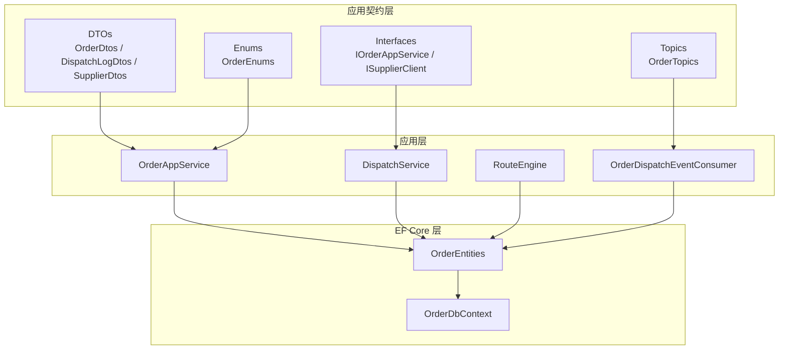
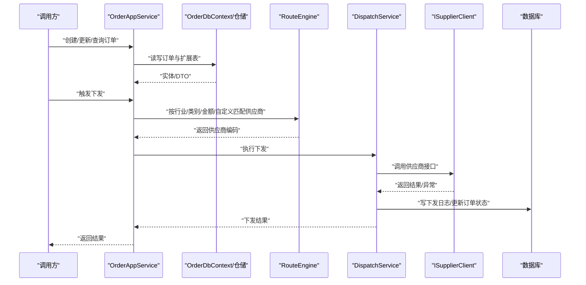
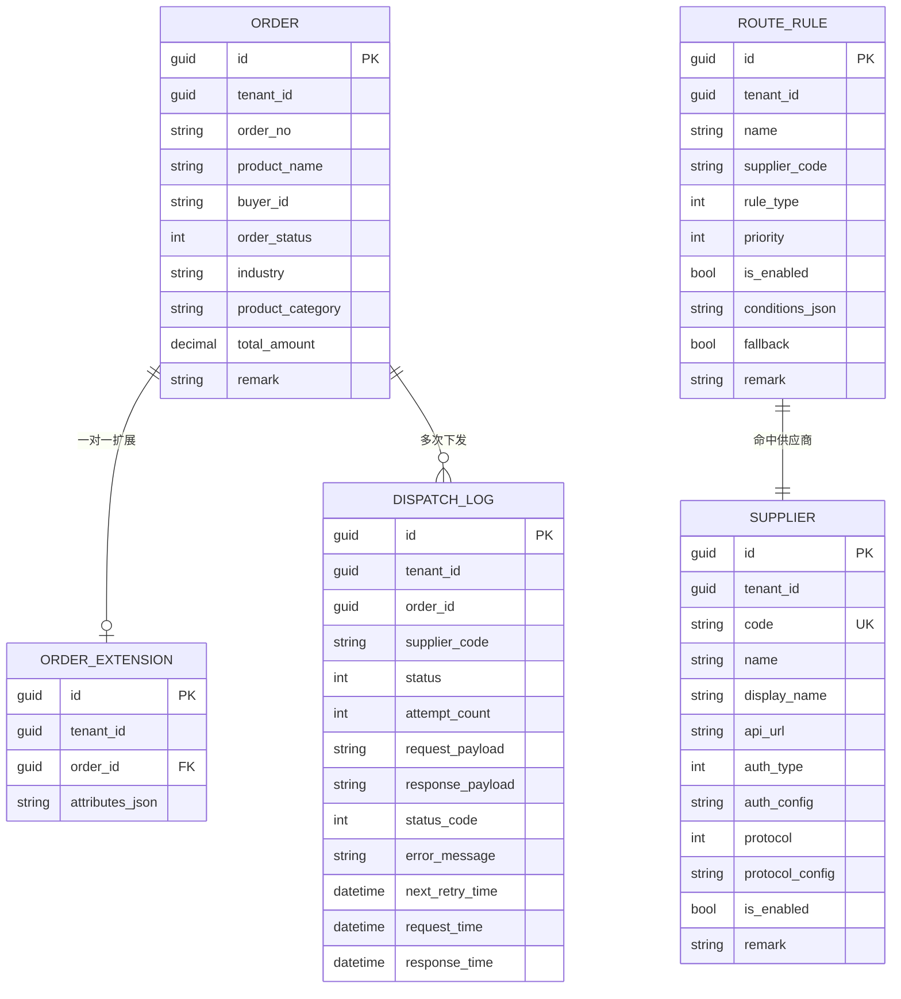
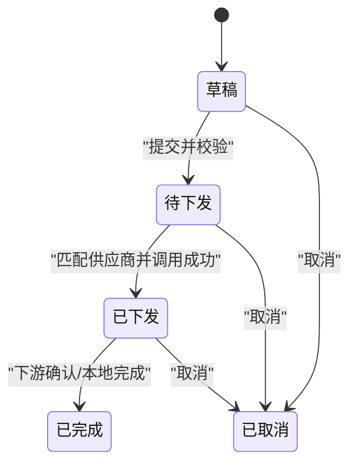
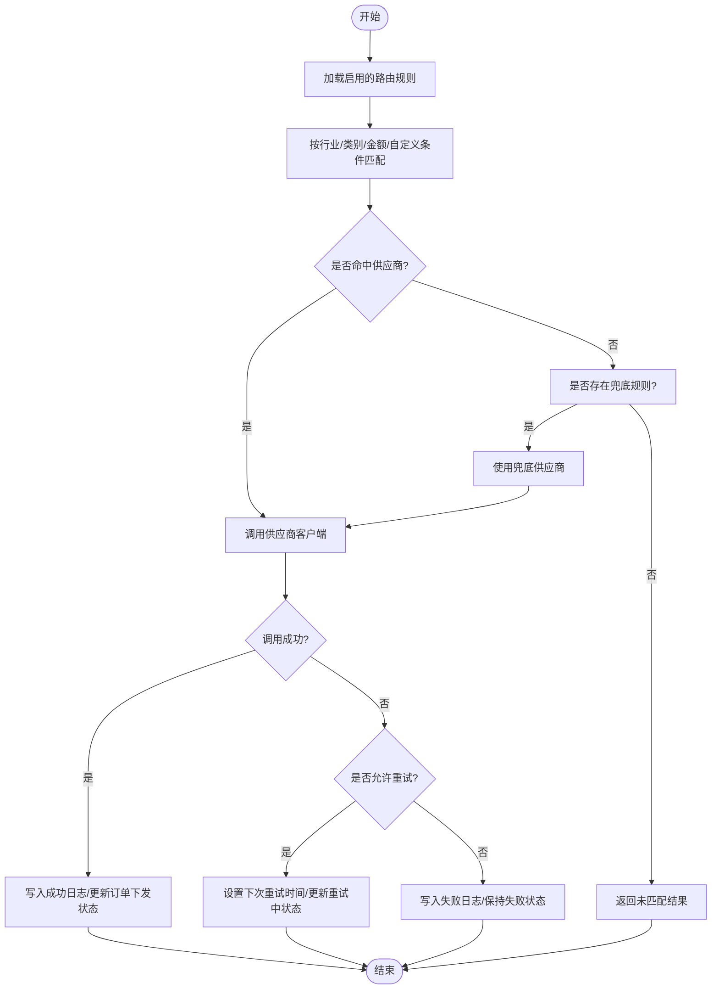
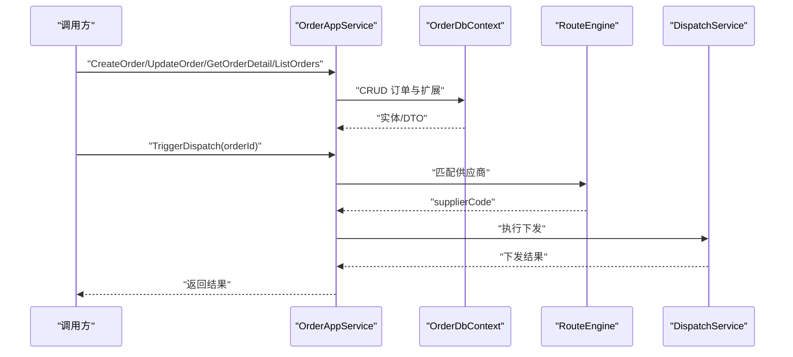
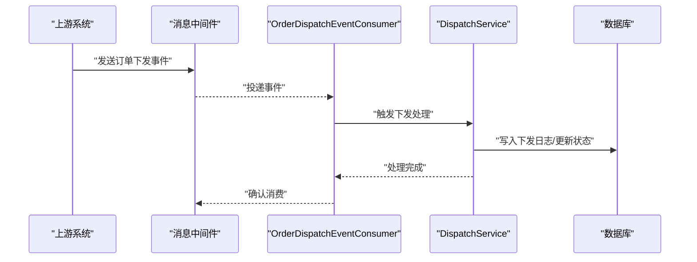
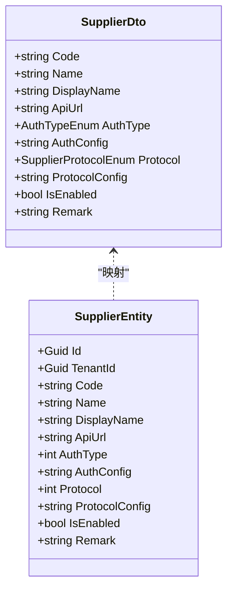
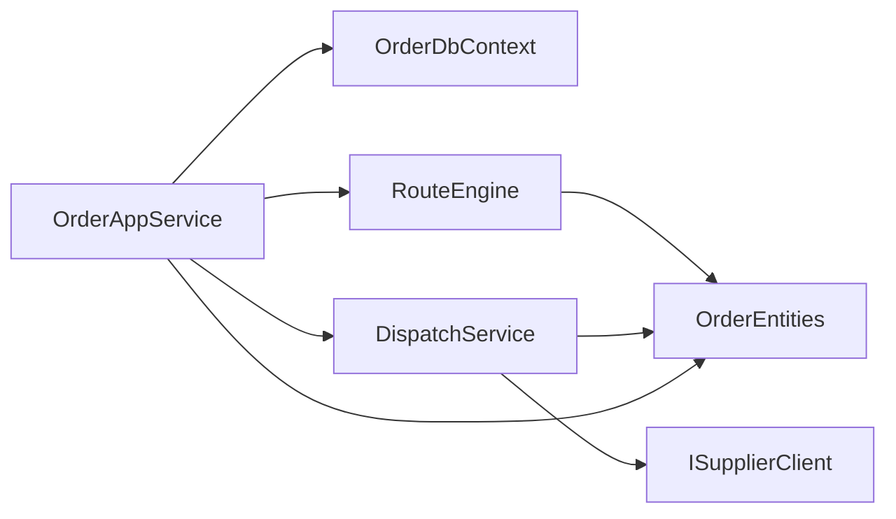

# Order 订单管理

<cite>
**本文引用的文件**   
- [OrderDtos.cs](file://src/Services/Order/H.Order.Application.Contracts/Dtos/OrderDtos.cs)
- [DispatchLogDtos.cs](file://src/Services/Order/H.Order.Application.Contracts/Dtos/DispatchLogDtos.cs)
- [SupplierDtos.cs](file://src/Services/Order/H.Order.Application.Contracts/Dtos/SupplierDtos.cs)
- [OrderEnums.cs](file://src/Services/Order/H.Order.Application.Contracts/Enums/OrderEnums.cs)
- [OrderEntities.cs](file://src/Services/Order/H.Order.EntityFrameworkCore/Entities/OrderEntities.cs)
- [OrderDbContext.cs](file://src/Services/Order/H.Order.EntityFrameworkCore/OrderDbContext.cs)
- [IOrderAppService.cs](file://src/Services/Order/H.Order.Application.Contracts/Services/IOrderAppService.cs)
- [OrderAppService.cs](file://src/Services/Order/H.Order.Application/Services/OrderAppService.cs)
- [DispatchService.cs](file://src/Services/Order/H.Order.Application/Services/DispatchService.cs)
- [RouteEngine.cs](file://src/Services/Order/H.Order.Application/Services/RouteEngine.cs)
- [OrderDispatchEventConsumer.cs](file://src/Services/Order/H.Order.Application/Services/OrderDispatchEventConsumer.cs)
- [ISupplierClient.cs](file://src/Services/Order/H.Order.Application.Contracts/Abstractions/ISupplierClient.cs)
- [OrderTopics.cs](file://src/Services/Order/H.Order.Application.Contracts/Abstractions/OrderTopics.cs)
</cite>

## 目录
1. [引言](#引言)
2. [项目结构](#项目结构)
3. [核心组件](#核心组件)
4. [架构总览](#架构总览)
5. [详细组件分析](#详细组件分析)
6. [依赖关系分析](#依赖关系分析)
7. [性能与一致性](#性能与一致性)
8. [故障排查指南](#故障排查指南)
9. [结论](#结论)
10. [附录：API 参考与示例](#附录api-参考与示例)

## 引言
本文件为 Order 订单管理服务的设计与实现文档。该服务聚焦于订单主数据、下发路由、供应商对接与下发日志等核心能力，同时提供面向多租户、可扩展的行业属性存储方案。订单状态机涵盖草稿、待下发、已下发、已完成、已取消；并配套“下发状态”用于描述下游供应商的对接结果。本文从实体模型、领域流程、API 接口、事件与集成方式等方面进行系统化说明，并提供常见扩展实践建议。

## 项目结构
Order 服务采用 ABP 典型分层结构：
- 应用契约层：定义 DTO、枚举、应用服务接口、主题与抽象客户端。
- 应用层：实现应用服务、编排业务逻辑、路由引擎、分发服务与事件消费者。
- 基础设施层（EntityFrameworkCore）：定义领域实体、数据库上下文与模块装配。
- Web 层：对外暴露 HTTP API（在本仓库中主要为模块注册）。

**图表来源**
- [OrderDtos.cs:1-161](file://src/Services/Order/H.Order.Application.Contracts/Dtos/OrderDtos.cs#L1-L161)
- [DispatchLogDtos.cs:1-96](file://src/Services/Order/H.Order.Application.Contracts/Dtos/DispatchLogDtos.cs#L1-L96)
- [SupplierDtos.cs:1-120](file://src/Services/Order/H.Order.Application.Contracts/Dtos/SupplierDtos.cs#L1-L120)
- [OrderEnums.cs:1-91](file://src/Services/Order/H.Order.Application.Contracts/Enums/OrderEnums.cs#L1-L91)
- [OrderEntities.cs:1-169](file://src/Services/Order/H.Order.EntityFrameworkCore/Entities/OrderEntities.cs#L1-L169)
- [OrderDbContext.cs](file://src/Services/Order/H.Order.EntityFrameworkCore/OrderDbContext.cs)
- [IOrderAppService.cs](file://src/Services/Order/H.Order.Application.Contracts/Services/IOrderAppService.cs)
- [OrderAppService.cs](file://src/Services/Order/H.Order.Application/Services/OrderAppService.cs)
- [DispatchService.cs](file://src/Services/Order/H.Order.Application/Services/DispatchService.cs)
- [RouteEngine.cs](file://src/Services/Order/H.Order.Application/Services/RouteEngine.cs)
- [OrderDispatchEventConsumer.cs](file://src/Services/Order/H.Order.Application/Services/OrderDispatchEventConsumer.cs)
- [ISupplierClient.cs](file://src/Services/Order/H.Order.Application.Contracts/Abstractions/ISupplierClient.cs)
- [OrderTopics.cs](file://src/Services/Order/H.Order.Application.Contracts/Abstractions/OrderTopics.cs)

**章节来源**
- [OrderDtos.cs:1-161](file://src/Services/Order/H.Order.Application.Contracts/Dtos/OrderDtos.cs#L1-L161)
- [OrderEntities.cs:1-169](file://src/Services/Order/H.Order.EntityFrameworkCore/Entities/OrderEntities.cs#L1-L169)

## 核心组件
- 领域实体
  - 订单主实体：包含订单号、商品名称、买家ID、订单状态、行业、商品类别、总金额、备注等最小字段集。
  - 订单扩展实体：一对一关联订单，存储行业特有属性的 JSON。
  - 供应商实体：编码、名称、API 地址、认证方式、协议类型及配置、启用标记等。
  - 路由规则实体：规则名称、命中供应商编码、规则类型、优先级、条件集合 JSON、是否兜底等。
  - 下发日志实体：记录每次下发的供应商、状态、尝试次数、请求响应负载、错误信息、重试时间等。
- 应用契约
  - DTO：订单列表/详情、创建/更新参数、查询过滤；下发日志 DTO、触发下发结果、最新下发状态摘要；供应商 DTO 及增改查参数。
  - 枚举：订单状态、下发状态、供应商协议、认证方式、路由规则类型。
  - 接口：订单应用服务接口、供应商客户端抽象、消息主题常量。
- 应用服务与编排
  - 订单应用服务：封装 CRUD、详情聚合、手动触发下发等能力。
  - 下发服务：负责按规则选择供应商、调用下游、写入下发日志、更新订单下发状态。
  - 路由引擎：根据行业、商品类别、金额区间或自定义条件匹配供应商。
  - 事件消费者：消费订单下发相关事件，驱动异步处理。

**章节来源**
- [OrderEntities.cs:1-169](file://src/Services/Order/H.Order.EntityFrameworkCore/Entities/OrderEntities.cs#L1-L169)
- [OrderDtos.cs:1-161](file://src/Services/Order/H.Order.Application.Contracts/Dtos/OrderDtos.cs#L1-L161)
- [DispatchLogDtos.cs:1-96](file://src/Services/Order/H.Order.Application.Contracts/Dtos/DispatchLogDtos.cs#L1-L96)
- [SupplierDtos.cs:1-120](file://src/Services/Order/H.Order.Application.Contracts/Dtos/SupplierDtos.cs#L1-L120)
- [OrderEnums.cs:1-91](file://src/Services/Order/H.Order.Application.Contracts/Enums/OrderEnums.cs#L1-L91)
- [IOrderAppService.cs](file://src/Services/Order/H.Order.Application.Contracts/Services/IOrderAppService.cs)
- [OrderAppService.cs](file://src/Services/Order/H.Order.Application/Services/OrderAppService.cs)
- [DispatchService.cs](file://src/Services/Order/H.Order.Application/Services/DispatchService.cs)
- [RouteEngine.cs](file://src/Services/Order/H.Order.Application/Services/RouteEngine.cs)
- [OrderDispatchEventConsumer.cs](file://src/Services/Order/H.Order.Application/Services/OrderDispatchEventConsumer.cs)
- [ISupplierClient.cs](file://src/Services/Order/H.Order.Application.Contracts/Abstractions/ISupplierClient.cs)
- [OrderTopics.cs](file://src/Services/Order/H.Order.Application.Contracts/Abstractions/OrderTopics.cs)

## 架构总览
订单服务的职责边界清晰：
- 对外通过 IOrderAppService 暴露订单管理与下发能力。
- 内部通过 RouteEngine 计算应命中的供应商，由 DispatchService 执行调用并落库。
- 持久化使用 EF Core，所有实体均支持多租户。
- 扩展点包括：行业扩展属性 JSON、供应商协议/认证配置 JSON、路由条件 JSON。

**图表来源**
- [IOrderAppService.cs](file://src/Services/Order/H.Order.Application.Contracts/Services/IOrderAppService.cs)
- [OrderAppService.cs](file://src/Services/Order/H.Order.Application/Services/OrderAppService.cs)
- [DispatchService.cs](file://src/Services/Order/H.Order.Application/Services/DispatchService.cs)
- [RouteEngine.cs](file://src/Services/Order/H.Order.Application/Services/RouteEngine.cs)
- [ISupplierClient.cs](file://src/Services/Order/H.Order.Application.Contracts/Abstractions/ISupplierClient.cs)
- [OrderDbContext.cs](file://src/Services/Order/H.Order.EntityFrameworkCore/OrderDbContext.cs)

## 详细组件分析

### 实体模型与数据流
订单主表仅保留跨行业的最小字段，行业特有属性下沉到扩展表，以 JSON 形式存储，便于不同行业快速扩展而无需频繁变更表结构。供应商、路由规则与下发日志共同支撑订单的自动分发与可观测性。

**图表来源**
- [OrderEntities.cs:1-169](file://src/Services/Order/H.Order.EntityFrameworkCore/Entities/OrderEntities.cs#L1-L169)

**章节来源**
- [OrderEntities.cs:1-169](file://src/Services/Order/H.Order.EntityFrameworkCore/Entities/OrderEntities.cs#L1-L169)

### 订单状态机
订单状态定义在枚举中，涵盖完整生命周期：
- 草稿：初始态，尚未进入下发流程。
- 待下发：准备被路由并下发给供应商。
- 已下发：已成功通知下游供应商。
- 已完成：业务闭环完成（可由后续系统回调或本地流程推进）。
- 已取消：主动或被动取消。

下发状态则独立描述与供应商对接的结果：
- 待下发、成功、失败、重试中。

**图表来源**
- [OrderEnums.cs:1-91](file://src/Services/Order/H.Order.Application.Contracts/Enums/OrderEnums.cs#L1-L91)

**章节来源**
- [OrderEnums.cs:1-91](file://src/Services/Order/H.Order.Application.Contracts/Enums/OrderEnums.cs#L1-L91)

### 路由与下发流程
路由引擎依据规则类型进行匹配：
- 按行业
- 按商品类别
- 按金额区间
- 自定义组合条件

命中后由下发服务调用供应商客户端，记录下发日志，并根据结果更新订单状态或下发状态。若失败且允许重试，会设置下次重试时间。

**图表来源**
- [RouteEngine.cs](file://src/Services/Order/H.Order.Application/Services/RouteEngine.cs)
- [DispatchService.cs](file://src/Services/Order/H.Order.Application/Services/DispatchService.cs)
- [ISupplierClient.cs](file://src/Services/Order/H.Order.Application.Contracts/Abstractions/ISupplierClient.cs)
- [OrderEntities.cs:1-169](file://src/Services/Order/H.Order.EntityFrameworkCore/Entities/OrderEntities.cs#L1-L169)

**章节来源**
- [RouteEngine.cs](file://src/Services/Order/H.Order.Application/Services/RouteEngine.cs)
- [DispatchService.cs](file://src/Services/Order/H.Order.Application/Services/DispatchService.cs)
- [OrderEntities.cs:1-169](file://src/Services/Order/H.Order.EntityFrameworkCore/Entities/OrderEntities.cs#L1-L169)

### 订单应用服务
订单应用服务对外提供订单的增删改查与下发触发能力。详情接口通常聚合订单主表与扩展表，并附带最近一次下发状态摘要，便于前端展示。

典型调用序列如下：

**图表来源**
- [IOrderAppService.cs](file://src/Services/Order/H.Order.Application.Contracts/Services/IOrderAppService.cs)
- [OrderAppService.cs](file://src/Services/Order/H.Order.Application/Services/OrderAppService.cs)
- [RouteEngine.cs](file://src/Services/Order/H.Order.Application/Services/RouteEngine.cs)
- [DispatchService.cs](file://src/Services/Order/H.Order.Application/Services/DispatchService.cs)
- [OrderDbContext.cs](file://src/Services/Order/H.Order.EntityFrameworkCore/OrderDbContext.cs)

**章节来源**
- [IOrderAppService.cs](file://src/Services/Order/H.Order.Application.Contracts/Services/IOrderAppService.cs)
- [OrderAppService.cs](file://src/Services/Order/H.Order.Application/Services/OrderAppService.cs)

### 事件与异步处理
订单服务定义了消息主题常量，并由事件消费者订阅订单下发相关事件，以便将同步 API 与异步下发解耦，提升吞吐与可恢复性。

**图表来源**
- [OrderTopics.cs](file://src/Services/Order/H.Order.Application.Contracts/Abstractions/OrderTopics.cs)
- [OrderDispatchEventConsumer.cs](file://src/Services/Order/H.Order.Application/Services/OrderDispatchEventConsumer.cs)
- [DispatchService.cs](file://src/Services/Order/H.Order.Application/Services/DispatchService.cs)

**章节来源**
- [OrderTopics.cs](file://src/Services/Order/H.Order.Application.Contracts/Abstractions/OrderTopics.cs)
- [OrderDispatchEventConsumer.cs](file://src/Services/Order/H.Order.Application/Services/OrderDispatchEventConsumer.cs)

### 供应商与协议扩展
供应商通过协议与认证方式灵活接入：
- 协议类型：HTTP、Mock 等，未来可扩展 MQ 等协议。
- 认证方式：无认证、ApiKey、自定义头、Basic、Bearer。
- 协议配置与认证配置均以 JSON 存储，便于动态扩展与灰度切换。

**图表来源**
- [SupplierDtos.cs:1-120](file://src/Services/Order/H.Order.Application.Contracts/Dtos/SupplierDtos.cs#L1-L120)
- [OrderEntities.cs:1-169](file://src/Services/Order/H.Order.EntityFrameworkCore/Entities/OrderEntities.cs#L1-L169)

**章节来源**
- [SupplierDtos.cs:1-120](file://src/Services/Order/H.Order.Application.Contracts/Dtos/SupplierDtos.cs#L1-L120)
- [OrderEntities.cs:1-169](file://src/Services/Order/H.Order.EntityFrameworkCore/Entities/OrderEntities.cs#L1-L169)

## 依赖关系分析
- 耦合度
  - OrderAppService 依赖 DbContext 进行数据访问，依赖 RouteEngine 做规则匹配，依赖 DispatchService 执行下游调用。
  - DispatchService 依赖 ISupplierClient 抽象，屏蔽具体协议实现差异。
  - 路由规则、供应商、下发日志之间通过实体 ID 和编码建立松耦合关联。
- 外部依赖
  - 供应商接口通过 ISupplierClient 抽象，便于 Mock 与真实实现并存。
  - 事件驱动通过 OrderTopics 常量与消费者解耦。

**图表来源**
- [OrderAppService.cs](file://src/Services/Order/H.Order.Application/Services/OrderAppService.cs)
- [DispatchService.cs](file://src/Services/Order/H.Order.Application/Services/DispatchService.cs)
- [RouteEngine.cs](file://src/Services/Order/H.Order.Application/Services/RouteEngine.cs)
- [ISupplierClient.cs](file://src/Services/Order/H.Order.Application.Contracts/Abstractions/ISupplierClient.cs)
- [OrderEntities.cs:1-169](file://src/Services/Order/H.Order.EntityFrameworkCore/Entities/OrderEntities.cs#L1-L169)

**章节来源**
- [OrderAppService.cs](file://src/Services/Order/H.Order.Application/Services/OrderAppService.cs)
- [DispatchService.cs](file://src/Services/Order/H.Order.Application/Services/DispatchService.cs)
- [RouteEngine.cs](file://src/Services/Order/H.Order.Application/Services/RouteEngine.cs)
- [ISupplierClient.cs](file://src/Services/Order/H.Order.Application.Contracts/Abstractions/ISupplierClient.cs)
- [OrderEntities.cs:1-169](file://src/Services/Order/H.Order.EntityFrameworkCore/Entities/OrderEntities.cs#L1-L169)

## 性能与一致性
- 索引建议
  - 订单表：order_no、buyer_id、industry、product_category、order_status、create_time。
  - 下发日志表：order_id、supplier_code、status、request_time。
  - 路由规则表：rule_type、is_enabled、priority。
- 事务边界
  - 订单主表与扩展表的写入应在同一事务内完成，确保数据一致性。
  - 下发日志写入与订单状态更新应在同一事务内，保证审计一致。
- 并发控制
  - 对同一订单的下发操作应加锁或使用乐观版本控制，避免重复下发。
- 分页与筛选
  - 列表查询基于 PagedResultRequestDto 基类，建议结合 Filter、Status、AmountRange 等字段优化 SQL。
- 扩展字段
  - 行业特有属性以 JSON 存储，避免频繁 DDL；建议在业务侧做好 JSON Schema 校验。

[本节为通用指导，不直接分析具体代码文件]

## 故障排查指南
- 下发失败
  - 检查下发日志中的 ErrorMessage、StatusCode 与 AttemptCount。
  - 确认供应商 APIUrl、认证配置与协议配置是否正确。
  - 查看是否设置了 NextRetryTime，以及重试策略是否生效。
- 路由未命中
  - 核对行业、商品类别、金额区间与自定义条件是否与订单属性匹配。
  - 检查规则优先级与是否启用，必要时增加兜底规则。
- 订单状态异常
  - 确认状态机转换是否符合预期，例如“待下发”必须经“已下发”才能“已完成”。
  - 核对事件消费者是否正常消费，避免状态长期停滞。

**章节来源**
- [DispatchLogDtos.cs:1-96](file://src/Services/Order/H.Order.Application.Contracts/Dtos/DispatchLogDtos.cs#L1-L96)
- [OrderEnums.cs:1-91](file://src/Services/Order/H.Order.Application.Contracts/Enums/OrderEnums.cs#L1-L91)
- [OrderEntities.cs:1-169](file://src/Services/Order/H.Order.EntityFrameworkCore/Entities/OrderEntities.cs#L1-L169)

## 结论
Order 订单服务通过清晰的实体模型、明确的状态机、可扩展的路由与下发机制，提供了稳定的订单主数据管理与供应商对接能力。其多租户设计、JSON 扩展字段与抽象供应商客户端，使系统具备良好的扩展性与可维护性。在实际落地时，建议配合完善的索引策略、事务边界与重试补偿机制，保障高可用与数据一致性。

[本节为总结性内容，不直接分析具体代码文件]

## 附录：API 参考与示例
以下以调用方视角给出常用操作的说明与示例路径，实际请求体字段以 DTO 定义为准。

- 创建订单
  - 方法：POST /api/order
  - 请求体：CreateOrderDto
  - 关键字段：OrderNo（可选）、ProductName、BuyerId、OrderStatus（默认 PendingDispatch）、Industry、ProductCategory、TotalAmount、Remark、AttributesJson
  - 参考：[CreateOrderDto](file://src/Services/Order/H.Order.Application.Contracts/Dtos/OrderDtos.cs)

- 更新订单
  - 方法：PUT /api/order/{id}
  - 请求体：UpdateOrderDto
  - 关键字段：ProductName、BuyerId、OrderStatus、Industry、ProductCategory、TotalAmount、Remark、AttributesJson
  - 参考：[UpdateOrderDto](file://src/Services/Order/H.Order.Application.Contracts/Dtos/OrderDtos.cs)

- 查询订单详情
  - 方法：GET /api/order/{id}
  - 返回：OrderDetailDto，包含 OrderDto 基础信息与 AttributesJson、DispatchStatusDto
  - 参考：[OrderDetailDto](file://src/Services/Order/H.Order.Application.Contracts/Dtos/OrderDtos.cs)、[DispatchStatusDto](file://src/Services/Order/H.Order.Application.Contracts/Dtos/DispatchLogDtos.cs)

- 查询订单列表
  - 方法：GET /api/orders
  - 查询参数：OrderQueryDto（Filter、OrderNo、Industry、BuyerId、Status、MinAmount、MaxAmount、CreateTimeStart、CreateTimeEnd、分页参数）
  - 参考：[OrderQueryDto](file://src/Services/Order/H.Order.Application.Contracts/Dtos/OrderDtos.cs)

- 触发订单下发
  - 方法：POST /api/order/{id}/dispatch
  - 返回：TriggerDispatchResultDto（OrderId、SupplierCode、Success、Message、LogId）
  - 参考：[TriggerDispatchResultDto](file://src/Services/Order/H.Order.Application.Contracts/Dtos/DispatchLogDtos.cs)

- 查询下发日志
  - 方法：GET /api/dispatch-logs
  - 查询参数：DispatchLogQueryDto（OrderId、SupplierCode、Status、分页参数）
  - 返回：DispatchLogDto 列表
  - 参考：[DispatchLogQueryDto](file://src/Services/Order/H.Order.Application.Contracts/Dtos/DispatchLogDtos.cs)、[DispatchLogDto](file://src/Services/Order/H.Order.Application.Contracts/Dtos/DispatchLogDtos.cs)

- 供应商管理
  - 创建/更新/查询供应商：使用 CreateSupplierDto、UpdateSupplierDto、SupplierQueryDto、SupplierDto
  - 参考：[SupplierDtos.cs](file://src/Services/Order/H.Order.Application.Contracts/Dtos/SupplierDtos.cs)

- 事件主题
  - 订单下发相关事件主题常量定义
  - 参考：[OrderTopics.cs](file://src/Services/Order/H.Order.Application.Contracts/Abstractions/OrderTopics.cs)

**章节来源**
- [OrderDtos.cs:1-161](file://src/Services/Order/H.Order.Application.Contracts/Dtos/OrderDtos.cs#L1-L161)
- [DispatchLogDtos.cs:1-96](file://src/Services/Order/H.Order.Application.Contracts/Dtos/DispatchLogDtos.cs#L1-L96)
- [SupplierDtos.cs:1-120](file://src/Services/Order/H.Order.Application.Contracts/Dtos/SupplierDtos.cs#L1-L120)
- [OrderTopics.cs](file://src/Services/Order/H.Order.Application.Contracts/Abstractions/OrderTopics.cs)