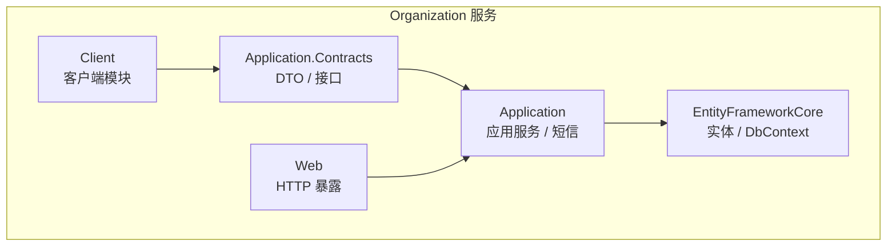
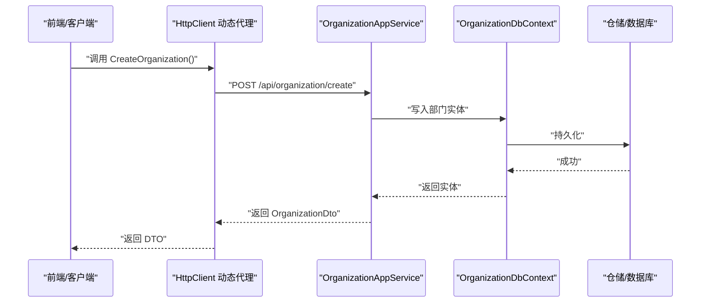
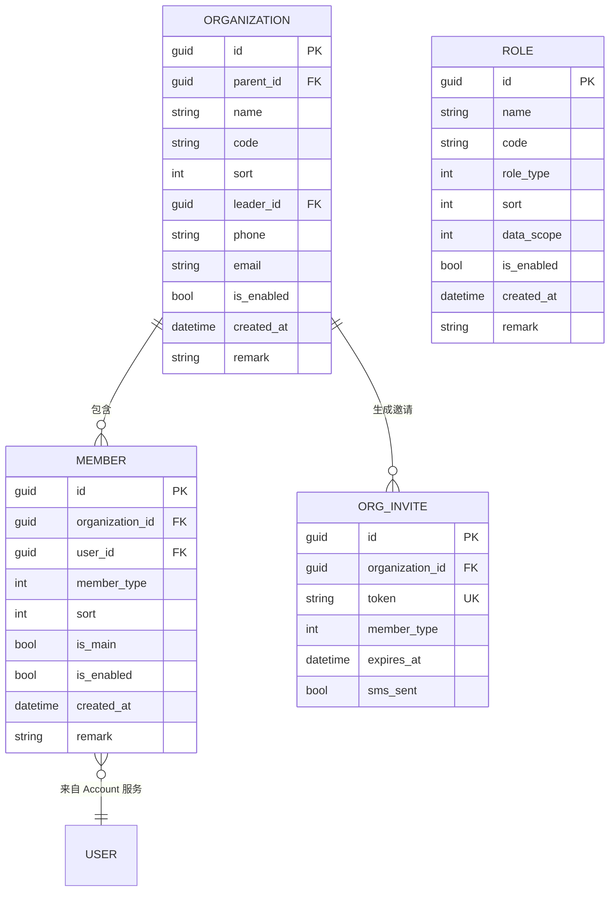
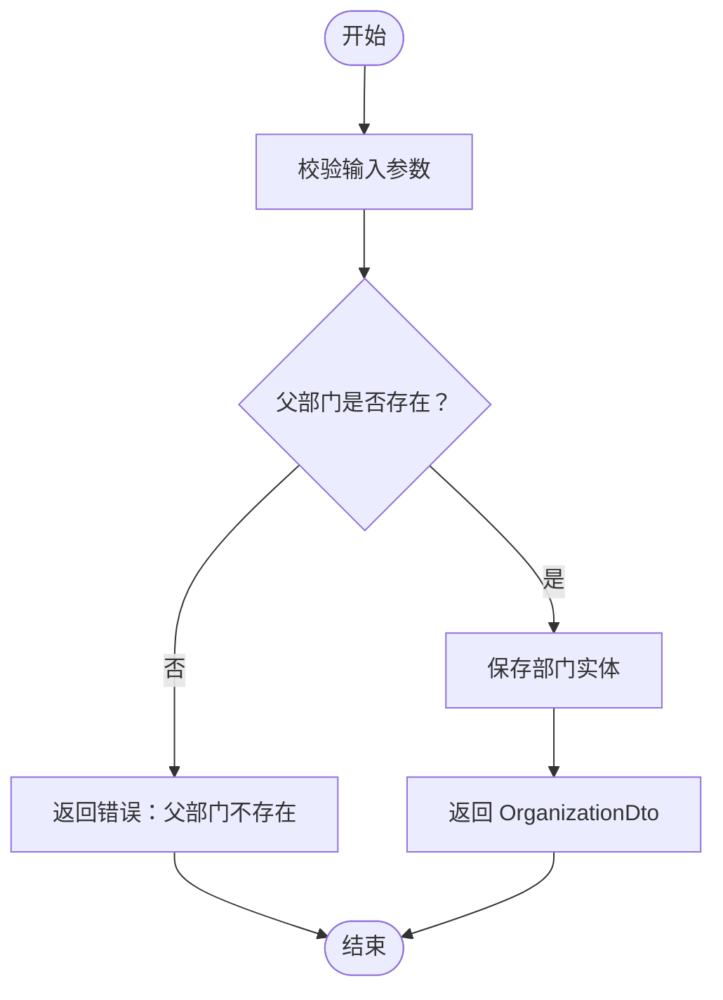
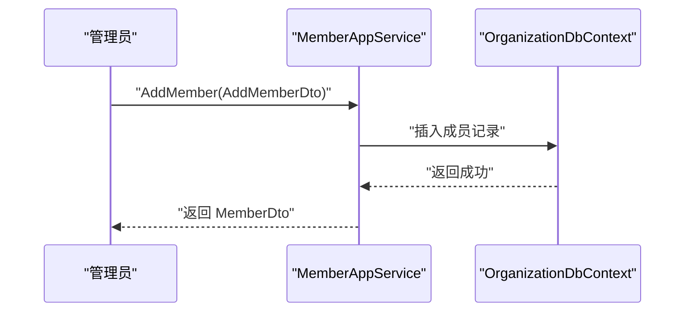
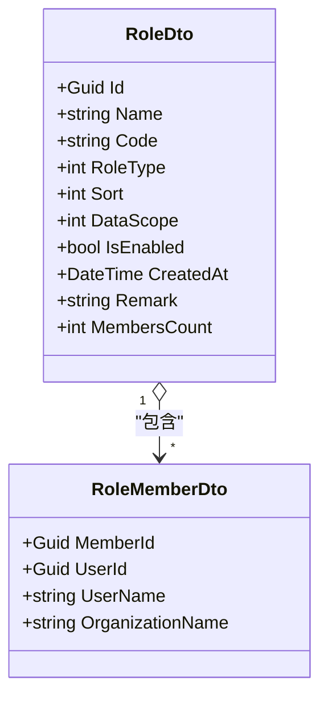
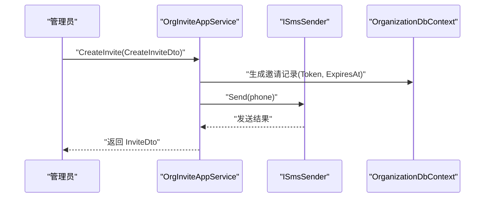
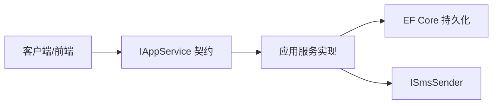

# Organization 组织管理

<cite>
**本文引用的文件**   
- [OrganizationDto.cs](file://src/Services/Organization/H.Organization.Application.Contracts/Dtos/OrganizationDto.cs)
- [MemberDto.cs](file://src/Services/Organization/H.Organization.Application.Contracts/Dtos/MemberDto.cs)
- [RoleDto.cs](file://src/Services/Organization/H.Organization.Application.Contracts/Dtos/RoleDto.cs)
- [InviteDto.cs](file://src/Services/Organization/H.Organization.Application.Contracts/Dtos/InviteDto.cs)
- [PagedResult.cs](file://src/Services/Organization/H.Organization.Application.Contracts/Dtos/PagedResult.cs)
- [OrganizationAppService.cs](file://src/Services/Organization/H.Organization.Application.Services/OrganizationAppService.cs)
- [MemberAppService.cs](file://src/Services/Organization/H.Organization.Application.Services/MemberAppService.cs)
- [RoleAppService.cs](file://src/Services/Organization/H.Organization.Application.Services/RoleAppService.cs)
- [OrgInviteAppService.cs](file://src/Services/Organization/H.Organization.Application.Services/OrgInviteAppService.cs)
- [ISmsSender.cs](file://src/Services/Organization/H.Organization.Application.Contracts/Interfaces/ISmsSender.cs)
- [LoggingSmsSender.cs](file://src/Services/Organization/H.Organization.Application/Sms/LoggingSmsSender.cs)
- [OrganizationEntity.cs](file://src/Services/Organization/H.Organization.EntityFrameworkCore/Entities/OrganizationEntity.cs)
- [MemberEntity.cs](file://src/Services/Organization/H.Organization.EntityFrameworkCore/Entities/MemberEntity.cs)
- [RoleEntity.cs](file://src/Services/Organization/H.Organization.EntityFrameworkCore/Entities/RoleEntity.cs)
- [OrgInviteEntity.cs](file://src/Services/Organization/H.Organization.EntityFrameworkCore/Entities/OrgInviteEntity.cs)
- [OrganizationDbContext.cs](file://src/Services/Organization/H.Organization.EntityFrameworkCore/OrganizationDbContext.cs)
- [OrganizationApplicationModule.cs](file://src/Services/Organization/H.Organization.Application/OrganizationApplicationModule.cs)
- [OrganizationApplicationContractsModule.cs](file://src/Services/Organization/H.Organization.Application.Contracts/OrganizationApplicationContractsModule.cs)
- [OrganizationClientModule.cs](file://src/Services/Organization/H.Organization.Client/OrganizationClientModule.cs)
- [README.md](file://README.md)
</cite>

## 目录
1. [引言](#引言)
2. [项目结构](#项目结构)
3. [核心组件](#核心组件)
4. [架构总览](#架构总览)
5. [详细组件分析](#详细组件分析)
6. [依赖关系分析](#依赖关系分析)
7. [性能与扩展性](#性能与扩展性)
8. [故障排查指南](#故障排查指南)
9. [结论](#结论)
10. [附录：API 参考](#附录api-参考)

## 引言
Organization 组织管理服务提供企业级组织架构管理能力，包括部门树形结构、成员（员工）管理、角色与权限范围、邀请加入流程等。服务采用 ABP 风格的分层模块设计，按 Application.Contracts / Application / EntityFrameworkCore / Web 分层组织代码，支持通过 HTTP 动态代理被前端或客户端调用，同时保留进程内应用服务调用能力。

该文档聚焦以下业务目标：
- 组织架构的创建、查询、更新、删除及层级维护
- 部门树形数据模型设计与查询
- 员工在部门中的分配、调整与主部门标记
- 基于角色的数据范围控制
- 多租户隔离机制说明
- 与 Account 服务的权限集成方式
- 常见扩展场景，如虚拟部门、项目团队等

[无具体源码分析引用]

## 项目结构
Organization 服务位于 Services 下的 Organization 限界上下文，遵循统一分层：

- H.Organization.Application.Contracts：对外契约、DTO、接口定义
- H.Organization.Application：应用服务实现、短信发送抽象
- H.Organization.EntityFrameworkCore：领域实体、DbContext、EF Core 模块
- H.Organization.Web：Web 端暴露点
- H.Organization.Client：客户端模块入口（通常用于注册 HTTP 代理）

图表来源
- [OrganizationApplicationModule.cs](file://src/Services/Organization/H.Organization.Application/OrganizationApplicationModule.cs)
- [OrganizationApplicationContractsModule.cs](file://src/Services/Organization/H.Organization.Application.Contracts/OrganizationApplicationContractsModule.cs)
- [OrganizationClientModule.cs](file://src/Services/Organization/H.Organization.Client/OrganizationClientModule.cs)

章节来源
- [README.md:1-73](file://README.md#L1-L73)

## 核心组件
- 部门实体与 DTO：承载部门基础信息、父子关系、负责人、启用状态、排序、统计数量等，并提供树形节点 DTO 以支撑前端树展示。
- 成员实体与 DTO：记录用户与部门的关联、成员类型、是否主部门、排序、启用状态，以及已授角色名称列表。
- 角色实体与 DTO：承载角色基本信息、类型、排序、数据范围、启用状态与成员数统计。
- 邀请实体与 DTO：支持生成邀请令牌与链接，并记录短信发送结果与过期时间。
- 应用服务：
  - IOrganizationAppService：部门 CRUD、树查询、分页查询
  - IMemberAppService：成员添加、批量添加、角色分配、查询
  - IRoleAppService：角色 CRUD、分页查询、成员分配查询
  - IOrgInviteAppService：邀请生成、校验与信息查询
- 短信发送抽象：ISmsSender 及其 LoggingSmsSender 实现，用于邀请短信通知。

章节来源
- [OrganizationDto.cs:1-236](file://src/Services/Organization/H.Organization.Application.Contracts/Dtos/OrganizationDto.cs#L1-L236)
- [MemberDto.cs:1-258](file://src/Services/Organization/H.Organization.Application.Contracts/Dtos/MemberDto.cs#L1-L258)
- [RoleDto.cs:1-201](file://src/Services/Organization/H.Organization.Application.Contracts/Dtos/RoleDto.cs#L1-L201)
- [InviteDto.cs:1-89](file://src/Services/Organization/H.Organization.Application.Contracts/Dtos/InviteDto.cs#L1-L89)
- [PagedResult.cs:1-42](file://src/Services/Organization/H.Organization.Application.Contracts/Dtos/PagedResult.cs#L1-L42)
- [ISmsSender.cs](file://src/Services/Organization/H.Organization.Application.Contracts/Interfaces/ISmsSender.cs)
- [LoggingSmsSender.cs](file://src/Services/Organization/H.Organization.Application/Sms/LoggingSmsSender.cs)

## 架构总览
Organization 服务通过 ABP 风格的模块化装配，将应用服务、EF Core 持久化、HTTP 代理和 Web 宿主解耦。外部系统可通过 HTTP 动态代理访问 IAppService 接口，前端无需手写 HTTP 调用；内部模块可直接注入应用服务使用。

图表来源
- [OrganizationAppService.cs](file://src/Services/Organization/H.Organization.Application.Services/OrganizationAppService.cs)
- [OrganizationDbContext.cs](file://src/Services/Organization/H.Organization.EntityFrameworkCore/OrganizationDbContext.cs)

章节来源
- [README.md:1-73](file://README.md#L1-L73)

## 详细组件分析

### 数据模型与关系映射
组织域的核心实体包括部门、成员、角色与邀请记录。部门通过 ParentId 形成树形结构；成员是用户与部门的关联实体；角色为组织内可复用权限集合；邀请用于外部人员加入部门。

图表来源
- [OrganizationEntity.cs](file://src/Services/Organization/H.Organization.EntityFrameworkCore/Entities/OrganizationEntity.cs)
- [MemberEntity.cs](file://src/Services/Organization/H.Organization.EntityFrameworkCore/Entities/MemberEntity.cs)
- [RoleEntity.cs](file://src/Services/Organization/H.Organization.EntityFrameworkCore/Entities/RoleEntity.cs)
- [OrgInviteEntity.cs](file://src/Services/Organization/H.Organization.EntityFrameworkCore/Entities/OrgInviteEntity.cs)

#### 关键实体职责与复杂度
- 部门实体：树形结构维护，O(1) 直接定位父节点；子节点遍历需递归或 CTE，取决于查询策略。
- 成员实体：用户与部门的多对多中间表语义，常用过滤条件包括部门 ID、成员类型、启用状态等。
- 角色实体：与成员存在间接关联（通过成员的角色名列表），便于展示已授角色。
- 邀请实体：令牌唯一，支持过期校验与短信发送标记。

章节来源
- [OrganizationEntity.cs](file://src/Services/Organization/H.Organization.EntityFrameworkCore/Entities/OrganizationEntity.cs)
- [MemberEntity.cs](file://src/Services/Organization/H.Organization.EntityFrameworkCore/Entities/MemberEntity.cs)
- [RoleEntity.cs](file://src/Services/Organization/H.Organization.EntityFrameworkCore/Entities/RoleEntity.cs)
- [OrgInviteEntity.cs](file://src/Services/Organization/H.Organization.EntityFrameworkCore/Entities/OrgInviteEntity.cs)

### 部门管理（CRUD 与树形结构）
- 创建部门：接收 CreateOrganizationDto，设置父部门、编码、名称、排序、负责人、联系方式与备注。
- 更新部门：支持 IsEnabled 切换，修改父部门、名称、编码、排序、负责人与联系方式。
- 查询：
  - 分页查询：支持 ParentId、Keyword、IsEnabled、PageIndex、PageSize。
  - 树形查询：返回 OrganizationTreeDto 嵌套结构，Children 字段表示子部门集合。
- 删除：通常结合启停控制与成员占用检查（由应用服务实现决定）。

图表来源
- [OrganizationDto.cs:1-236](file://src/Services/Organization/H.Organization.Application.Contracts/Dtos/OrganizationDto.cs#L1-L236)
- [OrganizationAppService.cs](file://src/Services/Organization/H.Organization.Application.Services/OrganizationAppService.cs)

章节来源
- [OrganizationDto.cs:1-236](file://src/Services/Organization/H.Organization.Application.Contracts/Dtos/OrganizationDto.cs#L1-L236)
- [OrganizationAppService.cs](file://src/Services/Organization/H.Organization.Application.Services/OrganizationAppService.cs)

### 成员管理（员工分配与调整）
- 添加成员：AddMemberDto 指定部门、用户、成员类型、排序、是否主部门与备注。
- 批量添加：AddMemberBatchDto 允许同一用户关联多个部门，统一成员类型与排序。
- 分配角色：AssignMemberRolesDto 传入角色 ID 列表，完成角色授予。
- 查询成员：MemberQueryParams 支持按部门、关键字、成员类型、启用状态分页筛选。

图表来源
- [MemberDto.cs:1-258](file://src/Services/Organization/H.Organization.Application.Contracts/Dtos/MemberDto.cs#L1-L258)
- [MemberAppService.cs](file://src/Services/Organization/H.Organization.Application.Services/MemberAppService.cs)

章节来源
- [MemberDto.cs:1-258](file://src/Services/Organization/H.Organization.Application.Contracts/Dtos/MemberDto.cs#L1-L258)
- [MemberAppService.cs](file://src/Services/Organization/H.Organization.Application.Services/MemberAppService.cs)

### 角色管理与数据范围
- 角色属性：名称、编码、类型（系统/自定义）、排序、数据范围（全部/本部门/仅本人）、启用状态与备注。
- 成员分配：通过角色查询已分配成员 RoleMemberDto，便于查看哪些用户在某角色下。
- 数据范围：用于后续业务的数据访问过滤（例如“仅本人”或“本部门”）。

图表来源
- [RoleDto.cs:1-201](file://src/Services/Organization/H.Organization.Application.Contracts/Dtos/RoleDto.cs#L1-L201)

章节来源
- [RoleDto.cs:1-201](file://src/Services/Organization/H.Organization.Application.Contracts/Dtos/RoleDto.cs#L1-L201)
- [RoleAppService.cs](file://src/Services/Organization/H.Organization.Application.Services/RoleAppService.cs)

### 邀请加入流程
- 创建邀请：CreateInviteDto 指定目标部门、成员类型、手机号、有效期（天）。
- 返回结果：InviteDto 包含 Token、完整 InviteUrl、目标部门信息与过期时间，以及短信发送标记。
- 邀请校验：InviteInfoDto 用于前端确认页判断邀请是否有效、失效原因、目标部门与成员类型。
- 短信发送：ISmsSender 抽象，LoggingSmsSender 作为日志实现。

图表来源
- [InviteDto.cs:1-89](file://src/Services/Organization/H.Organization.Application.Contracts/Dtos/InviteDto.cs#L1-L89)
- [ISmsSender.cs](file://src/Services/Organization/H.Organization.Application.Contracts/Interfaces/ISmsSender.cs)
- [LoggingSmsSender.cs](file://src/Services/Organization/H.Organization.Application/Sms/LoggingSmsSender.cs)
- [OrgInviteAppService.cs](file://src/Services/Organization/H.Organization.Application.Services/OrgInviteAppService.cs)

章节来源
- [InviteDto.cs:1-89](file://src/Services/Organization/H.Organization.Application.Contracts/Dtos/InviteDto.cs#L1-L89)
- [OrgInviteAppService.cs](file://src/Services/Organization/H.Organization.Application.Services/OrgInviteAppService.cs)

## 依赖关系分析
- 应用契约层与实现层分离：前端或远程客户端只依赖 Application.Contracts 中的 IAppService 接口与 DTO。
- HTTP 动态代理：客户端通过 AddHttpClientProxies 扫描 IAppService 接口，自动生成 HTTP 调用；服务端则以进程内方式解析方法。
- 短信抽象：ISmsSender 允许替换真实短信网关，当前 LoggingSmsSender 仅做日志记录，便于开发与测试。
- 模块装配：各模块通过 Module 类注册服务与配置，保证解耦与可扩展性。

图表来源
- [OrganizationClientModule.cs](file://src/Services/Organization/H.Organization.Client/OrganizationClientModule.cs)
- [OrganizationApplicationModule.cs](file://src/Services/Organization/H.Organization.Application/OrganizationApplicationModule.cs)
- [ISmsSender.cs](file://src/Services/Organization/H.Organization.Application.Contracts/Interfaces/ISmsSender.cs)
- [LoggingSmsSender.cs](file://src/Services/Organization/H.Organization.Application/Sms/LoggingSmsSender.cs)

章节来源
- [README.md:1-73](file://README.md#L1-L73)

## 性能与扩展性
- 树形结构优化：
  - 建议使用缓存存储部门树根节点或热点部门子树，减少频繁递归查询。
  - 对于大规模组织，可采用 CTE 或物化路径字段提升查询效率。
- 分页与过滤：
  - 成员与角色查询均支持分页参数，避免一次性加载大量数据。
  - 关键字搜索应限定在必要字段（如名称、编码、用户名），并结合索引优化。
- 多租户隔离：
  - 建议在 OrganizationDbContext 中引入 TenantId 字段，并通过全局过滤器或仓储层强制附加租户条件，确保不同租户的组织数据完全隔离。
  - 若跨租户共享某些基础数据（如系统角色模板），需在数据范围上明确区分。
- 扩展点：
  - ISmsSender 允许替换第三方短信服务。
  - 可在应用服务中扩展事件总线，发布“部门变更”“成员加入”等事件供其他服务订阅。

[无具体源码分析引用]

## 故障排查指南
- 部门树为空或层级异常：
  - 检查 ParentId 是否正确指向已有部门。
  - 确认 IsEnabled 未误关闭导致查询过滤掉数据。
- 成员无法加入部门：
  - 校验 UserId 是否在 Account 服务中存在且可用。
  - 检查 MemberType 与 IsMain 是否符合业务规则。
- 邀请链接无效：
  - 检查 ExpiresAt 是否过期。
  - 确认 Token 未被重复使用或篡改。
- 短信发送失败：
  - 检查 ISmsSender 实现是否正确接入短信网关。
  - 在开发环境可使用 LoggingSmsSender 验证流程。

章节来源
- [InviteDto.cs:1-89](file://src/Services/Organization/H.Organization.Application.Contracts/Dtos/InviteDto.cs#L1-L89)
- [MemberDto.cs:1-258](file://src/Services/Organization/H.Organization.Application.Contracts/Dtos/MemberDto.cs#L1-L258)
- [OrganizationDto.cs:1-236](file://src/Services/Organization/H.Organization.Application.Contracts/Dtos/OrganizationDto.cs#L1-L236)

## 结论
Organization 组织管理服务围绕部门树、成员、角色与邀请四大核心概念，提供了完整的组织管理能力。其分层架构与 ABP 风格模块设计，使服务具备良好的可测试性、可扩展性与可维护性。通过合理的缓存、分页与多租户隔离策略，服务可支撑中大型企业的组织管理需求。同时，ISmsSender 抽象与邀请流程为外部人员协作提供了便捷通道。

[无具体源码分析引用]

## 附录：API 参考

### 部门管理
- 创建部门
  - 请求体：CreateOrganizationDto
  - 响应：OrganizationDto
- 更新部门
  - 请求体：UpdateOrganizationDto
  - 响应：OrganizationDto
- 分页查询部门
  - 查询参数：OrganizationQueryParams
  - 响应：PagedResult<OrganizationDto>
- 查询部门树
  - 响应：List<OrganizationTreeDto>

章节来源
- [OrganizationDto.cs:1-236](file://src/Services/Organization/H.Organization.Application.Contracts/Dtos/OrganizationDto.cs#L1-L236)
- [PagedResult.cs:1-42](file://src/Services/Organization/H.Organization.Application.Contracts/Dtos/PagedResult.cs#L1-L42)
- [OrganizationAppService.cs](file://src/Services/Organization/H.Organization.Application.Services/OrganizationAppService.cs)

### 成员管理
- 添加成员
  - 请求体：AddMemberDto
  - 响应：MemberDto
- 批量添加成员
  - 请求体：AddMemberBatchDto
  - 响应：List<MemberDto>
- 分配成员角色
  - 请求体：AssignMemberRolesDto
  - 响应：Success
- 查询成员
  - 查询参数：MemberQueryParams
  - 响应：PagedResult<MemberDto>

章节来源
- [MemberDto.cs:1-258](file://src/Services/Organization/H.Organization.Application.Contracts/Dtos/MemberDto.cs#L1-L258)
- [PagedResult.cs:1-42](file://src/Services/Organization/H.Organization.Application.Contracts/Dtos/PagedResult.cs#L1-L42)
- [MemberAppService.cs](file://src/Services/Organization/H.Organization.Application.Services/MemberAppService.cs)

### 角色管理
- 创建角色
  - 请求体：CreateRoleDto
  - 响应：RoleDto
- 更新角色
  - 请求体：UpdateRoleDto
  - 响应：RoleDto
- 分页查询角色
  - 查询参数：RoleQueryParams
  - 响应：PagedResult<RoleDto>
- 查询角色已分配成员
  - 响应：List<RoleMemberDto>

章节来源
- [RoleDto.cs:1-201](file://src/Services/Organization/H.Organization.Application.Contracts/Dtos/RoleDto.cs#L1-L201)
- [PagedResult.cs:1-42](file://src/Services/Organization/H.Organization.Application.Contracts/Dtos/PagedResult.cs#L1-L42)
- [RoleAppService.cs](file://src/Services/Organization/H.Organization.Application.Services/RoleAppService.cs)

### 邀请管理
- 创建邀请
  - 请求体：CreateInviteDto
  - 响应：InviteDto
- 校验邀请
  - 响应：InviteInfoDto

章节来源
- [InviteDto.cs:1-89](file://src/Services/Organization/H.Organization.Application.Contracts/Dtos/InviteDto.cs#L1-L89)
- [OrgInviteAppService.cs](file://src/Services/Organization/H.Organization.Application.Services/OrgInviteAppService.cs)