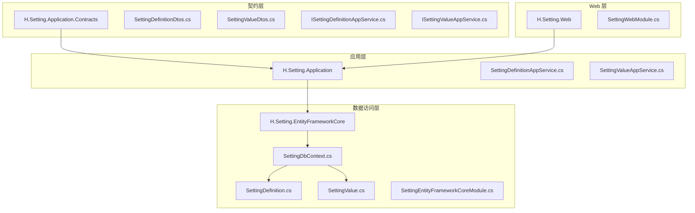
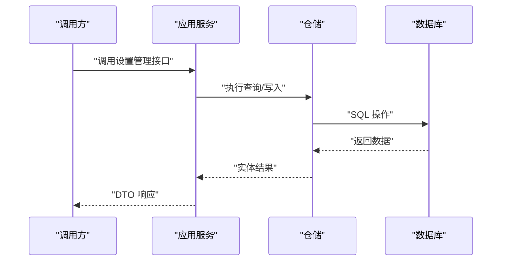
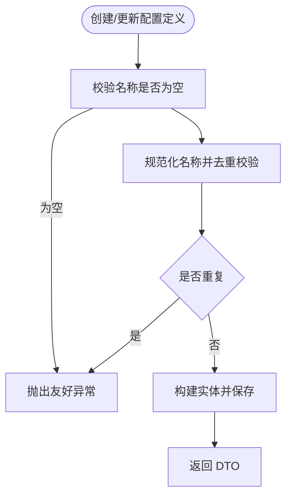
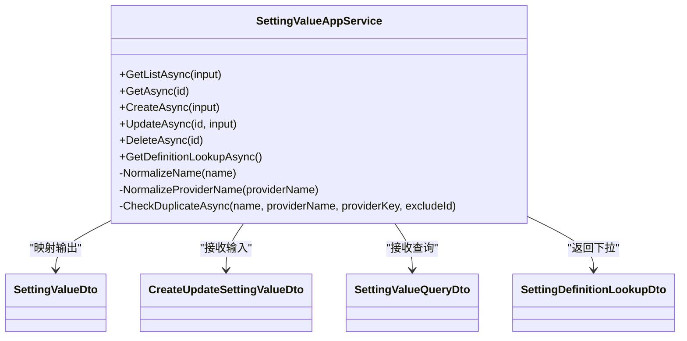
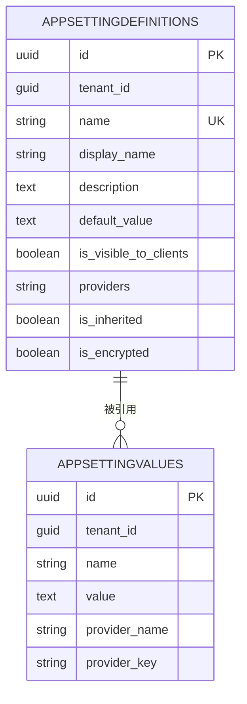
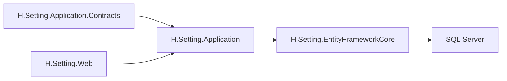

# Setting 设置管理

<cite>
**本文引用的文件**   
- [SettingDefinitionDtos.cs](file://src/Services/Setting/H.Setting.Application.Contracts/Dtos/SettingDefinitionDtos.cs)
- [SettingValueDtos.cs](file://src/Services/Setting/H.Setting.Application.Contracts/Dtos/SettingValueDtos.cs)
- [ISettingDefinitionAppService.cs](file://src/Services/Setting/H.Setting.Application.Contracts/Services/ISettingDefinitionAppService.cs)
- [ISettingValueAppService.cs](file://src/Services/Setting/H.Setting.Application.Contracts/Services/ISettingValueAppService.cs)
- [SettingDefinitionAppService.cs](file://src/Services/Setting/H.Setting.Application/Services/SettingDefinitionAppService.cs)
- [SettingValueAppService.cs](file://src/Services/Setting/H.Setting.Application/Services/SettingValueAppService.cs)
- [SettingApplicationContractsModule.cs](file://src/Services/Setting/H.Setting.Application.Contracts/SettingApplicationContractsModule.cs)
- [SettingApplicationModule.cs](file://src/Services/Setting/H.Setting.Application/SettingApplicationModule.cs)
- [SettingEntityFrameworkCoreModule.cs](file://src/Services/Setting/H.Setting.EntityFrameworkCore/SettingEntityFrameworkCoreModule.cs)
- [SettingDbContext.cs](file://src/Services/Setting/H.Setting.EntityFrameworkCore/SettingDbContext.cs)
- [SettingDefinition.cs](file://src/Services/Setting/H.Setting.EntityFrameworkCore/Entities/SettingDefinition.cs)
- [SettingValue.cs](file://src/Services/Setting/H.Setting.EntityFrameworkCore/Entities/SettingValue.cs)
</cite>

## 目录
1. [简介](#简介)
2. [项目结构](#项目结构)
3. [核心概念与配置层次](#核心概念与配置层次)
4. [架构总览](#架构总览)
5. [详细组件分析](#详细组件分析)
6. [依赖关系分析](#依赖关系分析)
7. [性能与扩展性](#性能与扩展性)
8. [API 调用示例](#api-调用示例)
9. [故障排查](#故障排查)
10. [结论](#结论)
11. [附录：常见扩展场景](#附录常见扩展场景)

## 简介
Setting 设置管理服务提供系统级配置的定义、存储与查询能力。该服务以 ABP 应用服务层 + Entity Framework Core 数据访问层为基础，围绕“配置定义”和“配置项（配置值）”两个核心实体，支持全局、租户、用户三种提供者粒度，并通过名称唯一标识、提供者键组合等方式实现配置的精细化覆盖。

本服务的目标不是直接充当分布式配置中心，而是为上层业务提供稳定的配置元数据和运行时可持久化的配置值管理能力；动态加载、热更新、多服务同步等机制可在其之上扩展。

## 项目结构
Setting 模块按 ABP 典型分层组织：

- 契约层：定义 DTO、查询参数、应用服务接口。
- 应用层：实现 CRUD 应用服务，负责校验、分页、关联查询与业务规则。
- 领域实体与数据访问：基于 EF Core 的实体、数据库上下文及模块注册。
- Web 标记模块：作为 Web 程序集入口标记类。

图示来源
- [SettingApplicationContractsModule.cs:1-9](file://src/Services/Setting/H.Setting.Application.Contracts/SettingApplicationContractsModule.cs#L1-L9)
- [SettingApplicationModule.cs:1-14](file://src/Services/Setting/H.Setting.Application/SettingApplicationModule.cs#L1-L14)
- [SettingEntityFrameworkCoreModule.cs:1-31](file://src/Services/Setting/H.Setting.EntityFrameworkCore/SettingEntityFrameworkCoreModule.cs#L1-L31)
- [SettingDbContext.cs:1-50](file://src/Services/Setting/H.Setting.EntityFrameworkCore/SettingDbContext.cs#L1-L50)

章节来源
- [SettingApplicationContractsModule.cs:1-9](file://src/Services/Setting/H.Setting.Application.Contracts/SettingApplicationContractsModule.cs#L1-L9)
- [SettingApplicationModule.cs:1-14](file://src/Services/Setting/H.Setting.Application/SettingApplicationModule.cs#L1-L14)
- [SettingEntityFrameworkCoreModule.cs:1-31](file://src/Services/Setting/H.Setting.EntityFrameworkCore/SettingEntityFrameworkCoreModule.cs#L1-L31)
- [SettingDbContext.cs:1-50](file://src/Services/Setting/H.Setting.EntityFrameworkCore/SettingDbContext.cs#L1-L50)

## 核心概念与配置层次
- 配置定义（SettingDefinition）：描述一个系统配置项的结构、显示名、默认值、是否对客户端可见、允许的提供者集合、是否继承、是否加密等元信息。
- 配置项（SettingValue）：某个配置定义的实例化值，绑定到具体提供者范围。
- 提供者粒度：
  - 全局：ProviderName=G，ProviderKey 为空。
  - 租户：ProviderName=T，ProviderKey=租户标识。
  - 用户：ProviderName=U，ProviderKey=用户标识。

配置优先级通常由提供者粒度决定，例如：用户 > 租户 > 全局；同时受定义层面的 IsInherited 与 Providers 字段约束。当前代码在读取侧未内置优先级合并逻辑，而是通过 API 暴露原始值；优先级解析与缓存策略可由调用方或扩展服务实现。

章节来源
- [SettingDefinitionDtos.cs:1-57](file://src/Services/Setting/H.Setting.Application.Contracts/Dtos/SettingDefinitionDtos.cs#L1-L57)
- [SettingValueDtos.cs:1-72](file://src/Services/Setting/H.Setting.Application.Contracts/Dtos/SettingValueDtos.cs#L1-L72)
- [SettingDefinition.cs:1-37](file://src/Services/Setting/H.Setting.EntityFrameworkCore/Entities/SettingDefinition.cs#L1-L37)
- [SettingValue.cs:1-25](file://src/Services/Setting/H.Setting.EntityFrameworkCore/Entities/SettingValue.cs#L1-L25)

## 架构总览
Setting 服务采用 ABP 标准分层架构，应用服务通过仓储访问 EF Core 实体，对外暴露 RESTful 风格的应用接口。

图示来源
- [SettingDefinitionAppService.cs:1-136](file://src/Services/Setting/H.Setting.Application/Services/SettingDefinitionAppService.cs#L1-L136)
- [SettingValueAppService.cs:1-167](file://src/Services/Setting/H.Setting.Application/Services/SettingValueAppService.cs#L1-L167)
- [SettingDbContext.cs:1-50](file://src/Services/Setting/H.Setting.EntityFrameworkCore/SettingDbContext.cs#L1-L50)

## 详细组件分析

### 配置定义管理
配置定义用于描述系统有哪些可配置项，以及这些配置项的元信息和行为开关。

- 主要职责
  - 分页列表：支持按名称或显示名模糊过滤。
  - 获取单条：根据 Id 获取配置定义。
  - 新增/修改：校验名称唯一性，填充默认值、可见性、提供者集合、继承与加密标志。
  - 删除：若存在已使用的配置项则拒绝删除。

- 关键校验
  - 名称不能为空且必须唯一。
  - 删除前检查是否存在关联的配置项。

图示来源
- [SettingDefinitionAppService.cs:45-103](file://src/Services/Setting/H.Setting.Application/Services/SettingDefinitionAppService.cs#L45-L103)
- [SettingDefinitionAppService.cs:104-136](file://src/Services/Setting/H.Setting.Application/Services/SettingDefinitionAppService.cs#L104-L136)

章节来源
- [ISettingDefinitionAppService.cs:1-16](file://src/Services/Setting/H.Setting.Application.Contracts/Services/ISettingDefinitionAppService.cs#L1-L16)
- [SettingDefinitionAppService.cs:1-136](file://src/Services/Setting/H.Setting.Application/Services/SettingDefinitionAppService.cs#L1-L136)
- [SettingDefinitionDtos.cs:1-57](file://src/Services/Setting/H.Setting.Application.Contracts/Dtos/SettingDefinitionDtos.cs#L1-L57)
- [SettingDefinition.cs:1-37](file://src/Services/Setting/H.Setting.EntityFrameworkCore/Entities/SettingDefinition.cs#L1-L37)

### 配置项（配置值）管理
配置项表示某个配置定义在当前提供者范围内的实际值。

- 主要职责
  - 分页列表：支持按名称过滤、按提供者过滤，并回填显示名以便展示。
  - 获取单条：根据 Id 获取配置项。
  - 新增/修改：校验名称、提供者、提供者键的唯一性。
  - 删除：按 Id 删除。
  - 定义下拉：返回所有配置定义，供前端选择。

- 关键校验
  - 名称不能为空。
  - ProviderName 默认为全局，并提供规范化处理。
  - 同一 Name+ProviderName+ProviderKey 组合必须唯一。

图示来源
- [SettingValueAppService.cs:1-167](file://src/Services/Setting/H.Setting.Application/Services/SettingValueAppService.cs#L1-L167)
- [SettingValueDtos.cs:1-72](file://src/Services/Setting/H.Setting.Application.Contracts/Dtos/SettingValueDtos.cs#L1-L72)

章节来源
- [ISettingValueAppService.cs:1-19](file://src/Services/Setting/H.Setting.Application.Contracts/Services/ISettingValueAppService.cs#L1-L19)
- [SettingValueAppService.cs:1-167](file://src/Services/Setting/H.Setting.Application/Services/SettingValueAppService.cs#L1-L167)
- [SettingValueDtos.cs:1-72](file://src/Services/Setting/H.Setting.Application.Contracts/Dtos/SettingValueDtos.cs#L1-L72)
- [SettingValue.cs:1-25](file://src/Services/Setting/H.Setting.EntityFrameworkCore/Entities/SettingValue.cs#L1-L25)

### 数据模型与数据库设计
- 表 AppSettingDefinitions：存储配置定义，包含名称、显示名、描述、默认值、客户端可见、允许提供者、继承标志、加密标志等。
- 表 AppSettingValues：存储配置值，包含名称、值、提供者名称、提供者键等，并对 Name+ProviderName+ProviderKey 建立唯一索引。

图示来源
- [SettingDbContext.cs:1-50](file://src/Services/Setting/H.Setting.EntityFrameworkCore/SettingDbContext.cs#L1-L50)
- [SettingDefinition.cs:1-37](file://src/Services/Setting/H.Setting.EntityFrameworkCore/Entities/SettingDefinition.cs#L1-L37)
- [SettingValue.cs:1-25](file://src/Services/Setting/H.Setting.EntityFrameworkCore/Entities/SettingValue.cs#L1-L25)

章节来源
- [SettingDbContext.cs:1-50](file://src/Services/Setting/H.Setting.EntityFrameworkCore/SettingDbContext.cs#L1-L50)

## 依赖关系分析
- 契约层不依赖应用层和数据层，仅定义 DTO 与接口。
- 应用层依赖契约层与 EF Core 数据访问层。
- EF Core 模块负责 DbContext、连接字符串与 SQL Server 配置。
- Web 模块目前为标记类，后续可用于挂载控制器或 Swagger 等能力。

图示来源
- [SettingApplicationModule.cs:1-14](file://src/Services/Setting/H.Setting.Application/SettingApplicationModule.cs#L1-L14)
- [SettingEntityFrameworkCoreModule.cs:1-31](file://src/Services/Setting/H.Setting.EntityFrameworkCore/SettingEntityFrameworkCoreModule.cs#L1-L31)
- [SettingWebModule.cs:1-8](file://src/Services/Setting/H.Setting.Web/SettingWebModule.cs#L1-L8)

章节来源
- [SettingApplicationContractsModule.cs:1-9](file://src/Services/Setting/H.Setting.Application.Contracts/SettingApplicationContractsModule.cs#L1-L9)
- [SettingApplicationModule.cs:1-14](file://src/Services/Setting/H.Setting.Application/SettingApplicationModule.cs#L1-L14)
- [SettingEntityFrameworkCoreModule.cs:1-31](file://src/Services/Setting/H.Setting.EntityFrameworkCore/SettingEntityFrameworkCoreModule.cs#L1-L31)
- [SettingWebModule.cs:1-8](file://src/Services/Setting/H.Setting.Web/SettingWebModule.cs#L1-L8)

## 性能与扩展性
- 分页查询：应用层统一使用最大记录数与跳过计数进行分页，避免一次性拉取全量数据。
- 批量映射：列表查询中将多个配置定义映射为字典以减少多次往返。
- 唯一索引：数据库层通过唯一索引保障数据一致性，减少应用层冲突检测压力。
- 可扩展点
  - 在应用服务中增加更复杂的校验与权限控制。
  - 在 EF Core 模块中接入其他数据库或分库分表策略。
  - 在应用服务之上封装“配置解析器”，实现优先级合并、缓存、监听变更等能力。

[本节为通用指导，不涉及特定源码片段]

## API 调用示例
以下示例以 HTTP 请求形式说明如何与 Setting 服务交互。实际路径取决于宿主程序的约定（如 AbpApiExplorer 或自定义路由），此处重点说明请求体与语义。

- 新增配置定义
  - 方法：POST
  - 路径建议：/api/setting-definition
  - 请求体关键字段：Name、DisplayName、Description、DefaultValue、IsVisibleToClients、Providers、IsInherited、IsEncrypted
  - 成功返回：SettingDefinitionDto

- 更新配置定义
  - 方法：PUT
  - 路径建议：/api/setting-definition/{id}
  - 请求体关键字段：同上
  - 成功返回：SettingDefinitionDto

- 删除配置定义
  - 方法：DELETE
  - 路径建议：/api/setting-definition/{id}
  - 失败情形：当存在关联配置项时返回错误

- 查询配置定义列表
  - 方法：GET
  - 路径建议：/api/setting-definition/list
  - 查询参数：Filter、MaxResultCount、SkipCount
  - 返回：分页的 SettingDefinitionDto 列表

- 新增配置项
  - 方法：POST
  - 路径建议：/api/setting-value
  - 请求体关键字段：Name、Value、ProviderName、ProviderKey
  - ProviderName 默认 G，ProviderKey 视提供者而定

- 更新配置项
  - 方法：PUT
  - 路径建议：/api/setting-value/{id}
  - 请求体关键字段：同上

- 删除配置项
  - 方法：DELETE
  - 路径建议：/api/setting-value/{id}

- 查询配置项列表
  - 方法：GET
  - 路径建议：/api/setting-value/list
  - 查询参数：Filter、ProviderName、MaxResultCount、SkipCount
  - 返回：分页的 SettingValueDto 列表，包含 DisplayName

- 获取配置定义下拉
  - 方法：GET
  - 路径建议：/api/setting-value/definition-lookup
  - 返回：SettingDefinitionLookupDto 列表，含 Name、DisplayName、DefaultValue

注意：以上路径仅为约定示例，具体路径以宿主服务的路由约定为准。

[本节为通用示例，不涉及特定源码片段]

## 故障排查
- 名称重复
  - 现象：新增或修改配置定义时报错。
  - 原因：Name 已存在。
  - 处理：更换唯一 Name，或确认是否误用相同标识。

- 配置项唯一冲突
  - 现象：新增或修改配置项时报错。
  - 原因：Name+ProviderName+ProviderKey 组合已存在。
  - 处理：调整 ProviderName 或 ProviderKey，或确认是否重复提交。

- 删除配置定义失败
  - 现象：删除时报错提示存在配置项。
  - 原因：该定义下仍有配置值。
  - 处理：先删除或迁移相关配置项后再删除定义。

- 配置值未生效
  - 现象：修改后读取仍为旧值。
  - 可能原因：调用方未刷新本地缓存或未重新解析优先级。
  - 处理：在调用方实现缓存失效或强制刷新逻辑。

章节来源
- [SettingDefinitionAppService.cs:64-103](file://src/Services/Setting/H.Setting.Application/Services/SettingDefinitionAppService.cs#L64-L103)
- [SettingDefinitionAppService.cs:104-136](file://src/Services/Setting/H.Setting.Application/Services/SettingDefinitionAppService.cs#L104-L136)
- [SettingValueAppService.cs:86-167](file://src/Services/Setting/H.Setting.Application/Services/SettingValueAppService.cs#L86-L167)

## 结论
Setting 设置管理服务以清晰的契约与应用服务边界，提供了配置定义与配置值的完整生命周期管理。它通过提供者粒度区分全局、租户、用户三类作用域，并以数据库唯一索引保障数据一致性。当前版本未内建跨服务实时同步与复杂优先级合并逻辑，但已在数据结构上预留了 Providers、IsInherited、IsEncrypted 等扩展点，便于上层集成配置中心或实现缓存与审计方案。

[本节为总结，不涉及特定源码片段]

## 附录：常见扩展场景

- 配置审计
  - 在应用服务中对增删改操作记录审计日志，结合现有 AuditedEntity 基类补充审计明细。
  - 可将变更记录写入独立审计表或通过事件总线上报。

- 配置模板
  - 基于 SettingDefinition 生成预设模板，批量初始化一组配置定义。
  - 提供导入导出功能，将配置定义与初始值打包迁移。

- 配置迁移
  - 借助 DbMigrator 模式，在启动时检查并迁移缺失或废弃的配置定义。
  - 通过幂等脚本确保多次运行安全。

- 配置中心集成
  - 在应用服务或专用解析器中对接 Nacos、Consul、Apollo 等配置中心。
  - 将远程配置转换为 SettingDefinition 与 SettingValue，并写入本地库。
  - 监听配置中心变更事件，触发本地缓存失效与增量同步。

- 实时同步与热更新
  - 在应用服务或后台任务中订阅配置变更消息。
  - 更新内存缓存后通知依赖方刷新；必要时重启或重载受影响模块。
  - 对于敏感配置（IsEncrypted=true），需确保传输与存储均加密。

- 配置验证
  - 在应用服务中根据 DefaultValue 类型与格式进行强校验。
  - 对 Providers 与 IsInherited 做一致性检查，防止非法组合。

[本节为通用指导，不涉及特定源码片段]