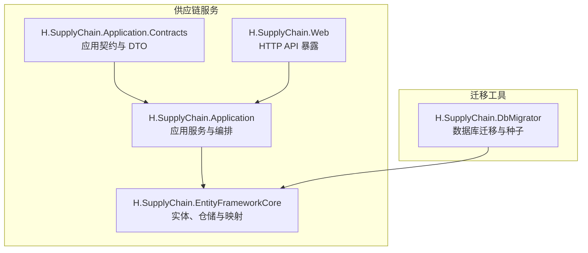
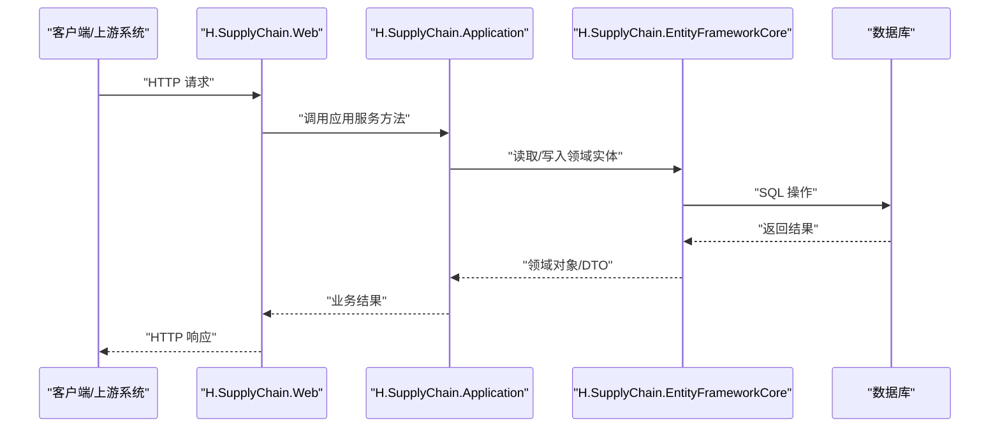
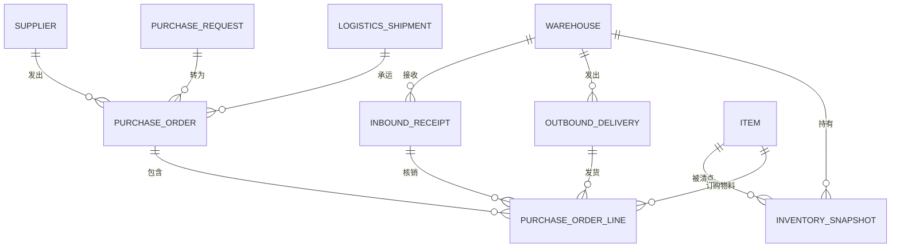
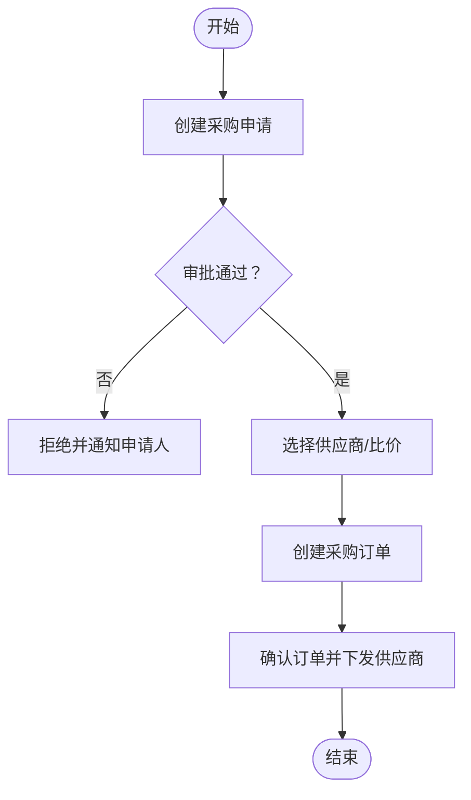
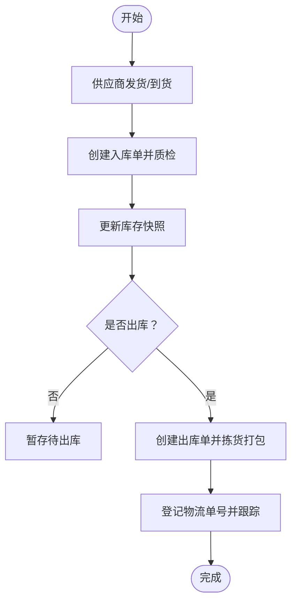
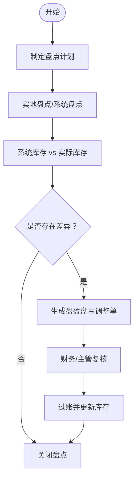
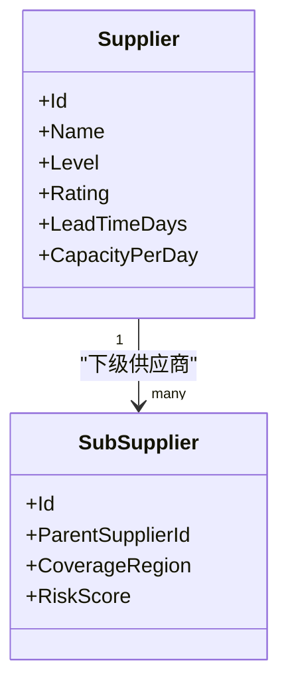
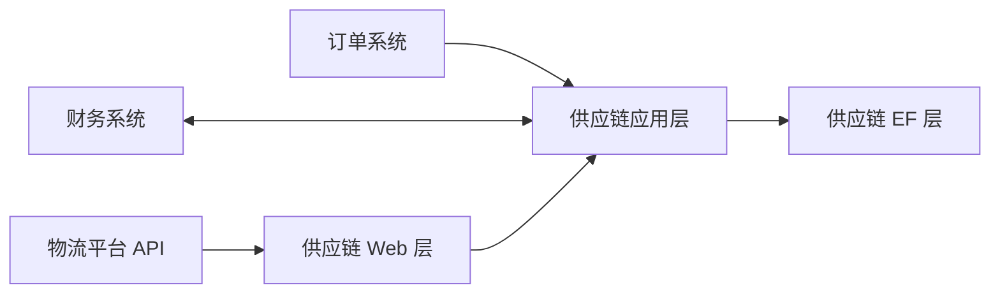

# SupplyChain 供应链管理

<cite>
**本文引用的文件**   
- [H.SupplyChain.Application.Contracts.csproj](file://src/Services/SupplyChain/H.SupplyChain.Application.Contracts/H.SupplyChain.Application.Contracts.csproj)
- [H.SupplyChain.Application.csproj](file://src/Services/SupplyChain/H.SupplyChain.Application/H.SupplyChain.Application.csproj)
- [H.SupplyChain.EntityFrameworkCore.csproj](file://src/Services/SupplyChain/H.SupplyChain.EntityFrameworkCore/H.SupplyChain.EntityFrameworkCore.csproj)
- [H.SupplyChain.Web.csproj](file://src/Services/SupplyChain/H.SupplyChain.Web/H.SupplyChain.Web.csproj)
- [H.SupplyChain.DbMigrator.csproj](file://src/Tools/H.SupplyChain.DbMigrator/H.SupplyChain.DbMigrator.csproj)
- [Program.cs](file://src/Tools/H.SupplyChain.DbMigrator/Program.cs)
- [SupplyChainDbContextFactory.cs](file://src/Tools/H.SupplyChain.DbMigrator/SupplyChainDbContextFactory.cs)
- [appsettings.json](file://src/Tools/H.SupplyChain.DbMigrator/appsettings.json)
</cite>

## 目录
1. [引言](#引言)
2. [项目结构](#项目结构)
3. [核心组件](#核心组件)
4. [架构总览](#架构总览)
5. [详细组件分析](#详细组件分析)
6. [依赖关系分析](#依赖关系分析)
7. [性能与可观测性](#性能与可观测性)
8. [故障排查指南](#故障排查指南)
9. [结论](#结论)
10. [附录：API 参考与集成示例](#附录api-参考与集成示例)

## 引言
SupplyChain 供应链管理服务以领域驱动和 ABP 模块化方式组织，围绕供应商管理、采购流程、库存管理与物流跟踪等核心业务展开。系统通过 Application、Application.Contracts、EntityFrameworkCore 与 Web 四层拆分，配合独立的 DbMigrator 工具完成数据库迁移与初始化。该文档从系统架构、数据模型、业务流程、API 接口以及与其他系统的集成角度，帮助开发者与实施人员快速理解并扩展供应链能力。

## 项目结构
SupplyChain 服务采用典型的 ABP 多项目结构，包含应用契约、应用层、数据持久化与 Web 暴露层，并通过独立迁移工具进行数据库版本管理。

**图示来源**
- [H.SupplyChain.Application.Contracts.csproj](file://src/Services/SupplyChain/H.SupplyChain.Application.Contracts/H.SupplyChain.Application.Contracts.csproj)
- [H.SupplyChain.Application.csproj](file://src/Services/SupplyChain/H.SupplyChain.Application/H.SupplyChain.Application.csproj)
- [H.SupplyChain.EntityFrameworkCore.csproj](file://src/Services/SupplyChain/H.SupplyChain.EntityFrameworkCore/H.SupplyChain.EntityFrameworkCore.csproj)
- [H.SupplyChain.Web.csproj](file://src/Services/SupplyChain/H.SupplyChain.Web/H.SupplyChain.Web.csproj)
- [H.SupplyChain.DbMigrator.csproj](file://src/Tools/H.SupplyChain.DbMigrator/H.SupplyChain.DbMigrator.csproj)

**章节来源**
- [H.SupplyChain.Application.Contracts.csproj](file://src/Services/SupplyChain/H.SupplyChain.Application.Contracts/H.SupplyChain.Application.Contracts.csproj)
- [H.SupplyChain.Application.csproj](file://src/Services/SupplyChain/H.SupplyChain.Application/H.SupplyChain.Application.csproj)
- [H.SupplyChain.EntityFrameworkCore.csproj](file://src/Services/SupplyChain/H.SupplyChain.EntityFrameworkCore/H.SupplyChain.EntityFrameworkCore.csproj)
- [H.SupplyChain.Web.csproj](file://src/Services/SupplyChain/H.SupplyChain.Web/H.SupplyChain.Web.csproj)
- [H.SupplyChain.DbMigrator.csproj](file://src/Tools/H.SupplyChain.DbMigrator/H.SupplyChain.DbMigrator.csproj)

## 核心组件
- 应用契约层（Application.Contracts）
  - 定义跨进程边界的数据传输对象（DTO）、查询参数、枚举与服务接口契约。
  - 职责：对外暴露稳定 API 语义；与实现解耦；便于生成客户端代理。
- 应用层（Application）
  - 封装业务流程编排，如供应商信息维护、采购申请到订单的流转、入库出库、库存盘点与物流跟踪状态更新。
  - 职责：协调领域逻辑、调用仓储与外部服务、事务控制与审计。
- 数据访问层（EntityFrameworkCore）
  - 定义领域实体、EF Core 上下文、实体映射与仓储实现。
  - 职责：持久化供应链主数据与交易数据，提供高效查询与变更追踪。
- Web 层（Web）
  - 将应用服务暴露为 HTTP API，处理请求校验、认证授权、异常转换与响应格式化。
- 迁移工具（DbMigrator）
  - 负责数据库迁移执行与可选的种子数据初始化，确保环境一致性与可重复部署。

**章节来源**
- [H.SupplyChain.Application.Contracts.csproj](file://src/Services/SupplyChain/H.SupplyChain.Application.Contracts/H.SupplyChain.Application.Contracts.csproj)
- [H.SupplyChain.Application.csproj](file://src/Services/SupplyChain/H.SupplyChain.Application/H.SupplyChain.Application.csproj)
- [H.SupplyChain.EntityFrameworkCore.csproj](file://src/Services/SupplyChain/H.SupplyChain.EntityFrameworkCore/H.SupplyChain.EntityFrameworkCore.csproj)
- [H.SupplyChain.Web.csproj](file://src/Services/SupplyChain/H.SupplyChain.Web/H.SupplyChain.Web.csproj)
- [H.SupplyChain.DbMigrator.csproj](file://src/Tools/H.SupplyChain.DbMigrator/H.SupplyChain.DbMigrator.csproj)

## 架构总览
供应链服务遵循分层与模块化原则，Web 层仅做薄封装，核心业务在 Application 中编排，数据由 EF Core 持久化。DbMigrator 作为独立进程，按配置连接数据库执行迁移。

**图示来源**
- [H.SupplyChain.Web.csproj](file://src/Services/SupplyChain/H.SupplyChain.Web/H.SupplyChain.Web.csproj)
- [H.SupplyChain.Application.csproj](file://src/Services/SupplyChain/H.SupplyChain.Application/H.SupplyChain.Application.csproj)
- [H.SupplyChain.EntityFrameworkCore.csproj](file://src/Services/SupplyChain/H.SupplyChain.EntityFrameworkCore/H.SupplyChain.EntityFrameworkCore.csproj)

**章节来源**
- [H.SupplyChain.Web.csproj](file://src/Services/SupplyChain/H.SupplyChain.Web/H.SupplyChain.Web.csproj)
- [H.SupplyChain.Application.csproj](file://src/Services/SupplyChain/H.SupplyChain.Application/H.SupplyChain.Application.csproj)
- [H.SupplyChain.EntityFrameworkCore.csproj](file://src/Services/SupplyChain/H.SupplyChain.EntityFrameworkCore/H.SupplyChain.EntityFrameworkCore.csproj)

## 详细组件分析

### 供应链实体与数据模型
供应链域涵盖以下关键实体及其关系：
- 供应商（Supplier）：企业基本信息、资质、结算账户、评级与联系人。
- 仓库（Warehouse）：物理或逻辑仓库，支持多仓管理、地址、容量与负责人。
- 商品/SKU（Item/Sku）：物料编码、规格、单位、分类、安全库存与预警阈值。
- 采购申请（PurchaseRequest）：需求来源、数量、期望到货时间、关联仓库与审批状态。
- 采购订单（PurchaseOrder）：对供应商的正式采购合同，含明细行、价格、交期、付款条款。
- 入库单（InboundReceipt）：收货记录、批次号、质检结果、入库仓库与位置。
- 出库单（OutboundDelivery）：发货记录、拣货批次、物流单号、目的地。
- 库存快照（InventorySnapshot）：仓库+SKU 维度的实时库存、锁定量、可用量。
- 物流跟踪（LogisticsShipment）：承运商、运单号、节点轨迹、预计到达与实际到达。

**图示来源**
- [H.SupplyChain.EntityFrameworkCore.csproj](file://src/Services/SupplyChain/H.SupplyChain.EntityFrameworkCore/H.SupplyChain.EntityFrameworkCore.csproj)

**章节来源**
- [H.SupplyChain.EntityFrameworkCore.csproj](file://src/Services/SupplyChain/H.SupplyChain.EntityFrameworkCore/H.SupplyChain.EntityFrameworkCore.csproj)

### 业务流程与处理逻辑

#### 采购申请到采购订单

- 输入：采购申请（需求 SKU、数量、期望交期、目标仓库）。
- 输出：采购订单（含明细行、单价、交期、付款条款、供应商）。
- 关键规则：
  - 审批通过后才能转订单。
  - 同一 SKU 多供应商时支持比价与配额分配。
  - 订单确认后同步库存计划与财务应付预估。

**章节来源**
- [H.SupplyChain.Application.csproj](file://src/Services/SupplyChain/H.SupplyChain.Application/H.SupplyChain.Application.csproj)

#### 入库与出库

- 入库：核对 PO 明细、批次、质检结果，增加可用库存。
- 出库：根据销售/调拨单据拣货，扣减可用库存，登记物流信息。
- 库存一致性：入库与出库需保证事务内原子更新，避免超卖。

**章节来源**
- [H.SupplyChain.Application.csproj](file://src/Services/SupplyChain/H.SupplyChain.Application/H.SupplyChain.Application.csproj)

#### 库存盘点与差异处理

- 盘点策略：支持循环盘点、周期性全盘、抽样盘点。
- 差异处理：自动建议调整原因与责任人，触发审批流后过账。

**章节来源**
- [H.SupplyChain.Application.csproj](file://src/Services/SupplyChain/H.SupplyChain.Application/H.SupplyChain.Application.csproj)

### 供应商选择与多级供应商体系
- 基础选型：按价格、交期、质量评分、历史履约率与产能综合评估。
- 多级供应：引入“一级/二级/三级”供应商层级，支持替代料与紧急补货路径。
- 动态配额：基于销量预测与供应商绩效动态分配订单份额。

**图示来源**
- [H.SupplyChain.EntityFrameworkCore.csproj](file://src/Services/SupplyChain/H.SupplyChain.EntityFrameworkCore/H.SupplyChain.EntityFrameworkCore.csproj)

**章节来源**
- [H.SupplyChain.Application.csproj](file://src/Services/SupplyChain/H.SupplyChain.Application/H.SupplyChain.Application.csproj)
- [H.SupplyChain.EntityFrameworkCore.csproj](file://src/Services/SupplyChain/H.SupplyChain.EntityFrameworkCore/H.SupplyChain.EntityFrameworkCore.csproj)

### 库存状态与可视化
- 库存视图：按仓库+SKU 维度展示可用量、锁定量、在途量与安全库存水位。
- 预警指标：低于安全库存、过期风险、周转天数异常。
- 可视化建议：结合低代码渲染引擎，构建库存看板、热力图与趋势图。

**章节来源**
- [H.SupplyChain.Application.csproj](file://src/Services/SupplyChain/H.SupplyChain.Application/H.SupplyChain.Application.csproj)

## 依赖关系分析
- 模块依赖方向：Web → Application → EntityFrameworkCore。
- 迁移工具：DbMigrator 依赖 EF Core 上下文与迁移脚本，使用 appsettings.json 配置连接字符串与环境。
- 外部集成点：
  - 订单系统：订单确认事件驱动采购申请自动生成。
  - 财务系统：应付账款与结算凭证同步至财务模块。
  - 物流平台：对接第三方物流 API 获取轨迹与签收状态。

**图示来源**
- [H.SupplyChain.Web.csproj](file://src/Services/SupplyChain/H.SupplyChain.Web/H.SupplyChain.Web.csproj)
- [H.SupplyChain.Application.csproj](file://src/Services/SupplyChain/H.SupplyChain.Application/H.SupplyChain.Application.csproj)
- [H.SupplyChain.EntityFrameworkCore.csproj](file://src/Services/SupplyChain/H.SupplyChain.EntityFrameworkCore/H.SupplyChain.EntityFrameworkCore.csproj)

**章节来源**
- [H.SupplyChain.Web.csproj](file://src/Services/SupplyChain/H.SupplyChain.Web/H.SupplyChain.Web.csproj)
- [H.SupplyChain.Application.csproj](file://src/Services/SupplyChain/H.SupplyChain.Application/H.SupplyChain.Application.csproj)
- [H.SupplyChain.EntityFrameworkCore.csproj](file://src/Services/SupplyChain/H.SupplyChain.EntityFrameworkCore/H.SupplyChain.EntityFrameworkCore.csproj)

## 性能与可观测性
- 查询优化：对常用过滤条件建立复合索引（如仓库+SKU、供应商+交期）。
- 批量处理：入库/出库、盘点调整使用批量写减少往返数据库次数。
- 缓存策略：对主数据（供应商、仓库、SKU）启用短生命周期缓存降低读放大。
- 可观测性：统一日志、指标与链路追踪，覆盖关键业务流程（PO 创建、入库、出库、物流回调）。

[本节为通用指导，不直接分析具体文件]

## 故障排查指南
- 数据库连接失败
  - 检查迁移工具的 appsettings.json 中连接字符串是否正确，数据库可达性是否正常。
  - 使用 Program 启动迁移工具验证迁移脚本可执行。
- 迁移未执行或版本不一致
  - 确认迁移工具指向正确的 DbContextFactory 与迁移程序集。
  - 对比生产与测试环境的迁移版本号。
- API 调用异常
  - 优先查看 Web 层异常处理与日志；核对 Application 层事务与校验错误。
  - 检查外部系统集成点（财务、物流）的超时与重试策略。

**章节来源**
- [Program.cs](file://src/Tools/H.SupplyChain.DbMigrator/Program.cs)
- [SupplyChainDbContextFactory.cs](file://src/Tools/H.SupplyChain.DbMigrator/SupplyChainDbContextFactory.cs)
- [appsettings.json](file://src/Tools/H.SupplyChain.DbMigrator/appsettings.json)

## 结论
SupplyChain 供应链管理服务以清晰的层次结构与模块化设计，支撑供应商、采购、库存与物流的核心业务流程。通过稳定的契约层、可扩展的应用编排与可靠的 EF 持久化，系统能够与订单、财务与物流等外部系统良好集成。在此基础上，可进一步扩展智能补货算法、多级供应商体系与可视化看板，提升供应链整体效率与韧性。

[本节为总结性内容，不直接分析具体文件]

## 附录：API 参考与集成示例

### 供应商管理
- 新增供应商
  - 方法：CreateSupplier
  - 入参：供应商名称、等级、联系人、结算账户、评级、交期、产能
  - 出参：供应商 ID、状态
- 更新供应商
  - 方法：UpdateSupplier
  - 入参：ID、变更字段
  - 出参：更新后的供应商信息
- 查询供应商
  - 方法：GetSuppliers
  - 入参：分页、排序、筛选（名称、等级、地区）
  - 出参：供应商列表与总数

### 采购流程
- 创建采购申请
  - 方法：CreatePurchaseRequest
  - 入参：SKU、数量、期望交期、目标仓库、需求说明
  - 出参：申请编号、状态
- 审批采购申请
  - 方法：ApprovePurchaseRequest
  - 入参：申请编号、审批意见
  - 出参：最新状态
- 转为采购订单
  - 方法：ConvertToPurchaseOrder
  - 入参：申请编号、供应商、价格、交期、付款条款
  - 出参：订单编号、明细行
- 查询采购订单
  - 方法：GetPurchaseOrders
  - 入参：订单编号、状态、日期范围、供应商
  - 出参：订单详情与明细行

### 入库与出库
- 入库登记
  - 方法：CreateInboundReceipt
  - 入参：订单明细行、批次号、质检结果、仓库、库位
  - 出参：入库单号、可用库存增量
- 出库登记
  - 方法：CreateOutboundDelivery
  - 入参：出库来源、SKU、数量、目的地、物流单号
  - 出参：出库单号、可用库存减量

### 库存管理
- 查询库存状态
  - 方法：GetInventoryStatus
  - 入参：仓库、SKU、时间范围
  - 出参：可用量、锁定量、在途量、安全库存
- 盘点调整
  - 方法：PostInventoryAdjustment
  - 入参：盘点单号、差异原因、责任人、调整数量
  - 出参：调整后库存、审计记录

### 物流跟踪
- 登记物流
  - 方法：RegisterLogisticsShipment
  - 入参：订单号、承运商、运单号、节点轨迹
  - 出参：物流单号、预计到达
- 查询物流状态
  - 方法：GetLogisticsTracking
  - 入参：运单号、订单号
  - 出参：轨迹节点、当前状态、签收时间

### 与订单系统自动对接
- 触发源：订单系统下单成功事件
- 动作：自动生成采购申请（若库存不足），并推送至审批流
- 回写：订单发货完成后，同步供应链出库与物流状态

### 与财务系统结算同步
- 触发源：采购订单确认与入库完成
- 动作：生成应付账款、发票与付款计划
- 回写：财务系统回传付款状态，更新订单结算进度

**章节来源**
- [H.SupplyChain.Application.Contracts.csproj](file://src/Services/SupplyChain/H.SupplyChain.Application.Contracts/H.SupplyChain.Application.Contracts.csproj)
- [H.SupplyChain.Application.csproj](file://src/Services/SupplyChain/H.SupplyChain.Application/H.SupplyChain.Application.csproj)
- [H.SupplyChain.Web.csproj](file://src/Services/SupplyChain/H.SupplyChain.Web/H.SupplyChain.Web.csproj)