# 企业级应用

<cite>
**本文引用的文件**   
- [README.md](file://README.md)
- [AccountWebModule.cs](file://src/src/Services/Account/H.Account.Web/AccountWebModule.cs)
- [OrganizationWebModule.cs](file://src/src/Services/Organization/H.Organization.Web/OrganizationWebModule.cs)
- [ApprovalWebModule.cs](file://src/src/Services/Approval/H.Approval.Web/ApprovalWebModule.cs)
- [OrderWebModule.cs](file://src/src/Services/Order/H.Order.Web/OrderWebModule.cs)
- [SupplyChainWebModule.cs](file://src/src/Services/SupplyChain/H.SupplyChain.Web/SupplyChainWebModule.cs)
- [NotificationWebModule.cs](file://src/src/Services/Notification/H.Notification.Web/NotificationWebModule.cs)
- [BackgroundTaskWebModule.cs](file://src/src/Services/BackgroundTask/H.BackgroundTask.Web/BackgroundTaskWebModule.cs)
- [FileWebModule.cs](file://src/src/Services/File/H.File.Web/FileWebModule.cs)
- [SettingWebModule.cs](file://src/src/Services/Setting/H.Setting.Web/SettingWebModule.cs)
- [AccountApplicationContractsModule.cs](file://src/src/Services/Account/H.Account.Application.Contracts/AccountApplicationContractsModule.cs)
- [OrganizationApplicationContractsModule.cs](file://src/src/Services/Organization/H.Organization.Application.Contracts/OrganizationApplicationContractsModule.cs)
- [ApprovalApplicationContractsModule.cs](file://src/src/Services/Approval/H.Approval.Application.Contracts/ApprovalApplicationContractsModule.cs)
- [OrderApplicationContractsModule.cs](file://src/src/Services/Order/H.Order.Application.Contracts/OrderApplicationContractsModule.cs)
- [SupplyChainApplicationContractsModule.cs](file://src/src/Services/SupplyChain/H.SupplyChain.Application.Contracts/SupplyChainApplicationContractsModule.cs)
- [NotificationApplicationContractsModule.cs](file://src/src/Services/Notification/H.Notification.Application.Contracts/NotificationApplicationContractsModule.cs)
- [BackgroundTaskApplicationContractsModule.cs](file://src/src/Services/BackgroundTask/H.BackgroundTask.Application.Contracts/BackgroundTaskApplicationContractsModule.cs)
- [FileApplicationContractsModule.cs](file://src/src/Services/File/H.File.Application.Contracts/FileApplicationContractsModule.cs)
- [SettingApplicationContractsModule.cs](file://src/src/Services/Setting/H.Setting.Application.Contracts/SettingApplicationContractsModule.cs)
- [IAppService.cs](file://src/src/Utils/H.Abp.Application.Contracts/IAppService.cs)
- [ICrudAppService.cs](file://src/src/Utils/H.Abp.Application.Contracts/ICrudAppService.cs)
- [EntityDto.cs](file://src/src/Utils/H.Abp.Application.Contracts/EntityDto.cs)
- [PagedResultDto.cs](file://src/src/Utils/H.Abp.Application.Contracts/PagedResultDto.cs)
- [AbpUrlConvention.cs](file://src/src/Utils/H.Abp.HttpClientProxy/AbpUrlConvention.cs)
- [HttpClientProxyInterceptor.cs](file://src/src/Utils/H.Abp.HttpClientProxy/HttpClientProxyInterceptor.cs)
- [RemoteServiceOptions.cs](file://src/src/Utils/H.Abp.HttpClientProxy/RemoteServiceOptions.cs)
- [H.AppLab.Desktop.csproj](file://src/src/Host/H.AppLab.Desktop/H.AppLab.Desktop.csproj)
- [H.AppLab.Web.Host.csproj](file://src/src/Host/H.AppLab.Web.Host/H.AppLab.Web.Host.csproj)
- [H.Account.DbMigrator.csproj](file://src/src/Tools/H.Account.DbMigrator/H.Account.DbMigrator.csproj)
- [H.Organization.DbMigrator.csproj](file://src/src/Tools/H.Organization.DbMigrator/H.Organization.DbMigrator.csproj)
- [H.Order.DbMigrator.csproj](file://src/src/Tools/H.Order.DbMigrator/H.Order.DbMigrator.csproj)
- [AccountDbContext.cs](file://src/src/Services/Account/H.Account.EntityFrameworkCore/AccountDbContext.cs)
- [OrganizationDbContext.cs](file://src/src/Services/Organization/H.Organization.EntityFrameworkCore/OrganizationDbContext.cs)
- [ApprovalDbContext.cs](file://src/src/Services/Approval/H.Approval.EntityFrameworkCore/ApprovalDbContext.cs)
- [OrderDbContext.cs](file://src/src/Services/Order/H.Order.EntityFrameworkCore/OrderDbContext.cs)
- [SupplyChainDbContext.cs](file://src/src/Services/SupplyChain/H.SupplyChain.EntityFrameworkCore/SupplyChainDbContext.cs)
- [NotificationDbContext.cs](file://src/src/Services/Notification/H.Notification.EntityFrameworkCore/NotificationDbContext.cs)
- [BackgroundTaskDbContext.cs](file://src/src/Services/BackgroundTask/H.BackgroundTask.EntityFrameworkCore/BackgroundTaskDbContext.cs)
- [FileDbContext.cs](file://src/src/Services/File/H.File.EntityFrameworkCore/FileDbContext.cs)
- [SettingDbContext.cs](file://src/src/Services/Setting/H.Setting.EntityFrameworkCore/SettingDbContext.cs)
</cite>

## 目录
1. [引言](#引言)
2. [项目结构](#项目结构)
3. [核心组件](#核心组件)
4. [架构总览](#架构总览)
5. [详细领域分析](#详细领域分析)
6. [依赖关系与集成方式](#依赖关系与集成方式)
7. [性能与部署特性](#性能与部署特性)
8. [常见问题排查](#常见问题排查)
9. [结论](#结论)

## 引言
本仓库是一个基于 .NET 与 Blazor 的企业级应用套件，提供按限界上下文划分的基础业务能力。每个业务领域（Account、Organization、Approval、Order、SupplyChain、Notification、BackgroundTask、File、Setting）都遵循 ABP 风格的分层架构：Application.Contracts、Application、EntityFrameworkCore、Web。这些服务既可作为独立进程运行，也可在主宿主中组合为单体应用；前端通过 IAppService 接口和 HTTP 动态代理与服务端交互，后端通过模块注册与 EF Core 数据库上下文管理数据。

## 项目结构
- Host：宿主程序，负责服务注册与启动，不包含业务逻辑；支持单体与单服务两种模式。
- Services：企业级应用集合，按限界上下文组织，每个领域包含 Application.Contracts、Application、EntityFrameworkCore、Web 四层。
- System：面向平台运营的系统级应用，与企业级应用隔离。
- LowCode：低代码设计引擎与渲染引擎，以及公共元数据与组件库。
- Tools：各服务的 DbMigrator 控制台程序，用于创建或更新数据库。
- Utils：通用工具与约定，包括 ABP 契约基类、HTTP 动态代理、Blazor 工具、ID 生成等。

```mermaid
graph TB
    subgraph "宿主"
        Desktop["桌面宿主<br/>H.AppLab.Desktop"]
        WebHost["Web 宿主<br/>H.AppLab.Web.Host"]
    end

    subgraph "企业级应用 Services"
        Account["Account 账户管理"]
        Organization["Organization 组织管理"]
        Approval["Approval 审批流程"]
        Order["Order 订单管理"]
        SupplyChain["SupplyChain 供应链管理"]
        Notification["Notification 通知中心"]
        BackgroundTask["BackgroundTask 后台任务"]
        File["File 文件服务"]
        Setting["Setting 设置管理"]
    end

    subgraph "系统应用 System"
        Enterprise["Enterprise"]
        SystemPortal["SystemPortal"]
    end

    subgraph "低代码 LowCode"
        DesignEngine["设计引擎"]
        RenderEngine["渲染引擎"]
    end

    subgraph "工具 Utils"
        AbpContracts["ABP 契约基类"]
        HttpClientProxy["HTTP 动态代理"]
    end

    Desktop --> Account
    Desktop --> Organization
    Desktop --> Approval
    Desktop --> Order
    Desktop --> SupplyChain
    Desktop --> Notification
    Desktop --> BackgroundTask
    Desktop --> File
    Desktop --> Setting

    WebHost --> Account
    WebHost --> Organization
    WebHost --> Approval
    WebHost --> Order
    WebHost --> SupplyChain
    WebHost --> Notification
    WebHost --> BackgroundTask
    WebHost --> File
    WebHost --> Setting

    SystemPortal --> Account
    SystemPortal --> Organization
    SystemPortal --> Approval
    SystemPortal --> Order
    SystemPortal --> SupplyChain
    SystemPortal --> Notification
    SystemPortal --> BackgroundTask
    SystemPortal --> File
    SystemPortal --> Setting

    DesignEngine --> RenderEngine
    Account --> AbpContracts
    Organization --> AbpContracts
    Approval --> AbpContracts
    Order --> AbpContracts
    SupplyChain --> AbpContracts
    Notification --> AbpContracts
    BackgroundTask --> AbpContracts
    File --> AbpContracts
    Setting --> AbpContracts

    Frontend["前端 Blazor 客户端"] --> HttpClientProxy
    HttpClientProxy --> Account
    HttpClientProxy --> Organization
    HttpClientProxy --> Approval
    HttpClientProxy --> Order
    HttpClientProxy --> SupplyChain
    HttpClientProxy --> Notification
    HttpClientProxy --> BackgroundTask
    HttpClientProxy --> File
    HttpClientProxy --> Setting
```

**图示来源**
- [H.AppLab.Desktop.csproj](file://src/src/Host/H.AppLab.Desktop/H.AppLab.Desktop.csproj)
- [H.AppLab.Web.Host.csproj](file://src/src/Host/H.AppLab.Web.Host/H.AppLab.Web.Host.csproj)
- [AccountWebModule.cs](file://src/src/Services/Account/H.Account.Web/AccountWebModule.cs)
- [OrganizationWebModule.cs](file://src/src/Services/Organization/H.Organization.Web/OrganizationWebModule.cs)
- [ApprovalWebModule.cs](file://src/src/Services/Approval/H.Approval.Web/ApprovalWebModule.cs)
- [OrderWebModule.cs](file://src/src/Services/Order/H.Order.Web/OrderWebModule.cs)
- [SupplyChainWebModule.cs](file://src/src/Services/SupplyChain/H.SupplyChain.Web/SupplyChainWebModule.cs)
- [NotificationWebModule.cs](file://src/src/Services/Notification/H.Notification.Web/NotificationWebModule.cs)
- [BackgroundTaskWebModule.cs](file://src/src/Services/BackgroundTask/H.BackgroundTask.Web/BackgroundTaskWebModule.cs)
- [FileWebModule.cs](file://src/src/Services/File/H.File.Web/FileWebModule.cs)
- [SettingWebModule.cs](file://src/src/Services/Setting/H.Setting.Web/SettingWebModule.cs)
- [IAppService.cs](file://src/src/Utils/H.Abp.Application.Contracts/IAppService.cs)
- [AbpUrlConvention.cs](file://src/src/Utils/H.Abp.HttpClientProxy/AbpUrlConvention.cs)
- [HttpClientProxyInterceptor.cs](file://src/src/Utils/H.Abp.HttpClientProxy/HttpClientProxyInterceptor.cs)

**章节来源**
- [README.md:1-73](file://README.md#L1-L73)

## 核心组件
- 分层架构
  - Application.Contracts：定义 IAppService 接口与共享 DTO，作为前后端契约。
  - Application：实现业务逻辑，包含 AppService、工作流引擎、调度器、发送器等。
  - EntityFrameworkCore：定义 DbContext 与各实体表映射。
  - Web：模块注册、路由、控制器、中间件与外部集成。
- 通用契约与代理
  - IAppService、ICrudAppService、EntityDto、PagedResultDto 提供统一的应用服务与分页模型。
  - H.Abp.HttpClientProxy 将 IAppService 方法调用转换为 HTTP 请求，使用 AbpUrlConvention 按 ABP 路由约定生成 URL，RemoteServiceOptions 集中配置远程服务地址。

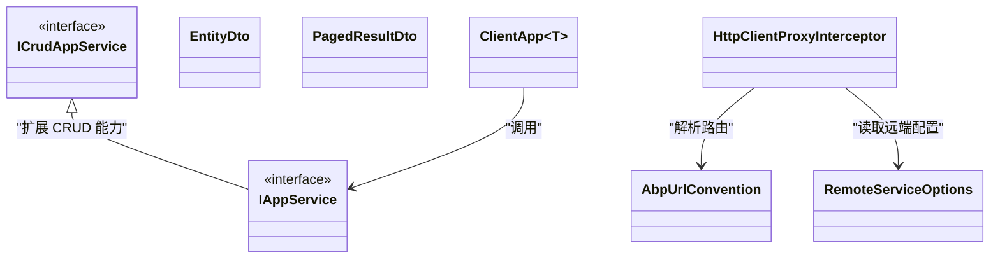

**图示来源**
- [IAppService.cs](file://src/src/Utils/H.Abp.Application.Contracts/IAppService.cs)
- [ICrudAppService.cs](file://src/src/Utils/H.Abp.Application.Contracts/ICrudAppService.cs)
- [EntityDto.cs](file://src/src/Utils/H.Abp.Application.Contracts/EntityDto.cs)
- [PagedResultDto.cs](file://src/src/Utils/H.Abp.Application.Contracts/PagedResultDto.cs)
- [AbpUrlConvention.cs](file://src/src/Utils/H.Abp.HttpClientProxy/AbpUrlConvention.cs)
- [HttpClientProxyInterceptor.cs](file://src/src/Utils/H.Abp.HttpClientProxy/HttpClientProxyInterceptor.cs)
- [RemoteServiceOptions.cs](file://src/src/Utils/H.Abp.HttpClientProxy/RemoteServiceOptions.cs)

**章节来源**
- [README.md:1-73](file://README.md#L1-L73)

## 架构总览
- 服务运行模式
  - 单体：主宿主同时注册多个企业级应用的 Web 模块，共享运行时。
  - 独立：每个服务单独部署为独立进程，前端通过远程服务配置访问。
- 前端集成
  - 前端仅引用 Application.Contracts，通过 AddHttpClientProxies 批量注册代理，按 AbpUrlConvention 将接口名与方法名映射到 HTTP 路由。
  - 复杂参数自动序列化到请求体，远程服务地址由 RemoteServiceOptions 统一管理。
- 后端集成
  - 每个服务通过 WebModule 注册模块，ApplicationModule 注册应用服务，EntityFrameworkCoreModule 注册 DbContext。
  - 跨域事件与消息可通过 RabbitMQ 等基础设施进行异步通信（参考 README 中的依赖服务说明）。

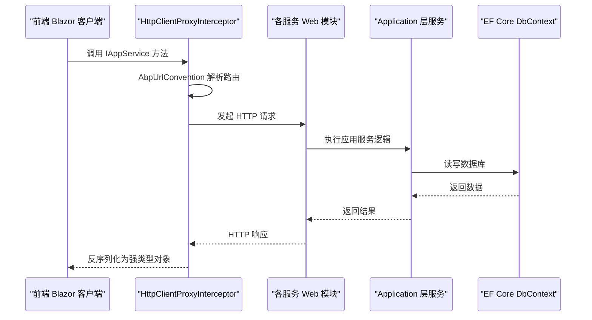

**图示来源**
- [AbpUrlConvention.cs](file://src/src/Utils/H.Abp.HttpClientProxy/AbpUrlConvention.cs)
- [HttpClientProxyInterceptor.cs](file://src/src/Utils/H.Abp.HttpClientProxy/HttpClientProxyInterceptor.cs)
- [AccountWebModule.cs](file://src/src/Services/Account/H.Account.Web/AccountWebModule.cs)
- [OrganizationWebModule.cs](file://src/src/Services/Organization/H.Organization.Web/OrganizationWebModule.cs)
- [ApprovalWebModule.cs](file://src/src/Services/Approval/H.Approval.Web/ApprovalWebModule.cs)
- [OrderWebModule.cs](file://src/src/Services/Order/H.Order.Web/OrderWebModule.cs)
- [SupplyChainWebModule.cs](file://src/src/Services/SupplyChain/H.SupplyChain.Web/SupplyChainWebModule.cs)
- [NotificationWebModule.cs](file://src/src/Services/Notification/H.Notification.Web/NotificationWebModule.cs)
- [BackgroundTaskWebModule.cs](file://src/src/Services/BackgroundTask/H.BackgroundTask.Web/BackgroundTaskWebModule.cs)
- [FileWebModule.cs](file://src/src/Services/File/H.File.Web/FileWebModule.cs)
- [SettingWebModule.cs](file://src/src/Services/Setting/H.Setting.Web/SettingWebModule.cs)

## 详细领域分析

### Account（账户管理）
- 职责
  - 用户账号的增删改查、认证授权、第三方登录（如钉钉、微信）等基础身份管理能力。
- 分层组件
  - Application.Contracts：AccountApplicationContractsModule 暴露 IAccountAppService、IAccountUserAppService 等接口。
  - Application：AccountApplicationModule 注册应用服务，ExternalLogin 相关服务处理第三方登录。
  - EntityFrameworkCore：AccountDbContext 定义用户、角色、权限等实体表。
  - Web：AccountWebModule 注册模块、路由与控制器。
- 关键接口
  - IAccountAppService：账户基础操作。
  - IAccountUserAppService：用户信息管理与密码策略。
  - ExternalLoginAppService：第三方登录流程。
- 数据模型概览
  - 用户、角色、权限、登录日志等实体在 AccountDbContext 中建模。

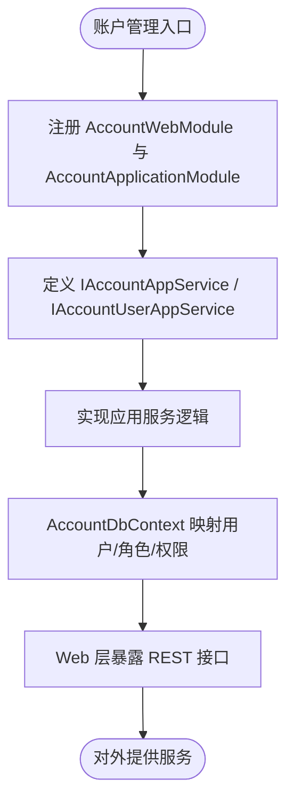

**图示来源**
- [AccountWebModule.cs](file://src/src/Services/Account/H.Account.Web/AccountWebModule.cs)
- [AccountApplicationContractsModule.cs](file://src/src/Services/Account/H.Account.Application.Contracts/AccountApplicationContractsModule.cs)
- [AccountDbContext.cs](file://src/src/Services/Account/H.Account.EntityFrameworkCore/AccountDbContext.cs)

**章节来源**
- [AccountWebModule.cs](file://src/src/Services/Account/H.Account.Web/AccountWebModule.cs)
- [AccountApplicationContractsModule.cs](file://src/src/Services/Account/H.Account.Application.Contracts/AccountApplicationContractsModule.cs)
- [AccountDbContext.cs](file://src/src/Services/Account/H.Account.EntityFrameworkCore/AccountDbContext.cs)

### Organization（组织管理）
- 职责
  - 组织、部门、成员、邀请、角色与权限分配等组织架构管理能力。
- 分层组件
  - Application.Contracts：OrganizationApplicationContractsModule 暴露 IOrganizationAppService、IMemberAppService、IRoleAppService 等。
  - Application：OrganizationApplicationModule 注册组织相关业务服务。
  - EntityFrameworkCore：OrganizationDbContext 定义组织、成员、邀请、角色等实体。
  - Web：OrganizationWebModule 注册 Web 模块与路由。
- 关键接口
  - IOrganizationAppService：组织树与基本信息。
  - IMemberAppService：成员加入、移除与状态管理。
  - IRoleAppService：角色定义与权限关联。
- 数据模型概览
  - 组织、部门、成员、邀请、角色等实体在 OrganizationDbContext 中建模。

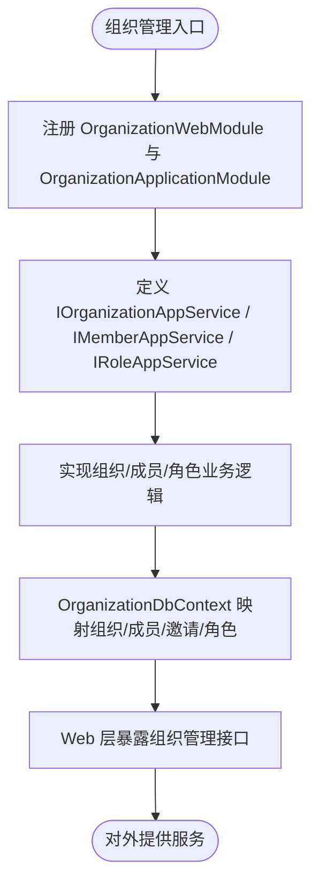

**图示来源**
- [OrganizationWebModule.cs](file://src/src/Services/Organization/H.Organization.Web/OrganizationWebModule.cs)
- [OrganizationApplicationContractsModule.cs](file://src/src/Services/Organization/H.Organization.Application.Contracts/OrganizationApplicationContractsModule.cs)
- [OrganizationDbContext.cs](file://src/src/Services/Organization/H.Organization.EntityFrameworkCore/OrganizationDbContext.cs)

**章节来源**
- [OrganizationWebModule.cs](file://src/src/Services/Organization/H.Organization.Web/OrganizationWebModule.cs)
- [OrganizationApplicationContractsModule.cs](file://src/src/Services/Organization/H.Organization.Application.Contracts/OrganizationApplicationContractsModule.cs)
- [OrganizationDbContext.cs](file://src/src/Services/Organization/H.Organization.EntityFrameworkCore/OrganizationDbContext.cs)

### Approval（审批流程）
- 职责
  - 审批定义、分类、实例与任务的编排与执行，支持模板与流程引擎。
- 分层组件
  - Application.Contracts：ApprovalApplicationContractsModule 暴露 IApprovalDefinitionAppService、IApprovalInstanceAppService、IApprovalTaskAppService 等。
  - Application：ApprovalApplicationModule 注册审批引擎与模板提供者。
  - EntityFrameworkCore：ApprovalDbContext 定义审批定义、实例、任务等实体。
  - Web：ApprovalWebModule 注册 Web 模块与路由。
- 关键接口
  - IApprovalDefinitionAppService：审批规则与流程定义。
  - IApprovalInstanceAppService：审批实例生命周期管理。
  - IApprovalTaskAppService：审批任务处理与流转。
- 数据模型概览
  - 审批定义、分类、实例、任务等实体在 ApprovalDbContext 中建模。

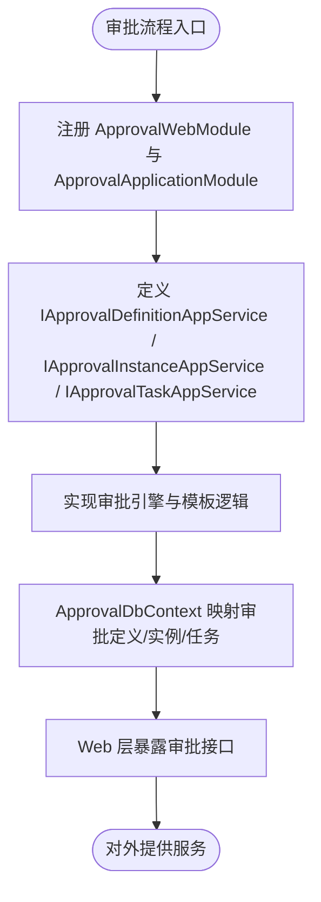

**图示来源**
- [ApprovalWebModule.cs](file://src/src/Services/Approval/H.Approval.Web/ApprovalWebModule.cs)
- [ApprovalApplicationContractsModule.cs](file://src/src/Services/Approval/H.Approval.Application.Contracts/ApprovalApplicationContractsModule.cs)
- [ApprovalDbContext.cs](file://src/src/Services/Approval/H.Approval.EntityFrameworkCore/ApprovalDbContext.cs)

**章节来源**
- [ApprovalWebModule.cs](file://src/src/Services/Approval/H.Approval.Web/ApprovalWebModule.cs)
- [ApprovalApplicationContractsModule.cs](file://src/src/Services/Approval/H.Approval.Application.Contracts/ApprovalApplicationContractsModule.cs)
- [ApprovalDbContext.cs](file://src/src/Services/Approval/H.Approval.EntityFrameworkCore/ApprovalDbContext.cs)

### Order（订单管理）
- 职责
  - 订单生命周期管理、供应商管理、路由与派单引擎、事件消费与异步处理。
- 分层组件
  - Application.Contracts：OrderApplicationContractsModule 暴露 IOrderAppService、ISupplierAppService 等。
  - Application：OrderApplicationModule 注册订单服务与派单引擎。
  - EntityFrameworkCore：OrderDbContext 定义订单、供应商等实体。
  - Web：OrderWebModule 注册 Web 模块与路由。
- 关键接口
  - IOrderAppService：订单创建、查询、状态变更。
  - ISupplierAppService：供应商信息与对接。
  - DispatchService / RouteEngine：派单与路由策略。
- 数据模型概览
  - 订单、供应商、派单记录等实体在 OrderDbContext 中建模。

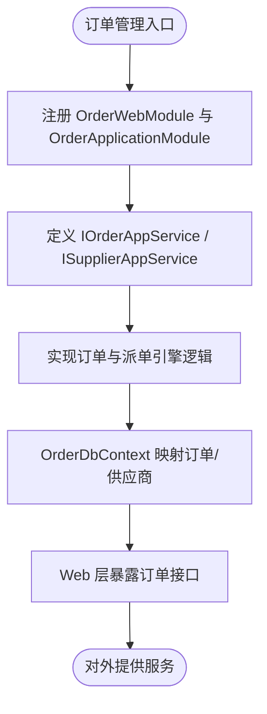

**图示来源**
- [OrderWebModule.cs](file://src/src/Services/Order/H.Order.Web/OrderWebModule.cs)
- [OrderApplicationContractsModule.cs](file://src/src/Services/Order/H.Order.Application.Contracts/OrderApplicationContractsModule.cs)
- [OrderDbContext.cs](file://src/src/Services/Order/H.Order.EntityFrameworkCore/OrderDbContext.cs)

**章节来源**
- [OrderWebModule.cs](file://src/src/Services/Order/H.Order.Web/OrderWebModule.cs)
- [OrderApplicationContractsModule.cs](file://src/src/Services/Order/H.Order.Application.Contracts/OrderApplicationContractsModule.cs)
- [OrderDbContext.cs](file://src/src/Services/Order/H.Order.EntityFrameworkCore/OrderDbContext.cs)

### SupplyChain（供应链管理）
- 职责
  - 供应链协同、供应商接口映射、API 调用封装与数据同步。
- 分层组件
  - Application.Contracts：SupplyChainApplicationContractsModule 暴露 ISupplyChainAppService、ISupplierInterfaceMappingAppService 等。
  - Application：SupplyChainApplicationModule 注册供应链服务与 API 调用器工厂。
  - EntityFrameworkCore：SupplyChainDbContext 定义供应链相关实体。
  - Web：SupplyChainWebModule 注册 Web 模块与路由。
- 关键接口
  - ISupplyChainAppService：供应链主流程。
  - ISupplierInterfaceMappingAppService：供应商接口映射配置。
  - SupplierApiInvokerFactory / SupplierApiInvokers：供应商 API 调用封装。
- 数据模型概览
  - 供应链、供应商接口映射等实体在 SupplyChainDbContext 中建模。

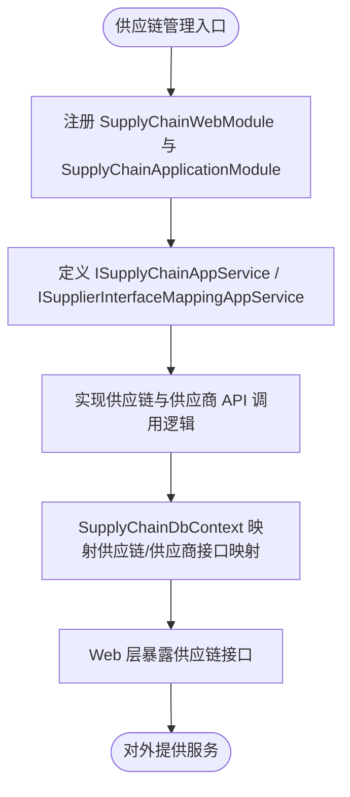

**图示来源**
- [SupplyChainWebModule.cs](file://src/src/Services/SupplyChain/H.SupplyChain.Web/SupplyChainWebModule.cs)
- [SupplyChainApplicationContractsModule.cs](file://src/src/Services/SupplyChain/H.SupplyChain.Application.Contracts/SupplyChainApplicationContractsModule.cs)
- [SupplyChainDbContext.cs](file://src/src/Services/SupplyChain/H.SupplyChain.EntityFrameworkCore/SupplyChainDbContext.cs)

**章节来源**
- [SupplyChainWebModule.cs](file://src/src/Services/SupplyChain/H.SupplyChain.Web/SupplyChainWebModule.cs)
- [SupplyChainApplicationContractsModule.cs](file://src/src/Services/SupplyChain/H.SupplyChain.Application.Contracts/SupplyChainApplicationContractsModule.cs)
- [SupplyChainDbContext.cs](file://src/src/Services/SupplyChain/H.SupplyChain.EntityFrameworkCore/SupplyChainDbContext.cs)

### Notification（通知中心）
- 职责
  - 通知渠道（站内、短信、邮件、Webhook）、通知类别、联系人及群组、业务通知发送。
- 分层组件
  - Application.Contracts：NotificationApplicationContractsModule 暴露 INotificationCategoryAppService、INotificationChannelAppService、INotificationRecordAppService、INotificationSendAppService 等。
  - Application：NotificationApplicationModule 注册通知服务与发送器。
  - EntityFrameworkCore：NotificationDbContext 定义通知相关实体。
  - Web：NotificationWebModule 注册 Web 模块与路由。
- 关键接口
  - INotificationCategoryAppService：通知类别管理。
  - INotificationChannelAppService：通知渠道配置。
  - INotificationRecordAppService：通知记录查询。
  - INotificationSendAppService：业务通知发送。
- 数据模型概览
  - 通知类别、渠道、记录、联系人、群组等实体在 NotificationDbContext 中建模。

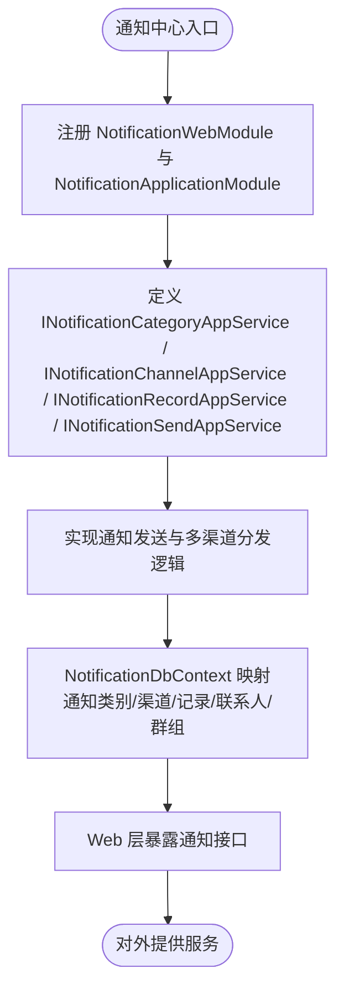

**图示来源**
- [NotificationWebModule.cs](file://src/src/Services/Notification/H.Notification.Web/NotificationWebModule.cs)
- [NotificationApplicationContractsModule.cs](file://src/src/Services/Notification/H.Notification.Application.Contracts/NotificationApplicationContractsModule.cs)
- [NotificationDbContext.cs](file://src/src/Services/Notification/H.Notification.EntityFrameworkCore/NotificationDbContext.cs)

**章节来源**
- [NotificationWebModule.cs](file://src/src/Services/Notification/H.Notification.Web/NotificationWebModule.cs)
- [NotificationApplicationContractsModule.cs](file://src/src/Services/Notification/H.Notification.Application.Contracts/NotificationApplicationContractsModule.cs)
- [NotificationDbContext.cs](file://src/src/Services/Notification/H.Notification.EntityFrameworkCore/NotificationDbContext.cs)

### BackgroundTask（后台任务）
- 职责
  - 后台作业调度、执行记录管理、任务执行器与定时调度。
- 分层组件
  - Application.Contracts：BackgroundTaskApplicationContractsModule 暴露 IBackgroundJobAppService、IJobExecutionRecordAppService 等。
  - Application：BackgroundTaskApplicationModule 注册任务服务与执行器。
  - EntityFrameworkCore：BackgroundTaskDbContext 定义任务与执行记录实体。
  - Web：BackgroundTaskWebModule 注册 Web 模块与路由。
- 关键接口
  - IBackgroundJobAppService：作业定义与触发。
  - IJobExecutionRecordAppService：执行记录查询与审计。
- 数据模型概览
  - 作业、执行记录等实体在 BackgroundTaskDbContext 中建模。

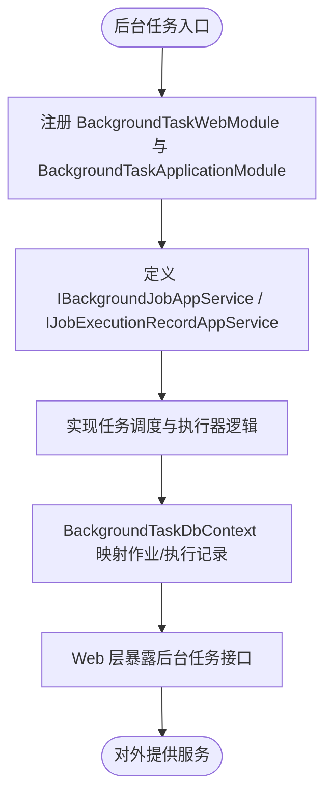

**图示来源**
- [BackgroundTaskWebModule.cs](file://src/src/Services/BackgroundTask/H.BackgroundTask.Web/BackgroundTaskWebModule.cs)
- [BackgroundTaskApplicationContractsModule.cs](file://src/src/Services/BackgroundTask/H.BackgroundTask.Application.Contracts/BackgroundTaskApplicationContractsModule.cs)
- [BackgroundTaskDbContext.cs](file://src/src/Services/BackgroundTask/H.BackgroundTask.EntityFrameworkCore/BackgroundTaskDbContext.cs)

**章节来源**
- [BackgroundTaskWebModule.cs](file://src/src/Services/BackgroundTask/H.BackgroundTask.Web/BackgroundTaskWebModule.cs)
- [BackgroundTaskApplicationContractsModule.cs](file://src/src/Services/BackgroundTask/H.BackgroundTask.Application.Contracts/BackgroundTaskApplicationContractsModule.cs)
- [BackgroundTaskDbContext.cs](file://src/src/Services/BackgroundTask/H.BackgroundTask.EntityFrameworkCore/BackgroundTaskDbContext.cs)

### File（文件服务）
- 职责
  - 文件对象管理、项目内文件组织、存储后端（MinIO）与下载控制器。
- 分层组件
  - Application.Contracts：FileApplicationContractsModule 暴露 IFileObjectAppService、IFileProjectAppService 等。
  - Application：FileApplicationModule 注册文件服务与存储适配器。
  - EntityFrameworkCore：FileDbContext 定义文件对象与项目实体。
  - Web：FileWebModule 注册 Web 模块与文件下载控制器。
- 关键接口
  - IFileObjectAppService：文件上传、下载、删除与元数据管理。
  - IFileProjectAppService：文件项目组织与权限。
- 数据模型概览
  - 文件对象、项目等实体在 FileDbContext 中建模。

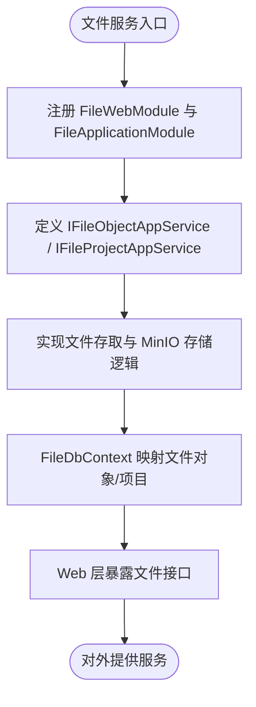

**图示来源**
- [FileWebModule.cs](file://src/src/Services/File/H.File.Web/FileWebModule.cs)
- [FileApplicationContractsModule.cs](file://src/src/Services/File/H.File.Application.Contracts/FileApplicationContractsModule.cs)
- [FileDbContext.cs](file://src/src/Services/File/H.File.EntityFrameworkCore/FileDbContext.cs)

**章节来源**
- [FileWebModule.cs](file://src/src/Services/File/H.File.Web/FileWebModule.cs)
- [FileApplicationContractsModule.cs](file://src/src/Services/File/H.File.Application.Contracts/FileApplicationContractsModule.cs)
- [FileDbContext.cs](file://src/src/Services/File/H.File.EntityFrameworkCore/FileDbContext.cs)

### Setting（设置管理）
- 职责
  - 系统设置定义与值管理，支持键值对与分组。
- 分层组件
  - Application.Contracts：SettingApplicationContractsModule 暴露 ISettingDefinitionAppService、ISettingValueAppService 等。
  - Application：SettingApplicationModule 注册设置服务。
  - EntityFrameworkCore：SettingDbContext 定义设置定义与值实体。
  - Web：SettingWebModule 注册 Web 模块与路由。
- 关键接口
  - ISettingDefinitionAppService：设置项定义管理。
  - ISettingValueAppService：设置值读写。
- 数据模型概览
  - 设置定义与值实体在 SettingDbContext 中建模。

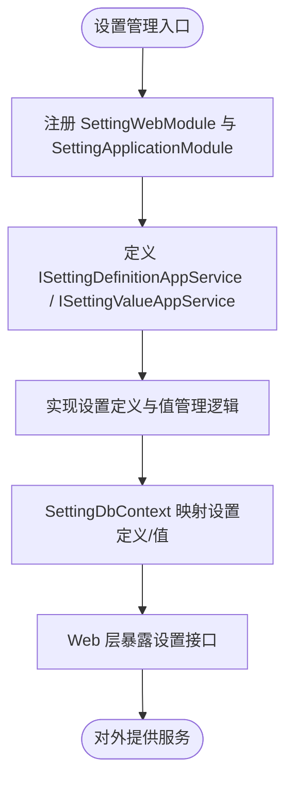

**图示来源**
- [SettingWebModule.cs](file://src/src/Services/Setting/H.Setting.Web/SettingWebModule.cs)
- [SettingApplicationContractsModule.cs](file://src/src/Services/Setting/H.Setting.Application.Contracts/SettingApplicationContractsModule.cs)
- [SettingDbContext.cs](file://src/src/Services/Setting/H.Setting.EntityFrameworkCore/SettingDbContext.cs)

**章节来源**
- [SettingWebModule.cs](file://src/src/Services/Setting/H.Setting.Web/SettingWebModule.cs)
- [SettingApplicationContractsModule.cs](file://src/src/Services/Setting/H.Setting.Application.Contracts/SettingApplicationContractsModule.cs)
- [SettingDbContext.cs](file://src/src/Services/Setting/H.Setting.EntityFrameworkCore/SettingDbContext.cs)

## 依赖关系与集成方式
- 模块与契约
  - 每个服务的 Application.Contracts 模块暴露 IAppService 接口，供前端与其他服务引用。
  - Web 模块注册路由、控制器与中间件；Application 模块注册应用服务；EntityFrameworkCore 模块注册 DbContext。
- API 调用
  - 前端通过 AddHttpClientProxies 扫描所有 IAppService 接口并批量注册代理，按 AbpUrlConvention 生成 HTTP 路由。
  - RemoteServiceOptions 配置远程服务地址，支持单体与多服务部署模式切换。
- 事件总线与异步通信
  - 部分服务（如 Order）包含事件消费者，结合 Redis/RabbitMQ 等基础设施进行异步解耦。
- 共享模型
  - EntityDto、PagedResultDto 等通用 DTO 在各服务间复用，保证接口一致性。

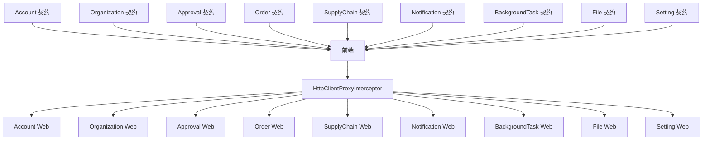

**图示来源**
- [AccountApplicationContractsModule.cs](file://src/src/Services/Account/H.Account.Application.Contracts/AccountApplicationContractsModule.cs)
- [OrganizationApplicationContractsModule.cs](file://src/src/Services/Organization/H.Organization.Application.Contracts/OrganizationApplicationContractsModule.cs)
- [ApprovalApplicationContractsModule.cs](file://src/src/Services/Approval/H.Approval.Application.Contracts/ApprovalApplicationContractsModule.cs)
- [OrderApplicationContractsModule.cs](file://src/src/Services/Order/H.Order.Application.Contracts/OrderApplicationContractsModule.cs)
- [SupplyChainApplicationContractsModule.cs](file://src/src/Services/SupplyChain/H.SupplyChain.Application.Contracts/SupplyChainApplicationContractsModule.cs)
- [NotificationApplicationContractsModule.cs](file://src/src/Services/Notification/H.Notification.Application.Contracts/NotificationApplicationContractsModule.cs)
- [BackgroundTaskApplicationContractsModule.cs](file://src/src/Services/BackgroundTask/H.BackgroundTask.Application.Contracts/BackgroundTaskApplicationContractsModule.cs)
- [FileApplicationContractsModule.cs](file://src/src/Services/File/H.File.Application.Contracts/FileApplicationContractsModule.cs)
- [SettingApplicationContractsModule.cs](file://src/src/Services/Setting/H.Setting.Application.Contracts/SettingApplicationContractsModule.cs)
- [HttpClientProxyInterceptor.cs](file://src/src/Utils/H.Abp.HttpClientProxy/HttpClientProxyInterceptor.cs)
- [AbpUrlConvention.cs](file://src/src/Utils/H.Abp.HttpClientProxy/AbpUrlConvention.cs)

**章节来源**
- [README.md:1-73](file://README.md#L1-L73)

## 性能与部署特性
- 懒加载与 AOT
  - 前端按需加载程序集，减少初始包体积；Release 启用 AOT 与裁剪以提升性能。
- 模块化 DI
  - LazyModuleRegistry 与 CompositeServiceProvider 支持懒加载后的延迟服务注册。
- 数据库迁移
  - 各服务提供独立 DbMigrator 控制台程序，便于独立部署时的数据库初始化与版本管理。

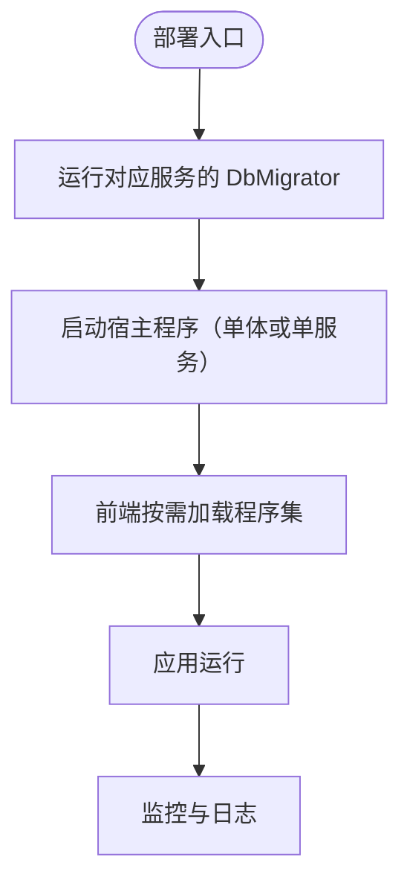

**图示来源**
- [H.Account.DbMigrator.csproj](file://src/src/Tools/H.Account.DbMigrator/H.Account.DbMigrator.csproj)
- [H.Organization.DbMigrator.csproj](file://src/src/Tools/H.Organization.DbMigrator/H.Organization.DbMigrator.csproj)
- [H.Order.DbMigrator.csproj](file://src/src/Tools/H.Order.DbMigrator/H.Order.DbMigrator.csproj)
- [H.AppLab.Desktop.csproj](file://src/src/Host/H.AppLab.Desktop/H.AppLab.Desktop.csproj)
- [H.AppLab.Web.Host.csproj](file://src/src/Host/H.AppLab.Web.Host/H.AppLab.Web.Host.csproj)

**章节来源**
- [README.md:1-73](file://README.md#L1-L73)

## 常见问题排查
- 前端无法调用后端接口
  - 检查 RemoteServiceOptions 是否配置了正确的远程服务地址。
  - 确认 AbpUrlConvention 与 IAppService 命名是否符合 ABP 路由约定。
- 数据库未初始化或版本不一致
  - 运行对应服务的 DbMigrator 程序以创建或更新数据库结构。
- 模块未正确注册导致服务不可用
  - 确保 Web 模块与 Application 模块已正确注册，且 EF Core 模块已注册 DbContext。

**章节来源**
- [README.md:1-73](file://README.md#L1-L73)

## 结论
AppLab 企业级应用套件以清晰的限界上下文与 ABP 分层架构提供了可复用的业务能力。通过统一的契约、HTTP 动态代理与模块化注册机制，开发者可以快速组合现有领域服务构建业务应用，并在需要时进行领域扩展与定制。单体与独立部署模式并存，配合数据库迁移工具与前端懒加载优化，兼顾灵活性与性能。