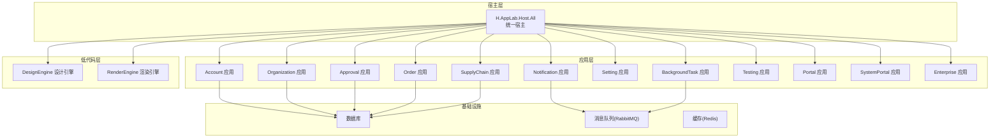
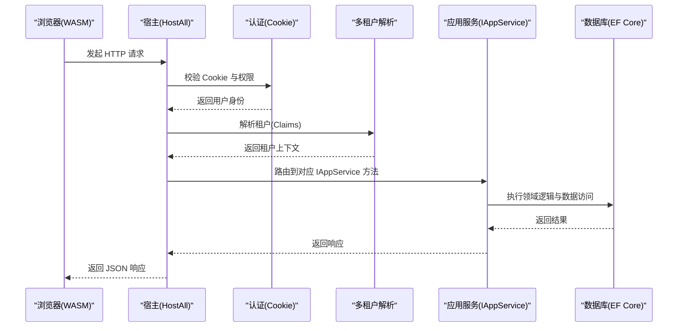
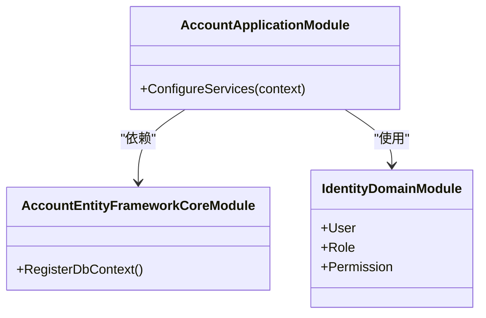
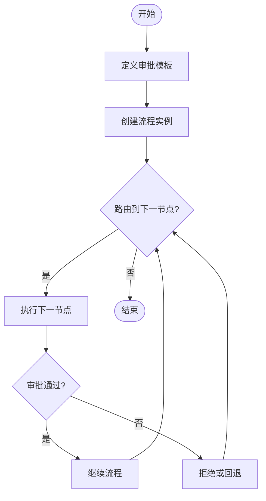
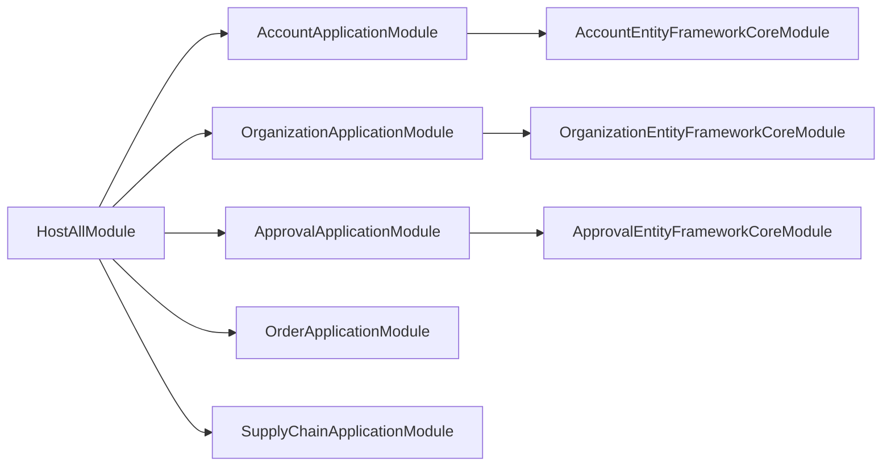

# 企业级服务

<cite>
**本文引用的文件**   
- [README.md](file://README.md)
- [Program.cs](file://src/Host/H.AppLab.Host.All/H.AppLab.Host.All/Program.cs)
- [HostAllModule.cs](file://src/Host/H.AppLab.Host.All/H.AppLab.Host.All/HostAllModule.cs)
- [AccountApplicationModule.cs](file://src/Services/Account/H.Account.Application/AccountApplicationModule.cs)
- [OrganizationApplicationModule.cs](file://src/Services/Organization/H.Organization.Application/OrganizationApplicationModule.cs)
- [ApprovalApplicationModule.cs](file://src/Services/Approval/H.Approval.Application/ApprovalApplicationModule.cs)
- [AccountApplicationContractsModule.cs](file://src/Services/Account/H.Account.Application.Contracts/AccountApplicationContractsModule.cs)
- [OrganizationApplicationContractsModule.cs](file://src/Services/Organization/H.Organization.Application.Contracts/OrganizationApplicationContractsModule.cs)
- [ApprovalApplicationContractsModule.cs](file://src/Services/Approval/H.Approval.Application.Contracts/ApprovalApplicationContractsModule.cs)
- [OrderApplicationContractsModule.cs](file://src/Services/Order/H.Order.Application.Contracts/OrderApplicationContractsModule.cs)
- [SupplyChainApplicationContractsModule.cs](file://src/Services/SupplyChain/H.SupplyChain.Application.Contracts/SupplyChainApplicationContractsModule.cs)
</cite>

## 目录
1. [简介](#简介)
2. [项目结构](#项目结构)
3. [核心组件](#核心组件)
4. [架构总览](#架构总览)
5. [详细组件分析](#详细组件分析)
6. [依赖关系分析](#依赖关系分析)
7. [性能考量](#性能考量)
8. [故障排查指南](#故障排查指南)
9. [结论](#结论)
10. [附录](#附录)

## 简介
本文件为 AppLab 企业级服务的综合文档，覆盖账户管理、组织管理、审批流程、订单管理、供应链管理等业务模块。文档从系统架构、领域模型、API 接口约定、数据流转与业务规则、服务集成与通信协议、配置与扩展开发等方面进行全面说明，并提供常见业务场景的实现示例与最佳实践建议，帮助开发者快速理解并高效扩展企业级能力。

## 项目结构
AppLab 采用模块化架构，支持单体部署与按服务独立部署。整体结构包括：
- Host：宿主程序，负责应用注册、中间件管线、认证授权、多租户等基础设施；H.AppLab.Host.All 为统一宿主（单体），其他 Host 为单服务宿主。
- Components：共享 UI 组件（如 AppDrawer）。
- LowCode：低代码核心，包含设计引擎、渲染引擎、元数据 Schema、默认组件库等。
- Services：基础企业级服务，按限界上下文划分（Account、Organization、Approval、Order、SupplyChain、Notification、Setting、BackgroundTask、Testing 等）。
- System：系统级应用（Enterprise、SystemPortal），面向平台运营侧。
- Tools：各服务的数据库迁移工具（DbMigrator）。
- Utils：通用工具库（ABP 契约、HTTP 动态代理、Blazor 工具、ID 生成器等）。

图表来源 
- [Program.cs:1-115](file://src/Host/H.AppLab.Host.All/H.AppLab.Host.All/Program.cs#L1-L115)
- [HostAllModule.cs:37-78](file://src/Host/H.AppLab.Host.All/H.AppLab.Host.All/HostAllModule.cs#L37-L78)

章节来源
- [README.md:1-74](file://README.md#L1-L74)
- [Program.cs:1-115](file://src/Host/H.AppLab.Host.All/H.AppLab.Host.All/Program.cs#L1-L115)
- [HostAllModule.cs:37-78](file://src/Host/H.AppLab.Host.All/H.AppLab.Host.All/HostAllModule.cs#L37-L78)

## 核心组件
- 统一宿主与模块装配：通过 AbpModule 的 DependsOn 声明聚合所有应用模块，集中注册控制器、认证、多租户、外部登录等能力。
- 前端动态 HTTP 代理：基于 IAppService 接口的 HttpClient 动态代理，将接口方法名转换为 ABP 路由约定请求，简化前后端调用。
- 多租户与 Cookie 认证：双 Cookie Scheme（用户与系统）支持不同域名的认证隔离；Claims 解析当前租户。
- 工作流引擎：审批模块集成 Elsa 工作流引擎，持久化到 SQL Server，提供可视化与运行时管理能力。
- 低代码设计与渲染：设计引擎产出元数据，渲染引擎根据元数据动态生成可运行应用，主题基于 Ant Design Blazor。

章节来源
- [HostAllModule.cs:81-156](file://src/Host/H.AppLab.Host.All/H.AppLab.Host.All/HostAllModule.cs#L81-L156)
- [ApprovalApplicationModule.cs:18-36](file://src/Services/Approval/H.Approval.Application/ApprovalApplicationModule.cs#L18-L36)
- [README.md:63-73](file://README.md#L63-L73)

## 架构总览
AppLab 采用分层与模块化结合的设计：
- 表现层：Blazor Web App（Server + WebAssembly Client），通过路由懒加载按需下载程序集。
- 应用层：每个业务模块遵循 Application.Contracts / Application / EntityFrameworkCore / Web 的分层模式。
- 领域层：各模块的领域模型与仓储实现。
- 基础设施：EF Core 数据访问、Elsa 工作流、Hangfire 后台任务、Redis/RabbitMQ 等。

图表来源 
- [Program.cs:82-88](file://src/Host/H.AppLab.Host.All/H.AppLab.Host.All/Program.cs#L82-L88)
- [HostAllModule.cs:115-156](file://src/Host/H.AppLab.Host.All/H.AppLab.Host.All/HostAllModule.cs#L115-L156)

## 详细组件分析

### 账户管理（Account）
- 领域模型：用户、角色、权限、外部登录（微信、钉钉）等。
- API 接口：基于 IAppService 暴露的用户管理、登录、外部登录回调等接口。
- 数据流转：认证通过 Cookie 传递，多租户通过 Claims 注入；外部登录通过 HttpClient 调用第三方服务。
- 业务规则：密码策略、会话过期、滑动过期、跨域与安全头配置。

图表来源 
- [AccountApplicationModule.cs:9-22](file://src/Services/Account/H.Account.Application/AccountApplicationModule.cs#L9-L22)

章节来源
- [AccountApplicationModule.cs:1-24](file://src/Services/Account/H.Account.Application/AccountApplicationModule.cs#L1-L24)
- [AccountApplicationContractsModule.cs:1-10](file://src/Services/Account/H.Account.Application.Contracts/AccountApplicationContractsModule.cs#L1-L10)

### 组织管理（Organization）
- 领域模型：组织、部门、成员、角色分配等。
- API 接口：组织树查询、成员增删改查、角色绑定等。
- 数据流转：通过 EF Core 访问组织数据，支持分页与排序。
- 业务规则：组织层级约束、成员唯一性、审计字段记录。

章节来源
- [OrganizationApplicationModule.cs:1-17](file://src/Services/Organization/H.Organization.Application/OrganizationApplicationModule.cs#L1-L17)
- [OrganizationApplicationContractsModule.cs:1-10](file://src/Services/Organization/H.Organization.Application.Contracts/OrganizationApplicationContractsModule.cs#L1-L10)

### 审批流程（Approval）
- 领域模型：审批模板、流程实例、节点、审批意见等。
- API 接口：流程定义、启动、审批、回退、终止等。
- 数据流转：Elsa 工作流引擎驱动流程状态变更，持久化到 SQL Server。
- 业务规则：节点权限校验、条件分支、超时处理、审计日志。

图表来源 
- [ApprovalApplicationModule.cs:18-36](file://src/Services/Approval/H.Approval.Application/ApprovalApplicationModule.cs#L18-L36)

章节来源
- [ApprovalApplicationModule.cs:1-38](file://src/Services/Approval/H.Approval.Application/ApprovalApplicationModule.cs#L1-L38)
- [ApprovalApplicationContractsModule.cs:1-10](file://src/Services/Approval/H.Approval.Application.Contracts/ApprovalApplicationContractsModule.cs#L1-L10)

### 订单管理（Order）
- 领域模型：订单、订单项、支付、物流等。
- API 接口：订单创建、查询、修改、取消、支付回调等。
- 数据流转：订单状态机驱动，事件通知至通知服务。
- 业务规则：库存扣减、价格计算、幂等性保证、异常补偿。

章节来源
- [OrderApplicationContractsModule.cs:1-10](file://src/Services/Order/H.Order.Application.Contracts/OrderApplicationContractsModule.cs#L1-L10)

### 供应链管理（SupplyChain）
- 领域模型：供应商、采购单、入库、出库、库存等。
- API 接口：供应商管理、采购流程、库存盘点、对账等。
- 数据流转：与订单、通知、后台任务服务交互，确保数据一致性。
- 业务规则：批次管理、有效期控制、安全库存预警。

章节来源
- [SupplyChainApplicationContractsModule.cs:1-10](file://src/Services/SupplyChain/H.SupplyChain.Application.Contracts/SupplyChainApplicationContractsModule.cs#L1-L10)

## 依赖关系分析
- 宿主模块通过 DependsOn 声明聚合所有应用模块，形成松耦合的模块化体系。
- 各应用模块依赖自身的 EF Core 模块与领域模块，保持内聚性。
- 前端通过 IAppService 动态代理与后端通信，减少样板代码。

图表来源 
- [HostAllModule.cs:37-78](file://src/Host/H.AppLab.Host.All/H.AppLab.Host.All/HostAllModule.cs#L37-L78)

章节来源
- [HostAllModule.cs:37-78](file://src/Host/H.AppLab.Host.All/H.AppLab.Host.All/HostAllModule.cs#L37-L78)

## 性能考量
- 响应压缩：启用 Brotli 与 Gzip 压缩，减少 WASM 资源传输体积。
- 懒加载：首页仅加载必要程序集，其余按路由懒加载，降低初始负载。
- AOT 与裁剪：Release 模式启用 AOT 与 Trimming，进一步减小包大小。
- 数据库连接池：合理配置 EF Core 连接池与查询优化。
- 缓存策略：热点数据使用 Redis 缓存，减轻数据库压力。

章节来源
- [Program.cs:27-46](file://src/Host/H.AppLab.Host.All/H.AppLab.Host.All/Program.cs#L27-L46)
- [README.md:69-73](file://README.md#L69-L73)

## 故障排查指南
- 认证问题：检查 Cookie 配置、登录路径、过期时间、滑动过期设置。
- 多租户错误：验证 Claims 中的 TenantId 是否正确，清理无效 __tenant Cookie。
- 工作流异常：查看 Elsa 工作流日志，确认流程定义与节点配置。
- 数据库迁移：使用 DbMigrator 工具更新数据库结构，检查连接字符串。
- 前端加载失败：检查路由懒加载配置、静态资源压缩与缓存策略。

章节来源
- [HostAllModule.cs:115-201](file://src/Host/H.AppLab.Host.All/H.AppLab.Host.All/HostAllModule.cs#L115-L201)
- [Program.cs:58-88](file://src/Host/H.AppLab.Host.All/H.AppLab.Host.All/Program.cs#L58-L88)

## 结论
AppLab 企业级服务通过模块化架构与低代码能力，提供了可扩展、高性能的企业应用开发平台。账户、组织、审批、订单、供应链等核心模块覆盖了典型企业场景，配合动态 HTTP 代理、多租户、工作流引擎等基础设施，能够快速构建与迭代复杂业务系统。建议在实际项目中遵循领域边界、接口契约与最佳实践，确保系统的可维护性与扩展性。

## 附录
- 本地开发环境准备：安装 .NET SDK、Docker、WSL，启动依赖服务（Redis、RabbitMQ）。
- 项目启动：执行数据库迁移，启动 H.AppLab.Host.All 宿主程序。
- 扩展开发：新增业务模块时，遵循 Application.Contracts / Application / EntityFrameworkCore / Web 分层，注册到 HostAllModule。
- 配置管理：通过 appsettings.json 与外部配置源管理连接字符串、认证、外部登录等配置。

章节来源
- [README.md:38-55](file://README.md#L38-L55)
- [HostAllModule.cs:81-111](file://src/Host/H.AppLab.Host.All/H.AppLab.Host.All/HostAllModule.cs#L81-L111)