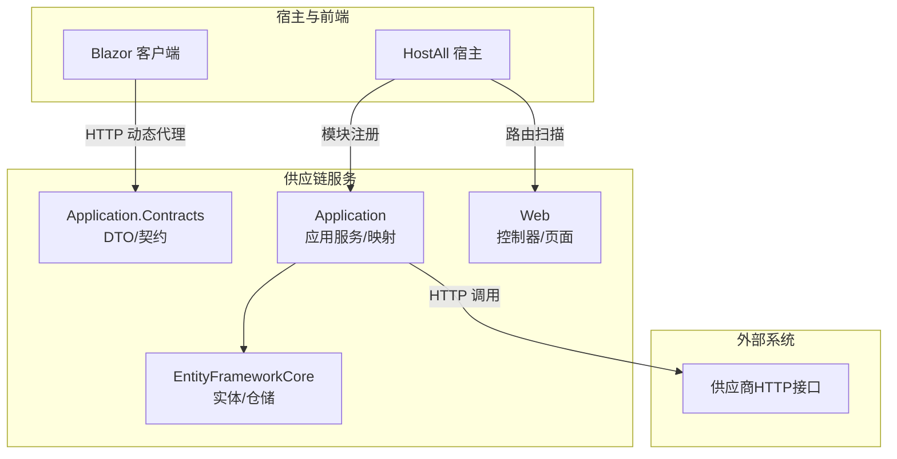
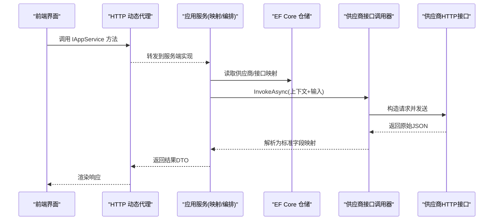
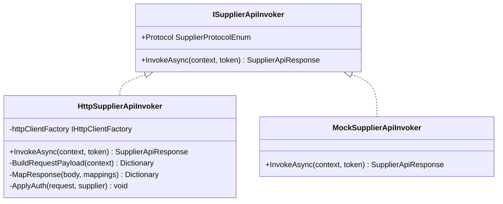
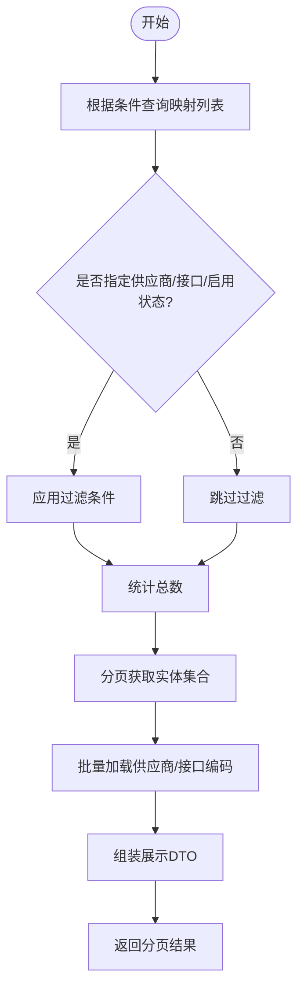
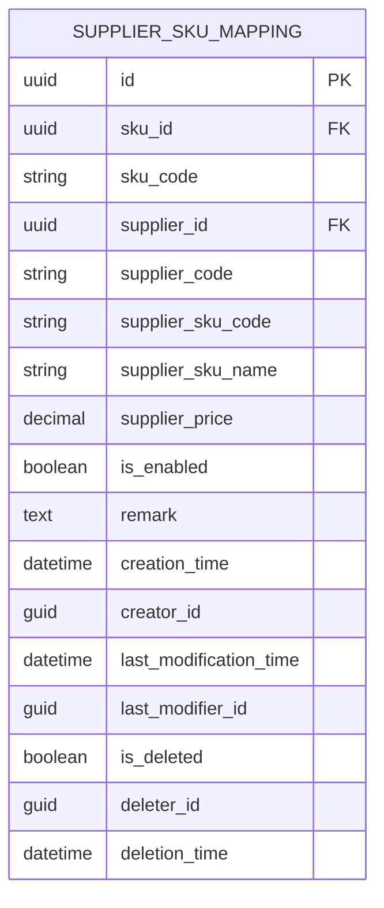
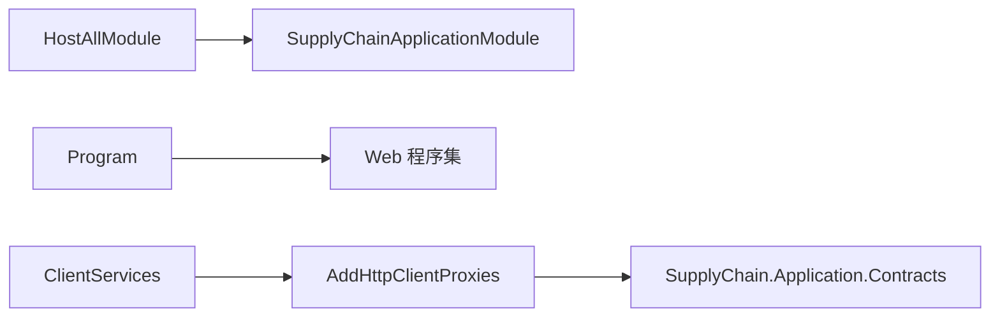

# 供应链服务

<cite>
**本文引用的文件**   
- [README.md](file://README.md)
- [HostAllModule.cs](file://src/Host/H.AppLab.Host.All/H.AppLab.Host.All/HostAllModule.cs)
- [Program.cs](file://src/Host/H.AppLab.Host.All/H.AppLab.Host.All/Program.cs)
- [ClientServices.cs](file://src/Host/H.AppLab.Host.All/H.AppLab.Host.All.Client/ClientServices.cs)
- [SupplyChainMappers.cs](file://src\Services\SupplyChain\H.SupplyChain.Application\Mapping\SupplyChainMappers.cs)
- [SupplierSkuMappingDtos.cs](file://src\Services\SupplyChain\H.SupplyChain.Application.Contracts\Dtos\SupplierSkuMappingDtos.cs)
- [SupplierInterfaceMappingAppService.cs](file://src\Services\SupplyChain\H.SupplyChain.Application\Services\SupplierInterfaceMappingAppService.cs)
- [SupplierApiInvokers.cs](file://src\Services\SupplyChain\H.SupplyChain.Application\Services\SupplierApiInvokers.cs)
- [20260718055132_Init.cs](file://src\Tools\H.SupplyChain.DbMigrator\Migrations\20260718055132_Init.cs)
</cite>

## 目录
1. [简介](#简介)
2. [项目结构](#项目结构)
3. [核心组件](#核心组件)
4. [架构总览](#架构总览)
5. [详细组件分析](#详细组件分析)
6. [依赖关系分析](#依赖关系分析)
7. [性能考虑](#性能考虑)
8. [故障排查指南](#故障排查指南)
9. [结论](#结论)
10. [附录：API接口与接入指南](#附录api接口与接入指南)

## 简介
本文件为 AppLab 供应链服务的完整技术文档，覆盖供应商管理、商品与 SKU 管理、SKU 映射、供应商接口抽象与字段映射机制、数据同步策略、多供应商一致性保障、错误处理与重试机制，以及完整的 API 接口说明与供应商接入指南。该服务遵循模块化分层（Application.Contracts / Application / EntityFrameworkCore / Web），支持单体与按服务独立部署，并通过 HTTP 动态代理在 Blazor 客户端透明调用后端应用服务。

## 项目结构
供应链服务位于 Services/SupplyChain 下，采用 ABP 风格的分层模块：
- H.SupplyChain.Application.Contracts：DTO、枚举、应用服务契约
- H.SupplyChain.Application：应用服务、映射、领域编排
- H.SupplyChain.EntityFrameworkCore：实体、仓储、EF Core 配置
- H.SupplyChain.Web：Web 端控制器与页面
- HostAll 宿主聚合注册并暴露 Web 路由
- DbMigrator：数据库迁移工具

图表来源 
- [HostAllModule.cs](file://src/Host/H.AppLab.Host.All/H.AppLab.Host.All/HostAllModule.cs)
- [Program.cs](file://src/Host/H.AppLab.Host.All/H.AppLab.Host.All/Program.cs)
- [ClientServices.cs](file://src/Host/H.AppLab.Host.All/H.AppLab.Host.All.Client/ClientServices.cs)

章节来源
- [README.md:1-74](file://README.md#L1-L74)
- [HostAllModule.cs:19-72](file://src/Host/H.AppLab.Host.All/H.AppLab.Host.All/HostAllModule.cs#L19-L72)
- [Program.cs:110](file://src/Host/H.AppLab.Host.All/H.AppLab.Host.All/Program.cs#L110)
- [ClientServices.cs:39-118](file://src/Host/H.AppLab.Host.All/H.AppLab.Host.All.Client/ClientServices.cs#L39-L118)

## 核心组件
- 供应商管理：维护供应商基础信息、认证方式与协议配置，支持多种认证（ApiKey/Header/Basic/Bearer）与协议扩展点。
- 商品与 SKU 管理：标准商品主数据与 SKU 维度管理，支撑价格、库存、规格等属性。
- 供应商 SKU 映射：内部 SKU 与供应商 SKU 的多对一映射，记录供应商编码、商品编码、名称、供货价、启用状态等。
- 供应商接口映射：基于“接口定义 + 供应商”的映射配置，声明请求参数映射与响应字段映射，驱动运行时动态组装请求与解析应答。
- 供应商接口调用器：统一抽象 ISupplierApiInvoker，提供 HTTP 实现与 Mock 实现，支持路径拼接、认证注入、JSON 路径取值与透传未映射字段。

章节来源
- [SupplierSkuMappingDtos.cs:1-100](file://src\Services\SupplyChain\H.SupplyChain.Application.Contracts\Dtos\SupplierSkuMappingDtos.cs#L1-L100)
- [SupplyChainMappers.cs:1-276](file://src\Services\SupplyChain\H.SupplyChain.Application\Mapping\SupplyChainMappers.cs#L1-L276)
- [SupplierInterfaceMappingAppService.cs:1-110](file://src\Services\SupplyChain\H.SupplyChain.Application\Services\SupplierInterfaceMappingAppService.cs#L1-L110)
- [SupplierApiInvokers.cs:1-278](file://src\Services\SupplyChain\H.SupplyChain.Application\Services\SupplierApiInvokers.cs#L1-L278)

## 架构总览
供应链服务通过应用服务编排业务逻辑，使用 EF Core 持久化实体，借助 IHttpClientFactory 调用供应商 HTTP 接口；请求/响应字段通过 JSON 路径映射完成标准化转换。前端通过 AbpUrlConvention 将 IAppService 方法名转换为 HTTP 请求，无需手写 HttpClient 代码。

图表来源 
- [ClientServices.cs:39-118](file://src/Host/H.AppLab.Host.All/H.AppLab.Host.All.Client/ClientServices.cs#L39-L118)
- [SupplierApiInvokers.cs:30-87](file://src\Services\SupplyChain\H.SupplyChain.Application\Services\SupplierApiInvokers.cs#L30-L87)
- [SupplierInterfaceMappingAppService.cs:33-50](file://src\Services\SupplyChain\H.SupplyChain.Application\Services\SupplierInterfaceMappingAppService.cs#L33-L50)

## 详细组件分析

### 供应商接口抽象与调用器
- 抽象接口 ISupplierApiInvoker：定义 InvokeAsync(context, token)，返回 SupplierApiResponse，包含状态码、原始体与标准字段映射。
- HttpSupplierApiInvoker：
  - 地址计算：优先使用映射中的 SupplierApiUrl，其次供应商默认 ApiUrl，再拼接 Interface.Path。
  - 请求构建：按 RequestMappings 将标准 Input 映射为目标字段，缺失时按 IsRequired/DefaultValue 处理；未映射字段透传。
  - 认证注入：支持 ApiKey（header/query）、Header、Basic、Bearer，从 AuthConfig JSON 动态解析。
  - 响应解析：按 ResponseMappings 的 SourceField（JSON 路径）取值为 TargetField，支持默认值。
- MockSupplierApiInvoker：不真实调用外部接口，直接生成模拟响应，便于开发联调。

图表来源 
- [SupplierApiInvokers.cs:20-87](file://src\Services\SupplyChain\H.SupplyChain.Application\Services\SupplierApiInvokers.cs#L20-L87)
- [SupplierApiInvokers.cs:184-247](file://src\Services\SupplyChain\H.SupplyChain.Application\Services\SupplierApiInvokers.cs#L184-L247)
- [SupplierApiInvokers.cs:253-278](file://src\Services\SupplyChain\H.SupplyChain.Application\Services\SupplierApiInvokers.cs#L253-L278)

章节来源
- [SupplierApiInvokers.cs:1-278](file://src\Services\SupplyChain\H.SupplyChain.Application\Services\SupplierApiInvokers.cs#L1-L278)

### 供应商接口映射管理
- SupplierInterfaceMappingAppService：提供接口映射的 CRUD 与分页查询，支持按供应商、接口、启用状态过滤。
- 展示 DTO 构建：批量加载供应商与接口编码，填充 SupplierCode、InterfaceCode 用于展示。
- 唯一性校验：同一供应商对同一接口的映射仅允许一条。

图表来源 
- [SupplierInterfaceMappingAppService.cs:33-50](file://src\Services\SupplyChain\H.SupplyChain.Application\Services\SupplierInterfaceMappingAppService.cs#L33-L50)
- [SupplierInterfaceMappingAppService.cs:88-110](file://src\Services\SupplyChain\H.SupplyChain.Application\Services\SupplierInterfaceMappingAppService.cs#L88-L110)

章节来源
- [SupplierInterfaceMappingAppService.cs:1-110](file://src\Services\SupplyChain\H.SupplyChain.Application\Services\SupplierInterfaceMappingAppService.cs#L1-L110)

### 字段映射机制与数据模型
- 映射类型：
  - 供应商接口映射：RequestMappingJson/ResponseMappingJson 描述字段映射规则。
  - 供应商 SKU 映射：记录内部 SKU 与供应商 SKU 的对应关系及价格、启用状态等。
- 手工映射：SupplyChainMappers 提供实体与 DTO 的双向映射，避免引入额外映射框架。
- 数据库表结构：迁移脚本定义了 SupplierSkuMappings 等关键表的字段与约束。

图表来源 
- [20260718055132_Init.cs:175-191](file://src\Tools\H.SupplyChain.DbMigrator\Migrations\20260718055132_Init.cs#L175-L191)

章节来源
- [SupplyChainMappers.cs:150-188](file://src\Services\SupplyChain\H.SupplyChain.Application\Mapping\SupplyChainMappers.cs#L150-L188)
- [SupplierSkuMappingDtos.cs:1-100](file://src\Services\SupplyChain\H.SupplyChain.Application.Contracts\Dtos\SupplierSkuMappingDtos.cs#L1-L100)
- [20260718055132_Init.cs:175-191](file://src\Tools\H.SupplyChain.DbMigrator\Migrations\20260718055132_Init.cs#L175-L191)

### 数据同步策略与多供应商一致性
- 同步策略建议：
  - 增量同步：基于时间戳或版本号进行差异拉取，减少带宽与压力。
  - 幂等写入：以供应商订单号/外部单号为幂等键，避免重复下单或更新。
  - 补偿机制：失败重试与人工干预入口，确保最终一致。
- 一致性保证：
  - 本地事务包裹写操作，结合消息队列或事件总线进行跨域协调（可扩展）。
  - 对外部依赖的错误分类（网络超时、业务拒绝、鉴权失败）分别处理。
- 重试机制：
  - 针对瞬时错误（网络抖动、限流）实施指数退避重试。
  - 对不可恢复错误（参数非法、鉴权失败）立即失败并告警。

[本节为通用指导，不直接分析具体文件]

## 依赖关系分析
- 宿主与模块：
  - HostAllModule 注册 SupplyChainApplicationModule，启用控制器扫描。
  - Program 注册 Web 程序集，使 Blazor 可访问相关资源。
- 客户端代理：
  - ClientServices 中配置 SupplyChainRemoteServiceName，并使用 AddHttpClientProxies 扫描契约程序集，生成 HTTP 代理。

图表来源 
- [HostAllModule.cs:19-72](file://src/Host/H.AppLab.Host.All/H.AppLab.Host.All/HostAllModule.cs#L19-L72)
- [Program.cs:110](file://src/Host/H.AppLab.Host.All/H.AppLab.Host.All/Program.cs#L110)
- [ClientServices.cs:39-118](file://src/Host/H.AppLab.Host.All/H.AppLab.Host.All.Client/ClientServices.cs#L39-L118)

章节来源
- [HostAllModule.cs:19-72](file://src/Host/H.AppLab.Host.All/H.AppLab.Host.All/HostAllModule.cs#L19-L72)
- [Program.cs:110](file://src/Host/H.AppLab.Host.All/H.AppLab.Host.All/Program.cs#L110)
- [ClientServices.cs:39-118](file://src/Host/H.AppLab.Host.All/H.AppLab.Host.All.Client/ClientServices.cs#L39-L118)

## 性能考虑
- HTTP 连接复用：通过 IHttpClientFactory 创建命名客户端，避免 Socket 耗尽。
- 请求/响应映射优化：尽量精简 RequestMappings/ResponseMappings，减少 JSON 解析开销。
- 分页与投影：查询时使用 Skip/Take 与投影，避免全量加载。
- 缓存策略：对静态或低频变化的映射配置进行缓存（如 Redis），降低 DB 压力。
- 异步与取消：所有 IO 操作使用 async/await 与 CancellationToken，提升吞吐。

[本节为通用指导，不直接分析具体文件]

## 故障排查指南
- 常见错误定位：
  - 供应商未配置 ApiUrl：检查映射或供应商基础信息。
  - HTTP 非成功状态码：查看原始响应体与状态码，区分网络错误与业务错误。
  - 认证失败：核对 AuthType 与 AuthConfig JSON 结构（keyName/value/in、headers、username/password、token）。
  - JSON 路径取值失败：确认 SourceField 路径与目标 JSON 结构一致。
- 调试建议：
  - 使用 MockSupplierApiInvoker 快速验证映射逻辑。
  - 开启日志记录请求体与响应体，便于问题复现。
  - 对必填字段进行前置校验，减少无效调用。

章节来源
- [SupplierApiInvokers.cs:30-87](file://src\Services\SupplyChain\H.SupplyChain.Application\Services\SupplierApiInvokers.cs#L30-L87)
- [SupplierApiInvokers.cs:184-247](file://src\Services\SupplyChain\H.SupplyChain.Application\Services\SupplierApiInvokers.cs#L184-L247)
- [SupplierApiInvokers.cs:253-278](file://src\Services\SupplyChain\H.SupplyChain.Application\Services\SupplierApiInvokers.cs#L253-L278)

## 结论
供应链服务通过标准化的接口抽象与字段映射机制，实现了多供应商的统一接入与数据同步。结合 EF Core 持久化、IHttpClientFactory 的网络调用与 Blazor 的动态代理，形成了高内聚、低耦合的模块化架构。建议在后续迭代中补充重试与补偿机制、监控与告警能力，进一步提升稳定性与可观测性。

[本节为总结，不直接分析具体文件]

## 附录：API接口与接入指南

### 供应商接口抽象与调用流程
- 抽象接口：ISupplierApiInvoker.InvokeAsync(context, token)
- 上下文：包含供应商信息、接口定义、映射配置与输入参数
- 返回值：SupplierApiResponse（状态码、原始体、标准字段映射）

章节来源
- [SupplierApiInvokers.cs:30-87](file://src\Services\SupplyChain\H.SupplyChain.Application\Services\SupplierApiInvokers.cs#L30-L87)

### 字段映射机制
- 请求映射：SourceField → TargetField，支持 DefaultValue 与 IsRequired
- 响应映射：SourceField（JSON 路径）→ TargetField，支持 DefaultValue
- 透传机制：未映射字段原样透传，避免遗漏必要参数

章节来源
- [SupplierApiInvokers.cs:93-123](file://src\Services\SupplyChain\H.SupplyChain.Application\Services\SupplierApiInvokers.cs#L93-L123)
- [SupplierApiInvokers.cs:129-164](file://src\Services\SupplyChain\H.SupplyChain.Application\Services\SupplierApiInvokers.cs#L129-L164)

### 数据同步策略
- 增量同步：基于时间戳或版本号
- 幂等写入：以外部单号为幂等键
- 补偿机制：失败重试与人工干预

[本节为通用指导，不直接分析具体文件]

### 多供应商一致性保障
- 本地事务包裹写操作
- 错误分类与差异化处理
- 指数退避重试与不可恢复错误快速失败

[本节为通用指导，不直接分析具体文件]

### 错误处理与重试机制
- 网络超时/限流：指数退避重试
- 鉴权失败/参数非法：立即失败并告警
- 日志记录：请求体与响应体

章节来源
- [SupplierApiInvokers.cs:65-87](file://src\Services\SupplyChain\H.SupplyChain.Application\Services\SupplierApiInvokers.cs#L65-L87)

### 完整 API 接口文档（示例）
- 供应商接口映射管理
  - 分页查询：GetListAsync(SupplierInterfaceMappingQueryDto)
  - 获取详情：GetAsync(id)
  - 新增：CreateAsync(CreateSupplierInterfaceMappingDto)
  - 更新：UpdateAsync(id, UpdateSupplierInterfaceMappingDto)
  - 删除：DeleteAsync(id)
- 供应商 SKU 映射管理
  - 分页查询：GetListAsync(SupplierSkuMappingQueryDto)
  - 获取详情：GetAsync(id)
  - 新增：CreateAsync(CreateSupplierSkuMappingDto)
  - 更新：UpdateAsync(id, UpdateSupplierSkuMappingDto)
  - 删除：DeleteAsync(id)

章节来源
- [SupplierInterfaceMappingAppService.cs:33-86](file://src\Services\SupplyChain\H.SupplyChain.Application\Services\SupplierInterfaceMappingAppService.cs#L33-L86)
- [SupplierSkuMappingDtos.cs:1-100](file://src\Services\SupplyChain\H.SupplyChain.Application.Contracts\Dtos\SupplierSkuMappingDtos.cs#L1-L100)

### 供应商接入指南
- 步骤
  - 注册供应商基础信息与认证配置
  - 定义标准接口（HttpMethod、Path、请求/响应字段）
  - 配置供应商接口映射（RequestMappingJson、ResponseMappingJson、可选 SupplierApiUrl）
  - 配置供应商 SKU 映射（内部 SKU 与供应商 SKU 对应关系）
  - 调用应用服务进行数据同步或下单
- 认证配置示例
  - ApiKey：{ "keyName": "X-Api-Key", "value": "xxx", "in": "header|query" }
  - Header：{ "headers": { "X-Foo": "bar" } }
  - Basic：{ "username": "u", "password": "p" }
  - Bearer：{ "token": "xxx" }

章节来源
- [SupplierApiInvokers.cs:184-247](file://src\Services\SupplyChain\H.SupplyChain.Application\Services\SupplierApiInvokers.cs#L184-L247)