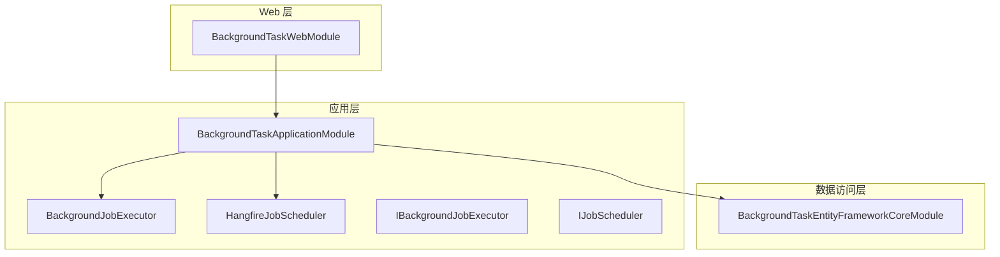
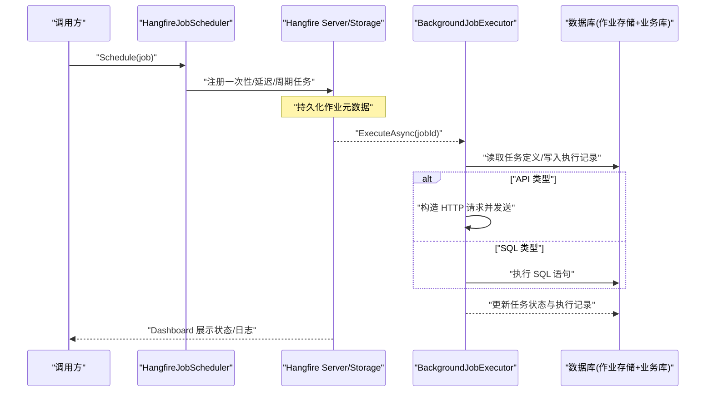
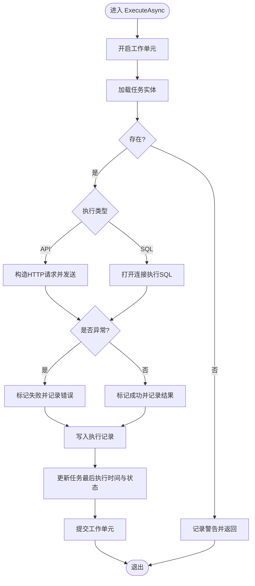
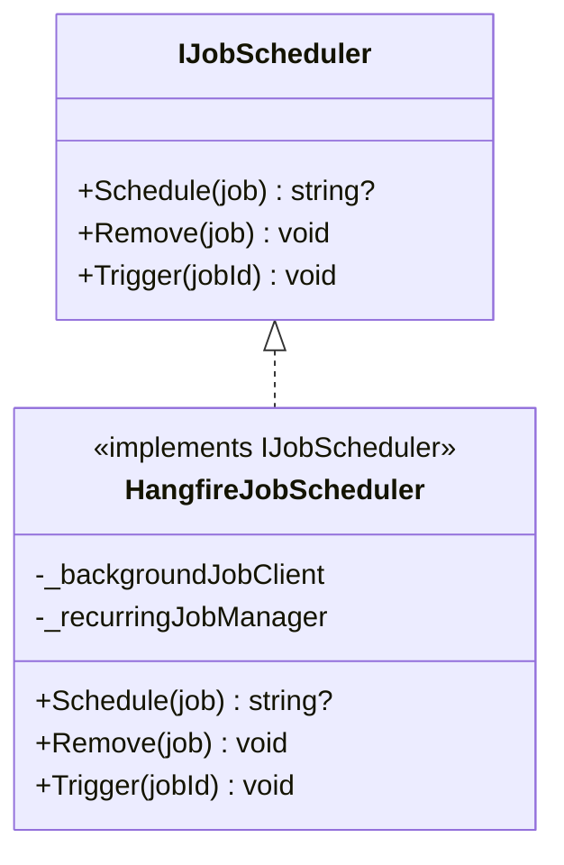
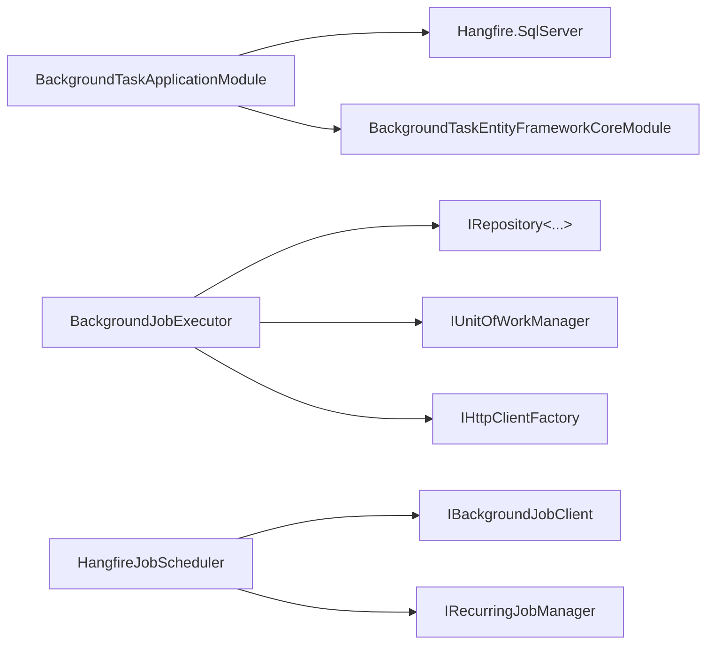

# 后台任务服务

<cite>
**本文引用的文件**   
- [BackgroundTaskApplicationModule.cs](file://src/Services/BackgroundTask/H.BackgroundTask.Application/BackgroundTaskApplicationModule.cs)
- [BackgroundJobExecutor.cs](file://src/Services/BackgroundTask/H.BackgroundTask.Application/Services/BackgroundJobExecutor.cs)
- [HangfireJobScheduler.cs](file://src/Services/BackgroundTask/H.BackgroundTask.Application/Services/HangfireJobScheduler.cs)
- [IBackgroundJobExecutor.cs](file://src/Services/BackgroundTask/H.BackgroundTask.Application/Services/IBackgroundJobExecutor.cs)
- [IJobScheduler.cs](file://src/Services/BackgroundTask/H.BackgroundTask.Application/Services/IJobScheduler.cs)
- [BackgroundTaskEntityFrameworkCoreModule.cs](file://src/Services/BackgroundTask/H.BackgroundTask.EntityFrameworkCore/BackgroundTaskEntityFrameworkCoreModule.cs)
- [BackgroundTaskWebModule.cs](file://src/Services/BackgroundTask/H.BackgroundTask.Web/BackgroundTaskWebModule.cs)
</cite>

## 目录
1. [简介](#简介)
2. [项目结构](#项目结构)
3. [核心组件](#核心组件)
4. [架构总览](#架构总览)
5. [详细组件分析](#详细组件分析)
6. [依赖关系分析](#依赖关系分析)
7. [性能与并发控制](#性能与并发控制)
8. [故障排查指南](#故障排查指南)
9. [结论](#结论)
10. [附录：API 与管理界面说明](#附录api-与管理界面说明)

## 简介
本文件为 AppLab 后台任务服务的完整技术文档，覆盖任务调度、执行监控、失败重试、日志记录等能力。系统基于 Hangfire 实现作业持久化与调度，结合 ABP 模块化与 EF Core 数据访问，提供统一的 API/SQL 两类任务执行方式，并支持一次性任务、延迟任务与周期任务（Cron）。同时给出最佳实践与性能调优建议，帮助开发者在生产环境稳定运行高吞吐的后台任务。

## 项目结构
后台任务服务采用 ABP 模块化分层组织，关键模块如下：
- 应用层模块：注册 Hangfire、注入执行器与调度器
- 领域/执行服务：封装任务执行逻辑（API/SQL）与执行记录写入
- 数据访问模块：配置 EF Core 数据库上下文与连接字符串
- Web 模块：用于集成 Web 管理界面（Hangfire Dashboard）

图表来源
- [BackgroundTaskApplicationModule.cs:17-55](file://src/Services/BackgroundTask/H.BackgroundTask.Application/BackgroundTaskApplicationModule.cs#L17-L55)
- [BackgroundTaskEntityFrameworkCoreModule.cs:11-30](file://src/Services/BackgroundTask/H.BackgroundTask.EntityFrameworkCore/BackgroundTaskEntityFrameworkCoreModule.cs#L11-L30)
- [BackgroundTaskWebModule.cs:1-9](file://src/Services/BackgroundTask/H.BackgroundTask.Web/BackgroundTaskWebModule.cs#L1-L9)

章节来源
- [BackgroundTaskApplicationModule.cs:17-55](file://src/Services/BackgroundTask/H.BackgroundTask.Application/BackgroundTaskApplicationModule.cs#L17-L55)
- [BackgroundTaskEntityFrameworkCoreModule.cs:11-30](file://src/Services/BackgroundTask/H.BackgroundTask.EntityFrameworkCore/BackgroundTaskEntityFrameworkCoreModule.cs#L11-L30)
- [BackgroundTaskWebModule.cs:1-9](file://src/Services/BackgroundTask/H.BackgroundTask.Web/BackgroundTaskWebModule.cs#L1-L9)

## 核心组件
- 任务执行器 BackgroundJobExecutor
  - 负责根据任务类型调用外部 API 或执行 SQL，并记录执行结果与错误信息
  - 通过工作单元（UoW）在 Hangfire 线程中安全读写数据库
- 任务调度器 HangfireJobScheduler
  - 将任务定义映射到 Hangfire 的一次性/延迟/周期任务
  - 提供立即触发、移除调度等操作
- 接口抽象
  - IBackgroundJobExecutor：定义执行入口，保证 Hangfire 反射调用签名稳定
  - IJobScheduler：屏蔽 Hangfire 细节，统一调度行为

章节来源
- [BackgroundJobExecutor.cs:17-98](file://src/Services/BackgroundTask/H.BackgroundTask.Application/Services/BackgroundJobExecutor.cs#L17-L98)
- [HangfireJobScheduler.cs:10-89](file://src/Services/BackgroundTask/H.BackgroundTask.Application/Services/HangfireJobScheduler.cs#L10-L89)
- [IBackgroundJobExecutor.cs:6-13](file://src/Services/BackgroundTask/H.BackgroundTask.Application/Services/IBackgroundJobExecutor.cs#L6-L13)
- [IJobScheduler.cs:9-22](file://src/Services/BackgroundTask/H.BackgroundTask.Application/Services/IJobScheduler.cs#L9-L22)

## 架构总览
整体流程：上层应用服务通过 IJobScheduler 注册任务；Hangfire 服务器按策略调度；BackgroundJobExecutor 执行具体业务并落库；Hangfire Dashboard 提供可视化监控。

图表来源
- [HangfireJobScheduler.cs:26-61](file://src/Services/BackgroundTask/H.BackgroundTask.Application/Services/HangfireJobScheduler.cs#L26-L61)
- [BackgroundJobExecutor.cs:41-98](file://src/Services/BackgroundTask/H.BackgroundTask.Application/Services/BackgroundJobExecutor.cs#L41-L98)
- [BackgroundTaskApplicationModule.cs:33-55](file://src/Services/BackgroundTask/H.BackgroundTask.Application/BackgroundTaskApplicationModule.cs#L33-L55)

## 详细组件分析

### 任务执行器 BackgroundJobExecutor
- 职责
  - 解析任务执行类型（API/SQL），执行对应逻辑
  - 使用 UoW 开启事务，确保执行记录的原子写入
  - 捕获异常并记录错误信息，限制输出长度避免过大字段
- 关键点
  - API 模式：支持自定义方法、头部与 JSON 体，超时与错误码处理
  - SQL 模式：直连目标数据库执行语句，设置命令超时
  - 执行记录：记录开始/结束时间、耗时、结果与错误信息

图表来源
- [BackgroundJobExecutor.cs:41-98](file://src/Services/BackgroundTask/H.BackgroundTask.Application/Services/BackgroundJobExecutor.cs#L41-L98)
- [BackgroundJobExecutor.cs:100-141](file://src/Services/BackgroundTask/H.BackgroundTask.Application/Services/BackgroundJobExecutor.cs#L100-L141)
- [BackgroundJobExecutor.cs:143-163](file://src/Services/BackgroundTask/H.BackgroundTask.Application/Services/BackgroundJobExecutor.cs#L143-L163)

章节来源
- [BackgroundJobExecutor.cs:17-174](file://src/Services/BackgroundTask/H.BackgroundTask.Application/Services/BackgroundJobExecutor.cs#L17-L174)

### 任务调度器 HangfireJobScheduler
- 职责
  - 将任务定义转换为 Hangfire 的一次性/延迟/周期任务
  - 提供立即触发、删除调度等能力
- 关键点
  - 周期任务使用固定 recurring id 约定，便于幂等更新
  - 未启用或已过期的一次性任务直接入队
  - 移除时区分周期与一次性任务，分别调用不同 API

图表来源
- [IJobScheduler.cs:9-22](file://src/Services/BackgroundTask/H.BackgroundTask.Application/Services/IJobScheduler.cs#L9-L22)
- [HangfireJobScheduler.cs:10-89](file://src/Services/BackgroundTask/H.BackgroundTask.Application/Services/HangfireJobScheduler.cs#L10-L89)

章节来源
- [HangfireJobScheduler.cs:10-89](file://src/Services/BackgroundTask/H.BackgroundTask.Application/Services/HangfireJobScheduler.cs#L10-L89)

### 模块与依赖注入
- BackgroundTaskApplicationModule
  - 注册 HttpClient、HttpContextAccessor
  - 注入 IBackgroundJobExecutor 与 IJobScheduler
  - 配置 Hangfire 存储（SqlServer）与启动内置服务器
- BackgroundTaskEntityFrameworkCoreModule
  - 配置 EF Core 上下文与连接字符串
- BackgroundTaskWebModule
  - 作为 Web 模块标记类，便于集成 Hangfire Dashboard

章节来源
- [BackgroundTaskApplicationModule.cs:17-55](file://src/Services/BackgroundTask/H.BackgroundTask.Application/BackgroundTaskApplicationModule.cs#L17-L55)
- [BackgroundTaskEntityFrameworkCoreModule.cs:11-30](file://src/Services/BackgroundTask/H.BackgroundTask.EntityFrameworkCore/BackgroundTaskEntityFrameworkCoreModule.cs#L11-L30)
- [BackgroundTaskWebModule.cs:1-9](file://src/Services/BackgroundTask/H.BackgroundTask.Web/BackgroundTaskWebModule.cs#L1-L9)

## 依赖关系分析
- 组件耦合
  - 应用模块依赖 EF Core 模块（数据访问）
  - 调度器依赖 Hangfire 客户端与周期任务管理器
  - 执行器依赖仓储、HttpClientFactory、UoW 与日志
- 外部依赖
  - Hangfire.SqlServer：作业持久化与调度
  - ABP UoW：跨进程边界的事务一致性
  - EF Core：业务实体与执行记录的持久化

图表来源
- [BackgroundTaskApplicationModule.cs:33-55](file://src/Services/BackgroundTask/H.BackgroundTask.Application/BackgroundTaskApplicationModule.cs#L33-L55)
- [BackgroundJobExecutor.cs:27-39](file://src/Services/BackgroundTask/H.BackgroundTask.Application/Services/BackgroundJobExecutor.cs#L27-L39)
- [HangfireJobScheduler.cs:15-21](file://src/Services/BackgroundTask/H.BackgroundTask.Application/Services/HangfireJobScheduler.cs#L15-L21)

章节来源
- [BackgroundTaskApplicationModule.cs:33-55](file://src/Services/BackgroundTask/H.BackgroundTask.Application/BackgroundTaskApplicationModule.cs#L33-L55)
- [BackgroundJobExecutor.cs:27-39](file://src/Services/BackgroundTask/H.BackgroundTask.Application/Services/BackgroundJobExecutor.cs#L27-L39)
- [HangfireJobScheduler.cs:15-21](file://src/Services/BackgroundTask/H.BackgroundTask.Application/Services/HangfireJobScheduler.cs#L15-L21)

## 性能与并发控制
- 队列与并发
  - Hangfire 默认单队列，可通过多实例或多进程扩展并行度
  - 建议使用多个 Worker 进程提升吞吐，注意幂等性与去重
- 存储与连接
  - 作业存储使用 SqlServer，合理设置 CommandBatchMaxTimeout、SlidingInvisibilityTimeout、QueuePollInterval
  - 业务库连接池与命令超时需与任务时长匹配
- 执行器优化
  - API 任务：复用 HttpClient（通过工厂）、设置合理超时、避免大响应体
  - SQL 任务：批量操作、减少锁竞争、避免长事务
- 监控与可观测性
  - 利用 Hangfire Dashboard 观察队列长度、失败率、执行耗时
  - 执行记录表记录耗时与错误信息，便于定位瓶颈

[本节为通用指导，不直接分析具体文件]

## 故障排查指南
- 常见问题
  - 任务不存在：执行器会记录警告并跳过执行
  - API 任务缺少地址或方法非法：抛出参数异常
  - SQL 任务缺少连接字符串或语句：抛出参数异常
  - HTTP 非成功状态：包装异常并记录错误信息
- 排查步骤
  - 查看 Hangfire Dashboard 的作业状态与失败详情
  - 检查执行记录表的错误信息与耗时
  - 验证 Cron 表达式与定时时间是否正确
  - 确认连接字符串与网络可达性

章节来源
- [BackgroundJobExecutor.cs:45-51](file://src/Services/BackgroundTask/H.BackgroundTask.Application/Services/BackgroundJobExecutor.cs#L45-L51)
- [BackgroundJobExecutor.cs:102-105](file://src/Services/BackgroundTask/H.BackgroundTask.Application/Services/BackgroundJobExecutor.cs#L102-L105)
- [BackgroundJobExecutor.cs:145-152](file://src/Services/BackgroundTask/H.BackgroundTask.Application/Services/BackgroundJobExecutor.cs#L145-L152)
- [BackgroundJobExecutor.cs:135-138](file://src/Services/BackgroundTask/H.BackgroundTask.Application/Services/BackgroundJobExecutor.cs#L135-L138)

## 结论
该后台任务服务以 Hangfire 为核心，结合 ABP 与 EF Core 提供了稳定的任务调度与执行能力。通过统一的执行器与调度器抽象，简化了 API/SQL 任务的开发与运维。配合合理的并发与存储配置、完善的监控与日志，可在生产环境中高效可靠地支撑各类异步与定时任务。

[本节为总结性内容，不直接分析具体文件]

## 附录：API 与管理界面说明
- 任务类型与触发方式
  - 一次性任务：立即入队或指定延迟时间执行
  - 周期任务：基于 Cron 表达式周期性触发
  - 立即触发：通过 Trigger 接口手动执行一次
- 执行类型
  - API：支持 GET/POST 等方法、自定义头部与 JSON 体
  - SQL：直连目标数据库执行语句
- 管理界面
  - 使用 Hangfire Dashboard 查看作业列表、执行历史、失败重试与统计
  - 可通过 Dashboard 手动触发、删除或重新调度任务

章节来源
- [HangfireJobScheduler.cs:26-61](file://src/Services/BackgroundTask/H.BackgroundTask.Application/Services/HangfireJobScheduler.cs#L26-L61)
- [BackgroundJobExecutor.cs:100-141](file://src/Services/BackgroundTask/H.BackgroundTask.Application/Services/BackgroundJobExecutor.cs#L100-L141)
- [BackgroundTaskApplicationModule.cs:33-55](file://src/Services/BackgroundTask/H.BackgroundTask.Application/BackgroundTaskApplicationModule.cs#L33-L55)