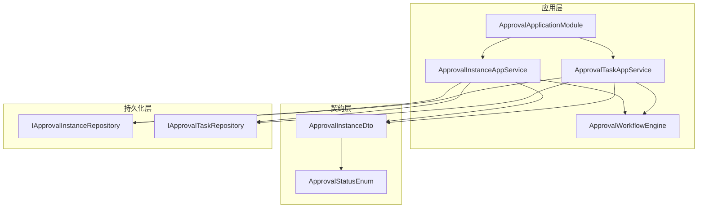
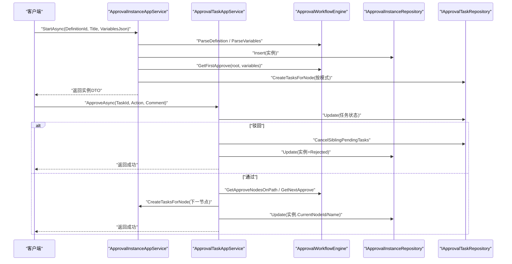
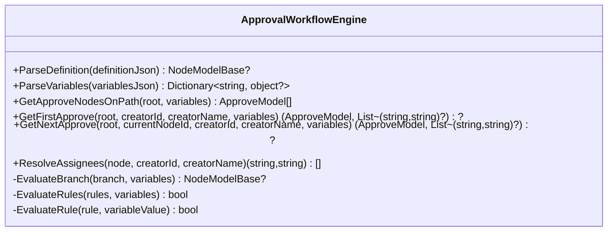
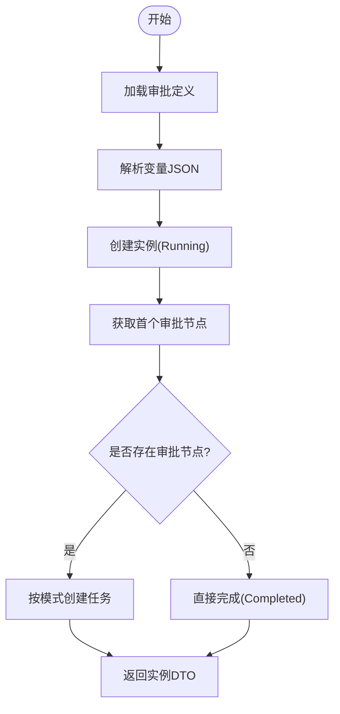
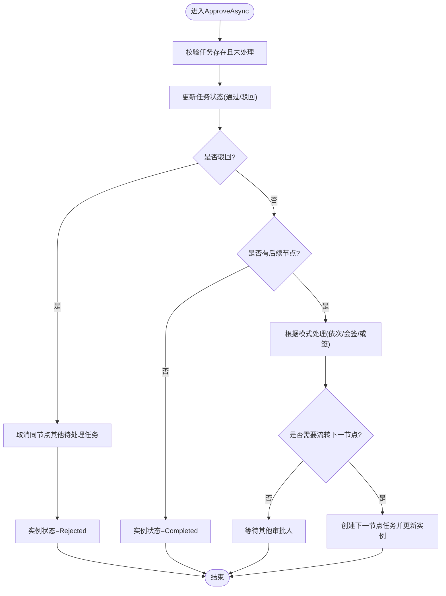
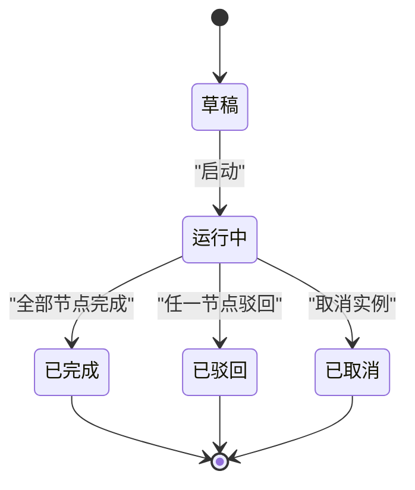
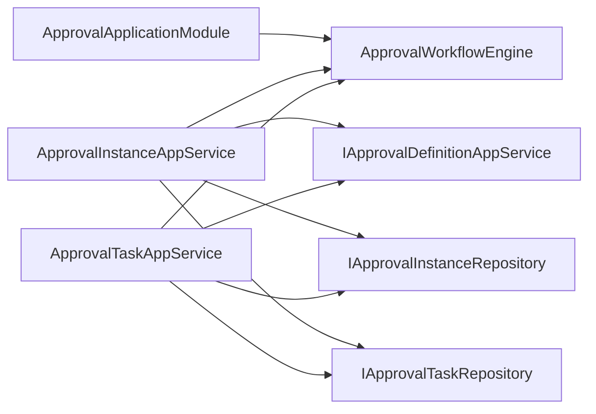

# 审批执行

<cite>
**本文引用的文件**   
- [ApprovalApplicationModule.cs](file://src/Services/Approval/H.Approval.Application/ApprovalApplicationModule.cs)
- [ApprovalWorkflowEngine.cs](file://src/Services/Approval/H.Approval.Application/Services/ApprovalWorkflowEngine.cs)
- [ApprovalInstanceAppService.cs](file://src/Services/Approval/H.Approval.Application/Services/ApprovalInstanceAppService.cs)
- [ApprovalTaskAppService.cs](file://src/Services/Approval/H.Approval.Application/Services/ApprovalTaskAppService.cs)
- [ApprovalStatusEnum.cs](file://src/Services/Approval/H.Approval.Application.Contracts/Enums/ApprovalStatusEnum.cs)
- [ApprovalInstanceDto.cs](file://src/Services/Approval/H.Approval.Application.Contracts/Dtos/ApprovalInstanceDto.cs)
</cite>

## 目录
1. [简介](#简介)
2. [项目结构](#项目结构)
3. [核心组件](#核心组件)
4. [架构总览](#架构总览)
5. [详细组件分析](#详细组件分析)
6. [依赖关系分析](#依赖关系分析)
7. [性能考虑](#性能考虑)
8. [故障排查指南](#故障排查指南)
9. [结论](#结论)
10. [附录：API 接口与客户端集成示例](#附录api-接口与客户端集成示例)

## 简介
本文件围绕“审批执行”能力，系统化阐述审批流程的启动、执行、完成等生命周期管理；说明任务分配策略、处理流程与结果反馈机制；解释状态变更规则、回滚机制与异常处理；并提供 API 接口文档与客户端集成要点。该功能基于自包含的审批工作流引擎，直接解析设计器产出的节点树 JSON，支持依次/会签/或签、抄送跳过、条件分支求值与结束节点。

## 项目结构
审批执行相关代码位于 Services/Approval 模块，采用 ABP 模块化分层：
- Application 层：应用服务（实例、任务）、工作流引擎、模块装配
- Contracts 层：DTO、枚举、服务契约
- EntityFrameworkCore 层：实体与仓储（由仓储抽象被应用服务使用）

图表来源 
- [ApprovalApplicationModule.cs:1-38](file://src/Services/Approval/H.Approval.Application/ApprovalApplicationModule.cs#L1-L38)
- [ApprovalInstanceAppService.cs:1-249](file://src/Services/Approval/H.Approval.Application/Services/ApprovalInstanceAppService.cs#L1-L249)
- [ApprovalTaskAppService.cs:1-281](file://src/Services/Approval/H.Approval.Application/Services/ApprovalTaskAppService.cs#L1-L281)
- [ApprovalWorkflowEngine.cs:1-259](file://src/Services/Approval/H.Approval.Application/Services/ApprovalWorkflowEngine.cs#L1-L259)
- [ApprovalInstanceDto.cs:1-96](file://src/Services/Approval/H.Approval.Application.Contracts/Dtos/ApprovalInstanceDto.cs#L1-L96)
- [ApprovalStatusEnum.cs:1-33](file://src/Services/Approval/H.Approval.Application.Contracts/Enums/ApprovalStatusEnum.cs#L1-L33)

章节来源
- [ApprovalApplicationModule.cs:1-38](file://src/Services/Approval/H.Approval.Application/ApprovalApplicationModule.cs#L1-L38)

## 核心组件
- 审批工作流引擎 ApprovalWorkflowEngine
  - 负责解析定义 JSON、变量字典、按路径收集审批节点、条件分支求值、审批人解析、获取首/下一节点等。
- 审批实例应用服务 ApprovalInstanceAppService
  - 负责启动实例、创建当前节点任务、查询实例详情、取消实例等。
- 审批任务应用服务 ApprovalTaskAppService
  - 负责待办/已办查询、审批通过/驳回、根据模式推进流程、流转下一节点。
- 数据契约与状态
  - ApprovalInstanceDto、StartApprovalInstanceDto、ApprovalStatusEnum 等。

章节来源
- [ApprovalWorkflowEngine.cs:1-259](file://src/Services/Approval/H.Approval.Application/Services/ApprovalWorkflowEngine.cs#L1-L259)
- [ApprovalInstanceAppService.cs:1-249](file://src/Services/Approval/H.Approval.Application/Services/ApprovalInstanceAppService.cs#L1-L249)
- [ApprovalTaskAppService.cs:1-281](file://src/Services/Approval/H.Approval.Application/Services/ApprovalTaskAppService.cs#L1-L281)
- [ApprovalInstanceDto.cs:1-96](file://src/Services/Approval/H.Approval.Application.Contracts/Dtos/ApprovalInstanceDto.cs#L1-L96)
- [ApprovalStatusEnum.cs:1-33](file://src/Services/Approval/H.Approval.Application.Contracts/Enums/ApprovalStatusEnum.cs#L1-L33)

## 架构总览
审批执行的核心调用链如下：
- 启动：客户端调用实例服务 StartAsync → 解析定义与变量 → 创建实例 → 定位首节点 → 按模式创建任务
- 执行：客户端调用任务服务 ApproveAsync → 更新任务状态 → 根据模式推进 → 可能创建下一节点任务或直接结束
- 完成/驳回：根据业务规则设置实例状态并落库

图表来源 
- [ApprovalInstanceAppService.cs:38-94](file://src/Services/Approval/H.Approval.Application/Services/ApprovalInstanceAppService.cs#L38-L94)
- [ApprovalTaskAppService.cs:66-143](file://src/Services/Approval/H.Approval.Application/Services/ApprovalTaskAppService.cs#L66-L143)
- [ApprovalWorkflowEngine.cs:25-70](file://src/Services/Approval/H.Approval.Application/Services/ApprovalWorkflowEngine.cs#L25-L70)

## 详细组件分析

### 审批工作流引擎 ApprovalWorkflowEngine
职责与关键点：
- 解析定义与变量：将设计器输出的 JSON 解析为节点树与变量字典
- 路径遍历与节点收集：按 Start→Approve→CarbonCopy→Condition/Branch 的规则收集实际审批节点
- 条件分支求值：多规则 AND 语义，支持等于、不等于、大小比较、包含等操作符
- 审批人解析：指定成员/发起人自选/角色/部门主管等类型，空集合时回退到发起人
- 首/下一节点：用于启动与流转

图表来源 
- [ApprovalWorkflowEngine.cs:1-259](file://src/Services/Approval/H.Approval.Application/Services/ApprovalWorkflowEngine.cs#L1-L259)

章节来源
- [ApprovalWorkflowEngine.cs:1-259](file://src/Services/Approval/H.Approval.Application/Services/ApprovalWorkflowEngine.cs#L1-L259)

### 审批实例应用服务 ApprovalInstanceAppService
职责与关键点：
- 启动流程：校验定义、解析变量、创建实例、定位首节点、按模式创建任务
- 查询与取消：按发起人查询、按 ID 查询详情（含任务列表）、取消实例并标记任务
- 任务创建：支持依次/会签/或签三种模式的任务生成

图表来源 
- [ApprovalInstanceAppService.cs:38-94](file://src/Services/Approval/H.Approval.Application/Services/ApprovalInstanceAppService.cs#L38-L94)

章节来源
- [ApprovalInstanceAppService.cs:1-249](file://src/Services/Approval/H.Approval.Application/Services/ApprovalInstanceAppService.cs#L1-L249)

### 审批任务应用服务 ApprovalTaskAppService
职责与关键点：
- 待办/已办查询：按当前用户过滤
- 审批处理：通过/驳回，状态校验防重入
- 模式推进：
  - 依次审批：创建下一个审批人的任务，不立即流转
  - 会签：等待所有审批人处理完毕再流转
  - 或签：一人通过即取消其他待处理任务并流转
- 流转下一节点：若无下一节点则完成实例

图表来源 
- [ApprovalTaskAppService.cs:66-143](file://src/Services/Approval/H.Approval.Application/Services/ApprovalTaskAppService.cs#L66-L143)
- [ApprovalTaskAppService.cs:148-194](file://src/Services/Approval/H.Approval.Application/Services/ApprovalTaskAppService.cs#L148-L194)
- [ApprovalTaskAppService.cs:218-250](file://src/Services/Approval/H.Approval.Application/Services/ApprovalTaskAppService.cs#L218-L250)

章节来源
- [ApprovalTaskAppService.cs:1-281](file://src/Services/Approval/H.Approval.Application/Services/ApprovalTaskAppService.cs#L1-L281)

### 状态机与变更规则
- 实例状态 ApprovalStatusEnum：草稿、运行中、已完成、已取消、已驳回
- 变更规则：
  - 启动后为运行中；无审批节点时直接完成
  - 驳回后为已驳回；取消后为已取消
  - 正常流转完成后为已完成

图表来源 
- [ApprovalStatusEnum.cs:1-33](file://src/Services/Approval/H.Approval.Application.Contracts/Enums/ApprovalStatusEnum.cs#L1-L33)
- [ApprovalInstanceAppService.cs:38-94](file://src/Services/Approval/H.Approval.Application/Services/ApprovalInstanceAppService.cs#L38-L94)
- [ApprovalTaskAppService.cs:66-143](file://src/Services/Approval/H.Approval.Application/Services/ApprovalTaskAppService.cs#L66-L143)

章节来源
- [ApprovalStatusEnum.cs:1-33](file://src/Services/Approval/H.Approval.Application.Contracts/Enums/ApprovalStatusEnum.cs#L1-L33)

## 依赖关系分析
- 模块装配：ApprovalApplicationModule 注册 Elsa 工作流管理与运行时（SQL Server），并注入 ApprovalWorkflowEngine
- 应用服务依赖：
  - 实例服务依赖定义服务、实例仓储、任务仓储、工作流引擎、HTTP 上下文访问器
  - 任务服务依赖任务仓储、实例仓储、定义服务、工作流引擎、实例服务、HTTP 上下文访问器

图表来源 
- [ApprovalApplicationModule.cs:1-38](file://src/Services/Approval/H.Approval.Application/ApprovalApplicationModule.cs#L1-L38)
- [ApprovalInstanceAppService.cs:1-36](file://src/Services/Approval/H.Approval.Application/Services/ApprovalInstanceAppService.cs#L1-L36)
- [ApprovalTaskAppService.cs:1-39](file://src/Services/Approval/H.Approval.Application/Services/ApprovalTaskAppService.cs#L1-L39)

章节来源
- [ApprovalApplicationModule.cs:1-38](file://src/Services/Approval/H.Approval.Application/ApprovalApplicationModule.cs#L1-L38)

## 性能考虑
- 条件分支求值为 O(n) 规则评估，建议控制规则数量与复杂度
- 变量 JSON 解析在启动与流转时均会执行，建议复用或缓存热点变量的解析结果
- 批量更新任务（如或签取消）使用范围更新减少 IO 次数
- 日志记录适度，避免高频写入影响吞吐

[本节为通用指导，无需源码引用]

## 故障排查指南
常见问题与定位方法：
- 启动失败（定义为空）：检查 DefinitionId 对应的定义 JSON 是否为空或格式错误
- 无审批节点直接完成：确认定义中是否存在 Approve 节点
- 重复操作异常：确保任务状态为待处理才允许审批
- 条件分支未命中：检查变量键名与数据类型是否与规则匹配
- 任务未流转：核对审批模式逻辑（依次/会签/或签）是否符合预期

章节来源
- [ApprovalInstanceAppService.cs:38-94](file://src/Services/Approval/H.Approval.Application/Services/ApprovalInstanceAppService.cs#L38-L94)
- [ApprovalTaskAppService.cs:66-143](file://src/Services/Approval/H.Approval.Application/Services/ApprovalTaskAppService.cs#L66-L143)

## 结论
审批执行以轻量自包含引擎为核心，结合 ABP 应用服务与仓储抽象，实现了从启动、分配到流转、完成的完整闭环。通过清晰的模式支持与条件求值，满足常见审批场景。建议在复杂规则与高并发场景下引入缓存与异步优化，并完善审计与告警能力。

[本节为总结性内容，无需源码引用]

## 附录：API 接口与客户端集成示例

### 接口概览（应用服务方法）
- 实例服务
  - StartAsync(StartApprovalInstanceDto): 启动审批实例
  - GetMyApprovalsAsync(): 获取我发起的审批
  - GetByIdAsync(id): 获取实例详情（含任务列表）
  - CancelAsync(id): 取消实例
- 任务服务
  - GetPendingTasksAsync(): 获取待审批任务
  - GetCompletedTasksAsync(): 获取已审批任务
  - GetByInstanceIdAsync(instanceId): 获取实例任务历史
  - ApproveAsync(ApprovalTaskActionDto): 审批通过/驳回

章节来源
- [ApprovalInstanceAppService.cs:38-94](file://src/Services/Approval/H.Approval.Application/Services/ApprovalInstanceAppService.cs#L38-L94)
- [ApprovalInstanceAppService.cs:149-172](file://src/Services/Approval/H.Approval.Application/Services/ApprovalInstanceAppService.cs#L149-L172)
- [ApprovalInstanceAppService.cs:174-199](file://src/Services/Approval/H.Approval.Application/Services/ApprovalInstanceAppService.cs#L174-L199)
- [ApprovalTaskAppService.cs:41-64](file://src/Services/Approval/H.Approval.Application/Services/ApprovalTaskAppService.cs#L41-L64)
- [ApprovalTaskAppService.cs:66-143](file://src/Services/Approval/H.Approval.Application/Services/ApprovalTaskAppService.cs#L66-L143)

### DTO 与状态
- StartApprovalInstanceDto：包含 DefinitionId、Title、VariablesJson
- ApprovalInstanceDto：包含实例基本信息、当前节点、变量 JSON、任务列表、时间戳
- ApprovalStatusEnum：Draft/Running/Completed/Cancelled/Rejected

章节来源
- [ApprovalInstanceDto.cs:1-96](file://src/Services/Approval/H.Approval.Application.Contracts/Dtos/ApprovalInstanceDto.cs#L1-L96)
- [ApprovalStatusEnum.cs:1-33](file://src/Services/Approval/H.Approval.Application.Contracts/Enums/ApprovalStatusEnum.cs#L1-L33)

### 客户端集成要点
- 认证与上下文：通过 IHttpContextAccessor 获取当前用户标识与姓名
- 变量传递：VariablesJson 需与设计器定义的字段一致，供条件分支求值
- 幂等与重试：对 ApproveAsync 增加幂等保护（服务端已做状态校验）
- 前端展示：根据任务状态与实例状态渲染不同 UI 元素

章节来源
- [ApprovalInstanceAppService.cs:201-209](file://src/Services/Approval/H.Approval.Application/Services/ApprovalInstanceAppService.cs#L201-L209)
- [ApprovalTaskAppService.cs:252-260](file://src/Services/Approval/H.Approval.Application/Services/ApprovalTaskAppService.cs#L252-L260)