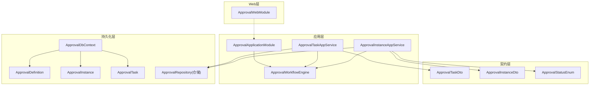
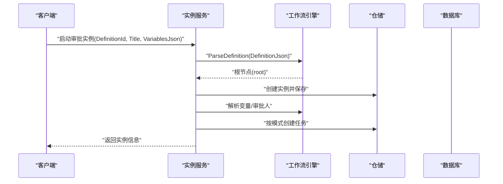
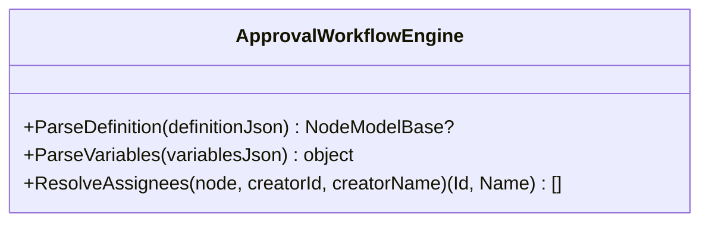
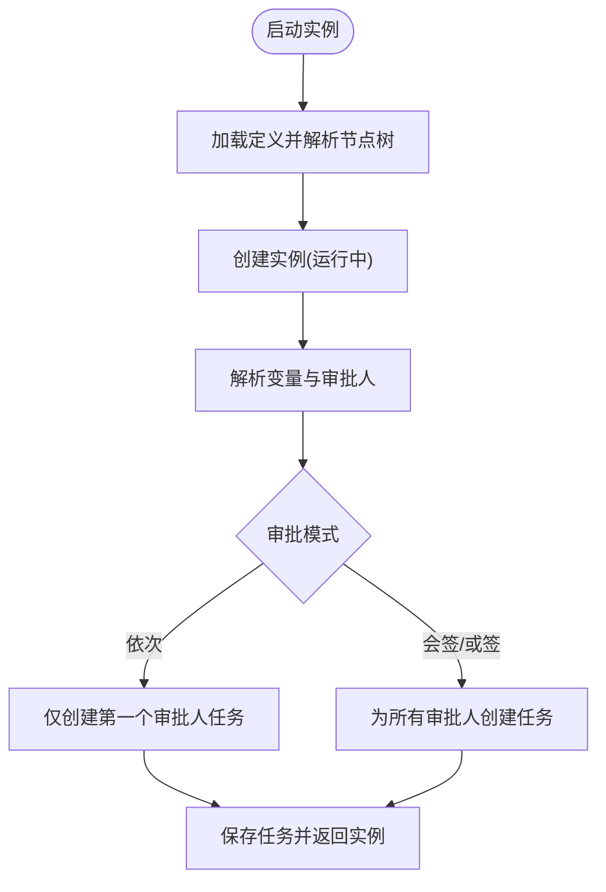
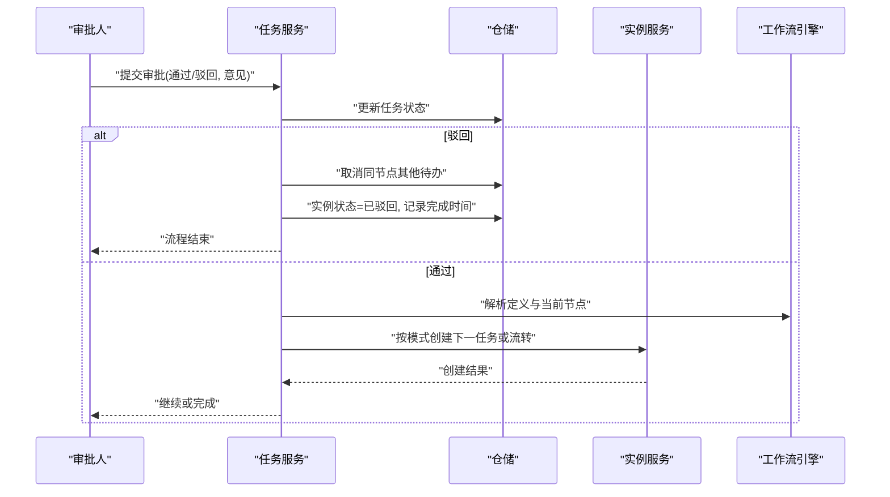
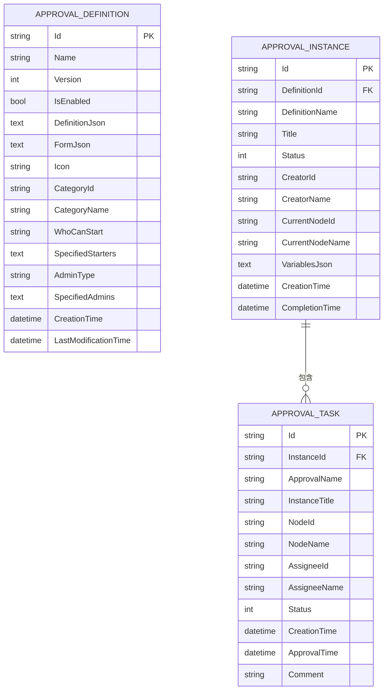
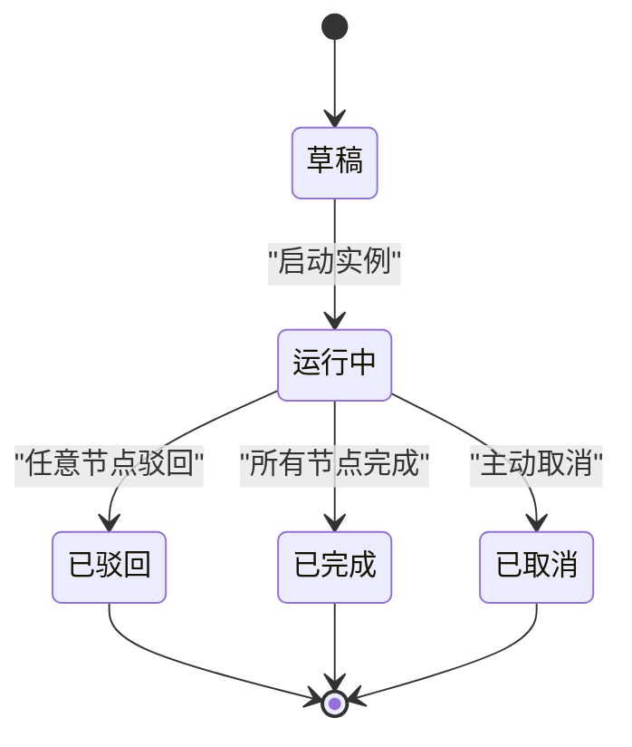
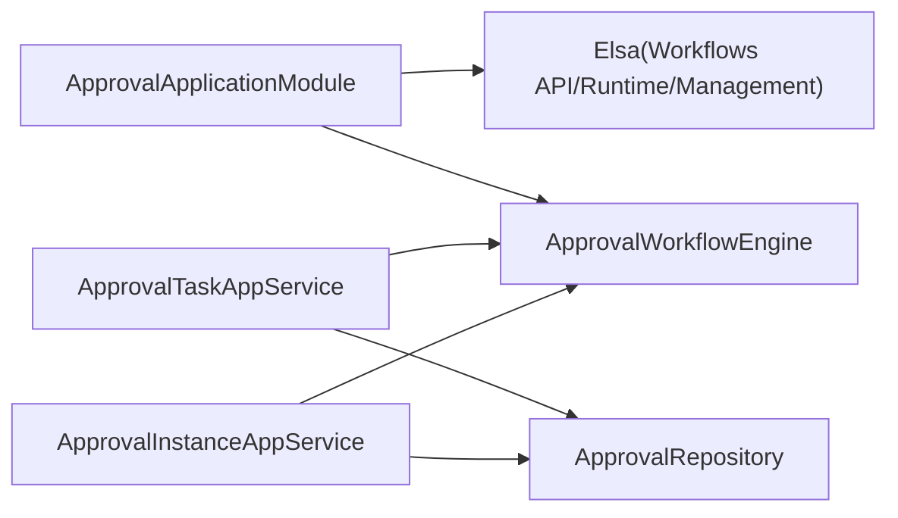

# 审批流程服务

<cite>
**本文引用的文件**
- [ApprovalApplicationModule.cs](file://src/Services/Approval/H.Approval.Application/ApprovalApplicationModule.cs)
- [ApprovalDbContext.cs](file://src/Services/Approval/H.Approval.EntityFrameworkCore/ApprovalDbContext.cs)
- [ApprovalTask.cs](file://src/Services/Approval/H.Approval.EntityFrameworkCore/Entities/ApprovalTask.cs)
- [ApprovalInstance.cs](file://src/Services/Approval/H.Approval.EntityFrameworkCore/Entities/ApprovalInstance.cs)
- [ApprovalDefinition.cs](file://src/Services/Approval/H.Approval.EntityFrameworkCore/Entities/ApprovalDefinition.cs)
- [ApprovalRepository.cs](file://src/Services/Approval/H.Approval.EntityFrameworkCore/Repositories/ApprovalRepository.cs)
- [ApprovalTaskDto.cs](file://src/Services/Approval/H.Approval.Application.Contracts/Dtos/ApprovalTaskDto.cs)
- [ApprovalInstanceDto.cs](file://src/Services/Approval/H.Approval.Application.Contracts/Dtos/ApprovalInstanceDto.cs)
- [ApprovalStatusEnum.cs](file://src/Services/Approval/H.Approval.Application.Contracts/Enums/ApprovalStatusEnum.cs)
- [ApprovalWorkflowEngine.cs](file://src/Services/Approval/H.Approval.Application/Services/ApprovalWorkflowEngine.cs)
- [ApprovalTaskAppService.cs](file://src/Services/Approval/H.Approval.Application/Services/ApprovalTaskAppService.cs)
- [ApprovalInstanceAppService.cs](file://src/Services/Approval/H.Approval.Application/Services/ApprovalInstanceAppService.cs)
- [ApprovalWebModule.cs](file://src/Services/Approval/H.Approval.Web/ApprovalWebModule.cs)
</cite>

## 目录
1. [简介](#简介)
2. [项目结构](#项目结构)
3. [核心组件](#核心组件)
4. [架构总览](#架构总览)
5. [详细组件分析](#详细组件分析)
6. [依赖关系分析](#依赖关系分析)
7. [性能考虑](#性能考虑)
8. [故障排查指南](#故障排查指南)
9. [结论](#结论)
10. [附录](#附录)

## 简介
本文件为 AppLab 审批流程服务的完整技术文档，覆盖工作流引擎、审批模板设计、流程实例管理、任务处理等核心能力。重点说明审批节点类型（开始、审批、条件分支、抄送、结束等）、流转规则、表单设计器集成、状态机、任务分配策略与超时处理机制，并提供 API 接口说明与设计器使用指南，以及复杂场景示例与性能优化建议。

## 项目结构
审批模块采用 ABP 模块化分层：
- Application 层：应用服务、工作流引擎、DTO、枚举
- EntityFrameworkCore 层：实体、仓储、DbContext
- Web 层：Web 模块标记类（用于程序集定位）
- Contracts 层：对外契约（DTO、枚举、服务接口）

图表来源
- [ApprovalApplicationModule.cs:1-38](file://src/Services/Approval/H.Approval.Application/ApprovalApplicationModule.cs#L1-L38)
- [ApprovalDbContext.cs:1-98](file://src/Services/Approval/H.Approval.EntityFrameworkCore/ApprovalDbContext.cs#L1-L98)
- [ApprovalTask.cs:1-56](file://src/Services/Approval/H.Approval.EntityFrameworkCore/Entities/ApprovalTask.cs#L1-L56)
- [ApprovalInstance.cs:1-62](file://src/Services/Approval/H.Approval.EntityFrameworkCore/Entities/ApprovalInstance.cs#L1-L62)
- [ApprovalDefinition.cs:1-69](file://src/Services/Approval/H.Approval.EntityFrameworkCore/Entities/ApprovalDefinition.cs#L1-L69)
- [ApprovalRepository.cs:87-130](file://src/Services/Approval/H.Approval.EntityFrameworkCore/Repositories/ApprovalRepository.cs#L87-L130)
- [ApprovalTaskDto.cs:1-56](file://src/Services/Approval/H.Approval.Application.Contracts/Dtos/ApprovalTaskDto.cs#L1-L56)
- [ApprovalInstanceDto.cs:1-96](file://src/Services/Approval/H.Approval.Application.Contracts/Dtos/ApprovalInstanceDto.cs#L1-L96)
- [ApprovalStatusEnum.cs:1-33](file://src/Services/Approval/H.Approval.Application.Contracts/Enums/ApprovalStatusEnum.cs#L1-L33)
- [ApprovalWorkflowEngine.cs:1-30](file://src/Services/Approval/H.Approval.Application/Services/ApprovalWorkflowEngine.cs#L1-L30)
- [ApprovalTaskAppService.cs:23-280](file://src/Services/Approval/H.Approval.Application/Services/ApprovalTaskAppService.cs#L23-L280)
- [ApprovalInstanceAppService.cs:38-248](file://src/Services/Approval/H.Approval.Application/Services/ApprovalInstanceAppService.cs#L38-L248)
- [ApprovalWebModule.cs:1-9](file://src/Services/Approval/H.Approval.Web/ApprovalWebModule.cs#L1-L9)

章节来源
- [ApprovalApplicationModule.cs:1-38](file://src/Services/Approval/H.Approval.Application/ApprovalApplicationModule.cs#L1-L38)
- [ApprovalDbContext.cs:1-98](file://src/Services/Approval/H.Approval.EntityFrameworkCore/ApprovalDbContext.cs#L1-L98)

## 核心组件
- 工作流引擎 ApprovalWorkflowEngine：解析定义 JSON、计算变量、解析审批人、驱动流转
- 实例服务 ApprovalInstanceAppService：启动实例、按模式创建任务、映射 DTO
- 任务服务 ApprovalTaskAppService：查询待办/已办、执行审批动作、推进或终止流程
- 数据模型：定义 Definition、实例 Instance、任务 Task 三表及仓储
- 契约：DTO 与状态枚举，统一对外数据结构

章节来源
- [ApprovalWorkflowEngine.cs:1-30](file://src/Services/Approval/H.Approval.Application/Services/ApprovalWorkflowEngine.cs#L1-L30)
- [ApprovalInstanceAppService.cs:38-248](file://src/Services/Approval/H.Approval.Application/Services/ApprovalInstanceAppService.cs#L38-L248)
- [ApprovalTaskAppService.cs:23-280](file://src/Services/Approval/H.Approval.Application/Services/ApprovalTaskAppService.cs#L23-L280)
- [ApprovalDefinition.cs:1-69](file://src/Services/Approval/H.Approval.EntityFrameworkCore/Entities/ApprovalDefinition.cs#L1-L69)
- [ApprovalInstance.cs:1-62](file://src/Services/Approval/H.Approval.EntityFrameworkCore/Entities/ApprovalInstance.cs#L1-L62)
- [ApprovalTask.cs:1-56](file://src/Services/Approval/H.Approval.EntityFrameworkCore/Entities/ApprovalTask.cs#L1-L56)
- [ApprovalTaskDto.cs:1-56](file://src/Services/Approval/H.Approval.Application.Contracts/Dtos/ApprovalTaskDto.cs#L1-L56)
- [ApprovalInstanceDto.cs:1-96](file://src/Services/Approval/H.Approval.Application.Contracts/Dtos/ApprovalInstanceDto.cs#L1-L96)
- [ApprovalStatusEnum.cs:1-33](file://src/Services/Approval/H.Approval.Application.Contracts/Enums/ApprovalStatusEnum.cs#L1-L33)

## 架构总览
系统以“定义-实例-任务”为核心，结合自包含工作流引擎解释设计器产出的节点树 JSON，实现灵活的审批编排。Elsa 基础设施在应用模块中注册，但审批流程由自定义引擎驱动，便于轻量扩展。

图表来源
- [ApprovalInstanceAppService.cs:38-94](file://src/Services/Approval/H.Approval.Application/Services/ApprovalInstanceAppService.cs#L38-L94)
- [ApprovalWorkflowEngine.cs:22-30](file://src/Services/Approval/H.Approval.Application/Services/ApprovalWorkflowEngine.cs#L22-L30)
- [ApprovalRepository.cs:87-130](file://src/Services/Approval/H.Approval.EntityFrameworkCore/Repositories/ApprovalRepository.cs#L87-L130)

章节来源
- [ApprovalInstanceAppService.cs:38-94](file://src/Services/Approval/H.Approval.Application/Services/ApprovalInstanceAppService.cs#L38-L94)
- [ApprovalWorkflowEngine.cs:22-30](file://src/Services/Approval/H.Approval.Application/Services/ApprovalWorkflowEngine.cs#L22-L30)

## 详细组件分析

### 工作流引擎 ApprovalWorkflowEngine
- 职责：解析定义 JSON、计算变量、解析审批人、辅助流转决策
- 关键方法：
  - ParseDefinition：将定义 JSON 反序列化为节点树
  - ParseVariables：解析实例变量 JSON
  - ResolveAssignees：根据节点配置与发起人信息解析审批人列表
- 支持节点类型：开始、审批（依次/会签/或签）、抄送（跳过）、条件分支（规则求值）、结束

图表来源
- [ApprovalWorkflowEngine.cs:1-30](file://src/Services/Approval/H.Approval.Application/Services/ApprovalWorkflowEngine.cs#L1-L30)

章节来源
- [ApprovalWorkflowEngine.cs:1-30](file://src/Services/Approval/H.Approval.Application/Services/ApprovalWorkflowEngine.cs#L1-L30)

### 实例服务 ApprovalInstanceAppService
- 职责：启动实例、按审批模式创建任务、DTO 映射
- 关键逻辑：
  - StartAsync：校验定义、解析节点树、创建实例、按模式创建首个任务
  - CreateTasksForNodeAsync：根据依次/会签/或签模式批量或单条创建任务
  - MapToDto / MapTaskToDto：实体到 DTO 的转换

图表来源
- [ApprovalInstanceAppService.cs:38-124](file://src/Services/Approval/H.Approval.Application/Services/ApprovalInstanceAppService.cs#L38-L124)

章节来源
- [ApprovalInstanceAppService.cs:38-124](file://src/Services/Approval/H.Approval.Application/Services/ApprovalInstanceAppService.cs#L38-L124)

### 任务服务 ApprovalTaskAppService
- 职责：待办/已办查询、执行审批动作、推进或终止流程
- 关键逻辑：
  - ApproveAsync：更新任务状态、驳回则取消同节点其他待办并结束实例；通过则按模式推进
  - HandleApprovalMode：依次审批时创建下一个审批人任务；会签/或签统计完成比例后决定是否流转
  - CancelSiblingPendingTasks：取消同节点其他待办任务（驳回场景）

图表来源
- [ApprovalTaskAppService.cs:66-170](file://src/Services/Approval/H.Approval.Application/Services/ApprovalTaskAppService.cs#L66-L170)
- [ApprovalInstanceAppService.cs:99-124](file://src/Services/Approval/H.Approval.Application/Services/ApprovalInstanceAppService.cs#L99-L124)

章节来源
- [ApprovalTaskAppService.cs:66-170](file://src/Services/Approval/H.Approval.Application/Services/ApprovalTaskAppService.cs#L66-L170)
- [ApprovalInstanceAppService.cs:99-124](file://src/Services/Approval/H.Approval.Application/Services/ApprovalInstanceAppService.cs#L99-L124)

### 数据模型与仓储
- 实体：
  - ApprovalDefinition：定义名称、版本、启用标志、定义 JSON、表单 JSON、图标、分组、发起权限、管理员配置
  - ApprovalInstance：关联定义、标题、状态、发起人、当前节点、变量 JSON、时间戳、任务集合
  - ApprovalTask：关联实例、节点、审批人、状态、时间戳、意见
- 仓储：提供插入、更新、按条件查询（待办/已办、按实例/节点/审批人）

图表来源
- [ApprovalDefinition.cs:1-69](file://src/Services/Approval/H.Approval.EntityFrameworkCore/Entities/ApprovalDefinition.cs#L1-L69)
- [ApprovalInstance.cs:1-62](file://src/Services/Approval/H.Approval.EntityFrameworkCore/Entities/ApprovalInstance.cs#L1-L62)
- [ApprovalTask.cs:1-56](file://src/Services/Approval/H.Approval.EntityFrameworkCore/Entities/ApprovalTask.cs#L1-L56)
- [ApprovalDbContext.cs:33-96](file://src/Services/Approval/H.Approval.EntityFrameworkCore/ApprovalDbContext.cs#L33-L96)

章节来源
- [ApprovalDefinition.cs:1-69](file://src/Services/Approval/H.Approval.EntityFrameworkCore/Entities/ApprovalDefinition.cs#L1-L69)
- [ApprovalInstance.cs:1-62](file://src/Services/Approval/H.Approval.EntityFrameworkCore/Entities/ApprovalInstance.cs#L1-L62)
- [ApprovalTask.cs:1-56](file://src/Services/Approval/H.Approval.EntityFrameworkCore/Entities/ApprovalTask.cs#L1-L56)
- [ApprovalDbContext.cs:33-96](file://src/Services/Approval/H.Approval.EntityFrameworkCore/ApprovalDbContext.cs#L33-L96)
- [ApprovalRepository.cs:87-130](file://src/Services/Approval/H.Approval.EntityFrameworkCore/Repositories/ApprovalRepository.cs#L87-L130)

### 状态机与流转规则
- 实例状态：草稿、运行中、已完成、已取消、已驳回
- 任务状态：待审批、已通过、已驳回、已取消
- 流转规则：
  - 依次审批：按顺序逐个审批，最后一个通过后进入下一节点
  - 会签：所有审批人都需通过才进入下一节点
  - 或签：任一审批人通过即进入下一节点
  - 驳回：取消同节点其他待办，实例直接结束并标记已驳回
  - 抄送：不阻塞流程，仅通知相关人员
  - 条件分支：基于变量 JSON 求值决定分支路径

图表来源
- [ApprovalStatusEnum.cs:1-33](file://src/Services/Approval/H.Approval.Application.Contracts/Enums/ApprovalStatusEnum.cs#L1-L33)
- [ApprovalTaskAppService.cs:97-119](file://src/Services/Approval/H.Approval.Application/Services/ApprovalTaskAppService.cs#L97-L119)

章节来源
- [ApprovalStatusEnum.cs:1-33](file://src/Services/Approval/H.Approval.Application.Contracts/Enums/ApprovalStatusEnum.cs#L1-L33)
- [ApprovalTaskAppService.cs:97-119](file://src/Services/Approval/H.Approval.Application/Services/ApprovalTaskAppService.cs#L97-L119)

### 表单设计器与模板
- 定义实体包含 FormJson 字段，用于存储表单 Schema
- 设计器产出 DefinitionJson（节点树）与 FormJson（表单字段），两者共同驱动渲染与流程执行
- 启动实例时可传入 VariablesJson，作为条件分支与动态审批人的输入

章节来源
- [ApprovalDefinition.cs:36-40](file://src/Services/Approval/H.Approval.EntityFrameworkCore/Entities/ApprovalDefinition.cs#L36-L40)
- [ApprovalInstanceDto.cs:55-58](file://src/Services/Approval/H.Approval.Application.Contracts/Dtos/ApprovalInstanceDto.cs#L55-L58)

## 依赖关系分析
- 应用模块注册 Elsa 工作流管理与运行时（EF Core + SQL Server），同时注入自定义 ApprovalWorkflowEngine
- 应用服务依赖仓储访问数据，依赖工作流引擎解析定义与变量
- Web 模块用于程序集定位，便于 ABP 自动发现

图表来源
- [ApprovalApplicationModule.cs:23-36](file://src/Services/Approval/H.Approval.Application/ApprovalApplicationModule.cs#L23-L36)
- [ApprovalTaskAppService.cs:23-39](file://src/Services/Approval/H.Approval.Application/Services/ApprovalTaskAppService.cs#L23-L39)
- [ApprovalInstanceAppService.cs:38-55](file://src/Services/Approval/H.Approval.Application/Services/ApprovalInstanceAppService.cs#L38-L55)
- [ApprovalRepository.cs:103-130](file://src/Services/Approval/H.Approval.EntityFrameworkCore/Repositories/ApprovalRepository.cs#L103-L130)

章节来源
- [ApprovalApplicationModule.cs:23-36](file://src/Services/Approval/H.Approval.Application/ApprovalApplicationModule.cs#L23-L36)

## 性能考虑
- 索引优化：任务表对 AssigneeId、InstanceId、NodeId、Status 建立索引，提升待办/已办查询效率
- 批量操作：会签/或签模式下批量创建任务，减少往返次数
- 异步 I/O：仓储与数据库操作均使用异步方法，避免阻塞
- 缓存建议：对高频读取的定义 JSON 可引入内存缓存（如 IMemoryCache），降低序列化开销
- 分页与过滤：对外查询应支持分页与多条件过滤，避免一次性拉取大量数据
- 事务边界：启动实例与创建任务应在同一事务内，保证一致性

[本节为通用指导，无需特定文件引用]

## 故障排查指南
- 常见错误：
  - 任务不存在：检查任务 ID 是否正确、是否已被处理
  - 重复操作：任务状态非待审批时不应再次审批
  - 实例不存在：任务对应的实例被删除或未正确创建
  - 定义为空：DefinitionJson 为空或格式不正确导致无法解析
- 日志定位：
  - 启动实例与审批动作均有日志输出，关注 UserId、InstanceId、TaskId、Action 等关键字段
- 数据一致性：
  - 驳回时需确保同节点其他待办被取消，实例状态更新与完成时间写入一致

章节来源
- [ApprovalTaskAppService.cs:66-119](file://src/Services/Approval/H.Approval.Application/Services/ApprovalTaskAppService.cs#L66-L119)

## 结论
该审批流程服务以“定义-实例-任务”为核心，结合自包含工作流引擎与 ABP 模块化架构，实现了灵活、可扩展的审批编排。通过清晰的实体模型、仓储抽象与应用服务封装，能够支撑依次/会签/或签等多种审批模式，并结合表单设计器与变量机制满足复杂业务场景。建议在高性能场景下引入缓存与事务优化，进一步提升吞吐与一致性。

[本节为总结性内容，无需特定文件引用]

## 附录

### API 接口概览
- 启动审批实例
  - 请求体：DefinitionId、Title、VariablesJson
  - 响应：ApprovalInstanceDto
- 获取待办任务
  - 响应：List<ApprovalTaskDto>
- 获取已办任务
  - 响应：List<ApprovalTaskDto>
- 获取实例历史任务
  - 参数：InstanceId
  - 响应：List<ApprovalTaskDto>
- 执行审批动作
  - 请求体：TaskId、Action（1=通过，2=驳回）、Comment
  - 行为：更新任务状态、推进或终止流程

章节来源
- [ApprovalInstanceAppService.cs:38-94](file://src/Services/Approval/H.Approval.Application/Services/ApprovalInstanceAppService.cs#L38-L94)
- [ApprovalTaskAppService.cs:41-119](file://src/Services/Approval/H.Approval.Application/Services/ApprovalTaskAppService.cs#L41-L119)
- [ApprovalTaskDto.cs:1-56](file://src/Services/Approval/H.Approval.Application.Contracts/Dtos/ApprovalTaskDto.cs#L1-L56)
- [ApprovalInstanceDto.cs:1-96](file://src/Services/Approval/H.Approval.Application.Contracts/Dtos/ApprovalInstanceDto.cs#L1-L96)

### 工作流设计器使用指南
- 节点类型：开始、审批（依次/会签/或签）、抄送、条件分支、结束
- 定义 JSON：描述节点拓扑与流转规则
- 表单 JSON：定义表单字段与校验规则
- 变量 JSON：启动实例时传入，用于条件分支与动态审批人解析
- 最佳实践：
  - 明确每个节点的审批人与审批模式
  - 合理设置条件分支表达式，避免死循环
  - 使用抄送节点进行知会，不影响主流程

[本节为概念性指导，无需特定文件引用]

### 复杂审批场景示例
- 多级部门审批：依次审批 + 条件分支（金额阈值）
- 跨部门会签：会签模式 + 条件分支（合规审核）
- 紧急通道：或签模式 + 抄送通知 + 快速结束

[本节为概念性指导，无需特定文件引用]