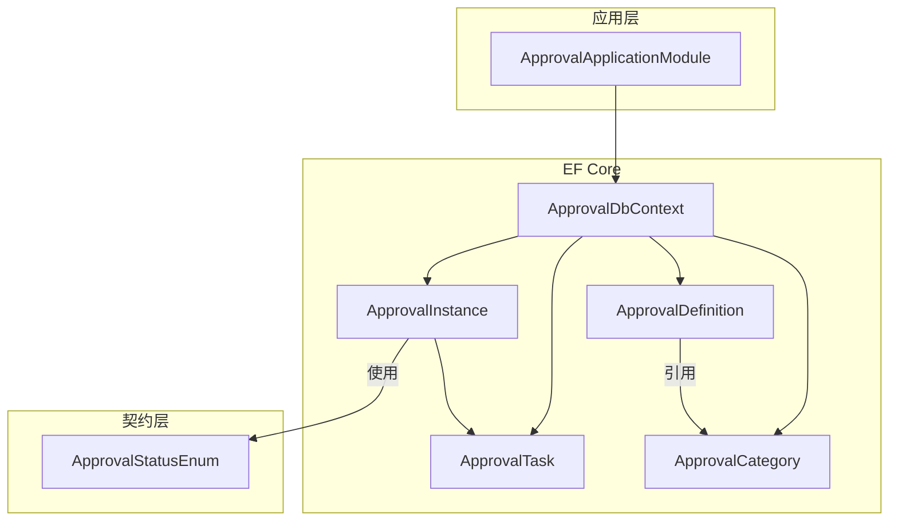
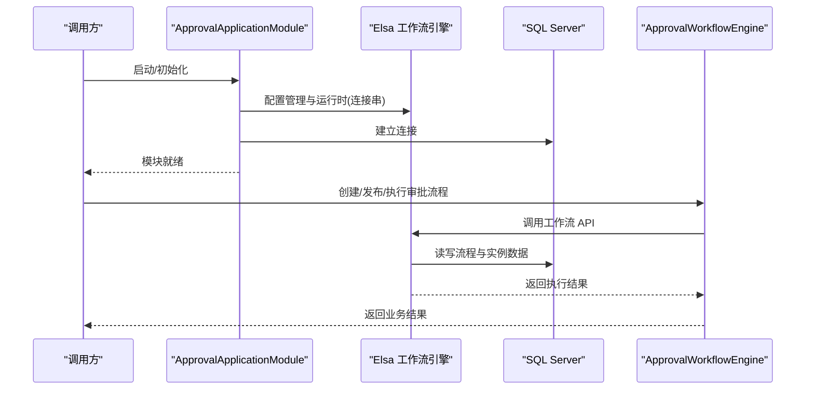
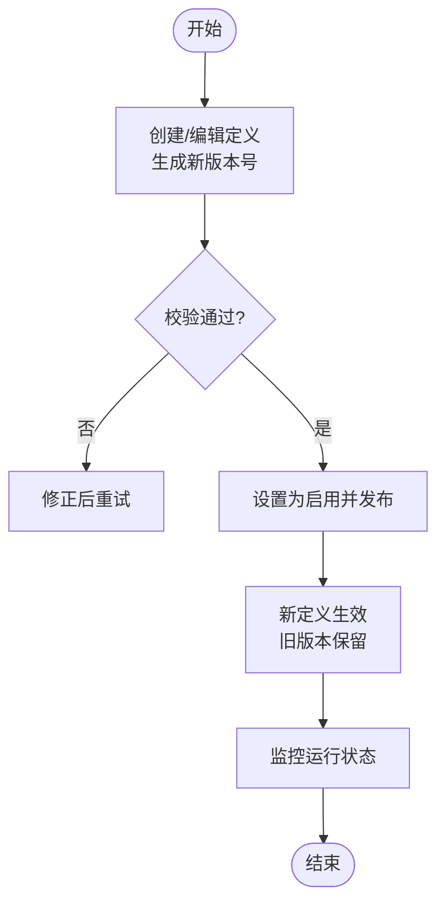
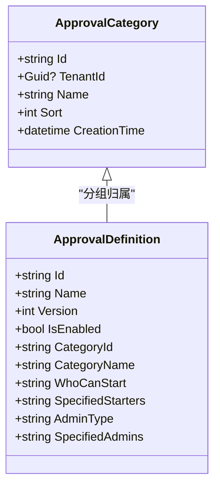
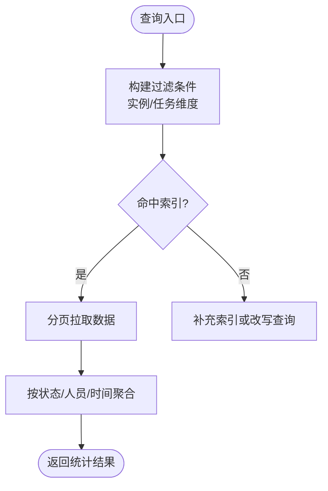
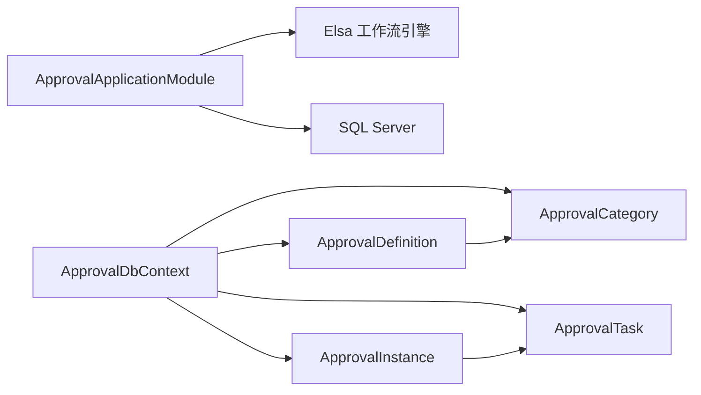

# 审批管理

<cite>
**本文引用的文件**   
- [ApprovalApplicationModule.cs](file://src/Services/Approval/H.Approval.Application/ApprovalApplicationModule.cs)
- [ApprovalDbContext.cs](file://src/Services/Approval/H.Approval.EntityFrameworkCore/ApprovalDbContext.cs)
- [ApprovalDefinition.cs](file://src/Services/Approval/H.Approval.EntityFrameworkCore/Entities/ApprovalDefinition.cs)
- [ApprovalInstance.cs](file://src/Services/Approval/H.Approval.EntityFrameworkCore/Entities/ApprovalInstance.cs)
- [ApprovalTask.cs](file://src/Services/Approval/H.Approval.EntityFrameworkCore/Entities/ApprovalTask.cs)
- [ApprovalCategory.cs](file://src/Services/Approval/H.Approval.EntityFrameworkCore/Entities/ApprovalCategory.cs)
- [ApprovalStatusEnum.cs](file://src/Services/Approval/H.Approval.Application.Contracts/Enums/ApprovalStatusEnum.cs)
</cite>

## 目录
1. [简介](#简介)
2. [项目结构](#项目结构)
3. [核心组件](#核心组件)
4. [架构总览](#架构总览)
5. [详细组件分析](#详细组件分析)
6. [依赖关系分析](#依赖关系分析)
7. [性能考虑](#性能考虑)
8. [故障排查指南](#故障排查指南)
9. [结论](#结论)
10. [附录](#附录)

## 简介
本文件围绕“审批管理”功能，系统化阐述审批定义与实例的建模、版本管理与发布流程、分类与权限控制、模板复用机制，以及实例查询统计、监控告警与统计分析能力。同时给出导入导出、批量操作与数据迁移工具的使用建议，并提供最佳实践与性能优化策略，帮助读者快速掌握并高效使用审批子系统。

## 项目结构
审批模块采用 ABP 模块化架构，按应用层、契约层、领域实体与 EF Core 持久化分层组织：
- 应用模块：注册 Elsa 工作流引擎（管理与运行时）及自包含审批工作流引擎。
- 数据库上下文：定义审批定义、实例、任务、分类等表映射与索引。
- 领域实体：描述审批定义、实例、任务、分类的数据结构与多租户字段。
- 契约枚举：定义审批状态等共享枚举。



图表来源
- [ApprovalApplicationModule.cs:18-36](file://src/Services/Approval/H.Approval.Application/ApprovalApplicationModule.cs#L18-L36)
- [ApprovalDbContext.cs:13-96](file://src/Services/Approval/H.Approval.EntityFrameworkCore/ApprovalDbContext.cs#L13-L96)
- [ApprovalDefinition.cs:10-68](file://src/Services/Approval/H.Approval.EntityFrameworkCore/Entities/ApprovalDefinition.cs#L10-L68)
- [ApprovalInstance.cs:12-61](file://src/Services/Approval/H.Approval.EntityFrameworkCore/Entities/ApprovalInstance.cs#L12-L61)
- [ApprovalTask.cs:10-56](file://src/Services/Approval/H.Approval.EntityFrameworkCore/Entities/ApprovalTask.cs#L10-L56)
- [ApprovalCategory.cs:10-32](file://src/Services/Approval/H.Approval.EntityFrameworkCore/Entities/ApprovalCategory.cs#L10-L32)
- [ApprovalStatusEnum.cs:6-32](file://src/Services/Approval/H.Approval.Application.Contracts/Enums/ApprovalStatusEnum.cs#L6-L32)

章节来源
- [ApprovalApplicationModule.cs:18-36](file://src/Services/Approval/H.Approval.Application/ApprovalApplicationModule.cs#L18-L36)
- [ApprovalDbContext.cs:13-96](file://src/Services/Approval/H.Approval.EntityFrameworkCore/ApprovalDbContext.cs#L13-L96)

## 核心组件
- 审批定义 ApprovalDefinition：承载审批名称、描述、版本、启用状态、流程定义 JSON、表单 Schema JSON、图标、分类、发起与管理员权限配置等。
- 审批实例 ApprovalInstance：记录一次审批的生命周期，包括标题、状态、发起人、当前节点、变量 JSON、完成时间等。
- 审批任务 ApprovalTask：代表每个节点的待办任务，含节点信息、审批人、状态、意见、时间戳等。
- 审批分类 ApprovalCategory：用于对审批定义进行分组管理。
- 状态枚举 ApprovalStatusEnum：定义草稿、运行中、已完成、已取消、已驳回等状态。

章节来源
- [ApprovalDefinition.cs:10-68](file://src/Services/Approval/H.Approval.EntityFrameworkCore/Entities/ApprovalDefinition.cs#L10-L68)
- [ApprovalInstance.cs:12-61](file://src/Services/Approval/H.Approval.EntityFrameworkCore/Entities/ApprovalInstance.cs#L12-L61)
- [ApprovalTask.cs:10-56](file://src/Services/Approval/H.Approval.EntityFrameworkCore/Entities/ApprovalTask.cs#L10-L56)
- [ApprovalCategory.cs:10-32](file://src/Services/Approval/H.Approval.EntityFrameworkCore/Entities/ApprovalCategory.cs#L10-L32)
- [ApprovalStatusEnum.cs:6-32](file://src/Services/Approval/H.Approval.Application.Contracts/Enums/ApprovalStatusEnum.cs#L6-L32)

## 架构总览
审批子系统以 Elsa 工作流引擎为核心，结合 ABP 模块与 EF Core 实现持久化。应用层通过模块装配 Elsa 的工作流管理与运行时，并使用 SQL Server 作为存储；自定义 ApprovalWorkflowEngine 提供统一的审批编排入口。



图表来源
- [ApprovalApplicationModule.cs:23-32](file://src/Services/Approval/H.Approval.Application/ApprovalApplicationModule.cs#L23-L32)

章节来源
- [ApprovalApplicationModule.cs:18-36](file://src/Services/Approval/H.Approval.Application/ApprovalApplicationModule.cs#L18-L36)

## 详细组件分析

### 数据模型与关系
- 一对多：一个审批实例对应多个任务。
- 多对一：审批定义归属分类。
- 多租户隔离：所有实体均包含 TenantId。
- 关键索引：任务表针对 AssigneeId、InstanceId、NodeId、Status 建索引，提升查询效率。

```mermaid
erDiagram
APPROVAL_DEFINITION {
string Id PK
Guid? TenantId
string Name
string Description
int Version
bool IsEnabled
string DefinitionJson
string FormJson
string Icon
string CategoryId
string CategoryName
string WhoCanStart
string SpecifiedStarters
string AdminType
string SpecifiedAdmins
datetime CreationTime
datetime? LastModificationTime
}
APPROVAL_INSTANCE {
string Id PK
Guid? TenantId
string DefinitionId
string DefinitionName
string Title
enum Status
string CreatorId
string CreatorName
string CurrentNodeId
string CurrentNodeName
string VariablesJson
datetime CreationTime
datetime? CompletionTime
}
APPROVAL_TASK {
string Id PK
Guid? TenantId
string InstanceId
string ApprovalName
string InstanceTitle
string NodeId
string NodeName
string AssigneeId
string AssigneeName
int Status
datetime CreationTime
datetime? ApprovalTime
string Comment
}
APPROVAL_CATEGORY {
string Id PK
Guid? TenantId
string Name
int Sort
datetime CreationTime
}
APPROVAL_INSTANCE ||--o{ APPROVAL_TASK : "包含"
APPROVAL_DEFINITION ||--o{ APPROVAL_INSTANCE : "被引用"
APPROVAL_CATEGORY ||--o{ APPROVAL_DEFINITION : "分组"
```

图表来源
- [ApprovalDefinition.cs:10-68](file://src/Services/Approval/H.Approval.EntityFrameworkCore/Entities/ApprovalDefinition.cs#L10-L68)
- [ApprovalInstance.cs:12-61](file://src/Services/Approval/H.Approval.EntityFrameworkCore/Entities/ApprovalInstance.cs#L12-L61)
- [ApprovalTask.cs:10-56](file://src/Services/Approval/H.Approval.EntityFrameworkCore/Entities/ApprovalTask.cs#L10-L56)
- [ApprovalCategory.cs:10-32](file://src/Services/Approval/H.Approval.EntityFrameworkCore/Entities/ApprovalCategory.cs#L10-L32)
- [ApprovalDbContext.cs:47-85](file://src/Services/Approval/H.Approval.EntityFrameworkCore/ApprovalDbContext.cs#L47-L85)

章节来源
- [ApprovalDbContext.cs:33-96](file://src/Services/Approval/H.Approval.EntityFrameworkCore/ApprovalDbContext.cs#L33-L96)

### 版本管理与发布流程
- 版本字段：ApprovalDefinition.Version 支持多版本并存，便于灰度与回滚。
- 发布策略：将新版本定义为“启用”，旧版本保持历史可追溯；通过 WhoCanStart/AdminType 控制发起与管理员范围。
- 表单复用：FormJson 保存表单 Schema，可在不同定义间复用，减少重复设计成本。



章节来源
- [ApprovalDefinition.cs:30-34](file://src/Services/Approval/H.Approval.EntityFrameworkCore/Entities/ApprovalDefinition.cs#L30-L34)
- [ApprovalDefinition.cs:51-61](file://src/Services/Approval/H.Approval.EntityFrameworkCore/Entities/ApprovalDefinition.cs#L51-L61)

### 分类管理与权限控制
- 分类管理：ApprovalCategory 提供分组能力，支持排序与命名。
- 发起权限：WhoCanStart 支持 All/Specified，配合 SpecifiedStarters 精确限定。
- 管理员权限：AdminType 支持 All/Specified，配合 SpecifiedAdmins 指定审批管理员。



图表来源
- [ApprovalCategory.cs:10-32](file://src/Services/Approval/H.Approval.EntityFrameworkCore/Entities/ApprovalCategory.cs#L10-L32)
- [ApprovalDefinition.cs:45-61](file://src/Services/Approval/H.Approval.EntityFrameworkCore/Entities/ApprovalDefinition.cs#L45-L61)

章节来源
- [ApprovalCategory.cs:10-32](file://src/Services/Approval/H.Approval.EntityFrameworkCore/Entities/ApprovalCategory.cs#L10-L32)
- [ApprovalDefinition.cs:45-61](file://src/Services/Approval/H.Approval.EntityFrameworkCore/Entities/ApprovalDefinition.cs#L45-L61)

### 审批实例查询与统计
- 实例查询：基于 ApprovalInstance 的 DefinitionId、CreatorId、CurrentNodeId、Status 等字段进行筛选。
- 任务统计：利用任务表的 AssigneeId、Status、CreationTime、ApprovalTime 等索引字段聚合统计。
- 变量求值：VariablesJson 用于条件分支计算，建议在查询时按需反序列化，避免全量解析开销。



章节来源
- [ApprovalInstance.cs:26-51](file://src/Services/Approval/H.Approval.EntityFrameworkCore/Entities/ApprovalInstance.cs#L26-L51)
- [ApprovalTask.cs:24-55](file://src/Services/Approval/H.Approval.EntityFrameworkCore/Entities/ApprovalTask.cs#L24-L55)
- [ApprovalDbContext.cs:80-85](file://src/Services/Approval/H.Approval.EntityFrameworkCore/ApprovalDbContext.cs#L80-L85)

### 监控告警与统计分析
- 运行态监控：通过 Elsa 工作流 API 获取流程运行状态、节点进度与耗时。
- 告警规则：基于任务超时、驳回率、积压数等指标设置阈值触发告警。
- 统计分析：按定义、分类、人员、时间段汇总通过率、平均时长、驳回原因分布等。

章节来源
- [ApprovalApplicationModule.cs:23-32](file://src/Services/Approval/H.Approval.Application/ApprovalApplicationModule.cs#L23-L32)

### 模板复用机制
- 表单模板：FormJson 作为表单 Schema 独立维护，可在多个审批定义中复用。
- 流程模板：DefinitionJson 保存流程定义，支持从模板库导入复用。
- 版本隔离：复用模板时仍保持版本独立，确保变更不影响既有实例。

章节来源
- [ApprovalDefinition.cs:36-40](file://src/Services/Approval/H.Approval.EntityFrameworkCore/Entities/ApprovalDefinition.cs#L36-L40)

### 导入导出、批量操作与数据迁移
- 导入导出：支持将 DefinitionJson/FormJson 序列化为标准格式进行导入导出，便于跨环境迁移。
- 批量操作：基于实例 ID 列表或人员维度进行批量启停、催办、归档等操作。
- 数据迁移：借助 DbMigrator 工具进行数据库迁移与种子数据初始化。

章节来源
- [ApprovalDbContext.cs:38-45](file://src/Services/Approval/H.Approval.EntityFrameworkCore/ApprovalDbContext.cs#L38-L45)

## 依赖关系分析
- 应用模块依赖 EF Core 模块与工作流引擎。
- 数据访问依赖 SQL Server 连接串配置。
- 实体之间通过外键与索引形成稳定的数据关系。



图表来源
- [ApprovalApplicationModule.cs:23-32](file://src/Services/Approval/H.Approval.Application/ApprovalApplicationModule.cs#L23-L32)
- [ApprovalDbContext.cs:13-96](file://src/Services/Approval/H.Approval.EntityFrameworkCore/ApprovalDbContext.cs#L13-L96)

章节来源
- [ApprovalApplicationModule.cs:18-36](file://src/Services/Approval/H.Approval.Application/ApprovalApplicationModule.cs#L18-L36)
- [ApprovalDbContext.cs:33-96](file://src/Services/Approval/H.Approval.EntityFrameworkCore/ApprovalDbContext.cs#L33-L96)

## 性能考虑
- 索引优化：任务表已为常用查询字段建立索引，建议根据实际查询模式补充复合索引。
- 分页与投影：查询大表时使用分页与只读投影，减少内存占用。
- 变量解析：VariablesJson 按需反序列化，避免在热点路径上频繁解析。
- Elsa 配置：合理设置工作流管理与运行时连接池与超时参数。
- 缓存策略：对分类、字典类静态数据引入缓存，降低重复 IO。

[本节为通用性能建议，不直接分析具体文件]

## 故障排查指南
- 连接失败：检查 ApprovalDb 连接串是否正确，SQL Server 可达性与权限。
- 流程未启动：确认 Elsa 工作流 API 是否启用，模块依赖是否加载。
- 查询缓慢：核对任务表索引是否命中，必要时添加复合索引或改写 SQL。
- 状态异常：检查 ApprovalStatusEnum 与业务流程逻辑一致性。

章节来源
- [ApprovalApplicationModule.cs:23-32](file://src/Services/Approval/H.Approval.Application/ApprovalApplicationModule.cs#L23-L32)
- [ApprovalDbContext.cs:80-85](file://src/Services/Approval/H.Approval.EntityFrameworkCore/ApprovalDbContext.cs#L80-L85)
- [ApprovalStatusEnum.cs:6-32](file://src/Services/Approval/H.Approval.Application.Contracts/Enums/ApprovalStatusEnum.cs#L6-L32)

## 结论
审批管理模块以 Elsa 工作流引擎为核心，结合 ABP 模块化与 EF Core 持久化，提供了完善的审批定义、实例、任务与分类管理能力。通过版本化、权限控制与模板复用，满足复杂审批场景需求。配合索引优化、缓存与 Elsa 调优，可实现高可用与高性能的审批服务。

[本节为总结性内容，不直接分析具体文件]

## 附录
- 最佳实践
  - 明确分类与命名规范，便于检索与维护。
  - 使用版本化发布，灰度验证后再全面启用。
  - 严格控制发起与管理员权限，最小化授权范围。
  - 对高频查询字段建立合适索引，定期评估慢查询。
  - 将表单与流程模板沉淀到模板库，统一复用。
- 监控与告警
  - 基于 Elsa 暴露的运行态指标，采集流程耗时、节点成功率。
  - 设定任务超时、积压阈值，及时触发告警与干预。
- 数据迁移
  - 使用 DbMigrator 进行数据库迁移与种子数据初始化。
  - 导入导出遵循统一 JSON 格式，确保跨环境一致性。

[本节为通用指导，不直接分析具体文件]