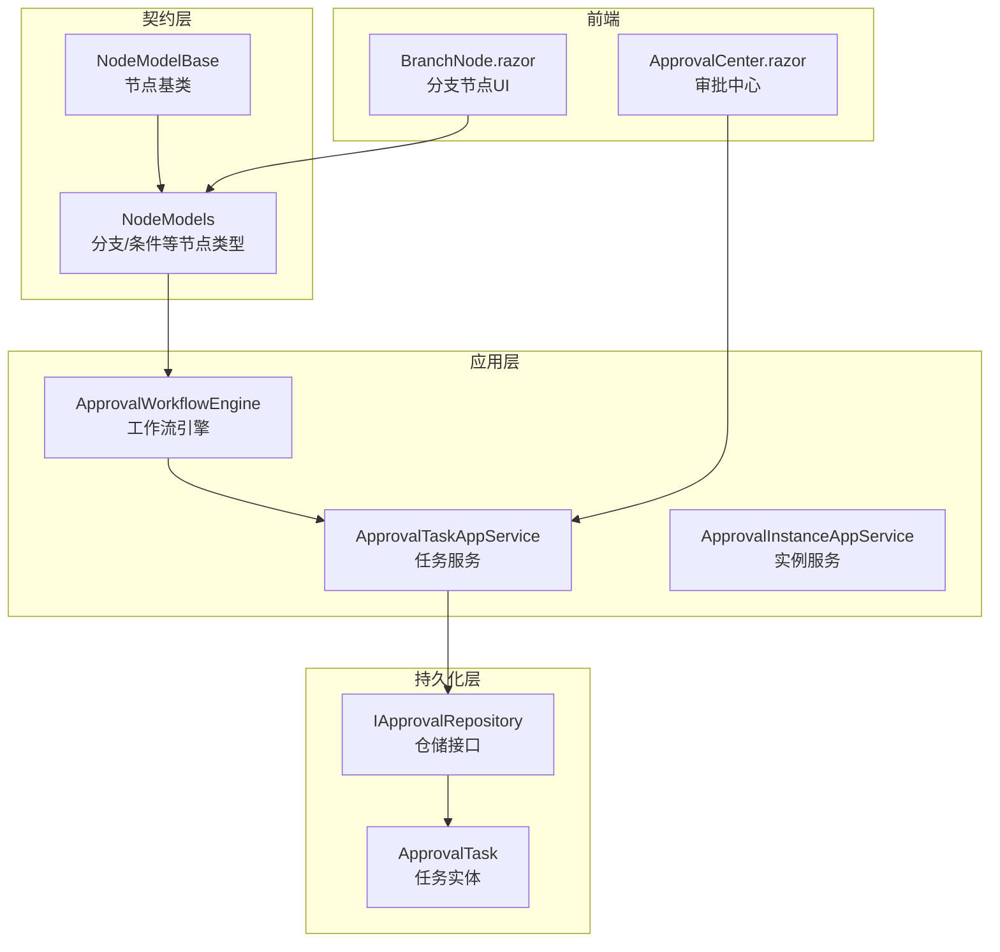
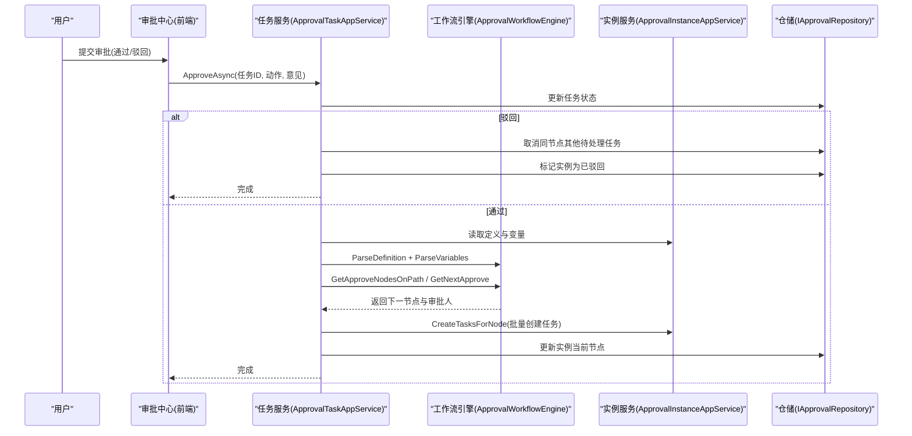
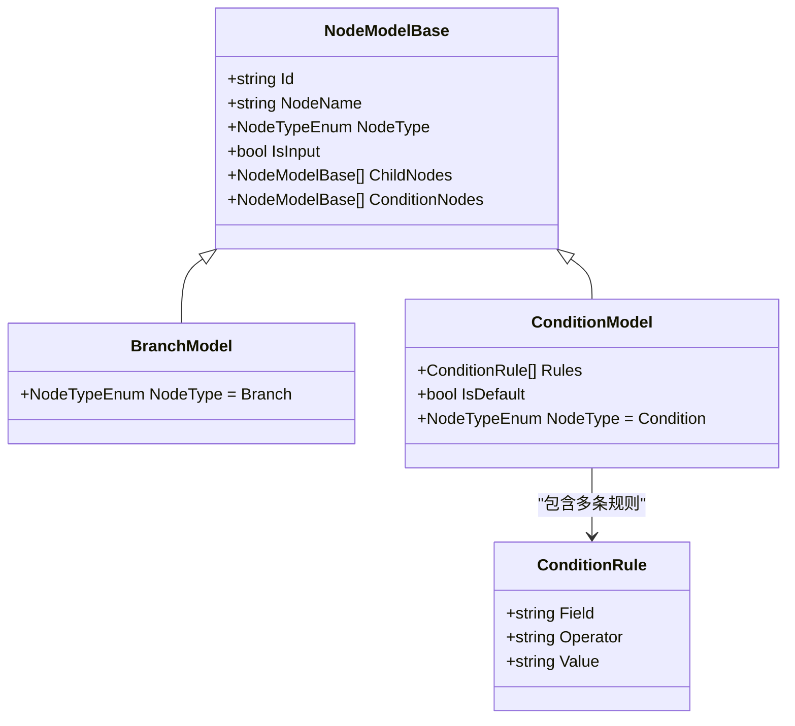
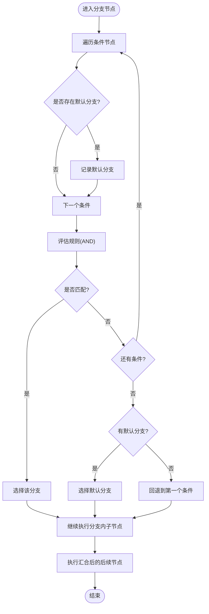
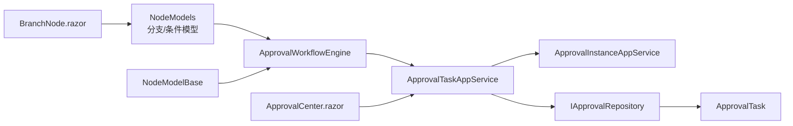

# 分支节点

<cite>
**本文引用的文件**   
- [ApprovalWorkflowEngine.cs](file://src/Services/Approval/H.Approval.Application/Services/ApprovalWorkflowEngine.cs)
- [NodeModelBase.cs](file://src/Services/Approval/H.Approval.Application.Contracts/Workflow/NodeModelBase.cs)
- [NodeModels.cs](file://src/Services/Approval/H.Approval.Application.Contracts/Workflow/NodeModels.cs)
- [ApprovalTaskAppService.cs](file://src/Services/Approval/H.Approval.Application/Services/ApprovalTaskAppService.cs)
- [ApprovalInstanceAppService.cs](file://src/Services/Approval/H.Approval.Application/Services/ApprovalInstanceAppService.cs)
- [IApprovalRepository.cs](file://src/Services/Approval/H.Approval.EntityFrameworkCore/Repositories/IApprovalRepository.cs)
- [ApprovalTask.cs](file://src/Services/Approval/H.Approval.EntityFrameworkCore/Entities/ApprovalTask.cs)
- [BranchNode.razor](file://src/Services/Approval/H.Approval.Web/Components/Nodes/BranchNode.razor)
- [ApprovalCenter.razor](file://src/Services/Approval/H.Approval.Web/Pages/ApprovalCenter.razor)
</cite>

## 目录
1. [简介](#简介)
2. [项目结构](#项目结构)
3. [核心组件](#核心组件)
4. [架构总览](#架构总览)
5. [详细组件分析](#详细组件分析)
6. [依赖关系分析](#依赖关系分析)
7. [性能与并发控制](#性能与并发控制)
8. [故障排查指南](#故障排查指南)
9. [结论](#结论)
10. [附录](#附录)

## 简介
本文件围绕“分支节点”在审批工作流中的作用进行系统化说明。分支节点用于实现复杂流程控制与并行处理，通过条件求值选择执行路径，并在汇合后继续后续流程。文档涵盖：
- 分支节点的创建、配置与管理（设计器与运行时）
- 分支合并策略与数据同步机制
- 典型应用场景（并行审批、多路径处理）
- 性能考量与并发控制策略
- 最佳实践建议

## 项目结构
分支节点相关能力分布在应用层、契约层、实体仓储层以及前端设计器中：
- 契约层定义节点模型与枚举（包含分支与条件）
- 应用层提供工作流引擎与服务编排
- 实体与仓储负责任务与实例的持久化
- 前端提供分支节点可视化编辑与交互

图表来源 
- [NodeModelBase.cs:1-100](file://src/Services/Approval/H.Approval.Application.Contracts/Workflow/NodeModelBase.cs#L1-L100)
- [NodeModels.cs:1-208](file://src/Services/Approval/H.Approval.Application.Contracts/Workflow/NodeModels.cs#L1-L208)
- [ApprovalWorkflowEngine.cs:1-259](file://src/Services/Approval/H.Approval.Application/Services/ApprovalWorkflowEngine.cs#L1-L259)
- [ApprovalTaskAppService.cs:1-281](file://src/Services/Approval/H.Approval.Application/Services/ApprovalTaskAppService.cs#L1-L281)
- [ApprovalInstanceAppService.cs:127-166](file://src/Services/Approval/H.Approval.Application/Services/ApprovalInstanceAppService.cs#L127-L166)
- [IApprovalRepository.cs:1-54](file://src/Services/Approval/H.Approval.EntityFrameworkCore/Repositories/IApprovalRepository.cs#L1-L54)
- [ApprovalTask.cs:1-56](file://src/Services/Approval/H.Approval.EntityFrameworkCore/Entities/ApprovalTask.cs#L1-L56)
- [BranchNode.razor:1-57](file://src/Services/Approval/H.Approval.Web/Components/Nodes/BranchNode.razor#L1-L57)
- [ApprovalCenter.razor:214-266](file://src/Services/Approval/H.Approval.Web/Pages/ApprovalCenter.razor#L214-L266)

章节来源
- [NodeModelBase.cs:1-100](file://src/Services/Approval/H.Approval.Application.Contracts/Workflow/NodeModelBase.cs#L1-L100)
- [NodeModels.cs:1-208](file://src/Services/Approval/H.Approval.Application.Contracts/Workflow/NodeModels.cs#L1-L208)
- [ApprovalWorkflowEngine.cs:1-259](file://src/Services/Approval/H.Approval.Application/Services/ApprovalWorkflowEngine.cs#L1-L259)
- [ApprovalTaskAppService.cs:1-281](file://src/Services/Approval/H.Approval.Application/Services/ApprovalTaskAppService.cs#L1-L281)
- [ApprovalInstanceAppService.cs:127-166](file://src/Services/Approval/H.Approval.Application/Services/ApprovalInstanceAppService.cs#L127-L166)
- [IApprovalRepository.cs:1-54](file://src/Services/Approval/H.Approval.EntityFrameworkCore/Repositories/IApprovalRepository.cs#L1-L54)
- [ApprovalTask.cs:1-56](file://src/Services/Approval/H.Approval.EntityFrameworkCore/Entities/ApprovalTask.cs#L1-L56)
- [BranchNode.razor:1-57](file://src/Services/Approval/H.Approval.Web/Components/Nodes/BranchNode.razor#L1-L57)
- [ApprovalCenter.razor:214-266](file://src/Services/Approval/H.Approval.Web/Pages/ApprovalCenter.razor#L214-L266)

## 核心组件
- 分支节点模型与条件规则
  - 分支节点类型为 Branch，其子节点为 Condition，每个条件包含规则列表（AND 关系），支持默认分支
  - 变量解析将实例变量 JSON 转为字典，供条件求值使用
- 工作流引擎
  - 遍历节点树时遇到 Branch，依据变量对条件求值，选择一条路径；随后继续执行汇合后的后续节点
  - 提供获取当前/下一审批节点及审批人的方法
- 任务与实例服务
  - 审批通过时根据多人审批模式（依次/会签/或签）决定流转逻辑
  - 或签场景下取消同节点其他待处理任务，保证“一人通过即生效”
- 前端设计器
  - 分支节点 UI 支持动态添加条件分支，渲染各条件子节点并维护树结构

章节来源
- [NodeModels.cs:120-144](file://src/Services/Approval/H.Approval.Application.Contracts/Workflow/NodeModels.cs#L120-L144)
- [ApprovalWorkflowEngine.cs:92-139](file://src/Services/Approval/H.Approval.Application/Services/ApprovalWorkflowEngine.cs#L92-L139)
- [ApprovalTaskAppService.cs:148-194](file://src/Services/Approval/H.Approval.Application/Services/ApprovalTaskAppService.cs#L148-L194)
- [BranchNode.razor:46-56](file://src/Services/Approval/H.Approval.Web/Components/Nodes/BranchNode.razor#L46-L56)

## 架构总览
分支节点在运行时的关键调用链如下：用户操作触发审批动作 → 任务服务更新状态并推进流程 → 工作流引擎解析定义与变量 → 分支求值选择路径 → 创建下一节点任务或结束流程。

图表来源 
- [ApprovalTaskAppService.cs:66-143](file://src/Services/Approval/H.Approval.Application/Services/ApprovalTaskAppService.cs#L66-L143)
- [ApprovalWorkflowEngine.cs:25-30](file://src/Services/Approval/H.Approval.Application/Services/ApprovalWorkflowEngine.cs#L25-L30)
- [ApprovalWorkflowEngine.cs:35-60](file://src/Services/Approval/H.Approval.Application/Services/ApprovalWorkflowEngine.cs#L35-L60)
- [ApprovalWorkflowEngine.cs:65-104](file://src/Services/Approval/H.Approval.Application/Services/ApprovalWorkflowEngine.cs#L65-L104)
- [ApprovalInstanceAppService.cs:127-147](file://src/Services/Approval/H.Approval.Application/Services/ApprovalInstanceAppService.cs#L127-L147)
- [IApprovalRepository.cs:31-41](file://src/Services/Approval/H.Approval.EntityFrameworkCore/Repositories/IApprovalRepository.cs#L31-L41)

## 详细组件分析

### 分支节点数据模型
- 分支节点（Branch）持有多个条件子节点（Condition），每个条件包含规则列表（AND 关系）与是否默认分支标志
- 节点基类统一了 ID、名称、类型、子节点与条件节点集合，便于序列化与反序列化

图表来源 
- [NodeModelBase.cs:11-24](file://src/Services/Approval/H.Approval.Application.Contracts/Workflow/NodeModelBase.cs#L11-L24)
- [NodeModels.cs:120-144](file://src/Services/Approval/H.Approval.Application.Contracts/Workflow/NodeModels.cs#L120-L144)
- [NodeModels.cs:8-18](file://src/Services/Approval/H.Approval.Application.Contracts/Workflow/NodeModels.cs#L8-L18)

章节来源
- [NodeModelBase.cs:11-24](file://src/Services/Approval/H.Approval.Application.Contracts/Workflow/NodeModelBase.cs#L11-L24)
- [NodeModels.cs:120-144](file://src/Services/Approval/H.Approval.Application.Contracts/Workflow/NodeModels.cs#L120-L144)
- [NodeModels.cs:8-18](file://src/Services/Approval/H.Approval.Application.Contracts/Workflow/NodeModels.cs#L8-L18)

### 分支求值与路径选择算法
- 遍历节点树时遇到 Branch，按顺序评估所有条件规则（AND 关系）
- 命中第一个满足条件的分支即选择该路径；若无命中则走默认分支；若仍无默认分支则回退到第一个条件
- 选择路径后继续执行该分支内的子节点，再执行汇合后的后续节点

图表来源 
- [ApprovalWorkflowEngine.cs:109-139](file://src/Services/Approval/H.Approval.Application/Services/ApprovalWorkflowEngine.cs#L109-L139)
- [ApprovalWorkflowEngine.cs:144-173](file://src/Services/Approval/H.Approval.Application/Services/ApprovalWorkflowEngine.cs#L144-L173)

章节来源
- [ApprovalWorkflowEngine.cs:109-139](file://src/Services/Approval/H.Approval.Application/Services/ApprovalWorkflowEngine.cs#L109-L139)
- [ApprovalWorkflowEngine.cs:144-173](file://src/Services/Approval/H.Approval.Application/Services/ApprovalWorkflowEngine.cs#L144-L173)

### 分支合并策略与数据同步
- 合并策略：分支选择一条路径执行完毕后，统一回到父级继续执行后续节点，确保流程收敛
- 数据同步：
  - 实例变量 JSON 被解析为字典，参与条件求值
  - 任务状态变更（通过/驳回/取消）即时写入数据库，影响后续流转决策
  - 或签模式下，首个通过的任务会取消同节点其他待处理任务，避免重复处理

章节来源
- [ApprovalWorkflowEngine.cs:65-104](file://src/Services/Approval/H.Approval.Application/Services/ApprovalWorkflowEngine.cs#L65-L104)
- [ApprovalTaskAppService.cs:196-213](file://src/Services/Approval/H.Approval.Application/Services/ApprovalTaskAppService.cs#L196-L213)

### 并行审批与多路径处理
- 并行审批（会签/或签）：
  - 会签：同一节点生成多个任务，需全部通过才流转
  - 或签：任一通过即生效，其余任务取消
- 多路径处理：
  - 分支节点根据变量选择不同路径，每条路径可独立配置审批人或抄送逻辑
  - 路径汇合后继续统一流程

章节来源
- [ApprovalTaskAppService.cs:148-194](file://src/Services/Approval/H.Approval.Application/Services/ApprovalTaskAppService.cs#L148-L194)
- [ApprovalWorkflowEngine.cs:92-104](file://src/Services/Approval/H.Approval.Application/Services/ApprovalWorkflowEngine.cs#L92-L104)

### 前端设计与交互
- 分支节点 UI 支持动态添加条件分支，渲染各条件子节点
- 事件回调用于维护节点树结构与保存设计结果

章节来源
- [BranchNode.razor:1-57](file://src/Services/Approval/H.Approval.Web/Components/Nodes/BranchNode.razor#L1-L57)

## 依赖关系分析
- 契约层（NodeModelBase/NodeModels）为应用层提供统一的节点模型与序列化支持
- 应用层（ApprovalWorkflowEngine/ApprovalTaskAppService/ApprovalInstanceAppService）协调流程推进与任务管理
- 持久化层（IApprovalRepository/ApprovalTask）保障任务与实例的状态一致性
- 前端（BranchNode.razor/ApprovalCenter.razor）提供可视化编辑与用户操作入口

图表来源 
- [NodeModels.cs:120-144](file://src/Services/Approval/H.Approval.Application.Contracts/Workflow/NodeModels.cs#L120-L144)
- [NodeModelBase.cs:11-24](file://src/Services/Approval/H.Approval.Application.Contracts/Workflow/NodeModelBase.cs#L11-L24)
- [ApprovalWorkflowEngine.cs:1-259](file://src/Services/Approval/H.Approval.Application/Services/ApprovalWorkflowEngine.cs#L1-L259)
- [ApprovalTaskAppService.cs:1-281](file://src/Services/Approval/H.Approval.Application/Services/ApprovalTaskAppService.cs#L1-L281)
- [ApprovalInstanceAppService.cs:127-166](file://src/Services/Approval/H.Approval.Application/Services/ApprovalInstanceAppService.cs#L127-L166)
- [IApprovalRepository.cs:1-54](file://src/Services/Approval/H.Approval.EntityFrameworkCore/Repositories/IApprovalRepository.cs#L1-L54)
- [ApprovalTask.cs:1-56](file://src/Services/Approval/H.Approval.EntityFrameworkCore/Entities/ApprovalTask.cs#L1-L56)
- [BranchNode.razor:1-57](file://src/Services/Approval/H.Approval.Web/Components/Nodes/BranchNode.razor#L1-L57)
- [ApprovalCenter.razor:214-266](file://src/Services/Approval/H.Approval.Web/Pages/ApprovalCenter.razor#L214-L266)

章节来源
- [ApprovalWorkflowEngine.cs:1-259](file://src/Services/Approval/H.Approval.Application/Services/ApprovalWorkflowEngine.cs#L1-L259)
- [ApprovalTaskAppService.cs:1-281](file://src/Services/Approval/H.Approval.Application/Services/ApprovalTaskAppService.cs#L1-L281)
- [IApprovalRepository.cs:1-54](file://src/Services/Approval/H.Approval.EntityFrameworkCore/Repositories/IApprovalRepository.cs#L1-L54)

## 性能与并发控制
- 条件求值复杂度
  - 分支求值为 O(C)，C 为条件数量；每条规则的评估为 O(R)，R 为规则数量
  - 整体复杂度近似 O(C×R)，适合中等规模条件集
- 并发控制
  - 或签模式通过“取消同节点其他待处理任务”避免重复处理
  - 会签模式通过统计待处理任务数确保所有人完成后才流转
- 资源优化建议
  - 合理拆分条件规则，避免过深嵌套
  - 变量字段命名规范化，提升求值效率
  - 批量更新任务状态时使用 UpdateRange 减少数据库往返

章节来源
- [ApprovalWorkflowEngine.cs:144-173](file://src/Services/Approval/H.Approval.Application/Services/ApprovalWorkflowEngine.cs#L144-L173)
- [ApprovalTaskAppService.cs:196-213](file://src/Services/Approval/H.Approval.Application/Services/ApprovalTaskAppService.cs#L196-L213)

## 故障排查指南
- 常见问题定位
  - 分支未命中：检查变量字段名与规则操作符是否正确
  - 默认分支未生效：确认是否设置了默认分支且无其他条件命中
  - 或签未取消其他任务：核查任务状态与仓储查询条件
- 日志与调试
  - 工作流引擎在分支命中与默认路径选择处输出日志
  - 任务服务在驳回、会签、或签等关键路径记录日志

章节来源
- [ApprovalWorkflowEngine.cs:124-135](file://src/Services/Approval/H.Approval.Application/Services/ApprovalWorkflowEngine.cs#L124-L135)
- [ApprovalTaskAppService.cs:97-107](file://src/Services/Approval/H.Approval.Application/Services/ApprovalTaskAppService.cs#L97-L107)

## 结论
分支节点为复杂业务流程提供了强大的条件路由与并行处理能力。通过清晰的模型定义、稳健的求值算法与严格的并发控制，系统能够灵活应对多样化的审批场景。建议在业务建模时遵循最小必要原则，合理组织条件与变量，并结合日志与监控持续优化流程性能与稳定性。

## 附录
- 典型应用场景
  - 并行审批：会签确保多方共识，或签加速决策
  - 多路径处理：金额阈值、部门层级、产品类型等维度驱动不同审批路径
- 最佳实践
  - 明确默认分支，防止意外回退
  - 变量命名与规则设计保持一致性
  - 定期审查条件复杂度，避免过度分支