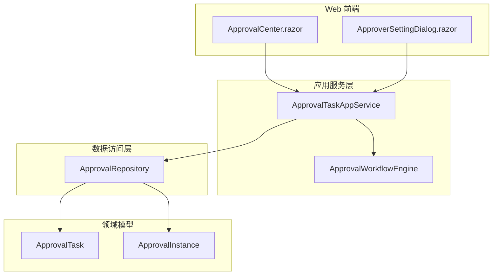
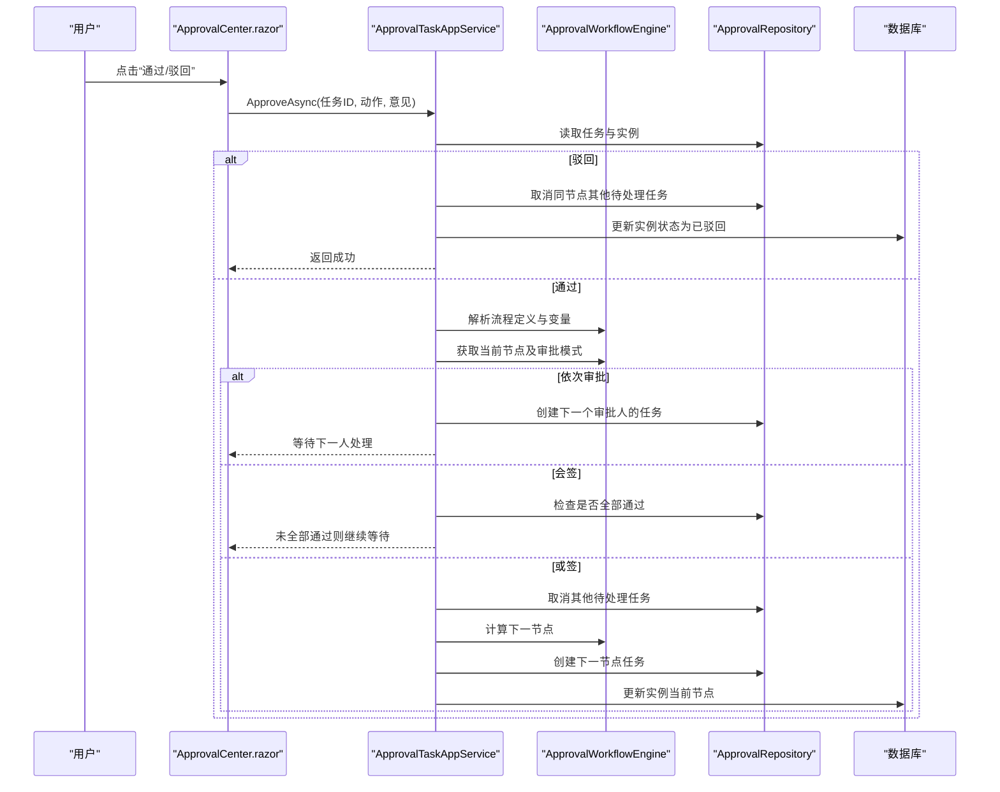
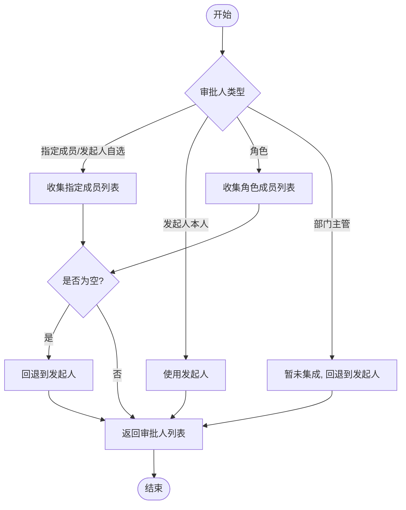
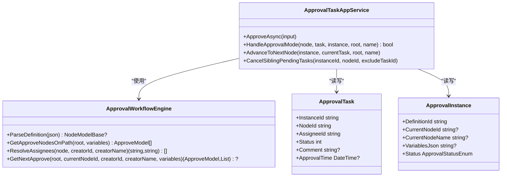
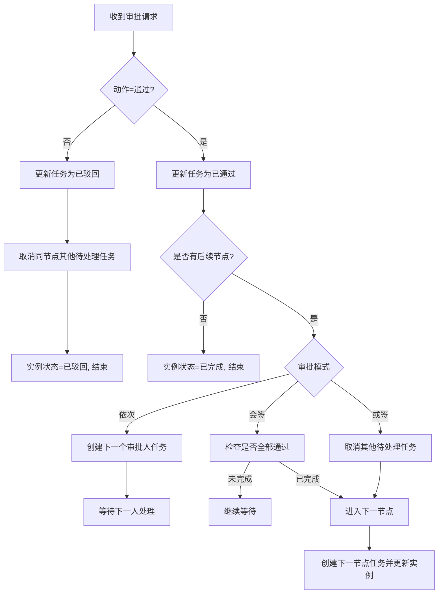
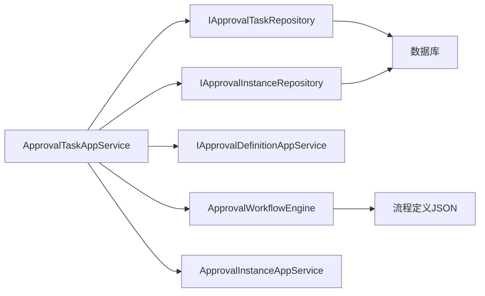

# 审批节点

<cite>
**本文引用的文件**   
- [ApprovalTaskAppService.cs](file://src/Services/Approval/H.Approval.Application/Services/ApprovalTaskAppService.cs)
- [ApprovalWorkflowEngine.cs](file://src/Services/Approval/H.Approval.Application/Services/ApprovalWorkflowEngine.cs)
- [ApprovalTask.cs](file://src/Services/Approval/H.Approval.EntityFrameworkCore/Entities/ApprovalTask.cs)
- [ApprovalInstance.cs](file://src/Services/Approval/H.Approval.EntityFrameworkCore/Entities/ApprovalInstance.cs)
- [ApprovalRepository.cs](file://src/Services/Approval/H.Approval.EntityFrameworkCore/Repositories/ApprovalRepository.cs)
- [ApprovalStatusEnum.cs](file://src/Services/Approval/H.Approval.Application.Contracts/Enums/ApprovalStatusEnum.cs)
- [ApprovalCenter.razor](file://src/Services/Approval/H.Approval.Web/Pages/ApprovalCenter.razor)
- [ApproverSettingDialog.razor](file://src/Services/Approval/H.Approval.Web/Components/Panels/ApproverSettingDialog.razor)
</cite>

## 目录
1. [简介](#简介)
2. [项目结构](#项目结构)
3. [核心组件](#核心组件)
4. [架构总览](#架构总览)
5. [详细组件分析](#详细组件分析)
6. [依赖关系分析](#依赖关系分析)
7. [性能考量](#性能考量)
8. [故障排查指南](#故障排查指南)
9. [结论](#结论)
10. [附录](#附录)

## 简介
本文件围绕“审批节点”进行系统化文档化，覆盖审批人设置（指定人员、角色、部门、动态获取）、审批方式（会签、或签、依次审批）、权限控制、审批操作（通过、拒绝、转交、退回）处理逻辑，以及审批意见填写、附件上传与审批历史查看等能力。同时提供复杂配置示例与常见问题解决方案，帮助开发者与实施人员快速理解并正确使用审批节点。

## 项目结构
审批功能位于 Services/Approval 模块下，采用分层架构：
- 应用服务层：ApprovalTaskAppService、ApprovalWorkflowEngine
- 领域实体：ApprovalTask、ApprovalInstance
- 仓储实现：ApprovalRepository
- Web 前端：ApprovalCenter.razor、ApproverSettingDialog.razor
- 枚举与契约：ApprovalStatusEnum 等

图表来源
- [ApprovalCenter.razor:1-200](file://src/Services/Approval/H.Approval.Web/Pages/ApprovalCenter.razor#L1-L200)
- [ApproverSettingDialog.razor:1-139](file://src/Services/Approval/H.Approval.Web/Components/Panels/ApproverSettingDialog.razor#L1-L139)
- [ApprovalTaskAppService.cs:1-281](file://src/Services/Approval/H.Approval.Application/Services/ApprovalTaskAppService.cs#L1-L281)
- [ApprovalWorkflowEngine.cs:1-259](file://src/Services/Approval/H.Approval.Application/Services/ApprovalWorkflowEngine.cs#L1-L259)
- [ApprovalRepository.cs:128-172](file://src/Services/Approval/H.Approval.EntityFrameworkCore/Repositories/ApprovalRepository.cs#L128-L172)
- [ApprovalTask.cs:1-57](file://src/Services/Approval/H.Approval.EntityFrameworkCore/Entities/ApprovalTask.cs#L1-L57)
- [ApprovalInstance.cs:1-62](file://src/Services/Approval/H.Approval.EntityFrameworkCore/Entities/ApprovalInstance.cs#L1-L62)

章节来源
- [ApprovalTaskAppService.cs:1-281](file://src/Services/Approval/H.Approval.Application/Services/ApprovalTaskAppService.cs#L1-L281)
- [ApprovalWorkflowEngine.cs:1-259](file://src/Services/Approval/H.Approval.Application/Services/ApprovalWorkflowEngine.cs#L1-L259)
- [ApprovalRepository.cs:128-172](file://src/Services/Approval/H.Approval.EntityFrameworkCore/Repositories/ApprovalRepository.cs#L128-L172)
- [ApprovalTask.cs:1-57](file://src/Services/Approval/H.Approval.EntityFrameworkCore/Entities/ApprovalTask.cs#L1-L57)
- [ApprovalInstance.cs:1-62](file://src/Services/Approval/H.Approval.EntityFrameworkCore/Entities/ApprovalInstance.cs#L1-L62)
- [ApprovalCenter.razor:1-200](file://src/Services/Approval/H.Approval.Web/Pages/ApprovalCenter.razor#L1-L200)
- [ApproverSettingDialog.razor:1-139](file://src/Services/Approval/H.Approval.Web/Components/Panels/ApproverSettingDialog.razor#L1-L139)

## 核心组件
- 审批任务应用服务 ApprovalTaskAppService：负责待办/已办查询、审批动作（通过/驳回）执行、工作流推进、下一节点任务创建与状态更新。
- 审批工作流引擎 ApprovalWorkflowEngine：解析流程定义 JSON、计算条件分支、获取路径上的审批节点、解析审批人（指定成员/发起人自选/发起人本人/角色/部门主管）。
- 领域实体：
  - ApprovalTask：记录单个审批任务的状态、意见、时间戳、所属实例与节点。
  - ApprovalInstance：记录流程实例的标题、状态、当前节点、变量 JSON、发起人与完成时间。
- 仓储 ApprovalRepository：提供按实例/节点/审批人维度查询任务的能力。
- Web 页面 ApprovalCenter.razor：展示待办/已办/我发起的/抄送我的，并提供通过/驳回对话框与意见输入。
- 审批人设置 ApproverSettingDialog.razor：支持选择审批人类型与审批方式（依次/会签/或签），维护指定成员与角色信息。

章节来源
- [ApprovalTaskAppService.cs:41-143](file://src/Services/Approval/H.Approval.Application/Services/ApprovalTaskAppService.cs#L41-L143)
- [ApprovalWorkflowEngine.cs:22-60](file://src/Services/Approval/H.Approval.Application/Services/ApprovalWorkflowEngine.cs#L22-L60)
- [ApprovalTask.cs:1-57](file://src/Services/Approval/H.Approval.EntityFrameworkCore/Entities/ApprovalTask.cs#L1-L57)
- [ApprovalInstance.cs:1-62](file://src/Services/Approval/H.Approval.EntityFrameworkCore/Entities/ApprovalInstance.cs#L1-L62)
- [ApprovalRepository.cs:128-172](file://src/Services/Approval/H.Approval.EntityFrameworkCore/Repositories/ApprovalRepository.cs#L128-L172)
- [ApprovalCenter.razor:142-266](file://src/Services/Approval/H.Approval.Web/Pages/ApprovalCenter.razor#L142-L266)
- [ApproverSettingDialog.razor:1-23](file://src/Services/Approval/H.Approval.Web/Components/Panels/ApproverSettingDialog.razor#L1-L23)

## 架构总览
审批节点的核心交互由前端页面触发应用服务，应用服务调用工作流引擎解析流程定义与变量，结合仓储持久化任务与实例状态，最终推进到下一节点或结束流程。

图表来源
- [ApprovalCenter.razor:245-266](file://src/Services/Approval/H.Approval.Web/Pages/ApprovalCenter.razor#L245-L266)
- [ApprovalTaskAppService.cs:66-143](file://src/Services/Approval/H.Approval.Application/Services/ApprovalTaskAppService.cs#L66-L143)
- [ApprovalWorkflowEngine.cs:178-201](file://src/Services/Approval/H.Approval.Application/Services/ApprovalWorkflowEngine.cs#L178-L201)
- [ApprovalRepository.cs:128-172](file://src/Services/Approval/H.Approval.EntityFrameworkCore/Repositories/ApprovalRepository.cs#L128-L172)

## 详细组件分析

### 审批人设置（指定人员、角色、部门、动态获取）
- 支持类型：
  - 指定成员：从设计器选择的成员列表解析为实际审批人。
  - 发起人自选：由发起人在运行时选择具体审批人。
  - 发起人本人：自动将发起人作为审批人。
  - 角色：使用设计器选择的角色成员 ID 列表解析为审批人。
  - 部门主管：当前未集成组织服务，回退到发起人。
- 动态获取：
  - 通过 ApprovalWorkflowEngine.ResolveAssignees 根据 ApproverType 动态生成审批人列表。
  - 若指定成员为空或角色成员为空，系统回退到发起人，确保流程可继续。

图表来源
- [ApprovalWorkflowEngine.cs:206-258](file://src/Services/Approval/H.Approval.Application/Services/ApprovalWorkflowEngine.cs#L206-L258)
- [ApproverSettingDialog.razor:1-23](file://src/Services/Approval/H.Approval.Web/Components/Panels/ApproverSettingDialog.razor#L1-L23)

章节来源
- [ApprovalWorkflowEngine.cs:206-258](file://src/Services/Approval/H.Approval.Application/Services/ApprovalWorkflowEngine.cs#L206-L258)
- [ApproverSettingDialog.razor:1-23](file://src/Services/Approval/H.Approval.Web/Components/Panels/ApproverSettingDialog.razor#L1-L23)

### 审批方式（会签、或签、依次审批）
- 依次审批：
  - 按顺序为每个审批人创建任务；当前人通过后，自动创建下一个审批人的任务。
  - 最后一个审批人通过后，进入下一节点。
- 会签：
  - 同一节点的所有审批人都需处理；只有当所有任务都已完成时，才进入下一节点。
- 或签：
  - 任一审批人通过即可；系统会自动取消该节点其他待处理任务，并进入下一节点。

图表来源
- [ApprovalTaskAppService.cs:145-250](file://src/Services/Approval/H.Approval.Application/Services/ApprovalTaskAppService.cs#L145-L250)
- [ApprovalWorkflowEngine.cs:62-104](file://src/Services/Approval/H.Approval.Application/Services/ApprovalWorkflowEngine.cs#L62-L104)
- [ApprovalTask.cs:1-57](file://src/Services/Approval/H.Approval.EntityFrameworkCore/Entities/ApprovalTask.cs#L1-L57)
- [ApprovalInstance.cs:1-62](file://src/Services/Approval/H.Approval.EntityFrameworkCore/Entities/ApprovalInstance.cs#L1-L62)

章节来源
- [ApprovalTaskAppService.cs:145-250](file://src/Services/Approval/H.Approval.Application/Services/ApprovalTaskAppService.cs#L145-L250)
- [ApprovalWorkflowEngine.cs:62-104](file://src/Services/Approval/H.Approval.Application/Services/ApprovalWorkflowEngine.cs#L62-L104)

### 审批权限控制
- 基于当前登录用户上下文：
  - 通过 IHttpContextAccessor 获取当前用户 ID 与姓名，用于限制只能处理分配给自己的任务。
- 任务状态校验：
  - 仅允许对状态为“待审批”的任务进行操作，避免重复处理。
- 实例与节点校验：
  - 在通过模式下，依据流程定义与变量计算当前节点与后续节点，确保流转正确性。

章节来源
- [ApprovalTaskAppService.cs:252-260](file://src/Services/Approval/H.Approval.Application/Services/ApprovalTaskAppService.cs#L252-L260)
- [ApprovalTaskAppService.cs:78-82](file://src/Services/Approval/H.Approval.Application/Services/ApprovalTaskAppService.cs#L78-L82)

### 审批操作（通过、拒绝、转交、退回）处理逻辑
- 通过：
  - 更新任务状态为已通过，记录意见与时间。
  - 根据审批模式决定下一步：依次创建下一人任务；会签等待所有人完成；或签取消其他任务并进入下一节点。
  - 若无后续节点，标记实例为已完成。
- 拒绝：
  - 更新任务状态为已驳回，记录意见与时间。
  - 取消同节点其他待处理任务，实例状态置为已驳回并结束。
- 转交/退回：
  - 当前代码未直接实现转交与退回接口；如需扩展，可在 ApprovalTaskAppService 中新增方法，基于当前节点与变量重新计算目标审批人或退回至上一节点，并创建相应任务。

图表来源
- [ApprovalTaskAppService.cs:66-143](file://src/Services/Approval/H.Approval.Application/Services/ApprovalTaskAppService.cs#L66-L143)
- [ApprovalTaskAppService.cs:196-250](file://src/Services/Approval/H.Approval.Application/Services/ApprovalTaskAppService.cs#L196-L250)

章节来源
- [ApprovalTaskAppService.cs:66-143](file://src/Services/Approval/H.Approval.Application/Services/ApprovalTaskAppService.cs#L66-L143)
- [ApprovalTaskAppService.cs:196-250](file://src/Services/Approval/H.Approval.Application/Services/ApprovalTaskAppService.cs#L196-L250)

### 审批意见填写、附件上传、审批历史查看
- 审批意见：
  - 前端 ApprovalCenter.razor 提供文本框输入意见，提交时随动作一起传递到后端。
  - 后端将意见写入 ApprovalTask.Comment。
- 附件上传：
  - 前端存在上传组件元数据（如 antdesign/upload.json），但当前审批流程未集成附件字段；如需支持，可在 ApprovalTask 增加附件字段并在 UI 中绑定。
- 审批历史：
  - 通过 GetByInstanceIdAsync 获取实例下的所有任务，按创建时间排序，形成审批历史。

章节来源
- [ApprovalCenter.razor:142-156](file://src/Services/Approval/H.Approval.Web/Pages/ApprovalCenter.razor#L142-L156)
- [ApprovalTaskAppService.cs:59-64](file://src/Services/Approval/H.Approval.Application/Services/ApprovalTaskAppService.cs#L59-L64)
- [ApprovalTask.cs:54-55](file://src/Services/Approval/H.Approval.EntityFrameworkCore/Entities/ApprovalTask.cs#L54-L55)

### 复杂配置示例
- 示例一：依次审批+条件分支
  - 节点序列：发起 → 经理审批（依次） → 条件分支（金额>10000走总监审批，否则结束） → 结束。
  - 变量：amount（数值），由发起时传入 VariablesJson。
- 示例二：会签+或签组合
  - 节点序列：发起 → 部门会签（会签） → 或签（任意一人通过即进入下一节点） → 结束。
- 示例三：角色审批+动态回退
  - 节点：发起 → 角色审批（角色成员为空时回退到发起人） → 结束。

[本节为概念性说明，不直接分析具体文件]

## 依赖关系分析
- 应用服务依赖：
  - ApprovalTaskAppService 依赖仓储（IApprovalTaskRepository、IApprovalInstanceRepository）、定义服务（IApprovalDefinitionAppService）、工作流引擎（ApprovalWorkflowEngine）、实例服务（ApprovalInstanceAppService）与 HTTP 上下文。
- 工作流引擎依赖：
  - 解析流程定义 JSON、评估条件分支、解析审批人。
- 仓储依赖：
  - 基于 EF Core 的 DbContext 访问 ApprovalTasks 与 ApprovalInstances。

图表来源
- [ApprovalTaskAppService.cs:13-39](file://src/Services/Approval/H.Approval.Application/Services/ApprovalTaskAppService.cs#L13-L39)
- [ApprovalWorkflowEngine.cs:22-30](file://src/Services/Approval/H.Approval.Application/Services/ApprovalWorkflowEngine.cs#L22-L30)
- [ApprovalRepository.cs:128-172](file://src/Services/Approval/H.Approval.EntityFrameworkCore/Repositories/ApprovalRepository.cs#L128-L172)

章节来源
- [ApprovalTaskAppService.cs:13-39](file://src/Services/Approval/H.Approval.Application/Services/ApprovalTaskAppService.cs#L13-L39)
- [ApprovalWorkflowEngine.cs:22-30](file://src/Services/Approval/H.Approval.Application/Services/ApprovalWorkflowEngine.cs#L22-L30)
- [ApprovalRepository.cs:128-172](file://src/Services/Approval/H.Approval.EntityFrameworkCore/Repositories/ApprovalRepository.cs#L128-L172)

## 性能考量
- 批量更新：
  - 在或签场景取消同节点其他任务时使用 UpdateRangeAsync，减少数据库往返。
- 条件分支求值：
  - 使用轻量级 JSON 解析与规则评估，避免复杂表达式引擎开销。
- 任务查询优化：
  - 按实例/节点/审批人维度索引查询，提升列表加载速度。
- 日志与监控：
  - 关键路径记录日志，便于定位性能瓶颈与异常。

[本节为通用指导，不直接分析具体文件]

## 故障排查指南
- 任务不存在或重复操作：
  - 检查任务是否存在且状态为“待审批”，避免并发重复提交。
- 流程无后续节点：
  - 确认流程定义 JSON 是否正确，变量是否完整。
- 会签未推进：
  - 检查同节点是否仍有待处理任务；确认所有审批人均已完成。
- 或签未取消其他任务：
  - 确认 CancelSiblingPendingTasks 是否被调用；检查任务状态更新。
- 审批人解析为空：
  - 检查 ApproverType 配置与指定成员/角色列表；必要时回退到发起人。

章节来源
- [ApprovalTaskAppService.cs:72-82](file://src/Services/Approval/H.Approval.Application/Services/ApprovalTaskAppService.cs#L72-L82)
- [ApprovalTaskAppService.cs:196-213](file://src/Services/Approval/H.Approval.Application/Services/ApprovalTaskAppService.cs#L196-L213)
- [ApprovalWorkflowEngine.cs:206-258](file://src/Services/Approval/H.Approval.Application/Services/ApprovalWorkflowEngine.cs#L206-L258)

## 结论
审批节点以 ApprovalTaskAppService 为核心，结合 ApprovalWorkflowEngine 的流程解析与条件求值，实现了灵活的审批人设置与多种审批方式。前端 ApprovalCenter.razor 提供了直观的审批操作界面。整体架构清晰、可扩展性强，适合在企业级应用中广泛使用。建议按需扩展转交/退回与附件能力，并完善组织服务集成以提升部门主管审批能力。

[本节为总结性内容，不直接分析具体文件]

## 附录
- 相关枚举：
  - 审批状态 ApprovalStatusEnum：草稿、运行中、已完成、已取消、已驳回。
- 前端标签映射：
  - 任务状态文本与样式映射，便于可视化展示。

章节来源
- [ApprovalStatusEnum.cs:1-33](file://src/Services/Approval/H.Approval.Application.Contracts/Enums/ApprovalStatusEnum.cs#L1-L33)
- [ApprovalCenter.razor:305-326](file://src/Services/Approval/H.Approval.Web/Pages/ApprovalCenter.razor#L305-L326)