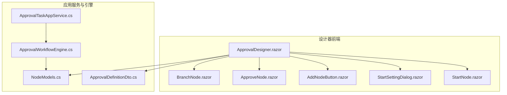
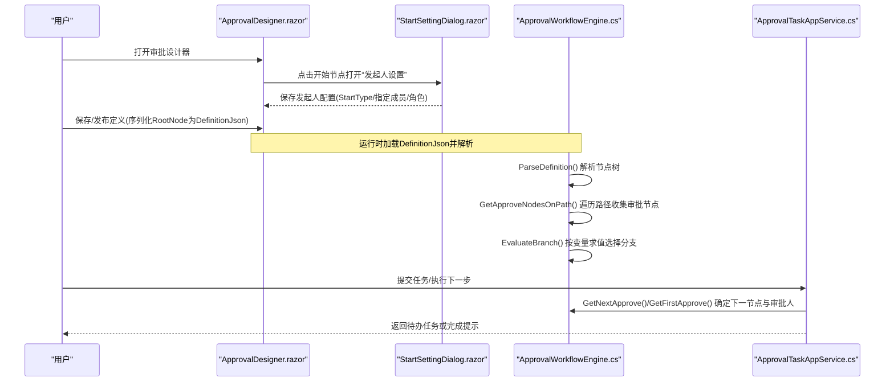
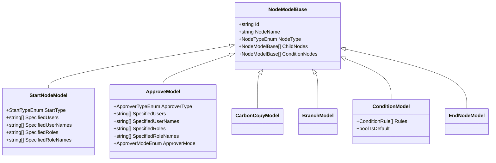
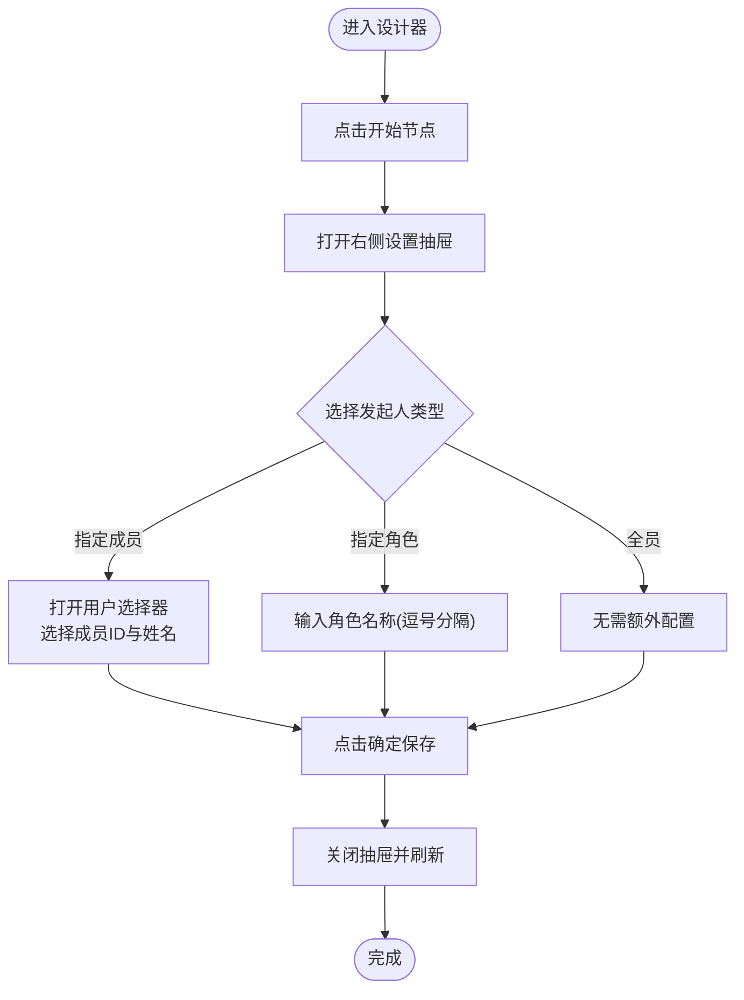
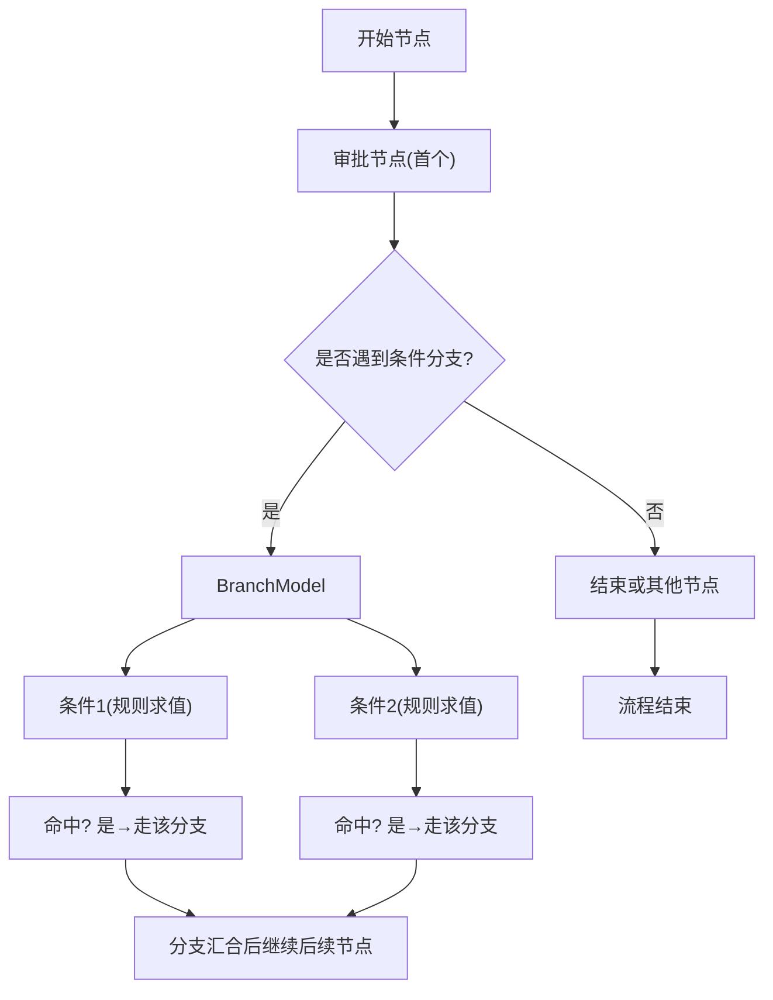
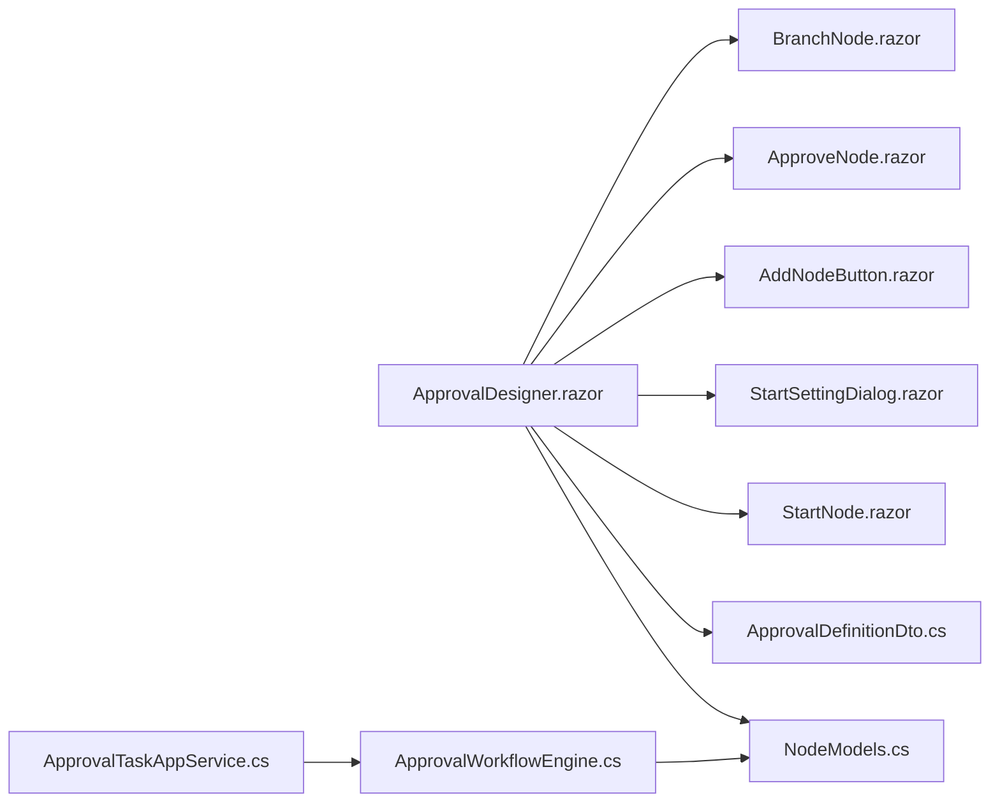

# 开始节点

<cite>
**本文引用的文件**   
- [ApprovalDesigner.razor](file://src/Services/Approval/H.Approval.Web/Pages/ApprovalDesigner.razor)
- [StartNode.razor](file://src/Services/Approval/H.Approval.Web/Components/Nodes/StartNode.razor)
- [StartSettingDialog.razor](file://src/Services/Approval/H.Approval.Web/Components/Panels/StartSettingDialog.razor)
- [AddNodeButton.razor](file://src/Services/Approval/H.Approval.Web/Components/Nodes/AddNodeButton.razor)
- [ApproveNode.razor](file://src/Services/Approval/H.Approval.Web/Components/Nodes/ApproveNode.razor)
- [BranchNode.razor](file://src/Services/Approval/H.Approval.Web/Components/Nodes/BranchNode.razor)
- [ApprovalWorkflowEngine.cs](file://src/Services/Approval/H.Approval.Application/Services/ApprovalWorkflowEngine.cs)
- [ApprovalTaskAppService.cs](file://src/Services/Approval/H.Approval.Application/Services/ApprovalTaskAppService.cs)
- [ApprovalDefinitionDto.cs](file://src/Services/Approval/H.Approval.Application.Contracts/Dtos/ApprovalDefinitionDto.cs)
- [NodeModels.cs](file://src/Services/Approval/H.Approval.Application.Contracts/Workflow/NodeModels.cs)
</cite>

## 目录
1. [简介](#简介)
2. [项目结构](#项目结构)
3. [核心组件](#核心组件)
4. [架构总览](#架构总览)
5. [详细组件分析](#详细组件分析)
6. [依赖关系分析](#依赖关系分析)
7. [性能考虑](#性能考虑)
8. [故障排查指南](#故障排查指南)
9. [结论](#结论)
10. [附录](#附录)

## 简介
本章节聚焦审批流程中的“开始节点”，系统性地说明其在设计器与运行时的作用、配置属性（发起人设置、表单绑定、初始数据传递）、可视化配置界面使用方法，以及与其他节点的连接规则与流转条件。同时给出常见使用场景与最佳实践，帮助快速上手并稳定落地。

## 项目结构
开始节点涉及“设计器前端”和“工作流引擎后端”两部分：
- 设计器前端：负责展示开始节点、提供“发起人设置”面板、维护节点树结构、保存/发布定义。
- 工作流引擎：解析定义JSON、计算路径上的审批节点、根据变量求值分支、生成任务。

图表来源 
- [ApprovalDesigner.razor:1-438](file://src/Services/Approval/H.Approval.Web/Pages/ApprovalDesigner.razor#L1-L438)
- [StartNode.razor:1-47](file://src/Services/Approval/H.Approval.Web/Components/Nodes/StartNode.razor#L1-L47)
- [StartSettingDialog.razor:1-136](file://src/Services/Approval/H.Approval.Web/Components/Panels/StartSettingDialog.razor#L1-L136)
- [AddNodeButton.razor:24-91](file://src/Services/Approval/H.Approval.Web/Components/Nodes/AddNodeButton.razor#L24-L91)
- [ApproveNode.razor:1-35](file://src/Services/Approval/H.Approval.Web/Components/Nodes/ApproveNode.razor#L1-L35)
- [BranchNode.razor:1-44](file://src/Services/Approval/H.Approval.Web/Components/Nodes/BranchNode.razor#L1-L44)
- [ApprovalWorkflowEngine.cs:1-259](file://src/Services/Approval/H.Approval.Application/Services/ApprovalWorkflowEngine.cs#L1-L259)
- [ApprovalTaskAppService.cs:122-143](file://src/Services/Approval/H.Approval.Application/Services/ApprovalTaskAppService.cs#L122-L143)
- [ApprovalDefinitionDto.cs:1-217](file://src/Services/Approval/H.Approval.Application.Contracts/Dtos/ApprovalDefinitionDto.cs#L1-L217)
- [NodeModels.cs:1-208](file://src/Services/Approval/H.Approval.Application.Contracts/Workflow/NodeModels.cs#L1-L208)

章节来源
- [ApprovalDesigner.razor:1-438](file://src/Services/Approval/H.Approval.Web/Pages/ApprovalDesigner.razor#L1-L438)
- [NodeModels.cs:1-208](file://src/Services/Approval/H.Approval.Application.Contracts/Workflow/NodeModels.cs#L1-L208)

## 核心组件
- 开始节点模型：StartNodeModel，包含发起人类型、指定成员/角色列表等。
- 开始节点视图：StartNode.razor，渲染“发起人”标签与当前发起范围摘要。
- 开始节点设置面板：StartSettingDialog.razor，支持全员/指定成员/指定角色三种发起人策略。
- 设计器主页面：ApprovalDesigner.razor，承载节点树、右侧设置抽屉、保存/发布逻辑。
- 工作流引擎：ApprovalWorkflowEngine.cs，解析定义、遍历路径、求值分支、获取首个/下一个审批节点及审批人。
- 任务处理：ApprovalTaskAppService.cs，基于引擎结果推进任务到下一节点。
- 审批定义DTO：ApprovalDefinitionDto.cs，存储WhoCanStart、SpecifiedStarters等全局发起权限。
- 节点模型集合：NodeModels.cs，定义StartNodeModel、ApproveModel、BranchModel、ConditionModel等。

章节来源
- [NodeModels.cs:23-49](file://src/Services/Approval/H.Approval.Application.Contracts/Workflow/NodeModels.cs#L23-L49)
- [StartNode.razor:1-47](file://src/Services/Approval/H.Approval.Web/Components/Nodes/StartNode.razor#L1-L47)
- [StartSettingDialog.razor:1-136](file://src/Services/Approval/H.Approval.Web/Components/Panels/StartSettingDialog.razor#L1-L136)
- [ApprovalDesigner.razor:173-201](file://src/Services/Approval/H.Approval.Web/Pages/ApprovalDesigner.razor#L173-L201)
- [ApprovalWorkflowEngine.cs:65-104](file://src/Services/Approval/H.Approval.Application/Services/ApprovalWorkflowEngine.cs#L65-L104)
- [ApprovalTaskAppService.cs:122-143](file://src/Services/Approval/H.Approval.Application/Services/ApprovalTaskAppService.cs#L122-L143)
- [ApprovalDefinitionDto.cs:60-78](file://src/Services/Approval/H.Approval.Application.Contracts/Dtos/ApprovalDefinitionDto.cs#L60-L78)

## 架构总览
开始节点在设计器中作为根节点存在，用户通过右侧“发起人设置”面板配置谁可以发起；在运行时由工作流引擎解析定义JSON，结合表单变量进行条件分支求值，得到实际审批路径与审批人。

图表来源 
- [ApprovalDesigner.razor:306-366](file://src/Services/Approval/H.Approval.Web/Pages/ApprovalDesigner.razor#L306-L366)
- [StartSettingDialog.razor:131-135](file://src/Services/Approval/H.Approval.Web/Components/Panels/StartSettingDialog.razor#L131-L135)
- [ApprovalWorkflowEngine.cs:25-30](file://src/Services/Approval/H.Approval.Application/Services/ApprovalWorkflowEngine.cs#L25-L30)
- [ApprovalWorkflowEngine.cs:65-104](file://src/Services/Approval/H.Approval.Application/Services/ApprovalWorkflowEngine.cs#L65-L104)
- [ApprovalWorkflowEngine.cs:109-139](file://src/Services/Approval/H.Approval.Application/Services/ApprovalWorkflowEngine.cs#L109-L139)
- [ApprovalTaskAppService.cs:122-143](file://src/Services/Approval/H.Approval.Application/Services/ApprovalTaskAppService.cs#L122-L143)

## 详细组件分析

### 开始节点模型与枚举
- StartNodeModel：定义StartType（All/Specified/Role）以及指定成员/角色的ID与名称列表。
- StartTypeEnum：全员可发起、指定成员、指定角色。
- 其他相关模型：ApproveModel、CarbonCopyModel、BranchModel、ConditionModel、EndNodeModel。

图表来源 
- [NodeModels.cs:23-49](file://src/Services/Approval/H.Approval.Application.Contracts/Workflow/NodeModels.cs#L23-L49)
- [NodeModels.cs:54-84](file://src/Services/Approval/H.Approval.Application.Contracts/Workflow/NodeModels.cs#L54-L84)
- [NodeModels.cs:120-144](file://src/Services/Approval/H.Approval.Application.Contracts/Workflow/NodeModels.cs#L120-L144)
- [NodeModels.cs:149-151](file://src/Services/Approval/H.Approval.Application.Contracts/Workflow/NodeModels.cs#L149-L151)

章节来源
- [NodeModels.cs:1-208](file://src/Services/Approval/H.Approval.Application.Contracts/Workflow/NodeModels.cs#L1-L208)

### 开始节点可视化配置界面
- 设计器画布：ApprovalDesigner.razor 渲染 RootNode（默认即为 StartNodeModel），并提供缩放、删除、添加子节点等操作。
- 开始节点卡片：StartNode.razor 显示“发起人”标题与当前发起范围摘要（全员/指定成员）。
- 设置抽屉：点击开始节点弹出右侧抽屉，标题为“发起人设置”，内容由 StartSettingDialog.razor 渲染。
- 设置项：
  - 谁可以发起：全员可发起 / 指定成员 / 指定角色。
  - 指定成员：通过用户选择器选择成员ID与姓名，支持移除。
  - 指定角色：文本框输入角色名称（逗号分隔），同步更新角色名列表。
- 保存：点击“确定”触发 OnSave，关闭抽屉并刷新状态。

图表来源 
- [ApprovalDesigner.razor:262-275](file://src/Services/Approval/H.Approval.Web/Pages/ApprovalDesigner.razor#L262-L275)
- [StartNode.razor:1-47](file://src/Services/Approval/H.Approval.Web/Components/Nodes/StartNode.razor#L1-L47)
- [StartSettingDialog.razor:1-136](file://src/Services/Approval/H.Approval.Web/Components/Panels/StartSettingDialog.razor#L1-L136)

章节来源
- [ApprovalDesigner.razor:262-275](file://src/Services/Approval/H.Approval.Web/Pages/ApprovalDesigner.razor#L262-L275)
- [StartNode.razor:1-47](file://src/Services/Approval/H.Approval.Web/Components/Nodes/StartNode.razor#L1-L47)
- [StartSettingDialog.razor:1-136](file://src/Services/Approval/H.Approval.Web/Components/Panels/StartSettingDialog.razor#L1-L136)

### 开始节点的作用与重要性
- 作为流程的入口，决定哪些用户可以发起该审批。
- 与表单绑定：FormJson 定义字段Schema，运行时将表单变量注入引擎用于条件分支求值。
- 与后续节点衔接：默认根节点为 StartNodeModel，其子节点通常为第一个审批节点（如 ApproveModel），并可继续扩展抄送、分支等。
- 影响任务分配：引擎根据路径与变量计算首个/下一个审批节点及其审批人列表。

章节来源
- [ApprovalDesigner.razor:173-201](file://src/Services/Approval/H.Approval.Web/Pages/ApprovalDesigner.razor#L173-L201)
- [ApprovalWorkflowEngine.cs:65-104](file://src/Services/Approval/H.Approval.Application/Services/ApprovalWorkflowEngine.cs#L65-L104)
- [ApprovalDefinitionDto.cs:35-48](file://src/Services/Approval/H.Approval.Application.Contracts/Dtos/ApprovalDefinitionDto.cs#L35-L48)

### 表单绑定与初始数据传递
- 表单Schema：ApprovalDefinitionDto.FormJson 描述字段结构与校验规则。
- 初始数据：创建实例时可将表单字段值序列化为 VariablesJson，引擎解析为字典参与条件求值。
- 变量解析：ApprovalWorkflowEngine.ParseVariables() 将 JSON 转为键值对字典，供 EvaluateRules() 使用。

章节来源
- [ApprovalDefinitionDto.cs:35-48](file://src/Services/Approval/H.Approval.Application.Contracts/Dtos/ApprovalDefinitionDto.cs#L35-L48)
- [ApprovalWorkflowEngine.cs:35-60](file://src/Services/Approval/H.Approval.Application/Services/ApprovalWorkflowEngine.cs#L35-L60)

### 连接规则与流转条件
- 连接规则：开始节点下通常直接连接一个或多个审批节点；也可插入抄送、条件分支等。
- 流转条件：BranchModel 下的 ConditionModel 通过 Rule 列表（多规则AND）对变量求值，命中则走对应分支；无命中时回退默认分支或第一条。
- 引擎路径计算：WalkOnPath() 递归遍历节点树，收集审批节点并按分支求值选择路径。

图表来源 
- [ApprovalWorkflowEngine.cs:72-104](file://src/Services/Approval/H.Approval.Application/Services/ApprovalWorkflowEngine.cs#L72-L104)
- [ApprovalWorkflowEngine.cs:109-139](file://src/Services/Approval/H.Approval.Application/Services/ApprovalWorkflowEngine.cs#L109-L139)
- [NodeModels.cs:120-144](file://src/Services/Approval/H.Approval.Application.Contracts/Workflow/NodeModels.cs#L120-L144)

章节来源
- [ApprovalWorkflowEngine.cs:72-104](file://src/Services/Approval/H.Approval.Application/Services/ApprovalWorkflowEngine.cs#L72-L104)
- [ApprovalWorkflowEngine.cs:109-139](file://src/Services/Approval/H.Approval.Application/Services/ApprovalWorkflowEngine.cs#L109-L139)
- [NodeModels.cs:120-144](file://src/Services/Approval/H.Approval.Application.Contracts/Workflow/NodeModels.cs#L120-L144)

### 常见使用场景与最佳实践
- 全员可发起：适用于通用类审批（如请假、报销），减少配置成本。
- 指定成员：适用于特定岗位或项目组内发起，确保权限收敛。
- 指定角色：以角色为单位管理发起权限，便于组织结构调整。
- 表单驱动分支：通过 FormJson 字段与 VariablesJson 控制分支走向，避免硬编码。
- 首节点简洁：开始节点仅配置发起人，复杂逻辑下沉至审批与分支节点。
- 安全兜底：当指定成员/角色为空时，引擎会回退到发起人，避免死锁。

章节来源
- [StartSettingDialog.razor:19-61](file://src/Services/Approval/H.Approval.Web/Components/Panels/StartSettingDialog.razor#L19-L61)
- [ApprovalWorkflowEngine.cs:210-258](file://src/Services/Approval/H.Approval.Application/Services/ApprovalWorkflowEngine.cs#L210-L258)

## 依赖关系分析
- 设计器依赖节点模型与定义DTO，用于渲染与持久化。
- 引擎依赖节点模型与变量字典，用于路径计算与分支求值。
- 任务服务依赖引擎，用于推进任务与生成下一节点审批人。

图表来源 
- [ApprovalDesigner.razor:1-438](file://src/Services/Approval/H.Approval.Web/Pages/ApprovalDesigner.razor#L1-L438)
- [NodeModels.cs:1-208](file://src/Services/Approval/H.Approval.Application.Contracts/Workflow/NodeModels.cs#L1-L208)
- [ApprovalDefinitionDto.cs:1-217](file://src/Services/Approval/H.Approval.Application.Contracts/Dtos/ApprovalDefinitionDto.cs#L1-L217)
- [ApprovalWorkflowEngine.cs:1-259](file://src/Services/Approval/H.Approval.Application/Services/ApprovalWorkflowEngine.cs#L1-L259)
- [ApprovalTaskAppService.cs:122-143](file://src/Services/Approval/H.Approval.Application/Services/ApprovalTaskAppService.cs#L122-L143)

章节来源
- [ApprovalDesigner.razor:1-438](file://src/Services/Approval/H.Approval.Web/Pages/ApprovalDesigner.razor#L1-L438)
- [ApprovalWorkflowEngine.cs:1-259](file://src/Services/Approval/H.Approval.Application/Services/ApprovalWorkflowEngine.cs#L1-L259)
- [ApprovalTaskAppService.cs:122-143](file://src/Services/Approval/H.Approval.Application/Services/ApprovalTaskAppService.cs#L122-L143)

## 性能考虑
- 定义序列化/反序列化：DefinitionJson 较大时应注意网络传输与解析开销，建议分页或按需加载。
- 变量解析：ParseVariables() 对每个实例变量进行JSON解析，应尽量避免重复解析，可在上层缓存。
- 路径遍历：WalkOnPath() 递归遍历节点树，复杂分支较多时需关注深度与广度，必要时引入缓存或增量计算。
- 任务推进：AdvanceToNextNode() 调用频率高时，需保证数据库事务与并发控制。

[本节为通用指导，不直接分析具体文件]

## 故障排查指南
- 无法发起：检查 WhoCanStart 与 SpecifiedStarters 配置是否正确；确认当前用户是否在允许列表中。
- 分支未命中：检查 VariablesJson 字段名与类型是否与规则匹配；确认是否存在默认分支。
- 审批人缺失：当指定成员/角色为空时，引擎会回退到发起人；若仍异常，检查上游数据源。
- 保存失败：检查 DefinitionJson 与 FormJson 格式是否正确；查看浏览器控制台与服务端日志。

章节来源
- [ApprovalDefinitionDto.cs:60-78](file://src/Services/Approval/H.Approval.Application.Contracts/Dtos/ApprovalDefinitionDto.cs#L60-L78)
- [ApprovalWorkflowEngine.cs:109-139](file://src/Services/Approval/H.Approval.Application/Services/ApprovalWorkflowEngine.cs#L109-L139)
- [ApprovalWorkflowEngine.cs:210-258](file://src/Services/Approval/H.Approval.Application/Services/ApprovalWorkflowEngine.cs#L210-L258)

## 结论
开始节点是审批流程的入口与权限控制点，配合表单变量与工作流引擎实现灵活的发起与流转。通过设计器的可视化配置与引擎的路径求值，能够快速构建稳定、可维护的审批流程。遵循最佳实践可有效降低配置复杂度与运行风险。

[本节为总结性内容，不直接分析具体文件]

## 附录
- 关键枚举参考：StartTypeEnum、ApproverTypeEnum、CarbonCopyTypeEnum、ApproverModeEnum。
- 关键模型参考：StartNodeModel、ApproveModel、BranchModel、ConditionModel、EndNodeModel。
- 关键服务参考：ApprovalWorkflowEngine（路径与分支）、ApprovalTaskAppService（任务推进）。

章节来源
- [NodeModels.cs:156-208](file://src/Services/Approval/H.Approval.Application.Contracts/Workflow/NodeModels.cs#L156-L208)
- [ApprovalWorkflowEngine.cs:1-259](file://src/Services/Approval/H.Approval.Application/Services/ApprovalWorkflowEngine.cs#L1-L259)
- [ApprovalTaskAppService.cs:122-143](file://src/Services/Approval/H.Approval.Application/Services/ApprovalTaskAppService.cs#L122-L143)