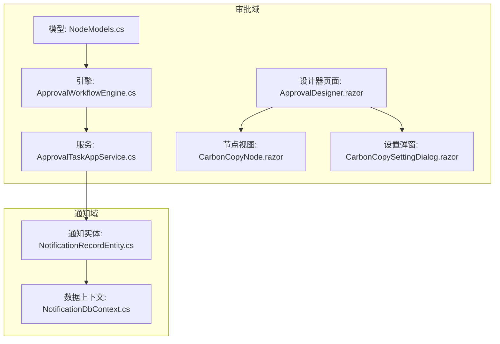
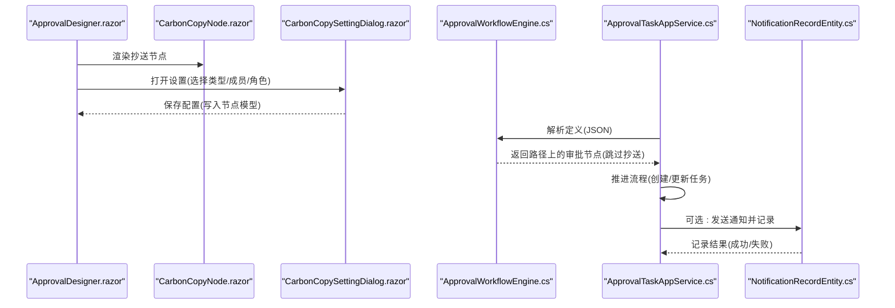
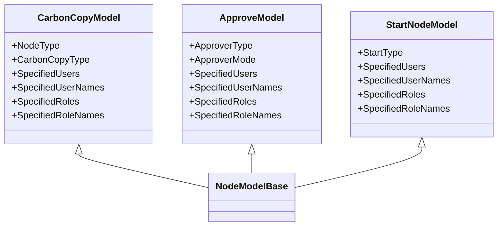
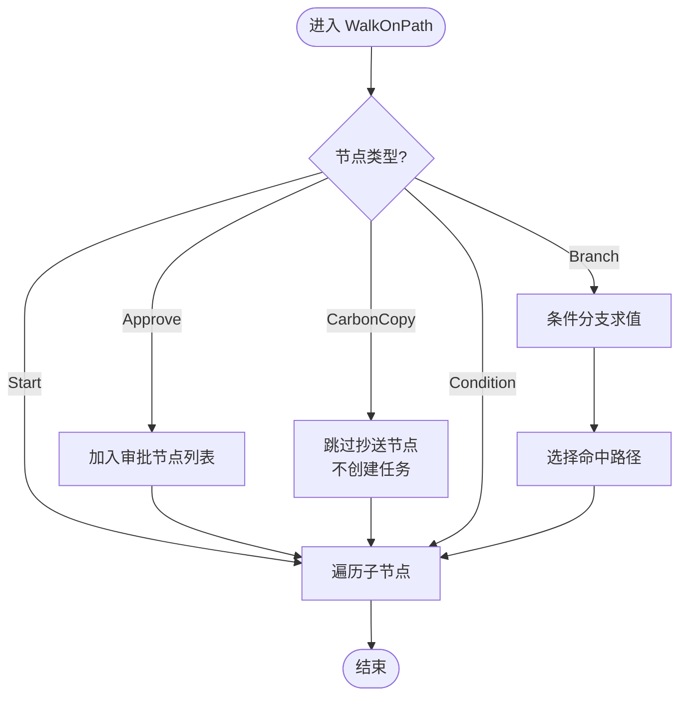
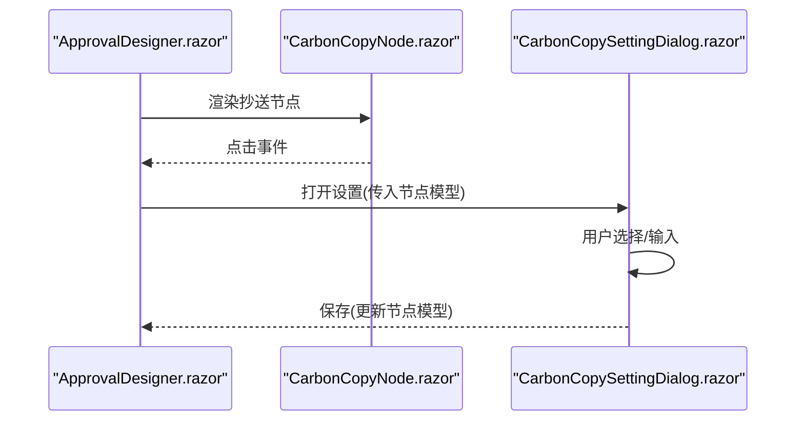
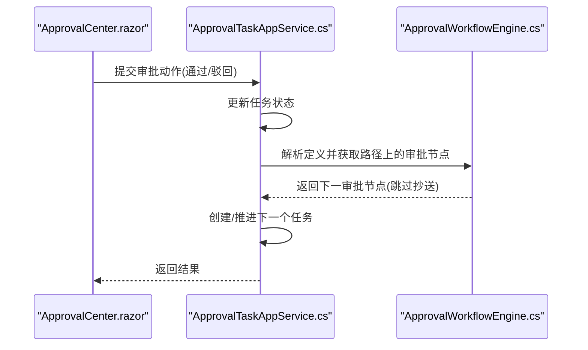
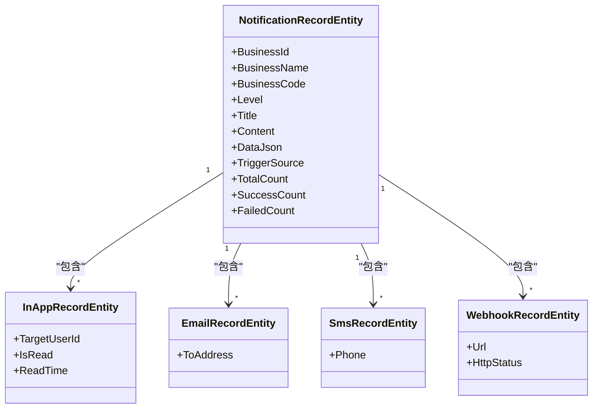
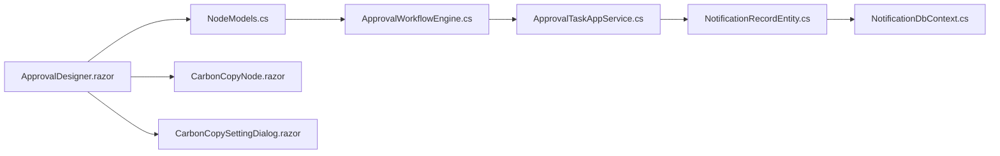

# 抄送节点

<cite>
**本文引用的文件**   
- [NodeModels.cs](file://src/Services/Approval/H.Approval.Application.Contracts/Workflow/NodeModels.cs)
- [ApprovalWorkflowEngine.cs](file://src/Services/Approval/H.Approval.Application/Services/ApprovalWorkflowEngine.cs)
- [CarbonCopyNode.razor](file://src/Services/Approval/H.Approval.Web/Components/Nodes/CarbonCopyNode.razor)
- [CarbonCopySettingDialog.razor](file://src/Services/Approval/H.Approval.Web/Components/Panels/CardonCopySettingDialog.razor)
- [ApprovalDesigner.razor](file://src/Services/Approval/H.Approval.Web/Pages/ApprovalDesigner.razor)
- [ApprovalTaskAppService.cs](file://src/Services/Approval/H.Approval.Application/Services/ApprovalTaskAppService.cs)
- [ApprovalCenter.razor](file://src/Services/Approval/H.Approval.Web/Pages/ApprovalCenter.razor)
- [NotificationRecordEntity.cs](file://src/Services/Notification/H.Notification.EntityFrameworkCore/Entities/NotificationRecordEntity.cs)
- [NotificationDbContext.cs](file://src/Services/Notification/H.Notification.EntityFrameworkCore/NotificationDbContext.cs)
</cite>

## 目录
1. [简介](#简介)
2. [项目结构](#项目结构)
3. [核心组件](#核心组件)
4. [架构总览](#架构总览)
5. [详细组件分析](#详细组件分析)
6. [依赖关系分析](#依赖关系分析)
7. [性能考虑](#性能考虑)
8. [故障排查指南](#故障排查指南)
9. [结论](#结论)
10. [附录](#附录)

## 简介
本章节面向“抄送节点”的完整说明，涵盖其作用与使用场景、人员设置方法（固定人员、动态获取、基于规则）、消息发送机制与通知方式、与审批节点的组合模式，以及抄送记录的查询与管理能力。抄送节点用于在流程中知会相关人员、记录流转轨迹、辅助监督与审计，不产生审批任务，仅作为信息同步与留痕环节。

## 项目结构
围绕抄送节点的相关代码分布在以下模块：
- 模型与枚举：定义抄送节点的数据结构与类型
- 工作流引擎：解析并遍历节点树，跳过抄送节点继续推进
- 设计器前端：可视化配置抄送节点及人员范围
- 应用服务：审批推进逻辑（含与抄送的交互）
- 通知子系统：提供站内信、邮件、短信、Webhook等通知通道与记录

**图表来源** 
- [NodeModels.cs](file://src/Services/Approval/H.Approval.Application.Contracts/Workflow/NodeModels.cs)
- [ApprovalWorkflowEngine.cs](file://src/Services/Approval/H.Approval.Application/Services/ApprovalWorkflowEngine.cs)
- [ApprovalTaskAppService.cs](file://src/Services/Approval/H.Approval.Application/Services/ApprovalTaskAppService.cs)
- [ApprovalDesigner.razor](file://src/Services/Approval/H.Approval.Web/Pages/ApprovalDesigner.razor)
- [CarbonCopyNode.razor](file://src/Services/Approval/H.Approval.Web/Components/Nodes/CarbonCopyNode.razor)
- [CarbonCopySettingDialog.razor](file://src/Services/Approval/H.Approval.Web/Components/Panels/CardonCopySettingDialog.razor)
- [NotificationRecordEntity.cs](file://src/Services/Notification/H.Notification.EntityFrameworkCore/Entities/NotificationRecordEntity.cs)
- [NotificationDbContext.cs](file://src/Services/Notification/H.Notification.EntityFrameworkCore/NotificationDbContext.cs)

**章节来源**
- [NodeModels.cs](file://src/Services/Approval/H.Approval.Application.Contracts/Workflow/NodeModels.cs)
- [ApprovalWorkflowEngine.cs](file://src/Services/Approval/H.Approval.Application/Services/ApprovalWorkflowEngine.cs)
- [ApprovalTaskAppService.cs](file://src/Services/Approval/H.Approval.Application/Services/ApprovalTaskAppService.cs)
- [ApprovalDesigner.razor](file://src/Services/Approval/H.Approval.Web/Pages/ApprovalDesigner.razor)
- [CarbonCopyNode.razor](file://src/Services/Approval/H.Approval.Web/Components/Nodes/CarbonCopyNode.razor)
- [CarbonCopySettingDialog.razor](file://src/Services/Approval/H.Approval.Web/Components/Panels/CardonCopySettingDialog.razor)
- [NotificationRecordEntity.cs](file://src/Services/Notification/H.Notification.EntityFrameworkCore/Entities/NotificationRecordEntity.cs)
- [NotificationDbContext.cs](file://src/Services/Notification/H.Notification.EntityFrameworkCore/NotificationDbContext.cs)

## 核心组件
- 抄送节点模型与枚举：定义抄送节点的数据结构、抄送人类型（指定成员、发起人自选、指定角色）
- 工作流引擎：解析节点树，遇到抄送节点直接跳过，不创建任务，继续后续节点
- 设计器与设置弹窗：支持选择抄送人类型、添加成员或输入角色名称
- 审批服务：推进流程时根据当前节点处理，抄送节点不参与任务生成
- 通知子系统：提供多渠道通知与记录存储，便于追踪抄送触达情况

**章节来源**
- [NodeModels.cs](file://src/Services/Approval/H.Approval.Application.Contracts/Workflow/NodeModels.cs)
- [ApprovalWorkflowEngine.cs](file://src/Services/Approval/H.Approval.Application/Services/ApprovalWorkflowEngine.cs)
- [CarbonCopySettingDialog.razor](file://src/Services/Approval/H.Approval.Web/Components/Panels/CardonCopySettingDialog.razor)
- [ApprovalTaskAppService.cs](file://src/Services/Approval/H.Approval.Application/Services/ApprovalTaskAppService.cs)
- [NotificationRecordEntity.cs](file://src/Services/Notification/H.Notification.EntityFrameworkCore/Entities/NotificationRecordEntity.cs)

## 架构总览
下图展示从设计器到运行时的整体流程：设计器配置抄送节点，运行时引擎解析并跳过抄送节点，审批服务推进流程；如需通知，可通过通知子系统记录与分发。

**图表来源** 
- [ApprovalDesigner.razor](file://src/Services/Approval/H.Approval.Web/Pages/ApprovalDesigner.razor)
- [CarbonCopyNode.razor](file://src/Services/Approval/H.Approval.Web/Components/Nodes/CarbonCopyNode.razor)
- [CarbonCopySettingDialog.razor](file://src/Services/Approval/H.Approval.Web/Components/Panels/CardonCopySettingDialog.razor)
- [ApprovalWorkflowEngine.cs](file://src/Services/Approval/H.Approval.Application/Services/ApprovalWorkflowEngine.cs)
- [ApprovalTaskAppService.cs](file://src/Services/Approval/H.Approval.Application/Services/ApprovalTaskAppService.cs)
- [NotificationRecordEntity.cs](file://src/Services/Notification/H.Notification.EntityFrameworkCore/Entities/NotificationRecordEntity.cs)

## 详细组件分析

### 抄送节点模型与枚举
- 抄送节点模型包含：
  - 抄送人类型：指定成员、发起人自选、指定角色
  - 指定成员ID与姓名列表
  - 指定角色ID与名称列表
- 这些字段在设计器中通过设置弹窗进行编辑与保存

**图表来源** 
- [NodeModels.cs](file://src/Services/Approval/H.Approval.Application.Contracts/Workflow/NodeModels.cs)

**章节来源**
- [NodeModels.cs](file://src/Services/Approval/H.Approval.Application.Contracts/Workflow/NodeModels.cs)

### 工作流引擎中的抄送处理
- 引擎在遍历节点路径时，对抄送节点直接跳过，不创建任何任务，继续处理子节点
- 条件分支求值后选择一条路径，最终汇总路径上的审批节点

**图表来源** 
- [ApprovalWorkflowEngine.cs](file://src/Services/Approval/H.Approval.Application/Services/ApprovalWorkflowEngine.cs)

**章节来源**
- [ApprovalWorkflowEngine.cs](file://src/Services/Approval/H.Approval.Application/Services/ApprovalWorkflowEngine.cs)

### 设计器与设置弹窗
- 设计器页面渲染抄送节点视图，点击打开设置弹窗
- 设置弹窗支持：
  - 选择抄送人类型（指定成员/发起人自选/指定角色）
  - 添加成员（用户选择器）或输入角色名称（逗号分隔）
  - 保存配置并回写至节点模型

**图表来源** 
- [ApprovalDesigner.razor](file://src/Services/Approval/H.Approval.Web/Pages/ApprovalDesigner.razor)
- [CarbonCopyNode.razor](file://src/Services/Approval/H.Approval.Web/Components/Nodes/CarbonCopyNode.razor)
- [CarbonCopySettingDialog.razor](file://src/Services/Approval/H.Approval.Web/Components/Panels/CardonCopySettingDialog.razor)

**章节来源**
- [ApprovalDesigner.razor](file://src/Services/Approval/H.Approval.Web/Pages/ApprovalDesigner.razor)
- [CarbonCopyNode.razor](file://src/Services/Approval/H.Approval.Web/Components/Nodes/CarbonCopyNode.razor)
- [CarbonCopySettingDialog.razor](file://src/Services/Approval/H.Approval.Web/Components/Panels/CardonCopySettingDialog.razor)

### 审批服务与抄送的交互
- 审批服务在处理任务推进时，依据工作流引擎返回的路径节点进行处理
- 抄送节点不会产生任务，因此不会出现在任务列表中；流程直接推进到下一个审批节点

**图表来源** 
- [ApprovalCenter.razor](file://src/Services/Approval/H.Approval.Web/Pages/ApprovalCenter.razor)
- [ApprovalTaskAppService.cs](file://src/Services/Approval/H.Approval.Application/Services/ApprovalTaskAppService.cs)
- [ApprovalWorkflowEngine.cs](file://src/Services/Approval/H.Approval.Application/Services/ApprovalWorkflowEngine.cs)

**章节来源**
- [ApprovalTaskAppService.cs](file://src/Services/Approval/H.Approval.Application/Services/ApprovalTaskAppService.cs)
- [ApprovalCenter.razor](file://src/Services/Approval/H.Approval.Web/Pages/ApprovalCenter.razor)

### 通知与记录
- 通知子系统提供多渠道（站内信、邮件、短信、Webhook）发送与记录能力
- 抄送触发时可调用通知服务，记录发送结果以便审计与追踪

**图表来源** 
- [NotificationRecordEntity.cs](file://src/Services/Notification/H.Notification.EntityFrameworkCore/Entities/NotificationRecordEntity.cs)

**章节来源**
- [NotificationRecordEntity.cs](file://src/Services/Notification/H.Notification.EntityFrameworkCore/Entities/NotificationRecordEntity.cs)
- [NotificationDbContext.cs](file://src/Services/Notification/H.Notification.EntityFrameworkCore/NotificationDbContext.cs)

## 依赖关系分析
- 抄送节点模型被设计器与服务层共同使用
- 工作流引擎依赖模型解析与条件求值
- 审批服务依赖引擎获取路径节点，避免为抄送节点创建任务
- 通知子系统独立于审批域，通过记录实体关联业务事件

**图表来源** 
- [NodeModels.cs](file://src/Services/Approval/H.Approval.Application.Contracts/Workflow/NodeModels.cs)
- [ApprovalWorkflowEngine.cs](file://src/Services/Approval/H.Approval.Application/Services/ApprovalWorkflowEngine.cs)
- [ApprovalTaskAppService.cs](file://src/Services/Approval/H.Approval.Application/Services/ApprovalTaskAppService.cs)
- [ApprovalDesigner.razor](file://src/Services/Approval/H.Approval.Web/Pages/ApprovalDesigner.razor)
- [CarbonCopyNode.razor](file://src/Services/Approval/H.Approval.Web/Components/Nodes/CarbonCopyNode.razor)
- [CarbonCopySettingDialog.razor](file://src/Services/Approval/H.Approval.Web/Components/Panels/CardonCopySettingDialog.razor)
- [NotificationRecordEntity.cs](file://src/Services/Notification/H.Notification.EntityFrameworkCore/Entities/NotificationRecordEntity.cs)
- [NotificationDbContext.cs](file://src/Services/Notification/H.Notification.EntityFrameworkCore/NotificationDbContext.cs)

**章节来源**
- [NodeModels.cs](file://src/Services/Approval/H.Approval.Application.Contracts/Workflow/NodeModels.cs)
- [ApprovalWorkflowEngine.cs](file://src/Services/Approval/H.Approval.Application/Services/ApprovalWorkflowEngine.cs)
- [ApprovalTaskAppService.cs](file://src/Services/Approval/H.Approval.Application/Services/ApprovalTaskAppService.cs)
- [ApprovalDesigner.razor](file://src/Services/Approval/H.Approval.Web/Pages/ApprovalDesigner.razor)
- [CarbonCopyNode.razor](file://src/Services/Approval/H.Approval.Web/Components/Nodes/CarbonCopyNode.razor)
- [CarbonCopySettingDialog.razor](file://src/Services/Approval/H.Approval.Web/Components/Panels/CardonCopySettingDialog.razor)
- [NotificationRecordEntity.cs](file://src/Services/Notification/H.Notification.EntityFrameworkCore/Entities/NotificationRecordEntity.cs)
- [NotificationDbContext.cs](file://src/Services/Notification/H.Notification.EntityFrameworkCore/NotificationDbContext.cs)

## 性能考虑
- 抄送节点不产生任务，减少任务表写入与查询压力
- 条件分支求值采用字符串比较与简单数值转换，复杂度低
- 通知记录批量写入可结合事务与异步队列提升吞吐
- 设计器侧的用户选择器建议分页加载与缓存常用用户

[本节为通用指导，无需特定文件引用]

## 故障排查指南
- 抄送未生效：检查节点模型是否正确保存抄送人类型与成员列表
- 流程卡住：确认引擎解析的定义JSON有效且路径上存在后续审批节点
- 通知未送达：查看通知记录实体的状态与错误信息，检查渠道配置
- 前端显示异常：核对设置弹窗是否更新了节点模型的字段

**章节来源**
- [ApprovalWorkflowEngine.cs](file://src/Services/Approval/H.Approval.Application/Services/ApprovalWorkflowEngine.cs)
- [NotificationRecordEntity.cs](file://src/Services/Notification/H.Notification.EntityFrameworkCore/Entities/NotificationRecordEntity.cs)

## 结论
抄送节点在审批流程中承担信息同步与留痕职责，不阻塞流程推进。通过设计器灵活配置抄送人员，结合通知子系统实现多渠道触达与记录，满足知会、轨迹记录与监督需求。建议在复杂流程中合理布置抄送节点，确保关键干系人及时获知进展。

[本节为总结性内容，无需特定文件引用]

## 附录
- 使用场景示例：
  - 知会相关人员：在审批通过后抄送部门主管与合规人员
  - 记录流转轨迹：在每个关键节点后插入抄送，形成完整审计链
  - 通知监督：对高风险操作增加抄送与通知，便于监控与回溯
- 最佳实践：
  - 明确抄送目的，避免过度抄送造成信息噪音
  - 使用角色抄送降低维护成本，定期复核角色成员有效性
  - 结合条件分支实现差异化抄送策略

[本节为概念性内容，无需特定文件引用]