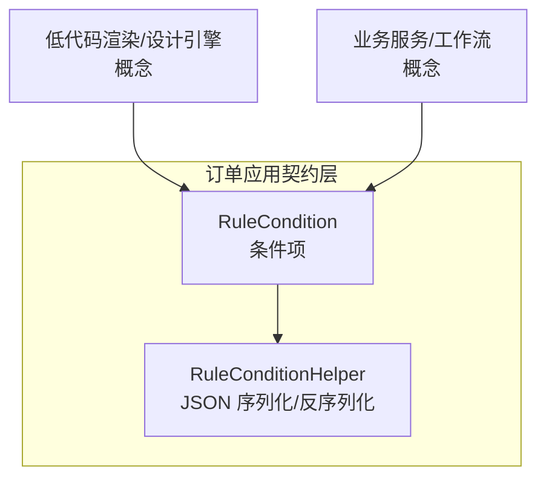
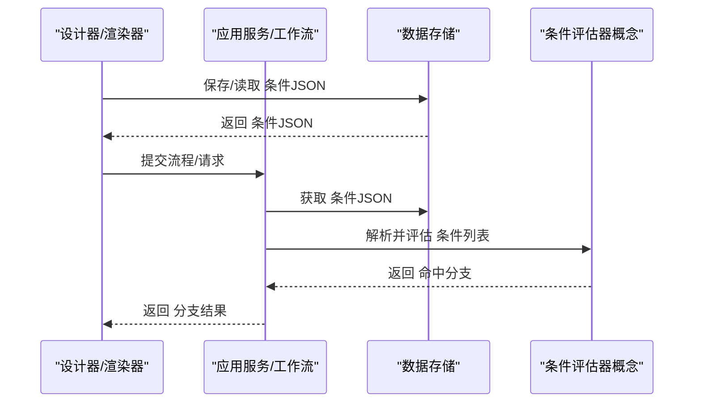
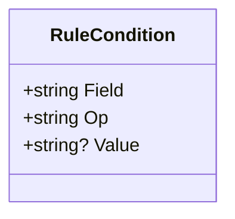
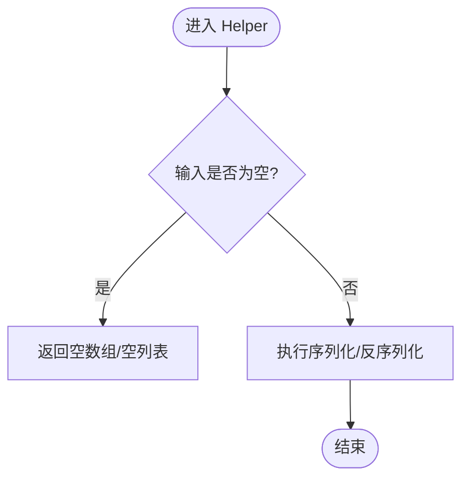
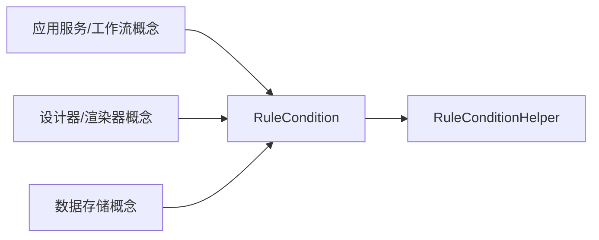

# 条件分支节点

<cite>
**本文引用的文件**   
- [RuleCondition.cs](file://src/Services/Order/H.Order.Application.Contracts/Dtos/RuleCondition.cs)
</cite>

## 目录
1. [简介](#简介)
2. [项目结构](#项目结构)
3. [核心组件](#核心组件)
4. [架构总览](#架构总览)
5. [详细组件分析](#详细组件分析)
6. [依赖关系分析](#依赖关系分析)
7. [性能考虑](#性能考虑)
8. [故障排查指南](#故障排查指南)
9. [结论](#结论)
10. [附录](#附录)

## 简介
本章节面向“条件分支节点”的使用与实现，聚焦以下目标：
- 条件表达式的编写语法与可用变量说明
- 多分支配置、条件优先级与默认分支处理
- 数据来源（表单字段、用户信息、系统变量）的接入方式
- 复杂业务场景下的设计模式与性能优化建议
- 调试工具与错误排查方法

在仓库中，条件分支的最小规则引擎结构由订单应用契约层的条件模型提供。该模型定义了条件项的结构、操作符集合以及 JSON 序列化/反序列化的辅助能力，为低代码平台中的条件分支节点提供了数据契约基础。

**章节来源**
- [RuleCondition.cs:1-47](file://src/Services/Order/H.Order.Application.Contracts/Dtos/RuleCondition.cs#L1-L47)

## 项目结构
围绕条件分支节点的相关代码主要位于订单应用的契约层 DTO 定义中，用于描述最小规则引擎的条件结构。该结构以 JSON 形式存储条件列表，便于跨层传递与持久化。

**图示来源**
- [RuleCondition.cs:1-47](file://src/Services/Order/H.Order.Application.Contracts/Dtos/RuleCondition.cs#L1-L47)

**章节来源**
- [RuleCondition.cs:1-47](file://src/Services/Order/H.Order.Application.Contracts/Dtos/RuleCondition.cs#L1-L47)

## 核心组件
- RuleCondition：表示单个条件项，包含匹配字段、操作符与目标值。多个条件之间采用“与（AND）”关系，全部命中才视为规则命中。
- RuleConditionHelper：提供条件列表到 JSON 字符串的序列化与从 JSON 字符串反序列化为条件列表的能力，统一使用 Web 默认选项进行序列化。

关键要点：
- Field：匹配字段名（如行业、产品类别、金额、订单状态等）。
- Op：操作符，支持 eq、ne、in、gt、lt、gte、lte、between、contains。
- Value：目标值，不同操作符对值的格式有不同要求（单值、逗号分隔多值、数值、“min,max”区间等）。
- 条件列表整体以 JSON 数组形式存储，空或 null 时返回空数组。

**章节来源**
- [RuleCondition.cs:10-27](file://src/Services/Order/H.Order.Application.Contracts/Dtos/RuleCondition.cs#L10-L27)
- [RuleCondition.cs:32-47](file://src/Services/Order/H.Order.Application.Contracts/Dtos/RuleCondition.cs#L32-L47)

## 架构总览
条件分支节点在系统中的典型位置与交互如下：
- 设计器/渲染器：负责展示与编辑条件分支，生成/读取 JSON 条件。
- 应用服务/工作流：解析 JSON 条件，结合运行时上下文（表单数据、用户信息、系统变量）执行判断。
- 数据存储：持久化条件配置（JSON 文本），并在需要时加载。

[此图为概念性流程图，不直接映射具体源码文件]

## 详细组件分析

### 条件项模型（RuleCondition）
- 字段语义
  - Field：用于标识参与比较的键路径或属性名。
  - Op：比较操作符，决定如何解释 Value 与 Field 的值。
  - Value：比较目标值，根据操作符类型有不同的格式约定。
- 语义约束
  - 多个条件项之间是“与（AND）”关系，即所有条件都必须满足才算命中。
  - 当条件列表为空或 null 时，按空数组处理。

**图示来源**
- [RuleCondition.cs:10-27](file://src/Services/Order/H.Order.Application.Contracts/Dtos/RuleCondition.cs#L10-L27)

**章节来源**
- [RuleCondition.cs:10-27](file://src/Services/Order/H.Order.Application.Contracts/Dtos/RuleCondition.cs#L10-L27)

### 条件序列化助手（RuleConditionHelper）
- ToJson：将条件列表序列化为 JSON 字符串；若输入为空则返回空数组字符串。
- FromJson：从 JSON 字符串反序列化为条件列表；若输入为空则返回空列表。
- 使用 Web 默认序列化选项，确保与 HTTP API 行为一致。

**图示来源**
- [RuleCondition.cs:32-47](file://src/Services/Order/H.Order.Application.Contracts/Dtos/RuleCondition.cs#L32-L47)

**章节来源**
- [RuleCondition.cs:32-47](file://src/Services/Order/H.Order.Application.Contracts/Dtos/RuleCondition.cs#L32-L47)

### 条件表达式语法与可用变量
- 语法要点
  - 条件列表为 JSON 数组，每项包含 Field、Op、Value。
  - 多个条件项之间为“与（AND）”关系，全部命中才视为规则命中。
  - 操作符与值的对应关系需严格遵循约定（见下表）。
- 可用变量来源（概念性说明）
  - 表单字段：来自页面/表单的数据绑定，通常通过 Field 指向具体的键路径。
  - 用户信息：当前登录用户的属性（如角色、部门、权限等），可通过 Field 映射到用户对象属性。
  - 系统变量：运行时的系统级上下文（如时间戳、租户ID、环境标志等），同样通过 Field 映射。

注意：以上变量来源为通用实践说明，具体 Field 命名与可访问属性取决于上层数据模型的约定。

**章节来源**
- [RuleCondition.cs:10-27](file://src/Services/Order/H.Order.Application.Contracts/Dtos/RuleCondition.cs#L10-L27)

### 多分支设置、条件优先级与默认分支
- 多分支设置
  - 通过多条规则（每条规则含一组条件）实现多分支。
  - 规则内部的条件为“与（AND）”，规则之间的选择顺序即为优先级顺序。
- 条件优先级
  - 建议将更精确、更常见的规则置于前面，以减少不必要的评估。
- 默认分支处理
  - 若没有任何规则命中，应提供默认分支作为兜底逻辑。
  - 可在应用服务层对“无命中”的情况进行统一处理。

[本节为概念性说明，不直接引用具体源码文件]

### 数据来源接入（表单字段、用户信息、系统变量）
- 表单字段
  - 将页面/表单数据映射为对象后，通过 Field 指定键路径进行取值比较。
- 用户信息
  - 将当前用户对象注入到评估上下文，Field 指向用户对象的属性路径。
- 系统变量
  - 将系统上下文（如租户、环境、时间）注入到评估上下文，Field 指向相应属性。

[本节为概念性说明，不直接引用具体源码文件]

### 复杂业务场景的设计模式与性能优化
- 设计模式
  - 规则链模式：将多条规则按优先级排序，依次评估直至命中。
  - 短路评估：一旦某条规则的所有条件都满足，立即返回该分支，避免后续评估。
  - 缓存策略：对热点规则或频繁评估的结果进行缓存，减少重复计算。
- 性能优化
  - 将高频匹配的条件前置，降低平均评估成本。
  - 对数值型比较（gt、lt、gte、lte）优先使用数值类型，避免字符串转换开销。
  - 批量评估时复用上下文对象，减少对象创建与 GC 压力。

[本节为概念性说明，不直接引用具体源码文件]

## 依赖关系分析
条件分支的核心依赖集中在条件模型与序列化助手上，其他模块通过 JSON 文本进行交互。

**图示来源**
- [RuleCondition.cs:10-27](file://src/Services/Order/H.Order.Application.Contracts/Dtos/RuleCondition.cs#L10-L27)
- [RuleCondition.cs:32-47](file://src/Services/Order/H.Order.Application.Contracts/Dtos/RuleCondition.cs#L32-L47)

**章节来源**
- [RuleCondition.cs:10-27](file://src/Services/Order/H.Order.Application.Contracts/Dtos/RuleCondition.cs#L10-L27)
- [RuleCondition.cs:32-47](file://src/Services/Order/H.Order.Application.Contracts/Dtos/RuleCondition.cs#L32-L47)

## 性能考虑
- 条件数量控制：尽量精简条件项，避免过深的嵌套与冗余比较。
- 操作符选择：优先使用等值与范围比较，减少字符串模糊匹配带来的开销。
- 上下文复用：在批量评估中复用数据上下文，避免重复构造。
- 缓存热点：对常见规则组合与结果进行缓存，提升响应速度。

[本节为通用性能建议，不直接引用具体源码文件]

## 故障排查指南
- 常见问题
  - JSON 格式错误：检查条件数组结构是否符合约定，确保 Field、Op、Value 存在且类型正确。
  - 操作符与值不匹配：例如 in 操作符未提供逗号分隔的多值，between 未提供“min,max”格式。
  - 字段路径不存在：确认 Field 指向的键路径在上下文中确实存在。
- 排查步骤
  - 打印原始 JSON 条件，验证结构与内容。
  - 逐步缩小条件范围，定位问题条件项。
  - 校验操作符与值的格式是否符合约定。
  - 检查上下文数据是否完整，必要时增加日志输出。

**章节来源**
- [RuleCondition.cs:10-27](file://src/Services/Order/H.Order.Application.Contracts/Dtos/RuleCondition.cs#L10-L27)
- [RuleCondition.cs:32-47](file://src/Services/Order/H.Order.Application.Contracts/Dtos/RuleCondition.cs#L32-L47)

## 结论
条件分支节点以最小规则引擎结构为基础，通过 JSON 条件列表实现灵活的条件判断。借助明确的字段、操作符与值约定，可以在表单字段、用户信息与系统变量的基础上构建复杂的业务分支逻辑。通过合理的设计模式与性能优化，能够在保证可读性与可维护性的同时，获得良好的运行效率。

[本节为总结性内容，不直接引用具体源码文件]

## 附录
- 操作符与值格式参考
  - eq/ne：单值
  - in：逗号分隔多值
  - gt/lt/gte/lte：数值
  - between：“min,max”
  - contains：子串匹配

**章节来源**
- [RuleCondition.cs:10-27](file://src/Services/Order/H.Order.Application.Contracts/Dtos/RuleCondition.cs#L10-L27)