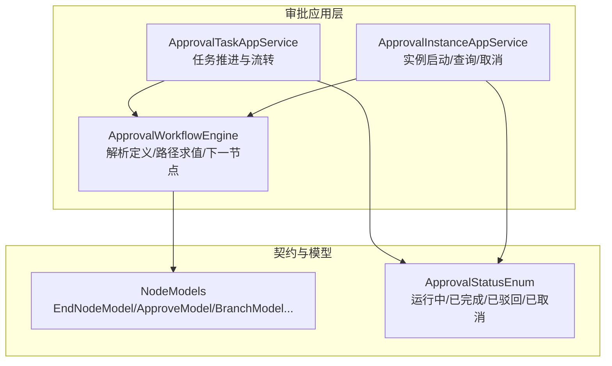
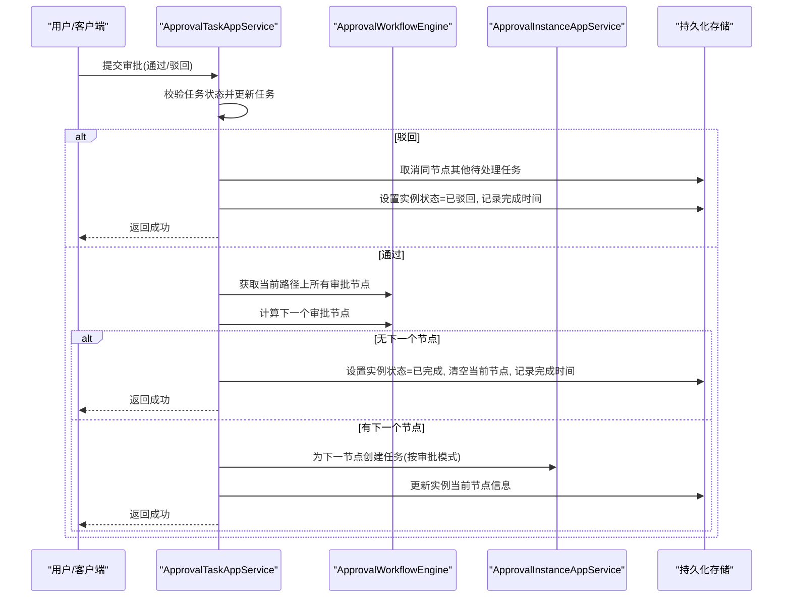
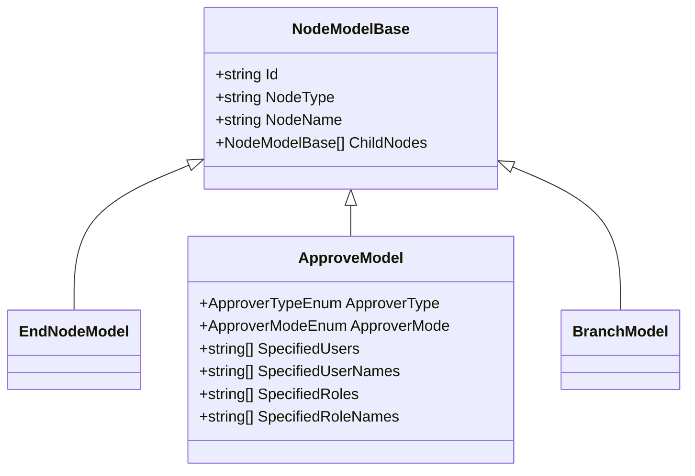
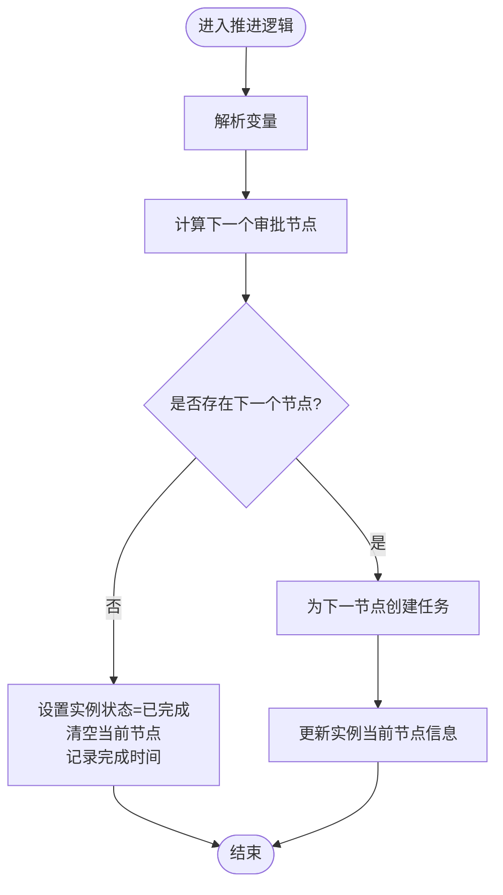
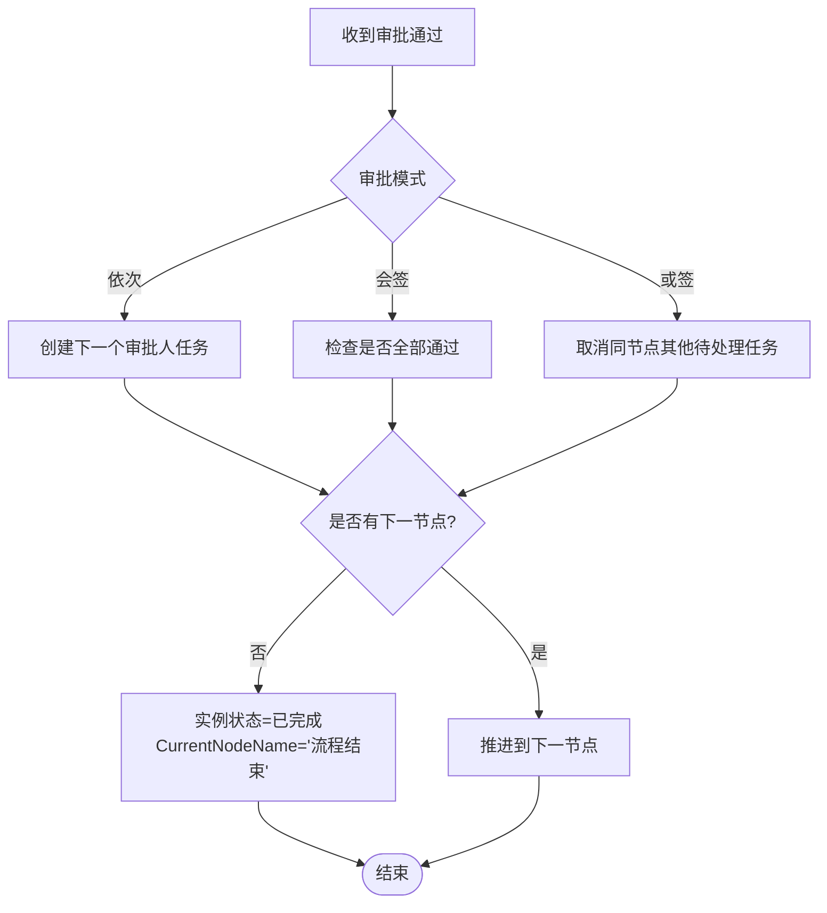
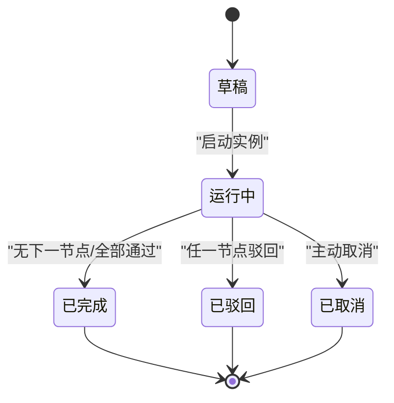
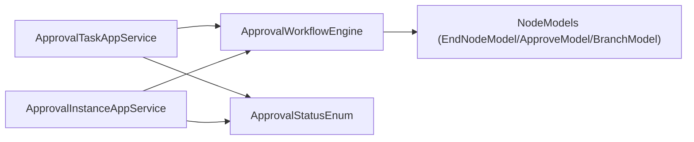

# 结束节点

<cite>
**本文引用的文件**   
- [NodeModels.cs](file://src/Services/Approval/H.Approval.Application.Contracts/Workflow/NodeModels.cs)
- [ApprovalTaskAppService.cs](file://src/Services/Approval/H.Approval.Application/Services/ApprovalTaskAppService.cs)
- [ApprovalWorkflowEngine.cs](file://src/Services/Approval/H.Approval.Application/Services/ApprovalWorkflowEngine.cs)
- [ApprovalInstanceAppService.cs](file://src/Services/Approval/H.Approval.Application/Services/ApprovalInstanceAppService.cs)
- [ApprovalStatusEnum.cs](file://src/Services/Approval/H.Approval.Application.Contracts/Enums/ApprovalStatusEnum.cs)
</cite>

## 目录
1. [简介](#简介)
2. [项目结构](#项目结构)
3. [核心组件](#核心组件)
4. [架构总览](#架构总览)
5. [详细组件分析](#详细组件分析)
6. [依赖关系分析](#依赖关系分析)
7. [性能考量](#性能考量)
8. [故障排查指南](#故障排查指南)
9. [结论](#结论)
10. [附录](#附录)

## 简介
本章节围绕“结束节点”在审批流程中的作用与实现进行系统化说明。结束节点用于标识流程的终止，当引擎推进到最后一个审批节点且无后续节点时，即进入“流程结束”状态。文档涵盖：
- 结束节点在流程中的定位与触发条件
- 流程状态更新、结果数据保存、后续动作触发机制
- 多个结束节点的处理策略与终止条件
- 与其他系统的集成方式与扩展点
- 流程完成后的数据清理与资源释放建议

## 项目结构
与结束节点相关的代码集中在审批服务模块中，主要涉及模型定义、工作流引擎、任务推进与实例生命周期管理。

图表来源
- [ApprovalTaskAppService.cs](file://src/Services/Approval/H.Approval.Application/Services/ApprovalTaskAppService.cs)
- [ApprovalInstanceAppService.cs](file://src/Services/Approval/H.Approval.Application/Services/ApprovalInstanceAppService.cs)
- [ApprovalWorkflowEngine.cs](file://src/Services/Approval/H.Approval.Application/Services/ApprovalWorkflowEngine.cs)
- [NodeModels.cs](file://src/Services/Approval/H.Approval.Application.Contracts/Workflow/NodeModels.cs)
- [ApprovalStatusEnum.cs](file://src/Services/Approval/H.Approval.Application.Contracts/Enums/ApprovalStatusEnum.cs)

章节来源
- [ApprovalTaskAppService.cs](file://src/Services/Approval/H.Approval.Application/Services/ApprovalTaskAppService.cs)
- [ApprovalInstanceAppService.cs](file://src/Services/Approval/H.Approval.Application/Services/ApprovalInstanceAppService.cs)
- [ApprovalWorkflowEngine.cs](file://src/Services/Approval/H.Approval.Application/Services/ApprovalWorkflowEngine.cs)
- [NodeModels.cs](file://src/Services/Approval/H.Approval.Application.Contracts/Workflow/NodeModels.cs)
- [ApprovalStatusEnum.cs](file://src/Services/Approval/H.Approval.Application.Contracts/Enums/ApprovalStatusEnum.cs)

## 核心组件
- 结束节点模型：EndNodeModel 继承自 NodeModelBase，表示流程的终止节点。
- 工作流引擎：负责解析流程定义、计算当前路径上的审批节点序列、判断下一个节点；当无下一个节点时，视为到达结束。
- 任务推进服务：根据审批模式（依次/会签/或签）推进任务，并在无后续节点时将实例标记为完成。
- 实例服务：负责实例的创建、状态更新、任务批量创建等。
- 状态枚举：Completed 表示流程完成，Rejected 表示被驳回而终止。

章节来源
- [NodeModels.cs](file://src/Services/Approval/H.Approval.Application.Contracts/Workflow/NodeModels.cs)
- [ApprovalWorkflowEngine.cs](file://src/Services/Approval/H.Approval.Application/Services/ApprovalWorkflowEngine.cs)
- [ApprovalTaskAppService.cs](file://src/Services/Approval/H.Approval.Application/Services/ApprovalTaskAppService.cs)
- [ApprovalInstanceAppService.cs](file://src/Services/Approval/H.Approval.Application/Services/ApprovalInstanceAppService.cs)
- [ApprovalStatusEnum.cs](file://src/Services/Approval/H.Approval.Application.Contracts/Enums/ApprovalStatusEnum.cs)

## 架构总览
下图展示了从一次审批操作到流程结束的完整调用链，以及结束节点的触发时机。

图表来源
- [ApprovalTaskAppService.cs](file://src/Services/Approval/H.Approval.Application/Services/ApprovalTaskAppService.cs)
- [ApprovalWorkflowEngine.cs](file://src/Services/Approval/H.Approval.Application/Services/ApprovalWorkflowEngine.cs)
- [ApprovalInstanceAppService.cs](file://src/Services/Approval/H.Approval.Application/Services/ApprovalInstanceAppService.cs)

## 详细组件分析

### 结束节点模型与类型体系
- EndNodeModel 作为流程终止的语义节点，通常由设计器生成在流程末端。
- 引擎在计算路径时，若遍历至最后一条审批路径且无后续节点，则判定为结束。

图表来源
- [NodeModels.cs](file://src/Services/Approval/H.Approval.Application.Contracts/Workflow/NodeModels.cs)

章节来源
- [NodeModels.cs](file://src/Services/Approval/H.Approval.Application.Contracts/Workflow/NodeModels.cs)

### 工作流引擎对“结束”的判断逻辑
- 引擎通过 GetApproveNodesOnPath 收集当前变量条件下的审批节点序列。
- AdvanceToNextNode 使用 GetNextApprove 查找下一个节点；若返回 null，则视为到达结束。
- 此时将实例状态置为 Completed，清空 CurrentNodeId，CurrentNodeName 设置为“流程结束”，并记录 CompletionTime。

图表来源
- [ApprovalWorkflowEngine.cs](file://src/Services/Approval/H.Approval.Application/Services/ApprovalWorkflowEngine.cs)
- [ApprovalTaskAppService.cs](file://src/Services/Approval/H.Approval.Application/Services/ApprovalTaskAppService.cs)

章节来源
- [ApprovalWorkflowEngine.cs](file://src/Services/Approval/H.Approval.Application/Services/ApprovalWorkflowEngine.cs)
- [ApprovalTaskAppService.cs](file://src/Services/Approval/H.Approval.Application/Services/ApprovalTaskAppService.cs)

### 任务推进与多审批模式下的结束策略
- 依次审批：逐个创建任务，直到最后一个审批人通过后继续推进；若无下一节点则结束。
- 会签：等待所有审批人通过后再推进；全部通过后若无下一节点则结束。
- 或签：一人通过即可，取消同节点其他待处理任务；若无下一节点则结束。
- 驳回：直接终止流程，实例状态设为 Rejected，并记录完成时间。

图表来源
- [ApprovalTaskAppService.cs](file://src/Services/Approval/H.Approval.Application/Services/ApprovalTaskAppService.cs)

章节来源
- [ApprovalTaskAppService.cs](file://src/Services/Approval/H.Approval.Application/Services/ApprovalTaskAppService.cs)

### 实例状态与结束标志
- 运行中：Running
- 已完成：Completed（正常结束）
- 已驳回：Rejected（提前终止）
- 已取消：Cancelled（主动取消）

图表来源
- [ApprovalStatusEnum.cs](file://src/Services/Approval/H.Approval.Application.Contracts/Enums/ApprovalStatusEnum.cs)
- [ApprovalInstanceAppService.cs](file://src/Services/Approval/H.Approval.Application/Services/ApprovalInstanceAppService.cs)
- [ApprovalTaskAppService.cs](file://src/Services/Approval/H.Approval.Application/Services/ApprovalTaskAppService.cs)

章节来源
- [ApprovalStatusEnum.cs](file://src/Services/Approval/H.Approval.Application.Contracts/Enums/ApprovalStatusEnum.cs)
- [ApprovalInstanceAppService.cs](file://src/Services/Approval/H.Approval.Application/Services/ApprovalInstanceAppService.cs)
- [ApprovalTaskAppService.cs](file://src/Services/Approval/H.Approval.Application/Services/ApprovalTaskAppService.cs)

### 多个结束节点的处理策略
- 当前实现以“无下一审批节点”作为结束条件，不强制要求显式的 EndNodeModel 存在。
- 若设计器配置了多个结束分支，引擎仍会在最后一条路径推进后判定结束。
- 建议在模板或业务侧统一命名“流程结束”，便于审计与展示。

章节来源
- [ApprovalWorkflowEngine.cs](file://src/Services/Approval/H.Approval.Application/Services/ApprovalWorkflowEngine.cs)
- [ApprovalTaskAppService.cs](file://src/Services/Approval/H.Approval.Application/Services/ApprovalTaskAppService.cs)

### 与其他系统的集成与扩展点
- 事件/通知：可在实例状态变更为 Completed/Rejected 时触发通知服务（例如发送邮件、站内信）。
- 外部系统：在完成后可调用下游系统接口（如归档、结算、报表生成）。
- 扩展点建议：
  - 在 ApprovalTaskAppService 推进完成后增加后置钩子（PostAdvance），用于执行自定义动作。
  - 在 ApprovalInstanceAppService 的状态变更处增加事件总线发布，供订阅者消费。

章节来源
- [ApprovalTaskAppService.cs](file://src/Services/Approval/H.Approval.Application/Services/ApprovalTaskAppService.cs)
- [ApprovalInstanceAppService.cs](file://src/Services/Approval/H.Approval.Application/Services/ApprovalInstanceAppService.cs)

### 流程完成后的数据清理与资源释放
- 当前实现未包含显式的数据清理逻辑。
- 建议：
  - 对临时中间数据（如缓存、会话）在 Completed/Rejected 后进行清理。
  - 对大对象或附件进行归档或压缩，释放存储空间。
  - 清理异步任务队列中的相关条目，避免重复执行。

[本节为通用指导，不直接分析具体文件]

## 依赖关系分析
- ApprovalTaskAppService 依赖 ApprovalWorkflowEngine 进行路径计算与下一节点决策。
- ApprovalInstanceAppService 依赖 ApprovalWorkflowEngine 和仓储进行实例生命周期管理。
- 结束判定发生在任务推进阶段，由引擎返回“无下一节点”驱动。

图表来源
- [ApprovalTaskAppService.cs](file://src/Services/Approval/H.Approval.Application/Services/ApprovalTaskAppService.cs)
- [ApprovalInstanceAppService.cs](file://src/Services/Approval/H.Approval.Application/Services/ApprovalInstanceAppService.cs)
- [ApprovalWorkflowEngine.cs](file://src/Services/Approval/H.Approval.Application/Services/ApprovalWorkflowEngine.cs)
- [NodeModels.cs](file://src/Services/Approval/H.Approval.Application.Contracts/Workflow/NodeModels.cs)
- [ApprovalStatusEnum.cs](file://src/Services/Approval/H.Approval.Application.Contracts/Enums/ApprovalStatusEnum.cs)

章节来源
- [ApprovalTaskAppService.cs](file://src/Services/Approval/H.Approval.Application/Services/ApprovalTaskAppService.cs)
- [ApprovalInstanceAppService.cs](file://src/Services/Approval/H.Approval.Application/Services/ApprovalInstanceAppService.cs)
- [ApprovalWorkflowEngine.cs](file://src/Services/Approval/H.Approval.Application/Services/ApprovalWorkflowEngine.cs)
- [NodeModels.cs](file://src/Services/Approval/H.Approval.Application.Contracts/Workflow/NodeModels.cs)
- [ApprovalStatusEnum.cs](file://src/Services/Approval/H.Approval.Application.Contracts/Enums/ApprovalStatusEnum.cs)

## 性能考量
- 路径计算复杂度与审批节点数量线性相关，应避免过深的分支与过多审批人。
- 会签模式下需统计同节点任务状态，注意批量查询与更新的事务性。
- 在高并发场景下，确保任务推进的幂等性与锁机制，防止重复推进。

[本节为通用指导，不直接分析具体文件]

## 故障排查指南
- 常见问题：
  - 流程未结束：检查是否还有未处理的审批任务或分支条件未满足。
  - 状态异常：确认 Completed/Rejected 的赋值时机与事务一致性。
  - 任务重复：检查幂等控制与并发锁。
- 日志关键字：
  - “流程结束”、“已完成”、“已驳回”、“取消同节点其他待处理任务”。

章节来源
- [ApprovalTaskAppService.cs](file://src/Services/Approval/H.Approval.Application/Services/ApprovalTaskAppService.cs)
- [ApprovalInstanceAppService.cs](file://src/Services/Approval/H.Approval.Application/Services/ApprovalInstanceAppService.cs)

## 结论
结束节点在当前实现中以“无下一审批节点”作为终止条件，配合状态枚举与实例字段更新，形成清晰的流程结束语义。通过扩展事件与钩子，可轻松对接通知与外部系统，提升整体流程的可观测性与可集成性。

[本节为总结，不直接分析具体文件]

## 附录
- 关键类与方法参考路径：
  - 结束节点模型：[NodeModels.cs](file://src/Services/Approval/H.Approval.Application.Contracts/Workflow/NodeModels.cs)
  - 推进与结束判定：[ApprovalTaskAppService.cs](file://src/Services/Approval/H.Approval.Application/Services/ApprovalTaskAppService.cs)
  - 路径求值与下一节点：[ApprovalWorkflowEngine.cs](file://src/Services/Approval/H.Approval.Application/Services/ApprovalWorkflowEngine.cs)
  - 实例生命周期：[ApprovalInstanceAppService.cs](file://src/Services/Approval/H.Approval.Application/Services/ApprovalInstanceAppService.cs)
  - 状态枚举：[ApprovalStatusEnum.cs](file://src/Services/Approval/H.Approval.Application.Contracts/Enums/ApprovalStatusEnum.cs)