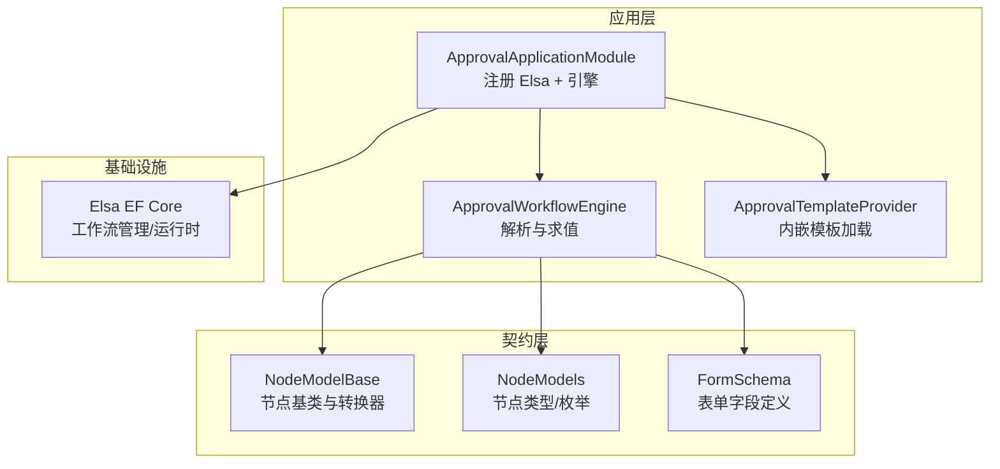
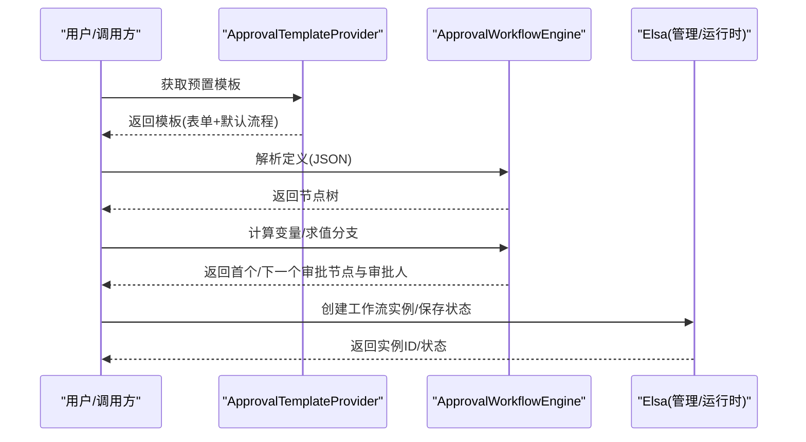
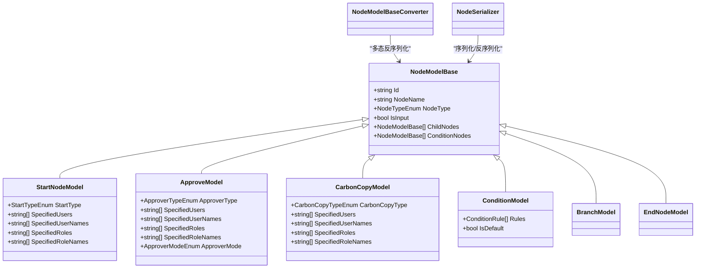
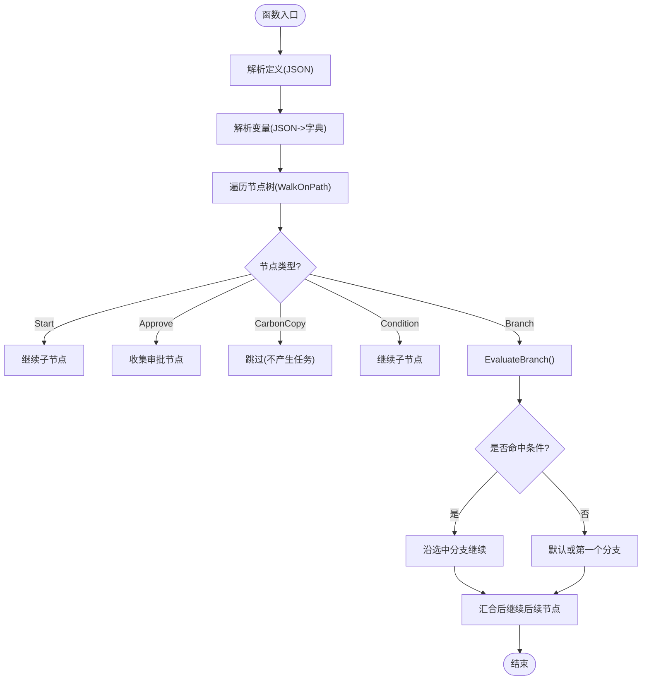
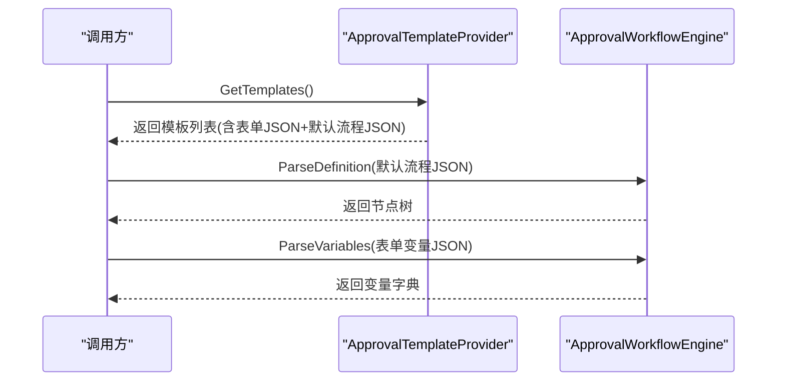
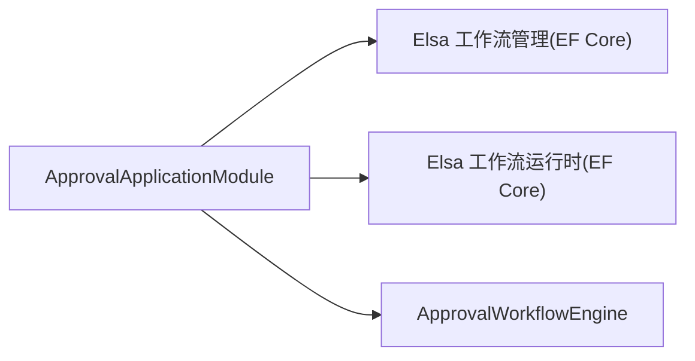
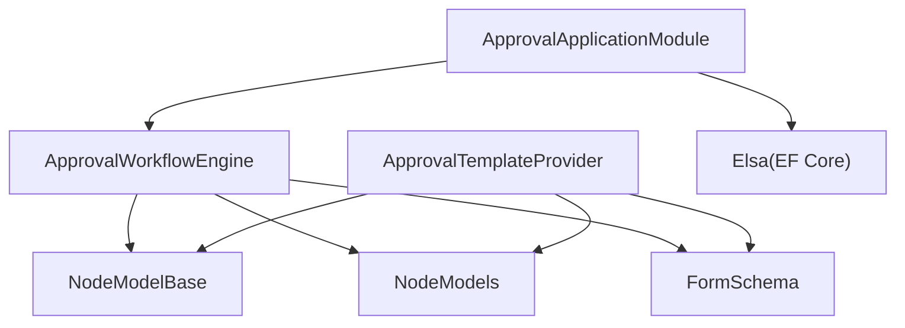

# 工作流引擎

<cite>
**本文引用的文件**   
- [ApprovalWorkflowEngine.cs](file://src/Services/Approval/H.Approval.Application.Services/ApprovalWorkflowEngine.cs)
- [NodeModelBase.cs](file://src/Services/Approval/H.Approval.Application.Contracts/Workflow/NodeModelBase.cs)
- [NodeModels.cs](file://src/Services/Approval/H.Approval.Application.Contracts/Workflow/NodeModels.cs)
- [FormSchema.cs](file://src/Services/Approval/H.Approval.Application.Contracts/Workflow/FormSchema.cs)
- [ApprovalApplicationModule.cs](file://src/Services/Approval/H.Approval.Application/ApprovalApplicationModule.cs)
- [ApprovalTemplateProvider.cs](file://src/Services/Approval/H.Approval.Application/Templates/ApprovalTemplateProvider.cs)
</cite>

## 目录
1. [简介](#简介)
2. [项目结构](#项目结构)
3. [核心组件](#核心组件)
4. [架构总览](#架构总览)
5. [详细组件分析](#详细组件分析)
6. [依赖关系分析](#依赖关系分析)
7. [性能考量](#性能考量)
8. [故障排查指南](#故障排查指南)
9. [结论](#结论)
10. [附录](#附录)

## 简介
本文件面向审批工作流引擎，基于 Elsa 的集成与自包含节点树解析执行方案，系统化阐述工作流定义、执行引擎、状态管理、模板系统、节点类型配置与使用、实例生命周期、任务调度与超时策略、设计器使用指南与自定义节点开发示例，以及复杂审批场景模式与性能优化建议。文档以仓库中实际代码为依据，辅以可视化图示帮助理解。

## 项目结构
审批模块采用分层架构：应用层提供工作流引擎与模板能力，契约层定义节点模型、表单 Schema 与枚举；基础设施通过 Abp 模块化注册 Elsa 持久化与运行时。关键路径如下：
- 应用层：ApprovalApplicationModule（Elsa 注册）、ApprovalWorkflowEngine（自包含引擎）、ApprovalTemplateProvider（模板加载）
- 契约层：NodeModelBase、NodeModels、FormSchema（节点多态序列化、条件规则、表单字段定义）
- 数据库：Elsa EF Core 持久化（工作流管理与运行时）

**图表来源** 
- [ApprovalApplicationModule.cs:1-38](file://src/Services/Approval/H.Approval.Application/ApprovalApplicationModule.cs#L1-L38)
- [ApprovalWorkflowEngine.cs:1-259](file://src/Services/Approval/H.Approval.Application.Services/ApprovalWorkflowEngine.cs#L1-L259)
- [ApprovalTemplateProvider.cs:1-150](file://src/Services/Approval/H.Approval.Application/Templates/ApprovalTemplateProvider.cs#L1-L150)
- [NodeModelBase.cs:1-100](file://src/Services/Approval/H.Approval.Application.Contracts/Workflow/NodeModelBase.cs#L1-L100)
- [NodeModels.cs:1-208](file://src/Services/Approval/H.Approval.Application.Contracts/Workflow/NodeModels.cs#L1-L208)
- [FormSchema.cs:1-79](file://src/Services/Approval/H.Approval.Application.Contracts/Workflow/FormSchema.cs#L1-L79)

**章节来源**
- [ApprovalApplicationModule.cs:1-38](file://src/Services/Approval/H.Approval.Application/ApprovalApplicationModule.cs#L1-L38)

## 核心组件
- 工作流引擎 ApprovalWorkflowEngine：负责解析设计器产出的节点树 JSON、变量解析、条件分支求值、获取当前/下一个审批节点及审批人列表。
- 节点模型体系 NodeModelBase/NodeModels：定义开始、审批、抄送、条件、分支等节点类型与多态序列化，支持多人审批方式（依次、会签、或签）。
- 表单 Schema FormSchema：定义表单字段类型与序列化/反序列化，支撑模板表单渲染与变量绑定。
- 模板提供者 ApprovalTemplateProvider：从内嵌资源加载预置模板，统一默认流程并生成可复用模板。
- Elsa 集成 ApprovalApplicationModule：注册 Elsa 的工作流管理与运行时（EF Core），并注入自包含引擎。

**章节来源**
- [ApprovalWorkflowEngine.cs:1-259](file://src/Services/Approval/H.Approval.Application.Services/ApprovalWorkflowEngine.cs#L1-L259)
- [NodeModelBase.cs:1-100](file://src/Services/Approval/H.Approval.Application.Contracts/Workflow/NodeModelBase.cs#L1-L100)
- [NodeModels.cs:1-208](file://src/Services/Approval/H.Approval.Application.Contracts/Workflow/NodeModels.cs#L1-L208)
- [FormSchema.cs:1-79](file://src/Services/Approval/H.Approval.Application.Contracts/Workflow/FormSchema.cs#L1-L79)
- [ApprovalTemplateProvider.cs:1-150](file://src/Services/Approval/H.Approval.Application/Templates/ApprovalTemplateProvider.cs#L1-L150)
- [ApprovalApplicationModule.cs:1-38](file://src/Services/Approval/H.Approval.Application/ApprovalApplicationModule.cs#L1-L38)

## 架构总览
整体架构由“模板系统 + 节点模型 + 自包含引擎 + Elsa 持久化”构成。模板提供默认流程与表单定义；引擎解析节点树并根据变量求值选择分支；Elsa 负责工作流元数据与运行时的持久化与 API。

**图表来源** 
- [ApprovalTemplateProvider.cs:1-150](file://src/Services/Approval/H.Approval.Application/Templates/ApprovalTemplateProvider.cs#L1-L150)
- [ApprovalWorkflowEngine.cs:1-259](file://src/Services/Approval/H.Approval.Application.Services/ApprovalWorkflowEngine.cs#L1-L259)
- [ApprovalApplicationModule.cs:1-38](file://src/Services/Approval/H.Approval.Application/ApprovalApplicationModule.cs#L1-L38)

## 详细组件分析

### 节点模型与多态序列化
节点模型采用抽象基类与具体子类组合，配合 JsonConverter 实现多态反序列化。支持 Start、Approve、CarbonCopy、Condition、Branch、End 等节点类型，并通过 NodeTypeEnum 标识。

**图表来源** 
- [NodeModelBase.cs:1-100](file://src/Services/Approval/H.Approval.Application.Contracts/Workflow/NodeModelBase.cs#L1-L100)
- [NodeModels.cs:1-208](file://src/Services/Approval/H.Approval.Application.Contracts/Workflow/NodeModels.cs#L1-L208)

**章节来源**
- [NodeModelBase.cs:1-100](file://src/Services/Approval/H.Approval.Application.Contracts/Workflow/NodeModelBase.cs#L1-L100)
- [NodeModels.cs:1-208](file://src/Services/Approval/H.Approval.Application.Contracts/Workflow/NodeModels.cs#L1-L208)

### 工作流引擎执行逻辑
引擎提供以下核心能力：
- 解析定义：将设计器产出的 JSON 解析为节点树
- 变量解析：将变量 JSON 转为字典，便于条件求值
- 路径遍历：按实际路径收集审批节点（跳过抄送，进入条件分支求值）
- 分支求值：遍历条件规则（AND 关系），命中则选择对应分支，否则走默认或第一个
- 审批人解析：根据节点类型（指定成员/角色/发起人自选/自己/部门主管）解析审批人列表，空时回退到发起人

**图表来源** 
- [ApprovalWorkflowEngine.cs:1-259](file://src/Services/Approval/H.Approval.Application.Services/ApprovalWorkflowEngine.cs#L1-L259)

**章节来源**
- [ApprovalWorkflowEngine.cs:1-259](file://src/Services/Approval/H.Approval.Application.Services/ApprovalWorkflowEngine.cs#L1-L259)

### 表单 Schema 与模板系统
- 表单字段类型：输入框、多行文本、数字、金额、日期、日期区间、单选、多选、说明文字等
- 模板提供者：从内嵌资源加载分类与模板，统一默认流程（发起人→审批人→结束），并为每个模板生成表单 Schema

**图表来源** 
- [ApprovalTemplateProvider.cs:1-150](file://src/Services/Approval/H.Approval.Application/Templates/ApprovalTemplateProvider.cs#L1-L150)
- [FormSchema.cs:1-79](file://src/Services/Approval/H.Approval.Application.Contracts/Workflow/FormSchema.cs#L1-L79)
- [ApprovalWorkflowEngine.cs:1-259](file://src/Services/Approval/H.Approval.Application.Services/ApprovalWorkflowEngine.cs#L1-L259)

**章节来源**
- [FormSchema.cs:1-79](file://src/Services/Approval/H.Approval.Application.Contracts/Workflow/FormSchema.cs#L1-L79)
- [ApprovalTemplateProvider.cs:1-150](file://src/Services/Approval/H.Approval.Application/Templates/ApprovalTemplateProvider.cs#L1-L150)

### Elsa 集成与模块注册
- 在模块中启用 Elsa 的工作流管理与运行时（EF Core SQL Server）
- 暴露工作流 API
- 注入自包含引擎 ApprovalWorkflowEngine

**图表来源** 
- [ApprovalApplicationModule.cs:1-38](file://src/Services/Approval/H.Approval.Application/ApprovalApplicationModule.cs#L1-L38)

**章节来源**
- [ApprovalApplicationModule.cs:1-38](file://src/Services/Approval/H.Approval.Application/ApprovalApplicationModule.cs#L1-L38)

## 依赖关系分析
- 引擎依赖节点模型与序列化器进行解析与求值
- 模板提供者依赖表单 Schema 与节点序列化器构建默认流程
- 模块依赖 Elsa 持久化与运行时，同时注入引擎

**图表来源** 
- [ApprovalWorkflowEngine.cs:1-259](file://src/Services/Approval/H.Approval.Application.Services/ApprovalWorkflowEngine.cs#L1-L259)
- [ApprovalTemplateProvider.cs:1-150](file://src/Services/Approval/H.Approval.Application/Templates/ApprovalTemplateProvider.cs#L1-L150)
- [ApprovalApplicationModule.cs:1-38](file://src/Services/Approval/H.Approval.Application/ApprovalApplicationModule.cs#L1-L38)
- [NodeModelBase.cs:1-100](file://src/Services/Approval/H.Approval.Application.Contracts/Workflow/NodeModelBase.cs#L1-L100)
- [NodeModels.cs:1-208](file://src/Services/Approval/H.Approval.Application.Contracts/Workflow/NodeModels.cs#L1-L208)
- [FormSchema.cs:1-79](file://src/Services/Approval/H.Approval.Application.Contracts/Workflow/FormSchema.cs#L1-L79)

**章节来源**
- [ApprovalWorkflowEngine.cs:1-259](file://src/Services/Approval/H.Approval.Application.Services/ApprovalWorkflowEngine.cs#L1-L259)
- [ApprovalTemplateProvider.cs:1-150](file://src/Services/Approval/H.Approval.Application/Templates/ApprovalTemplateProvider.cs#L1-L150)
- [ApprovalApplicationModule.cs:1-38](file://src/Services/Approval/H.Approval.Application/ApprovalApplicationModule.cs#L1-L38)

## 性能考量
- 节点树遍历复杂度 O(N)，N 为节点数量；条件求值为 AND 关系，规则数 M，复杂度 O(M)
- 变量解析使用 JsonDocument 流式读取，避免重复分配
- 分支求值短路：一旦某条规则失败立即返回 false，减少不必要计算
- 建议：
  - 控制单流程节点规模，避免过深嵌套
  - 合理拆分条件规则，避免过多字段比较
  - 缓存常用模板与默认流程，减少重复解析
  - 对高频访问的变量字典进行复用，降低 GC 压力

[本节为通用指导，无需源码引用]

## 故障排查指南
- 条件分支未命中：检查变量字段名与操作符是否正确，确认变量字典中存在该字段
- 审批人列表为空：当指定成员/角色为空时，引擎会回退到发起人；检查设计器配置
- 模板加载失败：确认内嵌资源名称与 csproj 配置一致，查看日志警告
- Elsa 持久化异常：检查连接字符串与数据库可用性

**章节来源**
- [ApprovalWorkflowEngine.cs:1-259](file://src/Services/Approval/H.Approval.Application.Services/ApprovalWorkflowEngine.cs#L1-L259)
- [ApprovalTemplateProvider.cs:1-150](file://src/Services/Approval/H.Approval.Application/Templates/ApprovalTemplateProvider.cs#L1-L150)

## 结论
本工作流引擎以自包含节点树解析为核心，结合 Elsa 的持久化与 API，提供了灵活的审批流程设计与执行能力。通过模板系统与表单 Schema，快速搭建标准化审批流程；通过条件分支与多种审批人类型，满足复杂业务场景。建议在工程实践中关注性能优化与错误处理，确保稳定高效运行。

[本节为总结性内容，无需源码引用]

## 附录

### 工作流设计器使用指南
- 创建模板：从模板库选择分类与模板，自动生成表单与默认流程
- 编辑流程：拖拽节点（开始、审批、抄送、条件、分支、结束），配置属性（审批人类型、多人审批方式、条件规则）
- 预览与测试：输入变量，验证分支求值与审批人解析结果
- 发布与使用：将模板发布后，业务系统通过 API 发起实例并跟踪状态

[本节为概念性指导，无需源码引用]

### 自定义节点开发示例
- 扩展节点类型：在 NodeModels 中添加新节点类，继承 NodeModelBase
- 更新转换器：在 NodeModelBaseConverter 中增加新类型的反序列化分支
- 引擎适配：在 ApprovalWorkflowEngine 的 WalkOnPath 中处理新节点逻辑
- 模板集成：在 ApprovalTemplateProvider 中为新节点提供默认配置

**章节来源**
- [NodeModelBase.cs:1-100](file://src/Services/Approval/H.Approval.Application.Contracts/Workflow/NodeModelBase.cs#L1-L100)
- [NodeModels.cs:1-208](file://src/Services/Approval/H.Approval.Application.Contracts/Workflow/NodeModels.cs#L1-L208)
- [ApprovalWorkflowEngine.cs:1-259](file://src/Services/Approval/H.Approval.Application.Services/ApprovalWorkflowEngine.cs#L1-L259)