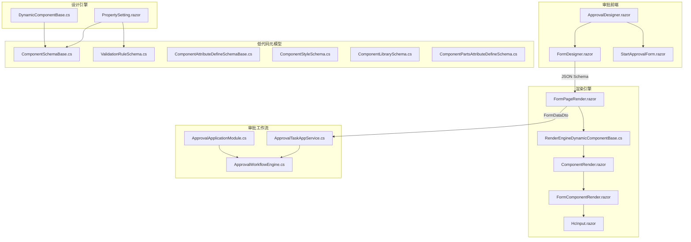
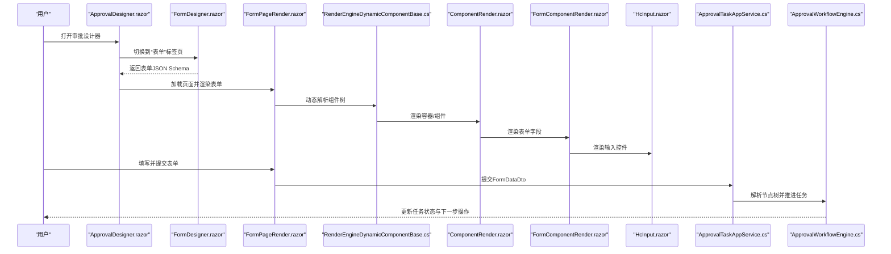
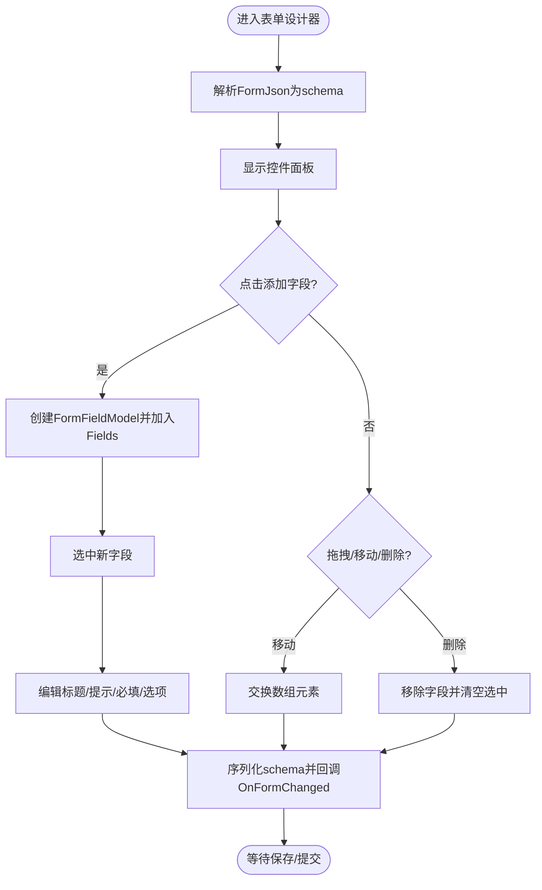
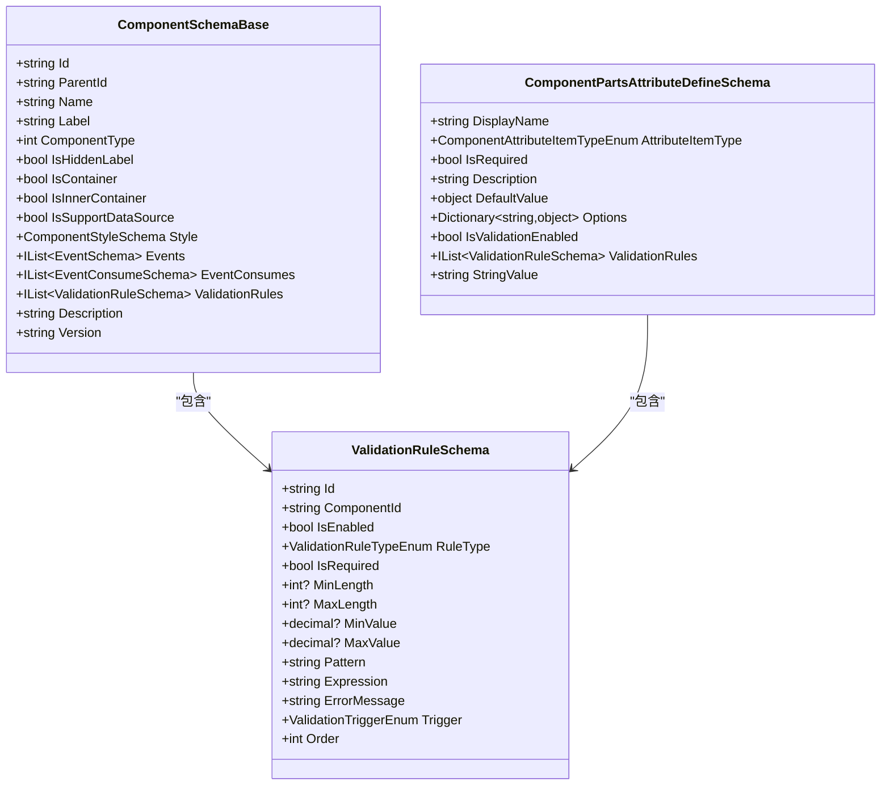
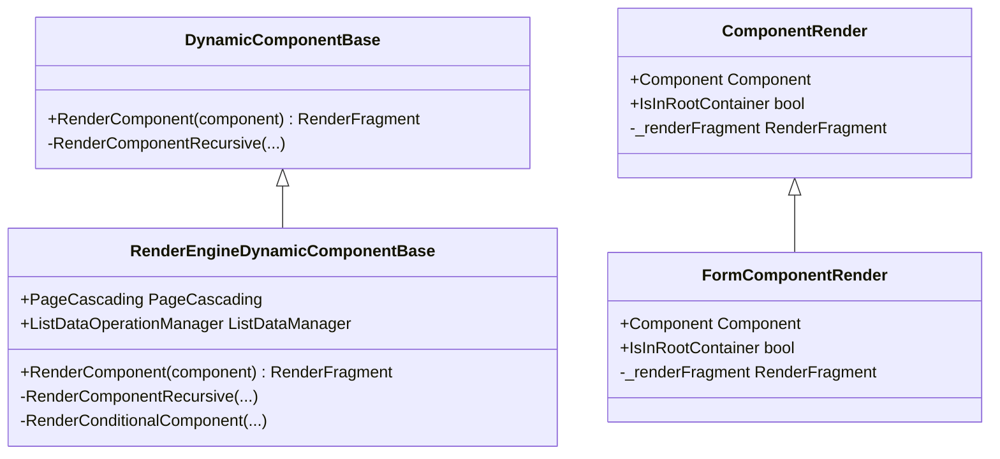
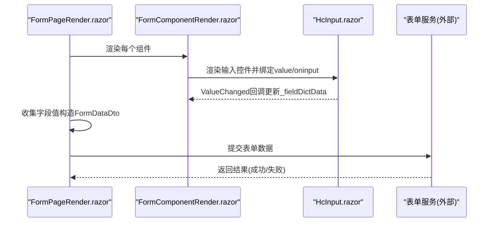
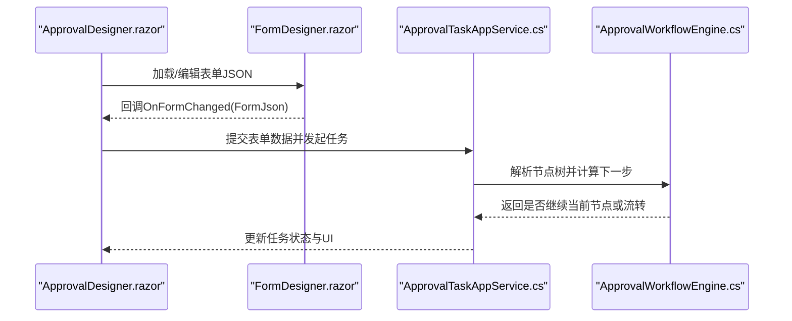
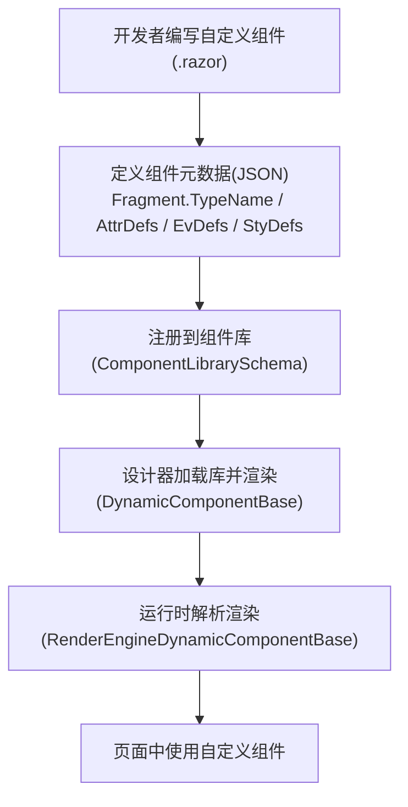
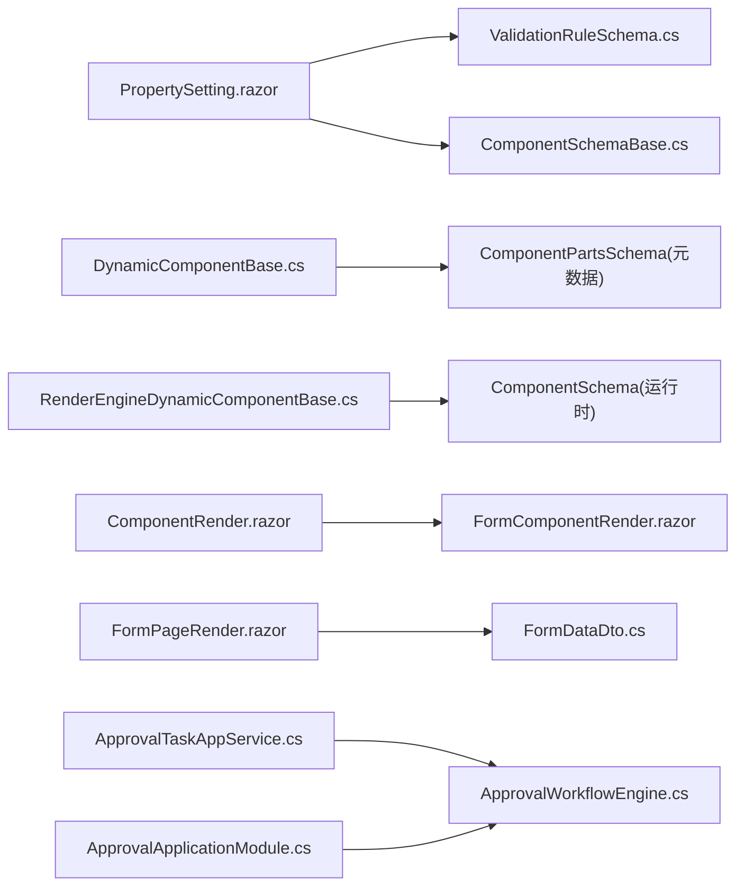

# 表单设计器

<cite>
**本文引用的文件**   
- [FormDesigner.razor](file://src/Services/Approval/H.Approval.Web/Components/Panels/FormDesigner.razor)
- [ApprovalDesigner.razor](file://src/Services/Approval/H.Approval.Web/Pages/ApprovalDesigner.razor)
- [StartApprovalForm.razor](file://src/Services/Approval/H.Approval.Web/Pages/StartApprovalForm.razor)
- [ValidationRuleSchema.cs](file://src/LowCode/Common/H.LowCode.MetaSchema/PropertySchemas/ValidationRuleSchema.cs)
- [ComponentSchemaBase.cs](file://src/LowCode/Common/H.LowCode.MetaSchema/ComponentSchemaBase.cs)
- [ComponentAttributeDefineSchemaBase.cs](file://src/LowCode/Common/H.LowCode.MetaSchema/PropertySchemas/ComponentAttributeDefineSchemaBase.cs)
- [ComponentStyleSchema.cs](file://src/LowCode/Common/H.LowCode.MetaSchema/PropertySchemas/ComponentStyleSchema.cs)
- [ComponentLibrarySchema.cs](file://src/LowCode/Common/H.LowCode.MetaSchema.DesignEngine/ComponentLibrarySchema.cs)
- [ComponentPartsAttributeDefineSchema.cs](file://src/LowCode/Common/H.LowCode.MetaSchema.DesignEngine/PropertySchemas/ComponentPartsAttributeDefineSchema.cs)
- [PropertySetting.razor](file://src/LowCode/DesignEngine/H.LowCode.DesignEngine/SettingPanel/PropertySetting.razor)
- [DynamicComponentBase.cs](file://src/LowCode/DesignEngine/H.LowCode.DesignEngine/Services/DynamicComponentBase.cs)
- [RenderEngineDynamicComponentBase.cs](file://src/LowCode/RenderEngine/H.LowCode.RenderEngineBase/RenderEngineDynamicComponentBase.cs)
- [FormPageRender.razor](file://src/LowCode/RenderEngine/H.LowCode.Themes.AntBlazor/PageRender/FormPageRender.razor)
- [ComponentRender.razor](file://src/LowCode/RenderEngine/H.LowCode.Themes.AntBlazor/ComponentRender/ComponentRender.razor)
- [FormComponentRender.razor](file://src/LowCode/RenderEngine/H.LowCode.Themes.AntBlazor/ComponentRender/FormComponentRender.razor)
- [HcInput.razor](file://src/LowCode/Common/H.LowCode.Components/Components/HcInput.razor)
- [FormDataDto.cs](file://src/LowCode/Common/H.LowCode.Application.Contracts/Dtos/FormDataDto.cs)
- [ApprovalWorkflowEngine.cs](file://src/Services/Approval/H.Approval.Application/Services/ApprovalWorkflowEngine.cs)
- [ApprovalTaskAppService.cs](file://src/Services/Approval/H.Approval.Application/Services/ApprovalTaskAppService.cs)
- [ApprovalApplicationModule.cs](file://src/Services/Approval/H.Approval.Application/ApprovalApplicationModule.cs)
</cite>

## 目录
1. [简介](#简介)
2. [项目结构](#项目结构)
3. [核心组件](#核心组件)
4. [架构总览](#架构总览)
5. [详细组件分析](#详细组件分析)
6. [依赖关系分析](#依赖关系分析)
7. [性能考量](#性能考量)
8. [故障排查指南](#故障排查指南)
9. [结论](#结论)
10. [附录](#附录)

## 简介
本文件面向“审批表单设计器”，系统性阐述可视化表单设计器的功能特性与实现机制，包括：
- 拖拽式表单构建、字段类型支持、验证规则配置
- 表单数据结构定义、动态表单生成、渲染机制
- 与审批流程的集成方式、数据绑定机制、事件处理
- 表单模板管理与自定义组件开发指南
- 性能优化与用户体验改进建议

该设计器基于低代码框架，提供页面级与部件级的组件库、属性面板、校验设置与动态渲染能力，并与审批工作流引擎无缝集成。

## 项目结构
围绕表单设计器，相关代码分布在以下模块：
- 审批应用前端：表单设计器与审批设计器页面
- 低代码元模型与组件库：组件属性、样式、校验规则等元数据
- 设计引擎：动态组件渲染、拖拽交互、属性面板
- 渲染引擎：运行时动态组件解析与渲染、表单提交与校验
- 审批工作流：任务流转、节点解析与执行

**图表来源** 
- [ApprovalDesigner.razor:1-47](file://src/Services/Approval/H.Approval.Web/Pages/ApprovalDesigner.razor#L1-L47)
- [FormDesigner.razor:1-311](file://src/Services/Approval/H.Approval.Web/Components/Panels/FormDesigner.razor#L1-L311)
- [StartApprovalForm.razor:135-161](file://src/Services/Approval/H.Approval.Web/Pages/StartApprovalForm.razor#L135-L161)
- [ComponentSchemaBase.cs:1-104](file://src/LowCode/Common/H.LowCode.MetaSchema/ComponentSchemaBase.cs#L1-L104)
- [ValidationRuleSchema.cs:1-178](file://src/LowCode/Common/H.LowCode.MetaSchema/PropertySchemas/ValidationRuleSchema.cs#L1-L178)
- [ComponentAttributeDefineSchemaBase.cs:1-25](file://src/LowCode/Common/H.LowCode.MetaSchema/PropertySchemas/ComponentAttributeDefineSchemaBase.cs#L1-L25)
- [ComponentStyleSchema.cs:1-39](file://src/LowCode/Common/H.LowCode.MetaSchema/PropertySchemas/ComponentStyleSchema.cs#L1-L39)
- [ComponentLibrarySchema.cs:1-36](file://src/LowCode/Common/H.LowCode.MetaSchema.DesignEngine/ComponentLibrarySchema.cs#L1-L36)
- [ComponentPartsAttributeDefineSchema.cs:1-49](file://src/LowCode/Common/H.LowCode.MetaSchema.DesignEngine/PropertySchemas/ComponentPartsAttributeDefineSchema.cs#L1-L49)
- [PropertySetting.razor:1-231](file://src/LowCode/DesignEngine/H.LowCode.DesignEngine/SettingPanel/PropertySetting.razor#L1-L231)
- [DynamicComponentBase.cs:1-34](file://src/LowCode/DesignEngine/H.LowCode.DesignEngine/Services/DynamicComponentBase.cs#L1-L34)
- [RenderEngineDynamicComponentBase.cs:1-107](file://src/LowCode/RenderEngine/H.LowCode.RenderEngineBase/RenderEngineDynamicComponentBase.cs#L1-L107)
- [FormPageRender.razor:1-46](file://src/LowCode/RenderEngine/H.LowCode.Themes.AntBlazor/PageRender/FormPageRender.razor#L1-L46)
- [ComponentRender.razor:1-42](file://src/LowCode/RenderEngine/H.LowCode.Themes.AntBlazor/ComponentRender/ComponentRender.razor#L1-L42)
- [FormComponentRender.razor:1-41](file://src/LowCode/RenderEngine/H.LowCode.Themes.AntBlazor/ComponentRender/FormComponentRender.razor#L1-L41)
- [HcInput.razor:1-54](file://src/LowCode/Common/H.LowCode.Components/Components/HcInput.razor#L1-L54)
- [FormDataDto.cs:1-52](file://src/LowCode/Common/H.LowCode.Application.Contracts/Dtos/FormDataDto.cs#L1-L52)
- [ApprovalWorkflowEngine.cs:1-30](file://src/Services/Approval/H.Approval.Application/Services/ApprovalWorkflowEngine.cs#L1-L30)
- [ApprovalTaskAppService.cs:145-170](file://src/Services/Approval/H.Approval.Application/Services/ApprovalTaskAppService.cs#L145-L170)
- [ApprovalApplicationModule.cs:1-38](file://src/Services/Approval/H.Approval.Application/ApprovalApplicationModule.cs#L1-L38)

**章节来源**
- [ApprovalDesigner.razor:1-47](file://src/Services/Approval/H.Approval.Web/Pages/ApprovalDesigner.razor#L1-L47)
- [FormDesigner.razor:1-311](file://src/Services/Approval/H.Approval.Web/Components/Panels/FormDesigner.razor#L1-L311)

## 核心组件
- 表单设计器（FormDesigner）：提供左侧控件面板、中间画布、右侧属性编辑区，支持添加、移动、删除字段，以及选项编辑与必填标记。
- 属性面板（PropertySetting）：提供基础属性、扩展属性、数据源属性与校验设置，支持启用/禁用校验、增删校验规则、触发时机与排序。
- 动态组件渲染（DynamicComponentBase / RenderEngineDynamicComponentBase）：根据组件元数据（Fragment、Attributes、DataSource）递归渲染组件树，支持容器与条件分支。
- 表单渲染（FormPageRender / FormComponentRender）：将页面组件列表渲染为表单，绑定字段值，统一提交与校验。
- 校验规则（ValidationRuleSchema）：定义规则类型、触发时机、参数与错误消息，贯穿设计与运行阶段。
- 组件元模型（ComponentSchemaBase / AttributeDefine / Style）：描述组件标识、标签、样式、事件、校验规则等元信息。
- 审批工作流（ApprovalWorkflowEngine / ApprovalTaskAppService）：解析节点树、创建任务、处理依次/会签/或签模式，驱动表单数据流转。

**章节来源**
- [FormDesigner.razor:1-311](file://src/Services/Approval/H.Approval.Web/Components/Panels/FormDesigner.razor#L1-L311)
- [PropertySetting.razor:1-231](file://src/LowCode/DesignEngine/H.LowCode.DesignEngine/SettingPanel/PropertySetting.razor#L1-L231)
- [DynamicComponentBase.cs:1-34](file://src/LowCode/DesignEngine/H.LowCode.DesignEngine/Services/DynamicComponentBase.cs#L1-L34)
- [RenderEngineDynamicComponentBase.cs:1-107](file://src/LowCode/RenderEngine/H.LowCode.RenderEngineBase/RenderEngineDynamicComponentBase.cs#L1-L107)
- [FormPageRender.razor:1-46](file://src/LowCode/RenderEngine/H.LowCode.Themes.AntBlazor/PageRender/FormPageRender.razor#L1-L46)
- [FormComponentRender.razor:1-41](file://src/LowCode/RenderEngine/H.LowCode.Themes.AntBlazor/ComponentRender/FormComponentRender.razor#L1-L41)
- [ValidationRuleSchema.cs:1-178](file://src/LowCode/Common/H.LowCode.MetaSchema/PropertySchemas/ValidationRuleSchema.cs#L1-L178)
- [ComponentSchemaBase.cs:1-104](file://src/LowCode/Common/H.LowCode.MetaSchema/ComponentSchemaBase.cs#L1-L104)
- [ApprovalWorkflowEngine.cs:1-30](file://src/Services/Approval/H.Approval.Application/Services/ApprovalWorkflowEngine.cs#L1-L30)
- [ApprovalTaskAppService.cs:145-170](file://src/Services/Approval/H.Approval.Application/Services/ApprovalTaskAppService.cs#L145-L170)

## 架构总览
表单设计器采用“设计时—运行时”分离架构：
- 设计时：通过 FormDesigner 与 PropertySetting 完成字段编排与校验配置，输出 JSON Schema。
- 运行时：由 FormPageRender 加载页面组件并动态渲染，结合 FormDataDto 进行数据绑定与提交；校验规则在提交前执行。
- 审批集成：表单数据随任务流转，ApprovalWorkflowEngine 解析节点树并驱动任务状态变化。

**图表来源** 
- [ApprovalDesigner.razor:1-47](file://src/Services/Approval/H.Approval.Web/Pages/ApprovalDesigner.razor#L1-L47)
- [FormDesigner.razor:1-311](file://src/Services/Approval/H.Approval.Web/Components/Panels/FormDesigner.razor#L1-L311)
- [FormPageRender.razor:1-46](file://src/LowCode/RenderEngine/H.LowCode.Themes.AntBlazor/PageRender/FormPageRender.razor#L1-L46)
- [RenderEngineDynamicComponentBase.cs:1-107](file://src/LowCode/RenderEngine/H.LowCode.RenderEngineBase/RenderEngineDynamicComponentBase.cs#L1-L107)
- [ComponentRender.razor:1-42](file://src/LowCode/RenderEngine/H.LowCode.Themes.AntBlazor/ComponentRender/ComponentRender.razor#L1-L42)
- [FormComponentRender.razor:1-41](file://src/LowCode/RenderEngine/H.LowCode.Themes.AntBlazor/ComponentRender/FormComponentRender.razor#L1-L41)
- [HcInput.razor:1-54](file://src/LowCode/Common/H.LowCode.Components/Components/HcInput.razor#L1-L54)
- [ApprovalTaskAppService.cs:145-170](file://src/Services/Approval/H.Approval.Application/Services/ApprovalTaskAppService.cs#L145-L170)
- [ApprovalWorkflowEngine.cs:1-30](file://src/Services/Approval/H.Approval.Application/Services/ApprovalWorkflowEngine.cs#L1-L30)

## 详细组件分析

### 表单设计器（FormDesigner）
- 功能要点
  - 左侧控件面板：内置多种字段类型（单行输入、多行输入、数字、金额、日期、日期区间、单选、多选、说明文字）。
  - 中间画布：以卡片形式展示字段，支持上移/下移、删除、选中高亮。
  - 右侧属性面板：编辑标题、提示文字、必填、选项（单选/多选），实时同步到表单JSON。
  - 预览渲染：按字段类型渲染只读控件用于预览。
- 数据结构
  - 使用内部 FormFieldModel 表示字段，包含 Id、Type、Label、Placeholder、Required、Options 等。
  - 通过 Serialize() 输出 JSON Schema，供上层保存与后续渲染。
- 交互流程
  - AddField：新增字段并默认填充 Label/Placeholder，单选/多选初始化 Options。
  - MoveField/RemoveField：调整顺序或删除字段。
  - OnLabelInput/OnPlaceholderInput/OnRequiredChange/OnOptionInput/AddOption/RemoveOption：属性变更即时回传。

**图表来源** 
- [FormDesigner.razor:1-311](file://src/Services/Approval/H.Approval.Web/Components/Panels/FormDesigner.razor#L1-L311)

**章节来源**
- [FormDesigner.razor:1-311](file://src/Services/Approval/H.Approval.Web/Components/Panels/FormDesigner.razor#L1-L311)

### 属性面板与校验设置（PropertySetting）
- 功能要点
  - 分组展示：基础属性、数据源属性、扩展属性、校验设置。
  - 校验开关：启用/禁用校验，影响 ValidationRules 的存在性。
  - 规则管理：增删规则、设置 RuleType、Trigger、Order、ErrorMessage 等。
- 校验规则模型
  - ValidationRuleSchema：id、componentId、enabled、type、required、minlen/maxlen、minval/maxval、pattern/expression、errmsg、trigger、order。
  - 枚举：ValidationRuleTypeEnum（必填、长度、数值、正则、邮箱、手机、URL、身份证、自定义）、ValidationTriggerEnum（失焦、改变、提交）。
- 与组件元模型的关联
  - ComponentSchemaBase.ValidationRules：组件实例级别的校验规则集合。
  - ComponentPartsAttributeDefineSchema.ValidationRules：属性定义级别的校验规则。

**图表来源** 
- [ValidationRuleSchema.cs:1-178](file://src/LowCode/Common/H.LowCode.MetaSchema/PropertySchemas/ValidationRuleSchema.cs#L1-L178)
- [ComponentSchemaBase.cs:1-104](file://src/LowCode/Common/H.LowCode.MetaSchema/ComponentSchemaBase.cs#L1-L104)
- [ComponentPartsAttributeDefineSchema.cs:1-49](file://src/LowCode/Common/H.LowCode.MetaSchema.DesignEngine/PropertySchemas/ComponentPartsAttributeDefineSchema.cs#L1-L49)

**章节来源**
- [PropertySetting.razor:1-231](file://src/LowCode/DesignEngine/H.LowCode.DesignEngine/SettingPanel/PropertySetting.razor#L1-L231)
- [ValidationRuleSchema.cs:1-178](file://src/LowCode/Common/H.LowCode.MetaSchema/PropertySchemas/ValidationRuleSchema.cs#L1-L178)
- [ComponentSchemaBase.cs:1-104](file://src/LowCode/Common/H.LowCode.MetaSchema/ComponentSchemaBase.cs#L1-L104)
- [ComponentPartsAttributeDefineSchema.cs:1-49](file://src/LowCode/Common/H.LowCode.MetaSchema.DesignEngine/PropertySchemas/ComponentPartsAttributeDefineSchema.cs#L1-L49)

### 动态组件渲染（设计时/运行时）
- 设计时渲染（DynamicComponentBase）
  - 根据 ComponentPartsSchema.Fragment.TypeName 与 Attributes 递归渲染组件树。
  - 支持 DataSource 注入与 ChildContent 渲染。
- 运行时渲染（RenderEngineDynamicComponentBase）
  - 兼容旧版 AntDesign 类型名映射至 Hc 组件类型。
  - 支持条件渲染（Conditional）与数据源渲染。
  - 提供 ListDataOperationManager 用于列表数据操作。
- 组件渲染器（ComponentRender / FormComponentRender）
  - 区分容器与非容器组件，渲染标签与内容区域。
  - 表单模式下增加 label/help-text 布局与样式。

**图表来源** 
- [DynamicComponentBase.cs:1-34](file://src/LowCode/DesignEngine/H.LowCode.DesignEngine/Services/DynamicComponentBase.cs#L1-L34)
- [RenderEngineDynamicComponentBase.cs:1-107](file://src/LowCode/RenderEngine/H.LowCode.RenderEngineBase/RenderEngineDynamicComponentBase.cs#L1-L107)
- [ComponentRender.razor:1-42](file://src/LowCode/RenderEngine/H.LowCode.Themes.AntBlazor/ComponentRender/ComponentRender.razor#L1-L42)
- [FormComponentRender.razor:1-41](file://src/LowCode/RenderEngine/H.LowCode.Themes.AntBlazor/ComponentRender/FormComponentRender.razor#L1-L41)

**章节来源**
- [DynamicComponentBase.cs:1-34](file://src/LowCode/DesignEngine/H.LowCode.DesignEngine/Services/DynamicComponentBase.cs#L1-L34)
- [RenderEngineDynamicComponentBase.cs:1-107](file://src/LowCode/RenderEngine/H.LowCode.RenderEngineBase/RenderEngineDynamicComponentBase.cs#L1-L107)
- [ComponentRender.razor:1-42](file://src/LowCode/RenderEngine/H.LowCode.Themes.AntBlazor/ComponentRender/ComponentRender.razor#L1-L42)
- [FormComponentRender.razor:1-41](file://src/LowCode/RenderEngine/H.LowCode.Themes.AntBlazor/ComponentRender/FormComponentRender.razor#L1-L41)

### 表单数据绑定与提交（FormPageRender）
- 数据模型
  - FormDataDto：包含 Name、Fields（FormFieldDto[]）、ValidationRules。
  - FormFieldDto：Name、TypeName（用于类型转换）、Value（实际值）。
- 渲染与绑定
  - 遍历 Page.Components，逐个渲染 FormComponentRender。
  - 维护 _fieldDictData 字典，将字段 ID 映射到当前值。
  - 提交时收集所有字段值，构造 FormDataDto 并调用服务接口。
- 事件处理
  - 各输入控件（如 HcInput）通过 ValueChanged 回调更新 _fieldDictData。
  - 提交前可执行校验规则（由校验服务或页面逻辑触发）。

**图表来源** 
- [FormPageRender.razor:1-46](file://src/LowCode/RenderEngine/H.LowCode.Themes.AntBlazor/PageRender/FormPageRender.razor#L1-L46)
- [FormComponentRender.razor:1-41](file://src/LowCode/RenderEngine/H.LowCode.Themes.AntBlazor/ComponentRender/FormComponentRender.razor#L1-L41)
- [HcInput.razor:1-54](file://src/LowCode/Common/H.LowCode.Components/Components/HcInput.razor#L1-L54)
- [FormDataDto.cs:1-52](file://src/LowCode/Common/H.LowCode.Application.Contracts/Dtos/FormDataDto.cs#L1-L52)

**章节来源**
- [FormPageRender.razor:1-46](file://src/LowCode/RenderEngine/H.LowCode.Themes.AntBlazor/PageRender/FormPageRender.razor#L1-L46)
- [FormDataDto.cs:1-52](file://src/LowCode/Common/H.LowCode.Application.Contracts/Dtos/FormDataDto.cs#L1-L52)
- [HcInput.razor:1-54](file://src/LowCode/Common/H.LowCode.Components/Components/HcInput.razor#L1-L54)

### 与审批流程的集成
- 审批设计器（ApprovalDesigner）
  - 提供“基础设置”、“表单”、“流程”三个标签页。
  - “表单”标签页嵌入 FormDesigner，双向同步 FormJson。
- 审批任务与流转（ApprovalTaskAppService / ApprovalWorkflowEngine）
  - 解析节点树（NodeSerializer.Deserialize），支持依次/会签/或签。
  - 根据当前审批人索引创建下一个任务或流转下一节点。
- 模块注册（ApprovalApplicationModule）
  - 集成 Elsa 工作流持久化与 API。
  - 注册自包含审批工作流引擎。

**图表来源** 
- [ApprovalDesigner.razor:1-47](file://src/Services/Approval/H.Approval.Web/Pages/ApprovalDesigner.razor#L1-L47)
- [FormDesigner.razor:1-311](file://src/Services/Approval/H.Approval.Web/Components/Panels/FormDesigner.razor#L1-L311)
- [ApprovalTaskAppService.cs:145-170](file://src/Services/Approval/H.Approval.Application/Services/ApprovalTaskAppService.cs#L145-L170)
- [ApprovalWorkflowEngine.cs:1-30](file://src/Services/Approval/H.Approval.Application/Services/ApprovalWorkflowEngine.cs#L1-L30)
- [ApprovalApplicationModule.cs:1-38](file://src/Services/Approval/H.Approval.Application/ApprovalApplicationModule.cs#L1-L38)

**章节来源**
- [ApprovalDesigner.razor:1-47](file://src/Services/Approval/H.Approval.Web/Pages/ApprovalDesigner.razor#L1-L47)
- [ApprovalTaskAppService.cs:145-170](file://src/Services/Approval/H.Approval.Application/Services/ApprovalTaskAppService.cs#L145-L170)
- [ApprovalWorkflowEngine.cs:1-30](file://src/Services/Approval/H.Approval.Application/Services/ApprovalWorkflowEngine.cs#L1-L30)
- [ApprovalApplicationModule.cs:1-38](file://src/Services/Approval/H.Approval.Application/ApprovalApplicationModule.cs#L1-L38)

### 表单模板管理与自定义组件开发
- 模板管理
  - 组件库（ComponentLibrarySchema）：定义库ID、名称、发布状态、描述、支持平台。
  - 部件定义（ComponentPartsSchema）：包含 Fragment（类型、子组件、属性）、DataSource、属性定义组、事件定义、样式定义。
- 自定义组件开发
  - 在组件库中声明 Fragment.TypeName 指向自定义 Blazor 组件。
  - 通过 AttributeDefineGroups 暴露属性（名称、类型、默认值、选项、校验开关与规则）。
  - 设计器侧通过 DynamicComponentBase 解析并渲染；运行期由 RenderEngineDynamicComponentBase 解析。
  - 示例：HcInput 作为基础输入组件，暴露 Placeholder、Disabled、MaxLength、ReadOnly、AllowClear、Value/ValueChanged。

**图表来源** 
- [ComponentLibrarySchema.cs:1-36](file://src/LowCode/Common/H.LowCode.MetaSchema.DesignEngine/ComponentLibrarySchema.cs#L1-L36)
- [ComponentPartsAttributeDefineSchema.cs:1-49](file://src/LowCode/Common/H.LowCode.MetaSchema.DesignEngine/PropertySchemas/ComponentPartsAttributeDefineSchema.cs#L1-L49)
- [DynamicComponentBase.cs:1-34](file://src/LowCode/DesignEngine/H.LowCode.DesignEngine/Services/DynamicComponentBase.cs#L1-L34)
- [RenderEngineDynamicComponentBase.cs:1-107](file://src/LowCode/RenderEngine/H.LowCode.RenderEngineBase/RenderEngineDynamicComponentBase.cs#L1-L107)
- [HcInput.razor:1-54](file://src/LowCode/Common/H.LowCode.Components/Components/HcInput.razor#L1-L54)

**章节来源**
- [ComponentLibrarySchema.cs:1-36](file://src/LowCode/Common/H.LowCode.MetaSchema.DesignEngine/ComponentLibrarySchema.cs#L1-L36)
- [ComponentPartsAttributeDefineSchema.cs:1-49](file://src/LowCode/Common/H.LowCode.MetaSchema.DesignEngine/PropertySchemas/ComponentPartsAttributeDefineSchema.cs#L1-L49)
- [DynamicComponentBase.cs:1-34](file://src/LowCode/DesignEngine/H.LowCode.DesignEngine/Services/DynamicComponentBase.cs#L1-L34)
- [RenderEngineDynamicComponentBase.cs:1-107](file://src/LowCode/RenderEngine/H.LowCode.RenderEngineBase/RenderEngineDynamicComponentBase.cs#L1-L107)
- [HcInput.razor:1-54](file://src/LowCode/Common/H.LowCode.Components/Components/HcInput.razor#L1-L54)

## 依赖关系分析
- 设计器与元模型
  - PropertySetting 依赖 ValidationRuleSchema 与 ComponentSchemaBase 进行属性与校验配置。
  - DynamicComponentBase 依赖 ComponentPartsSchema 与 Fragment 进行设计时渲染。
- 渲染引擎与组件库
  - RenderEngineDynamicComponentBase 依赖 ComponentSchema 与 Fragment，支持条件渲染与数据源。
  - ComponentRender/FormComponentRender 负责 UI 布局与标签/帮助文本展示。
- 审批工作流
  - ApprovalTaskAppService 依赖 ApprovalWorkflowEngine 解析节点树并推进任务。
  - ApprovalApplicationModule 注册 Elsa 工作流持久化与 API。

**图表来源** 
- [PropertySetting.razor:1-231](file://src/LowCode/DesignEngine/H.LowCode.DesignEngine/SettingPanel/PropertySetting.razor#L1-L231)
- [ValidationRuleSchema.cs:1-178](file://src/LowCode/Common/H.LowCode.MetaSchema/PropertySchemas/ValidationRuleSchema.cs#L1-L178)
- [ComponentSchemaBase.cs:1-104](file://src/LowCode/Common/H.LowCode.MetaSchema/ComponentSchemaBase.cs#L1-L104)
- [DynamicComponentBase.cs:1-34](file://src/LowCode/DesignEngine/H.LowCode.DesignEngine/Services/DynamicComponentBase.cs#L1-L34)
- [RenderEngineDynamicComponentBase.cs:1-107](file://src/LowCode/RenderEngine/H.LowCode.RenderEngineBase/RenderEngineDynamicComponentBase.cs#L1-L107)
- [ComponentRender.razor:1-42](file://src/LowCode/RenderEngine/H.LowCode.Themes.AntBlazor/ComponentRender/ComponentRender.razor#L1-L42)
- [FormComponentRender.razor:1-41](file://src/LowCode/RenderEngine/H.LowCode.Themes.AntBlazor/ComponentRender/FormComponentRender.razor#L1-L41)
- [FormPageRender.razor:1-46](file://src/LowCode/RenderEngine/H.LowCode.Themes.AntBlazor/PageRender/FormPageRender.razor#L1-L46)
- [FormDataDto.cs:1-52](file://src/LowCode/Common/H.LowCode.Application.Contracts/Dtos/FormDataDto.cs#L1-L52)
- [ApprovalTaskAppService.cs:145-170](file://src/Services/Approval/H.Approval.Application/Services/ApprovalTaskAppService.cs#L145-L170)
- [ApprovalWorkflowEngine.cs:1-30](file://src/Services/Approval/H.Approval.Application/Services/ApprovalWorkflowEngine.cs#L1-L30)
- [ApprovalApplicationModule.cs:1-38](file://src/Services/Approval/H.Approval.Application/ApprovalApplicationModule.cs#L1-L38)

**章节来源**
- [PropertySetting.razor:1-231](file://src/LowCode/DesignEngine/H.LowCode.DesignEngine/SettingPanel/PropertySetting.razor#L1-L231)
- [ValidationRuleSchema.cs:1-178](file://src/LowCode/Common/H.LowCode.MetaSchema/PropertySchemas/ValidationRuleSchema.cs#L1-L178)
- [ComponentSchemaBase.cs:1-104](file://src/LowCode/Common/H.LowCode.MetaSchema/ComponentSchemaBase.cs#L1-L104)
- [DynamicComponentBase.cs:1-34](file://src/LowCode/DesignEngine/H.LowCode.DesignEngine/Services/DynamicComponentBase.cs#L1-L34)
- [RenderEngineDynamicComponentBase.cs:1-107](file://src/LowCode/RenderEngine/H.LowCode.RenderEngineBase/RenderEngineDynamicComponentBase.cs#L1-L107)
- [ComponentRender.razor:1-42](file://src/LowCode/RenderEngine/H.LowCode.Themes.AntBlazor/ComponentRender/ComponentRender.razor#L1-L42)
- [FormComponentRender.razor:1-41](file://src/LowCode/RenderEngine/H.LowCode.Themes.AntBlazor/ComponentRender/FormComponentRender.razor#L1-L41)
- [FormPageRender.razor:1-46](file://src/LowCode/RenderEngine/H.LowCode.Themes.AntBlazor/PageRender/FormPageRender.razor#L1-L46)
- [FormDataDto.cs:1-52](file://src/LowCode/Common/H.LowCode.Application.Contracts/Dtos/FormDataDto.cs#L1-L52)
- [ApprovalTaskAppService.cs:145-170](file://src/Services/Approval/H.Approval.Application/Services/ApprovalTaskAppService.cs#L145-L170)
- [ApprovalWorkflowEngine.cs:1-30](file://src/Services/Approval/H.Approval.Application/Services/ApprovalWorkflowEngine.cs#L1-L30)
- [ApprovalApplicationModule.cs:1-38](file://src/Services/Approval/H.Approval.Application/ApprovalApplicationModule.cs#L1-L38)

## 性能考量
- 渲染性能
  - 使用 RenderFragment 与 ShouldRender 控制重渲染范围，避免不必要的组件重建。
  - 对大型表单，考虑分页或懒加载字段组，减少首屏渲染压力。
- 数据绑定
  - 使用单向绑定与按需更新，避免频繁的全量刷新。
  - 对于大量选项（单选/多选），延迟加载选项数据。
- 校验性能
  - 将校验触发时机设置为 Blur 或 Submit，避免 Change 过于频繁。
  - 复杂表达式校验可异步执行并缓存结果。
- 资源加载
  - 组件库按需加载，避免一次性加载全部组件。
  - 静态资源（CSS/JS）合并与压缩。

[本节为通用指导，不直接分析具体文件]

## 故障排查指南
- 表单无法渲染
  - 检查 ComponentSchema 的 Fragment.TypeName 是否正确映射到现有组件。
  - 确认 RenderEngineDynamicComponentBase 的类型映射表包含旧版 AntDesign 类型。
- 校验不生效
  - 确认 ValidationRuleSchema 的 IsEnabled 与 Trigger 设置正确。
  - 检查 PropertySetting 中校验规则是否存在且 Order 合理。
- 数据绑定异常
  - 检查 FormFieldDto.TypeName 是否能解析为目标类型。
  - 确保 HcInput 的 ValueChanged 回调被正确触发。
- 审批任务卡住
  - 查看 ApprovalWorkflowEngine 解析的节点树是否合法。
  - 确认 ApprovalTaskAppService 的审批模式（依次/会签/或签）逻辑是否符合预期。

**章节来源**
- [RenderEngineDynamicComponentBase.cs:1-107](file://src/LowCode/RenderEngine/H.LowCode.RenderEngineBase/RenderEngineDynamicComponentBase.cs#L1-L107)
- [PropertySetting.razor:1-231](file://src/LowCode/DesignEngine/H.LowCode.DesignEngine/SettingPanel/PropertySetting.razor#L1-L231)
- [FormDataDto.cs:1-52](file://src/LowCode/Common/H.LowCode.Application.Contracts/Dtos/FormDataDto.cs#L1-L52)
- [HcInput.razor:1-54](file://src/LowCode/Common/H.LowCode.Components/Components/HcInput.razor#L1-L54)
- [ApprovalWorkflowEngine.cs:1-30](file://src/Services/Approval/H.Approval.Application/Services/ApprovalWorkflowEngine.cs#L1-L30)
- [ApprovalTaskAppService.cs:145-170](file://src/Services/Approval/H.Approval.Application/Services/ApprovalTaskAppService.cs#L145-L170)

## 结论
本表单设计器以低代码元模型为核心，实现了从设计时到运行时的完整闭环：
- 设计时：可视化拖拽、属性编辑、校验配置，输出标准化 JSON Schema。
- 运行时：动态组件解析与渲染，表单数据绑定与提交，校验规则执行。
- 审批集成：与工作流引擎协同，驱动任务流转与状态更新。
通过合理的架构分层与组件抽象，系统具备良好的可扩展性与可维护性，适合企业级审批场景的快速定制与迭代。

[本节为总结性内容，不直接分析具体文件]

## 附录
- 字段类型清单（设计器内置）
  - 单行输入、多行输入、数字、金额、日期、日期区间、单选、多选、说明文字。
- 校验规则类型
  - 必填、最小长度、最大长度、最小值、最大值、正则、邮箱、手机号、URL、身份证号、自定义表达式。
- 校验触发时机
  - 失焦（Blur）、改变（Change）、提交（Submit）。
- 组件元数据关键字段
  - id、pid、n、lb、ct、hlb、container、incontainer、sptds、stl、evs、evcs、valrules、desc、v。

[本节为补充信息，不直接分析具体文件]