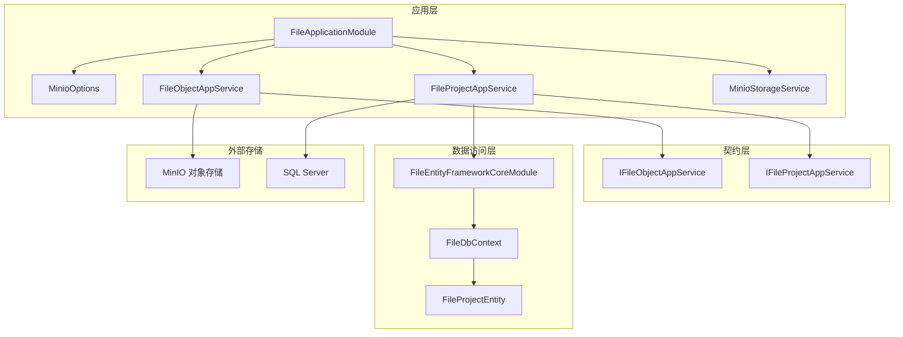
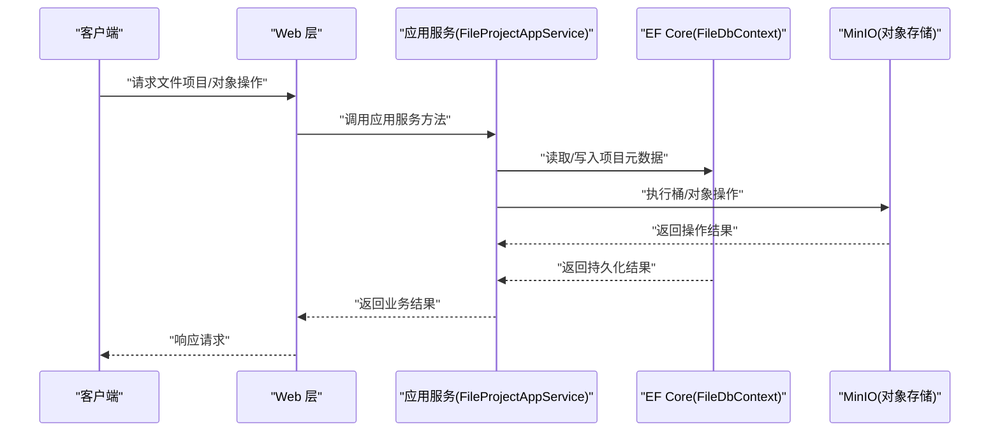
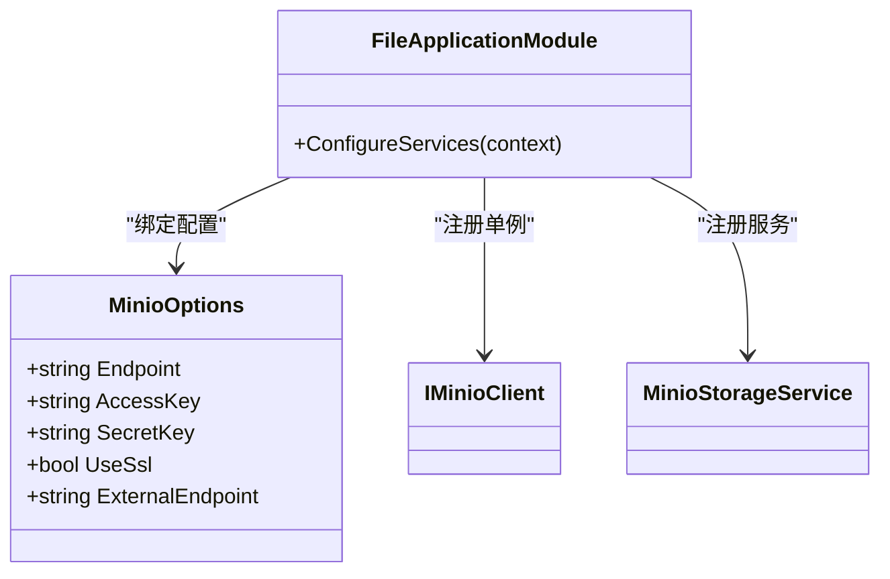
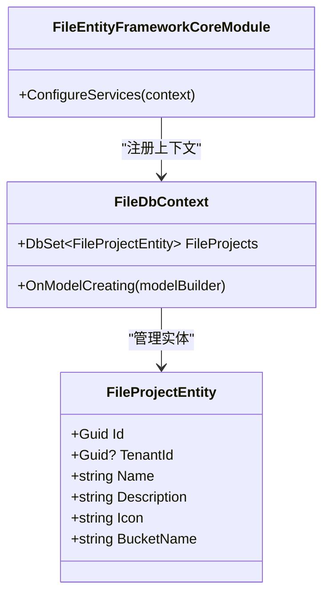
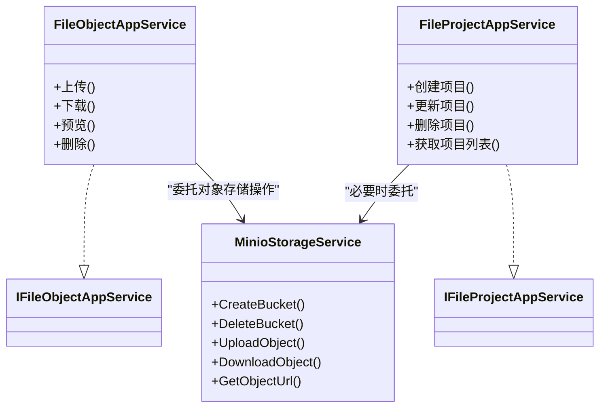
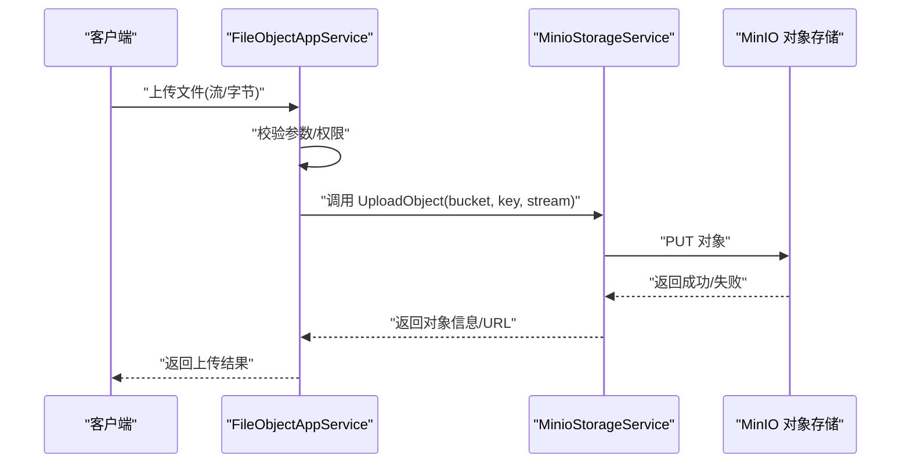
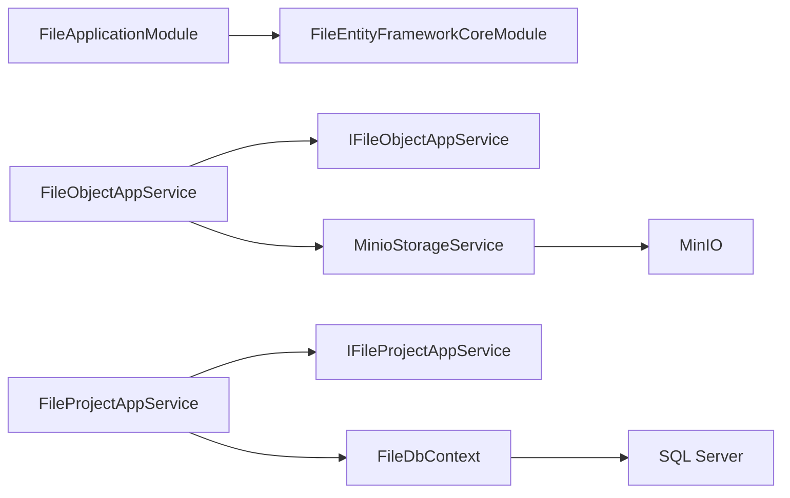

# 文件管理服务

<cite>
**本文引用的文件**   
- [FileApplicationModule.cs](file://src/Services/File/H.File.Application/FileApplicationModule.cs)
- [MinioOptions.cs](file://src/Services/File/H.File.Application/MinioOptions.cs)
- [FileEntityFrameworkCoreModule.cs](file://src/Services/File/H.File.EntityFrameworkCore/FileEntityFrameworkCoreModule.cs)
- [FileDbContext.cs](file://src/Services/File/H.File.EntityFrameworkCore/FileDbContext.cs)
- [FileProjectEntity.cs](file://src/Services/File/H.File.EntityFrameworkCore/Entities/FileProjectEntity.cs)
- [FileObjectAppService.cs](file://src/Services/File/H.File.Application/Services/FileObjectAppService.cs)
- [FileProjectAppService.cs](file://src/Services/File/H.File.Application/Services/FileProjectAppService.cs)
- [MinioStorageService.cs](file://src/Services/File/H.File.Application/Services/MinioStorageService.cs)
- [IFileObjectAppService.cs](file://src/Services/File/H.File.Application.Contracts/Services/IFileObjectAppService.cs)
- [IFileProjectAppService.cs](file://src/Services/File/H.File.Application.Contracts/Services/IFileProjectAppService.cs)
</cite>

## 目录
1. [简介](#简介)
2. [项目结构](#项目结构)
3. [核心组件](#核心组件)
4. [架构总览](#架构总览)
5. [详细组件分析](#详细组件分析)
6. [依赖关系分析](#依赖关系分析)
7. [性能考虑](#性能考虑)
8. [故障排查指南](#故障排查指南)
9. [结论](#结论)
10. [附录](#附录)

## 简介
本文件管理服务基于 ABP 模块化架构，提供对象存储（MinIO）与数据库元数据管理能力。服务通过应用层 AppService 暴露接口，使用 EF Core 管理“文件项目”等元数据，并通过 MinIO 客户端进行实际的上传、下载、预览等操作。该模块支持多租户隔离，每个租户可拥有独立的 Bucket 命名空间，便于资源隔离与权限控制。

## 项目结构
文件管理服务采用典型的分层与模块化组织：
- Application 层：应用服务、配置选项、MinIO 客户端注册
- Application.Contracts 层：对外契约（接口定义）
- EntityFrameworkCore 层：数据库上下文、实体、EF 模块配置
- Web 层：页面与控制器（未在本节深入）

图表来源
- [FileApplicationModule.cs:1-39](file://src/Services/File/H.File.Application/FileApplicationModule.cs#L1-L39)
- [MinioOptions.cs:1-15](file://src/Services/File/H.File.Application/MinioOptions.cs#L1-L15)
- [FileEntityFrameworkCoreModule.cs:1-25](file://src/Services/File/H.File.EntityFrameworkCore/FileEntityFrameworkCoreModule.cs#L1-L25)
- [FileDbContext.cs:1-30](file://src/Services/File/H.File.EntityFrameworkCore/FileDbContext.cs#L1-L30)
- [FileProjectEntity.cs:1-25](file://src/Services/File/H.File.EntityFrameworkCore/Entities/FileProjectEntity.cs#L1-L25)
- [FileObjectAppService.cs](file://src/Services/File/H.File.Application/Services/FileObjectAppService.cs)
- [FileProjectAppService.cs](file://src/Services/File/H.File.Application/Services/FileFileProjectAppService.cs)
- [MinioStorageService.cs](file://src/Services/File/H.File.Application/Services/MinioStorageService.cs)
- [IFileObjectAppService.cs](file://src/Services/File/H.File.Application.Contracts/Services/IFileObjectAppService.cs)
- [IFileProjectAppService.cs](file://src/Services/File/H.File.Application.Contracts/Services/IFileProjectAppService.cs)

章节来源
- [FileApplicationModule.cs:1-39](file://src/Services/File/H.File.Application/FileApplicationModule.cs#L1-L39)
- [FileEntityFrameworkCoreModule.cs:1-25](file://src/Services/File/H.File.EntityFrameworkCore/FileEntityFrameworkCoreModule.cs#L1-L25)

## 核心组件
- 应用模块 FileApplicationModule：负责绑定 MinIO 配置、创建并注入 IMinioClient，以及注册存储服务。
- 配置选项 MinioOptions：封装 MinIO 连接参数（Endpoint、AccessKey、SecretKey、UseSsl、ExternalEndpoint）。
- 数据模块 FileEntityFrameworkCoreModule：注册 EF Core 上下文、默认仓储与连接字符串。
- 数据库上下文 FileDbContext：定义 FileProjects 集合及模型映射。
- 实体 FileProjectEntity：表示一个 MinIO Bucket 的元数据，包含名称、描述、图标、BucketName 等字段，并支持多租户。
- 应用服务：
  - FileObjectAppService：面向文件对象的上传、下载、预览、删除等操作。
  - FileProjectAppService：面向文件项目的 CRUD 与 Bucket 生命周期管理。
- 存储服务 MinioStorageService：封装对 MinIO 的具体调用（如桶操作、对象读写）。
- 契约接口：
  - IFileObjectAppService：文件对象操作的契约。
  - IFileProjectAppService：文件项目管理的契约。

章节来源
- [FileApplicationModule.cs:1-39](file://src/Services/File/H.File.Application/FileApplicationModule.cs#L1-L39)
- [MinioOptions.cs:1-15](file://src/Services/File/H.File.Application/MinioOptions.cs#L1-L15)
- [FileEntityFrameworkCoreModule.cs:1-25](file://src/Services/File/H.File.EntityFrameworkCore/FileEntityFrameworkCoreModule.cs#L1-L25)
- [FileDbContext.cs:1-30](file://src/Services/File/H.File.EntityFrameworkCore/FileDbContext.cs#L1-L30)
- [FileProjectEntity.cs:1-25](file://src/Services/File/H.File.EntityFrameworkCore/Entities/FileProjectEntity.cs#L1-L25)
- [FileObjectAppService.cs](file://src/Services/File/H.File.Application/Services/FileObjectAppService.cs)
- [FileProjectAppService.cs](file://src/Services/File/H.File.Application/Services/FileProjectAppService.cs)
- [MinioStorageService.cs](file://src/Services/File/H.File.Application/Services/MinioStorageService.cs)
- [IFileObjectAppService.cs](file://src/Services/File/H.File.Application.Contracts/Services/IFileObjectAppService.cs)
- [IFileProjectAppService.cs](file://src/Services/File/H.File.Application.Contracts/Services/IFileProjectAppService.cs)

## 架构总览
整体架构遵循 ABP 的分层与模块化设计：
- 表现层（Web）调用应用层 AppService。
- 应用层协调领域逻辑与基础设施（MinIO、EF Core）。
- 数据访问层通过 EF Core 管理元数据持久化。
- 外部系统 MinIO 作为对象存储后端。

图表来源
- [FileProjectAppService.cs](file://src/Services/File/H.File.Application/Services/FileProjectAppService.cs)
- [FileDbContext.cs:1-30](file://src/Services/File/H.File.EntityFrameworkCore/FileDbContext.cs#L1-L30)
- [MinioStorageService.cs](file://src/Services/File/H.File.Application/Services/MinioStorageService.cs)

## 详细组件分析

### 应用模块与配置（FileApplicationModule、MinioOptions）
- FileApplicationModule 在 ConfigureServices 中：
  - 从配置绑定 MinioOptions。
  - 构建并注册单例 IMinioClient（支持 SSL）。
  - 注册 MinioStorageService。
- MinioOptions 提供连接端点、凭据、SSL 开关与外部访问地址，用于生成可直接访问的 URL。

图表来源
- [FileApplicationModule.cs:1-39](file://src/Services/File/H.File.Application/FileApplicationModule.cs#L1-L39)
- [MinioOptions.cs:1-15](file://src/Services/File/H.File.Application/MinioOptions.cs#L1-L15)

章节来源
- [FileApplicationModule.cs:1-39](file://src/Services/File/H.File.Application/FileApplicationModule.cs#L1-L39)
- [MinioOptions.cs:1-15](file://src/Services/File/H.File.Application/MinioOptions.cs#L1-L15)

### 数据访问层（FileEntityFrameworkCoreModule、FileDbContext、FileProjectEntity）
- FileEntityFrameworkCoreModule 注册 FileDbContext 与 SQL Server 提供程序，并设置连接字符串名 FileDb。
- FileDbContext 定义 FileProjects 集合与模型映射，包括唯一索引约束。
- FileProjectEntity 继承 FullAuditedEntity<Guid> 并实现 IMultiTenant，具备审计与多租户能力。

图表来源
- [FileEntityFrameworkCoreModule.cs:1-25](file://src/Services/File/H.File.EntityFrameworkCore/FileEntityFrameworkCoreModule.cs#L1-L25)
- [FileDbContext.cs:1-30](file://src/Services/File/H.File.EntityFrameworkCore/FileDbContext.cs#L1-L30)
- [FileProjectEntity.cs:1-25](file://src/Services/File/H.File.EntityFrameworkCore/Entities/FileProjectEntity.cs#L1-L25)

章节来源
- [FileEntityFrameworkCoreModule.cs:1-25](file://src/Services/File/H.File.EntityFrameworkCore/FileEntityFrameworkCoreModule.cs#L1-L25)
- [FileDbContext.cs:1-30](file://src/Services/File/H.File.EntityFrameworkCore/FileDbContext.cs#L1-L30)
- [FileProjectEntity.cs:1-25](file://src/Services/File/H.File.EntityFrameworkCore/Entities/FileProjectEntity.cs#L1-L25)

### 应用服务与契约（FileObjectAppService、FileProjectAppService、IFileObjectAppService、IFileProjectAppService）
- FileObjectAppService：实现 IFileObjectAppService，提供文件对象相关操作（上传、下载、预览、删除等），通常委托 MinioStorageService 完成具体 IO。
- FileProjectAppService：实现 IFileProjectAppService，提供文件项目 CRUD、Bucket 生命周期管理（创建、删除、校验）等，并与 FileDbContext 交互持久化元数据。

图表来源
- [FileObjectAppService.cs](file://src/Services/File/H.File.Application/Services/FileObjectAppService.cs)
- [FileProjectAppService.cs](file://src/Services/File/H.File.Application/Services/FileProjectAppService.cs)
- [MinioStorageService.cs](file://src/Services/File/H.File.Application/Services/MinioStorageService.cs)
- [IFileObjectAppService.cs](file://src/Services/File/H.File.Application.Contracts/Services/IFileObjectAppService.cs)
- [IFileProjectAppService.cs](file://src/Services/File/H.File.Application.Contracts/Services/IFileProjectAppService.cs)

章节来源
- [FileObjectAppService.cs](file://src/Services/File/H.File.Application/Services/FileObjectAppService.cs)
- [FileProjectAppService.cs](file://src/Services/File/H.File.Application/Services/FileProjectAppService.cs)
- [MinioStorageService.cs](file://src/Services/File/H.File.Application/Services/MinioStorageService.cs)
- [IFileObjectAppService.cs](file://src/Services/File/H.File.Application.Contracts/Services/IFileObjectAppService.cs)
- [IFileProjectAppService.cs](file://src/Services/File/H.File.Application.Contracts/Services/IFileProjectAppService.cs)

### 关键流程时序（文件对象上传）
以下序列图展示一次典型上传流程：客户端发起上传请求，应用服务校验并调用存储服务写入 MinIO，最终返回访问链接或状态。

图表来源
- [FileObjectAppService.cs](file://src/Services/File/H.File.Application/Services/FileObjectAppService.cs)
- [MinioStorageService.cs](file://src/Services/File/H.File.Application/Services/MinioStorageService.cs)

## 依赖关系分析
- 模块依赖：
  - FileApplicationModule 依赖 FileEntityFrameworkCoreModule（通过 DependsOn）。
  - 应用服务依赖契约接口（解耦实现）。
- 运行时依赖：
  - MinIO SDK（IMinioClient）由应用模块统一构建与注入。
  - EF Core 与 SQL Server 提供程序由数据模块配置。
- 外部依赖：
  - MinIO 对象存储服务（HTTP/S）。
  - SQL Server 数据库（元数据持久化）。

图表来源
- [FileApplicationModule.cs:1-39](file://src/Services/File/H.File.Application/FileApplicationModule.cs#L1-L39)
- [FileEntityFrameworkCoreModule.cs:1-25](file://src/Services/File/H.File.EntityFrameworkCore/FileEntityFrameworkCoreModule.cs#L1-L25)
- [FileObjectAppService.cs](file://src/Services/File/H.File.Application/Services/FileObjectAppService.cs)
- [FileProjectAppService.cs](file://src/Services/File/H.File.Application/Services/FileProjectAppService.cs)
- [MinioStorageService.cs](file://src/Services/File/H.File.Application/Services/MinioStorageService.cs)
- [FileDbContext.cs:1-30](file://src/Services/File/H.File.EntityFrameworkCore/FileDbContext.cs#L1-L30)

章节来源
- [FileApplicationModule.cs:1-39](file://src/Services/File/H.File.Application/FileApplicationModule.cs#L1-L39)
- [FileEntityFrameworkCoreModule.cs:1-25](file://src/Services/File/H.File.EntityFrameworkCore/FileEntityFrameworkCoreModule.cs#L1-L25)

## 性能考虑
- 大文件传输：建议采用分块上传与断点续传，减少内存占用与网络失败影响。
- 并发与限流：在高并发场景下，为 MinIO 客户端与数据库连接池设置合理上限，避免资源耗尽。
- 缓存策略：对于频繁访问的静态资源，可在 CDN 或反向代理层缓存；对外部访问地址（ExternalEndpoint）配合缓存头优化。
- 索引与查询：FileProjects 的 BucketName 已建立唯一索引，确保快速定位与冲突检测。
- 序列化与 DTO：尽量使用轻量 DTO 减少网络负载。

[本节为通用指导，不直接分析具体文件]

## 故障排查指南
- MinIO 连接失败：
  - 检查 MinioOptions.Endpoint、AccessKey、SecretKey、UseSsl 配置是否正确。
  - 确认网络可达性与防火墙规则。
- 上传/下载异常：
  - 核对 Bucket 是否存在且权限正确。
  - 检查对象键（key）是否合法，避免非法字符与过长路径。
- 数据库连接问题：
  - 确认 FileDb 连接字符串有效，SQL Server 服务可用。
  - 检查 EF Core 迁移是否已执行。
- 多租户隔离异常：
  - 验证 TenantId 是否正确设置，BucketName 是否包含租户前缀。

章节来源
- [MinioOptions.cs:1-15](file://src/Services/File/H.File.Application/MinioOptions.cs#L1-L15)
- [FileEntityFrameworkCoreModule.cs:1-25](file://src/Services/File/H.File.EntityFrameworkCore/FileEntityFrameworkCoreModule.cs#L1-L25)
- [FileDbContext.cs:1-30](file://src/Services/File/H.File.EntityFrameworkCore/FileDbContext.cs#L1-L30)

## 结论
文件管理服务以 ABP 模块化为基础，结合 EF Core 与 MinIO 实现了对象存储与元数据的统一管理。通过清晰的层次划分与依赖注入，服务具备良好的可扩展性与可维护性。建议在部署时完善配置与监控，并在高并发场景下进行容量规划与性能调优。

[本节为总结性内容，不直接分析具体文件]

## 附录
- 配置项建议：
  - Minio.Endpoint：MinIO 服务端点（含端口）
  - Minio.AccessKey / Minio.SecretKey：访问凭据
  - Minio.UseSsl：是否启用 HTTPS
  - Minio.ExternalEndpoint：用于生成可直接访问的 URL
  - ConnectionStrings.FileDb：SQL Server 连接字符串
- 常见操作清单：
  - 创建/删除 Bucket
  - 上传/下载/预览/删除对象
  - 生成带过期时间的访问链接
  - 按项目（Bucket）维度进行权限与配额管理

[本节为补充信息，不直接分析具体文件]