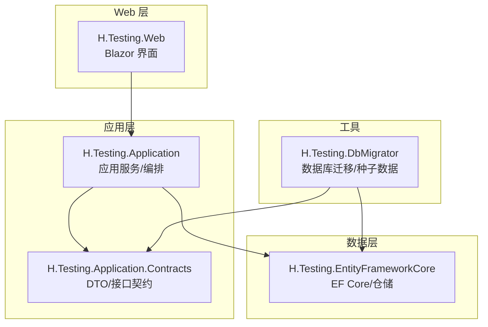
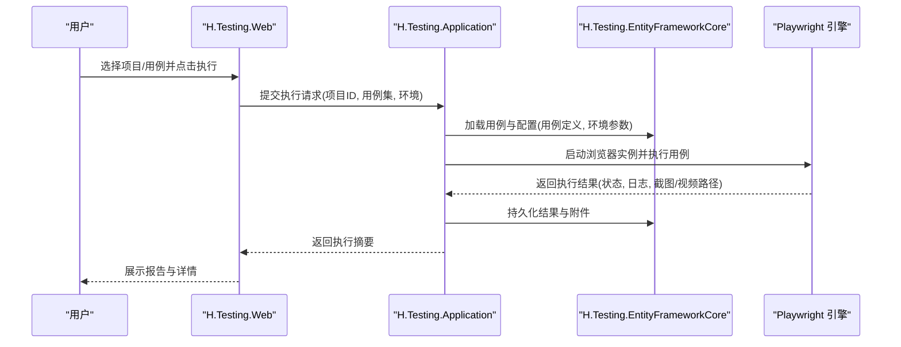
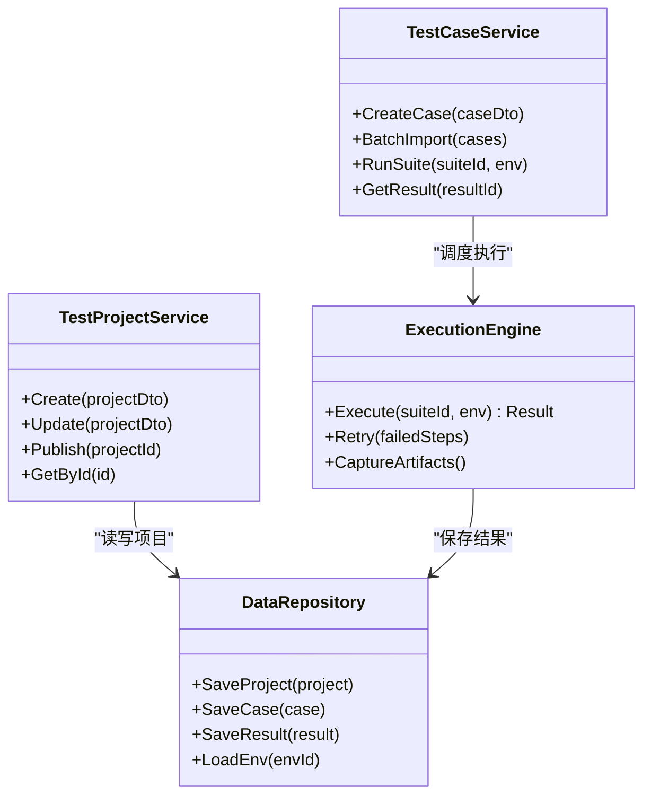
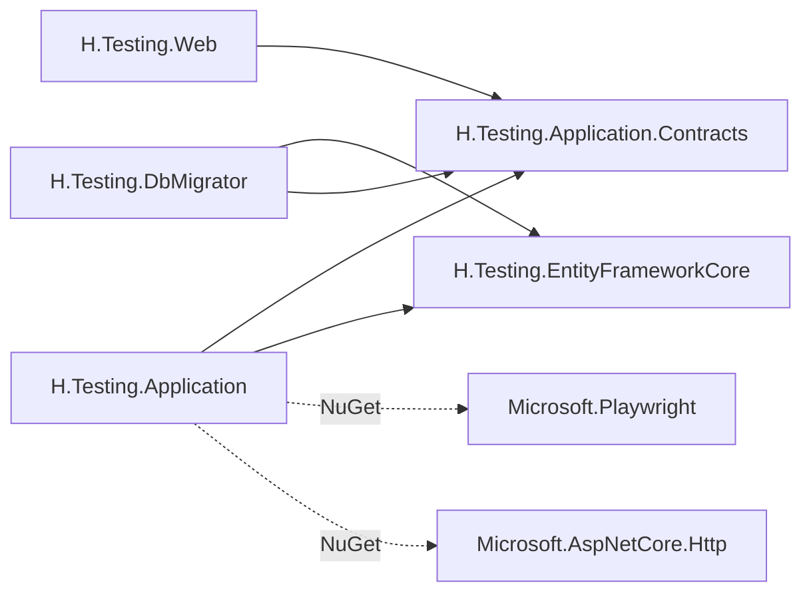

# 测试服务

<cite>
**本文引用的文件**   
- [H.Testing.Application.csproj](file://src/Services/Testing/H.Testing.Application/H.Testing.Application.csproj)
- [H.Testing.Application.Contracts.csproj](file://src/Services/Testing/H.Testing.Application.Contracts/H.Testing.Application.Contracts.csproj)
- [H.Testing.EntityFrameworkCore.csproj](file://src/Services/Testing/H.Testing.EntityFrameworkCore/H.Testing.EntityFrameworkCore.csproj)
- [H.Testing.Web.csproj](file://src/Services/Testing/H.Testing.Web/H.Testing.Web.csproj)
- [H.Testing.DbMigrator.csproj](file://src/Tools/H.Testing.DbMigrator/H.Testing.DbMigrator.csproj)
</cite>

## 目录
1. [简介](#简介)
2. [项目结构](#项目结构)
3. [核心组件](#核心组件)
4. [架构总览](#架构总览)
5. [详细组件分析](#详细组件分析)
6. [依赖关系分析](#依赖关系分析)
7. [性能考虑](#性能考虑)
8. [故障排查指南](#故障排查指南)
9. [结论](#结论)
10. [附录](#附录)

## 简介
本文件为 AppLab 测试服务的完整技术文档，围绕测试项目管理、用例管理、执行引擎、结果分析等能力进行系统化说明。结合 Playwright 集成、录制回放、批量执行与环境管理，给出端到端的自动化测试流程与报告生成方案，并提供 API 接口与界面使用说明、扩展开发与持续集成配置建议。

## 项目结构
测试服务采用 ABP 模块化分层架构，按应用层、契约层、数据访问层与 Web 层划分，并配套数据库迁移工具。关键项目如下：
- H.Testing.Application：应用服务与业务编排，集成 Playwright 执行引擎。
- H.Testing.Application.Contracts：对外暴露的 DTO、枚举与服务接口契约。
- H.Testing.EntityFrameworkCore：实体模型、仓储与 EF Core 数据访问。
- H.Testing.Web：Blazor Web 界面，提供测试管理与执行入口。
- H.Testing.DbMigrator：数据库迁移与种子数据初始化。

图表来源
- [H.Testing.Web.csproj](file://src/Services/Testing/H.Testing.Web/H.Testing.Web.csproj)
- [H.Testing.Application.csproj](file://src/Services/Testing/H.Testing.Application/H.Testing.Application.csproj)
- [H.Testing.Application.Contracts.csproj](file://src/Services/Testing/H.Testing.Application.Contracts/H.Testing.Application.Contracts.csproj)
- [H.Testing.EntityFrameworkCore.csproj](file://src/Services/Testing/H.Testing.EntityFrameworkCore/H.Testing.EntityFrameworkCore.csproj)
- [H.Testing.DbMigrator.csproj](file://src/Tools/H.Testing.DbMigrator/H.Testing.DbMigrator.csproj)

章节来源
- [H.Testing.Application.csproj:1-21](file://src/Services/Testing/H.Testing.Application/H.Testing.Application.csproj#L1-L21)
- [H.Testing.Application.Contracts.csproj:1-7](file://src/Services/Testing/H.Testing.Application.Contracts/H.Testing.Application.Contracts.csproj#L1-L7)
- [H.Testing.EntityFrameworkCore.csproj:1-17](file://src/Services/Testing/H.Testing.EntityFrameworkCore/H.Testing.EntityFrameworkCore.csproj#L1-L17)
- [H.Testing.Web.csproj:1-16](file://src/Services/Testing/H.Testing.Web/H.Testing.Web.csproj#L1-L16)
- [H.Testing.DbMigrator.csproj:1-30](file://src/Tools/H.Testing.DbMigrator/H.Testing.DbMigrator.csproj#L1-L30)

## 核心组件
- 测试项目管理
  - 负责测试项目的创建、编辑、版本化与发布；维护项目元数据、环境绑定与权限控制。
- 用例管理
  - 用例建模（页面、步骤、断言、参数化）、录制回放脚本管理、用例分组与标签。
- 执行引擎
  - 基于 Playwright 的浏览器自动化执行器，支持并发调度、重试、超时控制与资源隔离。
- 结果分析
  - 执行日志采集、截图/视频归档、指标统计、失败根因定位与报告聚合。
- 环境管理
  - 多环境（开发/测试/预发/生产）配置、环境变量注入、凭据与代理设置。
- 报告与可视化
  - 结构化测试结果输出（JSON/HTML），趋势图、通过率、耗时分布与缺陷关联。

章节来源
- [H.Testing.Application.csproj:1-21](file://src/Services/Testing/H.Testing.Application/H.Testing.Application.csproj#L1-L21)
- [H.Testing.Web.csproj:1-16](file://src/Services/Testing/H.Testing.Web/H.Testing.Web.csproj#L1-L16)

## 架构总览
测试服务整体遵循“前端界面 -> 应用服务 -> 数据访问”的分层调用链，并通过 Playwright 驱动浏览器完成 UI 自动化。执行任务可异步调度，结果持久化后由 Web 端展示。

图表来源
- [H.Testing.Web.csproj:1-16](file://src/Services/Testing/H.Testing.Web/H.Testing.Web.csproj#L1-L16)
- [H.Testing.Application.csproj:1-21](file://src/Services/Testing/H.Testing.Application/H.Testing.Application.csproj#L1-L21)
- [H.Testing.EntityFrameworkCore.csproj:1-17](file://src/Services/Testing/H.Testing.EntityFrameworkCore/H.Testing.EntityFrameworkCore.csproj#L1-L17)

## 详细组件分析

### 应用服务与执行引擎（H.Testing.Application）
- 职责
  - 编排用例执行流程：解析用例、准备环境、调度 Playwright、收集结果。
  - 管理并发与资源：线程池/进程隔离、浏览器实例复用策略、超时与重试。
  - 集成外部依赖：HTTP 客户端、配置中心、对象存储（截图/视频）。
- 关键设计点
  - 使用 Microsoft.Playwright 驱动浏览器，支持多浏览器内核。
  - 通过 ASP.NET Core HTTP 扩展与 HttpClient 集成外部系统。
  - 与 EF Core 仓储交互，读写测试项目、用例与结果。

图表来源
- [H.Testing.Application.csproj:1-21](file://src/Services/Testing/H.Testing.Application/H.Testing.Application.csproj#L1-L21)

章节来源
- [H.Testing.Application.csproj:1-21](file://src/Services/Testing/H.Testing.Application/H.Testing.Application.csproj#L1-L21)

### 契约层（H.Testing.Application.Contracts）
- 职责
  - 定义跨层共享的 DTO、枚举与服务接口，确保前后端一致的数据契约。
- 典型内容
  - 项目/用例/结果的 DTO 结构。
  - 执行状态、优先级、环境类型等枚举。
  - 应用服务接口声明（CRUD、执行、查询）。

章节来源
- [H.Testing.Application.Contracts.csproj:1-7](file://src/Services/Testing/H.Testing.Application.Contracts/H.Testing.Application.Contracts.csproj#L1-L7)

### 数据访问层（H.Testing.EntityFrameworkCore）
- 职责
  - 基于 EF Core 的实体映射、仓储实现与数据库操作。
- 关键点
  - 使用 Volo.Abp.EntityFrameworkCore 提供的通用仓储与审计特性。
  - 支持 SQL Server 作为默认数据库。

章节来源
- [H.Testing.EntityFrameworkCore.csproj:1-17](file://src/Services/Testing/H.Testing.EntityFrameworkCore/H.Testing.EntityFrameworkCore.csproj#L1-L17)

### Web 界面（H.Testing.Web）
- 职责
  - 提供 Blazor 页面用于测试项目与用例的可视化管理。
  - 触发执行、查看报告、下载附件。
- 依赖
  - 依赖应用契约层与通用 UI 组件库。

章节来源
- [H.Testing.Web.csproj:1-16](file://src/Services/Testing/H.Testing.Web/H.Testing.Web.csproj#L1-L16)

### 数据库迁移（H.Testing.DbMigrator）
- 职责
  - 执行 EF Core 迁移，初始化种子数据。
- 关键点
  - 独立控制台程序，读取 appsettings.json 配置连接字符串。
  - 复制种子数据 JSON 到输出目录以便运行。

章节来源
- [H.Testing.DbMigrator.csproj:1-30](file://src/Tools/H.Testing.DbMigrator/H.Testing.DbMigrator.csproj#L1-L30)

## 依赖关系分析
- 内部依赖
  - Web 层依赖应用契约层与通用 UI 组件。
  - 应用层依赖契约层与 EF Core 数据访问。
  - 迁移工具依赖 EF Core 与契约层。
- 外部依赖
  - Playwright 用于浏览器自动化。
  - ASP.NET Core HTTP 扩展用于外部系统集成。
  - ABP 框架提供领域服务、多租户与自动映射等能力。

图表来源
- [H.Testing.Web.csproj:1-16](file://src/Services/Testing/H.Testing.Web/H.Testing.Web.csproj#L1-L16)
- [H.Testing.Application.csproj:1-21](file://src/Services/Testing/H.Testing.Application/H.Testing.Application.csproj#L1-L21)
- [H.Testing.Application.Contracts.csproj:1-7](file://src/Services/Testing/H.Testing.Application.Contracts/H.Testing.Application.Contracts.csproj#L1-L7)
- [H.Testing.EntityFrameworkCore.csproj:1-17](file://src/Services/Testing/H.Testing.EntityFrameworkCore/H.Testing.EntityFrameworkCore.csproj#L1-L17)
- [H.Testing.DbMigrator.csproj:1-30](file://src/Tools/H.Testing.DbMigrator/H.Testing.DbMigrator.csproj#L1-L30)

章节来源
- [H.Testing.Application.csproj:1-21](file://src/Services/Testing/H.Testing.Application/H.Testing.Application.csproj#L1-L21)
- [H.Testing.Web.csproj:1-16](file://src/Services/Testing/H.Testing.Web/H.Testing.Web.csproj#L1-L16)

## 性能考虑
- 执行引擎
  - 合理设置并发度与浏览器实例池大小，避免资源争用。
  - 启用无头模式与最小化窗口以提升吞吐。
  - 对长耗时步骤增加超时与重试策略，降低偶发失败影响。
- 数据访问
  - 分页查询与索引优化，减少大结果集传输。
  - 批量写入结果与附件，降低 I/O 开销。
- 存储与网络
  - 截图/视频上传至对象存储，避免本地磁盘瓶颈。
  - 使用连接池与缓存减少外部依赖延迟。

[本节为通用指导，不直接分析具体文件]

## 故障排查指南
- 常见问题
  - 浏览器启动失败：检查 Playwright 依赖安装与系统环境。
  - 用例执行超时：调整超时阈值与网络代理配置。
  - 结果缺失：确认对象存储与数据库连接正常。
- 诊断手段
  - 查看执行日志与错误堆栈。
  - 下载失败用例的截图/视频定位问题。
  - 核对环境配置与凭据有效性。

[本节为通用指导，不直接分析具体文件]

## 结论
AppLab 测试服务以 ABP 分层架构为基础，结合 Playwright 构建稳定高效的 UI 自动化执行引擎。通过完善的项目与用例管理、环境配置与结果分析能力，形成完整的自动化测试闭环。建议在 CI/CD 中集成批量执行与报告聚合，持续提升质量保障效率。

[本节为总结性内容，不直接分析具体文件]

## 附录

### API 接口概览（建议）
- 测试项目
  - POST /api/test-projects：创建项目
  - PUT /api/test-projects/{id}：更新项目
  - GET /api/test-projects/{id}：获取项目详情
  - DELETE /api/test-projects/{id}：删除项目
- 用例管理
  - POST /api/test-cases：创建用例
  - POST /api/test-cases/batch-import：批量导入用例
  - GET /api/test-cases/{id}：获取用例详情
- 执行与结果
  - POST /api/test-suites/{suiteId}/run：执行用例集
  - GET /api/test-results/{resultId}：获取执行结果
  - GET /api/test-results/{resultId}/artifacts：下载附件

[本节为概念性接口说明，未直接映射具体代码文件]

### 测试管理界面使用说明（建议）
- 项目与用例
  - 在“测试项目”页新建项目，绑定环境与成员。
  - 在“用例管理”页创建或导入用例，设置步骤与断言。
- 执行与报告
  - 选择用例集与环境，点击执行；实时查看进度与日志。
  - 打开报告页查看通过率、耗时与失败详情，下载附件辅助定位。

[本节为概念性界面说明，未直接映射具体代码文件]

### 扩展开发与持续集成配置（建议）
- 扩展点
  - 新增自定义动作与断言：在应用层扩展执行引擎。
  - 新增数据源与报表：在 EF Core 层扩展实体与仓储。
- CI/CD
  - 在流水线中执行数据库迁移与种子数据初始化。
  - 并行执行用例集，聚合报告并归档附件。
  - 失败时发送通知并回滚变更。

[本节为概念性扩展与 CI/CD 建议，未直接映射具体代码文件]