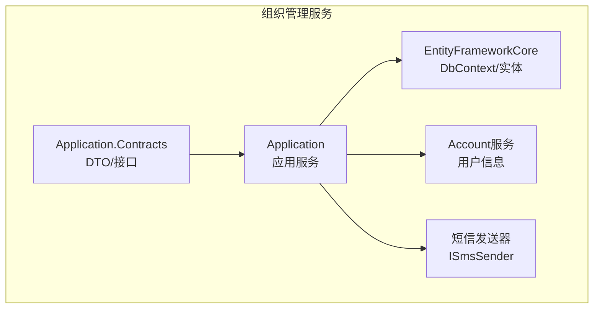
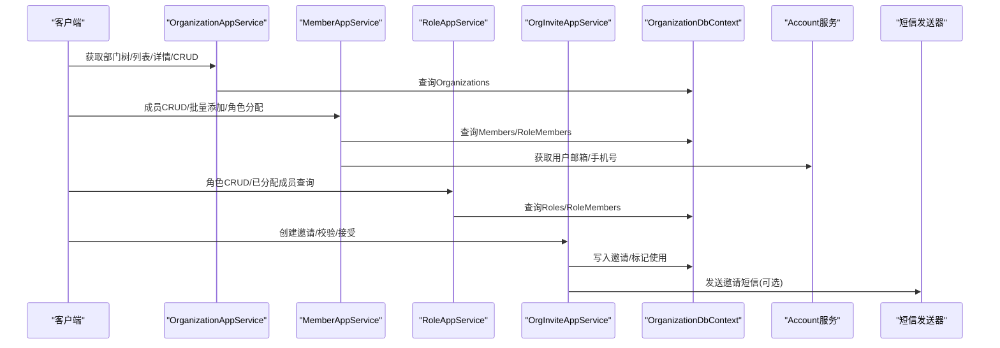
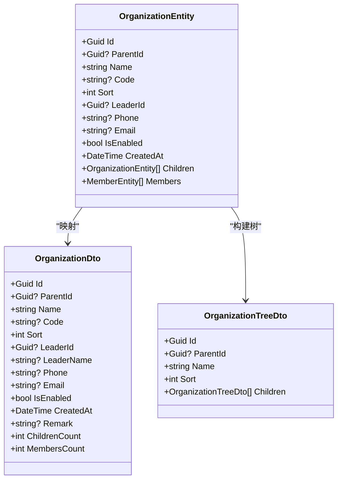
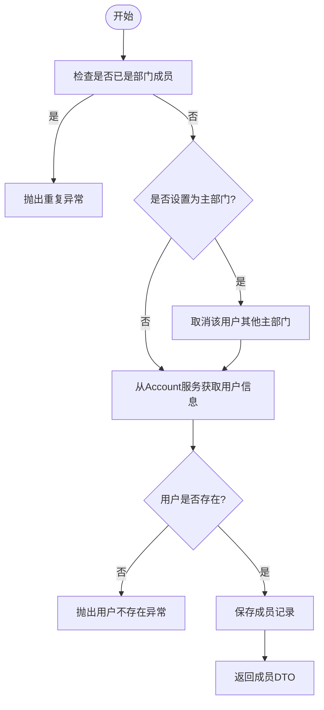
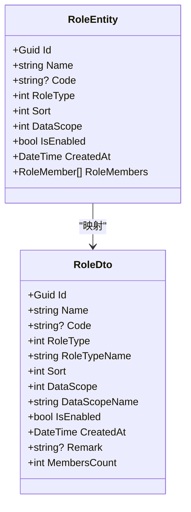
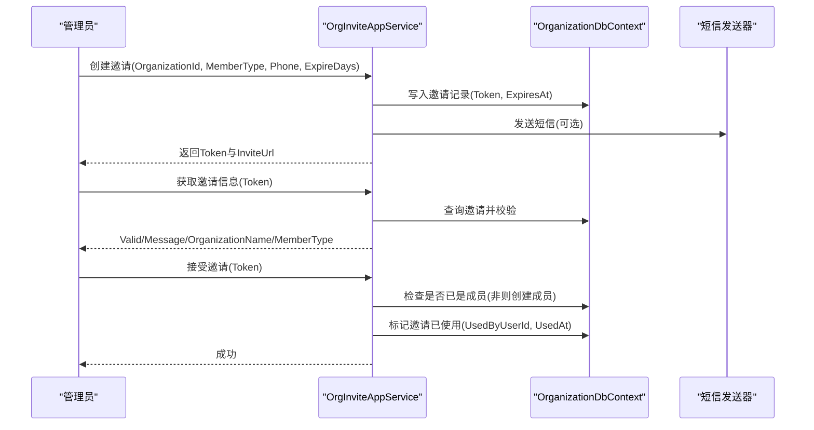
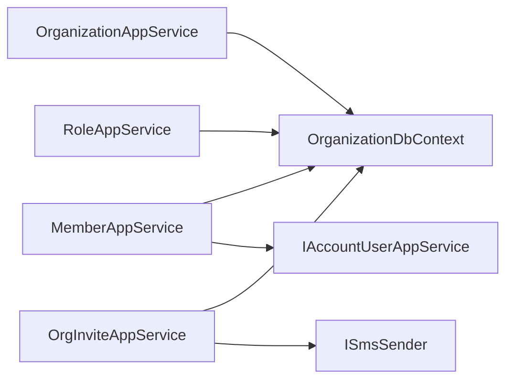

# 组织管理服务

<cite>
**本文引用的文件**   
- [OrganizationAppService.cs](file://src/Services/Organization/H.Organization.Application/Services/OrganizationAppService.cs)
- [MemberAppService.cs](file://src/Services/Organization/H.Organization.Application/Services/MemberAppService.cs)
- [RoleAppService.cs](file://src/Services/Organization/H.Organization.Application/Services/RoleAppService.cs)
- [OrgInviteAppService.cs](file://src/Services/Organization/H.Organization.Application/Services/OrgInviteAppService.cs)
- [OrganizationDto.cs](file://src/Services/Organization/H.Organization.Application.Contracts/Dtos/OrganizationDto.cs)
- [MemberDto.cs](file://src/Services/Organization/H.Organization.Application.Contracts/Dtos/MemberDto.cs)
- [RoleDto.cs](file://src/Services/Organization/H.Organization.Application.Contracts/Dtos/RoleDto.cs)
- [InviteDto.cs](file://src/Services/Organization/H.Organization.Application.Contracts/Dtos/InviteDto.cs)
- [OrganizationDbContextModelSnapshot.cs](file://src/Tools/H.Organization.DbMigrator/Migrations/OrganizationDbContextModelSnapshot.cs)
</cite>

## 目录
1. [简介](#简介)
2. [项目结构](#项目结构)
3. [核心组件](#核心组件)
4. [架构总览](#架构总览)
5. [详细组件分析](#详细组件分析)
6. [依赖关系分析](#依赖关系分析)
7. [性能考量](#性能考量)
8. [故障排查指南](#故障排查指南)
9. [结论](#结论)
10. [附录：API接口文档](#附录api接口文档)

## 简介
本文件为 AppLab 组织管理服务的完整技术文档，覆盖组织架构、部门管理、成员管理、角色与权限分配、邀请加入流程，以及多租户隔离与数据权限控制。文档面向产品、研发与运维人员，既提供高层架构说明，也包含代码级实现要点与最佳实践建议。

## 项目结构
组织管理服务位于 Services/Organization 下，采用 ABP 应用服务分层：
- Application.Contracts：对外暴露的 DTO、查询参数与服务接口定义
- Application：应用服务实现（业务编排、跨服务调用）
- EntityFrameworkCore：实体与数据库上下文（通过迁移快照可见表结构与字段）
- Web：Web 层模块（页面与路由，不在本文重点）

图表来源
- [OrganizationAppService.cs:1-20](file://src/Services/Organization/H.Organization.Application/Services/OrganizationAppService.cs#L1-L20)
- [MemberAppService.cs:1-25](file://src/Services/Organization/H.Organization.Application/Services/MemberAppService.cs#L1-L25)
- [OrgInviteAppService.cs:1-25](file://src/Services/Organization/H.Organization.Application/Services/OrgInviteAppService.cs#L1-L25)

章节来源
- [OrganizationAppService.cs:1-20](file://src/Services/Organization/H.Organization.Application/Services/OrganizationAppService.cs#L1-L20)
- [MemberAppService.cs:1-25](file://src/Services/Organization/H.Organization.Application/Services/MemberAppService.cs#L1-L25)
- [OrgInviteAppService.cs:1-25](file://src/Services/Organization/H.Organization.Application/Services/OrgInviteAppService.cs#L1-L25)

## 核心组件
- 部门服务（OrganizationAppService）：部门树构建、分页查询、CRUD、子部门用户聚合
- 成员服务（MemberAppService）：成员增删改查、批量添加、主部门约束、角色分配、跨 Account 服务获取用户信息
- 角色服务（RoleAppService）：角色 CRUD、启用过滤、数据范围、成员关联查询
- 邀请服务（OrgInviteAppService）：创建邀请、校验链接有效性、接受邀请并自动入组、短信通知

章节来源
- [OrganizationAppService.cs:20-276](file://src/Services/Organization/H.Organization.Application/Services/OrganizationAppService.cs#L20-L276)
- [MemberAppService.cs:20-481](file://src/Services/Organization/H.Organization.Application/Services/MemberAppService.cs#L20-L481)
- [RoleAppService.cs:20-258](file://src/Services/Organization/H.Organization.Application/Services/RoleAppService.cs#L20-L258)
- [OrgInviteAppService.cs:20-157](file://src/Services/Organization/H.Organization.Application/Services/OrgInviteAppService.cs#L20-L157)

## 架构总览
组织管理服务以 ABP 应用服务为核心，通过 EF Core 访问数据库，并与 Account 服务集成获取用户基础信息；邀请流程支持短信通道。

图表来源
- [OrganizationAppService.cs:20-120](file://src/Services/Organization/H.Organization.Application/Services/OrganizationAppService.cs#L20-L120)
- [MemberAppService.cs:20-120](file://src/Services/Organization/H.Organization.Application/Services/MemberAppService.cs#L20-L120)
- [RoleAppService.cs:20-120](file://src/Services/Organization/H.Organization.Application/Services/RoleAppService.cs#L20-L120)
- [OrgInviteAppService.cs:20-120](file://src/Services/Organization/H.Organization.Application/Services/OrgInviteAppService.cs#L20-L120)

## 详细组件分析

### 部门（组织）模型与服务
- 实体字段与层级
  - 自引用 ParentId 形成树形结构，Sort 控制排序，IsEnabled 控制启用状态
  - 负责人 LeaderId、联系方式 Phone/Email、备注 Remark
- 关键能力
  - 树形构建：一次性加载并按 ParentId 分组递归组装 Children
  - 分页查询：支持按父部门、关键字（名称/编码）、启用状态筛选
  - 删除保护：存在子部门或成员时禁止删除
  - 子部门用户聚合：可递归收集指定部门及其所有子部门的成员用户ID

图表来源
- [OrganizationDto.cs:1-237](file://src/Services/Organization/H.Organization.Application.Contracts/Dtos/OrganizationDto.cs#L1-L237)
- [OrganizationDbContextModelSnapshot.cs:201-232](file://src/Tools/H.Organization.DbMigrator/Migrations/OrganizationDbContextModelSnapshot.cs#L201-L232)

章节来源
- [OrganizationAppService.cs:20-120](file://src/Services/Organization/H.Organization.Application/Services/OrganizationAppService.cs#L20-L120)
- [OrganizationAppService.cs:120-276](file://src/Services/Organization/H.Organization.Application/Services/OrganizationAppService.cs#L120-L276)
- [OrganizationDto.cs:1-237](file://src/Services/Organization/H.Organization.Application.Contracts/Dtos/OrganizationDto.cs#L1-L237)
- [OrganizationDbContextModelSnapshot.cs:201-232](file://src/Tools/H.Organization.DbMigrator/Migrations/OrganizationDbContextModelSnapshot.cs#L201-L232)

### 成员模型与服务
- 成员属性
  - 关联部门 OrganizationId、用户 UserId、用户名 UserName
  - 成员类型（普通成员/部门负责人/部门经理）、排序、是否主部门、是否启用
- 关键能力
  - 分页查询：支持按部门、关键字（用户名）、成员类型、启用状态筛选
  - 添加成员：去重检查、主部门全局唯一性维护、从 Account 服务拉取用户信息
  - 批量添加：去重、首个新增部门可设为主部门
  - 角色分配：全量重建成员-角色关联
  - 跨服务增强：尝试从 Account 服务补充邮箱/手机号

图表来源
- [MemberAppService.cs:150-210](file://src/Services/Organization/H.Organization.Application/Services/MemberAppService.cs#L150-L210)
- [MemberDto.cs:1-259](file://src/Services/Organization/H.Organization.Application.Contracts/Dtos/MemberDto.cs#L1-L259)

章节来源
- [MemberAppService.cs:20-210](file://src/Services/Organization/H.Organization.Application/Services/MemberAppService.cs#L20-L210)
- [MemberAppService.cs:210-481](file://src/Services/Organization/H.Organization.Application/Services/MemberAppService.cs#L210-L481)
- [MemberDto.cs:1-259](file://src/Services/Organization/H.Organization.Application.Contracts/Dtos/MemberDto.cs#L1-L259)

### 角色模型与服务
- 角色属性
  - 名称、编码、类型（系统角色/自定义角色）、排序、数据范围（全部/本部门/仅本人）、启用状态
- 关键能力
  - 分页查询：支持关键字（名称/编码）、角色类型、启用状态
  - 创建/更新：编码唯一性校验
  - 删除保护：存在成员关联时禁止删除
  - 成员关联：查询角色已分配成员（含用户名与部门名）

图表来源
- [RoleDto.cs:1-202](file://src/Services/Organization/H.Organization.Application.Contracts/Dtos/RoleDto.cs#L1-L202)
- [OrganizationDbContextModelSnapshot.cs:234-238](file://src/Tools/H.Organization.DbMigrator/Migrations/OrganizationDbContextModelSnapshot.cs#L234-L238)

章节来源
- [RoleAppService.cs:20-258](file://src/Services/Organization/H.Organization.Application/Services/RoleAppService.cs#L20-L258)
- [RoleDto.cs:1-202](file://src/Services/Organization/H.Organization.Application.Contracts/Dtos/RoleDto.cs#L1-L202)

### 邀请加入流程
- 创建邀请：生成令牌、计算过期时间、构造邀请URL、可选发送短信
- 校验邀请：检查令牌有效性、是否已使用、是否过期
- 接受邀请：当前登录用户自动成为成员（若尚未加入），标记邀请已使用

图表来源
- [OrgInviteAppService.cs:20-157](file://src/Services/Organization/H.Organization.Application/Services/OrgInviteAppService.cs#L20-L157)
- [InviteDto.cs:1-90](file://src/Services/Organization/H.Organization.Application.Contracts/Dtos/InviteDto.cs#L1-L90)

章节来源
- [OrgInviteAppService.cs:20-157](file://src/Services/Organization/H.Organization.Application/Services/OrgInviteAppService.cs#L20-L157)
- [InviteDto.cs:1-90](file://src/Services/Organization/H.Organization.Application.Contracts/Dtos/InviteDto.cs#L1-L90)

## 依赖关系分析
- 内部依赖
  - 应用服务均依赖 OrganizationDbContext 进行数据访问
  - 成员服务依赖 IAccountUserAppService 获取用户详细信息
  - 邀请服务依赖 ISmsSender 发送短信
- 外部依赖
  - Account 服务：统一用户信息管理
  - 短信网关：邀请通知

图表来源
- [OrganizationAppService.cs:1-20](file://src/Services/Organization/H.Organization.Application/Services/OrganizationAppService.cs#L1-L20)
- [MemberAppService.cs:1-25](file://src/Services/Organization/H.Organization.Application/Services/MemberAppService.cs#L1-L25)
- [RoleAppService.cs:1-20](file://src/Services/Organization/H.Organization.Application/Services/RoleAppService.cs#L1-L20)
- [OrgInviteAppService.cs:1-25](file://src/Services/Organization/H.Organization.Application/Services/OrgInviteAppService.cs#L1-L25)

章节来源
- [OrganizationAppService.cs:1-20](file://src/Services/Organization/H.Organization.Application/Services/OrganizationAppService.cs#L1-L20)
- [MemberAppService.cs:1-25](file://src/Services/Organization/H.Organization.Application/Services/MemberAppService.cs#L1-L25)
- [RoleAppService.cs:1-20](file://src/Services/Organization/H.Organization.Application/Services/RoleAppService.cs#L1-L20)
- [OrgInviteAppService.cs:1-25](file://src/Services/Organization/H.Organization.Application/Services/OrgInviteAppService.cs#L1-L25)

## 性能考量
- 树形构建：一次性加载并按 ParentId 分组，避免 N+1 查询
- 分页与投影：使用 Skip/Take 与 Select 投影减少数据传输
- 关联查询优化：按需 Include 必要导航属性，避免过度加载
- 跨服务调用：对 Account 服务调用做异常捕获与降级处理，保证可用性
- 删除保护：在删除前进行子部门/成员存在性检查，防止脏数据

[本节为通用指导，不直接分析具体文件]

## 故障排查指南
- 常见异常
  - 部门不存在：更新/删除前需校验实体存在
  - 子部门未清空：删除父部门前需先删除子部门
  - 成员未清空：删除部门前需移除成员
  - 角色编码重复：创建/更新时需校验编码唯一性
  - 用户不存在：添加成员时需确保用户在 Account 服务中存在
  - 邀请无效/已使用/已过期：接受邀请前需校验邀请状态
- 定位建议
  - 查看应用服务抛出的异常消息
  - 检查 DbContext 相关表的约束与索引
  - 核对跨服务调用（Account、短信）的连通性与配置

章节来源
- [OrganizationAppService.cs:170-218](file://src/Services/Organization/H.Organization.Application/Services/OrganizationAppService.cs#L170-L218)
- [MemberAppService.cs:150-210](file://src/Services/Organization/H.Organization.Application/Services/MemberAppService.cs#L150-L210)
- [RoleAppService.cs:106-180](file://src/Services/Organization/H.Organization.Application/Services/RoleAppService.cs#L106-L180)
- [OrgInviteAppService.cs:70-157](file://src/Services/Organization/H.Organization.Application/Services/OrgInviteAppService.cs#L70-L157)

## 结论
组织管理服务围绕“部门-成员-角色”的核心模型，提供完整的 CRUD、树形展示、分页查询、批量操作与邀请加入流程。通过 ABP 应用服务分层与 EF Core 数据访问，结合 Account 服务与短信通道，实现了企业级组织管理的常用能力。建议在扩展中继续强化多租户隔离、细粒度数据权限与审计追踪。

[本节为总结，不直接分析具体文件]

## 附录：API接口文档

### 部门（Organization）
- 获取部门树
  - 方法：GetAllAsTreeAsync
  - 功能：返回启用的部门树（按 Sort 排序）
  - 输出：OrganizationTreeDto[]
- 获取部门列表
  - 方法：GetListAsync
  - 输入：OrganizationQueryParams（ParentId、Keyword、IsEnabled、PageIndex、PageSize）
  - 输出：PagedResult<OrganizationDto>
- 获取部门详情
  - 方法：GetByIdAsync
  - 输入：id
  - 输出：OrganizationDto?
- 创建部门
  - 方法：CreateAsync
  - 输入：CreateOrganizationDto
  - 输出：OrganizationDto
- 更新部门
  - 方法：UpdateAsync
  - 输入：id, UpdateOrganizationDto
  - 输出：OrganizationDto
- 删除部门
  - 方法：DeleteAsync
  - 输入：id
  - 注意：存在子部门或成员时抛出异常
- 批量删除部门
  - 方法：BatchDeleteAsync
  - 输入：ids
- 获取部门用户（含子部门）
  - 方法：GetOrganizationUserIdsAsync
  - 输入：organizationId, includeChildren
  - 输出：List<Guid>

章节来源
- [OrganizationAppService.cs:20-276](file://src/Services/Organization/H.Organization.Application/Services/OrganizationAppService.cs#L20-L276)
- [OrganizationDto.cs:1-237](file://src/Services/Organization/H.Organization.Application.Contracts/Dtos/OrganizationDto.cs#L1-L237)

### 成员（Member）
- 获取成员列表
  - 方法：GetListAsync
  - 输入：MemberQueryParams（OrganizationId、Keyword、MemberType、IsEnabled、PageIndex、PageSize）
  - 输出：PagedResult<MemberDto>
- 获取成员详情
  - 方法：GetByIdAsync
  - 输入：id
  - 输出：MemberDto?
- 添加成员
  - 方法：AddAsync
  - 输入：AddMemberDto
  - 注意：去重、主部门唯一性、从 Account 服务获取用户信息
- 批量添加成员
  - 方法：AddBatchAsync
  - 输入：AddMemberBatchDto
  - 注意：去重、首个新增部门可设为主部门
- 搜索可分配用户
  - 方法：SearchAssignableUsersAsync
  - 输入：keyword
  - 输出：List<AssignableUserDto>
- 分配角色（全量重建）
  - 方法：AssignRolesAsync
  - 输入：memberId, AssignMemberRolesDto
- 获取成员已授角色ID
  - 方法：GetMemberRoleIdsAsync
  - 输入：memberId
  - 输出：List<Guid>
- 更新成员
  - 方法：UpdateAsync
  - 输入：id, UpdateMemberDto
- 删除成员
  - 方法：DeleteAsync
  - 输入：id
- 批量删除成员
  - 方法：BatchDeleteAsync
  - 输入：ids
- 获取部门下所有成员
  - 方法：GetMembersByOrganizationIdAsync
  - 输入：organizationId
  - 输出：List<MemberDto>
- 检查是否已是部门成员
  - 方法：ExistsAsync
  - 输入：organizationId, userId
  - 输出：bool

章节来源
- [MemberAppService.cs:20-481](file://src/Services/Organization/H.Organization.Application/Services/MemberAppService.cs#L20-L481)
- [MemberDto.cs:1-259](file://src/Services/Organization/H.Organization.Application.Contracts/Dtos/MemberDto.cs#L1-L259)

### 角色（Role）
- 获取角色列表
  - 方法：GetListAsync
  - 输入：RoleQueryParams（Keyword、RoleType、IsEnabled、PageIndex、PageSize）
  - 输出：PagedResult<RoleDto>
- 获取角色详情
  - 方法：GetByIdAsync
  - 输入：id
  - 输出：RoleDto?
- 创建角色
  - 方法：CreateAsync
  - 输入：CreateRoleDto
  - 注意：编码唯一性校验
- 更新角色
  - 方法：UpdateAsync
  - 输入：id, UpdateRoleDto
  - 注意：编码唯一性校验（排除自身）
- 删除角色
  - 方法：DeleteAsync
  - 输入：id
  - 注意：存在成员关联时抛出异常
- 批量删除角色
  - 方法：BatchDeleteAsync
  - 输入：ids
- 获取所有启用角色
  - 方法：GetAllEnabledAsync
  - 输出：List<RoleDto>
- 获取角色已分配成员
  - 方法：GetRoleMembersAsync
  - 输入：roleId
  - 输出：List<RoleMemberDto>

章节来源
- [RoleAppService.cs:20-258](file://src/Services/Organization/H.Organization.Application/Services/RoleAppService.cs#L20-L258)
- [RoleDto.cs:1-202](file://src/Services/Organization/H.Organization.Application.Contracts/Dtos/RoleDto.cs#L1-L202)

### 邀请（Invite）
- 创建邀请
  - 方法：CreateInviteAsync
  - 输入：CreateInviteDto（OrganizationId、MemberType、Phone、ExpireDays）
  - 输出：InviteDto（Token、InviteUrl、OrganizationId、OrganizationName、ExpiresAt、SmsSent）
- 获取邀请信息
  - 方法：GetInviteInfoAsync
  - 输入：token
  - 输出：InviteInfoDto（Valid、Message、OrganizationName、MemberType）
- 接受邀请
  - 方法：AcceptInviteAsync
  - 输入：token
  - 行为：如非成员则自动加入，标记邀请已使用

章节来源
- [OrgInviteAppService.cs:20-157](file://src/Services/Organization/H.Organization.Application/Services/OrgInviteAppService.cs#L20-L157)
- [InviteDto.cs:1-90](file://src/Services/Organization/H.Organization.Application.Contracts/Dtos/InviteDto.cs#L1-L90)

### 多租户与数据权限
- 多租户隔离
  - 实体模型中包含 TenantId 字段，用于区分不同租户的数据
  - 建议在各服务层根据当前租户上下文过滤数据，确保租户间数据隔离
- 数据权限（数据范围）
  - 角色 DataScope 支持：全部数据、本部门数据、仅本人数据
  - 建议在业务查询中结合当前用户角色与数据范围动态拼接过滤条件

章节来源
- [OrganizationDbContextModelSnapshot.cs:217-219](file://src/Tools/H.Organization.DbMigrator/Migrations/OrganizationDbContextModelSnapshot.cs#L217-L219)
- [RoleDto.cs:39-46](file://src/Services/Organization/H.Organization.Application.Contracts/Dtos/RoleDto.cs#L39-L46)
- [RoleAppService.cs:247-256](file://src/Services/Organization/H.Organization.Application/Services/RoleAppService.cs#L247-L256)

### 最佳实践建议
- 使用分页与投影减少数据传输与内存占用
- 删除操作前进行前置校验（子部门/成员/角色成员）
- 跨服务调用增加异常捕获与降级策略
- 主部门全局唯一性应在添加与更新时严格保障
- 邀请链接应具备有效期与一次性使用限制
- 数据权限应在查询层统一实现，避免散落在各业务逻辑中

[本节为通用指导，不直接分析具体文件]