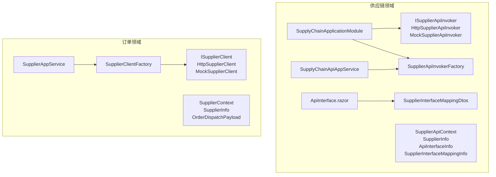
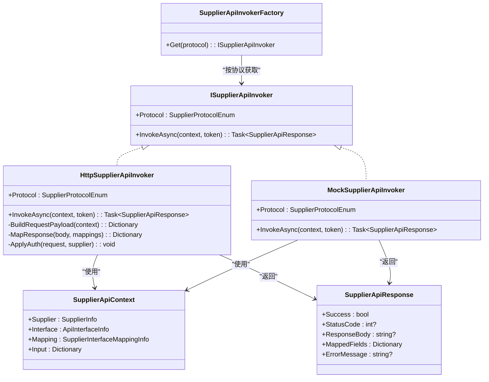
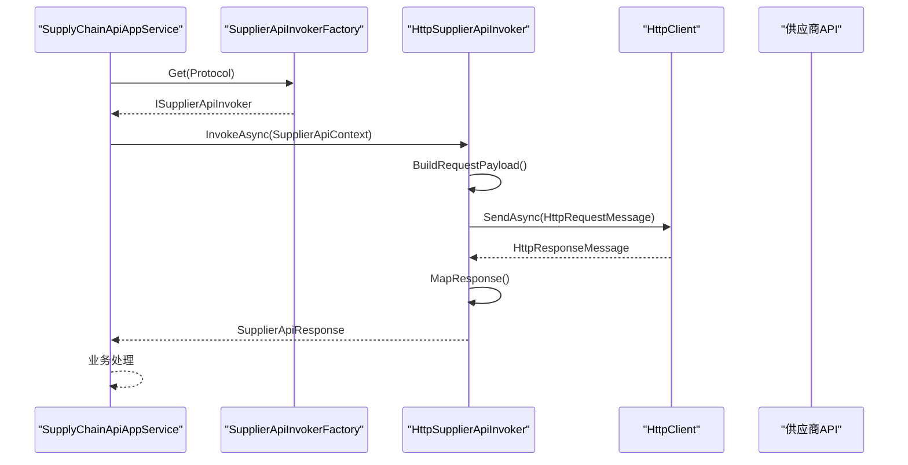
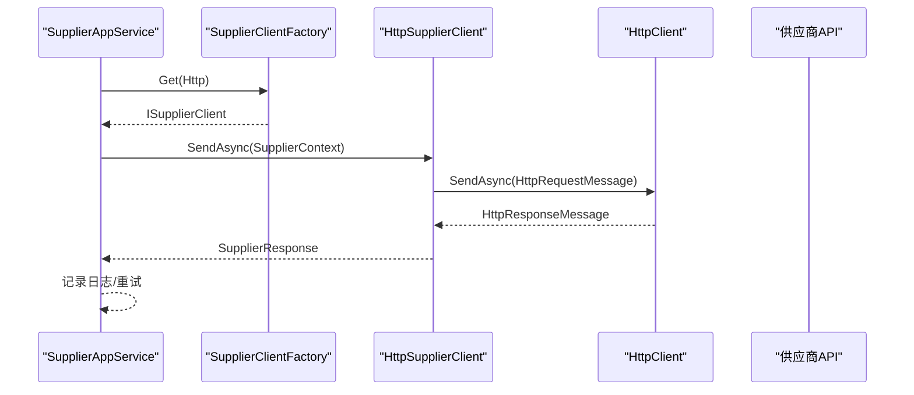
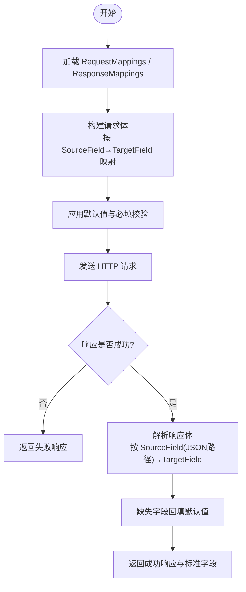
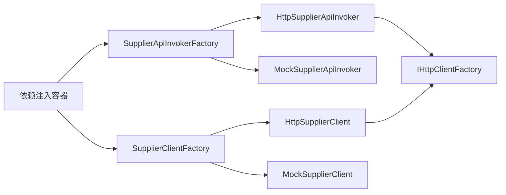

# 供应商对接

<cite>
**本文引用的文件**
- [SupplyChainApplicationModule.cs](file://src/Services/SupplyChain/H.SupplyChain.Application/SupplyChainApplicationModule.cs)
- [ISupplierApiInvoker.cs](file://src/Services/SupplyChain/H.SupplyChain.Application.Contracts/Abstractions/ISupplierApiInvoker.cs)
- [SupplierApiContext.cs](file://src/Services/SupplyChain/H.SupplyChain.Application.Contracts/Abstractions/SupplierApiContext.cs)
- [SupplierApiInvokerFactory.cs](file://src/Services/SupplyChain/H.SupplyChain.Application/Services/SupplierApiInvokerFactory.cs)
- [SupplierApiInvokers.cs](file://src/Services/SupplyChain/H.SupplyChain.Application/Services/SupplierApiInvokers.cs)
- [SupplyChainApiAppService.cs](file://src/Services/SupplyChain/H.SupplyChain.Application/Services/SupplyChainApiAppService.cs)
- [SupplyChainEnums.cs](file://src/Services/SupplyChain/H.SupplyChain.Application.Contracts/Enums/SupplyChainEnums.cs)
- [SupplierInterfaceMappingDtos.cs](file://src/Services/SupplyChain/H.SupplyChain.Application.Contracts/Dtos/SupplierInterfaceMappingDtos.cs)
- [ApiInterface.razor](file://src/Services/SupplyChain/H.SupplyChain.Web/Pages/ApiInterface.razor)
- [ISupplierClient.cs](file://src/Services/Order/H.Order.Application.Contracts/Abstractions/ISupplierClient.cs)
- [SupplierClients.cs](file://src/Services/Order/H.Order.Application/Services/SupplierClients.cs)
- [SupplierClientFactory.cs](file://src/Services/Order/H.Order.Application/Services/SupplierClientFactory.cs)
- [SupplierAppService.cs](file://src/Services/Order/H.Order.Application/Services/SupplierAppService.cs)
</cite>

## 目录
1. [简介](#简介)
2. [项目结构](#项目结构)
3. [核心组件](#核心组件)
4. [架构总览](#架构总览)
5. [详细组件分析](#详细组件分析)
6. [依赖关系分析](#依赖关系分析)
7. [性能考量](#性能考量)
8. [故障排查指南](#故障排查指南)
9. [结论](#结论)
10. [附录](#附录)

## 简介
本文件为 AppLab 供应商对接模块的详细技术文档，聚焦于：
- 供应商客户端抽象设计与协议适配层
- 工厂模式实现与能力注册机制
- HTTP 供应商接口、Mock 供应商测试
- 扩展新供应商协议的步骤
- 供应商能力注册、连接池管理、超时重试机制（建议）
- 供应商接口规范、数据格式转换、错误处理策略
- 供应商接入指南、测试方法与性能调优建议

该模块通过统一的 ISupplierApiInvoker / ISupplierClient 抽象，结合工厂按协议分发，屏蔽底层协议差异，提供可插拔的供应商集成能力。

## 项目结构
供应商对接相关代码主要分布在两个子域：
- 供应链领域（SupplyChain）：面向“供应商接口映射 + 调用”的通用能力，支持字段映射、认证、HTTP/Mock 等协议。
- 订单领域（Order）：面向“订单下发”的轻量级供应商客户端，提供 HTTP/Mock 实现与工厂。

图表来源
- [SupplyChainApplicationModule.cs:14-27](file://src/Services/SupplyChain/H.SupplyChain.Application/SupplyChainApplicationModule.cs#L14-L27)
- [ISupplierApiInvoker.cs:1-60](file://src/Services/SupplyChain/H.SupplyChain.Application.Contracts/Abstractions/ISupplierApiInvoker.cs#L1-L60)
- [SupplierApiInvokerFactory.cs:1-27](file://src/Services/SupplyChain/H.SupplyChain.Application/Services/SupplierApiInvokerFactory.cs#L1-L27)
- [SupplierApiInvokers.cs:1-278](file://src/Services/SupplyChain/H.SupplyChain.Application/Services/SupplierApiInvokers.cs#L1-L278)
- [SupplierApiContext.cs:1-48](file://src/Services/SupplyChain/H.SupplyChain.Application.Contracts/Abstractions/SupplierApiContext.cs#L1-L48)
- [SupplierInterfaceMappingDtos.cs:1-100](file://src/Services/SupplyChain/H.SupplyChain.Application.Contracts/Dtos/SupplierInterfaceMappingDtos.cs#L1-L100)
- [ApiInterface.razor:1-397](file://src/Services/SupplyChain/H.SupplyChain.Web/Pages/ApiInterface.razor#L1-L397)
- [ISupplierClient.cs:1-96](file://src/Services/Order/H.Order.Application.Contracts/Abstractions/ISupplierClient.cs#L1-L96)
- [SupplierClients.cs:1-150](file://src/Services/Order/H.Order.Application/Services/SupplierClients.cs#L1-L150)
- [SupplierClientFactory.cs:1-27](file://src/Services/Order/H.Order.Application/Services/SupplierClientFactory.cs#L1-L27)
- [SupplierAppService.cs:1-183](file://src/Services/Order/H.Order.Application/Services/SupplierAppService.cs#L1-L183)

章节来源
- [SupplyChainApplicationModule.cs:14-27](file://src/Services/SupplyChain/H.SupplyChain.Application/SupplyChainApplicationModule.cs#L14-L27)
- [ISupplierApiInvoker.cs:1-60](file://src/Services/SupplyChain/H.SupplyChain.Application.Contracts/Abstractions/ISupplierApiInvoker.cs#L1-L60)
- [SupplierApiInvokerFactory.cs:1-27](file://src/Services/SupplyChain/H.SupplyChain.Application/Services/SupplierApiInvokerFactory.cs#L1-L27)
- [SupplierApiInvokers.cs:1-278](file://src/Services/SupplyChain/H.SupplyChain.Application/Services/SupplierApiInvokers.cs#L1-L278)
- [SupplierApiContext.cs:1-48](file://src/Services/SupplyChain/H.SupplyChain.Application.Contracts/Abstractions/SupplierApiContext.cs#L1-L48)
- [SupplierInterfaceMappingDtos.cs:1-100](file://src/Services/SupplyChain/H.SupplyChain.Application.Contracts/Dtos/SupplierInterfaceMappingDtos.cs#L1-L100)
- [ApiInterface.razor:1-397](file://src/Services/SupplyChain/H.SupplyChain.Web/Pages/ApiInterface.razor#L1-L397)
- [ISupplierClient.cs:1-96](file://src/Services/Order/H.Order.Application.Contracts/Abstractions/ISupplierClient.cs#L1-L96)
- [SupplierClients.cs:1-150](file://src/Services/Order/H.Order.Application/Services/SupplierClients.cs#L1-L150)
- [SupplierClientFactory.cs:1-27](file://src/Services/Order/H.Order.Application/Services/SupplierClientFactory.cs#L1-L27)
- [SupplierAppService.cs:1-183](file://src/Services/Order/H.Order.Application/Services/SupplierAppService.cs#L1-L183)

## 核心组件
- 统一调用接口
  - ISupplierApiInvoker：定义 InvokeAsync(context, token)，用于按映射将标准输入转换为供应商请求体，调用后解析为标准输出字段。
  - ISupplierClient：定义 SendAsync(context, token)，用于订单下发的轻量调用。
- 上下文模型
  - SupplierApiContext：包含供应商信息、接口定义、字段映射、标准输入载荷。
  - SupplierContext：包含供应商信息与订单下发载荷。
- 工厂与协议分发
  - SupplierApiInvokerFactory：根据协议枚举返回对应 ISupplierApiInvoker。
  - SupplierClientFactory：根据协议枚举返回对应 ISupplierClient。
- 协议实现
  - HttpSupplierApiInvoker：HTTP 协议实现，支持多种认证方式、请求/响应字段映射、JSON 路径取值。
  - MockSupplierApiInvoker：模拟实现，不实际调用外部接口，便于开发/演示。
  - HttpSupplierClient：订单下发的 HTTP 实现。
  - MockSupplierClient：订单下发的 Mock 实现。
- 配置与 UI
  - SupplierInterfaceMappingDto：保存请求/响应字段映射 JSON。
  - ApiInterface.razor：可视化配置接口与字段映射。

章节来源
- [ISupplierApiInvoker.cs:1-60](file://src/Services/SupplyChain/H.SupplyChain.Application.Contracts/Abstractions/ISupplierApiInvoker.cs#L1-L60)
- [SupplierApiContext.cs:1-48](file://src/Services/SupplyChain/H.SupplyChain.Application.Contracts/Abstractions/SupplierApiContext.cs#L1-L48)
- [SupplierApiInvokerFactory.cs:1-27](file://src/Services/SupplyChain/H.SupplyChain.Application/Services/SupplierApiInvokerFactory.cs#L1-L27)
- [SupplierApiInvokers.cs:1-278](file://src/Services/SupplyChain/H.SupplyChain.Application/Services/SupplierApiInvokers.cs#L1-L278)
- [ISupplierClient.cs:1-96](file://src/Services/Order/H.Order.Application.Contracts/Abstractions/ISupplierClient.cs#L1-L96)
- [SupplierClients.cs:1-150](file://src/Services/Order/H.Order.Application/Services/SupplierClients.cs#L1-L150)
- [SupplierClientFactory.cs:1-27](file://src/Services/Order/H.Order.Application/Services/SupplierClientFactory.cs#L1-L27)
- [SupplierInterfaceMappingDtos.cs:1-100](file://src/Services/SupplyChain/H.SupplyChain.Application.Contracts/Dtos/SupplierInterfaceMappingDtos.cs#L1-L100)
- [ApiInterface.razor:1-397](file://src/Services/SupplyChain/H.SupplyChain.Web/Pages/ApiInterface.razor#L1-L397)

## 架构总览
整体采用“抽象接口 + 工厂 + 多实现”的分层设计，业务服务仅依赖抽象，具体协议由工厂在运行时选择。

图表来源
- [ISupplierApiInvoker.cs:1-60](file://src/Services/SupplyChain/H.SupplyChain.Application.Contracts/Abstractions/ISupplierApiInvoker.cs#L1-L60)
- [SupplierApiInvokers.cs:1-278](file://src/Services/SupplyChain/H.SupplyChain.Application/Services/SupplierApiInvokers.cs#L1-L278)
- [SupplierApiInvokerFactory.cs:1-27](file://src/Services/SupplyChain/H.SupplyChain.Application/Services/SupplierApiInvokerFactory.cs#L1-L27)
- [SupplierApiContext.cs:1-48](file://src/Services/SupplyChain/H.SupplyChain.Application.Contracts/Abstractions/SupplierApiContext.cs#L1-L48)

章节来源
- [SupplyChainApplicationModule.cs:14-27](file://src/Services/SupplyChain/H.SupplyChain.Application/SupplyChainApplicationModule.cs#L14-L27)
- [SupplyChainApiAppService.cs:299-328](file://src/Services/SupplyChain/H.SupplyChain.Application/Services/SupplyChainApiAppService.cs#L299-L328)

## 详细组件分析

### 供应链领域：供应商接口调用（SupplyChain）
- 调用流程
  - 应用服务加载接口与映射，构造 SupplierApiContext。
  - 通过 SupplierApiInvokerFactory 按协议获取 ISupplierApiInvoker。
  - 调用 InvokeAsync，内部完成请求体构建、认证、发送、应答解析。
- 关键类与方法
  - SupplyChainApiAppService.InvokeSupplierInterfaceAsync：组装上下文并调用工厂。
  - HttpSupplierApiInvoker.InvokeAsync：HTTP 调用、认证、映射、解析。
  - MockSupplierApiInvoker.InvokeAsync：模拟返回，填充标准字段。
  - SupplierApiInvokerFactory.Get：按协议枚举查找实现。
- 数据流
  - Input（标准字段）→ BuildRequestPayload → 供应商请求体
  - 供应商响应体 → MapResponse → MappedFields（标准字段）

图表来源
- [SupplyChainApiAppService.cs:299-328](file://src/Services/SupplyChain/H.SupplyChain.Application/Services/SupplyChainApiAppService.cs#L299-L328)
- [SupplierApiInvokerFactory.cs:1-27](file://src/Services/SupplyChain/H.SupplyChain.Application/Services/SupplierApiInvokerFactory.cs#L1-L27)
- [SupplierApiInvokers.cs:1-278](file://src/Services/SupplyChain/H.SupplyChain.Application/Services/SupplierApiInvokers.cs#L1-L278)

章节来源
- [SupplyChainApiAppService.cs:299-328](file://src/Services/SupplyChain/H.SupplyChain.Application/Services/SupplyChainApiAppService.cs#L299-L328)
- [SupplierApiInvokerFactory.cs:1-27](file://src/Services/SupplyChain/H.SupplyChain.Application/Services/SupplierApiInvokerFactory.cs#L1-L27)
- [SupplierApiInvokers.cs:1-278](file://src/Services/SupplyChain/H.SupplyChain.Application/Services/SupplierApiInvokers.cs#L1-L278)

### 订单领域：订单下发客户端（Order）
- 调用流程
  - 业务服务构造 SupplierContext（含 SupplierInfo 与 OrderDispatchPayload）。
  - 通过 SupplierClientFactory 获取 ISupplierClient。
  - 调用 SendAsync，HTTP 实现负责认证与发送，Mock 实现直接返回成功。
- 关键类与方法
  - HttpSupplierClient.SendAsync：创建 HttpClient、设置认证、发送请求、封装结果。
  - MockSupplierClient.SendAsync：返回固定成功响应。
  - SupplierClientFactory.Get：按协议枚举查找实现。

图表来源
- [SupplierAppService.cs:1-183](file://src/Services/Order/H.Order.Application/Services/SupplierAppService.cs#L1-L183)
- [SupplierClientFactory.cs:1-27](file://src/Services/Order/H.Order.Application/Services/SupplierClientFactory.cs#L1-L27)
- [SupplierClients.cs:1-150](file://src/Services/Order/H.Order.Application/Services/SupplierClients.cs#L1-L150)

章节来源
- [SupplierAppService.cs:1-183](file://src/Services/Order/H.Order.Application/Services/SupplierAppService.cs#L1-L183)
- [SupplierClientFactory.cs:1-27](file://src/Services/Order/H.Order.Application/Services/SupplierClientFactory.cs#L1-L27)
- [SupplierClients.cs:1-150](file://src/Services/Order/H.Order.Application/Services/SupplierClients.cs#L1-L150)

### 字段映射与数据格式转换
- 请求映射
  - RequestMappings：SourceField（标准字段）→ TargetField（供应商字段），支持默认值与必填校验。
  - 未映射的标准字段会透传，避免缺失必要输入。
- 响应映射
  - ResponseMappings：SourceField（供应商 JSON 路径）→ TargetField（标准字段），支持简单路径如 data.orderNo。
  - 若路径不存在则回退到 DefaultValue。
- 示例说明
  - 下单场景：Mock 实现补充 supplierOrderNo 字段，便于后续跟踪。

图表来源
- [SupplierApiInvokers.cs:93-182](file://src/Services/SupplyChain/H.SupplyChain.Application/Services/SupplierApiInvokers.cs#L93-L182)
- [SupplierInterfaceMappingDtos.cs:1-100](file://src/Services/SupplyChain/H.SupplyChain.Application.Contracts/Dtos/SupplierInterfaceMappingDtos.cs#L1-L100)

章节来源
- [SupplierApiInvokers.cs:93-182](file://src/Services/SupplyChain/H.SupplyChain.Application/Services/SupplierApiInvokers.cs#L93-L182)
- [SupplierInterfaceMappingDtos.cs:1-100](file://src/Services/SupplyChain/H.SupplyChain.Application.Contracts/Dtos/SupplierInterfaceMappingDtos.cs#L1-L100)

### 认证与协议支持
- 支持的认证方式（AuthTypeEnum）
  - None：无需认证
  - ApiKey：支持 header 或 query 注入
  - Header：自定义请求头
  - Basic：用户名/密码 Base64 编码
  - Bearer：Token 注入
- 协议支持（SupplierProtocolEnum）
  - Http：HTTP 协议
  - Mock：模拟协议

章节来源
- [SupplyChainEnums.cs:1-76](file://src/Services/SupplyChain/H.SupplyChain.Application.Contracts/Enums/SupplyChainEnums.cs#L1-L76)
- [SupplierApiInvokers.cs:184-247](file://src/Services/SupplyChain/H.SupplyChain.Application/Services/SupplierApiInvokers.cs#L184-L247)
- [SupplierClients.cs:66-129](file://src/Services/Order/H.Order.Application/Services/SupplierClients.cs#L66-L129)

### 配置与界面
- 接口与映射配置
  - SupplierInterfaceMappingDto：保存 SupplierApiUrl、RequestMappingJson、ResponseMappingJson、IsEnabled、Remark。
  - ApiInterface.razor：可视化选择供应商、新增接口、维护字段映射，支持从 JSON 恢复映射行并对齐标准字段。
- 初始化逻辑
  - EnsureAllStandardFields：合并已保存映射与标准字段，缺失时补空白映射行。
  - InitializeEmptyMappingForm：未配置映射时按标准字段生成空白映射行。

章节来源
- [SupplierInterfaceMappingDtos.cs:1-100](file://src/Services/SupplyChain/H.SupplyChain.Application.Contracts/Dtos/SupplierInterfaceMappingDtos.cs#L1-L100)
- [ApiInterface.razor:450-522](file://src/Services/SupplyChain/H.SupplyChain.Web/Pages/ApiInterface.razor#L450-L522)

## 依赖关系分析
- 依赖注入与能力注册
  - SupplyChainApplicationModule：注册 ISupplierApiInvoker 的 Http/Mock 实现与工厂。
  - Order 领域：SupplierClientFactory 与 Http/Mock 客户端在各自模块中注册（参考命名约定与 DI 模式）。
- 工厂模式
  - 通过 IEnumerable<T> 注入所有实现，工厂按 Protocol 枚举匹配返回。
- 外部依赖
  - IHttpClientFactory：用于创建 HttpClient，支持连接池与生命周期管理。

图表来源
- [SupplyChainApplicationModule.cs:14-27](file://src/Services/SupplyChain/H.SupplyChain.Application/SupplyChainApplicationModule.cs#L14-L27)
- [SupplierApiInvokerFactory.cs:1-27](file://src/Services/SupplyChain/H.SupplyChain.Application/Services/SupplierApiInvokerFactory.cs#L1-L27)
- [SupplierClientFactory.cs:1-27](file://src/Services/Order/H.Order.Application/Services/SupplierClientFactory.cs#L1-L27)
- [SupplierApiInvokers.cs:1-278](file://src/Services/SupplyChain/H.SupplyChain.Application/Services/SupplierApiInvokers.cs#L1-L278)
- [SupplierClients.cs:1-150](file://src/Services/Order/H.Order.Application/Services/SupplierClients.cs#L1-L150)

章节来源
- [SupplyChainApplicationModule.cs:14-27](file://src/Services/SupplyChain/H.SupplyChain.Application/SupplyChainApplicationModule.cs#L14-L27)
- [SupplierApiInvokerFactory.cs:1-27](file://src/Services/SupplyChain/H.SupplyChain.Application/Services/SupplierApiInvokerFactory.cs#L1-L27)
- [SupplierClientFactory.cs:1-27](file://src/Services/Order/H.Order.Application/Services/SupplierClientFactory.cs#L1-L27)

## 性能考量
- 连接池管理
  - 使用 IHttpClientFactory 创建的 HttpClient 自动复用底层 Socket，减少连接开销。
  - 建议在模块启动时为不同供应商域名配置 Named HttpClient（如 H.SupplyChain.HttpSupplier、H.Order.HttpSupplier）。
- 超时与重试
  - 当前实现未内置重试；可在上层服务或中间件增加重试策略（指数退避、熔断）。
  - 针对网络抖动与供应商限流，建议引入 Polly 等库进行重试与熔断。
- 序列化与映射
  - 请求/响应 JSON 序列化开销可控；大量并发时可考虑共享 JsonSerializerOptions。
  - 字段映射为字典操作，复杂度 O(n)，n 为映射数量，通常较小。
- 异步与取消
  - 所有调用均支持 CancellationToken，确保可取消性。

[本节为通用指导，不直接分析具体文件]

## 故障排查指南
- 常见错误
  - 未注册协议实现：工厂抛出异常提示未注册协议。检查 DI 注册是否正确。
  - 缺少 ApiUrl：HTTP 实现返回失败，需确认供应商配置。
  - 认证失败：检查 AuthType 与 AuthConfig JSON 结构是否符合预期。
  - 字段映射缺失：响应解析为空，检查 ResponseMappings 的 SourceField 路径是否正确。
- 定位方法
  - 查看 SupplierApiResponse.ErrorMessage 与 StatusCode。
  - 在 Mock 模式下验证映射与字段名是否正确。
  - 使用 ApiInterface.razor 页面重新保存映射，确保 JSON 正确持久化。

章节来源
- [SupplierApiInvokerFactory.cs:18-26](file://src/Services/SupplyChain/H.SupplyChain.Application/Services/SupplierApiInvokerFactory.cs#L18-L26)
- [SupplierApiInvokers.cs:30-87](file://src/Services/SupplyChain/H.SupplyChain.Application/Services/SupplierApiInvokers.cs#L30-L87)
- [SupplierClients.cs:27-64](file://src/Services/Order/H.Order.Application/Services/SupplierClients.cs#L27-L64)

## 结论
本模块通过清晰的抽象与工厂模式，实现了供应商接口的可插拔集成。供应链领域侧重“字段映射 + 协议适配”，订单领域侧重“订单下发 + 轻量客户端”。借助 IHttpClientFactory 与标准化上下文，系统具备良好的扩展性与可维护性。建议在生产环境完善超时重试、熔断与监控告警，进一步提升稳定性与可观测性。

[本节为总结，不直接分析具体文件]

## 附录

### 供应商接口规范
- 上下文
  - SupplierApiContext：Supplier、Interface、Mapping、Input
  - SupplierContext：Supplier、Payload（OrderDispatchPayload）
- 结果
  - SupplierApiResponse：Success、StatusCode、ResponseBody、MappedFields、ErrorMessage
  - SupplierResponse：Success、StatusCode、ResponseBody、ErrorMessage

章节来源
- [SupplierApiContext.cs:1-48](file://src/Services/SupplyChain/H.SupplyChain.Application.Contracts/Abstractions/SupplierApiContext.cs#L1-L48)
- [ISupplierClient.cs:29-96](file://src/Services/Order/H.Order.Application.Contracts/Abstractions/ISupplierClient.cs#L29-L96)
- [ISupplierApiInvoker.cs:32-60](file://src/Services/SupplyChain/H.SupplyChain.Application.Contracts/Abstractions/ISupplierApiInvoker.cs#L32-L60)

### 扩展新供应商协议（步骤）
- 新增协议枚举值（如需）：在 SupplyChainEnums 中添加。
- 实现 ISupplierApiInvoker 或 ISupplierClient：
  - 指定 Protocol 属性为新协议。
  - 实现 InvokeAsync/SendAsync，处理认证、序列化、调用与结果封装。
- 在模块中注册新实现：
  - SupplyChainApplicationModule 中 AddTransient<ISupplierApiInvoker, 新实现>()。
  - Order 领域相应模块注册 ISupplierClient 实现。
- 配置与测试：
  - 使用 ApiInterface.razor 配置映射。
  - 先用 Mock 验证映射与字段名，再切换至真实协议。

章节来源
- [SupplyChainEnums.cs:34-43](file://src/Services/SupplyChain/H.SupplyChain.Application.Contracts/Enums/SupplyChainEnums.cs#L34-L43)
- [SupplyChainApplicationModule.cs:19-23](file://src/Services/SupplyChain/H.SupplyChain.Application/SupplyChainApplicationModule.cs#L19-L23)
- [SupplierApiInvokers.cs:253-278](file://src/Services/SupplyChain/H.SupplyChain.Application/Services/SupplierApiInvokers.cs#L253-L278)
- [SupplierClients.cs:135-150](file://src/Services/Order/H.Order.Application/Services/SupplierClients.cs#L135-L150)

### 测试方法
- 单元测试
  - 对 HttpSupplierApiInvoker/HttpSupplierClient 使用内存 HTTP 服务器或 Mock IHttpClientFactory。
  - 验证认证注入、请求体构建、响应解析。
- 集成测试
  - 使用 MockSupplierApiInvoker/MockSupplierClient 验证端到端映射与业务流程。
- 界面测试
  - 通过 ApiInterface.razor 保存映射后，调用接口并检查 MappedFields 是否符合预期。

[本节为通用指导，不直接分析具体文件]

### 性能调优建议
- 连接池与超时
  - 配置 Named HttpClient 的 DefaultRequestHeaders、Timeout、MaxConnectionsPerServer。
- 重试与熔断
  - 引入 Polly 配置重试策略（指数退避、最大重试次数）、熔断阈值。
- 序列化优化
  - 共享 JsonSerializerOptions，避免重复分配。
- 监控与可观测性
  - 记录请求耗时、状态码、错误堆栈，聚合到日志与指标系统。

[本节为通用指导，不直接分析具体文件]