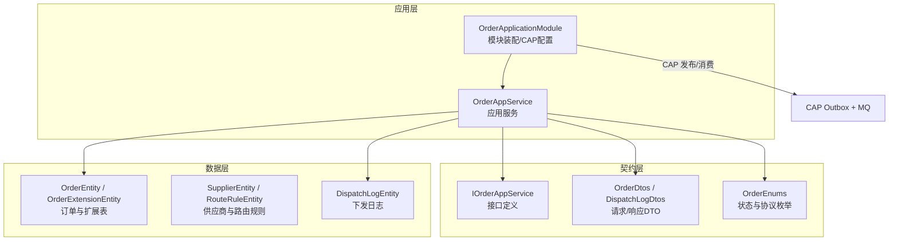
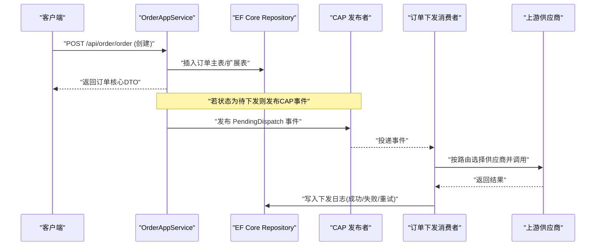
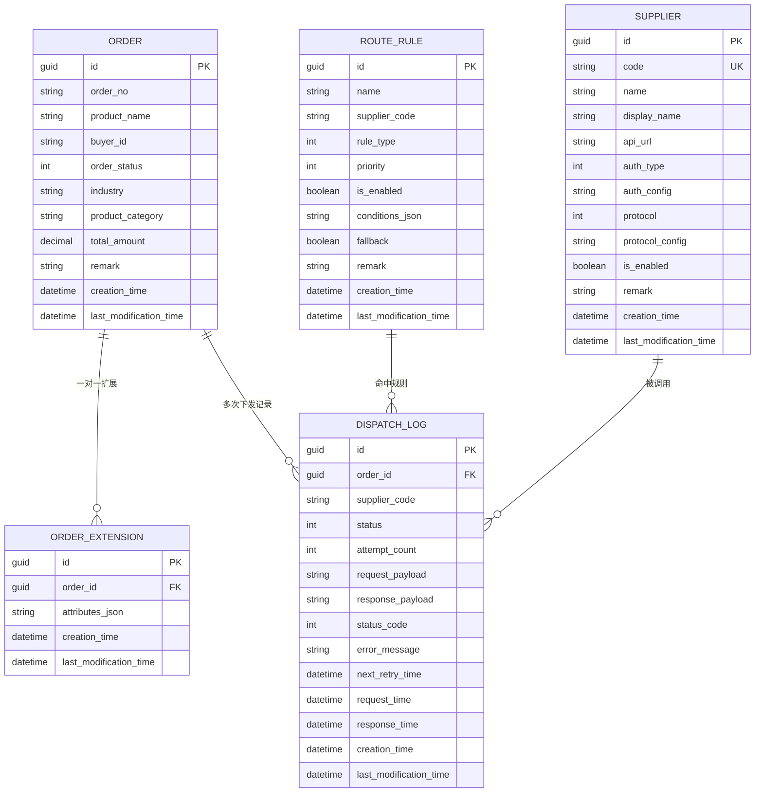
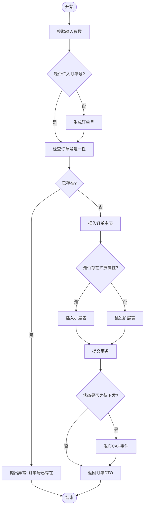
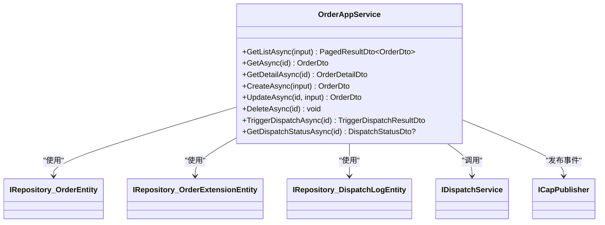

# 订单API服务

<cite>
**本文引用的文件**   
- [OrderApplicationModule.cs](file://src/Services/Order/H.Order.Application/OrderApplicationModule.cs)
- [IOrderAppService.cs](file://src/Services/Order/H.Order.Application.Contracts/Services/IOrderAppService.cs)
- [OrderAppService.cs](file://src/Services/Order/H.Order.Application/Services/OrderAppService.cs)
- [OrderDtos.cs](file://src/Services/Order/H.Order.Application.Contracts/Dtos/OrderDtos.cs)
- [DispatchLogDtos.cs](file://src/Services/Order/H.Order.Application.Contracts/Dtos/DispatchLogDtos.cs)
- [OrderEnums.cs](file://src/Services/Order/H.Order.Application.Contracts/Enums\OrderEnums.cs)
- [OrderEntities.cs](file://src/Services/Order/H.Order.EntityFrameworkCore/Entities/OrderEntities.cs)
</cite>

## 目录
1. [简介](#简介)
2. [项目结构](#项目结构)
3. [核心组件](#核心组件)
4. [架构总览](#架构总览)
5. [详细组件分析](#详细组件分析)
6. [依赖关系分析](#依赖关系分析)
7. [性能考虑](#性能考虑)
8. [故障排查指南](#故障排查指南)
9. [结论](#结论)
10. [附录：API规范与示例](#附录api规范与示例)

## 简介
本文件为 AppLab 订单API服务的完整技术文档，覆盖订单CRUD、查询、状态更新、下发触发与状态查询等能力。文档面向开发者与集成方，提供清晰的接口定义、参数校验规则、错误码说明、调用示例以及版本管理与兼容性建议，并给出性能优化与排障指引。

## 项目结构
订单服务采用 ABP 模块化分层架构，核心模块包括：
- Application层：对外暴露应用服务（RESTful API），实现业务编排与事务控制
- Application.Contracts：对外契约（DTO、枚举、事件主题）
- EntityFrameworkCore层：实体模型与数据库映射
- 基础设施：CAP 消息总线用于异步下发与重试

图表来源
- [OrderApplicationModule.cs:1-49](file://src/Services/Order/H.Order.Application/OrderApplicationModule.cs#L1-L49)
- [IOrderAppService.cs:1-42](file://src/Services/Order/H.Order.Application.Contracts/Services/IOrderAppService.cs#L1-L42)
- [OrderAppService.cs:1-241](file://src/Services/Order/H.Order.Application/Services/OrderAppService.cs#L1-L241)
- [OrderDtos.cs:1-161](file://src/Services/Order/H.Order.Application.Contracts/Dtos/OrderDtos.cs#L1-L161)
- [DispatchLogDtos.cs:1-96](file://src/Services/Order/H.Order.Application.Contracts/Dtos/DispatchLogDtos.cs#L1-L96)
- [OrderEnums.cs:1-91](file://src/Services/Order/H.Order.Application.Contracts/Enums/OrderEnums.cs#L1-L91)
- [OrderEntities.cs:1-169](file://src/Services/Order/H.Order.EntityFrameworkCore/Entities/OrderEntities.cs#L1-L169)

章节来源
- [OrderApplicationModule.cs:1-49](file://src/Services/Order/H.Order.Application/OrderApplicationModule.cs#L1-L49)
- [IOrderAppService.cs:1-42](file://src/Services/Order/H.Order.Application.Contracts/Services/IOrderAppService.cs#L1-L42)

## 核心组件
- 应用服务接口 IOrderAppService：定义订单的列表、详情、创建、更新、删除、手动触发下发、查询最近下发状态等能力
- 应用服务实现 OrderAppService：实现上述接口，封装领域逻辑、分页筛选、扩展属性处理、CAP 事件发布与下发状态读取
- DTO 与枚举：统一请求/响应结构与状态枚举，保证前后端一致
- 实体模型：订单主表与扩展表分离，支持行业差异化字段；下发日志记录每次调用结果

章节来源
- [IOrderAppService.cs:1-42](file://src/Services/Order/H.Order.Application.Contracts/Services/IOrderAppService.cs#L1-L42)
- [OrderAppService.cs:1-241](file://src/Services/Order/H.Order.Application/Services/OrderAppService.cs#L1-L241)
- [OrderDtos.cs:1-161](file://src/Services/Order/H.Order.Application.Contracts/Dtos/OrderDtos.cs#L1-L161)
- [DispatchLogDtos.cs:1-96](file://src/Services/Order/H.Order.Application.Contracts/Dtos/DispatchLogDtos.cs#L1-L96)
- [OrderEnums.cs:1-91](file://src/Services/Order/H.Order.Application.Contracts/Enums/OrderEnums.cs#L1-L91)
- [OrderEntities.cs:1-169](file://src/Services/Order/H.Order.EntityFrameworkCore/Entities/OrderEntities.cs#L1-L169)

## 架构总览
订单服务通过 ABP 自动将 IOrderAppService 方法映射为 RESTful 端点，结合 CAP 实现可靠的消息驱动下发流程。

图表来源
- [OrderAppService.cs:109-145](file://src/Services/Order/H.Order.Application/Services/OrderAppService.cs#L109-L145)
- [OrderApplicationModule.cs:33-48](file://src/Services/Order/H.Order.Application/OrderApplicationModule.cs#L33-L48)

## 详细组件分析

### 接口与端点映射
- 列表查询：GET /api/order/order
- 获取核心信息：GET /api/order/order/{id}
- 创建订单：POST /api/order/order
- 更新订单：PUT /api/order/order/{id}
- 删除订单：DELETE /api/order/order/{id}
- 手动触发下发：POST /api/order/order/{id}/trigger-dispatch
- 查询最近下发状态：GET /api/order/order/{id}/dispatch-status
- 详情接口（含扩展属性与最近下发状态）：GET /api/order/order/{id}/detail

章节来源
- [IOrderAppService.cs:1-42](file://src/Services/Order/H.Order.Application.Contracts/Services/IOrderAppService.cs#L1-L42)

### 数据模型与关系

图表来源
- [OrderEntities.cs:1-169](file://src/Services/Order/H.Order.EntityFrameworkCore/Entities/OrderEntities.cs#L1-L169)

章节来源
- [OrderEntities.cs:1-169](file://src/Services/Order/H.Order.EntityFrameworkCore/Entities/OrderEntities.cs#L1-L169)

### 订单创建流程
- 生成或校验订单号唯一性
- 插入订单主表与可选扩展表（AttributesJson）
- 若初始状态为“待下发”，发布 CAP 事件进入异步下发流程
- 返回订单核心DTO

图表来源
- [OrderAppService.cs:109-145](file://src/Services/Order/H.Order.Application/Services/OrderAppService.cs#L109-L145)

章节来源
- [OrderAppService.cs:109-145](file://src/Services/Order/H.Order.Application/Services/OrderAppService.cs#L109-L145)

### 订单修改限制
- 支持更新商品名称、买家ID、订单状态、行业、商品类别、总金额、备注与扩展属性
- 扩展属性采用 upsert 策略：显式传入 AttributesJson 时进行新增或更新，不传则保持不变
- 当更新后的状态为“待下发”时，同样会发布 CAP 事件触发下发

章节来源
- [OrderAppService.cs:147-181](file://src/Services/Order/H.Order.Application/Services/OrderAppService.cs#L147-L181)

### 订单删除逻辑
- 同步删除订单主记录
- 若存在扩展属性记录，一并删除，确保数据一致性

章节来源
- [OrderAppService.cs:183-194](file://src/Services/Order/H.Order.Application/Services/OrderAppService.cs#L183-L194)

### 订单查询与筛选
- 列表接口仅返回核心字段，避免关联扩展表提升性能
- 支持多条件筛选：关键词（订单号/商品名）、精确订单号、行业、买家ID、状态、金额区间、创建时间范围
- 默认分页大小为10，可通过 MaxResultCount 指定

章节来源
- [OrderAppService.cs:44-82](file://src/Services/Order/H.Order.Application/Services/OrderAppService.cs#L44-L82)
- [OrderDtos.cs:133-161](file://src/Services/Order/H.Order.Application.Contracts/Dtos/OrderDtos.cs#L133-L161)

### 订单详情与下发状态
- 详情接口合并核心信息与扩展属性 JSON，并附带最近一次下发状态摘要
- 下发状态从下发日志中按时间倒序取最新一条

章节来源
- [OrderAppService.cs:93-104](file://src/Services/Order/H.Order.Application/Services/OrderAppService.cs#L93-L104)
- [OrderAppService.cs:208-222](file://src/Services/Order/H.Order.Application/Services/OrderAppService.cs#L208-L222)
- [DispatchLogDtos.cs:83-96](file://src/Services/Order/H.Order.Application.Contracts/Dtos/DispatchLogDtos.cs#L83-L96)

### 手动触发下发与状态查询
- 手动触发：调用分发服务执行路由匹配与供应商调用，返回本次下发结果摘要
- 状态查询：返回最近一次下发的供应商编码、状态、错误信息与请求时间

章节来源
- [OrderAppService.cs:196-206](file://src/Services/Order/H.Order.Application/Services/OrderAppService.cs#L196-L206)
- [DispatchLogDtos.cs:62-78](file://src/Services/Order/H.Order.Application.Contracts/Dtos/DispatchLogDtos.cs#L62-L78)

### 事件与异步下发
- 创建或更新订单时，若状态为“待下发”，发布 CAP 事件
- CAP 使用 SQL Server 作为 Outbox 存储，开发环境使用内存队列，生产可替换为 RabbitMQ/Kafka
- 失败重试次数与间隔在模块中配置

章节来源
- [OrderApplicationModule.cs:33-48](file://src/Services/Order/H.Order.Application/OrderApplicationModule.cs#L33-L48)
- [OrderAppService.cs:224-234](file://src/Services/Order/H.Order.Application/Services/OrderAppService.cs#L224-L234)

## 依赖关系分析
- OrderAppService 依赖 EF Core Repository 访问订单、扩展与下发日志实体
- 通过 IDispatchService 完成路由与供应商调用
- 通过 ICapPublisher 发布订单待下发事件
- OrderApplicationModule 负责 DI 注册与 CAP 配置

图表来源
- [OrderAppService.cs:1-241](file://src/Services/Order/H.Order.Application/Services/OrderAppService.cs#L1-L241)

章节来源
- [OrderAppService.cs:1-241](file://src/Services/Order/H.Order.Application/Services/OrderAppService.cs#L1-L241)

## 性能考虑
- 列表查询仅返回核心字段，避免 N+1 与跨表连接开销
- 详情接口按需加载扩展属性与最近下发状态，减少不必要的数据传输
- 分页查询默认大小合理，支持自定义页大小
- CAP Outbox 保障最终一致性，降低同步调用阻塞
- 建议在数据库层对常用筛选字段建立索引（如 OrderNo、Industry、BuyerId、CreationTime）

[本节为通用指导，无需源码引用]

## 故障排查指南
- 订单号冲突：创建时若传入重复订单号将抛出异常，需更换或移除该字段由系统生成
- 扩展属性未生效：更新时需显式传入 AttributesJson，否则不会变更
- 未触发下发：确认订单状态是否为“待下发”，且 CAP 配置正确（连接字符串、队列实现）
- 下发失败：查看下发日志中的错误信息与HTTP状态码，必要时手动触发重试

章节来源
- [OrderAppService.cs:117-122](file://src/Services/Order/H.Order.Application/Services/OrderAppService.cs#L117-L122)
- [OrderAppService.cs:152-171](file://src/Services/Order/H.Order.Application/Services/OrderAppService.cs#L152-L171)
- [OrderApplicationModule.cs:33-48](file://src/Services/Order/H.Order.Application/OrderApplicationModule.cs#L33-L48)
- [DispatchLogDtos.cs:8-42](file://src/Services/Order/H.Order.Application.Contracts/Dtos/DispatchLogDtos.cs#L8-L42)

## 结论
订单API服务以ABP模块化为基础，结合CAP实现可靠的异步下发机制。通过核心表与扩展表分离的设计，兼顾了通用性与行业差异化需求。接口设计清晰、参数校验完善、错误处理明确，具备良好的可扩展性与性能表现。

[本节为总结，无需源码引用]

## 附录：API规范与示例

### 通用约定
- 基础路径：/api/order
- 认证方式：由宿主平台统一鉴权（例如 Cookie/JWT），具体由 Host 层配置
- 分页基类：PagedResultRequestDto（包含 SkipCount、MaxResultCount）
- 审计基类：FullAuditedEntityDto（包含 Id、CreationTime、LastModificationTime 等）

章节来源
- [IOrderAppService.cs:1-42](file://src/Services/Order/H.Order.Application.Contracts/Services/IOrderAppService.cs#L1-L42)
- [OrderDtos.cs:8-49](file://src/Services/Order/H.Order.Application.Contracts/Dtos/OrderDtos.cs#L8-L49)

### 接口清单与参数/响应
- GET /api/order/order
  - 请求参数：OrderQueryDto（Filter、OrderNo、Industry、BuyerId、Status、MinAmount、MaxAmount、CreateTimeStart、CreateTimeEnd、SkipCount、MaxResultCount）
  - 响应：PagedResultDto<OrderDto>
- GET /api/order/order/{id}
  - 响应：OrderDto
- POST /api/order/order
  - 请求体：CreateOrderDto（OrderNo、ProductName、BuyerId、OrderStatus、Industry、ProductCategory、TotalAmount、Remark、AttributesJson）
  - 响应：OrderDto
- PUT /api/order/order/{id}
  - 请求体：UpdateOrderDto（ProductName、BuyerId、OrderStatus、Industry、ProductCategory、TotalAmount、Remark、AttributesJson）
  - 响应：OrderDto
- DELETE /api/order/order/{id}
  - 无请求体
  - 响应：空
- POST /api/order/order/{id}/trigger-dispatch
  - 响应：TriggerDispatchResultDto（OrderId、SupplierCode、Success、Message、LogId）
- GET /api/order/order/{id}/dispatch-status
  - 响应：DispatchStatusDto?（SupplierCode、Status、ErrorMessage、RequestTime）
- GET /api/order/order/{id}/detail
  - 响应：OrderDetailDto（继承 OrderDto，附加 AttributesJson、DispatchStatus）

章节来源
- [IOrderAppService.cs:1-42](file://src/Services/Order/H.Order.Application.Contracts/Services/IOrderAppService.cs#L1-L42)
- [OrderDtos.cs:1-161](file://src/Services/Order/H.Order.Application.Contracts/Dtos/OrderDtos.cs#L1-L161)
- [DispatchLogDtos.cs:1-96](file://src/Services/Order/H.Order.Application.Contracts/Dtos/DispatchLogDtos.cs#L1-L96)

### 状态与枚举
- 订单状态 OrderStatusEnum：草稿、待下发、已下发、已完成、已取消
- 下发状态 DispatchStatusEnum：待下发、成功、失败、重试中
- 供应商协议 SupplierProtocolEnum：Http、Mock
- 认证方式 AuthTypeEnum：None、ApiKey、Header、Basic、Bearer
- 路由规则类型 RouteRuleTypeEnum：Industry、Category、AmountRange、Custom

章节来源
- [OrderEnums.cs:1-91](file://src/Services/Order/H.Order.Application.Contracts/Enums/OrderEnums.cs#L1-L91)

### 错误码与异常
- 业务异常：订单号已存在（创建时）
- 框架异常：由 ABP 统一处理（如权限不足、资源不存在等）
- 建议：在客户端根据 HTTP 状态码与响应体 Message 进行提示

章节来源
- [OrderAppService.cs:117-122](file://src/Services/Order/H.Order.Application/Services/OrderAppService.cs#L117-L122)

### 调用示例（概念性）
- 创建订单
  - 方法：POST /api/order/order
  - 请求体示例字段：ProductName、BuyerId、TotalAmount、OrderStatus=PendingDispatch、Industry、ProductCategory、AttributesJson（可选）
  - 响应：返回新订单的核心DTO
- 查询列表
  - 方法：GET /api/order/order?Filter=服装&Status=1&CreateTimeStart=...&CreateTimeEnd=...&SkipCount=0&MaxResultCount=20
  - 响应：分页结果集
- 手动触发下发
  - 方法：POST /api/order/order/{id}/trigger-dispatch
  - 响应：是否成功、命中的供应商编码、本次下发日志ID

[本节为概念性示例，不直接引用代码片段]

### 版本管理与兼容性
- 当前版本：基于 ABP 约定的 v1 接口命名空间与路径
- 向后兼容：新增字段建议保持可选；删除字段需评估影响并提供过渡期
- 版本演进：如需破坏性变更，建议引入 /api/v2 前缀或版本号头，并在网关层做路由转发

[本节为通用建议，无需源码引用]

### 权限控制说明
- 接口级权限：由宿主平台统一鉴权（例如角色/策略），在控制器或服务层可按需添加授权注解
- 租户隔离：实体实现 IMultiTenant，数据访问默认按租户过滤

章节来源
- [OrderEntities.cs:9-37](file://src/Services/Order/H.Order.EntityFrameworkCore/Entities/OrderEntities.cs#L9-L37)
- [OrderEntities.cs:42-55](file://src/Services/Order/H.Order.EntityFrameworkCore/Entities/OrderEntities.cs#L42-L55)