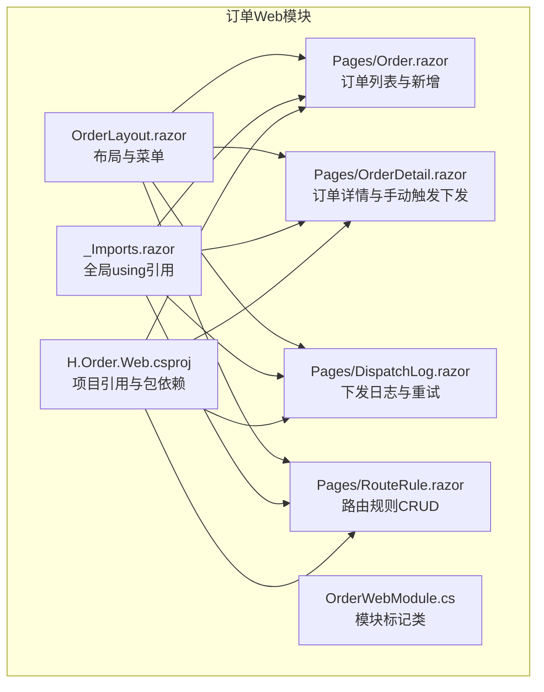
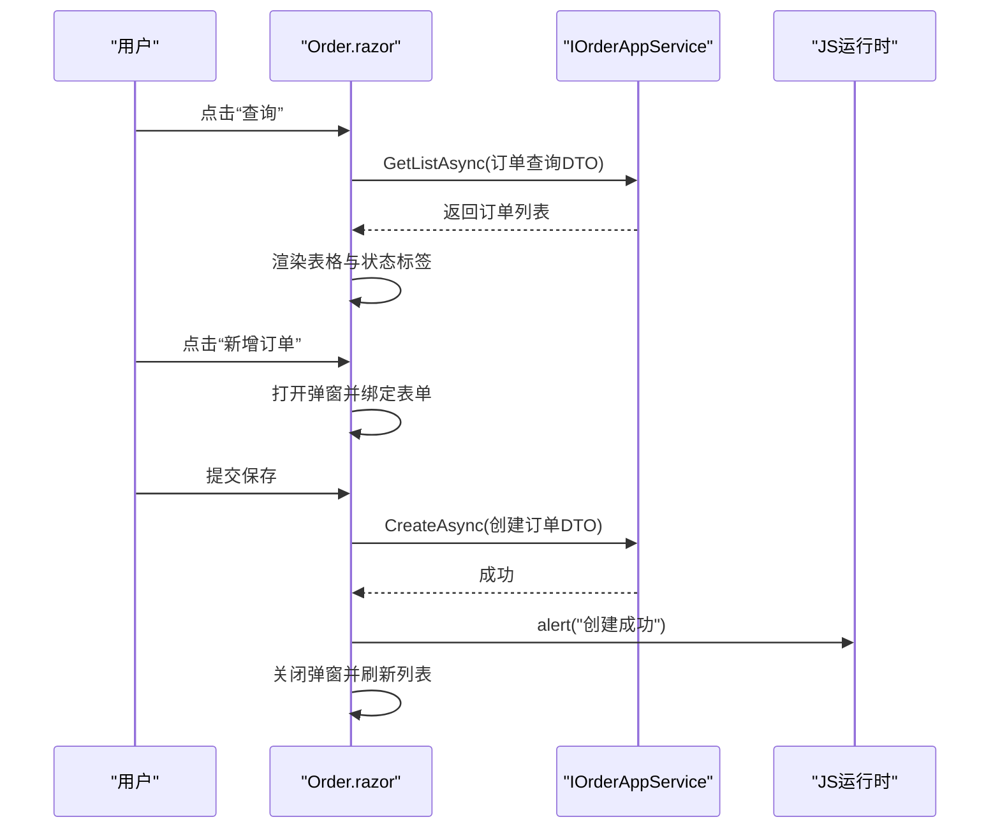
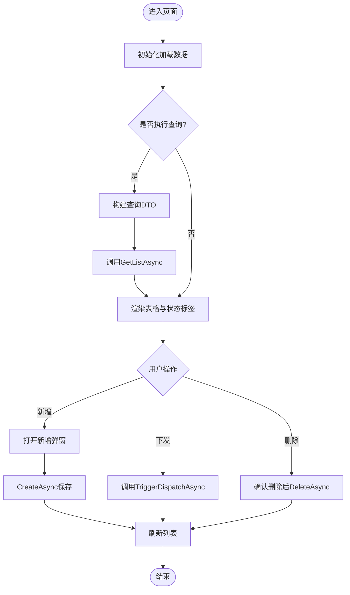
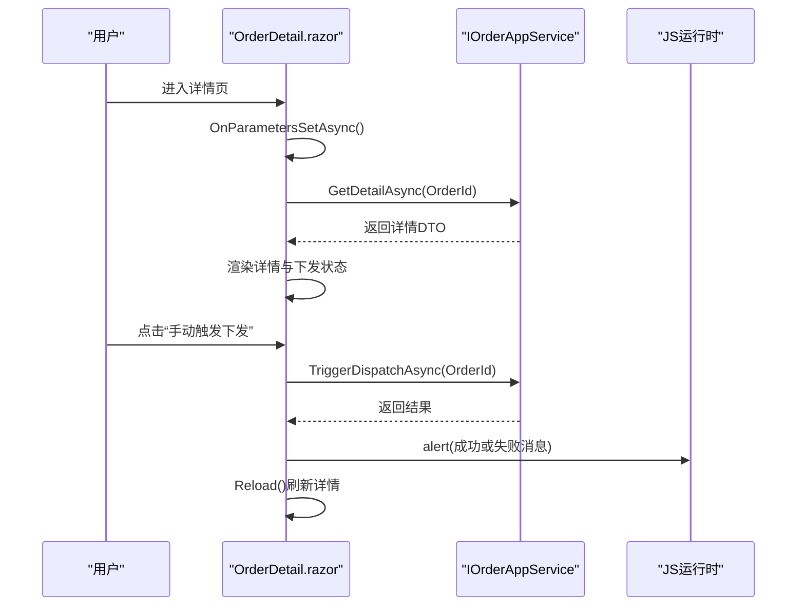
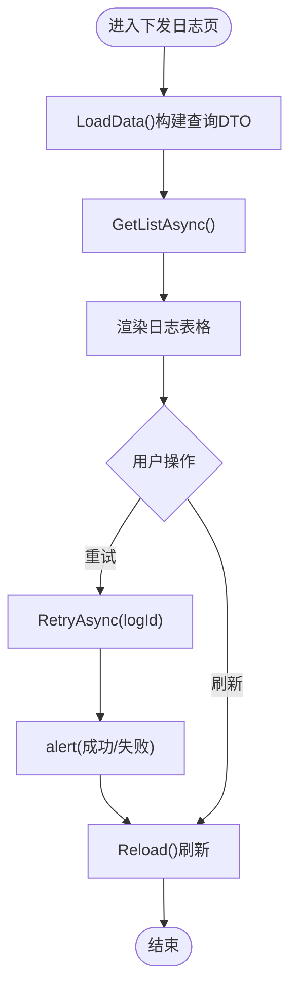
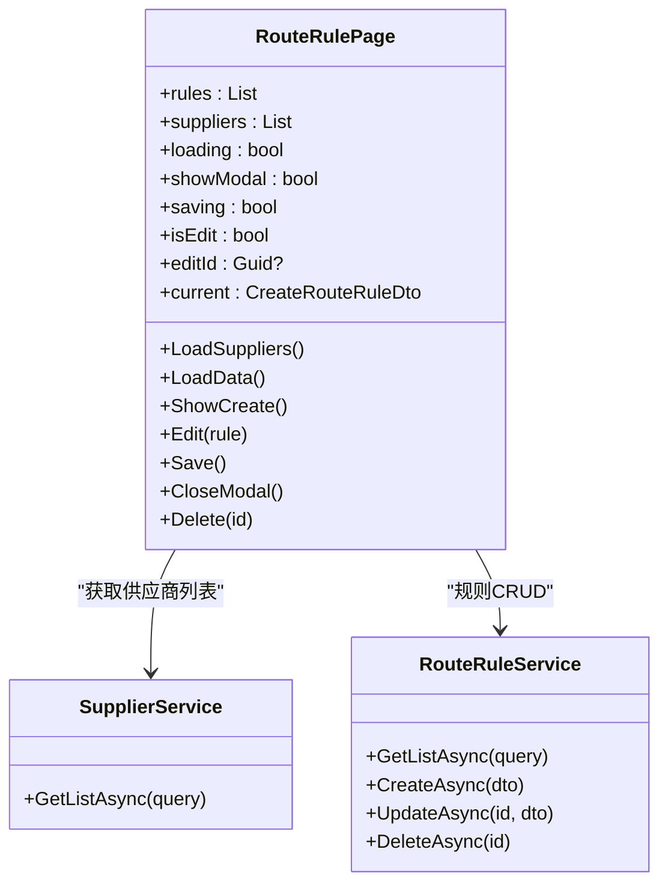
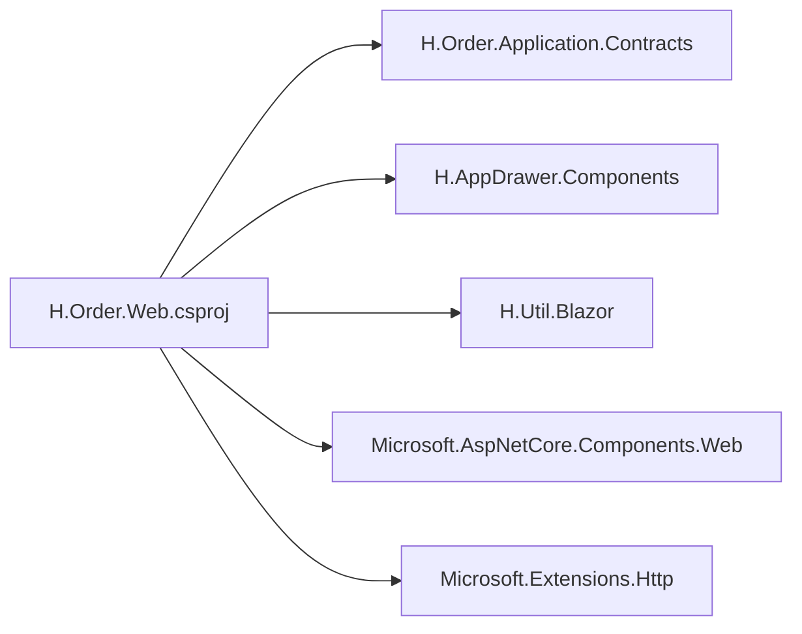

# 订单Web界面

<cite>
**本文引用的文件**   
- [Order.razor](file://src/Services/Order/H.Order.Web/Pages/Order.razor)
- [OrderDetail.razor](file://src/Services/Order/H.Order.Web/Pages/OrderDetail.razor)
- [DispatchLog.razor](file://src/Services/Order/H.Order.Web/Pages/DispatchLog.razor)
- [RouteRule.razor](file://src/Services/Order/H.Order.Web/Pages/RouteRule.razor)
- [OrderLayout.razor](file://src/Services/Order/H.Order.Web/Layout/OrderLayout.razor)
- [_Imports.razor](file://src/Services/Order/H.Order.Web/_Imports.razor)
- [H.Order.Web.csproj](file://src/Services/Order/H.Order.Web/H.Order.Web.csproj)
- [OrderWebModule.cs](file://src/Services/Order/H.Order.Web/OrderWebModule.cs)
</cite>

## 目录
1. [简介](#简介)
2. [项目结构](#项目结构)
3. [核心组件](#核心组件)
4. [架构总览](#架构总览)
5. [详细组件分析](#详细组件分析)
6. [依赖关系分析](#依赖关系分析)
7. [性能与体验优化](#性能与体验优化)
8. [故障排查指南](#故障排查指南)
9. [结论](#结论)

## 简介
本文件为 AppLab 订单 Web 界面的完整技术文档，覆盖订单管理页面、订单详情展示、订单操作界面。重点说明：
- 订单列表查询、状态筛选、批量操作能力
- 订单创建表单、编辑界面、审批与下发流程
- 用户交互、数据绑定、实时刷新机制
- 界面定制选项、响应式设计与用户体验优化建议

该模块基于 Blazor 组件化开发，通过应用服务接口与后端交互，提供统一的布局与菜单导航。

## 项目结构
订单 Web 模块位于 Services/Order/H.Order.Web，包含页面、布局与导入配置等关键文件。整体采用 Razor 组件组织，页面通过路由访问，统一使用 OrderLayout 作为布局容器。

图表来源
- [OrderLayout.razor:1-19](file://src/Services/Order/H.Order.Web/Layout/OrderLayout.razor#L1-L19)
- [Order.razor:1-199](file://src/Services/Order/H.Order.Web/Pages/Order.razor#L1-L199)
- [OrderDetail.razor:1-80](file://src/Services/Order/H.Order.Web/Pages/OrderDetail.razor#L1-L80)
- [DispatchLog.razor:1-98](file://src/Services/Order/H.Order.Web/Pages/DispatchLog.razor#L1-L98)
- [RouteRule.razor:1-237](file://src/Services/Order/H.Order.Web/Pages/RouteRule.razor#L1-L237)
- [_Imports.razor:1-9](file://src/Services/Order/H.Order.Web/_Imports.razor#L1-L9)
- [H.Order.Web.csproj:1-12](file://src/Services/Order/H.Order.Web/H.Order.Web.csproj#L1-L12)
- [OrderWebModule.cs:1-9](file://src/Services/Order/H.Order.Web/OrderWebModule.cs#L1-L9)

章节来源
- [OrderLayout.razor:1-19](file://src/Services/Order/H.Order.Web/Layout/OrderLayout.razor#L1-L19)
- [H.Order.Web.csproj:1-12](file://src/Services/Order/H.Order.Web/H.Order.Web.csproj#L1-L12)

## 核心组件
- 订单列表页（/order）
  - 功能：订单号/商品名称模糊搜索、行业与买家ID筛选、刷新、新增订单弹窗、删除、触发下发、跳转详情
  - 数据绑定：双向绑定输入框与表单字段；枚举下拉选择订单状态
  - 交互：加载态控制、错误提示、成功后自动刷新
- 订单详情页（/order/detail/{OrderId}）
  - 功能：展示订单核心信息与扩展属性JSON、下发状态、手动触发下发、刷新
  - 参数变化监听：参数变更时重新加载
- 下发日志页（/order/dispatch-log）
  - 功能：按供应商编码、订单ID、状态筛选；支持重试失败记录
- 路由规则页（/order/route-rule）
  - 功能：规则增删改查；条件以JSON表达；优先级排序；兜底规则开关；启用/禁用
- 布局与菜单（OrderLayout）
  - 功能：统一侧边菜单与标题；定义“订单列表、供应商管理、路由规则、下发日志”入口

章节来源
- [Order.razor:1-199](file://src/Services/Order/H.Order.Web/Pages/Order.razor#L1-L199)
- [OrderDetail.razor:1-80](file://src/Services/Order/H.Order.Web/Pages/OrderDetail.razor#L1-L80)
- [DispatchLog.razor:1-98](file://src/Services/Order/H.Order.Web/Pages/DispatchLog.razor#L1-L98)
- [RouteRule.razor:1-237](file://src/Services/Order/H.Order.Web/Pages/RouteRule.razor#L1-L237)
- [OrderLayout.razor:1-19](file://src/Services/Order/H.Order.Web/Layout/OrderLayout.razor#L1-L19)

## 架构总览
订单Web模块通过Blazor组件调用应用服务接口（IOrderAppService、IDispatchLogAppService、IRouteRuleAppService、ISupplierAppService），实现前后端解耦。页面统一由OrderLayout承载，使用通用UI组件（HCard、HTable、HModal等）。

图表来源
- [Order.razor:126-164](file://src/Services/Order/H.Order.Web/Pages/Order.razor#L126-L164)

章节来源
- [_Imports.razor:1-9](file://src/Services/Order/H.Order.Web/_Imports.razor#L1-L9)
- [H.Order.Web.csproj:1-12](file://src/Services/Order/H.Order.Web/H.Order.Web.csproj#L1-L12)

## 详细组件分析

### 订单列表页（Order.razor）
- 路由与布局：/order，使用 OrderLayout
- 查询与筛选：支持订单号/商品名称、行业、买家ID过滤；默认分页条数限制
- 状态展示：根据枚举映射不同样式标签
- 新增订单：弹窗表单，必填校验（商品名称、买家ID），成功后自动刷新
- 操作：跳转详情、触发下发、删除确认
- 错误处理：异常捕获并通过JS提示

图表来源
- [Order.razor:126-199](file://src/Services/Order/H.Order.Web/Pages/Order.razor#L126-L199)

章节来源
- [Order.razor:1-199](file://src/Services/Order/H.Order.Web/Pages/Order.razor#L1-L199)

### 订单详情页（OrderDetail.razor）
- 路由参数：/order/detail/{OrderId}
- 数据加载：参数变化时重载详情
- 展示内容：核心信息、扩展属性JSON、下发状态
- 操作：手动触发下发、刷新

图表来源
- [OrderDetail.razor:60-80](file://src/Services/Order/H.Order.Web/Pages/OrderDetail.razor#L60-L80)

章节来源
- [OrderDetail.razor:1-80](file://src/Services/Order/H.Order.Web/Pages/OrderDetail.razor#L1-L80)

### 下发日志页（DispatchLog.razor）
- 筛选：供应商编码、订单ID、状态
- 列表：显示尝试次数、请求/响应时间、错误信息
- 操作：对失败或重试中的记录进行重试

图表来源
- [DispatchLog.razor:62-98](file://src/Services/Order/H.Order.Web/Pages/DispatchLog.razor#L62-L98)

章节来源
- [DispatchLog.razor:1-98](file://src/Services/Order/H.Order.Web/Pages/DispatchLog.razor#L1-L98)

### 路由规则页（RouteRule.razor）
- 列表：名称、供应商、类型、优先级、条件JSON、兜底、启用状态
- 新增/编辑：弹窗表单，校验名称与命中供应商；支持JSON条件编辑
- 删除：确认后删除
- 数据源：加载供应商列表用于下拉选择

图表来源
- [RouteRule.razor:130-237](file://src/Services/Order/H.Order.Web/Pages/RouteRule.razor#L130-L237)

章节来源
- [RouteRule.razor:1-237](file://src/Services/Order/H.Order.Web/Pages/RouteRule.razor#L1-L237)

### 布局与菜单（OrderLayout.razor）
- 统一布局：DefaultLayoutComponent
- 菜单项：订单列表、供应商管理、路由规则、下发日志

章节来源
- [OrderLayout.razor:1-19](file://src/Services/Order/H.Order.Web/Layout/OrderLayout.razor#L1-L19)

## 依赖关系分析
- 项目引用
  - 应用契约层：H.Order.Application.Contracts
  - UI基础库：H.AppDrawer.Components、H.Util.Blazor
  - ASP.NET Core 组件与HTTP客户端
- 模块标记：OrderWebModule 为空标记类，便于模块化管理

图表来源
- [H.Order.Web.csproj:1-12](file://src/Services/Order/H.Order.Web/H.Order.Web.csproj#L1-L12)

章节来源
- [H.Order.Web.csproj:1-12](file://src/Services/Order/H.Order.Web/H.Order.Web.csproj#L1-L12)
- [OrderWebModule.cs:1-9](file://src/Services/Order/H.Order.Web/OrderWebModule.cs#L1-L9)

## 性能与体验优化
- 列表分页与限流
  - 当前查询设置最大结果数（如50/100），避免一次性拉取过多数据
  - 建议在大数据量场景增加服务端分页与滚动加载
- 加载态与错误反馈
  - 已实现 loading 标志与异常捕获提示，可进一步增加骨架屏与重试按钮
- 表单校验与防重复提交
  - 前端基础校验已存在，建议增加异步唯一性校验与防抖提交
- 实时刷新机制
  - 当前为主动刷新（按钮或操作后刷新），可考虑在关键事件后使用短轮询或WebSocket推送更新
- 响应式设计
  - 表格列宽与输入框宽度固定，建议在小屏设备下启用横向滚动或折叠列
- 用户体验优化建议
  - 为常用筛选添加快捷按钮（如“待下发”“已下发”）
  - 对长文本（如JSON条件）提供格式化与折叠展开
  - 为下发日志的错误信息提供一键复制与详情弹窗

[本节为通用指导，不直接分析具体文件]

## 故障排查指南
- 列表加载失败
  - 检查 IOrderAppService.GetListAsync 调用是否正确传入筛选参数
  - 查看浏览器控制台与JS alert输出定位异常信息
- 新增订单失败
  - 校验必填字段（商品名称、买家ID）
  - 检查 CreateAsync 返回值与异常堆栈
- 下发失败
  - 在订单详情页或列表页查看 TriggerDispatchAsync 返回消息
  - 在下发日志页筛选失败记录并执行重试
- 路由规则保存失败
  - 校验JSON条件格式与必填字段
  - 检查 UpdateAsync/CreateAsync 的DTO映射

章节来源
- [Order.razor:147-177](file://src/Services/Order/H.Order.Web/Pages/Order.razor#L147-L177)
- [OrderDetail.razor:74-80](file://src/Services/Order/H.Order.Web/Pages/OrderDetail.razor#L74-L80)
- [DispatchLog.razor:79-98](file://src/Services/Order/H.Order.Web/Pages/DispatchLog.razor#L79-L98)
- [RouteRule.razor:184-237](file://src/Services/Order/H.Order.Web/Pages/RouteRule.razor#L184-L237)

## 结论
订单Web界面以Blazor组件为核心，围绕订单生命周期（创建、下发、日志、路由规则）提供完整的Web管理能力。通过统一布局与通用UI组件，实现了良好的可扩展性与一致性。后续可在分页、实时刷新、响应式适配与错误恢复方面持续优化，以提升用户体验与系统稳定性。