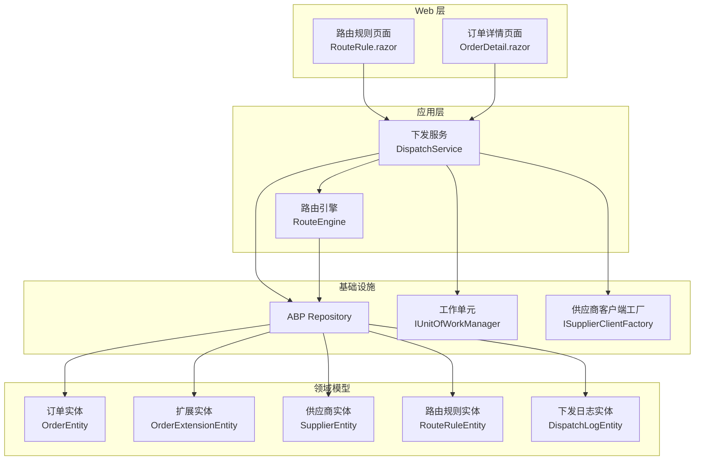
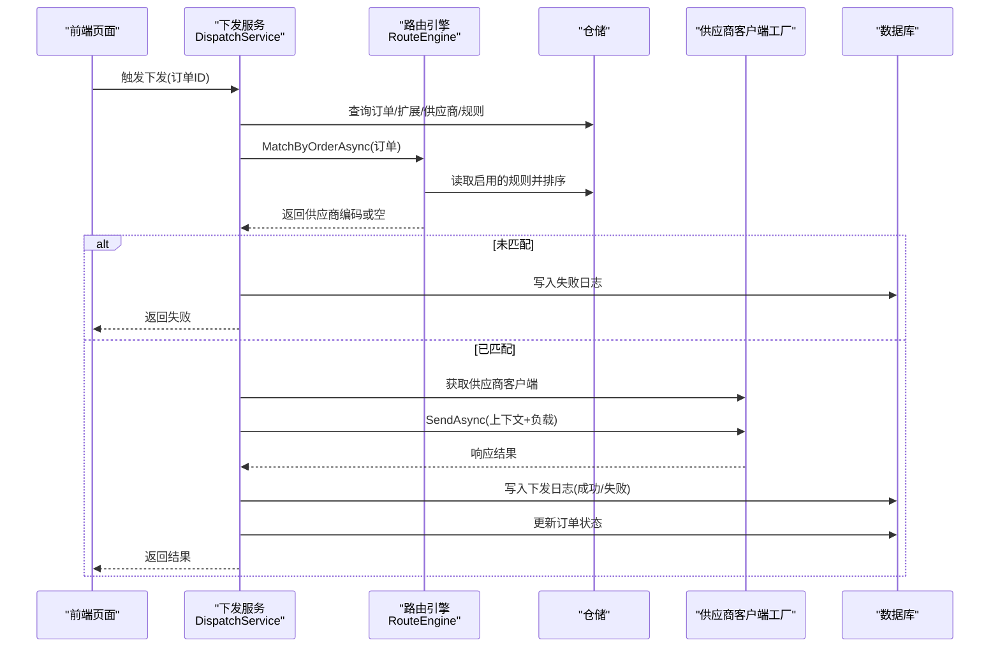
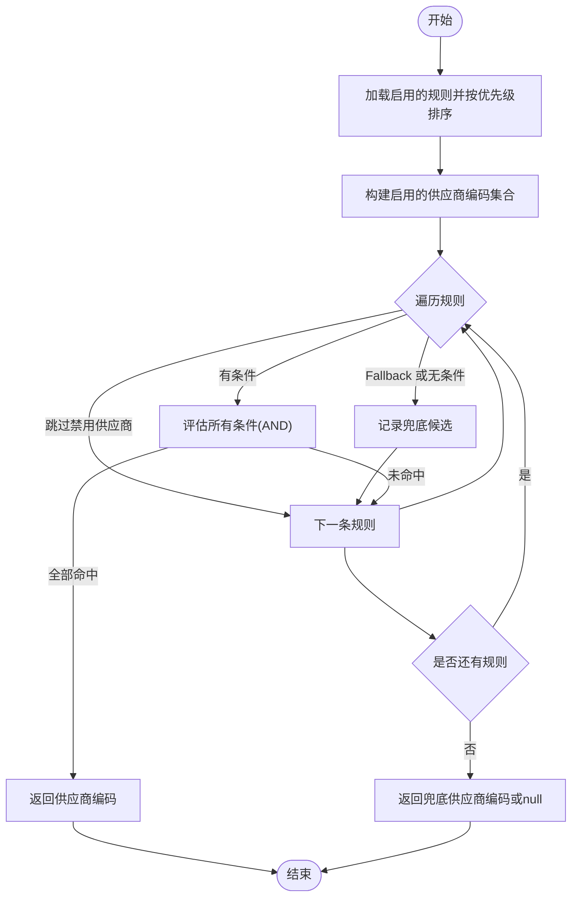
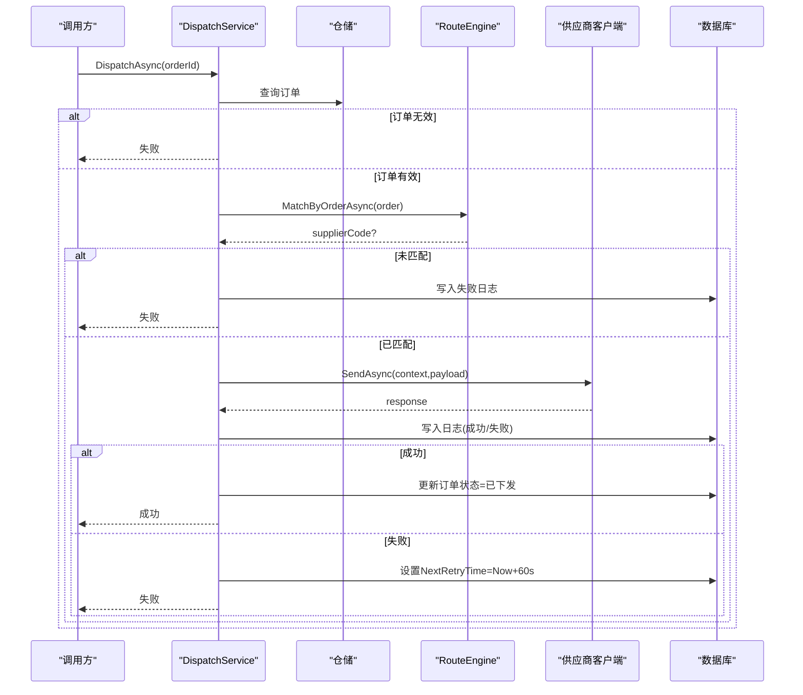
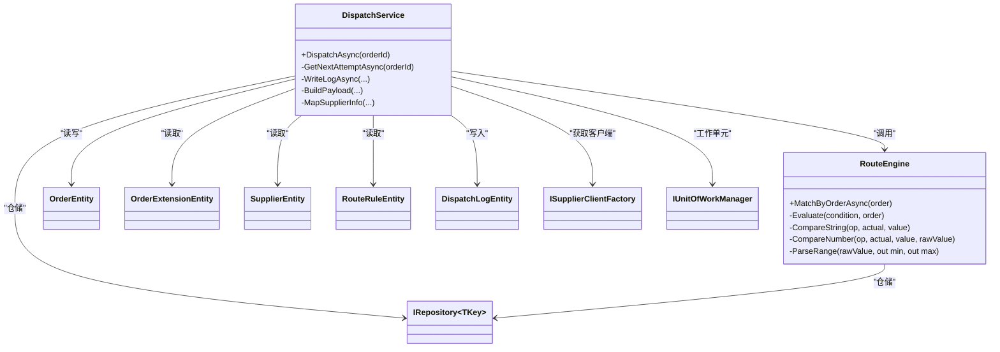

# 订单分发引擎

<cite>
**本文引用的文件**   
- [RouteEngine.cs](file://src/Services/Order/H.Order.Application/Services/RouteEngine.cs)
- [DispatchService.cs](file://src/Services/Order/H.Order.Application/Services/DispatchService.cs)
- [RouteRuleDtos.cs](file://src/Services/Order/H.Order.Application.Contracts/Dtos/RouteRuleDtos.cs)
- [OrderEntities.cs](file://src/Services/Order/H.Order.EntityFrameworkCore/Entities/OrderEntities.cs)
- [RouteRule.razor](file://src/Services/Order/H.Order.Web/Pages/RouteRule.razor)
- [OrderDetail.razor](file://src/Services/Order/H.Order.Web/Pages/OrderDetail.razor)
- [20260718055121_Init.cs](file://src/Tools/H.Order.DbMigrator/Migrations/20260718055121_Init.cs)
</cite>

## 目录
1. [简介](#简介)
2. [项目结构](#项目结构)
3. [核心组件](#核心组件)
4. [架构总览](#架构总览)
5. [详细组件分析](#详细组件分析)
6. [依赖关系分析](#依赖关系分析)
7. [性能与负载均衡](#性能与负载均衡)
8. [监控指标与可观测性](#监控指标与可观测性)
9. [故障排查指南](#故障排查指南)
10. [结论](#结论)

## 简介
本文件面向 AppLab 订单分发引擎，系统性阐述订单路由算法、供应商选择策略、负载均衡机制，以及路由规则配置、条件匹配逻辑、优先级排序。同时覆盖订单分发流程、重试机制、失败处理、动态路由调整、性能优化建议、监控指标与故障排查方法，帮助读者从业务到实现全面理解该子系统。

## 项目结构
订单分发引擎位于 Services/Order 领域，采用 ABP 模块化分层：
- Application 层：应用服务与核心引擎（路由、下发）
- Application.Contracts 层：DTO、枚举、事件契约
- EntityFrameworkCore 层：实体定义与数据库映射
- Web 层：管理界面（路由规则维护、订单详情与手动触发下发）
- Tools/DbMigrator：数据库迁移脚本

图表来源 
- [RouteEngine.cs:1-149](file://src/Services/Order/H.Order.Application/Services/RouteEngine.cs#L1-L149)
- [DispatchService.cs:1-220](file://src/Services/Order/H.Order.Application/Services/DispatchService.cs#L1-L220)
- [OrderEntities.cs:1-169](file://src/Services/Order/H.Order.EntityFrameworkCore/Entities/OrderEntities.cs#L1-L169)
- [RouteRule.razor:1-164](file://src/Services/Order/H.Order.Web/Pages/RouteRule.razor#L1-L164)
- [OrderDetail.razor:37-80](file://src/Services/Order/H.Order.Web/Pages/OrderDetail.razor#L37-L80)

章节来源
- [RouteEngine.cs:1-149](file://src/Services/Order/H.Order.Application/Services/RouteEngine.cs#L1-L149)
- [DispatchService.cs:1-220](file://src/Services/Order/H.Order.Application/Services/DispatchService.cs#L1-L220)
- [OrderEntities.cs:1-169](file://src/Services/Order/H.Order.EntityFrameworkCore/Entities/OrderEntities.cs#L1-L169)
- [RouteRule.razor:1-164](file://src/Services/Order/H.Order.Web/Pages/RouteRule.razor#L1-L164)
- [OrderDetail.razor:37-80](file://src/Services/Order/H.Order.Web/Pages/OrderDetail.razor#L37-L80)

## 核心组件
- 路由引擎 IRouteEngine/RouteEngine：按启用状态与优先级加载规则，逐条评估 AND 组合条件，命中即返回供应商编码；兜底规则作为最终回退。
- 下发服务 DispatchService：编排订单校验、路由匹配、协议调用、日志记录、状态更新与重试时间计算。
- 数据模型：订单、扩展属性、供应商、路由规则、下发日志等实体。
- Web 管理：路由规则维护页、订单详情页（含手动触发下发）。

章节来源
- [RouteEngine.cs:1-149](file://src/Services/Order/H.Order.Application/Services/RouteEngine.cs#L1-L149)
- [DispatchService.cs:1-220](file://src/Services/Order/H.Order.Application/Services/DispatchService.cs#L1-L220)
- [OrderEntities.cs:1-169](file://src/Services/Order/H.Order.EntityFrameworkCore/Entities/OrderEntities.cs#L1-L169)
- [RouteRuleDtos.cs:1-108](file://src/Services/Order/H.Order.Application.Contracts/Dtos/RouteRuleDtos.cs#L1-L108)

## 架构总览
订单分发引擎以“规则驱动 + 协议抽象”为核心思想：
- 规则驱动：通过 RouteRuleEntity 的 ConditionsJson 描述字段级条件（如行业、品类、金额区间），由 RouteEngine 按优先级顺序评估。
- 协议抽象：通过 ISupplierClientFactory 获取具体供应商客户端，屏蔽不同协议差异。
- 事务与审计：使用 ABP 工作单元保证一致性，并通过下发日志持久化全链路信息。

图表来源 
- [DispatchService.cs:47-162](file://src/Services/Order/H.Order.Application/Services/DispatchService.cs#L47-L162)
- [RouteEngine.cs:35-77](file://src/Services/Order/H.Order.Application/Services/RouteEngine.cs#L35-L77)
- [OrderEntities.cs:1-169](file://src/Services/Order/H.Order.EntityFrameworkCore/Entities/OrderEntities.cs#L1-L169)

## 详细组件分析

### 路由引擎（RouteEngine）
- 输入：OrderEntity 实例
- 输出：命中的供应商编码（字符串）或 null
- 关键逻辑：
  - 仅考虑 IsEnabled=true 的规则
  - 按 Priority 升序评估
  - 过滤掉 IsEnabled=false 的供应商
  - Fallback=true 或 ConditionsJson 为空视为兜底候选
  - 条件集合为 AND 语义，所有子条件均满足才命中
  - 支持字段：Industry、ProductCategory、TotalAmount、OrderStatus
  - 支持操作符：字符串 eq/ne/in/contains；数值 eq/ne/gt/lt/gte/lte/between/in

图表来源 
- [RouteEngine.cs:35-77](file://src/Services/Order/H.Order.Application/Services/RouteEngine.cs#L35-L77)
- [RouteEngine.cs:82-149](file://src/Services/Order/H.Order.Application/Services/RouteEngine.cs#L82-L149)

章节来源
- [RouteEngine.cs:1-149](file://src/Services/Order/H.Order.Application/Services/RouteEngine.cs#L1-L149)

### 下发服务（DispatchService）
- 职责：订单有效性校验、路由匹配、协议调用、日志落库、状态更新、重试时间设置
- 关键流程：
  - 订单不存在/已取消：直接失败
  - 已下发：幂等返回成功
  - 路由匹配失败：记录失败日志并返回
  - 协议调用成功：更新订单状态为已下发，记录成功日志
  - 协议调用失败：记录失败日志，设置下次重试时间（当前实现固定 60s）
  - 尝试次数：基于最近一条日志 AttemptCount+1

图表来源 
- [DispatchService.cs:47-162](file://src/Services/Order/H.Order.Application/Services/DispatchService.cs#L47-L162)
- [DispatchService.cs:164-196](file://src/Services/Order/H.Order.Application/Services/DispatchService.cs#L164-L196)

章节来源
- [DispatchService.cs:1-220](file://src/Services/Order/H.Order.Application/Services/DispatchService.cs#L1-L220)

### 路由规则与 DTO
- 规则字段：名称、供应商编码、类型、优先级、启用标志、条件 JSON、兜底标志、备注
- 创建/更新 DTO：用于 API 入参
- 查询 DTO：分页、关键词、启用筛选、供应商编码筛选

章节来源
- [RouteRuleDtos.cs:1-108](file://src/Services/Order/H.Order.Application.Contracts/Dtos/RouteRuleDtos.cs#L1-L108)

### 实体模型
- OrderEntity：订单核心字段（单号、商品、买家、状态、行业、品类、金额、备注）
- OrderExtensionEntity：行业特有属性（JSON）
- SupplierEntity：供应商基础信息与认证、协议配置
- RouteRuleEntity：路由规则定义
- DispatchLogEntity：下发日志（状态、尝试次数、负载、错误、时间戳、下次重试时间）

章节来源
- [OrderEntities.cs:1-169](file://src/Services/Order/H.Order.EntityFrameworkCore/Entities/OrderEntities.cs#L1-L169)

### Web 管理界面
- 路由规则管理页：列表展示、新增/编辑、刷新、按优先级排序显示
- 订单详情页：展示下发状态、最近请求时间、错误信息，支持手动触发下发

章节来源
- [RouteRule.razor:1-164](file://src/Services/Order/H.Order.Web/Pages/RouteRule.razor#L1-L164)
- [OrderDetail.razor:37-80](file://src/Services/Order/H.Order.Web/Pages/OrderDetail.razor#L37-L80)

## 依赖关系分析
- 组件耦合：
  - DispatchService 依赖 IRouteEngine、仓储、客户端工厂与工作单元
  - RouteEngine 依赖规则与供应商仓储
- 外部依赖：
  - ABP 仓储与工作单元
  - CAP（在命名空间中出现，可用于异步消息消费，但当前分发主流程同步执行）
- 潜在循环：无直接循环依赖

图表来源 
- [DispatchService.cs:1-220](file://src/Services/Order/H.Order.Application/Services/DispatchService.cs#L1-L220)
- [RouteEngine.cs:1-149](file://src/Services/Order/H.Order.Application/Services/RouteEngine.cs#L1-L149)
- [OrderEntities.cs:1-169](file://src/Services/Order/H.Order.EntityFrameworkCore/Entities/OrderEntities.cs#L1-L169)

章节来源
- [DispatchService.cs:1-220](file://src/Services/Order/H.Order.Application/Services/DispatchService.cs#L1-L220)
- [RouteEngine.cs:1-149](file://src/Services/Order/H.Order.Application/Services/RouteEngine.cs#L1-L149)
- [OrderEntities.cs:1-169](file://src/Services/Order/H.Order.EntityFrameworkCore/Entities/OrderEntities.cs#L1-L169)

## 性能与负载均衡
- 路由性能：
  - 规则加载与排序：O(n log n)，n 为启用规则数
  - 条件评估：每条规则 O(m)，m 为条件数量
  - 供应商过滤：O(k)，k 为启用供应商数
- 数据库访问：
  - 规则与供应商查询均为简单过滤与投影，建议在 IsEnabled、Priority、Code 上建立索引
  - 下发日志表建议对 OrderId、Status、SupplierCode、CreationTime 建索引（迁移中已有部分索引）
- 负载均衡策略：
  - 当前实现为“规则优先 + 兜底”，未内置轮询/权重等均衡策略
  - 可通过多条同优先级规则配合随机选择或加权策略扩展（需增强路由引擎）
- 可扩展点：
  - 在 RouteEngine 中增加“多候选供应商池”，结合权重/健康度进行二次选择
  - 引入缓存（如内存缓存）缓存启用的规则与供应商集合，降低重复 IO

章节来源
- [20260718055121_Init.cs:156-196](file://src/Tools/H.Order.DbMigrator/Migrations/20260718055121_Init.cs#L156-L196)

## 监控指标与可观测性
- 下发成功率/失败率：基于 DispatchLogEntity.Status 统计
- 平均耗时：RequestTime/ResponseTime 差值
- 重试频率：AttemptCount 分布与 NextRetryTime 积压情况
- 路由命中率：未匹配到供应商的比例（失败原因包含“未匹配到供应商”）
- 供应商可用性：各 SupplierCode 的成功率与错误码分布
- 建议采集：
  - 应用层埋点：路由匹配耗时、协议调用耗时、异常计数
  - 日志聚合：统一收集下发日志，提供看板与告警

章节来源
- [OrderEntities.cs:132-169](file://src/Services/Order/H.Order.EntityFrameworkCore/Entities/OrderEntities.cs#L132-L169)
- [DispatchService.cs:171-196](file://src/Services/Order/H.Order.Application/Services/DispatchService.cs#L171-L196)

## 故障排查指南
- 未匹配到供应商：
  - 检查是否存在启用的兜底规则或无条件规则
  - 确认规则优先级与条件 JSON 是否正确
  - 确认目标供应商 IsEnabled=true
- 供应商不存在：
  - 检查路由规则中的 SupplierCode 是否在供应商表中存在
- 协议调用失败：
  - 查看 DispatchLogEntity 的 ErrorMessage、StatusCode、ResponsePayload
  - 核对供应商 ApiUrl、AuthType、AuthConfig、Protocol、ProtocolConfig
- 重复下发：
  - 订单状态为已下发时会幂等返回成功，避免重复调用
- 重试问题：
  - 失败时 NextRetryTime 设置为 Now+60s，需确保有后台任务消费并重试
  - 若长时间未重试，检查消费者是否正常启动与订阅

章节来源
- [DispatchService.cs:77-102](file://src/Services/Order/H.Order.Application/Services/DispatchService.cs#L77-L102)
- [DispatchService.cs:171-196](file://src/Services/Order/H.Order.Application/Services/DispatchService.cs#L171-L196)
- [OrderDetail.razor:37-80](file://src/Services/Order/H.Order.Web/Pages/OrderDetail.razor#L37-L80)

## 结论
AppLab 订单分发引擎以“规则驱动 + 协议抽象”为核心，具备清晰的路由匹配流程、完善的下发日志与状态管理，便于运维与排障。当前版本侧重规则优先级与兜底策略，尚未内置复杂的负载均衡与健康度评估。后续可在路由引擎中引入多候选池、权重分配、健康检查与动态调优，并结合更丰富的监控与告警体系，进一步提升系统的稳定性与弹性。