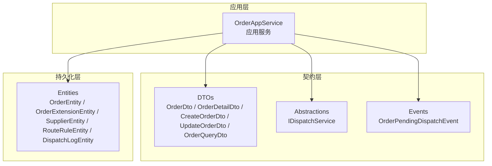
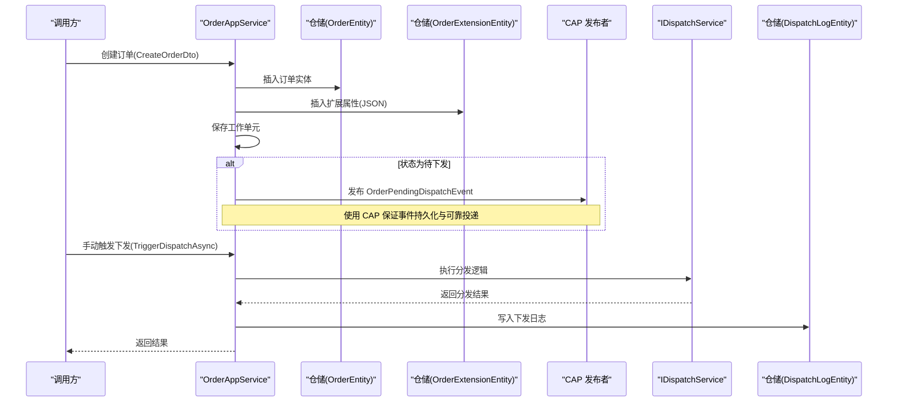
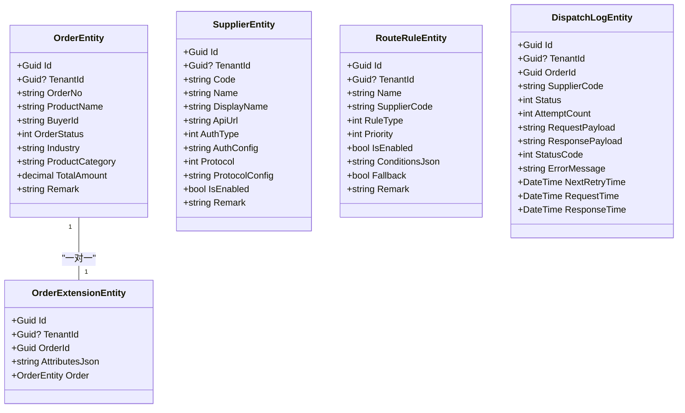
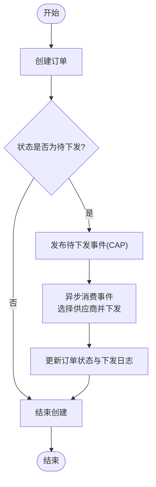
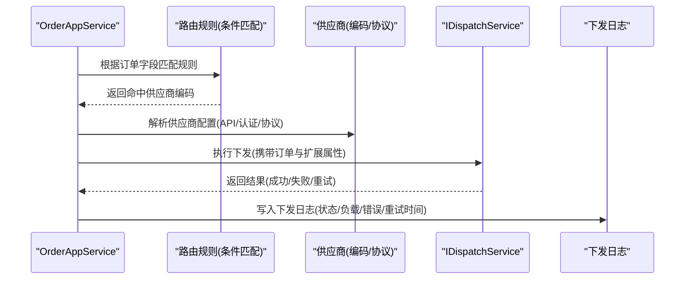
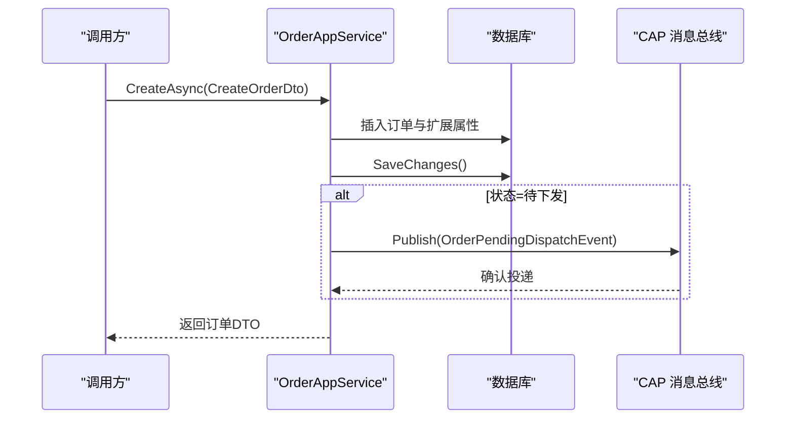
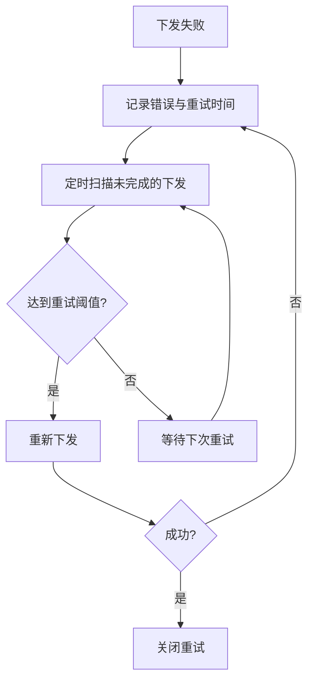
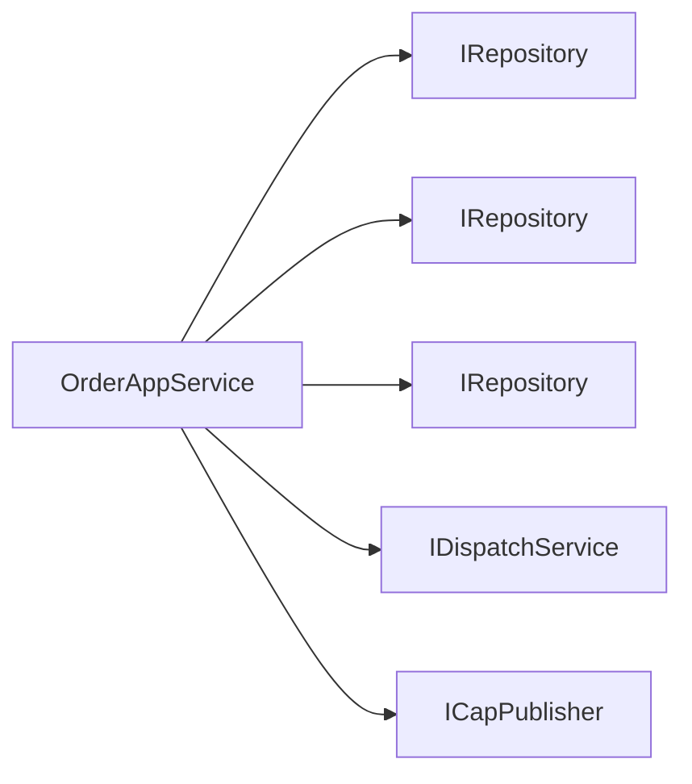

# 订单核心概念

<cite>
**本文引用的文件**   
- [OrderAppService.cs](file://src/Services/Order/H.Order.Application/Services/OrderAppService.cs)
- [OrderDtos.cs](file://src/Services/Order/H.Order.Application.Contracts/Dtos/OrderDtos.cs)
- [OrderEntities.cs](file://src/Services/Order/H.Order.EntityFrameworkCore/Entities/OrderEntities.cs)
</cite>

## 目录
1. [简介](#简介)
2. [项目结构](#项目结构)
3. [核心组件](#核心组件)
4. [架构总览](#架构总览)
5. [详细组件分析](#详细组件分析)
6. [依赖关系分析](#依赖关系分析)
7. [性能考量](#性能考量)
8. [故障排查指南](#故障排查指南)
9. [结论](#结论)
10. [附录](#附录)

## 简介
本文件为 AppLab 订单管理服务的核心概念文档，聚焦订单实体模型、状态流转机制、生命周期管理、与供应商的关系、路由规则与分发策略，以及分布式事务、消息队列集成与异常补偿。内容基于仓库中订单模块的现有实现进行提炼与归纳，帮助读者快速理解系统设计与最佳实践。

## 项目结构
订单服务采用 ABP 模块化分层：
- 应用层（Application）：对外暴露应用服务接口，编排业务用例，协调仓储与外部能力。
- 契约层（Application.Contracts）：定义 DTO、枚举、事件与抽象接口，供前后端与其他服务共享。
- 领域持久化（EntityFrameworkCore）：定义实体、DbContext 与 EF Core 模块。

图表来源
- [OrderAppService.cs:1-241](file://src/Services/Order/H.Order.Application/Services/OrderAppService.cs#L1-L241)
- [OrderDtos.cs:1-161](file://src/Services/Order/H.Order.Application.Contracts/Dtos/OrderDtos.cs#L1-L161)
- [OrderEntities.cs:1-169](file://src/Services/Order/H.Order.EntityFrameworkCore/Entities/OrderEntities.cs#L1-L169)

章节来源
- [OrderAppService.cs:1-241](file://src/Services/Order/H.Order.Application/Services/OrderAppService.cs#L1-L241)
- [OrderDtos.cs:1-161](file://src/Services/Order/H.Order.Application.Contracts/Dtos/OrderDtos.cs#L1-L161)
- [OrderEntities.cs:1-169](file://src/Services/Order/H.Order.EntityFrameworkCore/Entities/OrderEntities.cs#L1-L169)

## 核心组件
- 订单实体与扩展实体
  - 订单实体承载行业无关的最小属性集（订单号、商品名称、买家ID、状态、行业、类别、金额、备注等）。
  - 扩展实体以 JSON 存储行业特有属性，与订单一对一关联，避免主表膨胀。
- 供应商与路由规则
  - 供应商实体记录编码、名称、API 地址、认证方式、协议及配置等。
  - 路由规则实体支持按条件匹配并命中特定供应商，具备优先级、是否启用、兜底等能力。
- 下发日志
  - 记录每次下发的请求负载、响应、HTTP 状态码、错误信息、重试次数与下次重试时间等，便于追踪与补偿。
- 应用服务
  - 提供列表查询、详情查询、创建/更新/删除、手动触发下发、最近下发状态查询等能力。
  - 在创建/更新时，若进入“待下发”状态，则发布 CAP 事件驱动异步分发。

章节来源
- [OrderEntities.cs:1-169](file://src/Services/Order/H.Order.EntityFrameworkCore/Entities/OrderEntities.cs#L1-L169)
- [OrderDtos.cs:1-161](file://src/Services/Order/H.Order.Application.Contracts/Dtos/OrderDtos.cs#L1-L161)
- [OrderAppService.cs:1-241](file://src/Services/Order/H.Order.Application/Services/OrderAppService.cs#L1-L241)

## 架构总览
订单服务通过应用服务编排数据访问与外部协作，结合 CAP 消息总线实现最终一致性。

图表来源
- [OrderAppService.cs:107-145](file://src/Services/Order/H.Order.Application/Services/OrderAppService.cs#L107-L145)
- [OrderAppService.cs:196-206](file://src/Services/Order/H.Order.Application/Services/OrderAppService.cs#L196-L206)
- [OrderAppService.cs:224-234](file://src/Services/Order/H.Order.Application/Services/OrderAppService.cs#L224-L234)
- [OrderEntities.cs:130-169](file://src/Services/Order/H.Order.EntityFrameworkCore/Entities/OrderEntities.cs#L130-L169)

## 详细组件分析

### 订单实体模型设计
- 核心字段
  - 订单号：唯一性校验，生成策略包含时间戳与随机片段。
  - 商品名称、买家ID、总金额、备注：基础交易信息。
  - 行业、商品类别：自由字符串，用于后续路由与扩展。
  - 订单状态：整数表示，配合枚举使用。
- 扩展字段
  - 扩展实体以 JSON 存储行业特有属性，避免频繁变更主表结构。
- 多租户
  - 实体继承多租户基类，支持租户隔离。

图表来源
- [OrderEntities.cs:9-55](file://src/Services/Order/H.Order.EntityFrameworkCore/Entities/OrderEntities.cs#L9-L55)
- [OrderEntities.cs:58-94](file://src/Services/Order/H.Order.EntityFrameworkCore/Entities/OrderEntities.cs#L58-L94)
- [OrderEntities.cs:97-127](file://src/Services/Order/H.Order.EntityFrameworkCore/Entities/OrderEntities.cs#L97-L127)
- [OrderEntities.cs:130-169](file://src/Services/Order/H.Order.EntityFrameworkCore/Entities/OrderEntities.cs#L130-L169)

章节来源
- [OrderEntities.cs:1-169](file://src/Services/Order/H.Order.EntityFrameworkCore/Entities/OrderEntities.cs#L1-L169)

### 订单状态机与生命周期
- 状态定义
  - 使用整数表示订单状态，并通过枚举类型约束合法值。
- 生命周期要点
  - 创建订单时，默认进入“待下发”状态；若显式设置为该状态，将触发 CAP 事件。
  - 更新订单时，若状态变更为“待下发”，同样触发事件。
  - 列表接口仅返回核心字段，详情接口合并扩展属性与最近下发状态。
- 状态流转建议
  - 待下发 → 已下发 → 处理中 → 已完成 / 失败（失败可回退或重试）
  - 任何状态变更需落库并记录审计信息。

图表来源
- [OrderAppService.cs:107-145](file://src/Services/Order/H.Order.Application/Services/OrderAppService.cs#L107-L145)
- [OrderAppService.cs:224-234](file://src/Services/Order/H.Order.Application/Services/OrderAppService.cs#L224-L234)

章节来源
- [OrderAppService.cs:107-145](file://src/Services/Order/H.Order.Application/Services/OrderAppService.cs#L107-L145)
- [OrderAppService.cs:224-234](file://src/Services/Order/H.Order.Application/Services/OrderAppService.cs#L224-L234)

### 订单与供应商关系、路由规则与分发策略
- 供应商关系
  - 供应商实体维护编码、名称、API 地址、认证方式与协议配置。
  - 下发日志记录每次命中的供应商编码，便于追溯。
- 路由规则
  - 规则实体支持条件集合（JSON）、优先级、是否启用与兜底策略。
  - 根据订单的行业、类别等字段匹配规则，确定目标供应商。
- 分发策略
  - 应用服务通过 IDispatchService 统一封装分发逻辑。
  - 支持手动触发下发与自动事件驱动下发两种模式。
  - 下发过程记录请求/响应负载、HTTP 状态码、错误信息与重试计划。

图表来源
- [OrderEntities.cs:58-94](file://src/Services/Order/H.Order.EntityFrameworkCore/Entities/OrderEntities.cs#L58-L94)
- [OrderEntities.cs:97-127](file://src/Services/Order/H.Order.EntityFrameworkCore/Entities/OrderEntities.cs#L97-L127)
- [OrderEntities.cs:130-169](file://src/Services/Order/H.Order.EntityFrameworkCore/Entities/OrderEntities.cs#L130-L169)
- [OrderAppService.cs:196-206](file://src/Services/Order/H.Order.Application/Services/OrderAppService.cs#L196-L206)

章节来源
- [OrderEntities.cs:58-169](file://src/Services/Order/H.Order.EntityFrameworkCore/Entities/OrderEntities.cs#L58-L169)
- [OrderAppService.cs:196-206](file://src/Services/Order/H.Order.Application/Services/OrderAppService.cs#L196-L206)

### 分布式事务与消息队列集成
- 本地事务
  - 创建/更新订单与扩展属性在同一工作单元内提交，确保数据一致性。
- 事件驱动
  - 使用 CAP 发布“待下发”事件，解耦下单与下发流程。
  - 事件包含订单标识、订单号、行业与类别等关键上下文。
- 幂等与可靠性
  - 订单号唯一性校验防止重复下单。
  - 下发日志记录尝试次数与下次重试时间，支撑重试与补偿。

图表来源
- [OrderAppService.cs:107-145](file://src/Services/Order/H.Order.Application/Services/OrderAppService.cs#L107-L145)
- [OrderAppService.cs:224-234](file://src/Services/Order/H.Order.Application/Services/OrderAppService.cs#L224-L234)

章节来源
- [OrderAppService.cs:107-145](file://src/Services/Order/H.Order.Application/Services/OrderAppService.cs#L107-L145)
- [OrderAppService.cs:224-234](file://src/Services/Order/H.Order.Application/Services/OrderAppService.cs#L224-L234)

### 异常补偿机制
- 重试策略
  - 下发失败时记录错误信息与下次重试时间，由后台任务或调度器重试。
- 补偿操作
  - 对超时或失败的订单，可触发重新下发或人工干预。
- 可观测性
  - 下发日志包含请求/响应负载与 HTTP 状态码，便于定位问题。

图表来源
- [OrderEntities.cs:130-169](file://src/Services/Order/H.Order.EntityFrameworkCore/Entities/OrderEntities.cs#L130-L169)

章节来源
- [OrderEntities.cs:130-169](file://src/Services/Order/H.Order.EntityFrameworkCore/Entities/OrderEntities.cs#L130-L169)

## 依赖关系分析
- 应用服务依赖
  - 仓储：OrderEntity、OrderExtensionEntity、DispatchLogEntity。
  - 分发服务：IDispatchService（抽象），屏蔽具体供应商对接差异。
  - 消息总线：ICapPublisher（CAP），用于发布待下发事件。
- 数据模型依赖
  - 订单与扩展实体一对一关联。
  - 下发日志与订单一对多关联。
  - 路由规则与供应商通过编码关联。

图表来源
- [OrderAppService.cs:21-39](file://src/Services/Order/H.Order.Application/Services/OrderAppService.cs#L21-L39)
- [OrderEntities.cs:9-55](file://src/Services/Order/H.Order.EntityFrameworkCore/Entities/OrderEntities.cs#L9-L55)
- [OrderEntities.cs:130-169](file://src/Services/Order/H.Order.EntityFrameworkCore/Entities/OrderEntities.cs#L130-L169)

章节来源
- [OrderAppService.cs:21-39](file://src/Services/Order/H.Order.Application/Services/OrderAppService.cs#L21-L39)
- [OrderEntities.cs:9-55](file://src/Services/Order/H.Order.EntityFrameworkCore/Entities/OrderEntities.cs#L9-L55)
- [OrderEntities.cs:130-169](file://src/Services/Order/H.Order.EntityFrameworkCore/Entities/OrderEntities.cs#L130-L169)

## 性能考量
- 列表查询优化
  - 仅返回核心字段，避免 JOIN 扩展表，提升分页性能。
- 详情查询拆分
  - 先查订单核心，再按需加载扩展属性与最近下发状态。
- 索引建议
  - 对订单号、行业、买家ID、状态、创建时间建立合适索引。
- 扩展属性存储
  - 使用 JSON 字段减少表结构变更带来的迁移成本。
- 事件驱动
  - 通过 CAP 异步处理下发，降低同步链路耗时。

[本节为通用性能指导，不直接分析具体文件]

## 故障排查指南
- 常见问题
  - 订单号冲突：检查唯一性校验与生成策略。
  - 扩展属性未生效：确认 AttributesJson 是否正确传入与保存。
  - 下发失败：查看下发日志的错误信息与 HTTP 状态码。
- 排查步骤
  - 核对订单状态与最近下发状态。
  - 检查路由规则是否命中正确供应商。
  - 确认 CAP 事件是否成功发布与消费。
  - 根据重试时间与尝试次数判断是否需要人工介入。

章节来源
- [OrderAppService.cs:196-206](file://src/Services/Order/H.Order.Application/Services/OrderAppService.cs#L196-L206)
- [OrderEntities.cs:130-169](file://src/Services/Order/H.Order.EntityFrameworkCore/Entities/OrderEntities.cs#L130-L169)

## 结论
订单服务通过清晰的实体模型、状态机与事件驱动的分发机制，实现了可扩展、可观测与高可用的订单处理能力。结合 CAP 与下发日志，系统在分布式环境下具备良好的可靠性与可恢复性。建议在路由规则与分发策略上持续完善，以提升自动化程度与容错能力。

[本节为总结性内容，不直接分析具体文件]

## 附录
- 最佳实践
  - 保持核心字段精简，扩展属性通过 JSON 灵活表达。
  - 所有状态变更必须落库并记录审计信息。
  - 使用 CAP 实现最终一致性，避免强耦合。
  - 下发日志完整记录请求/响应与错误信息，便于回溯。
  - 对高频查询字段建立索引，保障性能。
  - 幂等性与唯一性校验贯穿全链路，防止重复处理。

[本节为通用指导，不直接分析具体文件]