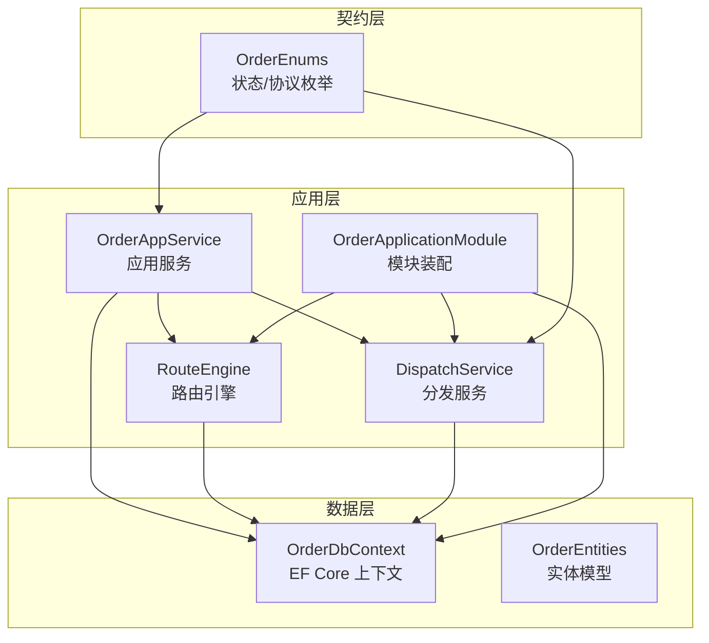
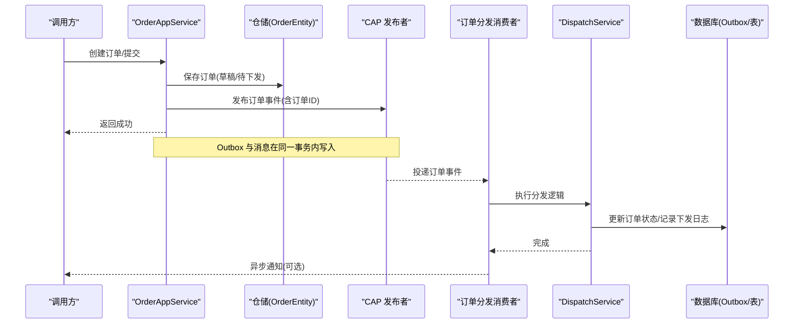
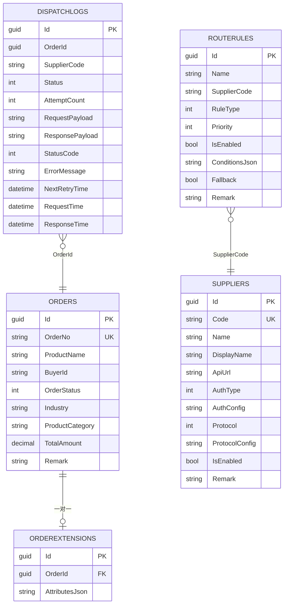
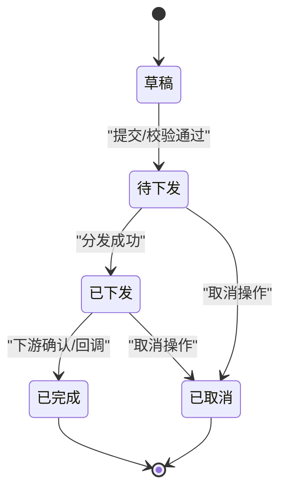
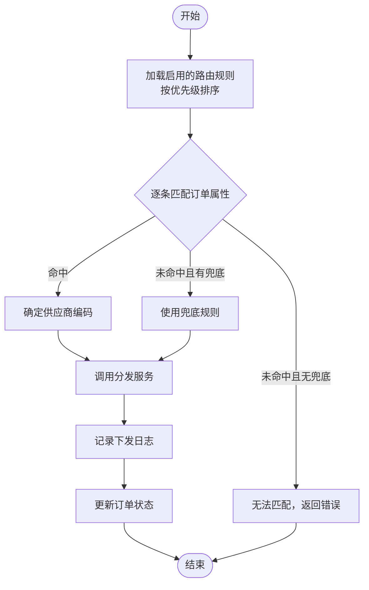
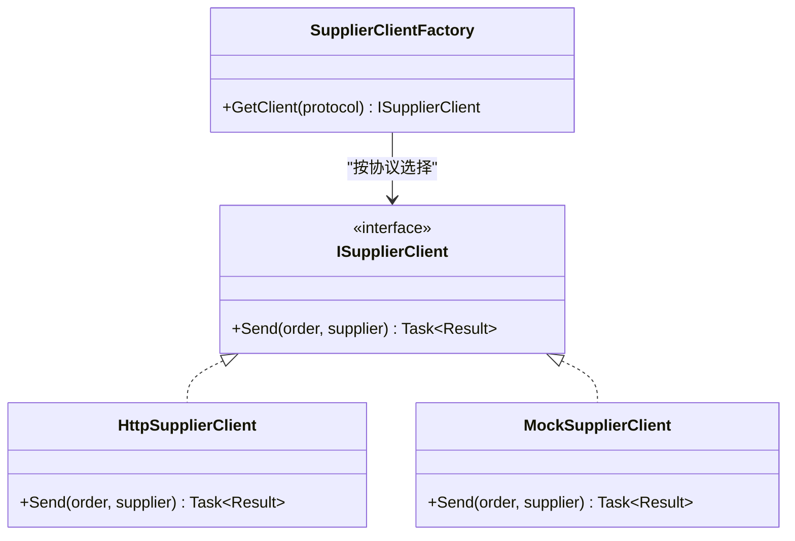
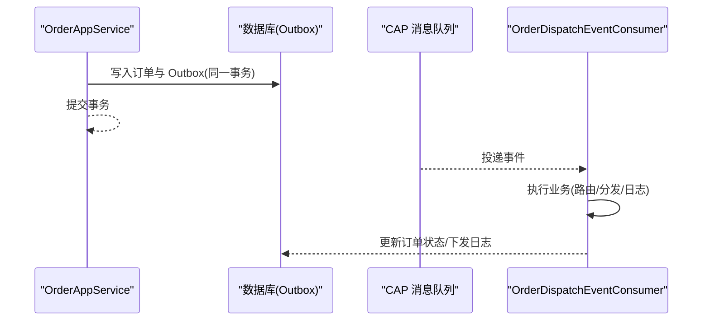
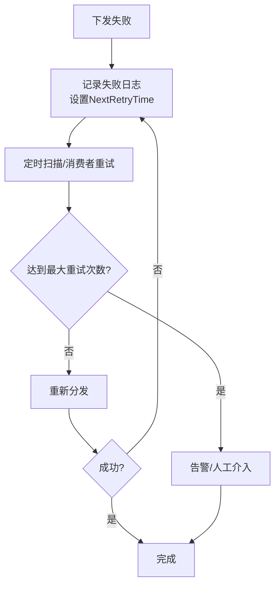
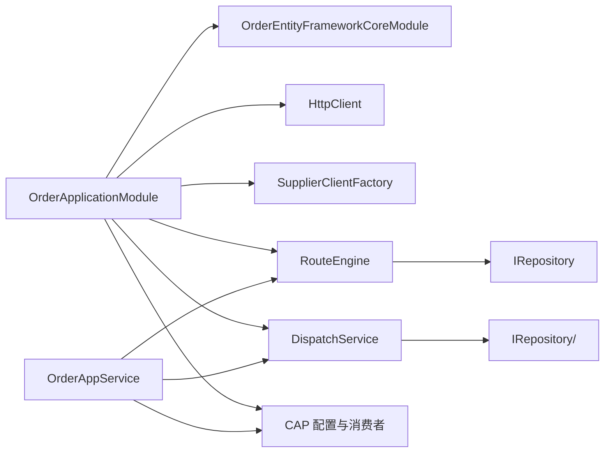

# 订单管理服务

<cite>
**本文引用的文件**   
- [OrderApplicationModule.cs](file://src/Services/Order/H.Order.Application/OrderApplicationModule.cs)
- [OrderDbContext.cs](file://src/Services/Order/H.Order.EntityFrameworkCore/OrderDbContext.cs)
- [OrderEntities.cs](file://src/Services/Order/H.Order.EntityFrameworkCore/Entities/OrderEntities.cs)
- [OrderAppService.cs](file://src/Services/Order/H.Order.Application/Services/OrderAppService.cs)
- [RouteEngine.cs](file://src/Services/Order/H.Order.Application/Services/RouteEngine.cs)
- [DispatchService.cs](file://src/Services/Order/H.Order.Application/Services/DispatchService.cs)
- [OrderMappers.cs](file://src/Services/Order/H.Order.Application/Mapping/OrderMappers.cs)
- [OrderEnums.cs](file://src/Services/Order/H.Order.Application.Contracts/Enums/OrderEnums.cs)
- [OrderWebModule.cs](file://src/Services/Order/H.Order.Web/OrderWebModule.cs)
</cite>

## 目录
1. [简介](#简介)
2. [项目结构](#项目结构)
3. [核心组件](#核心组件)
4. [架构总览](#架构总览)
5. [详细组件分析](#详细组件分析)
6. [依赖关系分析](#依赖关系分析)
7. [性能考量](#性能考量)
8. [故障排查指南](#故障排查指南)
9. [结论](#结论)
10. [附录：API 接口与业务说明](#附录api-接口与业务说明)

## 简介
本文件为 AppLab 订单管理服务的完整技术文档，覆盖订单生命周期、支付集成（预留扩展点）、物流跟踪（预留扩展点）、供应商对接、路由规则与分发策略、分布式事务（CAP Outbox + 消息队列）、异常补偿机制、API 接口与最佳实践。服务基于 ABP 模块化架构，采用 EF Core 持久化、CAP 实现最终一致性与重试、工厂模式进行供应商协议扩展。

## 项目结构
订单服务按 ABP 典型分层组织：
- Application：应用服务、领域服务、映射、模块装配
- Application.Contracts：DTO、枚举、契约
- EntityFrameworkCore：实体、DbContext、仓储访问
- Web：Web 层模块标记（当前为空）

图表来源
- [OrderApplicationModule.cs:18-48](file://src/Services/Order/H.Order.Application/OrderApplicationModule.cs#L18-L48)
- [OrderDbContext.cs:10-30](file://src/Services/Order/H.Order.EntityFrameworkCore/OrderDbContext.cs#L10-L30)
- [OrderEntities.cs:9-169](file://src/Services/Order/H.Order.EntityFrameworkCore/Entities/OrderEntities.cs#L9-L169)

章节来源
- [OrderApplicationModule.cs:18-48](file://src/Services/Order/H.Order.Application/OrderApplicationModule.cs#L18-L48)
- [OrderDbContext.cs:10-30](file://src/Services/Order/H.Order.EntityFrameworkCore/OrderDbContext.cs#L10-L30)

## 核心组件
- 应用服务 OrderAppService：对外暴露订单查询、创建、下发等能力；列表仅返回核心字段，详情按需合并扩展属性；通过 CAP 发布事件驱动后续流程。
- 路由引擎 RouteEngine：根据订单属性匹配供应商，支持优先级与兜底规则。
- 分发服务 DispatchService：负责订单下发、状态流转、重试与日志记录。
- 模块装配 OrderApplicationModule：注册 HTTP 客户端、供应商客户端工厂、路由与分发服务、CAP 配置与消费者。
- 数据模型：Orders、OrderExtensions、Suppliers、RouteRules、DispatchLogs。

章节来源
- [OrderAppService.cs:1-38](file://src/Services/Order/H.Order.Application/Services/OrderAppService.cs#L1-L38)
- [RouteEngine.cs:1-38](file://src/Services/Order/H.Order.Application/Services/RouteEngine.cs#L1-L38)
- [DispatchService.cs:62-202](file://src/Services/Order/H.Order.Application/Services/DispatchService.cs#L62-L202)
- [OrderApplicationModule.cs:18-48](file://src/Services/Order/H.Order.Application/OrderApplicationModule.cs#L18-L48)
- [OrderEntities.cs:9-169](file://src/Services/Order/H.Order.EntityFrameworkCore/Entities/OrderEntities.cs#L9-L169)

## 架构总览
系统以“订单创建 → 路由匹配 → 分发下单 → 结果回调/补偿”为主线，使用 CAP 保证跨进程的最终一致性。

图表来源
- [OrderApplicationModule.cs:38-48](file://src/Services/Order/H.Order.Application/OrderApplicationModule.cs#L38-L48)
- [OrderAppService.cs:1-38](file://src/Services/Order/H.Order.Application/Services/OrderAppService.cs#L1-L38)
- [DispatchService.cs:137-202](file://src/Services/Order/H.Order.Application/Services/DispatchService.cs#L137-L202)

## 详细组件分析

### 订单实体模型与数据流
- Orders：核心订单信息（订单号、商品名、买家ID、行业、类别、金额、备注），唯一索引与常用查询索引。
- OrderExtensions：一对一扩展表，存储行业特有 JSON 属性，避免主表膨胀。
- Suppliers：供应商元数据（编码、名称、API 地址、认证方式、协议类型、协议配置）。
- RouteRules：路由规则（名称、供应商编码、规则类型、优先级、条件 JSON、是否兜底）。
- DispatchLogs：下发日志（订单ID、供应商编码、状态、尝试次数、请求/响应负载、错误信息、下次重试时间）。

图表来源
- [OrderDbContext.cs:36-108](file://src/Services/Order/H.Order.EntityFrameworkCore/OrderDbContext.cs#L36-L108)
- [OrderEntities.cs:9-169](file://src/Services/Order/H.Order.EntityFrameworkCore/Entities/OrderEntities.cs#L9-L169)

章节来源
- [OrderDbContext.cs:36-108](file://src/Services/Order/H.Order.EntityFrameworkCore/OrderDbContext.cs#L36-L108)
- [OrderEntities.cs:9-169](file://src/Services/Order/H.Order.EntityFrameworkCore/Entities/OrderEntities.cs#L9-L169)

### 订单状态机与生命周期
- 状态定义：草稿、待下发、已下发、已完成、已取消。
- 关键流转：
  - 创建后进入草稿或待下发。
  - 分发成功后进入已下发，并记录下发日志。
  - 外部回调或内部处理完成后进入已完成。
  - 用户或风控触发进入已取消。

图表来源
- [OrderEnums.cs:6-22](file://src/Services/Order/H.Order.Application.Contracts/Enums/OrderEnums.cs#L6-L22)
- [DispatchService.cs:137-202](file://src/Services/Order/H.Order.Application/Services/DispatchService.cs#L137-L202)

章节来源
- [OrderEnums.cs:6-22](file://src/Services/Order/H.Order.Application.Contracts/Enums/OrderEnums.cs#L6-L22)
- [DispatchService.cs:137-202](file://src/Services/Order/H.Order.Application/Services/DispatchService.cs#L137-L202)

### 路由规则与分发策略
- 路由引擎：加载所有启用规则，按优先级升序评估，命中即返回供应商编码；兜底规则（无条件且标记为兜底）作为终极匹配。
- 分发服务：校验订单状态，选择供应商，构造请求负载，调用供应商客户端（HTTP/Mock），记录下发日志，更新订单状态。

图表来源
- [RouteEngine.cs:22-38](file://src/Services/Order/H.Order.Application/Services/RouteEngine.cs#L22-L38)
- [DispatchService.cs:62-137](file://src/Services/Order/H.Order.Application/Services/DispatchService.cs#L62-L137)

章节来源
- [RouteEngine.cs:22-38](file://src/Services/Order/H.Order.Application/Services/RouteEngine.cs#L22-L38)
- [DispatchService.cs:62-137](file://src/Services/Order/H.Order.Application/Services/DispatchService.cs#L62-L137)

### 供应商对接与协议扩展
- 协议抽象：ISupplierClient 统一抽象，HttpSupplierClient 与 MockSupplierClient 分别实现 HTTP 调用与模拟。
- 工厂分发：SupplierClientFactory 根据供应商的 Protocol 字段选择具体实现。
- 认证方式：支持 None、ApiKey、Header、Basic、Bearer，通过 AuthConfig 配置。

图表来源
- [OrderApplicationModule.cs:23-27](file://src/Services/Order/H.Order.Application/OrderApplicationModule.cs#L23-L27)
- [OrderEntities.cs:60-94](file://src/Services/Order/H.Order.EntityFrameworkCore/Entities/OrderEntities.cs#L60-L94)

章节来源
- [OrderApplicationModule.cs:23-27](file://src/Services/Order/H.Order.Application/OrderApplicationModule.cs#L23-L27)
- [OrderEntities.cs:60-94](file://src/Services/Order/H.Order.EntityFrameworkCore/Entities/OrderEntities.cs#L60-L94)

### 分布式事务与消息队列集成（CAP）
- Outbox：CAP 使用 SQL Server 作为 Outbox 表，确保本地事务与消息落盘原子性。
- 传输层：开发环境使用内存队列，生产可替换为 RabbitMQ/Kafka 等。
- 失败重试：配置失败重试次数与间隔，保障可靠性。
- 消费者：注册 OrderDispatchEventConsumer 消费订单分发事件。

图表来源
- [OrderApplicationModule.cs:38-48](file://src/Services/Order/H.Order.Application/OrderApplicationModule.cs#L38-L48)

章节来源
- [OrderApplicationModule.cs:38-48](file://src/Services/Order/H.Order.Application/OrderApplicationModule.cs#L38-L48)

### 异常补偿与重试机制
- 下发失败：记录失败日志，设置下次重试时间，由 CAP 或后台任务按策略重试。
- 幂等性：通过订单号与下发日志的唯一约束避免重复处理。
- 补偿策略：对超时或下游不可用场景，采用退避重试与人工干预入口。

图表来源
- [OrderEntities.cs:132-169](file://src/Services/Order/H.Order.EntityFrameworkCore/Entities/OrderEntities.cs#L132-L169)
- [OrderApplicationModule.cs:42-44](file://src/Services/Order/H.Order.Application/OrderApplicationModule.cs#L42-L44)

章节来源
- [OrderEntities.cs:132-169](file://src/Services/Order/H.Order.EntityFrameworkCore/Entities/OrderEntities.cs#L132-L169)
- [OrderApplicationModule.cs:42-44](file://src/Services/Order/H.Order.Application/OrderApplicationModule.cs#L42-L44)

### 支付与物流集成（预留扩展点）
- 支付集成：在订单创建或分发成功后，通过事件或回调接入支付网关；建议在 OrderAppService 中增加支付步骤，并在分发服务中增加支付状态同步。
- 物流跟踪：在供应商下发成功后，订阅物流事件，更新订单物流轨迹；可在扩展表中维护物流信息。

[本节为概念性说明，不直接分析具体文件]

## 依赖关系分析
- 模块装配依赖：OrderApplicationModule 依赖 EF Core 模块，注册 HTTP 客户端、供应商客户端、路由与分发服务、CAP 配置与消费者。
- 应用服务依赖：OrderAppService 依赖仓储、分发服务、CAP 发布者。
- 路由与分发依赖：RouteEngine 与 DispatchService 依赖仓储访问与枚举定义。

图表来源
- [OrderApplicationModule.cs:18-48](file://src/Services/Order/H.Order.Application/OrderApplicationModule.cs#L18-L48)
- [OrderAppService.cs:1-38](file://src/Services/Order/H.Order.Application/Services/OrderAppService.cs#L1-L38)

章节来源
- [OrderApplicationModule.cs:18-48](file://src/Services/Order/H.Order.Application/OrderApplicationModule.cs#L18-L48)
- [OrderAppService.cs:1-38](file://src/Services/Order/H.Order.Application/Services/OrderAppService.cs#L1-L38)

## 性能考量
- 查询优化：列表查询仅返回核心字段，详情按需合并扩展表，减少大对象传输。
- 索引设计：订单号唯一索引、行业/买家ID/状态索引，提升常见查询效率。
- 扩展表分离：行业特有属性 JSON 存储，避免主表膨胀与频繁变更。
- 消息解耦：CAP 异步分发，降低同步链路时延。
- 重试策略：合理设置失败重试次数与间隔，避免雪崩。

章节来源
- [OrderDbContext.cs:48-52](file://src/Services/Order/H.Order.EntityFrameworkCore/OrderDbContext.cs#L48-L52)
- [OrderDbContext.cs:104-108](file://src/Services/Order/H.Order.EntityFrameworkCore/OrderDbContext.cs#L104-L108)
- [OrderApplicationModule.cs:42-44](file://src/Services/Order/H.Order.Application/OrderApplicationModule.cs#L42-L44)

## 故障排查指南
- 订单未下发：检查订单状态是否为待下发；查看下发日志是否有失败记录与错误信息；确认路由规则是否正确启用。
- 分发失败：核对供应商 API 地址与认证配置；检查网络连通性与超时设置；查看 CAP 重试计数与下次重试时间。
- 状态不一致：比对 Outbox 与订单状态；确认消费者是否成功处理事件；必要时手动重放事件。
- 性能问题：关注慢查询与索引命中率；检查扩展表 JSON 大小；评估并发与重试风暴。

章节来源
- [OrderEntities.cs:132-169](file://src/Services/Order/H.Order.EntityFrameworkCore/Entities/OrderEntities.cs#L132-L169)
- [OrderApplicationModule.cs:42-44](file://src/Services/Order/H.Order.Application/OrderApplicationModule.cs#L42-L44)

## 结论
订单管理服务通过清晰的实体模型、灵活的路由与分发策略、可靠的 CAP 分布式事务与重试机制，实现了高可用与可扩展的订单处理能力。建议在生产环境中将消息队列替换为稳定中间件，完善支付与物流回调，强化监控与告警，持续优化索引与重试策略。

## 附录：API 接口与业务说明
- 列表查询：返回订单核心字段，支持按状态筛选。
- 详情查询：按订单 ID 查询核心字段与扩展属性合并结果。
- 创建订单：支持草稿与待下发两种初始状态，创建后发布事件。
- 下发订单：触发路由匹配与供应商调用，更新订单状态与下发日志。
- 映射转换：OrderMappers 负责 DTO 与实体之间的状态与字段映射。

章节来源
- [OrderAppService.cs:1-38](file://src/Services/Order/H.Order.Application/Services/OrderAppService.cs#L1-L38)
- [OrderMappers.cs:18-63](file://src/Services/Order/H.Order.Application/Mapping/OrderMappers.cs#L18-L63)
- [OrderWebModule.cs:1-10](file://src/Services/Order/H.Order.Web/OrderWebModule.cs#L1-L10)