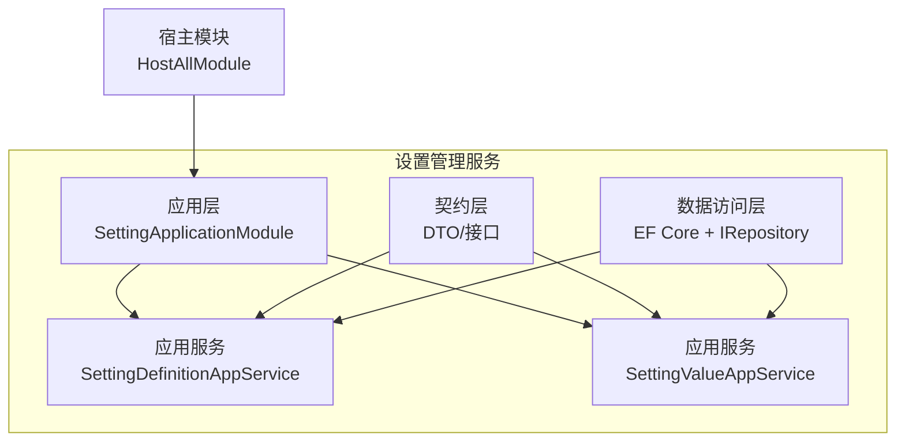
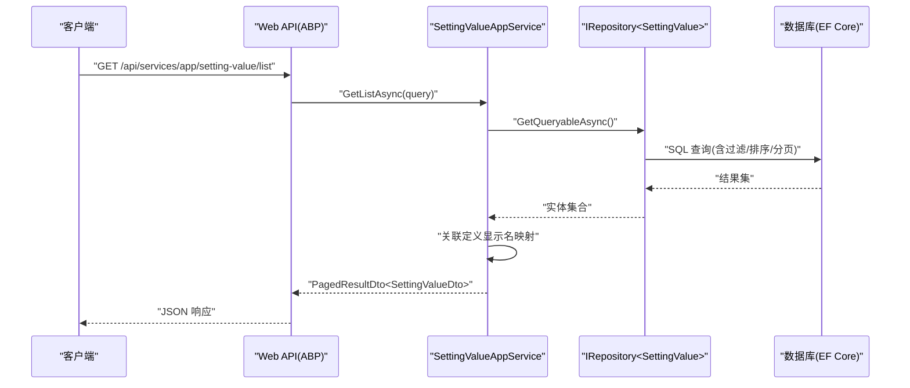
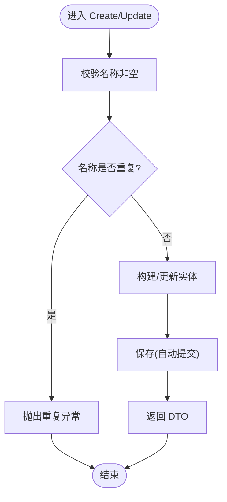
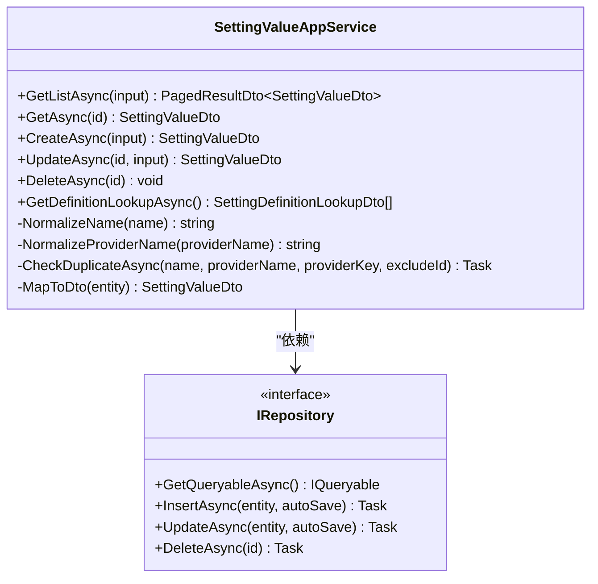
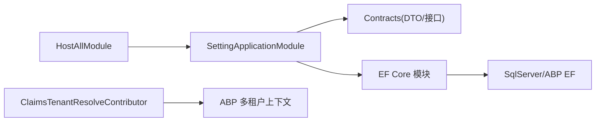

# 设置管理服务

<cite>
**本文引用的文件**   
- [SettingApplicationModule.cs](file://src/Services/Setting/H.Setting.Application/SettingApplicationModule.cs)
- [SettingDefinitionAppService.cs](file://src/Services/Setting/H.Setting.Application/Services/SettingDefinitionAppService.cs)
- [SettingValueAppService.cs](file://src/Services/Setting/H.Setting.Application/Services/SettingValueAppService.cs)
- [SettingDefinitionDtos.cs](file://src/Services/Setting/H.Setting.Application.Contracts/Dtos/SettingDefinitionDtos.cs)
- [H.Setting.Application.csproj](file://src/Services/Setting/H.Setting.Application/H.Setting.Application.csproj)
- [H.Setting.Application.Contracts.csproj](file://src/Services/Setting/H.Setting.Application.Contracts/H.Setting.Application.Contracts.csproj)
- [H.Setting.EntityFrameworkCore.csproj](file://src/Services/Setting/H.Setting.EntityFrameworkCore/H.Setting.EntityFrameworkCore.csproj)
- [HostAllModule.cs](file://src/Host/H.AppLab.Host.All/H.AppLab.Host.All/HostAllModule.cs)
- [ClaimsTenantResolveContributor.cs](file://src/Host/H.AppLab.Host.All/H.AppLab.Host.All/ClaimsTenantResolveContributor.cs)
</cite>

## 目录
1. [简介](#简介)
2. [项目结构](#项目结构)
3. [核心组件](#核心组件)
4. [架构总览](#架构总览)
5. [详细组件分析](#详细组件分析)
6. [依赖关系分析](#依赖关系分析)
7. [性能考虑](#性能考虑)
8. [故障排查指南](#故障排查指南)
9. [结论](#结论)
10. [附录：API 与界面说明](#附录api-与界面说明)

## 简介
本文件为 AppLab 设置管理服务的完整技术文档，覆盖动态配置管理、设置项定义、值存储、版本控制（审计字段）、多租户隔离、缓存策略与热更新支持等。同时提供完整的 API 接口说明与设置项管理界面的使用指引，并给出最佳实践与安全建议。

## 项目结构
设置管理服务采用 ABP 模块化架构，分为应用层、契约层与数据访问层：
- 应用层：定义应用服务（SettingDefinitionAppService、SettingValueAppService）与模块注册（SettingApplicationModule）。
- 契约层：定义 DTO、查询参数与服务接口（ISettingDefinitionAppService、ISettingValueAppService）。
- 数据访问层：基于 EF Core 的实体与仓储抽象（通过 IRepository 注入）。

图表来源
- [SettingApplicationModule.cs:1-16](file://src/Services/Setting/H.Setting.Application/SettingApplicationModule.cs#L1-L16)
- [SettingDefinitionAppService.cs:1-135](file://src/Services/Setting/H.Setting.Application/Services/SettingDefinitionAppService.cs#L1-L135)
- [SettingValueAppService.cs:1-166](file://src/Services/Setting/H.Setting.Application/Services/SettingValueAppService.cs#L1-L166)
- [HostAllModule.cs:139-155](file://src/Host/H.AppLab.Host.All/H.AppLab.Host.All/HostAllModule.cs#L139-L155)

章节来源
- [H.Setting.Application.csproj:1-17](file://src/Services/Setting/H.Setting.Application/H.Setting.Application.csproj#L1-L17)
- [H.Setting.Application.Contracts.csproj:1-10](file://src/Services/Setting/H.Setting.Application.Contracts/H.Setting.Application.Contracts.csproj#L1-L10)
- [H.Setting.EntityFrameworkCore.csproj:1-17](file://src/Services/Setting/H.Setting.EntityFrameworkCore/H.Setting.EntityFrameworkCore.csproj#L1-L17)

## 核心组件
- SettingDefinitionAppService：负责“配置定义”的增删改查、名称唯一性校验、是否可删除保护（存在值时不可删除）。
- SettingValueAppService：负责“配置值”的增删改查、提供者归一化、重复性校验、按名称/提供者过滤分页查询，以及定义查找列表。
- DTO 模型：SettingDefinitionDto、CreateUpdateSettingDefinitionDto、SettingDefinitionQueryDto、SettingValueDto、CreateUpdateSettingValueDto、SettingValueQueryDto、SettingDefinitionLookupDto。
- 模块与依赖：SettingApplicationModule 依赖 SettingEntityFrameworkCoreModule；宿主 HostAllModule 注册所有控制器，包含 SettingApplicationModule。

章节来源
- [SettingDefinitionAppService.cs:1-135](file://src/Services/Setting/H.Setting.Application/Services/SettingDefinitionAppService.cs#L1-L135)
- [SettingValueAppService.cs:1-166](file://src/Services/Setting/H.Setting.Application/Services/SettingValueAppService.cs#L1-L166)
- [SettingDefinitionDtos.cs:1-58](file://src/Services/Setting/H.Setting.Application.Contracts/Dtos/SettingDefinitionDtos.cs#L1-L58)
- [SettingApplicationModule.cs:1-16](file://src/Services/Setting/H.Setting.Application/SettingApplicationModule.cs#L1-L16)
- [HostAllModule.cs:139-155](file://src/Host/H.AppLab.Host.All/H.AppLab.Host.All/HostAllModule.cs#L139-L155)

## 架构总览
设置管理服务遵循 ABP 分层与约定优于配置原则：
- Web/API 层：由宿主模块统一注册控制器，暴露 RESTful 接口。
- Application 层：应用服务实现业务编排、输入校验、权限与异常处理。
- Domain/Data 层：通过 IRepository 访问数据库实体，利用 EF Core 进行持久化。
- 多租户：通过 ClaimsTenantResolveContributor 从认证 Claim 解析租户，驱动数据隔离。

图表来源
- [SettingValueAppService.cs:27-63](file://src/Services/Setting/H.Setting.Application/Services/SettingValueAppService.cs#L27-L63)
- [HostAllModule.cs:139-155](file://src/Host/H.AppLab.Host.All/H.AppLab.Host.All/HostAllModule.cs#L139-L155)

## 详细组件分析

### 配置定义管理（SettingDefinitionAppService）
- 功能要点：
  - 分页查询：支持按名称/显示名称模糊过滤，默认排序按 Name 升序。
  - 创建/更新：名称去重校验；保存时自动保存；支持加密标记、可见性、继承性与提供者白名单。
  - 删除保护：若该定义下存在任何值记录，则拒绝删除。
- 数据结构与复杂度：
  - 查询为 O(n) 扫描+过滤，分页后返回固定数量；计数操作一次。
  - 插入/更新为 O(1) 单行写入。
- 错误处理：
  - 名称为空或重复抛出用户友好异常。
  - 存在值时删除抛错。

图表来源
- [SettingDefinitionAppService.cs:52-91](file://src/Services/Setting/H.Setting.Application/Services/SettingDefinitionAppService.cs#L52-L91)
- [SettingDefinitionAppService.cs:104-118](file://src/Services/Setting/H.Setting.Application/Services/SettingDefinitionAppService.cs#L104-L118)

章节来源
- [SettingDefinitionAppService.cs:1-135](file://src/Services/Setting/H.Setting.Application/Services/SettingDefinitionAppService.cs#L1-L135)

### 配置值管理（SettingValueAppService）
- 功能要点：
  - 分页查询：支持按名称模糊过滤、按 ProviderName 精确过滤；排序先 Name 再 ProviderName。
  - 创建/更新：名称与提供者归一化（空提供者默认 Global），重复性校验（Name+ProviderName+ProviderKey）。
  - 定义查找：返回所有定义的 Name/DisplayName/DefaultValue 供前端下拉选择。
- 数据结构与复杂度：
  - 查询为 O(n) 过滤+排序+分页；额外一次定义查询用于填充 DisplayName。
  - 插入/更新为 O(1)。
- 错误处理：
  - 名称为空抛错；重复键抛错。

图表来源
- [SettingValueAppService.cs:1-166](file://src/Services/Setting/H.Setting.Application/Services/SettingValueAppService.cs#L1-L166)

章节来源
- [SettingValueAppService.cs:1-166](file://src/Services/Setting/H.Setting.Application/Services/SettingValueAppService.cs#L1-L166)

### 数据模型与类型
- 配置定义（SettingDefinitionDto）：
  - Name：唯一标识
  - DisplayName：展示名
  - Description：描述
  - DefaultValue：默认值
  - IsVisibleToClients：是否对客户端可见
  - Providers：允许的提供者（逗号分隔，如 G,T,U）
  - IsInherited：是否允许下层继承
  - IsEncrypted：是否加密存储
- 配置值（SettingValueDto）：
  - Name：配置项名称
  - Value：值
  - ProviderName：提供者（Global/自定义）
  - ProviderKey：提供者键（用于区分同提供者下的不同实例）
- 查询参数：
  - SettingDefinitionQueryDto：Filter、分页参数
  - SettingValueQueryDto：Filter、ProviderName、分页参数

章节来源
- [SettingDefinitionDtos.cs:1-58](file://src/Services/Setting/H.Setting.Application.Contracts/Dtos/SettingDefinitionDtos.cs#L1-L58)

## 依赖关系分析
- 程序集依赖：
  - H.Setting.Application 引用 Contracts 与 EF Core 模块。
  - H.Setting.EntityFrameworkCore 引用 SqlServer 与 ABP EF Core 包。
- 运行时依赖：
  - 宿主模块统一注册控制器，SettingApplicationModule 被注册到 MVC 控制器发现中。
- 多租户：
  - ClaimsTenantResolveContributor 从 Claims 中读取 TenantId 并设置当前租户，驱动各仓储的租户隔离。

图表来源
- [HostAllModule.cs:139-155](file://src/Host/H.AppLab.Host.All/H.AppLab.Host.All/HostAllModule.cs#L139-L155)
- [ClaimsTenantResolveContributor.cs:1-30](file://src/Host/H.AppLab.Host.All/H.AppLab.Host.All/ClaimsTenantResolveContributor.cs#L1-L30)
- [H.Setting.Application.csproj:1-17](file://src/Services/Setting/H.Setting.Application/H.Setting.Application.csproj#L1-L17)
- [H.Setting.EntityFrameworkCore.csproj:1-17](file://src/Services/Setting/H.Setting.EntityFrameworkCore/H.Setting.EntityFrameworkCore.csproj#L1-L17)

章节来源
- [H.Setting.Application.csproj:1-17](file://src/Services/Setting/H.Setting.Application/H.Setting.Application.csproj#L1-L17)
- [H.Setting.Application.Contracts.csproj:1-10](file://src/Services/Setting/H.Setting.Application.Contracts/H.Setting.Application.Contracts.csproj#L1-L10)
- [H.Setting.EntityFrameworkCore.csproj:1-17](file://src/Services/Setting/H.Setting.EntityFrameworkCore/H.Setting.EntityFrameworkCore.csproj#L1-L17)
- [HostAllModule.cs:139-155](file://src/Host/H.AppLab.Host.All/H.AppLab.Host.All/HostAllModule.cs#L139-L155)
- [ClaimsTenantResolveContributor.cs:1-30](file://src/Host/H.AppLab.Host.All/H.AppLab.Host.All/ClaimsTenantResolveContributor.cs#L1-L30)

## 性能考虑
- 查询优化：
  - 使用 GetQueryableAsync 在数据库端完成过滤、排序与分页，避免全量拉取。
  - 批量获取定义显示名映射，减少 N+1 查询。
- 写入性能：
  - Insert/Update 均使用 autoSave=true，适合小事务场景；高并发时可考虑批处理或异步队列。
- 缓存建议：
  - 定义列表与默认值适合短 TTL 缓存（内存缓存/Redis），降低频繁查询。
  - 值变更事件触发缓存失效，保证一致性。
- 连接与并发：
  - 合理配置 EF Core 连接池与命令超时；对大结果集启用流式读取。

[本节为通用指导，不直接分析具体文件]

## 故障排查指南
- 常见错误与定位：
  - “配置名称不能为空”：检查输入 Name 是否为空或仅空白字符。
  - “配置名称已存在”：检查是否存在同名定义；更新时需排除自身 ID。
  - “该配置定义下存在配置项，无法删除”：先删除相关值记录再删除定义。
  - “配置项（提供者 X）已存在”：检查 Name+ProviderName+ProviderKey 组合是否重复。
- 调试建议：
  - 开启 ABP 日志与 SQL 跟踪，确认查询条件与执行计划。
  - 验证 Claims 中的 TenantId 是否正确，确保多租户隔离生效。

章节来源
- [SettingDefinitionAppService.cs:104-118](file://src/Services/Setting/H.Setting.Application/Services/SettingDefinitionAppService.cs#L104-L118)
- [SettingDefinitionAppService.cs:93-102](file://src/Services/Setting/H.Setting.Application/Services/SettingDefinitionAppService.cs#L93-L102)
- [SettingValueAppService.cs:130-153](file://src/Services/Setting/H.Setting.Application/Services/SettingValueAppService.cs#L130-L153)

## 结论
设置管理服务以 ABP 模块化架构为基础，提供了完善的配置定义与值管理能力，具备多租户隔离、审计追踪与基础的安全控制。通过合理的查询优化与缓存策略，可满足高并发与低延迟的使用场景。建议在后续迭代中补充更丰富的验证规则、版本管理与热更新机制，以提升运维效率与系统稳定性。

[本节为总结性内容，不直接分析具体文件]

## 附录：API 与界面说明

### API 接口总览
- 配置定义（SettingDefinition）
  - GET /api/services/app/setting-definition/list
    - 请求体：SettingDefinitionQueryDto（Filter、分页）
    - 响应：PagedResultDto<SettingDefinitionDto>
  - GET /api/services/app/setting-definition/{id}
    - 响应：SettingDefinitionDto
  - POST /api/services/app/setting-definition/create
    - 请求体：CreateUpdateSettingDefinitionDto
    - 响应：SettingDefinitionDto
  - PUT /api/services/app/setting-definition/update/{id}
    - 请求体：CreateUpdateSettingDefinitionDto
    - 响应：SettingDefinitionDto
  - DELETE /api/services/app/setting-definition/delete/{id}
    - 响应：无
- 配置值（SettingValue）
  - GET /api/services/app/setting-value/list
    - 请求体：SettingValueQueryDto（Filter、ProviderName、分页）
    - 响应：PagedResultDto<SettingValueDto>
  - GET /api/services/app/setting-value/{id}
    - 响应：SettingValueDto
  - POST /api/services/app/setting-value/create
    - 请求体：CreateUpdateSettingValueDto
    - 响应：SettingValueDto
  - PUT /api/services/app/setting-value/update/{id}
    - 请求体：CreateUpdateSettingValueDto
    - 响应：SettingValueDto
  - DELETE /api/services/app/setting-value/delete/{id}
    - 响应：无
  - GET /api/services/app/setting-value/definition-lookup
    - 响应：List<SettingDefinitionLookupDto>

章节来源
- [SettingDefinitionAppService.cs:27-102](file://src/Services/Setting/H.Setting.Application/Services/SettingDefinitionAppService.cs#L27-L102)
- [SettingValueAppService.cs:27-128](file://src/Services/Setting/H.Setting.Application/Services/SettingValueAppService.cs#L27-L128)

### 设置项管理界面使用说明
- 配置定义管理
  - 新增：填写名称、显示名、描述、默认值、是否对客户端可见、允许提供者、是否继承、是否加密。
  - 编辑：修改上述字段；名称变更需满足唯一性。
  - 删除：若存在值记录将阻止删除。
- 配置值管理
  - 新增/编辑：填写名称、值、提供者名称（默认 Global）、提供者键；重复键将被拒绝。
  - 查询：支持按名称模糊与提供者精确过滤，查看对应定义的显示名。
  - 定义查找：用于前端下拉选择，展示名称、显示名与默认值。

章节来源
- [SettingDefinitionDtos.cs:1-58](file://src/Services/Setting/H.Setting.Application.Contracts/Dtos/SettingDefinitionDtos.cs#L1-L58)
- [SettingValueAppService.cs:117-128](file://src/Services/Setting/H.Setting.Application/Services/SettingValueAppService.cs#L117-L128)

### 多租户与隔离
- 租户解析：从认证 Cookie 的 TenantId Claim 解析当前租户，驱动 ABP 多租户上下文。
- 数据隔离：仓储层自动附加租户条件，确保不同租户的数据互不可见。

章节来源
- [ClaimsTenantResolveContributor.cs:1-30](file://src/Host/H.AppLab.Host.All/H.AppLab.Host.All/ClaimsTenantResolveContributor.cs#L1-L30)

### 安全与最佳实践
- 敏感信息：IsEncrypted 标记用于提示加密存储；实际加密应在数据访问层实现。
- 输入校验：服务端严格校验名称、提供者与键的唯一性与非空性。
- 最小权限：IsVisibleToClients 控制是否向客户端暴露定义，避免泄露内部配置。
- 审计追踪：FullAuditedEntityDto 提供创建/更新时间与审计字段，便于追溯。
- 缓存策略：对只读数据（定义、默认值）实施短期缓存，并在写操作后失效。
- 热更新：建议结合事件总线或消息队列，在值变更后通知订阅者刷新缓存。

[本节为通用指导，不直接分析具体文件]