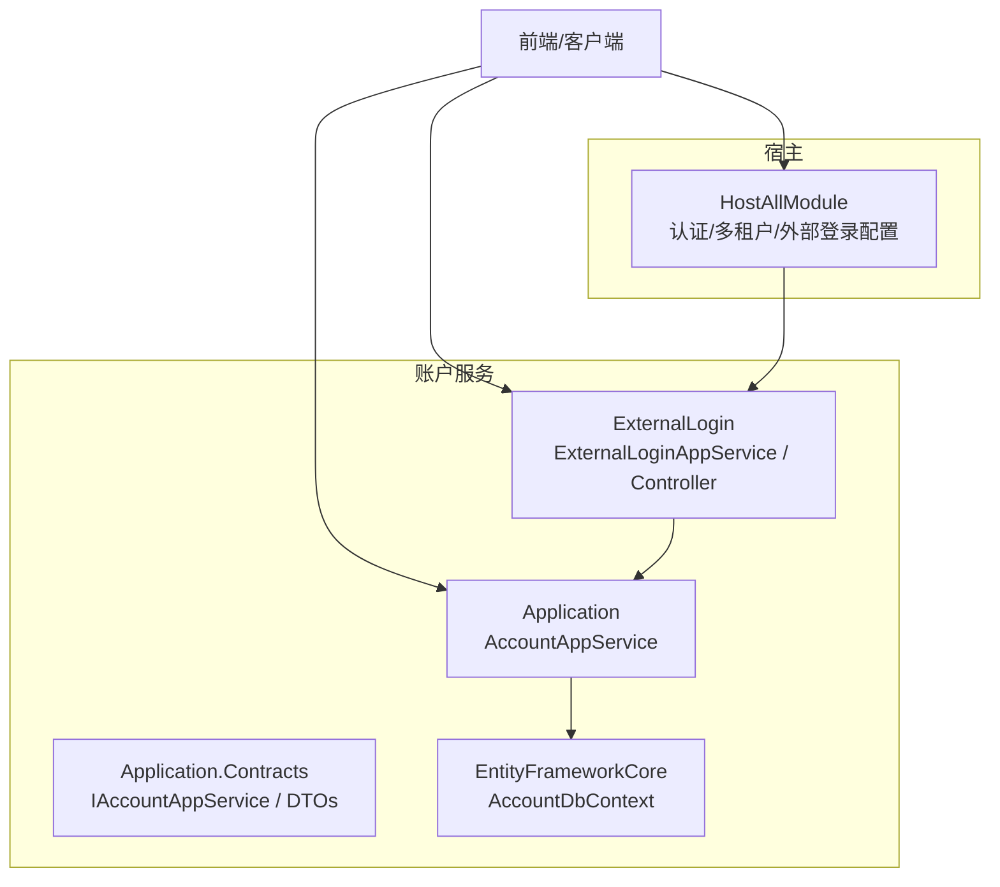
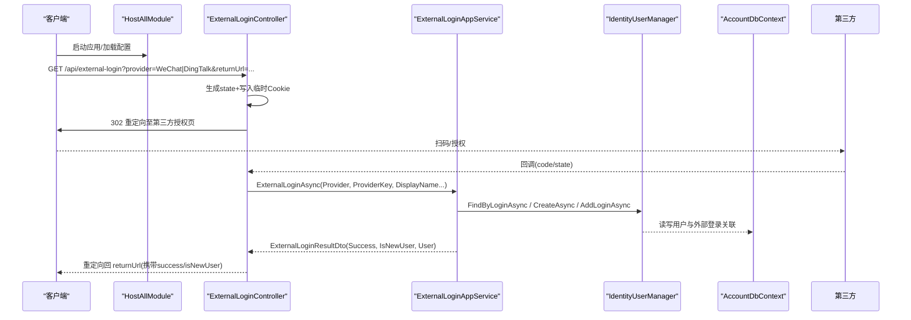
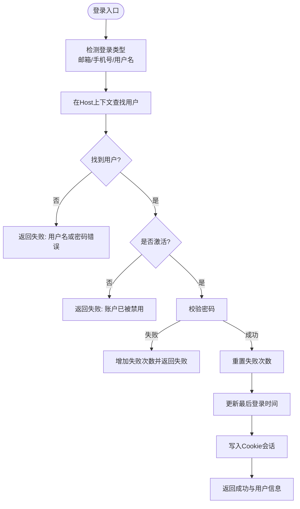
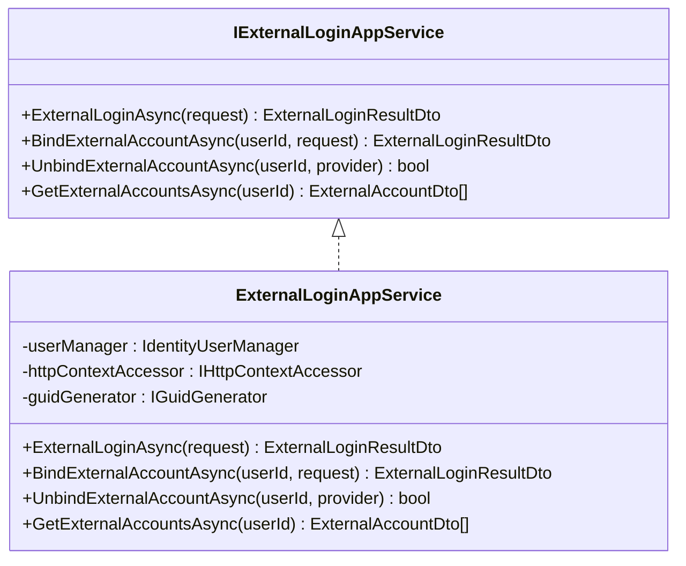
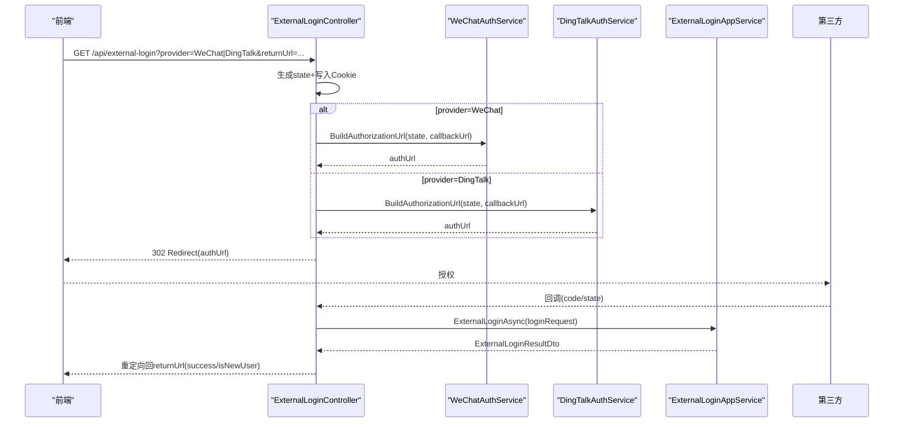
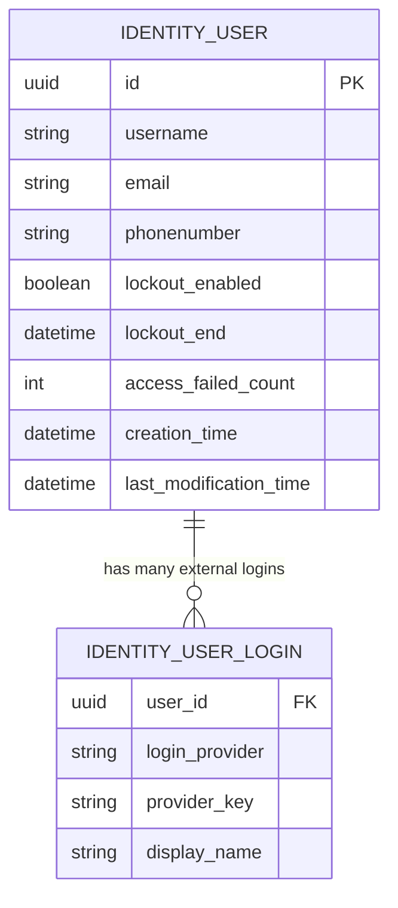
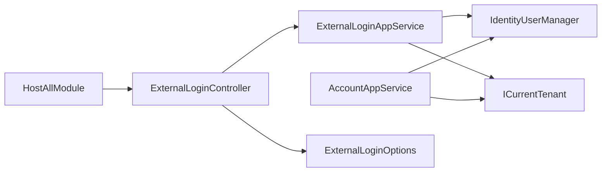

# 账户管理服务

<cite>
**本文引用的文件**   
- [AccountAppService.cs](file://src/Services/Account/H.Account.Application/Services/AccountAppService.cs)
- [IAccountAppService.cs](file://src/Services/Account/H.Account.Application.Contracts/Services/IAccountAppService.cs)
- [ExternalLoginAppService.cs](file://src/Services/Account/H.Account.Application/ExternalLogin/ExternalLoginAppService.cs)
- [IExternalLoginAppService.cs](file://src/Services/Account/H.Account.Application.Contracts/Services/IExternalLoginAppService.cs)
- [ExternalLoginController.cs](file://src/Services/Account/H.Account.Application/ExternalLogin/ExternalLoginController.cs)
- [DingTalkAuthService.cs](file://src/Services/Account/H.Account.Application/ExternalLogin/DingTalkAuthService.cs)
- [ExternalLoginOptions.cs](file://src/Services/Account/H.Account.Application/ExternalLogin/ExternalLoginOptions.cs)
- [ExternalLoginDtos.cs](file://src/Services/Account/H.Account.Application.Contracts/Dtos/ExternalLoginDtos.cs)
- [AccountDbContext.cs](file://src/Services/Account/H.Account.EntityFrameworkCore/AccountDbContext.cs)
- [HostAllModule.cs](file://src/Host/H.AppLab.Host.All/H.AppLab.Host.All/HostAllModule.cs)
- [README.md](file://src/Services/Account/README.md)
</cite>

## 目录
1. [简介](#简介)
2. [项目结构](#项目结构)
3. [核心组件](#核心组件)
4. [架构总览](#架构总览)
5. [详细组件分析](#详细组件分析)
6. [依赖关系分析](#依赖关系分析)
7. [性能考虑](#性能考虑)
8. [故障排查指南](#故障排查指南)
9. [结论](#结论)
10. [附录：API 接口文档](#附录api-接口文档)

## 简介
本文件为 AppLab 账户管理服务的完整技术文档，覆盖用户认证、授权、角色权限、外部登录集成（微信、钉钉等）、JWT 令牌机制、会话管理、以及完整的 API 接口说明。该服务基于 ABP 框架与 ASP.NET Core，采用 Cookie 认证为主、JWT 校验为辅的混合模式，提供跨租户的用户管理能力与第三方账号绑定能力。

## 项目结构
账户管理服务位于 src/Services/Account，按 ABP 分层组织：
- Application：应用服务与业务编排（注册、登录、外部登录）
- Application.Contracts：DTO、接口定义
- EntityFrameworkCore：数据上下文与实体映射
- Web：页面与路由（Blazor）
- Host：宿主模块配置（认证、多租户、外部登录选项注入）

图表来源
- [HostAllModule.cs:78-117](file://src/Host/H.AppLab.Host.All/H.AppLab.Host.All/HostAllModule.cs#L78-L117)
- [AccountDbContext.cs:1-28](file://src/Services/Account/H.Account.EntityFrameworkCore/AccountDbContext.cs#L1-L28)
- [AccountAppService.cs:1-356](file://src/Services/Account/H.Account.Application/Services/AccountAppService.cs#L1-L356)
- [ExternalLoginController.cs:1-203](file://src/Services/Account/H.Account.Application/ExternalLogin/ExternalLoginController.cs#L1-L203)

章节来源
- [README.md:1-48](file://src/Services/Account/README.md#L1-L48)

## 核心组件
- 账户应用服务：实现用户注册、登录、令牌验证、登出、获取当前用户等核心流程
- 外部登录应用服务：处理第三方登录回调、自动注册/绑定、解绑与查询已绑定账号
- 外部登录控制器：统一入口，负责跳转与回调处理，对接微信/钉钉 OAuth2
- 数据上下文：基于 ABP Identity 的 EF Core 上下文，管理用户与外部登录关联
- 宿主模块：集中配置 Cookie 认证、多租户、外部登录选项与服务注册

章节来源
- [IAccountAppService.cs:1-18](file://src/Services/Account/H.Account.Application.Contracts/Services/IAccountAppService.cs#L1-L18)
- [ExternalLoginAppService.cs:1-163](file://src/Services/Account/H.Account.Application/ExternalLogin/ExternalLoginAppService.cs#L1-L163)
- [ExternalLoginController.cs:1-203](file://src/Services/Account/H.Account.Application/ExternalLogin/ExternalLoginController.cs#L1-L203)
- [AccountDbContext.cs:1-28](file://src/Services/Account/H.Account.EntityFrameworkCore/AccountDbContext.cs#L1-L28)
- [HostAllModule.cs:78-117](file://src/Host/H.AppLab.Host.All/H.AppLab.Host.All/HostAllModule.cs#L78-L117)

## 架构总览
系统采用“Cookie 认证 + JWT 校验”的双通道设计：
- 登录成功后写入 Cookie，后续请求通过 Cookie 身份标识访问受保护资源
- 对外部调用或无状态场景提供 JWT 生成与校验能力
- 第三方登录通过 Controller 统一入口，回调后由应用服务完成用户查找/创建/绑定并写回 Cookie

图表来源
- [ExternalLoginController.cs:1-203](file://src/Services/Account/H.Account.Application/ExternalLogin/ExternalLoginController.cs#L1-L203)
- [ExternalLoginAppService.cs:1-163](file://src/Services/Account/H.Account.Application/ExternalLogin/ExternalLoginAppService.cs#L1-L163)
- [AccountDbContext.cs:1-28](file://src/Services/Account/H.Account.EntityFrameworkCore/AccountDbContext.cs#L1-L28)
- [HostAllModule.cs:78-117](file://src/Host/H.AppLab.Host.All/H.AppLab.Host.All/HostAllModule.cs#L78-L117)

## 详细组件分析

### 账户应用服务（注册、登录、JWT、会话）
- 注册：支持用户名/邮箱/手机号三种方式，密码策略由 Identity 管理；重复性检查与错误聚合返回
- 登录：自动识别输入类型（邮箱/手机号/用户名），失败计数与锁定控制，更新最后登录时间，写入 Cookie 会话
- 令牌验证：使用 SymmetricSecurityKey 与 Issuer/Audience/Lifetime 校验 JWT
- 登出：清除 Cookie 会话
- 当前用户：从 Claims 解析 UserId，切换 Host 上下文避免租户过滤导致找不到用户

图表来源
- [AccountAppService.cs:114-210](file://src/Services/Account/H.Account.Application/Services/AccountAppService.cs#L114-L210)
- [AccountAppService.cs:222-247](file://src/Services/Account/H.Account.Application/Services/AccountAppService.cs#L222-L247)
- [AccountAppService.cs:249-279](file://src/Services/Account/H.Account.Application/Services/AccountAppService.cs#L249-L279)

章节来源
- [AccountAppService.cs:43-112](file://src/Services/Account/H.Account.Application/Services/AccountAppService.cs#L43-L112)
- [AccountAppService.cs:114-210](file://src/Services/Account/H.Account.Application/Services/AccountAppService.cs#L114-L210)
- [AccountAppService.cs:222-247](file://src/Services/Account/H.Account.Application/Services/AccountAppService.cs#L222-L247)
- [AccountAppService.cs:249-279](file://src/Services/Account/H.Account.Application/Services/AccountAppService.cs#L249-L279)
- [IAccountAppService.cs:1-18](file://src/Services/Account/H.Account.Application.Contracts/Services/IAccountAppService.cs#L1-L18)

### 外部登录应用服务（微信/钉钉）
- 外部登录：根据 Provider/ProviderKey 查找用户，未绑定则自动创建新用户并随机密码，绑定成功后写回 Cookie
- 绑定账号：将第三方账号绑定到已登录用户，防止重复绑定与冲突
- 解绑账号：移除指定 Provider 的外部登录关联
- 查询已绑定：返回用户已绑定的第三方账号列表

图表来源
- [IExternalLoginAppService.cs:1-30](file://src/Services/Account/H.Account.Application.Contracts/Services/IExternalLoginAppService.cs#L1-L30)
- [ExternalLoginAppService.cs:1-163](file://src/Services/Account/H.Account.Application/ExternalLogin/ExternalLoginAppService.cs#L1-L163)

章节来源
- [ExternalLoginAppService.cs:34-132](file://src/Services/Account/H.Account.Application/ExternalLogin/ExternalLoginAppService.cs#L34-L132)
- [ExternalLoginAppService.cs:134-163](file://src/Services/Account/H.Account.Application/ExternalLogin/ExternalLoginAppService.cs#L134-L163)
- [ExternalLoginDtos.cs:1-50](file://src/Services/Account/H.Account.Application.Contracts/Dtos/ExternalLoginDtos.cs#L1-L50)

### 外部登录控制器（统一入口）
- 发起跳转：生成 state 并写入临时 Cookie，构建第三方授权 URL 并 302 跳转
- 回调处理：校验 state，换取用户信息，调用应用服务完成登录/绑定，重定向回前端

图表来源
- [ExternalLoginController.cs:1-203](file://src/Services/Account/H.Account.Application/ExternalLogin/ExternalLoginController.cs#L1-L203)
- [DingTalkAuthService.cs:1-43](file://src/Services/Account/H.Account.Application/ExternalLogin/DingTalkAuthService.cs#L1-L43)

章节来源
- [ExternalLoginController.cs:37-82](file://src/Services/Account/H.Account.Application/ExternalLogin/ExternalLoginController.cs#L37-L82)
- [ExternalLoginController.cs:91-192](file://src/Services/Account/H.Account.Application/ExternalLogin/ExternalLoginController.cs#L91-L192)

### 数据模型与上下文
- AccountDbContext：继承 AbpDbContext，启用 Identity 实体 Users/UserLogins，并通过 ConfigureIdentity 配置
- 用户实体：基于 Volo.Abp.Identity.IdentityUser，包含用户名、邮箱、手机号、密码、锁定、审计字段等
- 外部登录：通过 IdentityUserLogin 关联第三方 Provider 与 ProviderKey

图表来源
- [AccountDbContext.cs:1-28](file://src/Services/Account/H.Account.EntityFrameworkCore/AccountDbContext.cs#L1-L28)

章节来源
- [AccountDbContext.cs:1-28](file://src/Services/Account/H.Account.EntityFrameworkCore/AccountDbContext.cs#L1-L28)

### 宿主配置与认证
- 认证：默认使用 CookieAuthenticationDefaults.AuthenticationScheme，关闭 CSRF 自动验证（WASM 场景）
- 多租户：启用多租户，Account 作为全局跨租户数据，需在 Host 上下文操作
- 外部登录：绑定 ExternalLoginOptions，注册 WeChatAuthService 与 DingTalkAuthService

章节来源
- [HostAllModule.cs:78-117](file://src/Host/H.AppLab.Host.All/H.AppLab.Host.All/HostAllModule.cs#L78-L117)
- [HostAllModule.cs:139-169](file://src/Host/H.AppLab.Host.All/H.AppLab.Host.All/HostAllModule.cs#L139-L169)

## 依赖关系分析
- AccountAppService 依赖 IdentityUserManager、IHttpContextAccessor、IConfiguration、IGuidGenerator、ICurrentTenant
- ExternalLoginAppService 依赖 IdentityUserManager、IHttpContextAccessor、IGuidGenerator
- ExternalLoginController 依赖 IExternalLoginAppService、WeChatAuthService、DingTalkAuthService、ExternalLoginOptions
- HostAllModule 负责装配上述服务与配置

图表来源
- [HostAllModule.cs:78-117](file://src/Host/H.AppLab.Host.All/H.AppLab.Host.All/HostAllModule.cs#L78-L117)
- [ExternalLoginController.cs:1-203](file://src/Services/Account/H.Account.Application/ExternalLogin/ExternalLoginController.cs#L1-L203)
- [ExternalLoginAppService.cs:1-163](file://src/Services/Account/H.Account.Application/ExternalLogin/ExternalLoginAppService.cs#L1-L163)
- [AccountAppService.cs:1-356](file://src/Services/Account/H.Account.Application/Services/AccountAppService.cs#L1-L356)

章节来源
- [HostAllModule.cs:78-117](file://src/Host/H.AppLab.Host.All/H.AppLab.Host.All/HostAllModule.cs#L78-L117)
- [ExternalLoginController.cs:1-203](file://src/Services/Account/H.Account.Application/ExternalLogin/ExternalLoginController.cs#L1-L203)
- [ExternalLoginAppService.cs:1-163](file://src/Services/Account/H.Account.Application/ExternalLogin/ExternalLoginAppService.cs#L1-L163)
- [AccountAppService.cs:1-356](file://src/Services/Account/H.Account.Application/Services/AccountAppService.cs#L1-L356)

## 性能考虑
- 登录查找使用 Host 上下文避免租户过滤开销，减少不必要的查询条件
- 外部登录自动创建用户时仅必要字段填充，降低数据库写入压力
- Cookie 会话持久化策略可根据 RememberMe 调整过期时间，平衡安全与体验
- JWT 校验使用对称密钥与严格参数（ClockSkew=0），提升校验效率与安全性

[本节为通用指导，不直接分析具体文件]

## 故障排查指南
- 登录失败
  - 检查输入类型识别是否正确（邮箱/手机号/用户名）
  - 确认用户状态 IsActive 与密码策略
  - 查看 AccessFailedCount 与 LockoutEnd 是否触发锁定
- 外部登录回调失败
  - 校验 state Cookie 是否存在且有效
  - 确认第三方回调参数（code/authCode）是否完整
  - 检查 ExternalLoginOptions 中 Enabled/ClientId/ClientSecret/CallbackPath 配置
- 令牌验证失败
  - 核对 Jwt:SecretKey、Issuer、Audience、ExpirationMinutes 配置一致性
  - 确保服务端与客户端时间同步（ClockSkew=0）

章节来源
- [AccountAppService.cs:114-210](file://src/Services/Account/H.Account.Application/Services/AccountAppService.cs#L114-L210)
- [ExternalLoginController.cs:91-192](file://src/Services/Account/H.Account.Application/ExternalLogin/ExternalLoginController.cs#L91-L192)
- [ExternalLoginOptions.cs:1-21](file://src/Services/Account/H.Account.Application/ExternalLogin/ExternalLoginOptions.cs#L1-L21)

## 结论
账户管理服务以 ABP Identity 为核心，结合 Cookie 会话与 JWT 校验，提供稳定可靠的认证与授权能力。外部登录通过统一控制器与应用服务解耦实现，支持微信、钉钉等常见平台。整体架构清晰、扩展性强，适合在多租户环境下快速接入与定制。

[本节为总结，不直接分析具体文件]

## 附录：API 接口文档

### 认证相关
- POST /api/account/register
  - 功能：用户注册（支持用户名/邮箱/手机号）
  - 请求体：RegisterRequestDto（含 RegisterType、Password、ConfirmPassword 等）
  - 响应：AuthResponseDto（Success、Message、User）
- POST /api/account/login
  - 功能：用户登录（自动识别邮箱/手机号/用户名）
  - 请求体：LoginRequestDto（Account、Password、RememberMe）
  - 响应：AuthResponseDto（Success、Message、User）
- GET /api/account/validate
  - 功能：验证 JWT 令牌有效性
  - 参数：token（Query/Header）
  - 响应：bool（true/false）
- POST /api/account/logout
  - 功能：登出（清除 Cookie 会话）
  - 响应：空
- GET /api/account/current-user
  - 功能：获取当前登录用户信息
  - 响应：UserDto 或 null

章节来源
- [IAccountAppService.cs:1-18](file://src/Services/Account/H.Account.Application.Contracts/Services/IAccountAppService.cs#L1-L18)
- [AccountAppService.cs:43-112](file://src/Services/Account/H.Account.Application/Services/AccountAppService.cs#L43-L112)
- [AccountAppService.cs:114-210](file://src/Services/Account/H.Account.Application/Services/AccountAppService.cs#L114-L210)
- [AccountAppService.cs:222-247](file://src/Services/Account/H.Account.Application/Services/AccountAppService.cs#L222-L247)
- [AccountAppService.cs:249-279](file://src/Services/Account/H.Account.Application/Services/AccountAppService.cs#L249-L279)

### 外部登录相关
- GET /api/external-login
  - 功能：发起第三方登录跳转（WeChat/DingTalk）
  - 参数：provider、returnUrl
  - 行为：生成 state+写入临时 Cookie，302 跳转至第三方授权页
- GET /api/external-login/callback
  - 功能：处理第三方登录回调
  - 参数：code/authCode、state
  - 行为：校验 state、换取用户信息、调用应用服务完成登录/绑定、重定向回 returnUrl

章节来源
- [ExternalLoginController.cs:37-82](file://src/Services/Account/H.Account.Application/ExternalLogin/ExternalLoginController.cs#L37-L82)
- [ExternalLoginController.cs:91-192](file://src/Services/Account/H.Account.Application/ExternalLogin/ExternalLoginController.cs#L91-L192)
- [ExternalLoginDtos.cs:1-50](file://src/Services/Account/H.Account.Application.Contracts/Dtos/ExternalLoginDtos.cs#L1-L50)

### 用户管理（CRUD）
- 用户列表：分页、搜索、筛选（用户名、邮箱、手机号、第三方账号、用户类型、状态、最后登录）
- 创建用户：支持多种注册类型
- 编辑用户：基本信息与状态管理
- 删除用户：逻辑删除或物理删除（依策略）
- 禁用/启用用户：IsActive 控制
- 重置密码：管理员重置或用户自助重置（需遵循密码策略）
- 用户类型管理：普通用户、管理员、超级管理员（可通过角色或自定义字段实现）

章节来源
- [README.md:17-48](file://src/Services/Account/README.md#L17-L48)

### 安全配置指南
- JWT 配置项
  - Jwt:SecretKey：签名密钥（长度建议≥32字节）
  - Jwt:Issuer：签发者
  - Jwt:Audience：受众
  - Jwt:ExpirationMinutes：令牌有效期（分钟）
- Cookie 认证
  - Scheme：CookieAuthenticationDefaults.AuthenticationScheme
  - SameSite：建议设置为 Strict 或 Lax
  - HttpOnly/Secure：生产环境开启
- 外部登录配置
  - ExternalLogin:Enabled：各提供者开关
  - ExternalLogin:ClientId/ClientSecret/CallbackPath：对应第三方应用配置

章节来源
- [AccountAppService.cs:281-309](file://src/Services/Account/H.Account.Application/Services/AccountAppService.cs#L281-L309)
- [HostAllModule.cs:78-117](file://src/Host/H.AppLab.Host.All/H.AppLab.Host.All/HostAllModule.cs#L78-L117)
- [ExternalLoginOptions.cs:1-21](file://src/Services/Account/H.Account.Application/ExternalLogin/ExternalLoginOptions.cs#L1-L21)