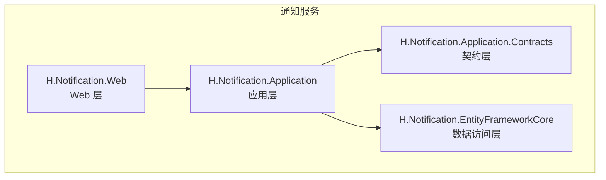
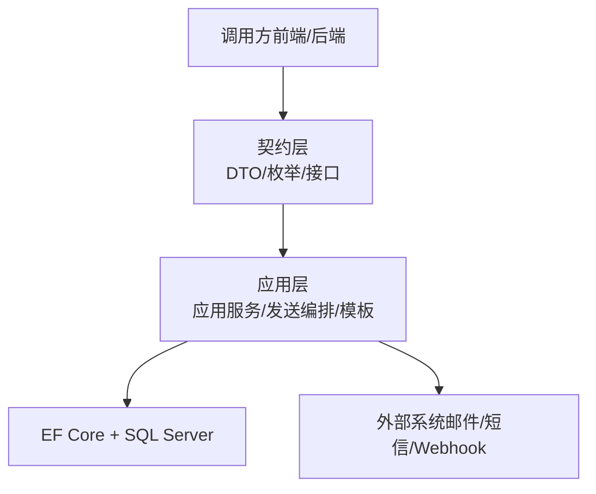
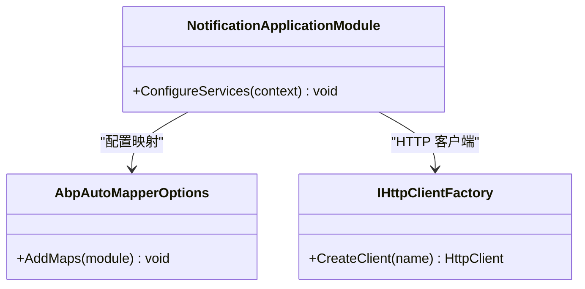
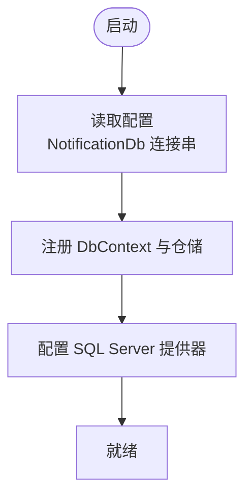
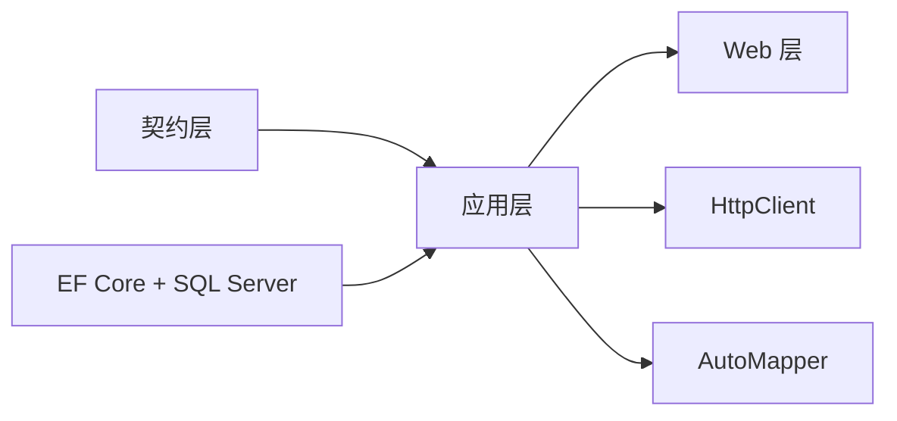
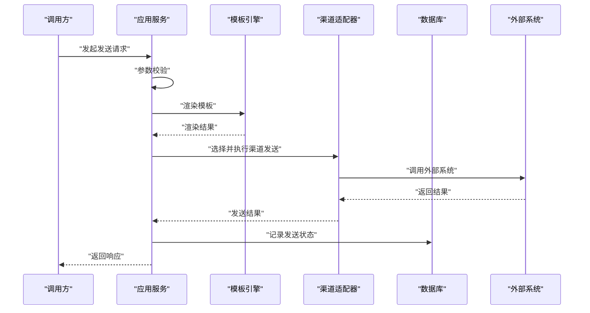

# 通知服务

<cite>
**本文引用的文件**   
- [NotificationApplicationModule.cs](file://src/Services/Notification/H.Notification.Application/NotificationApplicationModule.cs)
- [NotificationApplicationContractsModule.cs](file://src/Services/Notification/H.Notification.Application.Contracts/NotificationApplicationContractsModule.cs)
- [NotificationEntityFrameworkCoreModule.cs](file://src/Services/Notification/H.Notification.EntityFrameworkCore/NotificationEntityFrameworkCoreModule.cs)
- [NotificationWebModule.cs](file://src/Services/Notification/H.Notification.Web/NotificationWebModule.cs)
</cite>

## 目录
1. [简介](#简介)
2. [项目结构](#项目结构)
3. [核心组件](#核心组件)
4. [架构总览](#架构总览)
5. [详细组件分析](#详细组件分析)
6. [依赖关系分析](#依赖关系分析)
7. [性能考虑](#性能考虑)
8. [故障排查指南](#故障排查指南)
9. [结论](#结论)
10. [附录](#附录)

## 简介
本文件为 AppLab 通知服务的完整技术文档，围绕多渠道通知（邮件、短信、站内信、Webhook）、模板管理、发送策略、渠道抽象、消息队列集成、发送状态跟踪、通知分类与级别、阈值告警机制、API 接口与模板配置指南、扩展开发与性能优化等方面进行全面说明。该服务基于 ABP 模块化架构，采用 EF Core 进行数据持久化，并通过 HttpClient 支持 Webhook 等外部系统调用。

## 项目结构
通知服务由多个 ABP 模块组成，职责清晰、分层明确：
- Application 层：应用服务、映射、发送编排、模板管理等业务编排能力
- Application.Contracts 层：DTO、枚举、服务契约定义
- EntityFrameworkCore 层：数据库上下文、实体、仓储注册与连接配置
- Web 层：Web 模块标记（页面、控制器等可在此扩展）

图表来源 
- [NotificationApplicationModule.cs](file://src/Services/Notification/H.Notification.Application/NotificationApplicationModule.cs)
- [NotificationApplicationContractsModule.cs](file://src/Services/Notification/H.Notification.Application.Contracts/NotificationApplicationContractsModule.cs)
- [NotificationEntityFrameworkCoreModule.cs](file://src/Services/Notification/H.Notification.EntityFrameworkCore/NotificationEntityFrameworkCoreModule.cs)
- [NotificationWebModule.cs](file://src/Services/Notification/H.Notification.Web/NotificationWebModule.cs)

章节来源
- [NotificationApplicationModule.cs:1-28](file://src/Services/Notification/H.Notification.Application/NotificationApplicationModule.cs#L1-L28)
- [NotificationApplicationContractsModule.cs:1-10](file://src/Services/Notification/H.Notification.Application.Contracts/NotificationApplicationContractsModule.cs#L1-L10)
- [NotificationEntityFrameworkCoreModule.cs:1-33](file://src/Services/Notification/H.Notification.EntityFrameworkCore/NotificationEntityFrameworkCoreModule.cs#L1-L33)
- [NotificationWebModule.cs:1-9](file://src/Services/Notification/H.Notification.Web/NotificationWebModule.cs#L1-L9)

## 核心组件
- 应用模块（NotificationApplicationModule）
  - 注册 HttpContextAccessor 以获取当前请求上下文
  - 注册 HttpClient 用于 Webhook 等外部 HTTP 调用
  - 配置 AutoMapper 映射，便于 DTO 与实体之间的转换
- 契约模块（NotificationApplicationContractsModule）
  - 提供程序集定位标记，便于 ABP 模块发现与引用
- 数据访问模块（NotificationEntityFrameworkCoreModule）
  - 注册 NotificationDbContext 并启用默认仓储
  - 使用 SQL Server 作为数据库提供者
  - 从配置读取连接字符串“NotificationDb”
- Web 模块（NotificationWebModule）
  - Web 层模块标记，便于在宿主中聚合加载

章节来源
- [NotificationApplicationModule.cs:15-26](file://src/Services/Notification/H.Notification.Application/NotificationApplicationModule.cs#L15-L26)
- [NotificationApplicationContractsModule.cs:6-9](file://src/Services/Notification/H.Notification.Application.Contracts/NotificationApplicationContractsModule.cs#L6-L9)
- [NotificationEntityFrameworkCoreModule.cs:12-31](file://src/Services/Notification/H.Notification.EntityFrameworkCore/NotificationEntityFrameworkCoreModule.cs#L12-L31)
- [NotificationWebModule.cs:6-8](file://src/Services/Notification/H.Notification.Web/NotificationWebModule.cs#L6-L8)

## 架构总览
通知服务整体遵循 ABP 分层架构：
- 契约层定义对外 API、DTO、枚举与服务接口
- 应用层实现业务流程编排（发送策略、模板渲染、渠道分发、状态记录）
- 数据访问层通过 EF Core 与 SQL Server 交互，提供仓储能力
- Web 层暴露控制器或页面，供前端或内部系统集成

图表来源 
- [NotificationApplicationModule.cs:15-26](file://src/Services/Notification/H.Notification.Application/NotificationApplicationModule.cs#L15-L26)
- [NotificationEntityFrameworkCoreModule.cs:17-30](file://src/Services/Notification/H.Notification.EntityFrameworkCore/NotificationEntityFrameworkCoreModule.cs#L17-L30)

## 详细组件分析

### 应用模块（NotificationApplicationModule）
- 功能要点
  - 注入 HttpContextAccessor 以便在服务中获取当前用户、租户等信息
  - 注入 HttpClient 用于 Webhook 等外部 HTTP 调用
  - 配置 AutoMapper，集中管理 DTO 与实体的映射规则
- 设计模式
  - 依赖注入：通过 ABP 的模块体系统一注册服务
  - 映射抽象：通过 AutoMapper 解耦对象转换逻辑
- 可扩展点
  - 新增渠道时，可在应用层注入新的客户端或服务（如邮件、短信 SDK）
  - 自定义映射规则可通过 AddMaps 扩展

图表来源 
- [NotificationApplicationModule.cs:15-26](file://src/Services/Notification/H.Notification.Application/NotificationApplicationModule.cs#L15-L26)

章节来源
- [NotificationApplicationModule.cs:15-26](file://src/Services/Notification/H.Notification.Application/NotificationApplicationModule.cs#L15-L26)

### 数据访问模块（NotificationEntityFrameworkCoreModule）
- 功能要点
  - 注册 DbContext 与默认仓储，简化 CRUD 操作
  - 配置 SQL Server 提供器与连接字符串
  - 通过 ABP 的配置系统读取“NotificationDb”连接串
- 数据流
  - 应用服务通过仓储访问数据库，完成通知记录、模板、渠道配置等数据的读写
- 可扩展点
  - 更换数据库只需修改 UseSqlServer 为其他提供器（如 MySQL、PostgreSQL）
  - 新增实体需注册到 DbContext 并生成迁移

图表来源 
- [NotificationEntityFrameworkCoreModule.cs:12-31](file://src/Services/Notification/H.Notification.EntityFrameworkCore/NotificationEntityFrameworkCoreModule.cs#L12-L31)

章节来源
- [NotificationEntityFrameworkCoreModule.cs:12-31](file://src/Services/Notification/H.Notification.EntityFrameworkCore/NotificationEntityFrameworkCoreModule.cs#L12-L31)

### 契约模块（NotificationApplicationContractsModule）
- 作用
  - 提供程序集定位标记，便于 ABP 模块扫描与引用
- 使用场景
  - 在其他模块或宿主中通过 Assembly 引用契约层，避免循环依赖

章节来源
- [NotificationApplicationContractsModule.cs:6-9](file://src/Services/Notification/H.Notification.Application.Contracts/NotificationApplicationContractsModule.cs#L6-L9)

### Web 模块（NotificationWebModule）
- 作用
  - Web 层模块标记，便于在宿主中聚合加载通知服务的 Web 功能
- 扩展建议
  - 新增控制器、页面或中间件可在该模块所在项目中添加

章节来源
- [NotificationWebModule.cs:6-8](file://src/Services/Notification/H.Notification.Web/NotificationWebModule.cs#L6-L8)

## 依赖关系分析
- 模块间依赖
  - Application 依赖 Contracts 与 EntityFrameworkCore
  - Web 依赖 Application
- 外部依赖
  - EF Core 与 SQL Server
  - HttpClient 用于 Webhook 等外部系统调用
  - AutoMapper 用于对象映射

图表来源 
- [NotificationApplicationModule.cs:15-26](file://src/Services/Notification/H.Notification.Application/NotificationApplicationModule.cs#L15-L26)
- [NotificationEntityFrameworkCoreModule.cs:17-30](file://src/Services/Notification/H.Notification.EntityFrameworkCore/NotificationEntityFrameworkCoreModule.cs#L17-L30)

章节来源
- [NotificationApplicationModule.cs:15-26](file://src/Services/Notification/H.Notification.Application/NotificationApplicationModule.cs#L15-L26)
- [NotificationEntityFrameworkCoreModule.cs:17-30](file://src/Services/Notification/H.Notification.EntityFrameworkCore/NotificationEntityFrameworkCoreModule.cs#L17-L30)

## 性能考虑
- 连接池与并发
  - 合理配置 SQL Server 连接池大小，避免连接耗尽
  - 对高并发发送场景，建议使用消息队列（如 RabbitMQ、Kafka）异步处理
- HTTP 客户端
  - 复用 HttpClient 实例，避免频繁创建销毁带来的端口耗尽问题
  - 设置合理的超时与重试策略
- 模板渲染
  - 缓存常用模板，减少重复解析开销
- 数据库访问
  - 批量写入通知记录，减少往返次数
  - 对查询热点字段建立索引（如接收人、渠道、时间范围）

[本节为通用指导，不直接分析具体文件]

## 故障排查指南
- 数据库连接失败
  - 检查“NotificationDb”连接串是否正确
  - 确认 SQL Server 服务可用且网络可达
- Webhook 调用失败
  - 检查目标地址、认证信息、超时配置
  - 查看异常日志与重试策略是否生效
- 模板渲染错误
  - 校验模板语法与变量占位符
  - 检查映射配置是否正确
- 发送状态不一致
  - 核对事务边界与状态更新顺序
  - 检查重试与补偿逻辑

章节来源
- [NotificationEntityFrameworkCoreModule.cs:12-31](file://src/Services/Notification/H.Notification.EntityFrameworkCore/NotificationEntityFrameworkCoreModule.cs#L12-L31)
- [NotificationApplicationModule.cs:15-26](file://src/Services/Notification/H.Notification.Application/NotificationApplicationModule.cs#L15-L26)

## 结论
通知服务基于 ABP 模块化架构，具备清晰的层次划分与良好的扩展性。通过 EF Core 与 SQL Server 实现数据持久化，借助 HttpClient 支持 Webhook 等外部系统调用，结合 AutoMapper 提升对象转换效率。建议在后续迭代中引入消息队列以实现异步发送与削峰填谷，完善模板缓存与重试补偿机制，进一步提升稳定性与性能。

[本节为总结性内容，不直接分析具体文件]

## 附录

### 通知渠道抽象与发送流程（概念性）
- 渠道抽象
  - 定义统一的发送接口，屏蔽邮件、短信、站内信、Webhook 的差异
- 发送流程
  - 接收发送请求 -> 参数校验 -> 模板渲染 -> 渠道选择 -> 执行发送 -> 记录状态 -> 返回结果

[此图为概念性流程图，不直接映射具体代码文件]

### API 接口文档（示例）
- 发送通知
  - 方法：POST /api/notification/send
  - 请求体：包含接收人、渠道、模板标识、变量数据等
  - 响应：发送任务 ID、状态码、错误信息
- 查询发送记录
  - 方法：GET /api/notification/records
  - 查询参数：接收人、渠道、时间范围、状态
  - 响应：分页结果列表
- 模板管理
  - 方法：POST /api/notification/templates
  - 请求体：模板标识、内容、变量定义
  - 响应：模板 ID、版本、状态

[本节为接口示例，不直接分析具体文件]

### 模板配置指南（示例）
- 模板标识：唯一键，用于区分不同模板
- 模板内容：支持占位符与条件分支
- 变量定义：声明变量名、类型、默认值
- 版本控制：支持多版本并存与灰度发布

[本节为配置示例，不直接分析具体文件]

### 通知分类与级别（示例）
- 分类：系统通知、业务通知、营销通知
- 级别：提示、警告、严重、致命
- 阈值告警：基于指标阈值触发通知（如 CPU > 90%）

[本节为概念性说明，不直接分析具体文件]

### 扩展开发建议
- 新增渠道
  - 实现统一发送接口
  - 在应用层注册新渠道适配器
- 新增模板引擎
  - 替换或扩展模板渲染逻辑
  - 保持与现有 DTO 的兼容性
- 监控与审计
  - 增加发送成功率、延迟、失败原因统计
  - 记录关键操作的审计日志

[本节为扩展建议，不直接分析具体文件]