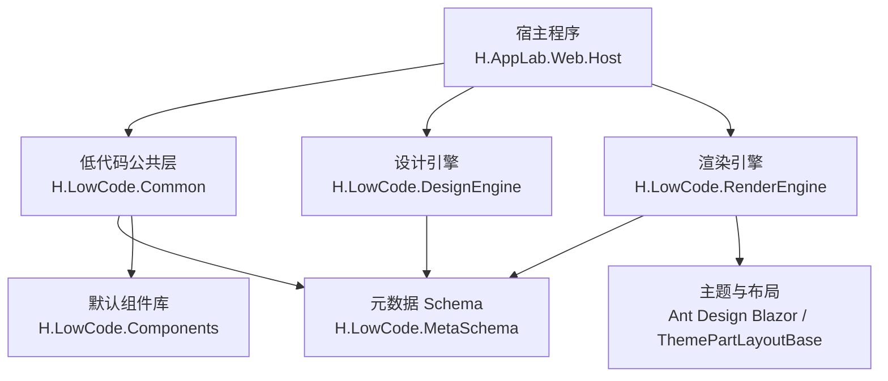
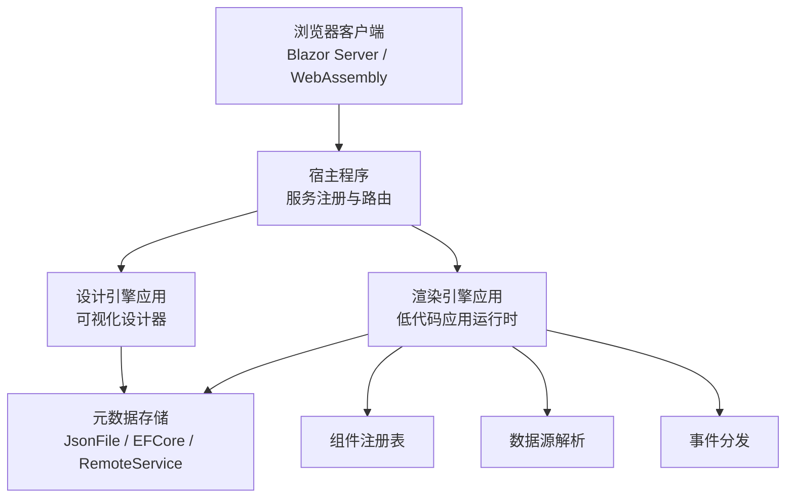
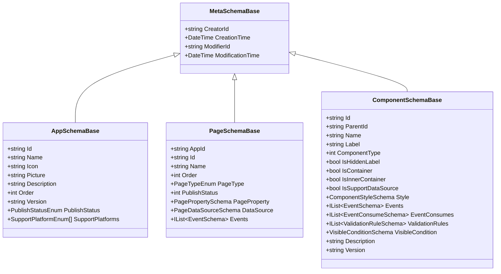
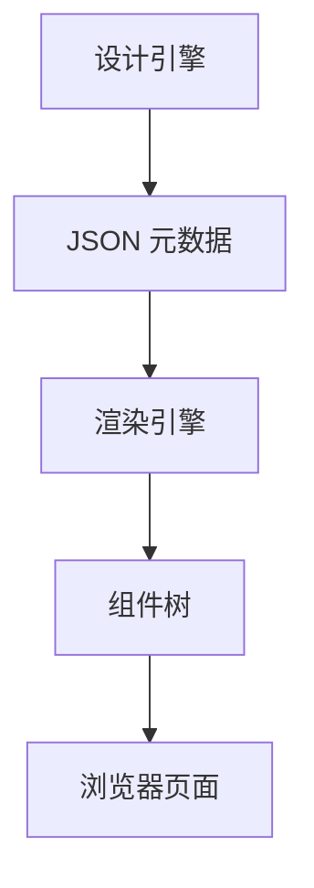
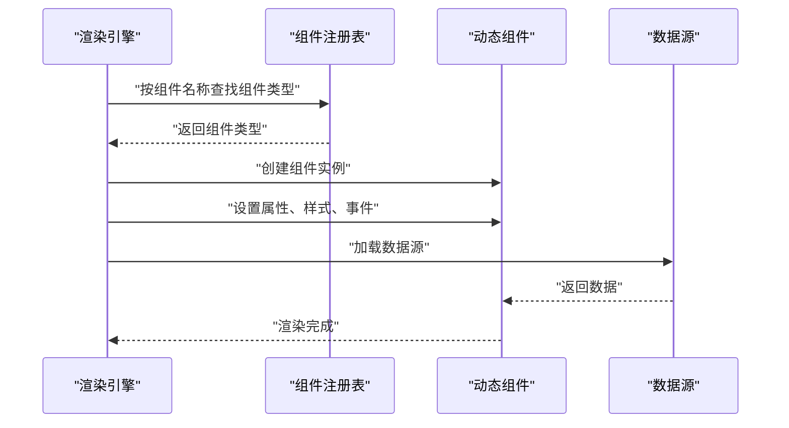
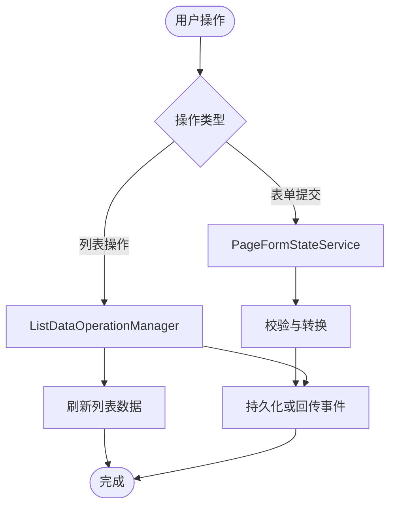
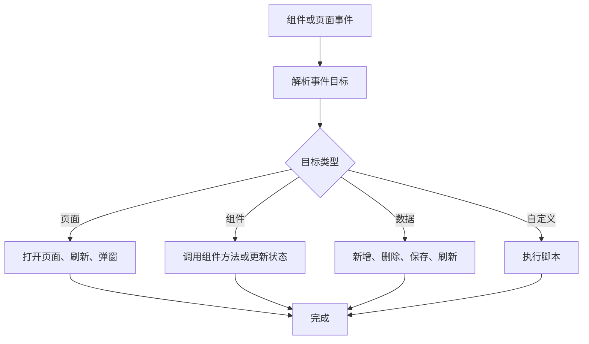
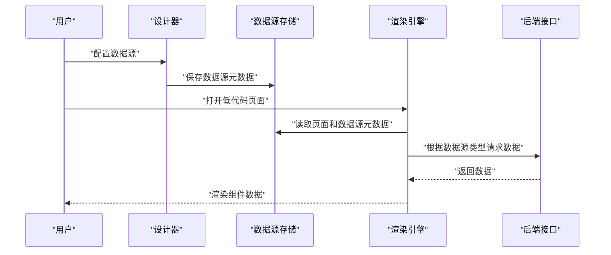
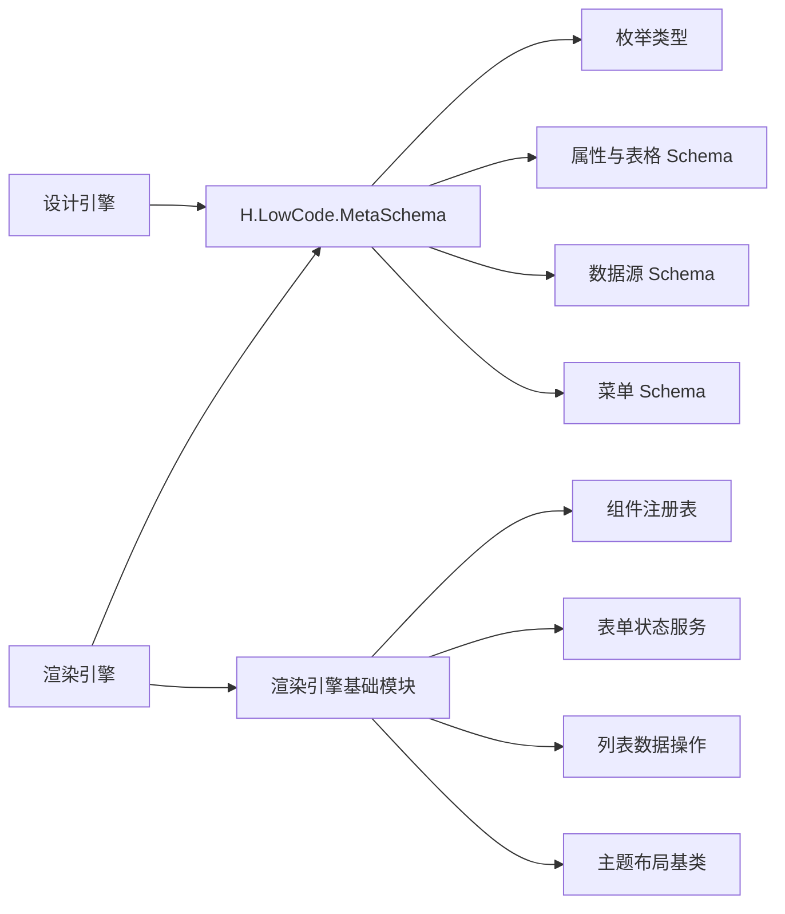
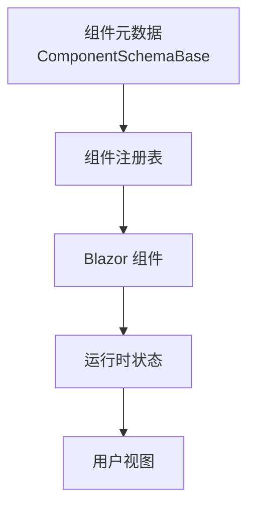

# 低代码平台

<cite>
**本文引用的文件**   
- [README.md](file://README.md)
- [MetaSchemaBase.cs](file://src/LowCode/Common/H.LowCode.MetaSchema/MetaSchemaBase.cs)
- [AppSchemaBase.cs](file://src/LowCode/Common/H.LowCode.MetaSchema/AppSchemaBase.cs)
- [PageSchemaBase.cs](file://src/LowCode/Common/H.LowCode.MetaSchema/PageSchemaBase.cs)
- [ComponentSchemaBase.cs](file://src/LowCode/Common/H.LowCode.MetaSchema/ComponentSchemaBase.cs)
- [DataSourceSchema.cs](file://src/LowCode/Common/H.LowCode.MetaSchema/DataSourceSchema.cs)
- [MenuSchema.cs](file://src/LowCode/Common/H.LowCode.MetaSchema/MenuSchema.cs)
- [PagePropertySchema.cs](file://src/LowCode/Common/H.LowCode.MetaSchema/PropertySchemas/PagePropertySchema.cs)
- [EventSchema.cs](file://src/LowCode/Common/H.LowCode.MetaSchema/PropertySchemas/EventSchema.cs)
- [PageTypeEnum.cs](file://src/LowCode/Common/H.LowCode.MetaSchema/Enums/PageTypeEnum.cs)
- [PublishStatusEnum.cs](file://src/LowCode/Common/H.LowCode.MetaSchema/Enums/PublishStatusEnum.cs)
- [ComponentValueTypeEnum.cs](file://src/LowCode/Common/H.LowCode.MetaSchema/Enums/ComponentValueTypeEnum.cs)
- [ComponentDataSourceTypeEnum.cs](file://src/LowCode/Common/H.LowCode.MetaSchema/Enums/ComponentDataSourceTypeEnum.cs)
- [EventTargetTypeEnum.cs](file://src/LowCode/Common/H.LowCode.MetaSchema/Enums/EventTargetTypeEnum.cs)
- [EventDataActionTypeEnum.cs](file://src/LowCode/Common/H.LowCode.MetaSchema/Enums/EventDataActionTypeEnum.cs)
- [PageDataSourceSchema.cs](file://src/LowCode/Common/H.LowCode.MetaSchema/DataSourceSchemas/PageDataSourceSchema.cs)
- [TableColumnSchema.cs](file://src/LowCode/Common/H.LowCode.MetaSchema/PropertySchemas/TableSchemas/TableColumnSchema.cs)
- [TablePropertySchema.cs](file://src/LowCode/Common/H.LowCode.MetaSchema/PropertySchemas/TableSchemas/TablePropertySchema.cs)
- [TableButtonSchema.cs](file://src/LowCode/Common/H.LowCode.MetaSchema/PropertySchemas/TableSchemas/TableButtonSchema.cs)
- [RenderEngineBaseModule.cs](file://src/LowCode/RenderEngine/H.LowCode.RenderEngineBase/RenderEngineBaseModule.cs)
- [PageComponentRegistry.cs](file://src/LowCode/RenderEngine/H.LowCode.RenderEngineBase/PageComponentRegistry.cs)
- [RenderEngineDynamicComponentBase.cs](file://src/LowCode/RenderEngine/H.LowCode.RenderEngineBase/RenderEngineDynamicComponentBase.cs)
- [RenderEngineLowCodeComponentBase.cs](file://src/LowCode/RenderEngine/H.LowCode.RenderEngineBase/RenderEngineLowCodeComponentBase.cs)
- [PageFormStateService.cs](file://src/LowCode/RenderEngine/H.LowCode.RenderEngineBase/PageFormStateService.cs)
- [ListDataOperationManager.cs](file://src/LowCode/RenderEngine/H.LowCode.RenderEngineBase/ListDataOperationManager.cs)
- [ThemePartLayoutBase.cs](file://src/LowCode/RenderEngine/H.LowCode.RenderEngineBase/Layout/ThemePartLayoutBase.cs)
- [LcAutoComplete.razor](file://src/LowCode/Common/H.LowCode.Components/Components/LcAutoComplete.razor)
- [LcCascader.razor](file://src/LowCode/Common/H.LowCode.Components/Components/LcCascader.razor)
- [LcList.razor](file://src/LowCode/Common/H.LowCode.Components/Components/LcList.razor)
- [LcSelect.razor](file://src/LowCode/Common/H.LowCode.Components/Components/LcSelect.razor)
- [LcTabs.razor](file://src/LowCode/Common/H.LowCode.Components/Components/LcTabs.razor)
- [LcTreeSelect.razor](file://src/LowCode/Common/H.LowCode.Components/Components/LcTreeSelect.razor)
- [LcTable.razor](file://src/LowCode/Common/H.LowCode.Components/Components/LcTable.razor)
</cite>

## 目录

1. [引言](#引言)
2. [项目结构](#项目结构)
3. [核心设计理念](#核心设计理念)
4. [架构总览](#架构总览)
5. [元数据 Schema 设计规范](#元数据-schema-设计规范)
6. [设计引擎与渲染引擎分离](#设计引擎与渲染引擎分离)
7. [运行时渲染机制](#运行时渲染机制)
8. [组件库管理与扩展流程](#组件库管理与扩展流程)
9. [事件、数据源与表单工作流](#事件数据源与表单工作流)
10. [开发工作流：从页面设计到发布上线](#开发工作流从页面设计到发布上线)
11. [依赖关系分析](#依赖关系分析)
12. [性能与部署特性](#性能与部署特性)
13. [常见问题与排错指南](#常见问题与排错指南)
14. [总结](#总结)

## 引言

H.AppLab 是一个基于 .NET 与 Blazor 的低代码应用平台。平台将“可视化设计器”和“运行时渲染器”解耦，以 JSON 元数据作为页面、组件、菜单、数据源的统一契约；设计端产出元数据，运行端根据元数据动态生成可执行界面。

平台整体采用模块化架构，支持单体部署与按服务独立部署。低代码部分位于 `LowCode` 目录，包含公共元数据模型、设计引擎、渲染引擎以及默认组件库；宿主程序负责聚合业务服务、系统应用和低代码能力；工具目录提供数据库迁移程序；Utils 提供 HTTP 代理、Blazor 工具和基础类型扩展。

## 项目结构

仓库根目录中，低代码相关能力集中在 `src/LowCode` 下：

- `Common`：跨设计器和渲染器的公共元数据 Schema、基础组件基类、默认 UI 组件集合。
- `DesignEngine`：可视化设计引擎，负责页面布局、属性配置、事件编排和元数据保存。
- `RenderEngine`：运行时渲染引擎，根据元数据动态渲染页面、组件和数据交互逻辑。
- `meta`：示例或初始的页面与部件元数据存放位置。
- `Tools`：低代码模块对应的数据库迁移工具。

**图表来源**  
- [README.md:1-73](file://README.md#L1-L73)

**章节来源**  
- [README.md:1-73](file://README.md#L1-L73)

## 核心设计理念

### 元数据驱动

整个平台围绕“元数据驱动 UI”展开。所有页面、组件、菜单、数据源都以强类型 C# 模型表示，并通过 `System.Text.Json` 的 `[JsonPropertyName]` 映射为紧凑的 JSON 字段。这样设计的好处是：

- 设计端和运行端共享同一套领域模型。
- 元数据体积小、可读性较好，适合存储、版本化和远程传输。
- 前端通过元数据解析生成组件树，而不是硬编码路由或页面模板。

### 设计与渲染分离

设计引擎负责“如何描述界面”，渲染引擎负责“如何执行界面”。二者都依赖公共元数据模型，但职责明确：

| 维度 | 设计引擎 | 渲染引擎 |
|---|---|---|
| 主要职责 | 可视化拖拽、属性编辑、事件编排、元数据保存 | 解析元数据、动态创建组件、绑定数据源、处理事件 |
| 输出 | 页面元数据、组件元数据、菜单元数据、数据源元数据 | 可运行的 Blazor 页面与组件树 |
| 用户角色 | 设计师、低代码开发者 | 最终业务用户 |
| 关键抽象 | 页面模板、组件库、部件定义 | 组件注册表、表达式解析、表单状态管理 |

### 组件即数据

组件不仅是一个 UI 控件，还是一组可配置的元数据：包括组件 ID、名称、标签、容器能力、样式、事件、校验规则、可见条件等。容器组件可以承载子组件，非容器组件可以绑定数据源，从而实现“布局 + 行为 + 数据”的统一描述。

**章节来源**  
- [MetaSchemaBase.cs:1-18](file://src/LowCode/Common/H.LowCode.MetaSchema/MetaSchemaBase.cs#L1-L18)
- [ComponentSchemaBase.cs:1-110](file://src/LowCode/Common/H.LowCode.MetaSchema/ComponentSchemaBase.cs#L1-L110)
- [PageSchemaBase.cs:1-40](file://src/LowCode/Common/H.LowCode.MetaSchema/PageSchemaBase.cs#L1-L40)

## 架构总览

从系统角度看，H.AppLab 低代码平台可以分为四层：

1. **宿主与入口层**：Blazor Web App 宿主，聚合服务、导航、应用抽屉和懒加载模块。
2. **低代码控制层**：设计引擎与渲染引擎的应用服务、领域模型、仓储实现。
3. **元数据契约层**：`H.LowCode.MetaSchema` 及其设计端、运行端扩展。
4. **UI 组件层**：默认低代码组件和第三方 Blazor 组件。

**图表来源**  
- [README.md:1-73](file://README.md#L1-L73)

**章节来源**  
- [README.md:1-73](file://README.md#L1-L73)

## 元数据 Schema 设计规范

### 基本元数据基类

所有可持久化的元数据通常继承自 `MetaSchemaBase`，它提供创建人、创建时间、修改人、修改时间等审计字段，并使用紧凑的 JSON 键名：

| 字段 | JSON 键 | 含义 |
|---|---|---|
| CreatorId | `cid` | 创建者标识 |
| CreationTime | `ct` | 创建时间 |
| ModifierId | `mid` | 修改者标识 |
| ModificationTime | `mt` | 修改时间 |

这种设计使元数据在数据库中更节省空间，也便于前端直接反序列化为轻量对象。

**章节来源**  
- [MetaSchemaBase.cs:1-18](file://src/LowCode/Common/H.LowCode.MetaSchema/MetaSchemaBase.cs#L1-L18)

### 应用元数据

应用元数据由 `AppSchemaBase` 描述，包括应用标识、名称、图标、图片、描述、排序、版本和发布状态。发布状态使用 `PublishStatusEnum`，支持开发、审批、已发布等阶段。

| 字段 | JSON 键 | 含义 |
|---|---|---|
| Id | `id` | 应用唯一标识 |
| Name | `n` | 应用名称 |
| Icon | `icon` | 图标 |
| Picture | `pic` | 封面图 |
| Description | `desc` | 描述 |
| Order | `order` | 排序 |
| Version | `v` | 版本号 |
| PublishStatus | `pub` | 发布状态 |
| SupportPlatforms | `platform` | 支持平台数组 |

**章节来源**  
- [AppSchemaBase.cs:1-31](file://src/LowCode/Common/H.LowCode.MetaSchema/AppSchemaBase.cs#L1-L31)
- [PublishStatusEnum.cs:1-8](file://src/LowCode/Common/H.LowCode.MetaSchema/Enums/PublishStatusEnum.cs#L1-L8)

### 页面元数据

页面元数据由 `PageSchemaBase` 描述，包含应用关联、页面标识、名称、排序、页面类型、发布状态、页面属性、页面数据源和页面级事件。

| 字段 | JSON 键 | 含义 |
|---|---|---|
| AppId | `aid` | 所属应用 |
| Id | `id` | 页面标识 |
| Name | `n` | 页面名称 |
| Order | `order` | 排序 |
| PageType | `pt` | 页面类型 |
| PublishStatus | `pub` | 发布状态 |
| PageProperty | `pageprop` | 页面属性 |
| DataSource | `ds` | 页面数据源 |
| Events | `evs` | 页面事件列表 |

页面类型枚举包括普通、表单、列表、报表等，用于指导渲染引擎选择默认布局和交互模式。

**章节来源**  
- [PageSchemaBase.cs:1-40](file://src/LowCode/Common/H.LowCode.MetaSchema/PageSchemaBase.cs#L1-L40)
- [PageTypeEnum.cs:1-15](file://src/LowCode/Common/H.LowCode.MetaSchema/Enums/PageTypeEnum.cs#L1-L15)

### 组件元数据

组件元数据由 `ComponentSchemaBase` 描述，是低代码平台最核心的数据结构之一。它同时表达组件的身份、外观、行为、数据和容器语义。

| 字段 | JSON 键 | 含义 |
|---|---|---|
| Id | `id` | 组件实例唯一标识 |
| ParentId | `pid` | 父组件标识 |
| Name | `n` | 组件类型名称 |
| Label | `lb` | 显示标签 |
| ComponentType | `ct` | 组件类型：原子或组合 |
| IsHiddenLabel | `hlb` | 是否隐藏标题 |
| IsContainer | `container` | 是否为容器组件 |
| IsInnerContainer | `incontainer` | 是否为内部容器 |
| Style | `stl` | 组件样式 |
| Events | `evs` | 组件事件 |
| EventConsumes | `evcs` | 事件消费定义 |
| ValidationRules | `valrules` | 校验规则 |
| VisibleCondition | `vcond` | 可见条件 |
| Description | `desc` | 描述 |
| Version | `v` | 组件元数据版本 |

容器组件会自动禁止绑定数据源，这是为了避免把布局容器误当成数据载体。

**图表来源**  
- [MetaSchemaBase.cs:1-18](file://src/LowCode/Common/H.LowCode.MetaSchema/MetaSchemaBase.cs#L1-L18)
- [AppSchemaBase.cs:1-31](file://src/LowCode/Common/H.LowCode.MetaSchema/AppSchemaBase.cs#L1-L31)
- [PageSchemaBase.cs:1-40](file://src/LowCode/Common/H.LowCode.MetaSchema/PageSchemaBase.cs#L1-L40)
- [ComponentSchemaBase.cs:1-110](file://src/LowCode/Common/H.LowCode.MetaSchema/ComponentSchemaBase.cs#L1-L110)

**章节来源**  
- [ComponentSchemaBase.cs:1-110](file://src/LowCode/Common/H.LowCode.MetaSchema/ComponentSchemaBase.cs#L1-L110)

### 菜单元数据

菜单元数据 `MenuSchema` 支持父子层级结构，用于构建侧边栏或顶部导航。关键字段包括应用标识、菜单标识、父菜单、标题、菜单类型、图标、菜单地址、排序和子菜单列表。

**章节来源**  
- [MenuSchema.cs:1-37](file://src/LowCode/Common/H.LowCode.MetaSchema/MenuSchema.cs#L1-L37)

### 页面属性与表格属性

页面属性 `PagePropertySchema` 描述页面布局列数、标题宽度、默认样式、自定义样式和页面数据源。表格属性 `TablePropertySchema` 描述列、搜索项、顶部按钮和行按钮，是列表型页面的重要元数据。

| 类别 | 关键字段 | 作用 |
|---|---|---|
| 页面属性 | `playout`、`titlew`、`dsty`、`csty`、`ds` | 控制页面整体布局、样式和页面级数据源 |
| 表格属性 | `tcols`、`searchs`、`tbtns`、`rbtns` | 控制表格列、搜索区、操作按钮 |

**章节来源**  
- [PagePropertySchema.cs:1-36](file://src/LowCode/Common/H.LowCode.MetaSchema/PropertySchemas/PagePropertySchema.cs#L1-L36)
- [TablePropertySchema.cs:1-24](file://src/LowCode/Common/H.LowCode.MetaSchema/PropertySchemas/TableSchemas/TablePropertySchema.cs#L1-L24)
- [TableColumnSchema.cs:1-34](file://src/LowCode/Common/H.LowCode.MetaSchema/PropertySchemas/TableSchemas/TableColumnSchema.cs#L1-L34)
- [TableButtonSchema.cs:1-48](file://src/LowCode/Common/H.LowCode.MetaSchema/PropertySchemas/TableSchemas/TableButtonSchema.cs#L1-L48)

### 事件元数据

事件元数据 `EventSchema` 支持标准事件目标、自定义脚本和数据操作三类行为：

| 分类 | 关键字段 | 说明 |
|---|---|---|
| 标准事件 | `en`、`eht`、`etid`、`eta` | 指定事件名、目标类型、目标 ID、目标动作 |
| 自定义事件 | `ecl`、`ecs` | 指定脚本语言和内容 |
| 数据操作事件 | `edat` | 指定新增、删除、保存、刷新等操作 |
| 参数 | `EventArgs`、`RowDataParams` | 事件参数映射和行数据映射 |

`EventConsumeSchema` 用于声明组件对外暴露的事件名称和显示名称，方便其他组件或页面订阅。

**章节来源**  
- [EventSchema.cs:1-66](file://src/LowCode/Common/H.LowCode.MetaSchema/PropertySchemas/EventSchema.cs#L1-L66)

### 数据源元数据

数据源元数据 `DataSourceSchema` 支持多种数据源类型，包括数据库、API、选项、SQL、表达式和固定值。对于表格数据源，还包含字段列表和软删除开关。

| 数据源类型 | JSON 键 | 用途 |
|---|---|---|
| 数据库 | `type=DB` | 通过实体或数据库表获取数据 |
| API | `api` | 调用后端接口返回数据 |
| 选项 | `ops`、`vals` | 下拉、级联等静态或字典选项 |
| SQL | `type=SQL` | 直接 SQL 查询 |
| 表达式 | `type=Expression` | 通过表达式计算数据 |
| 固定值 | `type=Fixed` | 静态常量数据 |

页面数据源 `PageDataSourceSchema` 则描述页面级数据源的类型、ID、名称和值，常用于表单默认值、列表初始数据等场景。

**章节来源**  
- [DataSourceSchema.cs:1-69](file://src/LowCode/Common/H.LowCode.MetaSchema/DataSourceSchema.cs#L1-L69)
- [PageDataSourceSchema.cs:1-18](file://src/LowCode/Common/H.LowCode.MetaSchema/DataSourceSchemas/PageDataSourceSchema.cs#L1-L18)

## 设计引擎与渲染引擎分离

### 设计引擎的职责

设计引擎面向低代码开发者，提供以下能力：

- 可视化拖拽布局。
- 组件属性面板编辑。
- 事件编排和动作配置。
- 页面模板、部件库和组件库管理。
- 元数据保存与版本管理。
- 预览和调试。

设计引擎本身不关心具体组件如何实现，只关心组件的元数据结构和交互协议。

### 渲染引擎的职责

渲染引擎面向最终用户，负责：

- 加载并验证应用、页面、组件、菜单、数据源元数据。
- 根据页面类型选择默认布局。
- 根据组件元数据动态创建 Blazor 组件。
- 绑定数据源并执行查询。
- 分发事件并触发目标动作。
- 管理表单状态、列表数据操作和页面生命周期。

### 分离带来的好处

1. **解耦**：设计器不需要引用运行时的具体组件实现。
2. **复用**：同一个元数据可以在不同主题、不同运行时环境中渲染。
3. **安全**：运行端可以限制可加载的组件和脚本。
4. **演进**：设计器可以独立升级，只要保持元数据契约稳定。

**图表来源**  
- [README.md:1-73](file://README.md#L1-L73)

**章节来源**  
- [README.md:1-73](file://README.md#L1-L73)

## 运行时渲染机制

### 组件注册机制

渲染引擎通过组件注册表管理可渲染的组件。`PageComponentRegistry` 负责维护组件名称到组件类型的映射，使渲染器可以根据元数据中的 `Name` 动态创建对应 Blazor 组件。

典型流程如下：

1. 渲染引擎读取页面元数据。
2. 遍历组件树。
3. 根据组件 `Name` 查找注册表。
4. 如果找到组件类型，则创建组件实例。
5. 注入组件属性、样式、事件和数据源。
6. 如果是容器组件，递归渲染子组件。

**图表来源**  
- [PageComponentRegistry.cs](file://src/LowCode/RenderEngine/H.LowCode.RenderEngineBase/PageComponentRegistry.cs)
- [RenderEngineDynamicComponentBase.cs](file://src/LowCode/RenderEngine/H.LowCode.RenderEngineBase/RenderEngineDynamicComponentBase.cs)

**章节来源**  
- [PageComponentRegistry.cs](file://src/LowCode/RenderEngine/H.LowCode.RenderEngineBase/PageComponentRegistry.cs)
- [RenderEngineDynamicComponentBase.cs](file://src/LowCode/RenderEngine/H.LowCode.RenderEngineBase/RenderEngineDynamicComponentBase.cs)

### 低代码组件基类

渲染引擎提供 `RenderEngineLowCodeComponentBase` 作为低代码组件的基础基类，供内置组件和自定义组件继承。该基类通常承担以下职责：

- 接收元数据中的属性值。
- 统一处理样式。
- 统一处理事件回调。
- 与表单状态、数据源、表达式解析器协作。

`RenderEngineDynamicComponentBase` 则更偏向“动态组件容器”，负责根据运行时信息创建和渲染组件。

**章节来源**  
- [RenderEngineLowCodeComponentBase.cs](file://src/LowCode/RenderEngine/H.LowCode.RenderEngineBase/RenderEngineLowCodeComponentBase.cs)
- [RenderEngineDynamicComponentBase.cs](file://src/LowCode/RenderEngine/H.LowCode.RenderEngineBase/RenderEngineDynamicComponentBase.cs)

### 表单状态与列表数据操作

表单状态由 `PageFormStateService` 管理，负责收集、校验和提交表单数据。列表数据操作由 `ListDataOperationManager` 管理，负责新增、删除、复制、移动、保存、刷新等列表行为。

**图表来源**  
- [PageFormStateService.cs](file://src/LowCode/RenderEngine/H.LowCode.RenderEngineBase/PageFormStateService.cs)
- [ListDataOperationManager.cs](file://src/LowCode/RenderEngine/H.LowCode.RenderEngineBase/ListDataOperationManager.cs)

**章节来源**  
- [PageFormStateService.cs](file://src/LowCode/RenderEngine/H.LowCode.RenderEngineBase/PageFormStateService.cs)
- [ListDataOperationManager.cs](file://src/LowCode/RenderEngine/H.LowCode.RenderEngineBase/ListDataOperationManager.cs)

### 主题与布局

渲染引擎通过 `ThemePartLayoutBase` 提供主题和部件布局的基础能力。这样可以保证低代码页面在不同主题下具有一致的容器结构，同时允许主题扩展布局区域、侧边栏、头部和页脚。

**章节来源**  
- [ThemePartLayoutBase.cs](file://src/LowCode/RenderEngine/H.LowCode.RenderEngineBase/Layout/ThemePartLayoutBase.cs)

## 组件库管理与扩展流程

### 内置组件

默认组件库位于 `H.LowCode.Components`，包含多个低代码常用控件，例如：

- `LcAutoComplete`：自动完成输入。
- `LcCascader`：级联选择。
- `LcList`：列表展示。
- `LcSelect`：下拉选择。
- `LcTabs`：选项卡。
- `LcTreeSelect`：树形选择。
- `LcTable`：表格。

这些组件通常以 Blazor `.razor` 文件形式提供，并在渲染引擎启动时注册到组件注册表中。

**章节来源**  
- [LcAutoComplete.razor](file://src/LowCode/Common/H.LowCode.Components/Components/LcAutoComplete.razor)
- [LcCascader.razor](file://src/LowCode/Common/H.LowCode.Components/Components/LcCascader.razor)
- [LcList.razor](file://src/LowCode/Common/H.LowCode.Components/Components/LcList.razor)
- [LcSelect.razor](file://src/LowCode/Common/H.LowCode.Components/Components/LcSelect.razor)
- [LcTabs.razor](file://src/LowCode/Common/H.LowCode.Components/Components/LcTabs.razor)
- [LcTreeSelect.razor](file://src/LowCode/Common/H.LowCode.Components/Components/LcTreeSelect.razor)
- [LcTable.razor](file://src/LowCode/Common/H.LowCode.Components/Components/LcTable.razor)

### 自定义组件开发流程

开发自定义组件建议遵循以下步骤：

1. **定义组件元数据**  
   在组件元数据中声明组件名称、类型、属性、事件、校验规则和可见条件。

2. **实现 Blazor 组件**  
   新建一个 `.razor` 组件，继承或组合现有低代码组件基类。

3. **映射元数据属性**  
   将元数据中的属性映射到组件的参数，确保设计器修改后能实时生效。

4. **实现事件回调**  
   将组件的用户交互转换为事件元数据中的 `EventSchema`，例如点击、变更、提交等。

5. **注册组件**  
   在渲染引擎启动时，将组件名称与组件类型注册到 `PageComponentRegistry`。

6. **测试元数据渲染**  
   在设计器中创建组件实例，验证属性、事件、样式和子组件是否正确渲染。

### 组件类型与值类型

组件值类型 `ComponentValueTypeEnum` 定义了属性值的类型体系，包括字符串、文本、整数、小数、布尔、日期、数组、选项、表格、字符串列表、整数列表、树等。这使设计器能够根据属性类型渲染不同的编辑器。

**章节来源**  
- [ComponentValueTypeEnum.cs:1-20](file://src/LowCode/Common/H.LowCode.MetaSchema/Enums/ComponentValueTypeEnum.cs#L1-L20)

## 事件、数据源与表单工作流

### 事件工作流

事件工作流可以从“谁触发了什么、对谁、做什么动作”来理解：

**图表来源**  
- [EventSchema.cs:1-66](file://src/LowCode/Common/H.LowCode.MetaSchema/PropertySchemas/EventSchema.cs#L1-L66)
- [EventTargetTypeEnum.cs:1-27](file://src/LowCode/Common/H.LowCode.MetaSchema/Enums/EventTargetTypeEnum.cs#L1-L27)
- [EventDataActionTypeEnum.cs:1-23](file://src/LowCode/Common/H.LowCode.MetaSchema/Enums/EventDataActionTypeEnum.cs#L1-L23)

### 数据源工作流

数据源工作流分为设计期和运行期两个阶段：

- **设计期**：用户在设计器中选择或创建数据源，配置字段、API、SQL 或选项。
- **运行期**：渲染引擎根据组件或页面的数据源元数据，调用后端接口或本地数据源，并将结果绑定到组件。

**图表来源**  
- [DataSourceSchema.cs:1-69](file://src/LowCode/Common/H.LowCode.MetaSchema/DataSourceSchema.cs#L1-L69)
- [PageDataSourceSchema.cs:1-18](file://src/LowCode/Common/H.LowCode.MetaSchema/DataSourceSchemas/PageDataSourceSchema.cs#L1-L18)

**章节来源**  
- [EventSchema.cs:1-66](file://src/LowCode/Common/H.LowCode.MetaSchema/PropertySchemas/EventSchema.cs#L1-L66)
- [EventTargetTypeEnum.cs:1-27](file://src/LowCode/Common/H.LowCode.MetaSchema/Enums/EventTargetTypeEnum.cs#L1-L27)
- [EventDataActionTypeEnum.cs:1-23](file://src/LowCode/Common/H.LowCode.MetaSchema/Enums/EventDataActionTypeEnum.cs#L1-L23)
- [DataSourceSchema.cs:1-69](file://src/LowCode/Common/H.LowCode.MetaSchema/DataSourceSchema.cs#L1-L69)
- [PageDataSourceSchema.cs:1-18](file://src/LowCode/Common/H.LowCode.MetaSchema/DataSourceSchemas/PageDataSourceSchema.cs#L1-L18)

## 开发工作流：从页面设计到发布上线

### 阶段一：环境与依赖准备

1. 安装 .NET SDK（版本参考项目全局配置）。
2. 启动 Redis、RabbitMQ 等依赖服务。
3. 使用 Docker Compose 启动基础设施。

**章节来源**  
- [README.md:1-73](file://README.md#L1-L73)

### 阶段二：数据库初始化

通过 Tools 目录下的 DbMigrator 创建或更新数据库结构，例如低代码模块对应的迁移程序。

**章节来源**  
- [README.md:1-73](file://README.md#L1-L73)

### 阶段三：启动宿主程序

默认宿主为 `H.AppLab.Host.All`，支持命令行方式启动，默认监听本地端口。

**章节来源**  
- [README.md:1-73](file://README.md#L1-L73)

### 阶段四：设计页面

1. 进入低代码设计器。
2. 创建应用和页面。
3. 拖拽组件并配置属性。
4. 配置数据源和事件。
5. 预览页面效果。
6. 保存元数据。

### 阶段五：发布应用

1. 将应用状态设置为开发或审批。
2. 审核通过后设置为已发布。
3. 最终用户在渲染引擎中访问已发布页面。

发布状态由 `PublishStatusEnum` 控制，页面也有独立的发布状态字段，用于细粒度控制页面可见性。

**章节来源**  
- [PublishStatusEnum.cs:1-8](file://src/LowCode/Common/H.LowCode.MetaSchema/Enums/PublishStatusEnum.cs#L1-L8)
- [PageSchemaBase.cs:1-40](file://src/LowCode/Common/H.LowCode.MetaSchema/PageSchemaBase.cs#L1-L40)

### 阶段六：运行与维护

- 运行端通过渲染引擎加载元数据并渲染页面。
- 运维人员可通过菜单、日志和监控查看低代码应用使用情况。
- 如需扩展组件或主题，可在渲染引擎中注册新组件或替换主题布局。

## 依赖关系分析

### 模块依赖关系

**图表来源**  
- [RenderEngineBaseModule.cs](file://src/LowCode/RenderEngine/H.LowCode.RenderEngineBase/RenderEngineBaseModule.cs)
- [PageComponentRegistry.cs](file://src/LowCode/RenderEngine/H.LowCode.RenderEngineBase/PageComponentRegistry.cs)
- [PageFormStateService.cs](file://src/LowCode/RenderEngine/H.LowCode.RenderEngineBase/PageFormStateService.cs)
- [ListDataOperationManager.cs](file://src/LowCode/RenderEngine/H.LowCode.RenderEngineBase/ListDataOperationManager.cs)
- [ThemePartLayoutBase.cs](file://src/LowCode/RenderEngine/H.LowCode.RenderEngineBase/Layout/ThemePartLayoutBase.cs)

### 组件与元数据的耦合关系

组件本身不应直接依赖具体业务数据，而应通过元数据描述其属性和行为。渲染引擎负责将元数据“翻译”为组件参数，从而降低组件与业务之间的耦合。

**图表来源**  
- [ComponentSchemaBase.cs:1-110](file://src/LowCode/Common/H.LowCode.MetaSchema/ComponentSchemaBase.cs#L1-L110)
- [PageComponentRegistry.cs](file://src/LowCode/RenderEngine/H.LowCode.RenderEngineBase/PageComponentRegistry.cs)

**章节来源**  
- [RenderEngineBaseModule.cs](file://src/LowCode/RenderEngine/H.LowCode.RenderEngineBase/RenderEngineBaseModule.cs)
- [PageComponentRegistry.cs](file://src/LowCode/RenderEngine/H.LowCode.RenderEngineBase/PageComponentRegistry.cs)
- [PageFormStateService.cs](file://src/LowCode/RenderEngine/H.LowCode.RenderEngineBase/PageFormStateService.cs)
- [ListDataOperationManager.cs](file://src/LowCode/RenderEngine/H.LowCode.RenderEngineBase/ListDataOperationManager.cs)
- [ThemePartLayoutBase.cs](file://src/LowCode/RenderEngine/H.LowCode.RenderEngineBase/Layout/ThemePartLayoutBase.cs)
- [ComponentSchemaBase.cs:1-110](file://src/LowCode/Common/H.LowCode.MetaSchema/ComponentSchemaBase.cs#L1-L110)

## 性能与部署特性

### 模块化部署

平台支持单体部署与按服务独立部署。宿主程序不包含业务逻辑，只负责服务注册；业务服务按限界上下文划分，如账户、组织、审批、订单、通知、文件、后台任务等。

### WebAssembly 懒加载

首页仅加载必要程序集，其余应用在导航到对应路由时才按需下载。通过显式声明懒加载程序集，并结合路由导航触发程序集加载，可以减少首屏体积。

### AOT 与裁剪

Release 模式启用 AOT 与裁剪，进一步减少运行时代码体积；Debug 模式额外加载调试符号以便调试。

### 前端 HTTP 动态代理

前端只依赖后端 Application.Contracts 中的接口，无需手写 HttpClient 调用。框架通过 DispatchProxy 拦截接口方法，按 ABP 路由约定生成 HTTP 请求，复杂参数自动序列化。

**章节来源**  
- [README.md:1-73](file://README.md#L1-L73)

## 常见问题与排错指南

### 问题一：组件未渲染

可能原因：

- 组件未在渲染引擎中注册。
- 元数据中的组件名称与注册名称不一致。
- 组件程序集未正确加载。

排查建议：

1. 检查 `PageComponentRegistry` 是否包含该组件。
2. 核对组件元数据中的 `Name`。
3. 确认组件所在程序集已被宿主或懒加载机制加载。

**章节来源**  
- [PageComponentRegistry.cs](file://src/LowCode/RenderEngine/H.LowCode.RenderEngineBase/PageComponentRegistry.cs)

### 问题二：事件无响应

可能原因：

- 事件目标 ID 错误。
- 事件目标类型与实际目标不匹配。
- 目标组件没有暴露对应事件。
- 数据操作事件未绑定数据源。

排查建议：

1. 检查 `EventSchema.EventTargetId` 是否与目标组件或页面一致。
2. 检查 `EventTargetTypeEnum` 是否符合预期。
3. 检查组件是否声明了事件消费。
4. 检查数据源是否可用且权限正确。

**章节来源**  
- [EventSchema.cs:1-66](file://src/LowCode/Common/H.LowCode.MetaSchema/PropertySchemas/EventSchema.cs#L1-L66)
- [EventTargetTypeEnum.cs:1-27](file://src/LowCode/Common/H.LowCode.MetaSchema/Enums/EventTargetTypeEnum.cs#L1-L27)

### 问题三：数据源为空

可能原因：

- 数据源未配置或发布状态未开启。
- API 接口不可用或返回格式不符合预期。
- 页面数据源与组件数据源冲突。
- 权限不足导致数据无法访问。

排查建议：

1. 检查 `DataSourceSchema` 是否配置完整。
2. 检查数据源发布状态。
3. 检查后端接口返回的数据结构。
4. 区分页面数据源与组件数据源的使用场景。

**章节来源**  
- [DataSourceSchema.cs:1-69](file://src/LowCode/Common/H.LowCode.MetaSchema/DataSourceSchema.cs#L1-L69)
- [PageDataSourceSchema.cs:1-18](file://src/LowCode/Common/H.LowCode.MetaSchema/DataSourceSchemas/PageDataSourceSchema.cs#L1-L18)

### 问题四：表单校验失败

可能原因：

- 校验规则未配置。
- 字段类型与元数据类型不一致。
- 表单状态未正确收集。

排查建议：

1. 检查组件的 `ValidationRules`。
2. 检查字段值类型与 `ComponentValueTypeEnum` 是否匹配。
3. 检查 `PageFormStateService` 是否正确收集表单数据。

**章节来源**  
- [ComponentSchemaBase.cs:1-110](file://src/LowCode/Common/H.LowCode.MetaSchema/ComponentSchemaBase.cs#L1-L110)
- [ComponentValueTypeEnum.cs:1-20](file://src/LowCode/Common/H.LowCode.MetaSchema/Enums/ComponentValueTypeEnum.cs#L1-L20)
- [PageFormStateService.cs](file://src/LowCode/RenderEngine/H.LowCode.RenderEngineBase/PageFormStateService.cs)

## 总结

H.AppLab 低代码平台的核心价值在于“用元数据描述界面，用渲染引擎执行界面”。通过 `MetaSchemaBase` 及其派生类型，平台将应用、页面、组件、菜单、数据源和事件统一建模；通过设计引擎与渲染引擎分离，平台既支持可视化设计，又支持高性能、可扩展的运行态。

对于开发者而言，扩展该平台的关键路径是：

1. 理解元数据 Schema 的设计规范。
2. 在渲染引擎中注册自定义组件。
3. 将组件属性、事件、数据源与元数据对齐。
4. 在设计器中验证组件行为和渲染效果。
5. 通过发布流程将低代码应用交付给最终用户。

这套机制使得 H.AppLab 既能满足企业级系统的复杂需求，又能降低常见界面的重复开发成本。