# 低代码平台

<cite>
**本文引用的文件**   
- [PageSchemaBase.cs](file://src/LowCode/Common/H.LowCode.MetaSchema/PageSchemaBase.cs)
- [AppSchemaBase.cs](file://src/LowCode/Common/H.LowCode.MetaSchema/AppSchemaBase.cs)
- [ComponentSchemaBase.cs](file://src/LowCode/Common/H.LowCode.MetaSchema/ComponentSchemaBase.cs)
- [MetaSchemaBase.cs](file://src/LowCode/Common/H.LowCode.MetaSchema/MetaSchemaBase.cs)
- [MenuSchema.cs](file://src/LowCode/Common/H.LowCode.MetaSchema/MenuSchema.cs)
- [DataSourceSchema.cs](file://src/LowCode/Common/H.LowCode.MetaSchema/DataSourceSchema.cs)
- [PagePropertySchema.cs](file://src/LowCode/Common/H.LowCode.MetaSchema/PropertySchemas/PagePropertySchema.cs)
- [ComponentStyleSchema.cs](file://src/LowCode/Common/H.LowCode.MetaSchema/PropertySchemas/ComponentStyleSchema.cs)
- [EventSchema.cs](file://src/LowCode/Common/H.LowCode.MetaSchema/PropertySchemas/EventSchema.cs)
- [ValidationRuleSchema.cs](file://src/LowCode/Common/H.LowCode.MetaSchema/PropertySchemas/ValidationRuleSchema.cs)
- [TableColumnSchema.cs](file://src/LowCode/Common/H.LowCode.MetaSchema/PropertySchemas/TableSchemas/TableColumnSchema.cs)
- [LowCodeComponentBase.cs](file://src/LowCode/Common/H.LowCode.ComponentBase/LowCodeComponentBase.cs)
</cite>

## 目录
1. [引言](#引言)
2. [项目结构](#项目结构)
3. [核心概念：元数据驱动的页面构建机制](#核心概念元数据驱动的页面构建机制)
4. [MetaSchema 元数据契约](#metaschema-元数据契约)
5. [设计引擎工作原理](#设计引擎工作原理)
6. [渲染引擎工作原理](#渲染引擎工作原理)
7. [组件扩展与自定义开发指南](#组件扩展与自定义开发指南)
8. [与企业级应用集成方式](#与企业级应用集成方式)
9. [依赖关系分析](#依赖关系分析)
10. [性能优化建议与最佳实践](#性能优化建议与最佳实践)
11. [故障排查指南](#故障排查指南)
12. [结论](#结论)

## 引言
本文件为 AppLab 低代码平台的综合性技术文档，重点阐述“元数据驱动”的页面构建机制：从可视化设计器中的拖拽、属性编辑、事件编排，到最终生成可运行的 Blazor 应用。文档围绕三个核心层展开：

- **MetaSchema 元数据契约层**：定义应用、页面、组件、数据源、事件、样式和校验规则的 JSON 数据结构。
- **DesignEngine 设计引擎层**：解析用户操作，生成、合并、校验并持久化元数据。
- **RenderEngine 渲染引擎层**：将元数据动态转换为 Blazor 组件树，支持主题切换、运行时配置和企业系统集成。

该方案使业务人员通过可视化界面完成页面搭建，同时保留开发者扩展组件、绑定后端服务的能力。

## 项目结构
仓库中低代码相关代码主要分布在 `src/LowCode` 目录下，关键模块包括：

- `Common`：公共元数据模型、组件基类、基础属性 Schema、通用枚举与工具。
- `DesignEngine`：设计器领域模型、存储仓库（本地文件或远端服务）、模板与发布能力。
- `RenderEngine`：运行时渲染领域模型、渲染基类、主题实现、存储仓库。
- `Host`：桌面端与 Web 端宿主，提供运行环境和 UI 外壳。
- `Tools`：数据库迁移工具，包含低代码相关实体迁移。

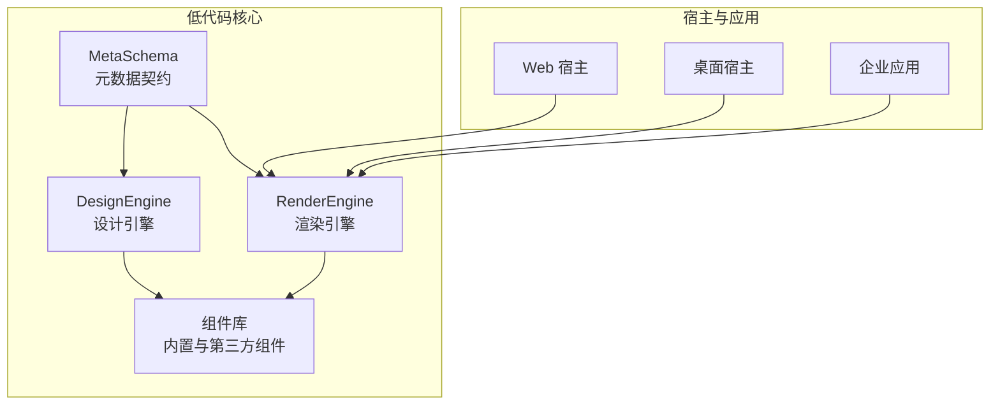

**图表来源**
- [PageSchemaBase.cs:1-40](file://src/LowCode/Common/H.LowCode.MetaSchema/PageSchemaBase.cs#L1-L40)
- [AppSchemaBase.cs:1-31](file://src/LowCode/Common/H.LowCode.MetaSchema/AppSchemaBase.cs#L1-L31)
- [ComponentSchemaBase.cs:1-110](file://src/LowCode/Common/H.LowCode.MetaSchema/ComponentSchemaBase.cs#L1-L110)
- [DataSourceSchema.cs:1-69](file://src/LowCode/Common/H.LowCode.MetaSchema/DataSourceSchema.cs#L1-L69)

**章节来源**
- [PageSchemaBase.cs:1-40](file://src/LowCode/Common/H.LowCode.MetaSchema/PageSchemaBase.cs#L1-L40)
- [AppSchemaBase.cs:1-31](file://src/LowCode/Common/H.LowCode.MetaSchema/AppSchemaBase.cs#L1-L31)
- [ComponentSchemaBase.cs:1-110](file://src/LowCode/Common/H.LowCode.MetaSchema/ComponentSchemaBase.cs#L1-L110)
- [DataSourceSchema.cs:1-69](file://src/LowCode/Common/H.LowCode.MetaSchema/DataSourceSchema.cs#L1-L69)

## 核心概念：元数据驱动的页面构建机制
低代码平台的核心思想是：**页面不是由手写 Razor 或 HTML 直接决定，而是由一份可序列化的元数据描述决定**。典型流程如下：

1. **设计阶段**  
   用户在可视化设计器中选择组件、调整布局、设置属性、绑定数据源、配置事件。设计引擎将这些操作转换为标准元数据。

2. **验证阶段**  
   设计引擎对元数据进行完整性校验，包括必填字段、类型一致性、引用合法性、校验规则有效性等。

3. **存储阶段**  
   元数据通过文件仓库或远端服务持久化，形成应用、页面、组件库、模板、菜单、数据源等资产。

4. **渲染阶段**  
   渲染引擎加载元数据，按层级构建组件树，解析样式、事件、数据源，并最终输出为 Blazor 组件树。

5. **运行阶段**  
   应用运行时根据主题、租户、权限和运行时配置动态渲染页面，并与企业后端服务交互。

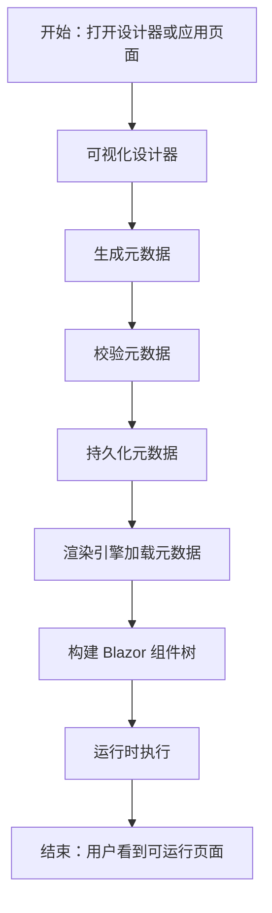

[此图为概念流程图，不直接映射具体源码文件]

## MetaSchema 元数据契约
MetaSchema 是低代码平台的“数据契约”，定义了应用、页面、组件、数据源、事件、样式和校验规则的标准结构。所有设计器和渲染器都基于同一份契约进行序列化与反序列化。

### 基础元数据基类
所有元数据通常继承自一个基础基类，用于记录创建者、修改者和时间戳等审计信息。

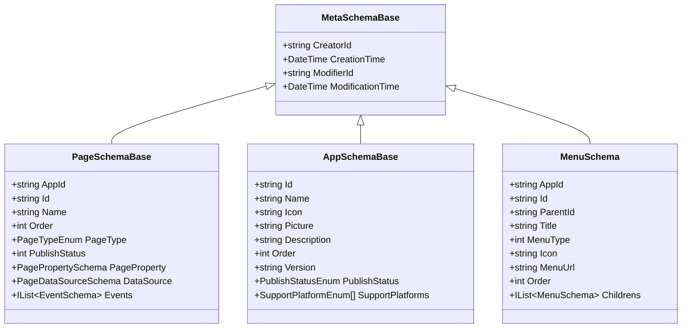

**图表来源**
- [MetaSchemaBase.cs:1-18](file://src/LowCode/Common/H.LowCode.MetaSchema/MetaSchemaBase.cs#L1-L18)
- [PageSchemaBase.cs:1-40](file://src/LowCode/Common/H.LowCode.MetaSchema/PageSchemaBase.cs#L1-L40)
- [AppSchemaBase.cs:1-31](file://src/LowCode/Common/H.LowCode.MetaSchema/AppSchemaBase.cs#L1-L31)
- [MenuSchema.cs:1-37](file://src/LowCode/Common/H.LowCode.MetaSchema/MenuSchema.cs#L1-L37)

**章节来源**
- [MetaSchemaBase.cs:1-18](file://src/LowCode/Common/H.LowCode.MetaSchema/MetaSchemaBase.cs#L1-L18)
- [PageSchemaBase.cs:1-40](file://src/LowCode/Common/H.LowCode.MetaSchema/PageSchemaBase.cs#L1-L40)
- [AppSchemaBase.cs:1-31](file://src/LowCode/Common/H.LowCode.MetaSchema/AppSchemaBase.cs#L1-L31)
- [MenuSchema.cs:1-37](file://src/LowCode/Common/H.LowCode.MetaSchema/MenuSchema.cs#L1-L37)

### 组件元数据模型
组件是页面的最小构建单元。每个组件实例都有唯一 Id、父节点、名称、标签、类型、容器标记、样式、事件、事件消费、校验规则和可见性条件。

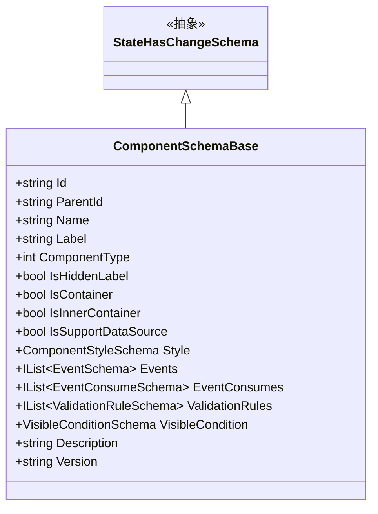

**图表来源**
- [ComponentSchemaBase.cs:1-110](file://src/LowCode/Common/H.LowCode.MetaSchema/ComponentSchemaBase.cs#L1-L110)

**章节来源**
- [ComponentSchemaBase.cs:1-110](file://src/LowCode/Common/H.LowCode.MetaSchema/ComponentSchemaBase.cs#L1-L110)

### 页面属性与布局
页面属性控制整体布局、标题宽度、默认样式、自定义样式以及页面级数据源。

| 字段 | 含义 | 说明 |
|---|---|---|
| `PageLayout` | 页面布局列数 | 一列、二列、三列或四列布局 |
| `TitleWidth` | 标题宽度 | 用于表单或标题区域宽度控制 |
| `DefaultStyle` | 默认样式 | 页面级默认样式字符串 |
| `CustomStyle` | 自定义样式 | 页面级覆盖样式字符串 |
| `DataSource` | 页面数据源 | 页面级别的数据绑定配置 |

**章节来源**
- [PagePropertySchema.cs:1-36](file://src/LowCode/Common/H.LowCode.MetaSchema/PropertySchemas/PagePropertySchema.cs#L1-L36)

### 组件样式
组件样式控制单个组件在页面中的尺寸、标签宽度和样式覆盖。

| 字段 | 含义 | 说明 |
|---|---|---|
| `ItemWidth` | 组件宽度 | 支持栅格比例值 |
| `ItemHeight` | 组件高度 | 单位通常为像素 |
| `LabelWidth` | 标签宽度 | 表单标签区域宽度 |
| `DefaultStyle` | 默认样式 | 组件默认样式 |
| `CustomStyle` | 自定义样式 | 组件覆盖样式 |

**章节来源**
- [ComponentStyleSchema.cs:1-38](file://src/LowCode/Common/H.LowCode.MetaSchema/PropertySchemas/ComponentStyleSchema.cs#L1-L38)

### 事件模型
事件是低代码平台连接用户交互与业务逻辑的关键。事件支持标准事件目标、自定义脚本和数据操作动作。

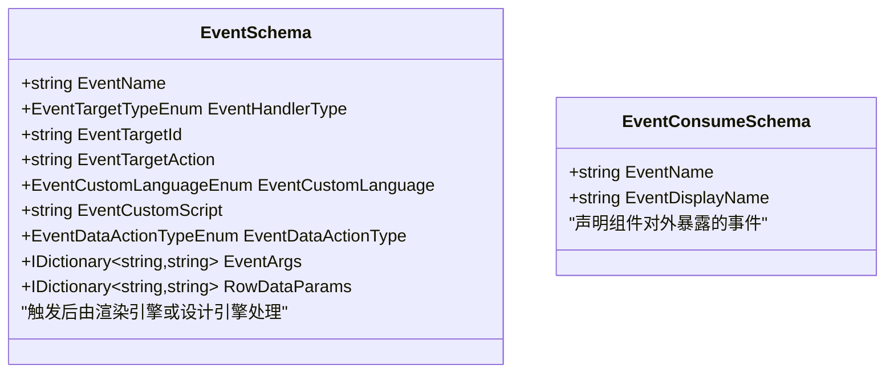

**图表来源**
- [EventSchema.cs:1-66](file://src/LowCode/Common/H.LowCode.MetaSchema/PropertySchemas/EventSchema.cs#L1-L66)

**章节来源**
- [EventSchema.cs:1-66](file://src/LowCode/Common/H.LowCode.MetaSchema/PropertySchemas/EventSchema.cs#L1-L66)

### 校验规则模型
校验规则为表单输入提供前端可配置的验证能力，支持必填、长度、数值范围、正则表达式、邮箱、手机号、URL、身份证号和自定义表达式。

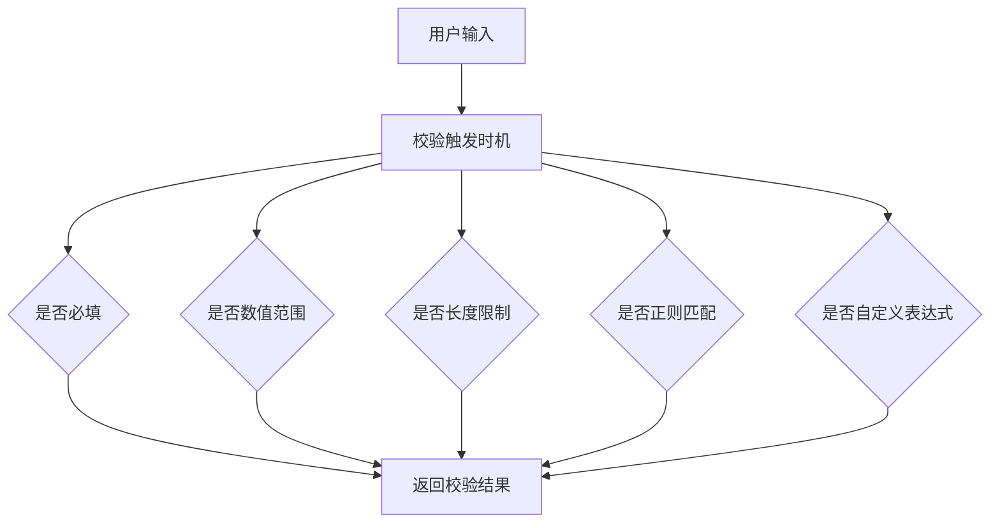

**图表来源**
- [ValidationRuleSchema.cs:1-172](file://src/LowCode/Common/H.LowCode.MetaSchema/PropertySchemas/ValidationRuleSchema.cs#L1-L172)

**章节来源**
- [ValidationRuleSchema.cs:1-172](file://src/LowCode/Common/H.LowCode.MetaSchema/PropertySchemas/ValidationRuleSchema.cs#L1-L172)

### 表格列元数据
表格列用于描述列表或表格组件的字段、标题、主键、顺序、过滤和排序能力。

**章节来源**
- [TableColumnSchema.cs:1-34](file://src/LowCode/Common/H.LowCode.MetaSchema/PropertySchemas/TableSchemas/TableColumnSchema.cs#L1-L34)

### 数据源模型
数据源是低代码平台解耦界面与数据的关键。数据源支持表结构、API 接口、选项字典等多种类型。

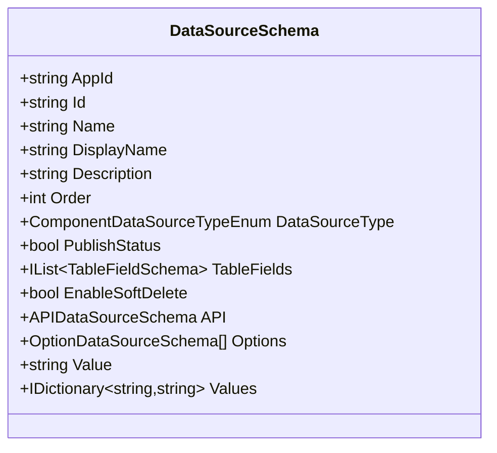

**图表来源**
- [DataSourceSchema.cs:1-69](file://src/LowCode/Common/H.LowCode.MetaSchema/DataSourceSchema.cs#L1-L69)

**章节来源**
- [DataSourceSchema.cs:1-69](file://src/LowCode/Common/H.LowCode.MetaSchema/DataSourceSchema.cs#L1-L69)

## 设计引擎工作原理
设计引擎负责把用户的可视化操作转化为标准元数据。其核心职责包括：

- **解析用户操作**：识别拖拽、删除、复制、移动、属性修改、事件绑定等操作。
- **生成元数据**：为新增组件分配唯一 Id、设置父节点、初始化样式和事件。
- **校验元数据**：确保组件引用合法、事件目标存在、数据源可用、校验规则完整。
- **合并元数据**：将局部修改合并到现有页面或组件结构中。
- **持久化元数据**：通过本地文件或远端服务保存设计成果。

设计引擎的典型处理流程如下：

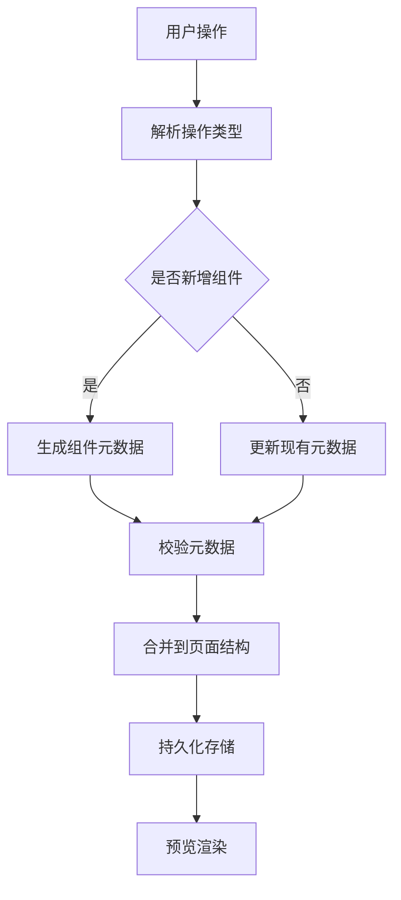

[此图为概念流程图，不直接映射具体源码文件]

在设计器中，常见操作与元数据的对应关系如下：

| 用户操作 | 元数据变化 |
|---|---|
| 拖入组件 | 新增 `ComponentSchemaBase` 实例 |
| 调整位置 | 修改 `ParentId` 或节点顺序 |
| 修改属性 | 更新 `Style`、`Events`、`ValidationRules` |
| 绑定数据源 | 更新组件或页面 `DataSource` |
| 配置事件 | 新增 `EventSchema` 或 `EventConsumeSchema` |
| 启用校验 | 新增 `ValidationRuleSchema` |

**章节来源**
- [ComponentSchemaBase.cs:1-110](file://src/LowCode/Common/H.LowCode.MetaSchema/ComponentSchemaBase.cs#L1-L110)
- [EventSchema.cs:1-66](file://src/LowCode/Common/H.LowCode.MetaSchema/PropertySchemas/EventSchema.cs#L1-L66)
- [ValidationRuleSchema.cs:1-172](file://src/LowCode/Common/H.LowCode.MetaSchema/PropertySchemas/ValidationRuleSchema.cs#L1-L172)

## 渲染引擎工作原理
渲染引擎负责将设计阶段生成的元数据转换为可执行的 Blazor 组件树。其核心职责包括：

- **加载元数据**：从本地文件或远端服务读取应用、页面、组件库、模板、菜单和数据源。
- **解析组件树**：按 `Id` 和 `ParentId` 构建树形结构。
- **解析样式**：应用页面默认样式、组件样式和自定义样式。
- **解析事件**：将事件目标、动作和参数绑定到运行时方法。
- **解析数据源**：根据数据源类型调用 API、SQL 或静态选项。
- **主题切换**：根据主题配置替换组件外观和样式。
- **运行时配置**：支持按环境、租户、用户角色动态调整页面行为。

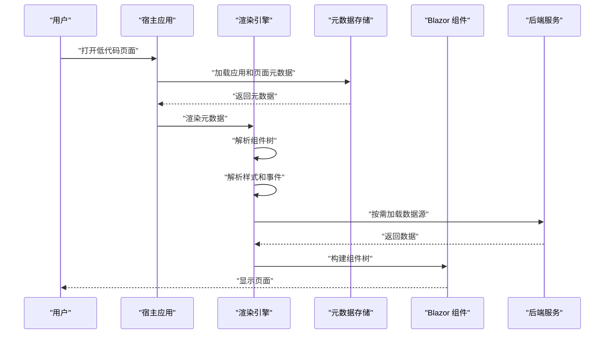

**图表来源**
- [PageSchemaBase.cs:1-40](file://src/LowCode/Common/H.LowCode.MetaSchema/PageSchemaBase.cs#L1-L40)
- [ComponentSchemaBase.cs:1-110](file://src/LowCode/Common/H.LowCode.MetaSchema/ComponentSchemaBase.cs#L1-L110)
- [DataSourceSchema.cs:1-69](file://src/LowCode/Common/H.LowCode.MetaSchema/DataSourceSchema.cs#L1-L69)

**章节来源**
- [PageSchemaBase.cs:1-40](file://src/LowCode/Common/H.LowCode.MetaSchema/PageSchemaBase.cs#L1-L40)
- [ComponentSchemaBase.cs:1-110](file://src/LowCode/Common/H.LowCode.MetaSchema/ComponentSchemaBase.cs#L1-L110)
- [DataSourceSchema.cs:1-69](file://src/LowCode/Common/H.LowCode.MetaSchema/DataSourceSchema.cs#L1-L69)

## 组件扩展与自定义开发指南
低代码平台鼓励开发者扩展组件体系，包括内置组件、组合组件和第三方 Blazor 组件。

### 如何定义自定义组件
自定义组件通常需要：

1. 创建一个 Blazor 组件。
2. 继承低代码组件基类，获得统一的上下文、状态和生命周期能力。
3. 在组件库中注册组件元数据，包括属性、事件、样式和校验规则。
4. 将组件加入组件库，使其在设计器中可见。

组件基类提供了统一的低代码上下文和状态管理能力，便于组件与页面、应用、数据源、事件系统协同工作。

**章节来源**
- [LowCodeComponentBase.cs:1-200](file://src/LowCode/Common/H.LowCode.ComponentBase/LowCodeComponentBase.cs#L1-L200)

### 如何扩展元数据类型
如果需要新的属性类型或行为，应扩展 MetaSchema：

1. 新增属性定义 Schema。
2. 在组件元数据中加入该属性。
3. 在设计器中增加对应的编辑器。
4. 在渲染器中实现属性的解析和绑定逻辑。

### 如何集成第三方 Blazor 组件
第三方组件可以通过以下方式接入：

1. 引用第三方 Blazor 组件包。
2. 封装一层低代码适配组件。
3. 定义适配后的元数据 Schema。
4. 将适配组件注册到组件库。

这样既能复用第三方能力，又能保持低代码元数据统一。

### 示例路径参考
- 自定义组件基类参考：[LowCodeComponentBase.cs](file://src/LowCode/Common/H.LowCode.ComponentBase/LowCodeComponentBase.cs)
- 组件元数据参考：[ComponentSchemaBase.cs](file://src/LowCode/Common/H.LowCode.MetaSchema/ComponentSchemaBase.cs)
- 事件定义参考：[EventSchema.cs](file://src/LowCode/Common/H.LowCode.MetaSchema/PropertySchemas/EventSchema.cs)
- 校验规则参考：[ValidationRuleSchema.cs](file://src/LowCode/Common/H.LowCode.MetaSchema/PropertySchemas/ValidationRuleSchema.cs)

**章节来源**
- [LowCodeComponentBase.cs:1-200](file://src/LowCode/Common/H.LowCode.ComponentBase/LowCodeComponentBase.cs#L1-L200)
- [ComponentSchemaBase.cs:1-110](file://src/LowCode/Common/H.LowCode.MetaSchema/ComponentSchemaBase.cs#L1-L110)
- [EventSchema.cs:1-66](file://src/LowCode/Common/H.LowCode.MetaSchema/PropertySchemas/EventSchema.cs#L1-L66)
- [ValidationRuleSchema.cs:1-172](file://src/LowCode/Common/H.LowCode.MetaSchema/PropertySchemas/ValidationRuleSchema.cs#L1-L172)

## 与企业级应用集成方式
低代码平台可以与企业现有系统深度集成，常见方式包括：

| 集成点 | 说明 |
|---|---|
| 认证与授权 | 通过应用元数据中的平台和权限配置，结合企业 RBAC 控制页面访问 |
| 菜单导航 | 使用 `MenuSchema` 将低代码页面纳入系统菜单 |
| 数据源集成 | 使用 `DataSourceSchema` 对接 API、数据库或静态字典 |
| 主题与品牌 | 通过主题配置统一企业视觉风格 |
| 运行时配置 | 根据租户、环境、用户角色动态调整页面行为 |
| 事件与后端 | 通过事件动作调用后端服务，完成业务流程 |

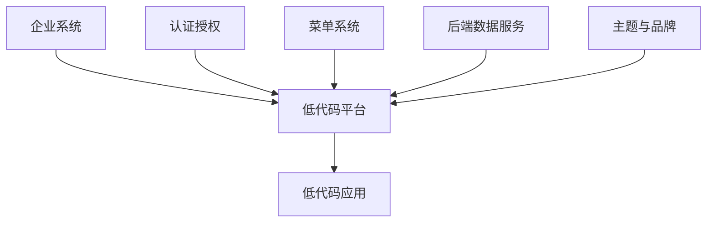

**图表来源**
- [MenuSchema.cs:1-37](file://src/LowCode/Common/H.LowCode.MetaSchema/MenuSchema.cs#L1-L37)
- [DataSourceSchema.cs:1-69](file://src/LowCode/Common/H.LowCode.MetaSchema/DataSourceSchema.cs#L1-L69)
- [AppSchemaBase.cs:1-31](file://src/LowCode/Common/H.LowCode.MetaSchema/AppSchemaBase.cs#L1-L31)

**章节来源**
- [MenuSchema.cs:1-37](file://src/LowCode/Common/H.LowCode.MetaSchema/MenuSchema.cs#L1-L37)
- [DataSourceSchema.cs:1-69](file://src/LowCode/Common/H.LowCode.MetaSchema/DataSourceSchema.cs#L1-L69)
- [AppSchemaBase.cs:1-31](file://src/LowCode/Common/H.LowCode.MetaSchema/AppSchemaBase.cs#L1-L31)

## 依赖关系分析
低代码架构采用分层解耦：

- **MetaSchema 层**：作为稳定契约，被设计器和渲染器共同依赖。
- **DesignEngine 层**：依赖 MetaSchema，负责设计期元数据生成、校验和持久化。
- **RenderEngine 层**：依赖 MetaSchema，负责运行期元数据解析和组件树渲染。
- **组件层**：由开发者扩展，依赖渲染引擎提供的上下文和能力。

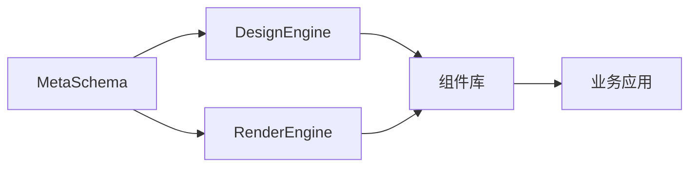

**图表来源**
- [PageSchemaBase.cs:1-40](file://src/LowCode/Common/H.LowCode.MetaSchema/PageSchemaBase.cs#L1-L40)
- [ComponentSchemaBase.cs:1-110](file://src/LowCode/Common/H.LowCode.MetaSchema/ComponentSchemaBase.cs#L1-L110)
- [DataSourceSchema.cs:1-69](file://src/LowCode/Common/H.LowCode.MetaSchema/DataSourceSchema.cs#L1-L69)

**章节来源**
- [PageSchemaBase.cs:1-40](file://src/LowCode/Common/H.LowCode.MetaSchema/PageSchemaBase.cs#L1-L40)
- [ComponentSchemaBase.cs:1-110](file://src/LowCode/Common/H.LowCode.MetaSchema/ComponentSchemaBase.cs#L1-L110)
- [DataSourceSchema.cs:1-69](file://src/LowCode/Common/H.LowCode.MetaSchema/DataSourceSchema.cs#L1-L69)

## 性能优化建议与最佳实践
为保证低代码应用在大规模页面和复杂交互场景下的性能，建议遵循以下原则：

1. **减少不必要的元数据变更**  
   批量修改组件属性时合并变更，避免频繁触发重新渲染。

2. **合理使用组件容器**  
   容器组件适合做布局，不应随意开启数据源绑定；非容器组件才适合绑定数据。

3. **控制事件数量**  
   过多事件会增加事件分发和参数传递开销，应按需绑定。

4. **优化数据源查询**  
   分页、缓存、延迟加载可减少首屏压力。

5. **复用组件和模板**  
   通过组件库和页面模板减少重复定义。

6. **避免深层嵌套**  
   过深的组件树会影响渲染性能和调试体验。

7. **谨慎使用自定义脚本事件**  
   自定义脚本灵活但难以维护，优先使用标准事件和目标动作。

8. **合理划分页面布局**  
   使用页面布局列数和组件宽度控制，避免大量内联样式。

9. **主题与样式分离**  
   尽量通过主题和样式 Schema 控制外观，避免硬编码样式。

10. **运行时配置最小化**  
    只在必要时区分环境、租户和用户角色的差异化配置。

[本节为通用性能建议，不直接分析具体源码文件]

## 故障排查指南
常见问题可按以下方向排查：

| 问题现象 | 可能原因 | 排查建议 |
|---|---|---|
| 组件无法渲染 | 组件 Id 缺失或父节点不存在 | 检查 `ComponentSchemaBase.Id` 和 `ParentId` |
| 组件不显示 | 可见条件为假 | 检查 `VisibleCondition` |
| 校验不生效 | 校验规则未启用或触发时机错误 | 检查 `ValidationRuleSchema.IsEnabled` 和 `Trigger` |
| 事件无响应 | 事件目标不存在或动作未绑定 | 检查 `EventSchema.EventTargetId` 和 `EventTargetAction` |
| 数据为空 | 数据源未配置或接口失败 | 检查 `DataSourceSchema` 和后端服务 |
| 样式异常 | 样式覆盖冲突 | 检查 `ComponentStyleSchema` 和页面样式 |
| 页面布局错乱 | 组件宽度与页面布局不匹配 | 检查 `PagePropertySchema.PageLayout` 和 `ComponentStyleSchema.ItemWidth` |

**章节来源**
- [ComponentSchemaBase.cs:1-110](file://src/LowCode/Common/H.LowCode.MetaSchema/ComponentSchemaBase.cs#L1-L110)
- [ValidationRuleSchema.cs:1-172](file://src/LowCode/Common/H.LowCode.MetaSchema/PropertySchemas/ValidationRuleSchema.cs#L1-L172)
- [EventSchema.cs:1-66](file://src/LowCode/Common/H.LowCode.MetaSchema/PropertySchemas/EventSchema.cs#L1-L66)
- [DataSourceSchema.cs:1-69](file://src/LowCode/Common/H.LowCode.MetaSchema/DataSourceSchema.cs#L1-L69)
- [PagePropertySchema.cs:1-36](file://src/LowCode/Common/H.LowCode.MetaSchema/PropertySchemas/PagePropertySchema.cs#L1-L36)
- [ComponentStyleSchema.cs:1-38](file://src/LowCode/Common/H.LowCode.MetaSchema/PropertySchemas/ComponentStyleSchema.cs#L1-L38)

## 结论
AppLab 低代码平台通过稳定的 MetaSchema 元数据契约，将可视化设计与运行时渲染解耦。设计引擎负责把用户操作转化为可靠元数据，渲染引擎负责把元数据还原为 Blazor 组件树。这种架构既支持业务人员快速搭建界面，也保留开发者扩展组件、集成后端服务和定制主题的能力。

在实际项目中，建议以 MetaSchema 为中心，先定义清晰的组件属性和事件契约，再逐步完善设计器、渲染器和企业集成能力，从而在保证可维护性的前提下提升交付效率。