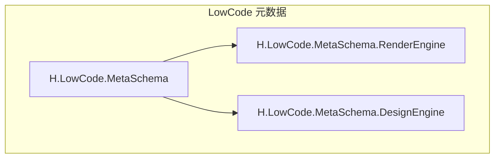
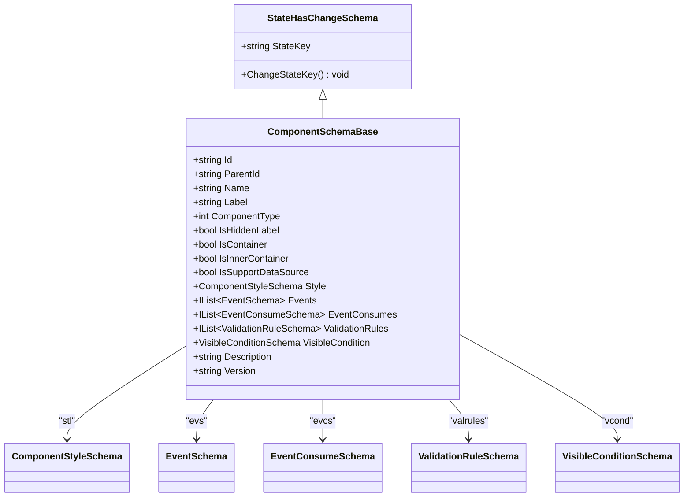
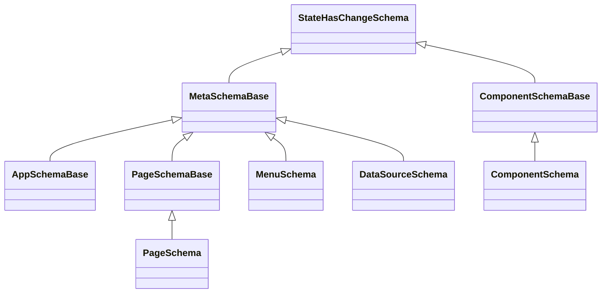
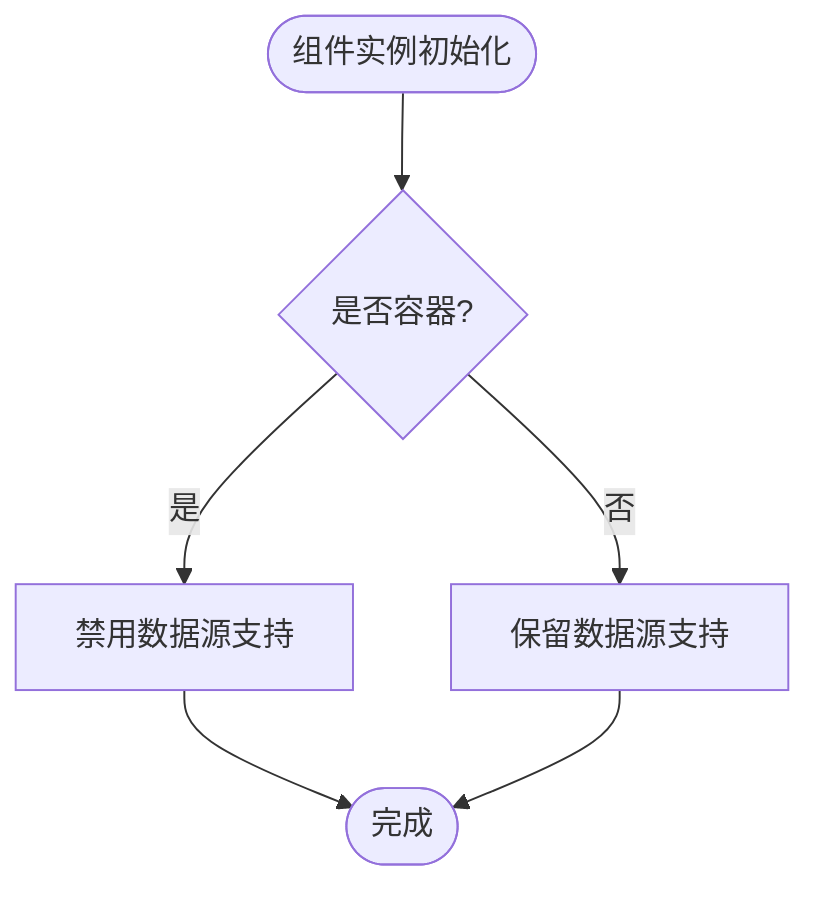
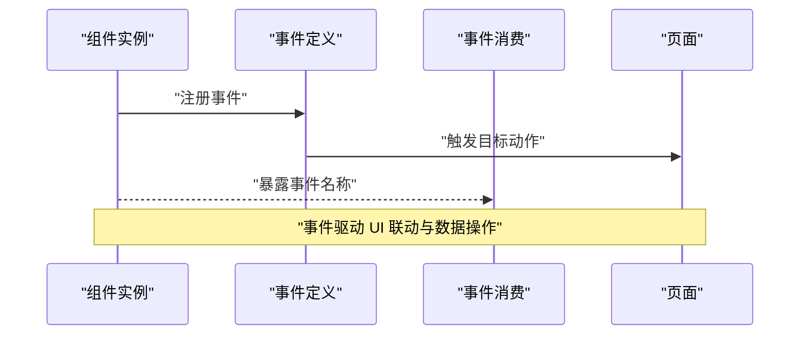
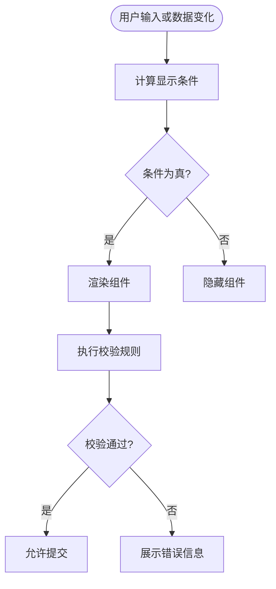
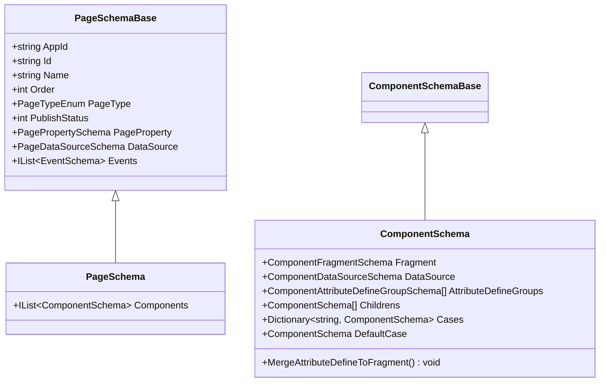
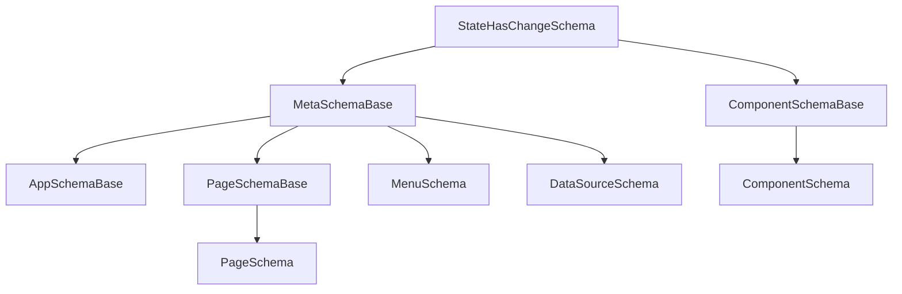

# 元数据 Schema 设计

<cite>
**本文引用的文件**   
- [MetaSchemaBase.cs](file://src/LowCode/Common/H.LowCode.MetaSchema/MetaSchemaBase.cs)
- [ComponentSchemaBase.cs](file://src/LowCode/Common/H.LowCode.MetaSchema/ComponentSchemaBase.cs)
- [PageSchemaBase.cs](file://src/LowCode/Common/H.LowCode.MetaSchema/PageSchemaBase.cs)
- [AppSchemaBase.cs](file://src/LowCode/Common/H.LowCode.MetaSchema/AppSchemaBase.cs)
- [MenuSchema.cs](file://src/LowCode/Common/H.LowCode.MetaSchema/MenuSchema.cs)
- [DataSourceSchema.cs](file://src/LowCode/Common/H.LowCode.MetaSchema/DataSourceSchema.cs)
- [StateHasChangeSchema.cs](file://src/LowCode/Common/H.LowCode.MetaSchema/StateHasChangeSchema.cs)
- [ComponentStyleSchema.cs](file://src/LowCode/Common/H.LowCode.MetaSchema/PropertySchemas/ComponentStyleSchema.cs)
- [EventSchema.cs](file://src/LowCode/Common/H.LowCode.MetaSchema/PropertySchemas/EventSchema.cs)
- [ValidationRuleSchema.cs](file://src/LowCode/Common/H.LowCode.MetaSchema/PropertySchemas/ValidationRuleSchema.cs)
- [VisibleConditionSchema.cs](file://src/LowCode/Common/H.LowCode.MetaSchema/PropertySchemas/VisibleConditionSchema.cs)
- [PagePropertySchema.cs](file://src/LowCode/Common/H.LowCode.MetaSchema/PropertySchemas/PagePropertySchema.cs)
- [PageDataSourceSchema.cs](file://src/LowCode/Common/H.LowCode.MetaSchema/DataSourceSchemas/PageDataSourceSchema.cs)
- [APIDataSourceSchema.cs](file://src/LowCode/Common/H.LowCode.MetaSchema/DataSourceSchemas/APIDataSourceSchema.cs)
- [OptionDataSourceSchema.cs](file://src/LowCode/Common/H.LowCode.MetaSchema/DataSourceSchemas/OptionDataSourceSchema.cs)
- [TableFieldSchema.cs](file://src/LowCode/Common/H.LowCode.MetaSchema/DataSourceSchemas/TableFieldSchema.cs)
- [ComponentSchema.cs](file://src/LowCode/Common/H.LowCode.MetaSchema.RenderEngine/ComponentSchema.cs)
- [PageSchema.cs](file://src/LowCode/Common/H.LowCode.MetaSchema.RenderEngine/PageSchema.cs)
- [AppSchema.cs](file://src/LowCode/Common/H.LowCode.MetaSchema.RenderEngine/AppSchema.cs)
</cite>

## 目录
1. [引言](#引言)
2. [项目结构定位](#项目结构定位)
3. [核心基类与字段语义](#核心基类与字段语义)
4. [架构总览](#架构总览)
5. [详细组件分析](#详细组件分析)
6. [依赖关系分析](#依赖关系分析)
7. [JSON 序列化契约与传输优化](#json-序列化契约与传输优化)
8. [完整页面元数据示例](#完整页面元数据示例)
9. [自定义组件扩展指南](#自定义组件扩展指南)
10. [生命周期管理：创建、修改、发布与版本控制](#生命周期管理创建修改发布与版本控制)
11. [验证规则、向后兼容性与数据迁移](#验证规则向后兼容性与数据迁移)
12. [性能考虑](#性能考虑)
13. [故障排查](#故障排查)
14. [结论](#结论)

## 引言
本文面向 AppLab 低代码平台的元数据 Schema 设计，系统性解释 MetaSchemaBase、ComponentSchemaBase、PageSchemaBase、AppSchemaBase、MenuSchema、DataSourceSchema 等核心类型的设计目标、继承关系和字段语义；说明 JSON 序列化中的紧凑命名约定；阐述 StateHasChangeSchema 与 ABP 状态管理的集成方式；并提供一个包含表单组件、列表组件和布局容器的完整页面 Schema 示例。同时给出自定义组件扩展方法、生命周期管理策略以及验证、兼容性和迁移建议。

## 项目结构定位
AppLab 的元数据定义集中在 LowCode 公共模块中：
- H.LowCode.MetaSchema：核心元数据类型、枚举、属性 Schema、数据源 Schema。
- H.LowCode.MetaSchema.RenderEngine：渲染端使用的具体 Schema 类型，例如 PageSchema、ComponentSchema。
- H.LowCode.MetaSchema.DesignEngine：设计器相关扩展类型，如模板、部件、角色、发布记录等。

**图表来源**
- [MetaSchemaBase.cs:1-18](file://src/LowCode/Common/H.LowCode.MetaSchema/MetaSchemaBase.cs#L1-L18)
- [ComponentSchemaBase.cs:1-110](file://src/LowCode/Common/H.LowCode.MetaSchema/ComponentSchemaBase.cs#L1-L110)
- [PageSchemaBase.cs:1-40](file://src/LowCode/Common/H.LowCode.MetaSchema/PageSchemaBase.cs#L1-L40)
- [AppSchemaBase.cs:1-31](file://src/LowCode/Common/H.LowCode.MetaSchema/AppSchemaBase.cs#L1-L31)
- [MenuSchema.cs:1-37](file://src/LowCode/Common/H.LowCode.MetaSchema/MenuSchema.cs#L1-L37)
- [DataSourceSchema.cs:1-69](file://src/LowCode/Common/H.LowCode.MetaSchema/DataSourceSchema.cs#L1-L69)
- [StateHasChangeSchema.cs:1-15](file://src/LowCode/Common/H.LowCode.MetaSchema/StateHasChangeSchema.cs#L1-L15)
- [ComponentSchema.cs:1-83](file://src/LowCode/Common/H.LowCode.MetaSchema.RenderEngine/ComponentSchema.cs#L1-L83)
- [PageSchema.cs:1-9](file://src/LowCode/Common/H.LowCode.MetaSchema.RenderEngine/PageSchema.cs#L1-L9)
- [AppSchema.cs:1-6](file://src/LowCode/Common/H.LowCode.MetaSchema.RenderEngine/AppSchema.cs#L1-L6)

**章节来源**
- [MetaSchemaBase.cs:1-18](file://src/LowCode/Common/H.LowCode.MetaSchema/MetaSchemaBase.cs#L1-L18)
- [ComponentSchemaBase.cs:1-110](file://src/LowCode/Common/H.LowCode.MetaSchema/ComponentSchemaBase.cs#L1-L110)
- [PageSchemaBase.cs:1-40](file://src/LowCode/Common/H.LowCode.MetaSchema/PageSchemaBase.cs#L1-L40)
- [AppSchemaBase.cs:1-31](file://src/LowCode/Common/H.LowCode.MetaSchema/AppSchemaBase.cs#L1-L31)
- [MenuSchema.cs:1-37](file://src/LowCode/Common/H.LowCode.MetaSchema/MenuSchema.cs#L1-L37)
- [DataSourceSchema.cs:1-69](file://src/LowCode/Common/H.LowCode.MetaSchema/DataSourceSchema.cs#L1-L69)
- [StateHasChangeSchema.cs:1-15](file://src/LowCode/Common/H.LowCode.MetaSchema/StateHasChangeSchema.cs#L1-L15)
- [ComponentSchema.cs:1-83](file://src/LowCode/Common/H.LowCode.MetaSchema.RenderEngine/ComponentSchema.cs#L1-L83)
- [PageSchema.cs:1-9](file://src/LowCode/Common/H.LowCode.MetaSchema.RenderEngine/PageSchema.cs#L1-L9)
- [AppSchema.cs:1-6](file://src/LowCode/Common/H.LowCode.MetaSchema.RenderEngine/AppSchema.cs#L1-L6)

## 核心基类与字段语义
### MetaSchemaBase：基础审计与变更追踪
MetaSchemaBase 是所有可被持久化的元数据对象的根抽象类，它继承自 StateHasChangeSchema，并统一提供创建者、创建时间、修改者、修改时间的 JSON 字段。这些字段在序列化为 JSON 时使用短键 cid、ct、mid、mt，便于传输优化。

| 字段 | JSON 键 | 含义 |
|---|---|---|
| CreatorId | cid | 创建者标识 |
| CreationTime | ct | 创建时间 |
| ModifierId | mid | 最后修改者标识 |
| ModificationTime | mt | 最后修改时间 |

**章节来源**
- [MetaSchemaBase.cs:1-18](file://src/LowCode/Common/H.LowCode.MetaSchema/MetaSchemaBase.cs#L1-L18)
- [StateHasChangeSchema.cs:1-15](file://src/LowCode/Common/H.LowCode.MetaSchema/StateHasChangeSchema.cs#L1-L15)

### ComponentSchemaBase：组件实例模型
ComponentSchemaBase 描述页面中任意组件实例的元数据，包括实例 Id、父节点、名称、标签、组件类型、容器标记、样式、事件、事件消费、校验规则、显示条件、描述和版本号。

关键字段语义：
- id：组件实例唯一 Id。
- pid：父节点 Id，用于构建父子树形结构。
- n：组件 Name。
- lb：组件 Label（显示名）。
- ct：组件类型，1 表示原子组件，2 表示组合组件。
- container：是否为容器组件。
- incontainer：是否内部容器组件。
- sptds：是否支持数据源；当为容器时强制关闭。
- stl：组件样式结构。
- evs：事件定义。
- evcs：事件消费声明。
- valrules：校验规则集合。
- vcond：显示条件，用于条件渲染。
- desc：描述。
- v：组件版本。

**图表来源**
- [ComponentSchemaBase.cs:1-110](file://src/LowCode/Common/H.LowCode.MetaSchema/ComponentSchemaBase.cs#L1-L110)
- [ComponentStyleSchema.cs:1-38](file://src/LowCode/Common/H.LowCode.MetaSchema/PropertySchemas/ComponentStyleSchema.cs#L1-L38)
- [EventSchema.cs:1-66](file://src/LowCode/Common/H.LowCode.MetaSchema/PropertySchemas/EventSchema.cs#L1-L66)
- [ValidationRuleSchema.cs:1-172](file://src/LowCode/Common/H.LowCode.MetaSchema/PropertySchemas/ValidationRuleSchema.cs#L1-L172)
- [VisibleConditionSchema.cs:1-49](file://src/LowCode/Common/H.LowCode.MetaSchema/PropertySchemas/VisibleConditionSchema.cs#L1-L49)
- [StateHasChangeSchema.cs:1-15](file://src/LowCode/Common/H.LowCode.MetaSchema/StateHasChangeSchema.cs#L1-L15)

**章节来源**
- [ComponentSchemaBase.cs:1-110](file://src/LowCode/Common/H.LowCode.MetaSchema/ComponentSchemaBase.cs#L1-L110)
- [ComponentStyleSchema.cs:1-38](file://src/LowCode/Common/H.LowCode.MetaSchema/PropertySchemas/ComponentStyleSchema.cs#L1-L38)
- [EventSchema.cs:1-66](file://src/LowCode/Common/H.LowCode.MetaSchema/PropertySchemas/EventSchema.cs#L1-L66)
- [ValidationRuleSchema.cs:1-172](file://src/LowCode/Common/H.LowCode.MetaSchema/PropertySchemas/ValidationRuleSchema.cs#L1-L172)
- [VisibleConditionSchema.cs:1-49](file://src/LowCode/Common/H.LowCode.MetaSchema/PropertySchemas/VisibleConditionSchema.cs#L1-L49)
- [StateHasChangeSchema.cs:1-15](file://src/LowCode/Common/H.LowCode.MetaSchema/StateHasChangeSchema.cs#L1-L15)

### PageSchemaBase：页面元数据
PageSchemaBase 继承 MetaSchemaBase，增加应用关联、页面 Id、Name、排序、页面类型、发布状态、页面属性和页面数据源，以及页面级事件。

关键语义：
- aid：应用 Id。
- id：页面 Id，默认使用雪花短 Id。
- pt：页面类型，普通、表单、列表、报表。
- pub：发布状态。
- pageprop：页面布局与样式。
- ds：页面数据源引用。
- evs：页面级事件。

**章节来源**
- [PageSchemaBase.cs:1-40](file://src/LowCode/Common/H.LowCode.MetaSchema/PageSchemaBase.cs#L1-L40)
- [PagePropertySchema.cs:1-36](file://src/LowCode/Common/H.LowCode.MetaSchema/PropertySchemas/PagePropertySchema.cs#L1-L36)
- [PageDataSourceSchema.cs:1-18](file://src/LowCode/Common/H.LowCode.MetaSchema/DataSourceSchemas/PageDataSourceSchema.cs#L1-L18)

### AppSchemaBase：应用元数据
AppSchemaBase 继承 MetaSchemaBase，描述应用级别的元数据，包括应用 Id、名称、图标、封面图、描述、排序、版本、发布状态和支持平台。

**章节来源**
- [AppSchemaBase.cs:1-31](file://src/LowCode/Common/H.LowCode.MetaSchema/AppSchemaBase.cs#L1-L31)

### MenuSchema：菜单元数据
MenuSchema 继承 MetaSchemaBase，描述应用菜单节点，支持父子层级、菜单类型、图标、地址、排序和子菜单。

**章节来源**
- [MenuSchema.cs:1-37](file://src/LowCode/Common/H.LowCode.MetaSchema/MenuSchema.cs#L1-L37)

### DataSourceSchema：数据源元数据
DataSourceSchema 继承 MetaSchemaBase，描述数据源的通用属性，并根据数据源类型展开不同配置：
- 表数据源：字段集合、软删除开关。
- API 数据源：API 调用配置。
- 选项数据源：静态选项数组、值字典。

**章节来源**
- [DataSourceSchema.cs:1-69](file://src/LowCode/Common/H.LowCode.MetaSchema/DataSourceSchema.cs#L1-L69)
- [APIDataSourceSchema.cs:1-59](file://src/LowCode/Common/H.LowCode.MetaSchema/DataSourceSchemas/APIDataSourceSchema.cs#L1-L59)
- [OptionDataSourceSchema.cs:1-28](file://src/LowCode/Common/H.LowCode.MetaSchema/DataSourceSchemas/OptionDataSourceSchema.cs#L1-L28)
- [TableFieldSchema.cs:1-33](file://src/LowCode/Common/H.LowCode.MetaSchema/DataSourceSchemas/TableFieldSchema.cs#L1-L33)

## 架构总览
元数据体系以 StateHasChangeSchema 为运行时状态基座，MetaSchemaBase 作为所有可持久化元数据的审计基类，再向上派生出应用、页面、菜单和数据源等业务元数据；组件元数据则通过 ComponentSchemaBase 表达组件实例、样式、事件、校验和显示条件。渲染端在此基础上扩展出 PageSchema、ComponentSchema，用于承载组件树、Fragment、属性定义组和数据源绑定。

**图表来源**
- [StateHasChangeSchema.cs:1-15](file://src/LowCode/Common/H.LowCode.MetaSchema/StateHasChangeSchema.cs#L1-L15)
- [MetaSchemaBase.cs:1-18](file://src/LowCode/Common/H.LowCode.MetaSchema/MetaSchemaBase.cs#L1-L18)
- [AppSchemaBase.cs:1-31](file://src/LowCode/Common/H.LowCode.MetaSchema/AppSchemaBase.cs#L1-L31)
- [PageSchemaBase.cs:1-40](file://src/LowCode/Common/H.LowCode.MetaSchema/PageSchemaBase.cs#L1-L40)
- [MenuSchema.cs:1-37](file://src/LowCode/Common/H.LowCode.MetaSchema/MenuSchema.cs#L1-L37)
- [DataSourceSchema.cs:1-69](file://src/LowCode/Common/H.LowCode.MetaSchema/DataSourceSchema.cs#L1-L69)
- [ComponentSchemaBase.cs:1-110](file://src/LowCode/Common/H.LowCode.MetaSchema/ComponentSchemaBase.cs#L1-L110)
- [PageSchema.cs:1-9](file://src/LowCode/Common/H.LowCode.MetaSchema.RenderEngine/PageSchema.cs#L1-L9)
- [ComponentSchema.cs:1-83](file://src/LowCode/Common/H.LowCode.MetaSchema.RenderEngine/ComponentSchema.cs#L1-L83)

## 详细组件分析
### 组件实例与容器关系
组件实例通过 Id 和 ParentId 形成树形结构；容器组件通过 IsContainer 或 IsInnerContainer 标记，容器通常不具备数据源能力，IsSupportDataSource 会在容器场景下被强制关闭。

**图表来源**
- [ComponentSchemaBase.cs:1-110](file://src/LowCode/Common/H.LowCode.MetaSchema/ComponentSchemaBase.cs#L1-L110)

**章节来源**
- [ComponentSchemaBase.cs:1-110](file://src/LowCode/Common/H.LowCode.MetaSchema/ComponentSchemaBase.cs#L1-L110)

### 事件定义与事件消费
组件可以声明多个事件（evs），每个事件包含事件名称、处理目标类型、目标 Id、动作、脚本语言和内容、数据操作类型、参数映射等。事件消费（evcs）用于声明该组件对外暴露的事件及其显示名，供其他组件或页面订阅。

**图表来源**
- [EventSchema.cs:1-66](file://src/LowCode/Common/H.LowCode.MetaSchema/PropertySchemas/EventSchema.cs#L1-L66)
- [ComponentSchemaBase.cs:1-110](file://src/LowCode/Common/H.LowCode.MetaSchema/ComponentSchemaBase.cs#L1-L110)

**章节来源**
- [EventSchema.cs:1-66](file://src/LowCode/Common/H.LowCode.MetaSchema/PropertySchemas/EventSchema.cs#L1-L66)
- [ComponentSchemaBase.cs:1-110](file://src/LowCode/Common/H.LowCode.MetaSchema/ComponentSchemaBase.cs#L1-L110)

### 校验规则与显示条件
校验规则（valrules）支持必填、长度、数值范围、正则、邮箱、手机、URL、身份证、自定义表达式等，并可配置触发时机和错误消息。显示条件（vcond）通过表达式比较实现显隐联动，支持相等、不等、包含、非空、为空、在列表中等多种操作符。

**图表来源**
- [VisibleConditionSchema.cs:1-49](file://src/LowCode/Common/H.LowCode.MetaSchema/PropertySchemas/VisibleConditionSchema.cs#L1-L49)
- [ValidationRuleSchema.cs:1-172](file://src/LowCode/Common/H.LowCode.MetaSchema/PropertySchemas/ValidationRuleSchema.cs#L1-L172)

**章节来源**
- [VisibleConditionSchema.cs:1-49](file://src/LowCode/Common/H.LowCode.MetaSchema/PropertySchemas/VisibleConditionSchema.cs#L1-L49)
- [ValidationRuleSchema.cs:1-172](file://src/LowCode/Common/H.LowCode.MetaSchema/PropertySchemas/ValidationRuleSchema.cs#L1-L172)

### 页面 Schema 与组件树
渲染端的 PageSchema 在 PageSchemaBase 基础上增加 Components 列表，用于承载页面中的所有组件。ComponentSchema 进一步扩展 Fragment、数据源绑定、属性定义组、子组件树、条件分支及默认分支，并提供了将属性定义合并到 Fragment 的方法。

**图表来源**
- [PageSchemaBase.cs:1-40](file://src/LowCode/Common/H.LowCode.MetaSchema/PageSchemaBase.cs#L1-L40)
- [PageSchema.cs:1-9](file://src/LowCode/Common/H.LowCode.MetaSchema.RenderEngine/PageSchema.cs#L1-L9)
- [ComponentSchema.cs:1-83](file://src/LowCode/Common/H.LowCode.MetaSchema.RenderEngine/ComponentSchema.cs#L1-L83)

**章节来源**
- [PageSchemaBase.cs:1-40](file://src/LowCode/Common/H.LowCode.MetaSchema/PageSchemaBase.cs#L1-L40)
- [PageSchema.cs:1-9](file://src/LowCode/Common/H.LowCode.MetaSchema.RenderEngine/PageSchema.cs#L1-L9)
- [ComponentSchema.cs:1-83](file://src/LowCode/Common/H.LowCode.MetaSchema.RenderEngine/ComponentSchema.cs#L1-L83)

## 依赖关系分析
- StateHasChangeSchema 提供运行时状态 Key，被 MetaSchemaBase 和 ComponentSchemaBase 复用。
- MetaSchemaBase 被 AppSchemaBase、PageSchemaBase、MenuSchema、DataSourceSchema 继承。
- ComponentSchemaBase 被 ComponentSchema 继承。
- PageSchemaBase 被 PageSchema 继承。
- 页面和组件通过事件、数据源、样式、校验规则和显示条件相互耦合，形成“页面—组件—事件—数据源”的关系网络。

**图表来源**
- [StateHasChangeSchema.cs:1-15](file://src/LowCode/Common/H.LowCode.MetaSchema/StateHasChangeSchema.cs#L1-L15)
- [MetaSchemaBase.cs:1-18](file://src/LowCode/Common/H.LowCode.MetaSchema/MetaSchemaBase.cs#L1-L18)
- [AppSchemaBase.cs:1-31](file://src/LowCode/Common/H.LowCode.MetaSchema/AppSchemaBase.cs#L1-L31)
- [PageSchemaBase.cs:1-40](file://src/LowCode/Common/H.LowCode.MetaSchema/PageSchemaBase.cs#L1-L40)
- [MenuSchema.cs:1-37](file://src/LowCode/Common/H.LowCode.MetaSchema/MenuSchema.cs#L1-L37)
- [DataSourceSchema.cs:1-69](file://src/LowCode/Common/H.LowCode.MetaSchema/DataSourceSchema.cs#L1-L69)
- [ComponentSchemaBase.cs:1-110](file://src/LowCode/Common/H.LowCode.MetaSchema/ComponentSchemaBase.cs#L1-L110)
- [PageSchema.cs:1-9](file://src/LowCode/Common/H.LowCode.MetaSchema.RenderEngine/PageSchema.cs#L1-L9)
- [ComponentSchema.cs:1-83](file://src/LowCode/Common/H.LowCode.MetaSchema.RenderEngine/ComponentSchema.cs#L1-L83)

**章节来源**
- [StateHasChangeSchema.cs:1-15](file://src/LowCode/Common/H.LowCode.MetaSchema/StateHasChangeSchema.cs#L1-L15)
- [MetaSchemaBase.cs:1-18](file://src/LowCode/Common/H.LowCode.MetaSchema/MetaSchemaBase.cs#L1-L18)
- [ComponentSchemaBase.cs:1-110](file://src/LowCode/Common/H.LowCode.MetaSchema/ComponentSchemaBase.cs#L1-L110)
- [PageSchemaBase.cs:1-40](file://src/LowCode/Common/H.LowCode.MetaSchema/PageSchemaBase.cs#L1-L40)
- [PageSchema.cs:1-9](file://src/LowCode/Common/H.LowCode.MetaSchema.RenderEngine/PageSchema.cs#L1-L9)
- [ComponentSchema.cs:1-83](file://src/LowCode/Common/H.LowCode.MetaSchema.RenderEngine/ComponentSchema.cs#L1-L83)

## JSON 序列化契约与传输优化
Schema 广泛使用 System.Text.Json 的 JsonPropertyName 特性，将长属性名映射为短键，以减少 JSON 体积和网络传输成本。典型约定如下：

| 语义 | 属性名 | JSON 键 | 说明 |
|---|---|---|---|
| 创建者 | CreatorId | cid | 审计字段 |
| 创建时间 | CreationTime | ct | 审计字段 |
| 修改者 | ModifierId | mid | 审计字段 |
| 修改时间 | ModificationTime | mt | 审计字段 |
| 组件实例 Id | Id | id | 实例标识 |
| 父节点 Id | ParentId | pid | 父子关系 |
| 组件名称 | Name | n | 组件名 |
| 组件标签 | Label | lb | 显示标签 |
| 组件类型 | ComponentType | ct | 原子/组合 |
| 隐藏标题 | IsHiddenLabel | hlb | 标题显隐 |
| 容器组件 | IsContainer | container | 容器标记 |
| 内部容器 | IsInnerContainer | incontainer | 内部容器 |
| 支持数据源 | IsSupportDataSource | sptds | 数据源能力 |
| 样式 | Style | stl | 样式对象 |
| 事件 | Events | evs | 事件列表 |
| 事件消费 | EventConsumes | evcs | 事件消费声明 |
| 校验规则 | ValidationRules | valrules | 校验列表 |
| 显示条件 | VisibleCondition | vcond | 条件渲染 |
| 描述 | Description | desc | 描述文本 |
| 版本 | Version | v | 版本字符串 |
| 应用 Id | AppId | aid | 应用关联 |
| 页面布局 | PageLayout | playout | 页面布局列数 |
| 页面数据源 | DataSource | ds | 页面数据源 |
| 组件树 | Components | comps | 页面组件列表 |
| 子组件 | Childrens | childs | 组件子树 |
| 条件分支 | Cases | cases | 条件渲染分支 |
| 默认分支 | DefaultCase | default | 默认分支 |
| Fragment | Fragment | frag | 渲染片段 |
| 数据源绑定 | DataSource | ds | 组件数据源 |
| 属性定义组 | AttributeDefineGroups | attrdefgroups | 可视化属性 |
| API 域名 | Domain | d | API 数据源 |
| API 路径 | Path | p | API 数据源 |
| API 方法 | Method | m | API 数据源 |
| API 查询参数 | Queries | qs | API 数据源 |
| API 请求体 | Body | bd | API 数据源 |
| API 请求头 | Headers | hs | API 数据源 |
| 选项标签 | Label | l | 选项数据源 |
| 选项值 | Value | v | 选项数据源 |
| 是否选中 | IsSelected | s | 选项数据源 |
| 选项排序 | Order | o | 选项数据源 |
| 分组 | Group | g | 选项数据源 |
| 描述 | Description | d | 选项数据源 |
| 表格字段 | TableFields | fields | 表数据源 |
| 软删除 | EnableSoftDelete | EnableSoftDelete | 表数据源 |

这种紧凑命名约定在保证可读性的同时显著降低传输开销，尤其适合移动端和弱网环境。

**章节来源**
- [ComponentSchemaBase.cs:1-110](file://src/LowCode/Common/H.LowCode.MetaSchema/ComponentSchemaBase.cs#L1-L110)
- [PageSchemaBase.cs:1-40](file://src/LowCode/Common/H.LowCode.MetaSchema/PageSchemaBase.cs#L1-L40)
- [AppSchemaBase.cs:1-31](file://src/LowCode/Common/H.LowCode.MetaSchema/AppSchemaBase.cs#L1-L31)
- [MenuSchema.cs:1-37](file://src/LowCode/Common/H.LowCode.MetaSchema/MenuSchema.cs#L1-L37)
- [DataSourceSchema.cs:1-69](file://src/LowCode/Common/H.LowCode.MetaSchema/DataSourceSchema.cs#L1-L69)
- [ComponentSchema.cs:1-83](file://src/LowCode/Common/H.LowCode.MetaSchema.RenderEngine/ComponentSchema.cs#L1-L83)
- [APIDataSourceSchema.cs:1-59](file://src/LowCode/Common/H.LowCode.MetaSchema/DataSourceSchemas/APIDataSourceSchema.cs#L1-L59)
- [OptionDataSourceSchema.cs:1-28](file://src/LowCode/Common/H.LowCode.MetaSchema/DataSourceSchemas/OptionDataSourceSchema.cs#L1-L28)

## 完整页面元数据示例
以下是一个概念性 JSON 示例，展示一个包含表单组件、列表组件和布局容器的完整页面 Schema。注意：这里仅描述结构，不粘贴具体源码内容。

- 顶层为 PageSchema：
  - aid：应用 Id。
  - id：页面 Id。
  - n：页面名称。
  - pt：页面类型，可为表单或列表。
  - pub：发布状态。
  - pageprop：页面布局列数、标题宽度、默认样式、自定义样式。
  - ds：页面数据源，包含类型、数据源 Id、名称、值。
  - evs：页面级事件。
  - comps：组件数组。

- 组件数组 comps：
  - 布局容器组件：
    - id、pid、n、lb、ct、container、incontainer、stl、childs。
  - 表单组件：
    - id、pid、n、lb、ct、stl、evs、evcs、valrules、vcond、ds、attrdefgroups。
  - 列表组件：
    - id、pid、n、lb、ct、container、stl、evs、evcs、ds、frag、cases、default。

- 组件内细节：
  - stl：itemw、itemh、labelw、dfstl、ctstl。
  - evs：en、eht、etid、eta、ecl、ecs、edat、rowparams。
  - evcs：eventName、eventDisplayName。
  - valrules：id、componentId、enabled、type、required、minlen、maxlen、minval、maxval、pattern、expr、errmsg、trigger、order。
  - vcond：valueExpr、op、expectExpr。
  - ds：组件数据源类型、数据源 Id、名称、值。
  - attrdefgroups：属性定义分组，用于可视化编辑器。

该示例体现页面通过 comps 组织组件树，组件通过 pid 与父节点建立关系，并通过 evs/evcs 与 valrules/vcond 协同完成交互、校验和条件渲染。

[本节为概念性示例说明，未直接分析具体源码文件]

## 自定义组件扩展指南
扩展自定义组件主要围绕三类 Schema：

### 新增属性
- 在组件的 AttributeDefineGroups 中新增属性定义项，指定属性名、CLR 类型和默认值。
- 渲染时通过 MergeAttributeDefineToFragment 将属性定义合并到 Fragment 的 Attributes 中，使组件渲染能够读取这些属性。

**章节来源**
- [ComponentSchema.cs:1-83](file://src/LowCode/Common/H.LowCode.MetaSchema.RenderEngine/ComponentSchema.cs#L1-L83)

### 新增事件
- 在组件的 Events 中添加 EventSchema，定义事件名称、处理目标类型和目标 Id、动作、脚本语言与内容、数据操作类型、参数映射。
- 如果需要向外部暴露事件，可在 EventConsumes 中添加事件消费声明。

**章节来源**
- [EventSchema.cs:1-66](file://src/LowCode/Common/H.LowCode.MetaSchema/PropertySchemas/EventSchema.cs#L1-L66)
- [ComponentSchemaBase.cs:1-110](file://src/LowCode/Common/H.LowCode.MetaSchema/ComponentSchemaBase.cs#L1-L110)

### 新增校验规则
- 在 ValidationRules 中添加 ValidationRuleSchema，配置规则类型、必填、长度、数值范围、正则、表达式、错误消息、触发时机和排序。
- 校验逻辑在渲染或提交阶段根据 Trigger 执行。

**章节来源**
- [ValidationRuleSchema.cs:1-172](file://src/LowCode/Common/H.LowCode.MetaSchema/PropertySchemas/ValidationRuleSchema.cs#L1-L172)

### 新增可视化配置项
- 通过 AttributeDefineGroups 暴露属性给设计器，并在 ComponentSchema.MergeAttributeDefineToFragment 中将其合并到 Fragment.Attributes。
- 这样可以保证设计器可视编辑与运行期渲染的一致性。

**章节来源**
- [ComponentSchema.cs:1-83](file://src/LowCode/Common/H.LowCode.MetaSchema.RenderEngine/ComponentSchema.cs#L1-L83)

## 生命周期管理：创建、修改、发布与版本控制
### 创建
- 页面 Id 默认由 ShortIdGenerator 生成。
- 组件 Id 需要明确设置，ParentId 指向父节点。
- MetaSchemaBase 的 CreatorId 和 CreationTime 在创建时写入。

**章节来源**
- [PageSchemaBase.cs:1-40](file://src/LowCode/Common/H.LowCode.MetaSchema/PageSchemaBase.cs#L1-L40)
- [MetaSchemaBase.cs:1-18](file://src/LowCode/Common/H.LowCode.MetaSchema/MetaSchemaBase.cs#L1-L18)

### 修改
- 每次修改应更新 ModifierId 和 ModificationTime。
- 组件版本字段 Version 可用于组件级别的小版本控制。

**章节来源**
- [MetaSchemaBase.cs:1-18](file://src/LowCode/Common/H.LowCode.MetaSchema/MetaSchemaBase.cs#L1-L18)
- [ComponentSchemaBase.cs:1-110](file://src/LowCode/Common/H.LowCode.MetaSchema/ComponentSchemaBase.cs#L1-L110)

### 发布
- AppSchemaBase 的 PublishStatus 使用枚举：开发中、审批中、已发布。
- PageSchemaBase 的 PublishStatus 使用整型，表示页面发布状态。
- DataSourceSchema 的 PublishStatus 布尔值表示数据源是否发布。

**章节来源**
- [AppSchemaBase.cs:1-31](file://src/LowCode/Common/H.LowCode.MetaSchema/AppSchemaBase.cs#L1-L31)
- [PageSchemaBase.cs:1-40](file://src/LowCode/Common/H.LowCode.MetaSchema/PageSchemaBase.cs#L1-L40)
- [DataSourceSchema.cs:1-69](file://src/LowCode/Common/H.LowCode.MetaSchema/DataSourceSchema.cs#L1-L69)

### 版本控制
- 组件级别通过 Version 字段维护小版本。
- 应用级别通过 AppSchemaBase.Version 维护应用版本。
- 建议在重大变更时递增版本，并在迁移层处理旧版本到新版本的兼容。

**章节来源**
- [ComponentSchemaBase.cs:1-110](file://src/LowCode/Common/H.LowCode.MetaSchema/ComponentSchemaBase.cs#L1-L110)
- [AppSchemaBase.cs:1-31](file://src/LowCode/Common/H.LowCode.MetaSchema/AppSchemaBase.cs#L1-L31)

## 验证规则、向后兼容性与数据迁移
### 验证规则
- 必填、长度、数值范围、正则、邮箱、手机、URL、身份证、自定义表达式。
- 触发时机包括失焦、值改变、提交。
- 错误消息用于向用户反馈。

**章节来源**
- [ValidationRuleSchema.cs:1-172](file://src/LowCode/Common/H.LowCode.MetaSchema/PropertySchemas/ValidationRuleSchema.cs#L1-L172)

### 向后兼容性策略
- 保持 JSON 键稳定：新增字段优先使用可选属性，避免破坏旧客户端解析。
- 对枚举值进行前向兼容：新增枚举值不应影响已有业务逻辑。
- 对容器组件的数据源支持进行保护：容器组件强制关闭数据源支持。

**章节来源**
- [ComponentSchemaBase.cs:1-110](file://src/LowCode/Common/H.LowCode.MetaSchema/ComponentSchemaBase.cs#L1-L110)

### 数据迁移方案
- 当新增页面类型或数据源类型时，应在加载阶段进行版本检查与转换。
- 对于表数据源，若新增字段，应确保旧页面 Schema 仍可渲染，缺失字段使用默认值。
- 对于 API 数据源，若请求体或头部结构变化，应提供迁移脚本或默认适配器。

[本节为通用迁移策略说明，未直接分析具体源码文件]

## 性能考虑
- 使用紧凑 JSON 键减少网络负载。
- 容器组件禁用数据源，避免无意义的数据绑定开销。
- 事件与数据操作分离：标准事件与自定义脚本事件分别处理，减少不必要的脚本执行。
- 显示条件与校验规则按需计算，避免在不可见组件上浪费资源。

[本节为通用性能建议，未直接分析具体源码文件]

## 故障排查
常见问题与定位要点：
- 组件无法渲染：检查 id、pid、n、ct、container、stl、frag、datasource。
- 事件未触发：检查 evs 中的 eventTargetId、eventTargetAction、eventDataActionType。
- 校验失败：检查 valrules 的 ruleType、required、pattern、expr、trigger。
- 显示异常：检查 vcond 的 valueExpr、op、expectExpr。
- 数据源无效：检查 DataSourceSchema 的 type、api、ops、fields。

**章节来源**
- [ComponentSchemaBase.cs:1-110](file://src/LowCode/Common/H.LowCode.MetaSchema/ComponentSchemaBase.cs#L1-L110)
- [EventSchema.cs:1-66](file://src/LowCode/Common/H.LowCode.MetaSchema/PropertySchemas/EventSchema.cs#L1-L66)
- [ValidationRuleSchema.cs:1-172](file://src/LowCode/Common/H.LowCode.MetaSchema/PropertySchemas/ValidationRuleSchema.cs#L1-L172)
- [VisibleConditionSchema.cs:1-49](file://src/LowCode/Common/H.LowCode.MetaSchema/PropertySchemas/VisibleConditionSchema.cs#L1-L49)
- [DataSourceSchema.cs:1-69](file://src/LowCode/Common/H.LowCode.MetaSchema/DataSourceSchema.cs#L1-L69)

## 结论
AppLab 低代码平台的元数据 Schema 以清晰的继承体系和紧凑的 JSON 契约为核心，通过 MetaSchemaBase 统一审计字段，通过 ComponentSchemaBase 表达组件实例、样式、事件、校验和显示条件，通过 PageSchemaBase 组织页面布局与数据源，通过 AppSchemaBase 管理应用元数据。渲染端在页面与组件层面进一步扩展了 Fragment、属性定义组和条件分支，形成完整的可视化编排与运行期渲染闭环。配合 StateHasChangeSchema 的状态键机制，系统能够在 ABP 环境中高效地管理元数据状态、版本和发布流程。扩展自定义组件时，应遵循属性定义组、事件声明、校验规则和显示条件的既有模式，以保证设计器与渲染引擎的一致性。