# 元数据Schema

<cite>
**本文引用的文件**   
- [MetaSchemaBase.cs](file://src/LowCode/Common/H.LowCode.MetaSchema/MetaSchemaBase.cs)
- [AppSchemaBase.cs](file://src/LowCode/Common/H.LowCode.MetaSchema/AppSchemaBase.cs)
- [PageSchemaBase.cs](file://src/LowCode/Common/H.LowCode.MetaSchema/PageSchemaBase.cs)
- [ComponentSchemaBase.cs](file://src/LowCode/Common/H.LowCode.MetaSchema/ComponentSchemaBase.cs)
- [MenuSchema.cs](file://src/LowCode/Common/H.LowCode.MetaSchema/MenuSchema.cs)
- [DataSourceSchema.cs](file://src/LowCode/Common/H.LowCode.MetaSchema/DataSourceSchema.cs)
- [PagePropertySchema.cs](file://src/LowCode/Common/H.LowCode.MetaSchema/PropertySchemas/PagePropertySchema.cs)
- [ComponentStyleSchema.cs](file://src/LowCode/Common/H.LowCode.MetaSchema/PropertySchemas/ComponentStyleSchema.cs)
- [EventSchema.cs](file://src/LowCode/Common/H.LowCode.MetaSchema/PropertySchemas/EventSchema.cs)
- [ValidationRuleSchema.cs](file://src/LowCode/Common/H.LowCode.MetaSchema/PropertySchemas/ValidationRuleSchema.cs)
- [VisibleConditionSchema.cs](file://src/LowCode/Common/H.LowCode.MetaSchema/PropertySchemas/VisibleConditionSchema.cs)
- [ComponentFragmentSchemaBase.cs](file://src/LowCode/Common/H.LowCode.MetaSchema/PropertySchemas/ComponentFragmentSchemaBase.cs)
- [ComponentAttributeDefineSchemaBase.cs](file://src/LowCode/Common/H.LowCode.MetaSchema/PropertySchemas/ComponentAttributeDefineSchemaBase.cs)
- [TablePropertySchema.cs](file://src/LowCode/Common/H.LowCode.MetaSchema/PropertySchemas/TableSchemas/TablePropertySchema.cs)
- [TableColumnSchema.cs](file://src/LowCode/Common/H.LowCode.MetaSchema/PropertySchemas/TableSchemas/TableColumnSchema.cs)
- [PageTypeEnum.cs](file://src/LowCode/Common/H.LowCode.MetaSchema/Enums/PageTypeEnum.cs)
- [PublishStatusEnum.cs](file://src/LowCode/Common/H.LowCode.MetaSchema/Enums/PublishStatusEnum.cs)
- [SupportPlatformEnum.cs](file://src/LowCode/Common/H.LowCode.MetaSchema/Enums/SupportPlatformEnum.cs)
- [ComponentValueTypeEnum.cs](file://src/LowCode/Common/H.LowCode.MetaSchema/Enums/ComponentValueTypeEnum.cs)
- [EventTargetTypeEnum.cs](file://src/LowCode/Common/H.LowCode.MetaSchema/Enums/EventTargetTypeEnum.cs)
- [ComponentDataSourceTypeEnum.cs](file://src/LowCode/Common/H.LowCode.MetaSchema/Enums/ComponentDataSourceTypeEnum.cs)
- [PageDataSourceTypeEnum.cs](file://src/LowCode/Common/H.LowCode.MetaSchema/Enums/PageDataSourceTypeEnum.cs)
- [ComponentDataSourceGroupTypeEnum.cs](file://src/LowCode/Common/H.LowCode.MetaSchema/Enums/ComponentDataSourceGroupTypeEnum.cs)
- [EventDataActionTypeEnum.cs](file://src/LowCode/Common/H.LowCode.MetaSchema/Enums/EventDataActionTypeEnum.cs)
- [StateHasChangeSchema.cs](file://src/LowCode/Common/H.LowCode.MetaSchema/StateHasChangeSchema.cs)
- [caseapp.json](file://src/LowCode/meta/apps/caseapp/caseapp.json)
- [button.json](file://src/LowCode/meta/parts/componentParts/default/button.json)
</cite>

## 目录
1. [引言](#引言)
2. [项目结构](#项目结构)
3. [核心组件](#核心组件)
4. [架构总览](#架构总览)
5. [详细组件分析](#详细组件分析)
6. [依赖关系分析](#依赖关系分析)
7. [版本与兼容性](#版本与兼容性)
8. [设计引擎与渲染引擎通信](#设计引擎与渲染引擎通信)
9. [Schema开发指南](#schema开发指南)
10. [存储格式、序列化与性能](#存储格式序列化与性能)
11. [示例与最佳实践](#示例与最佳实践)
12. [故障排查](#故障排查)
13. [结论](#结论)

## 引言
本文件为 H.AppLab 低代码平台的“元数据 Schema”技术规范。它定义页面、组件、菜单、数据源等元数据的统一数据结构，并说明设计引擎与渲染引擎如何通过同一套 Schema 进行通信，保证设计时与运行时的数据一致性。文档同时覆盖版本管理、向后兼容、数据迁移、存储格式、序列化机制与性能优化建议，并提供扩展新组件类型、属性类型和验证规则的实践指南。

## 项目结构
H.AppLab 的元数据体系位于 LowCode 公共模块中，核心由以下部分组成：
- 基础抽象：用于所有元数据的通用字段（创建者、修改者、时间戳等）。
- 应用与页面元数据：应用基本信息、页面布局、页面级数据源与事件。
- 组件元数据：组件实例标识、父子关系、样式、事件、校验规则、可见条件等。
- 属性与片段：组件属性的定义与片段化配置，支持静态资源加载与初始化函数。
- 数据源：表结构、API、选项、SQL、表达式等数据源模型。
- 枚举与工具：平台、发布状态、组件值类型、事件目标类型等枚举，以及对象合并工具。

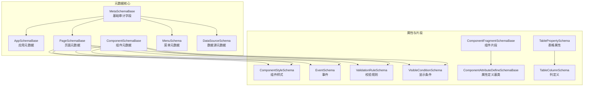

**图表来源**
- [MetaSchemaBase.cs:1-18](file://src/LowCode/Common/H.LowCode.MetaSchema/MetaSchemaBase.cs#L1-L18)
- [AppSchemaBase.cs:1-31](file://src/LowCode/Common/H.LowCode.MetaSchema/AppSchemaBase.cs#L1-L31)
- [PageSchemaBase.cs:1-40](file://src/LowCode/Common/H.LowCode.MetaSchema/PageSchemaBase.cs#L1-L40)
- [ComponentSchemaBase.cs:1-110](file://src/LowCode/Common/H.LowCode.MetaSchema/ComponentSchemaBase.cs#L1-L110)
- [MenuSchema.cs:1-37](file://src/LowCode/Common/H.LowCode.MetaSchema/MenuSchema.cs#L1-L37)
- [DataSourceSchema.cs:1-69](file://src/LowCode/Common/H.LowCode.MetaSchema/DataSourceSchema.cs#L1-L69)
- [ComponentStyleSchema.cs:1-38](file://src/LowCode/Common/H.LowCode.MetaSchema/PropertySchemas/ComponentStyleSchema.cs#L1-L38)
- [EventSchema.cs:1-66](file://src/LowCode/Common/H.LowCode.MetaSchema/PropertySchemas/EventSchema.cs#L1-L66)
- [ValidationRuleSchema.cs:1-172](file://src/LowCode/Common/H.LowCode.MetaSchema/PropertySchemas/ValidationRuleSchema.cs#L1-L172)
- [VisibleConditionSchema.cs:1-49](file://src/LowCode/Common/H.LowCode.MetaSchema/PropertySchemas/VisibleConditionSchema.cs#L1-L49)
- [ComponentFragmentSchemaBase.cs:1-82](file://src/LowCode/Common/H.LowCode.MetaSchema/PropertySchemas/ComponentFragmentSchemaBase.cs#L1-L82)
- [ComponentAttributeDefineSchemaBase.cs:1-25](file://src/LowCode/Common/H.LowCode.MetaSchema/PropertySchemas/ComponentAttributeDefineSchemaBase.cs#L1-L25)
- [TablePropertySchema.cs:1-24](file://src/LowCode/Common/H.LowCode.MetaSchema/PropertySchemas/TableSchemas/TablePropertySchema.cs#L1-L24)
- [TableColumnSchema.cs:1-34](file://src/LowCode/Common/H.LowCode.MetaSchema/PropertySchemas/TableSchemas/TableColumnSchema.cs#L1-L34)

**章节来源**
- [MetaSchemaBase.cs:1-18](file://src/LowCode/Common/H.LowCode.MetaSchema/MetaSchemaBase.cs#L1-L18)
- [AppSchemaBase.cs:1-31](file://src/LowCode/Common/H.LowCode.MetaSchema/AppSchemaBase.cs#L1-L31)
- [PageSchemaBase.cs:1-40](file://src/LowCode/Common/H.LowCode.MetaSchema/PageSchemaBase.cs#L1-L40)
- [ComponentSchemaBase.cs:1-110](file://src/LowCode/Common/H.LowCode.MetaSchema/ComponentSchemaBase.cs#L1-L110)
- [MenuSchema.cs:1-37](file://src/LowCode/Common/H.LowCode.MetaSchema/MenuSchema.cs#L1-L37)
- [DataSourceSchema.cs:1-69](file://src/LowCode/Common/H.LowCode.MetaSchema/DataSourceSchema.cs#L1-L69)

## 核心组件
- 基础审计元数据：提供创建者、修改者、创建与修改时间的 JSON 键映射，作为所有元数据的共同基类。
- 应用元数据：包含应用标识、名称、图标、图片、描述、排序、版本号与发布状态、支持平台列表。
- 页面元数据：包含所属应用、页面标识、名称、排序、页面类型、发布状态、页面属性、页面数据源与页面事件。
- 组件元数据：包含组件实例标识、父组件、名称、标签、组件类型、标题隐藏、容器标记、是否支持数据源、样式、事件、事件消费、校验规则和可见条件。
- 菜单元数据：包含所属应用、标识、父菜单、标题、菜单类型、图标、路径、排序与子菜单。
- 数据源元数据：包含所属应用、标识、名称、显示名、描述、排序、数据源类型、发布状态，以及按类型区分的表字段、API、选项或 SQL 等具体配置。

这些结构通过统一的 JSON 命名约定与强类型模型，确保设计时与运行时使用同一份契约。

**章节来源**
- [MetaSchemaBase.cs:1-18](file://src/LowCode/Common/H.LowCode.MetaSchema/MetaSchemaBase.cs#L1-L18)
- [AppSchemaBase.cs:1-31](file://src/LowCode/Common/H.LowCode.MetaSchema/AppSchemaBase.cs#L1-L31)
- [PageSchemaBase.cs:1-40](file://src/LowCode/Common/H.LowCode.MetaSchema/PageSchemaBase.cs#L1-L40)
- [ComponentSchemaBase.cs:1-110](file://src/LowCode/Common/H.LowCode.MetaSchema/ComponentSchemaBase.cs#L1-L110)
- [MenuSchema.cs:1-37](file://src/LowCode/Common/H.LowCode.MetaSchema/MenuSchema.cs#L1-L37)
- [DataSourceSchema.cs:1-69](file://src/LowCode/Common/H.LowCode.MetaSchema/DataSourceSchema.cs#L1-L69)

## 架构总览
H.AppLab 的元数据架构围绕“应用-页面-组件-数据源-菜单”展开。应用是顶层组织单元，页面属于应用，页面包含组件树；组件可绑定事件、校验规则与可见条件；页面和数据源可以配置数据来源（数据库、API、选项、SQL、表达式等）；菜单描述导航结构并与页面关联。

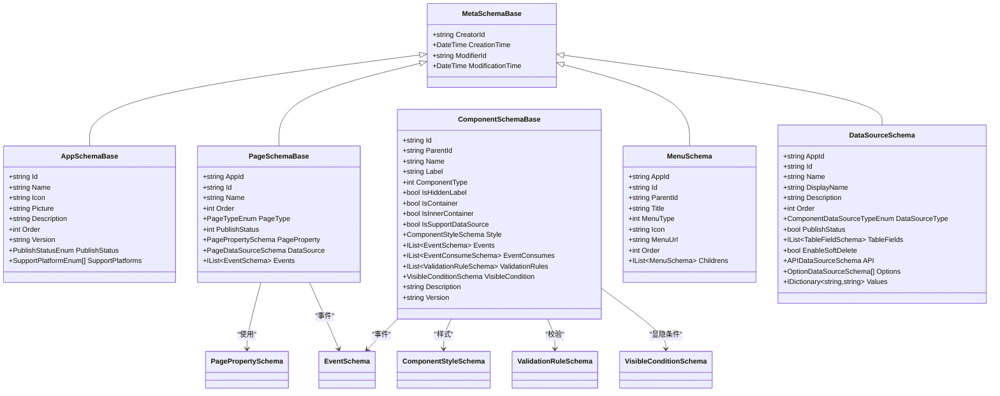

**图表来源**
- [MetaSchemaBase.cs:1-18](file://src/LowCode/Common/H.LowCode.MetaSchema/MetaSchemaBase.cs#L1-L18)
- [AppSchemaBase.cs:1-31](file://src/LowCode/Common/H.LowCode.MetaSchema/AppSchemaBase.cs#L1-L31)
- [PageSchemaBase.cs:1-40](file://src/LowCode/Common/H.LowCode.MetaSchema/PageSchemaBase.cs#L1-L40)
- [ComponentSchemaBase.cs:1-110](file://src/LowCode/Common/H.LowCode.MetaSchema/ComponentSchemaBase.cs#L1-L110)
- [MenuSchema.cs:1-37](file://src/LowCode/Common/H.LowCode.MetaSchema/MenuSchema.cs#L1-L37)
- [DataSourceSchema.cs:1-69](file://src/LowCode/Common/H.LowCode.MetaSchema/DataSourceSchema.cs#L1-L69)

## 详细组件分析

### 基础元数据与应用元数据
- 基础元数据：统一封装审计字段（创建者、创建时间、修改者、修改时间），JSON 键采用短命名（如 cid、ct、mid、mt）。
- 应用元数据：在基础之上增加应用标识、名称、图标、图片、描述、排序、版本与发布状态、支持平台数组。发布状态枚举包含开发、审批、已发布三态；支持平台枚举包含 Web、移动、小程序。

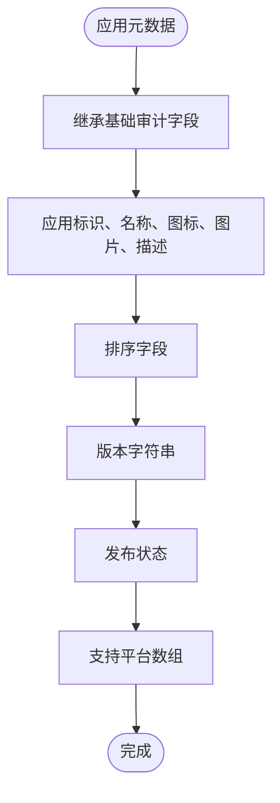

**图表来源**
- [MetaSchemaBase.cs:1-18](file://src/LowCode/Common/H.LowCode.MetaSchema/MetaSchemaBase.cs#L1-L18)
- [AppSchemaBase.cs:1-31](file://src/LowCode/Common/H.LowCode.MetaSchema/AppSchemaBase.cs#L1-L31)
- [PublishStatusEnum.cs:1-8](file://src/LowCode/Common/H.LowCode.MetaSchema/Enums/PublishStatusEnum.cs#L1-L8)
- [SupportPlatformEnum.cs:1-13](file://src/LowCode/Common/H.LowCode.MetaSchema/Enums/SupportPlatformEnum.cs#L1-L13)

**章节来源**
- [MetaSchemaBase.cs:1-18](file://src/LowCode/Common/H.LowCode.MetaSchema/MetaSchemaBase.cs#L1-L18)
- [AppSchemaBase.cs:1-31](file://src/LowCode/Common/H.LowCode.MetaSchema/AppSchemaBase.cs#L1-L31)
- [PublishStatusEnum.cs:1-8](file://src/LowCode/Common/H.LowCode.MetaSchema/Enums/PublishStatusEnum.cs#L1-L8)
- [SupportPlatformEnum.cs:1-13](file://src/LowCode/Common/H.LowCode.MetaSchema/Enums/SupportPlatformEnum.cs#L1-L13)

### 页面元数据
页面元数据承载页面级别的配置：
- 标识与归属：页面 Id 与所属应用 Id。
- 展示信息：名称、排序、页面类型（普通、表单、列表、报表）。
- 发布状态：页面级发布状态。
- 页面属性：页面布局、标题宽度、默认样式与自定义样式，以及页面数据源。
- 事件：页面级事件集合。

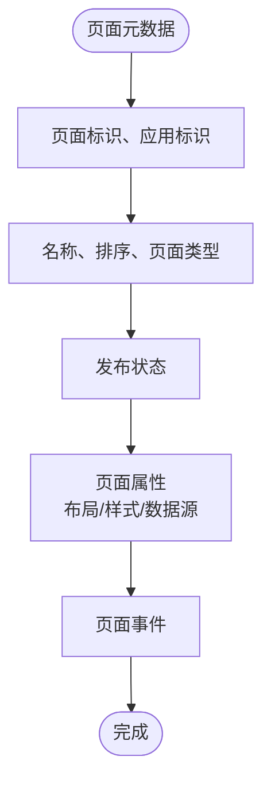

**图表来源**
- [PageSchemaBase.cs:1-40](file://src/LowCode/Common/H.LowCode.MetaSchema/PageSchemaBase.cs#L1-L40)
- [PagePropertySchema.cs:1-36](file://src/LowCode/Common/H.LowCode.MetaSchema/PropertySchemas/PagePropertySchema.cs#L1-L36)
- [PageTypeEnum.cs:1-15](file://src/LowCode/Common/H.LowCode.MetaSchema/Enums/PageTypeEnum.cs#L1-L15)

**章节来源**
- [PageSchemaBase.cs:1-40](file://src/LowCode/Common/H.LowCode.MetaSchema/PageSchemaBase.cs#L1-L40)
- [PagePropertySchema.cs:1-36](file://src/LowCode/Common/H.LowCode.MetaSchema/PropertySchemas/PagePropertySchema.cs#L1-L36)
- [PageTypeEnum.cs:1-15](file://src/LowCode/Common/H.LowCode.MetaSchema/Enums/PageTypeEnum.cs#L1-L15)

### 组件元数据
组件元数据描述组件实例的结构和行为：
- 实例标识与层级：Id 与 ParentId 构成组件树。
- 基本属性：Name、Label、ComponentType、IsHiddenLabel、IsContainer、IsInnerContainer。
- 数据源支持：容器组件不支持数据源；非容器可通过 IsSupportDataSource 控制。
- 样式：ItemWidth、ItemHeight、LabelWidth、DefaultStyle、CustomStyle。
- 事件：Events 与 EventConsumes，支持标准事件、自定义脚本、数据操作事件。
- 校验规则：ValidationRules，支持必填、长度、数值范围、正则、邮箱、手机、URL、身份证、自定义表达式等，并支持触发时机与顺序。
- 可见条件：VisibleCondition，基于表达式比较值与期望值实现显隐联动。
- 版本与描述：Version 默认 0.0.1，Description 可选。

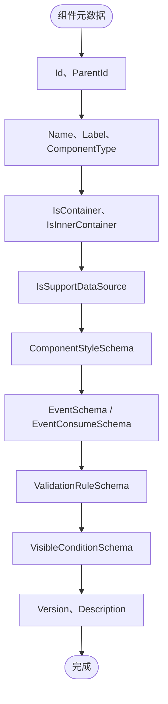

**图表来源**
- [ComponentSchemaBase.cs:1-110](file://src/LowCode/Common/H.LowCode.MetaSchema/ComponentSchemaBase.cs#L1-L110)
- [ComponentStyleSchema.cs:1-38](file://src/LowCode/Common/H.LowCode.MetaSchema/PropertySchemas/ComponentStyleSchema.cs#L1-L38)
- [EventSchema.cs:1-66](file://src/LowCode/Common/H.LowCode.MetaSchema/PropertySchemas/EventSchema.cs#L1-L66)
- [ValidationRuleSchema.cs:1-172](file://src/LowCode/Common/H.LowCode.MetaSchema/PropertySchemas/ValidationRuleSchema.cs#L1-L172)
- [VisibleConditionSchema.cs:1-49](file://src/LowCode/Common/H.LowCode.MetaSchema/PropertySchemas/VisibleConditionSchema.cs#L1-L49)

**章节来源**
- [ComponentSchemaBase.cs:1-110](file://src/LowCode/Common/H.LowCode.MetaSchema/ComponentSchemaBase.cs#L1-L110)
- [ComponentStyleSchema.cs:1-38](file://src/LowCode/Common/H.LowCode.MetaSchema/PropertySchemas/ComponentStyleSchema.cs#L1-L38)
- [EventSchema.cs:1-66](file://src/LowCode/Common/H.LowCode.MetaSchema/PropertySchemas/EventSchema.cs#L1-L66)
- [ValidationRuleSchema.cs:1-172](file://src/LowCode/Common/H.LowCode.MetaSchema/PropertySchemas/ValidationRuleSchema.cs#L1-L172)
- [VisibleConditionSchema.cs:1-49](file://src/LowCode/Common/H.LowCode.MetaSchema/PropertySchemas/VisibleConditionSchema.cs#L1-L49)

### 菜单元数据
菜单元数据描述应用的导航结构：
- 归属与层级：AppId、Id、ParentId 与 Childrens 形成树形结构。
- 展示信息：Title、Icon、MenuType（菜单/目录）、Order。
- 路由：MenuUrl 指向目标页面或外部地址。

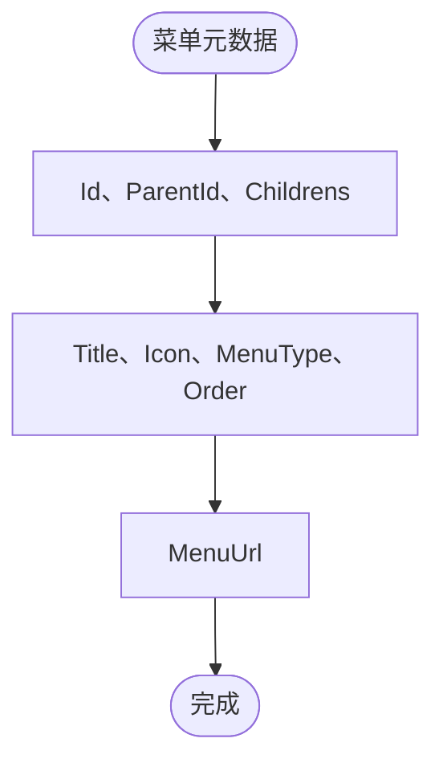

**图表来源**
- [MenuSchema.cs:1-37](file://src/LowCode/Common/H.LowCode.MetaSchema/MenuSchema.cs#L1-L37)

**章节来源**
- [MenuSchema.cs:1-37](file://src/LowCode/Common/H.LowCode.MetaSchema/MenuSchema.cs#L1-L37)

### 数据源元数据
数据源元数据支持多种数据接入方式：
- 通用字段：AppId、Id、Name、DisplayName、Description、Order、DataSourceType、PublishStatus。
- 表数据源：TableFields（字段定义）、EnableSoftDelete（软删除开关）。
- API 数据源：API 对象。
- 选项数据源：Options 数组、Values 字典。
- SQL 与表达式：根据类型扩展对应配置。

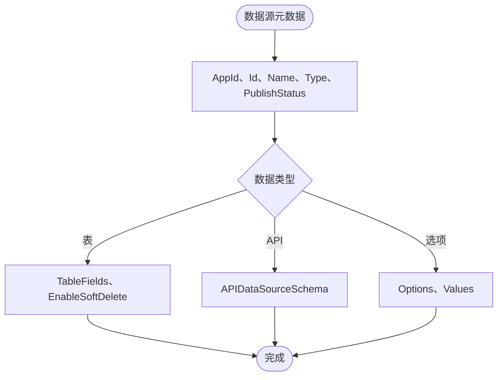

**图表来源**
- [DataSourceSchema.cs:1-69](file://src/LowCode/Common/H.LowCode.MetaSchema/DataSourceSchema.cs#L1-L69)

**章节来源**
- [DataSourceSchema.cs:1-69](file://src/LowCode/Common/H.LowCode.MetaSchema/DataSourceSchema.cs#L1-L69)

### 属性与片段
- 组件片段：TypeName、ValueType、Attributes、Content、Events、Resources（js/css 依赖）、InitFunction（初始化函数）。片段支持动态获取默认值。
- 属性定义基类：AttributeName、AttributeClrType、AttributeValue，用于描述组件属性的元数据。
- 表格属性：Columns、SearchItems、TopButtons、RowButtons。
- 表格列：Id、Name、Title、IsPrimaryKey、Order、Filterable、Sortable。

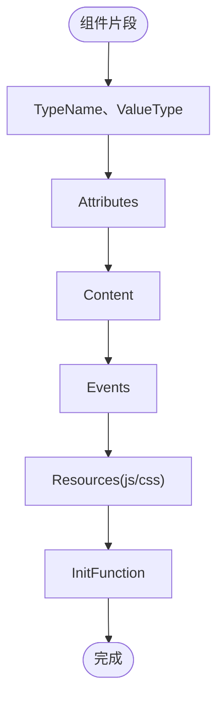

**图表来源**
- [ComponentFragmentSchemaBase.cs:1-82](file://src/LowCode/Common/H.LowCode.MetaSchema/PropertySchemas/ComponentFragmentSchemaBase.cs#L1-L82)
- [ComponentAttributeDefineSchemaBase.cs:1-25](file://src/LowCode/Common/H.LowCode.MetaSchema/PropertySchemas/ComponentAttributeDefineSchemaBase.cs#L1-L25)
- [TablePropertySchema.cs:1-24](file://src/LowCode/Common/H.LowCode.MetaSchema/PropertySchemas/TableSchemas/TablePropertySchema.cs#L1-L24)
- [TableColumnSchema.cs:1-34](file://src/LowCode/Common/H.LowCode.MetaSchema/PropertySchemas/TableSchemas/TableColumnSchema.cs#L1-L34)

**章节来源**
- [ComponentFragmentSchemaBase.cs:1-82](file://src/LowCode/Common/H.LowCode.MetaSchema/PropertySchemas/ComponentFragmentSchemaBase.cs#L1-L82)
- [ComponentAttributeDefineSchemaBase.cs:1-25](file://src/LowCode/Common/H.LowCode.MetaSchema/PropertySchemas/ComponentAttributeDefineSchemaBase.cs#L1-L25)
- [TablePropertySchema.cs:1-24](file://src/LowCode/Common/H.LowCode.MetaSchema/PropertySchemas/TableSchemas/TablePropertySchema.cs#L1-L24)
- [TableColumnSchema.cs:1-34](file://src/LowCode/Common/H.LowCode.MetaSchema/PropertySchemas/TableSchemas/TableColumnSchema.cs#L1-L34)

## 依赖关系分析
- 枚举依赖：PageTypeEnum、PublishStatusEnum、SupportPlatformEnum、ComponentValueTypeEnum、EventTargetTypeEnum、ComponentDataSourceTypeEnum、PageDataSourceTypeEnum、ComponentDataSourceGroupTypeEnum、EventDataActionTypeEnum。
- 模型依赖：PageSchemaBase 依赖 PagePropertySchema、PageDataSourceSchema、EventSchema；ComponentSchemaBase 依赖 ComponentStyleSchema、EventSchema、ValidationRuleSchema、VisibleConditionSchema；DataSourceSchema 依赖 APIDataSourceSchema、OptionDataSourceSchema、TableFieldSchema 等。
- 工具依赖：ObjectMerger 用于对象合并；ShortIdGenerator 用于生成页面 Id。

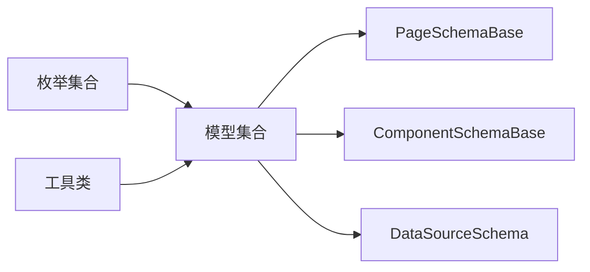

**图表来源**
- [PageTypeEnum.cs:1-15](file://src/LowCode/Common/H.LowCode.MetaSchema/Enums/PageTypeEnum.cs#L1-L15)
- [PublishStatusEnum.cs:1-8](file://src/LowCode/Common/H.LowCode.MetaSchema/Enums/PublishStatusEnum.cs#L1-L8)
- [SupportPlatformEnum.cs:1-13](file://src/LowCode/Common/H.LowCode.MetaSchema/Enums/SupportPlatformEnum.cs#L1-L13)
- [ComponentValueTypeEnum.cs:1-20](file://src/LowCode/Common/H.LowCode.MetaSchema/Enums/ComponentValueTypeEnum.cs#L1-L20)
- [EventTargetTypeEnum.cs:1-27](file://src/LowCode/Common/H.LowCode.MetaSchema/Enums/EventTargetTypeEnum.cs#L1-L27)
- [ComponentDataSourceTypeEnum.cs:1-15](file://src/LowCode/Common/H.LowCode.MetaSchema/Enums/ComponentDataSourceTypeEnum.cs#L1-L15)
- [PageDataSourceTypeEnum.cs:1-11](file://src/LowCode/Common/H.LowCode.MetaSchema/Enums/PageDataSourceTypeEnum.cs#L1-L11)
- [ComponentDataSourceGroupTypeEnum.cs:1-13](file://src/LowCode/Common/H.LowCode.MetaSchema/Enums/ComponentDataSourceGroupTypeEnum.cs#L1-L13)
- [EventDataActionTypeEnum.cs:1-23](file://src/LowCode/Common/H.LowCode.MetaSchema/Enums/EventDataActionTypeEnum.cs#L1-L23)

**章节来源**
- [PageSchemaBase.cs:1-40](file://src/LowCode/Common/H.LowCode.MetaSchema/PageSchemaBase.cs#L1-L40)
- [ComponentSchemaBase.cs:1-110](file://src/LowCode/Common/H.LowCode.MetaSchema/ComponentSchemaBase.cs#L1-L110)
- [DataSourceSchema.cs:1-69](file://src/LowCode/Common/H.LowCode.MetaSchema/DataSourceSchema.cs#L1-L69)

## 版本与兼容性
- 版本字段：应用与应用内实体（如组件）均包含 Version 字符串字段，用于区分元数据版本。
- 发布状态：应用与页面均有发布状态，用于区分开发、审批、已发布阶段；页面还维护独立的发布状态字段。
- 向后兼容策略：
  - JSON 键保持短命名（如 n、id、stl、evs、valrules、vcond），减少前端传输体积。
  - 新增字段应为可选或带默认值，避免破坏旧版本解析。
  - 枚举扩展应保持原有值不变，新增值从高位开始，避免改变已有语义。
- 数据迁移策略：
  - 当引入不兼容变更时，应升级 Version 并通过迁移逻辑将旧结构转换为新结构。
  - 对于组件 IsSupportDataSource 的逻辑约束（容器组件强制为 false），应在迁移过程中修正历史数据。
  - 对校验规则与事件进行规范化，例如缺失 Trigger 时默认为 Blur，缺失 RowDataParams 时为空映射。

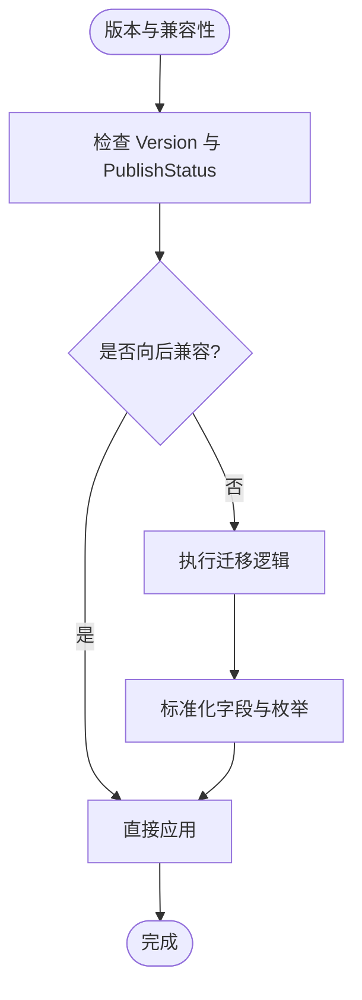

**图表来源**
- [AppSchemaBase.cs:1-31](file://src/LowCode/Common/H.LowCode.MetaSchema/AppSchemaBase.cs#L1-L31)
- [PageSchemaBase.cs:1-40](file://src/LowCode/Common/H.LowCode.MetaSchema/PageSchemaBase.cs#L1-L40)
- [ComponentSchemaBase.cs:1-110](file://src/LowCode/Common/H.LowCode.MetaSchema/ComponentSchemaBase.cs#L1-L110)
- [ValidationRuleSchema.cs:1-172](file://src/LowCode/Common/H.LowCode.MetaSchema/PropertySchemas/ValidationRuleSchema.cs#L1-L172)

**章节来源**
- [AppSchemaBase.cs:1-31](file://src/LowCode/Common/H.LowCode.MetaSchema/AppSchemaBase.cs#L1-L31)
- [PageSchemaBase.cs:1-40](file://src/LowCode/Common/H.LowCode.MetaSchema/PageSchemaBase.cs#L1-L40)
- [ComponentSchemaBase.cs:1-100](file://src/LowCode/Common/H.LowCode.MetaSchema/ComponentSchemaBase.cs#L1-L100)
- [ValidationRuleSchema.cs:1-172](file://src/LowCode/Common/H.LowCode.MetaSchema/PropertySchemas/ValidationRuleSchema.cs#L1-L172)

## 设计引擎与渲染引擎通信
设计引擎与渲染引擎共享同一套元数据模型，通过 JSON 序列化的 Schema 进行交互：
- 设计时：编辑器保存页面与组件的完整 Schema，包括布局、样式、事件、校验规则、可见条件、数据源与菜单。
- 运行时：渲染引擎读取 Schema，构建 UI 树，绑定数据源与事件，执行校验与显隐条件。
- 一致性保障：
  - 统一的 JSON 键与枚举定义，确保两端解析一致。
  - 组件 Fragment 与 Attributes 支持外部资源与初始化函数，便于设计时物料与运行时实例对齐。
  - 事件与事件消费明确目标与动作，避免歧义。

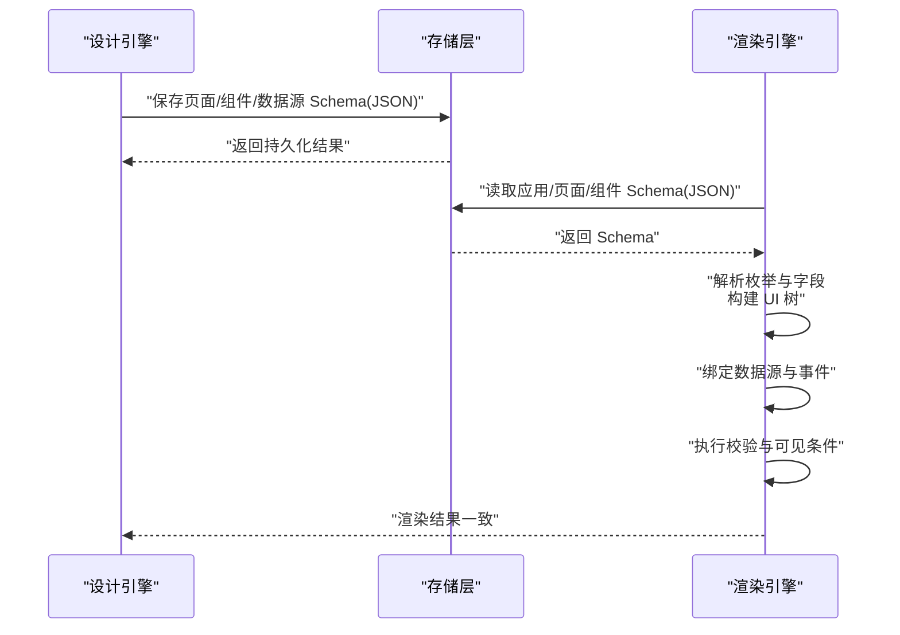

**图表来源**
- [EventSchema.cs:1-66](file://src/LowCode/Common/H.LowCode.MetaSchema/PropertySchemas/EventSchema.cs#L1-L66)
- [ComponentFragmentSchemaBase.cs:1-82](file://src/LowCode/Common/H.LowCode.MetaSchema/PropertySchemas/ComponentFragmentSchemaBase.cs#L1-L82)
- [ComponentStyleSchema.cs:1-38](file://src/LowCode/Common/H.LowCode.MetaSchema/PropertySchemas/ComponentStyleSchema.cs#L1-L38)
- [ValidationRuleSchema.cs:1-172](file://src/LowCode/Common/H.LowCode.MetaSchema/PropertySchemas/ValidationRuleSchema.cs#L1-L172)
- [VisibleConditionSchema.cs:1-49](file://src/LowCode/Common/H.LowCode.MetaSchema/PropertySchemas/VisibleConditionSchema.cs#L1-L49)

## Schema开发指南

### 定义新的组件类型
- 在组件元数据中设置 ComponentType 与 IsContainer 以区分原子组件与组合组件。
- 若组件需要数据绑定，确保 IsSupportDataSource 为 true（容器组件会自动禁用）。
- 通过 Style 定义尺寸与样式；通过 Events 与 EventConsumes 声明事件与消费方。
- 如需外部资源，使用 ComponentFragmentSchemaBase 的 Resources 与 InitFunction。

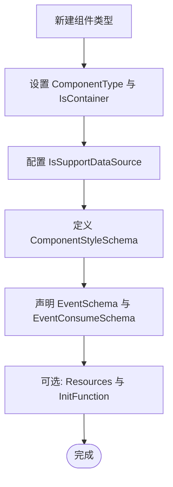

**图表来源**
- [ComponentSchemaBase.cs:1-110](file://src/LowCode/Common/H.LowCode.MetaSchema/ComponentSchemaBase.cs#L1-L110)
- [ComponentFragmentSchemaBase.cs:1-82](file://src/LowCode/Common/H.LowCode.MetaSchema/PropertySchemas/ComponentFragmentSchemaBase.cs#L1-L82)

**章节来源**
- [ComponentSchemaBase.cs:1-110](file://src/LowCode/Common/H.LowCode.MetaSchema/ComponentSchemaBase.cs#L1-L110)
- [ComponentFragmentSchemaBase.cs:1-82](file://src/LowCode/Common/H.LowCode.MetaSchema/PropertySchemas/ComponentFragmentSchemaBase.cs#L1-L82)

### 定义新的属性类型
- 使用 ComponentAttributeDefineSchemaBase 描述属性名称、CLR 类型与值。
- 在 ComponentFragmentSchemaBase.Attributes 中列举属性片段，结合 ValueType 与 AttributeClrType 实现类型安全。
- 对复杂属性可使用 TablePropertySchema 与 TableColumnSchema 描述表格相关结构。

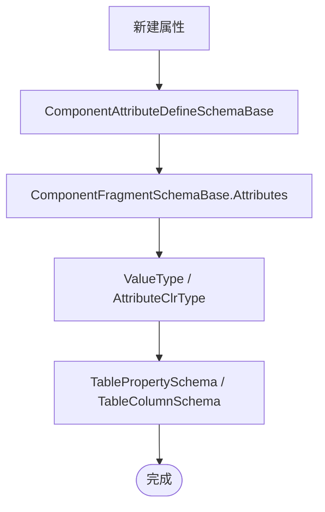

**图表来源**
- [ComponentAttributeDefineSchemaBase.cs:1-25](file://src/LowCode/Common/H.LowCode.MetaSchema/PropertySchemas/ComponentAttributeDefineSchemaBase.cs#L1-L25)
- [ComponentFragmentSchemaBase.cs:1-82](file://src/LowCode/Common/H.LowCode.MetaSchema/PropertySchemas/ComponentFragmentSchemaBase.cs#L1-L82)
- [TablePropertySchema.cs:1-24](file://src/LowCode/Common/H.LowCode.MetaSchema/PropertySchemas/TableSchemas/TablePropertySchema.cs#L1-L24)
- [TableColumnSchema.cs:1-34](file://src/LowCode/Common/H.LowCode.MetaSchema/PropertySchemas/TableSchemas/TableColumnSchema.cs#L1-L34)

**章节来源**
- [ComponentAttributeDefineSchemaBase.cs:1-25](file://src/LowCode/Common/H.LowCode.MetaSchema/PropertySchemas/ComponentAttributeDefineSchemaBase.cs#L1-L25)
- [ComponentFragmentSchemaBase.cs:1-82](file://src/LowCode/Common/H.LowCode.MetaSchema/PropertySchemas/ComponentFragmentSchemaBase.cs#L1-L82)
- [TablePropertySchema.cs:1-24](file://src/LowCode/Common/H.LowCode.MetaSchema/PropertySchemas/TableSchemas/TablePropertySchema.cs#L1-L24)
- [TableColumnSchema.cs:1-34](file://src/LowCode/Common/H.LowCode.MetaSchema/PropertySchemas/TableSchemas/TableColumnSchema.cs#L1-L34)

### 定义新的验证规则
- 使用 ValidationRuleSchema 添加校验规则，指定 RuleType、Trigger、ErrorMessage 等。
- 支持必填、长度、数值范围、正则、邮箱、手机、URL、身份证与自定义表达式。
- 合理设置 Order 以控制校验顺序，避免相互覆盖。

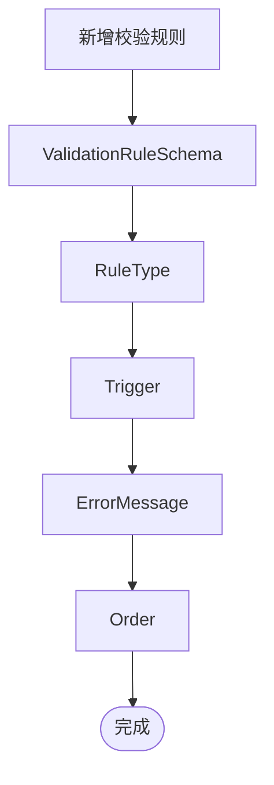

**图表来源**
- [ValidationRuleSchema.cs:1-172](file://src/LowCode/Common/H.LowCode.MetaSchema/PropertySchemas/ValidationRuleSchema.cs#L1-L172)

**章节来源**
- [ValidationRuleSchema.cs:1-172](file://src/LowCode/Common/H.LowCode.MetaSchema/PropertySchemas/ValidationRuleSchema.cs#L1-L172)

## 存储格式、序列化与性能
- 存储格式：所有元数据均以 JSON 形式持久化，键名短小且具有一致性（如 n、id、stl、evs、valrules、vcond）。
- 序列化机制：使用 System.Text.Json.Serialization 的 JsonPropertyName 特性进行字段映射。
- 性能优化建议：
  - 优先使用轻量字段与默认值，减少空值传输。
  - 合理使用分页与懒加载，特别是长列表与大量组件树。
  - 对大对象（如表格列、搜索项、按钮）进行分组与按需加载。
  - 避免在频繁渲染路径中进行重型计算，尽量将复杂逻辑放在后端或服务端处理。
  - 使用 ObjectMerger 进行增量更新，减少全量替换带来的开销。

**章节来源**
- [ComponentSchemaBase.cs:1-110](file://src/LowCode/Common/H.LowCode.MetaSchema/ComponentSchemaBase.cs#L1-L110)
- [EventSchema.cs:1-66](file://src/LowCode/Common/H.LowCode.MetaSchema/PropertySchemas/EventSchema.cs#L1-L66)
- [ValidationRuleSchema.cs:1-172](file://src/LowCode/Common/H.LowCode.MetaSchema/PropertySchemas/ValidationRuleSchema.cs#L1-L172)
- [VisibleConditionSchema.cs:1-49](file://src/LowCode/Common/H.LowCode.MetaSchema/PropertySchemas/VisibleConditionSchema.cs#L1-L49)

## 示例与最佳实践

### 应用与页面示例
- 应用示例：参考 caseapp.json，了解应用的基本字段与结构。
- 页面示例：参考 apps/caseapp/page 下的页面 JSON，观察页面属性、数据源与事件的组织方式。

**章节来源**
- [caseapp.json](file://src/LowCode/meta/apps/caseapp/caseapp.json)

### 组件示例
- 组件示例：参考 button.json，观察组件的 Id、Name、Style、Events、ValidationRules、VisibleCondition 等字段的实际用法。

**章节来源**
- [button.json](file://src/LowCode/meta/parts/componentParts/default/button.json)

### 最佳实践清单
- 为每个组件设置唯一 Id，并确保父子关系清晰。
- 使用统一的枚举值，避免随意扩展导致解析歧义。
- 对事件目标与动作进行明确命名，便于调试与维护。
- 校验规则要最小化且必要，避免过度校验影响用户体验。
- 使用 VisibleCondition 控制显隐，减少不必要的 DOM 渲染。
- 对大型页面与组件树进行分块与懒加载，提升首屏性能。
- 在迁移时升级 Version，并提供回滚方案。

## 故障排查
- 组件无法渲染：
  - 检查组件 Id 与 ParentId 是否正确，是否存在循环引用。
  - 确认 IsContainer 与 IsSupportDataSource 的设置是否符合预期。
- 事件未触发：
  - 检查 EventName、EventTargetId、EventTargetAction 是否匹配。
  - 确认事件消费方存在且名称一致。
- 校验不生效：
  - 检查 RuleType、Trigger 与 ErrorMessage 是否配置正确。
  - 确认校验规则启用（IsEnabled）且 Order 合理。
- 显隐条件无效：
  - 检查 ValueExpr、Op、ExpectExpr 是否为空或语法错误。
  - 确保表达式能访问到正确的数据上下文。

**章节来源**
- [ComponentSchemaBase.cs:1-110](file://src/LowCode/Common/H.LowCode.MetaSchema/ComponentSchemaBase.cs#L1-L110)
- [EventSchema.cs:1-66](file://src/LowCode/Common/H.LowCode.MetaSchema/PropertySchemas/EventSchema.cs#L1-L66)
- [ValidationRuleSchema.cs:1-172](file://src/LowCode/Common/H.LowCode.MetaSchema/PropertySchemas/ValidationRuleSchema.cs#L1-L172)
- [VisibleConditionSchema.cs:1-49](file://src/LowCode/Common/H.LowCode.MetaSchema/PropertySchemas/VisibleConditionSchema.cs#L1-L49)

## 结论
H.AppLab 的元数据 Schema 通过统一的模型与 JSON 契约，将设计时与运行时解耦，确保数据一致性与可扩展性。通过规范的应用、页面、组件、菜单与数据源结构，配合版本管理与迁移策略，平台能够稳定演进并支持丰富的业务场景。开发者可依据本文档快速定义新组件类型、属性类型与验证规则，并在设计引擎与渲染引擎之间保持一致的数据流。