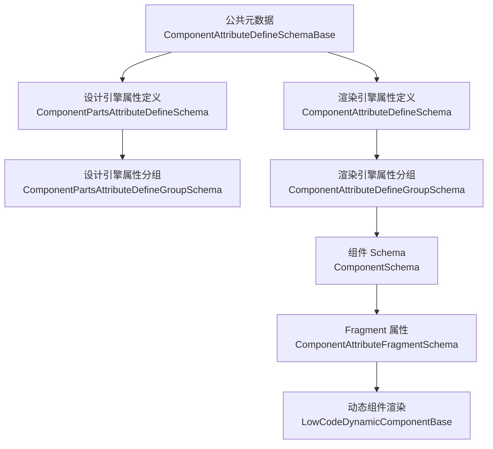
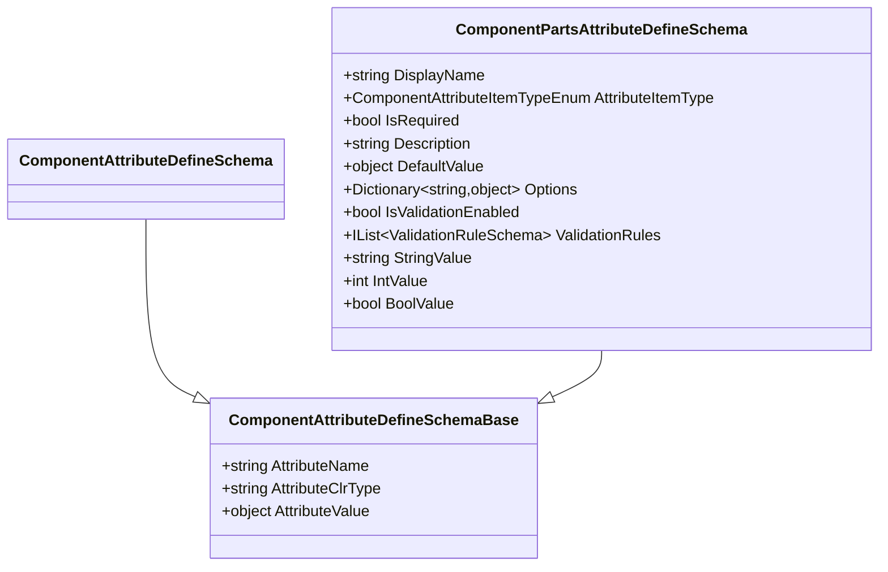
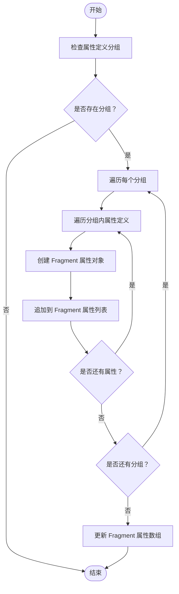
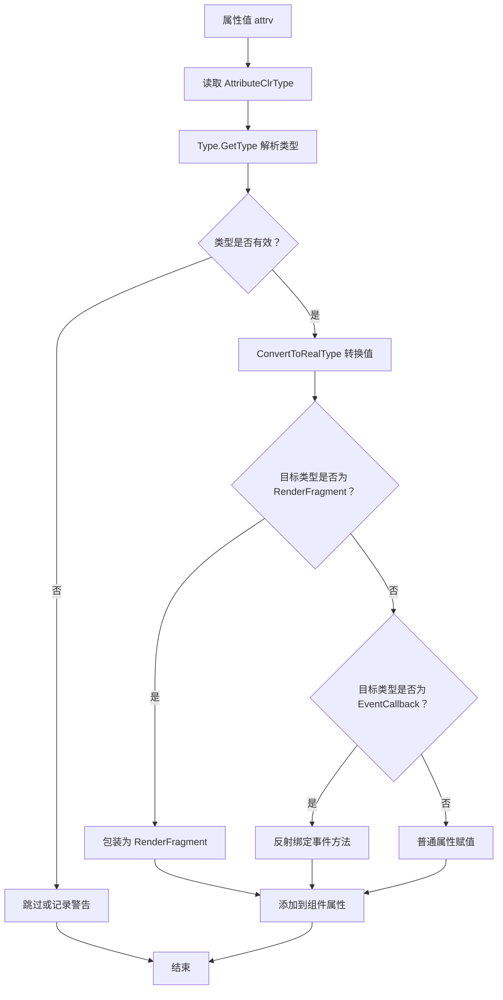
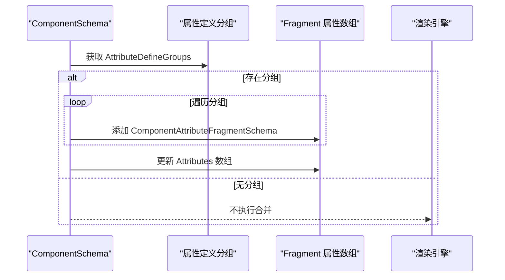

# 属性Schema规范

<cite>
**本文引用的文件**   
- [ComponentAttributeDefineSchemaBase.cs](file://src/LowCode/Common/H.LowCode.MetaSchema/PropertySchemas/ComponentAttributeDefineSchemaBase.cs)
- [ComponentAttributeDefineSchema.cs](file://src/LowCode/Common/H.LowCode.MetaSchema.RenderEngine/PropertySchemas/ComponentAttributeDefineSchema.cs)
- [ComponentAttributeDefineGroupSchema.cs](file://src/LowCode/Common/H.LowCode.MetaSchema.RenderEngine/PropertySchemas/ComponentAttributeDefineGroupSchema.cs)
- [ComponentPartsAttributeDefineSchema.cs](file://src/LowCode/Common/H.LowCode.MetaSchema.DesignEngine/PropertySchemas/ComponentPartsAttributeDefineSchema.cs)
- [ComponentPartsAttributeDefineGroupSchema.cs](file://src/LowCode/Common/H.LowCode.MetaSchema.DesignEngine/PropertySchemas/ComponentPartsAttributeDefineGroupSchema.cs)
- [ComponentAttributeItemTypeEnum.cs](file://src/LowCode/Common/H.LowCode.MetaSchema.DesignEngine/Enums/ComponentAttributeItemTypeEnum.cs)
- [ValidationRuleSchema.cs](file://src/LowCode/Common/H.LowCode.MetaSchema/PropertySchemas/ValidationRuleSchema.cs)
- [ComponentFragmentSchemaBase.cs](file://src/LowCode/Common/H.LowCode.MetaSchema/PropertySchemas/ComponentFragmentSchemaBase.cs)
- [ComponentSchema.cs](file://src/LowCode/Common/H.LowCode.MetaSchema.RenderEngine/ComponentSchema.cs)
- [ComponentPartsSchema.cs](file://src/LowCode/Common/H.LowCode.MetaSchema.DesignEngine/ComponentPartsSchema.cs)
- [LowCodeDynamicComponentBase.cs](file://src/LowCode/Common/H.LowCode.ComponentBase/LowCodeDynamicComponentBase.cs)
- [ObjectExtension.cs](file://src/Utils/H.Util.Base/ObjectExtension.cs)
</cite>

## 目录
1. [引言](#引言)
2. [项目结构定位](#项目结构定位)
3. [核心概念与基础模型](#核心概念与基础模型)
4. [设计引擎与渲染引擎的属性定义差异](#设计引擎与渲染引擎的属性定义差异)
5. [属性分组组织方式](#属性分组组织方式)
6. [属性值的数据类型系统](#属性值的数据类型系统)
7. [从属性定义到 Fragment 属性的转换过程](#从属性定义到-fragment-属性的转换过程)
8. [属性值的序列化与反序列化机制](#属性值的序列化与反序列化机制)
9. [完整属性 Schema 示例](#完整属性-schema-示例)
10. [属性验证、默认值与动态属性生成](#属性验证默认值与动态属性生成)
11. [复杂属性类型的处理方法](#复杂属性类型的处理方法)
12. [性能优化建议](#性能优化建议)
13. [故障排查指南](#故障排查指南)
14. [结论](#结论)

## 引言
本技术规范面向 H.AppLab 低代码平台的组件属性 Schema，重点解释 `ComponentAttributeDefineSchemaBase` 的设计动机、属性名称与 CLR 类型约定、属性值数据类型体系，以及设计引擎和渲染引擎中属性定义的差异化实现。文档同时说明属性分组组织方式、属性定义到 Fragment 属性的转换流程、属性值序列化与反序列化机制，并给出可落地的最佳实践、示例、异常处理与性能优化建议。

## 项目结构定位
属性 Schema 相关能力分布在三个层次：
- 公共元数据层：提供基础抽象与通用数据结构，例如 `ComponentAttributeDefineSchemaBase`、`ComponentFragmentSchemaBase`、`ValidationRuleSchema`。
- 设计引擎层：用于设计器展示与编辑，扩展显示名、控件类型、必填、默认值、选项、校验开关等设计期信息。
- 渲染引擎层：用于运行时将属性定义转换为 Fragment 属性，最终驱动 Blazor 动态组件渲染。

**图示来源**
- [ComponentAttributeDefineSchemaBase.cs:1-25](file://src/LowCode/Common/H.LowCode.MetaSchema/PropertySchemas/ComponentAttributeDefineSchemaBase.cs#L1-L25)
- [ComponentPartsAttributeDefineSchema.cs:1-98](file://src/LowCode/Common/H.LowCode.MetaSchema.DesignEngine/PropertySchemas/ComponentPartsAttributeDefineSchema.cs#L1-L98)
- [ComponentAttributeDefineSchema.cs:1-6](file://src/LowCode/Common/H.LowCode.MetaSchema.RenderEngine/PropertySchemas/ComponentAttributeDefineSchema.cs#L1-L6)
- [ComponentAttributeDefineGroupSchema.cs:1-9](file://src/LowCode/Common/H.LowCode.MetaSchema.RenderEngine/PropertySchemas/ComponentAttributeDefineGroupSchema.cs#L1-L9)
- [ComponentPartsAttributeDefineGroupSchema.cs:1-12](file://src/LowCode/Common/H.LowCode.MetaSchema.DesignEngine/PropertySchemas/ComponentPartsAttributeDefineGroupSchema.cs#L1-L12)
- [ComponentSchema.cs:1-83](file://src/LowCode/Common/H.LowCode.MetaSchema.RenderEngine/ComponentSchema.cs#L1-L83)
- [ComponentFragmentSchemaBase.cs:1-82](file://src/LowCode/Common/H.LowCode.MetaSchema/PropertySchemas/ComponentFragmentSchemaBase.cs#L1-L82)
- [LowCodeDynamicComponentBase.cs:1-134](file://src/LowCode/Common/H.LowCode.ComponentBase/LowCodeDynamicComponentBase.cs#L1-L134)

**章节来源**
- [ComponentAttributeDefineSchemaBase.cs:1-25](file://src/LowCode/Common/H.LowCode.MetaSchema/PropertySchemas/ComponentAttributeDefineSchemaBase.cs#L1-L25)
- [ComponentSchema.cs:1-83](file://src/LowCode/Common/H.LowCode.MetaSchema.RenderEngine/ComponentSchema.cs#L1-L83)

## 核心概念与基础模型
### ComponentAttributeDefineSchemaBase
该基类是所有属性定义的公共起点，统一了以下三要素：
- 属性名称：对应目标组件上的真实属性名。
- CLR 类型：以字符串形式描述属性值的 .NET 类型。
- 属性值：承载具体值，类型为 object，支持 JSON 中的任意可序列化值。

JSON 键约定为：
- `attrn`：属性名称。
- `attrt`：CLR 类型全名。
- `attrv`：属性值。

该设计使属性定义与具体引擎解耦，既可用于设计器，也可用于运行时。

**章节来源**
- [ComponentAttributeDefineSchemaBase.cs:1-25](file://src/LowCode/Common/H.LowCode.MetaSchema/PropertySchemas/ComponentAttributeDefineSchemaBase.cs#L1-L25)

### ComponentAttributeFragmentSchema
Fragment 是运行时使用的轻量属性载体，结构与基类高度一致，但更贴近渲染阶段使用：
- `attrn`：属性名称。
- `attrt`：CLR 类型。
- `attrv`：属性值。

它由 `ComponentSchema.MergeAttributeDefineToFragment` 从属性定义合并而来，随后被 `LowCodeDynamicComponentBase` 解析并注入到 Blazor 动态组件中。

**章节来源**
- [ComponentFragmentSchemaBase.cs:45-82](file://src/LowCode/Common/H.LowCode.MetaSchema/PropertySchemas/ComponentFragmentSchemaBase.cs#L45-L82)

## 设计引擎与渲染引擎的属性定义差异
### 渲染引擎属性定义：ComponentAttributeDefineSchema
渲染引擎属性定义继承自基类，但不增加额外字段。其职责是携带属性名称、CLR 类型和属性值，供运行时合并到 Fragment 并驱动组件渲染。

**章节来源**
- [ComponentAttributeDefineSchema.cs:1-6](file://src/LowCode/Common/H.LowCode.MetaSchema.RenderEngine/PropertySchemas/ComponentAttributeDefineSchema.cs#L1-L6)

### 设计引擎属性定义：ComponentPartsAttributeDefineSchema
设计引擎属性定义在基类之上扩展了大量编辑器友好字段：
- `disn`：显示名。
- `pt`：设置项类型，决定编辑器控件。
- `required`：是否必填。
- `desc`：描述。
- `dftval`：默认值。
- `ops`：选项字典。
- `enableval`：是否启用校验。
- `valrules`：校验规则集合。
- `StringValue`、`IntValue`、`BoolValue`：便捷访问器，基于 `AttributeValue` 进行类型转换。

这些字段仅在设计器和设计态 Schema 中出现，不参与运行时的属性注入。

**图示来源**
- [ComponentAttributeDefineSchemaBase.cs:1-25](file://src/LowCode/Common/H.LowCode.MetaSchema/PropertySchemas/ComponentAttributeDefineSchemaBase.cs#L1-L25)
- [ComponentAttributeDefineSchema.cs:1-6](file://src/LowCode/Common/H.LowCode.MetaSchema.RenderEngine/PropertySchemas/ComponentAttributeDefineSchema.cs#L1-L6)
- [ComponentPartsAttributeDefineSchema.cs:1-98](file://src/LowCode/Common/H.LowCode.MetaSchema.DesignEngine/PropertySchemas/ComponentPartsAttributeDefineSchema.cs#L1-L98)

**章节来源**
- [ComponentPartsAttributeDefineSchema.cs:1-98](file://src/LowCode/Common/H.LowCode.MetaSchema.DesignEngine/PropertySchemas/ComponentPartsAttributeDefineSchema.cs#L1-L98)

## 属性分组组织方式
属性定义通常按“组”组织，便于设计器分类展示与运行时批量合并。

- 渲染引擎分组：`ComponentAttributeDefineGroupSchema` 持有 `ComponentAttributeDefineSchema[]`。
- 设计引擎分组：`ComponentPartsAttributeDefineGroupSchema` 包含分组名 `GroupName` 和设计期属性定义数组。

组件 Schema 通过 `AttributeDefineGroups` 承载多个分组，并在运行时调用 `MergeAttributeDefineToFragment` 将所有属性定义扁平化为 Fragment 属性列表。

**图示来源**
- [ComponentSchema.cs:40-83](file://src/LowCode/Common/H.LowCode.MetaSchema.RenderEngine/ComponentSchema.cs#L40-L83)
- [ComponentAttributeDefineGroupSchema.cs:1-9](file://src/LowCode/Common/H.LowCode.MetaSchema.RenderEngine/PropertySchemas/ComponentAttributeDefineGroupSchema.cs#L1-L9)

**章节来源**
- [ComponentAttributeDefineGroupSchema.cs:1-9](file://src/LowCode/Common/H.LowCode.MetaSchema.RenderEngine/PropertySchemas/ComponentAttributeDefineGroupSchema.cs#L1-L9)
- [ComponentPartsAttributeDefineGroupSchema.cs:1-12](file://src/LowCode/Common/H.LowCode.MetaSchema.DesignEngine/PropertySchemas/ComponentPartsAttributeDefineGroupSchema.cs#L1-L12)
- [ComponentSchema.cs:1-83](file://src/LowCode/Common/H.LowCode.MetaSchema.RenderEngine/ComponentSchema.cs#L1-L83)

## 属性值的数据类型系统
属性值系统围绕三个关键约定展开：
1. **CLR 类型字符串**：`AttributeClrType` 保存完整 .NET 类型名，如 `System.String`、`System.Int32`、枚举全名或自定义类型。
2. **运行时类型解析**：Blazor 动态组件通过 `Type.GetType` 解析类型，再结合 `ConvertToRealType` 把 JSON 值转换为目标类型。
3. **特殊属性处理**：`RenderFragment` 作为子内容注入；`EventCallback` 通过方法反射绑定事件回调；其他简单属性直接赋值。

数据类型支持范围包括：
- 基本类型：字符串、数值、布尔值。
- 枚举类型：通过字符串名称解析。
- 可空类型：底层类型解析后赋默认值或转换结果。
- 复杂对象：JSON 对象或数组会被转换为字典或列表，再由 `ConvertToRealType` 返回相应结构。

**图示来源**
- [LowCodeDynamicComponentBase.cs:28-134](file://src/LowCode/Common/H.LowCode.ComponentBase/LowCodeDynamicComponentBase.cs#L28-L134)
- [ObjectExtension.cs:18-63](file://src/Utils/H.Util.Base/ObjectExtension.cs#L18-L63)

**章节来源**
- [LowCodeDynamicComponentBase.cs:1-134](file://src/LowCode/Common/H.LowCode.ComponentBase/LowCodeDynamicComponentBase.cs#L1-L134)
- [ObjectExtension.cs:1-105](file://src/Utils/H.Util.Base/ObjectExtension.cs#L1-L105)

## 从属性定义到 Fragment 属性的转换过程
渲染引擎中，`ComponentSchema.MergeAttributeDefineToFragment` 负责将设计期的属性定义合并到运行时 Fragment：
1. 若存在属性定义分组且非空，则初始化或复用现有 Fragment 属性列表。
2. 遍历每个分组的每个属性定义。
3. 将 `AttributeName`、`AttributeClrType`、`AttributeValue` 复制到 `ComponentAttributeFragmentSchema`。
4. 追加到 Fragment 属性数组。
5. 若有新增，则写回 `Fragment.Attributes`。

该过程保证设计器的属性配置能够稳定落地到运行时。

**图示来源**
- [ComponentSchema.cs:40-83](file://src/LowCode/Common/H.LowCode.MetaSchema.RenderEngine/ComponentSchema.cs#L40-L83)

**章节来源**
- [ComponentSchema.cs:1-83](file://src/LowCode/Common/H.LowCode.MetaSchema.RenderEngine/ComponentSchema.cs#L1-L83)

## 属性值的序列化与反序列化机制
属性值在 JSON 中以 `attrv` 表示，类型是 object，允许任意可序列化值。运行时通过以下步骤完成反序列化与类型转换：
- `ObjectExtension.ConvertToRealType` 接收原始值和目标类型。
- 若值为 null，返回目标类型的默认值。
- 若值已是目标类型实例，直接返回。
- 对 `JsonElement` 做特殊处理，提取字符串或数字原始文本。
- 对枚举类型使用 `Enum.Parse` 解析。
- 对其他类型使用 `Convert.ChangeType` 转换。
- 转换失败时返回 null，避免抛出异常中断渲染。

此外，设计引擎的便捷属性访问器 `StringValue`、`IntValue`、`BoolValue` 也会调用 `ConvertToRealType` 将 `AttributeValue` 转换为常用类型，方便设计器 UI 展示。

**章节来源**
- [ObjectExtension.cs:18-63](file://src/Utils/H.Util.Base/ObjectExtension.cs#L18-L63)
- [ComponentPartsAttributeDefineSchema.cs:47-98](file://src/LowCode/Common/H.LowCode.MetaSchema.DesignEngine/PropertySchemas/ComponentPartsAttributeDefineSchema.cs#L47-L98)

## 完整属性 Schema 示例
以下示例展示不同数据类型属性的定义方式。所有属性均遵循基类的 JSON 键约定：`attrn`、`attrt`、`attrv`。

- 字符串属性
  - `attrn`：组件上真实属性名，例如 `Title`。
  - `attrt`：`System.String`。
  - `attrv`：字符串值。

- 整数属性
  - `attrn`：例如 `Count`。
  - `attrt`：`System.Int32`。
  - `attrv`：整数。

- 布尔属性
  - `attrn`：例如 `Visible`。
  - `attrt`：`System.Boolean`。
  - `attrv`：布尔值。

- 枚举属性
  - `attrn`：例如 `Status`。
  - `attrt`：枚举的全限定类型名。
  - `attrv`：枚举名称字符串。

- 复杂对象属性
  - `attrn`：例如 `Config`。
  - `attrt`：自定义对象类型全名。
  - `attrv`：JSON 对象，键名需与目标对象的属性匹配。

- 数组属性
  - `attrn`：例如 `Items`。
  - `attrt`：泛型数组或列表类型全名。
  - `attrv`：JSON 数组，元素类型与目标类型一致。

- 事件回调属性
  - `attrn`：例如 `OnClick`。
  - `attrt`：`Microsoft.AspNetCore.Components.EventCallback`。
  - `attrv`：当前组件中的方法名字符串，用于反射绑定。

- 子内容属性
  - `attrn`：例如 `ChildContent`。
  - `attrt`：`Microsoft.AspNetCore.Components.RenderFragment`。
  - `attrv`：子节点内容字符串，运行时会被包装成 `RenderFragment`。

注意：上述示例仅为结构化描述，实际 JSON 键必须严格使用 `attrn`、`attrt`、`attrv`。

**章节来源**
- [ComponentAttributeDefineSchemaBase.cs:1-25](file://src/LowCode/Common/H.LowCode.MetaSchema/PropertySchemas/ComponentAttributeDefineSchemaBase.cs#L1-L25)
- [ComponentFragmentSchemaBase.cs:45-82](file://src/LowCode/Common/H.LowCode.MetaSchema/PropertySchemas/ComponentFragmentSchemaBase.cs#L45-L82)
- [LowCodeDynamicComponentBase.cs:48-134](file://src/LowCode/Common/H.LowCode.ComponentBase/LowCodeDynamicComponentBase.cs#L48-L134)

## 属性验证、默认值与动态属性生成
### 属性验证
设计引擎属性定义支持通过 `ValidationRuleSchema` 配置校验规则：
- 规则标识 `id`。
- 关联组件 `cid`。
- 是否启用 `enabled`。
- 规则类型 `type`，包括必填、长度、数值范围、正则、邮箱、手机号、URL、身份证、自定义表达式等。
- 触发时机 `trigger`，包括失焦、改变、提交。
- 排序 `order`。

属性定义本身可通过 `IsValidationEnabled` 开启校验，并通过 `ValidationRules` 指定规则集合。

**章节来源**
- [ComponentPartsAttributeDefineSchema.cs:12-46](file://src/LowCode/Common/H.LowCode.MetaSchema.DesignEngine/PropertySchemas/ComponentPartsAttributeDefineSchema.cs#L12-L46)
- [ValidationRuleSchema.cs:1-172](file://src/LowCode/Common/H.LowCode.MetaSchema/PropertySchemas/ValidationRuleSchema.cs#L1-L172)

### 默认值
- 设计期默认值：`DefaultValue` 字段用于设计器初始值。
- 运行时默认值：当 `AttributeValue` 为 null 时，`ConvertToRealType` 会返回目标类型的默认值。
- Fragment 默认值：`ComponentFragmentSchemaBase.GetDefaultValue` 根据 `ValueType` 字符串解析类型并返回默认值。

**章节来源**
- [ComponentPartsAttributeDefineSchema.cs:29-46](file://src/LowCode/Common/H.LowCode.MetaSchema.DesignEngine/PropertySchemas/ComponentPartsAttributeDefineSchema.cs#L29-L46)
- [ObjectExtension.cs:18-63](file://src/Utils/H.Util.Base/ObjectExtension.cs#L18-L63)
- [ComponentFragmentSchemaBase.cs:18-44](file://src/LowCode/Common/H.LowCode.MetaSchema/PropertySchemas/ComponentFragmentSchemaBase.cs#L18-L44)

### 动态属性生成
设计引擎中存在动态属性生成能力，例如 AI 生成应用服务或动态组件基类会根据上下文生成属性定义。最佳实践是：
- 始终确保生成的 `AttributeName` 对应组件真实属性。
- 明确设置 `AttributeClrType`。
- 为可空属性提供合理默认值。
- 为选择类属性提供 `Options`，以便设计器渲染下拉或单选控件。

**章节来源**
- [ComponentPartsSchema.cs:1-200](file://src/LowCode/Common/H.LowCode.MetaSchema.DesignEngine/ComponentPartsSchema.cs#L1-L200)

## 复杂属性类型的处理方法
对于复杂对象和集合类型，建议如下：
- 使用完整的 .NET 类型名作为 `AttributeClrType`。
- 使用 JSON 对象或数组作为 `AttributeValue`。
- 确保对象属性名与目标类型完全一致。
- 若目标类型为泛型集合，需明确泛型参数类型。
- 复杂类型转换失败时，框架会返回 null，调用方应提供降级策略，例如使用空对象或空集合。

此外，设计器侧可使用 `ComponentAttributeItemTypeEnum` 控制编辑器控件：
- 输入框、数字输入、单选、复选框、下拉、开关、日期、文本域、选项表、表格等。

**章节来源**
- [ComponentAttributeItemTypeEnum.cs:1-16](file://src/LowCode/Common/H.LowCode.MetaSchema.DesignEngine/Enums/ComponentAttributeItemTypeEnum.cs#L1-L16)
- [ObjectExtension.cs:64-105](file://src/Utils/H.Util.Base/ObjectExtension.cs#L64-L105)

## 性能优化建议
- 减少不必要的属性定义：仅在需要时使用属性分组，避免大量无用属性参与合并。
- 缓存类型解析结果：频繁解析 `Type.GetType` 会带来反射开销，可在应用启动时缓存常用类型映射。
- 避免深层嵌套复杂对象：复杂对象会增加 JSON 解析与类型转换成本。
- 合理使用默认值：为高频属性设置合理默认值，减少运行时分支判断。
- 限制事件回调数量：事件回调通过反射绑定，过多回调会影响渲染性能。
- 预编译组件类型：对高频组件类型提前解析并缓存，避免重复反射。

[本节为通用性能指导，不直接分析具体文件]

## 故障排查指南
常见问题与定位建议：
- 属性未生效
  - 检查 `AttributeName` 是否与组件属性同名。
  - 检查 `AttributeClrType` 是否可被 `Type.GetType` 解析。
  - 确认 `AttributeValue` 是否能通过 `ConvertToRealType` 转换为目标类型。

- 类型转换失败
  - 查看 `AttributeValue` 的 JSON 值是否与目标类型匹配。
  - 检查枚举名称是否正确。
  - 确认可空类型的底层类型是否合法。

- 事件回调未绑定
  - 检查 `EventCallback` 对应的 `AttributeValue` 是否为当前组件中的方法名。
  - 确认方法签名与 `EventCallback` 兼容。

- 子内容未渲染
  - 检查属性是否为 `RenderFragment` 类型。
  - 确认 `AttributeValue` 有内容字符串。

- 设计器控件不匹配
  - 检查 `AttributeItemType` 是否设置为正确的控件类型。
  - 检查 `Options` 是否提供正确选项。

**章节来源**
- [LowCodeDynamicComponentBase.cs:28-134](file://src/LowCode/Common/H.LowCode.ComponentBase/LowCodeDynamicComponentBase.cs#L28-L134)
- [ObjectExtension.cs:18-63](file://src/Utils/H.Util.Base/ObjectExtension.cs#L18-L63)
- [ComponentPartsAttributeDefineSchema.cs:12-46](file://src/LowCode/Common/H.LowCode.MetaSchema.DesignEngine/PropertySchemas/ComponentPartsAttributeDefineSchema.cs#L12-L46)

## 结论
H.AppLab 的属性 Schema 以 `ComponentAttributeDefineSchemaBase` 为核心，通过统一的属性名称、CLR 类型与属性值约定，打通设计期与运行期。设计引擎侧重可视化编辑与校验，渲染引擎侧重属性合并与动态组件注入。配合 `ComponentSchema` 的合并逻辑与 `LowCodeDynamicComponentBase` 的运行时解析，平台实现了从 Schema 到组件属性的稳定转换。遵循本文规范，可以在保持类型安全的同时，灵活扩展复杂属性类型，并提供良好的设计器体验与运行时性能。