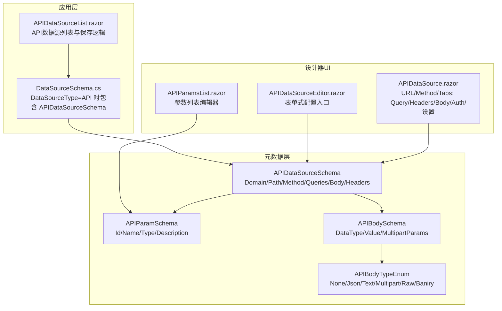
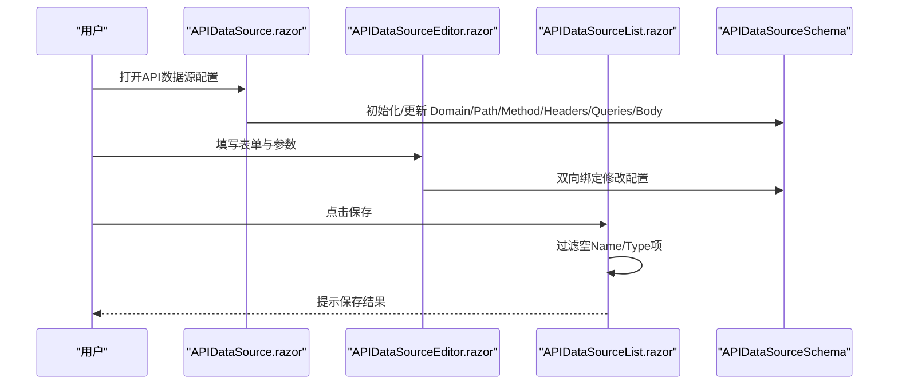
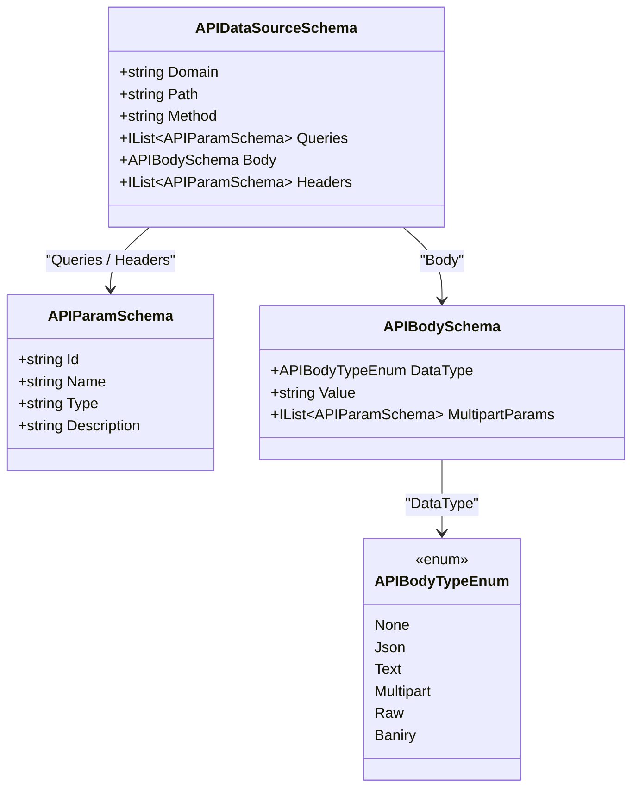
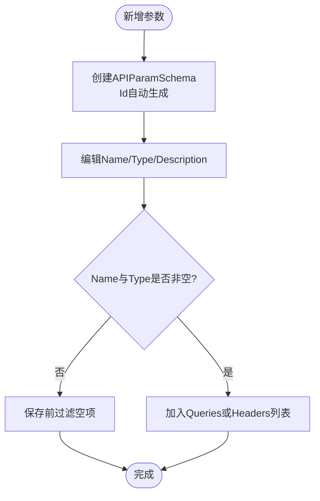
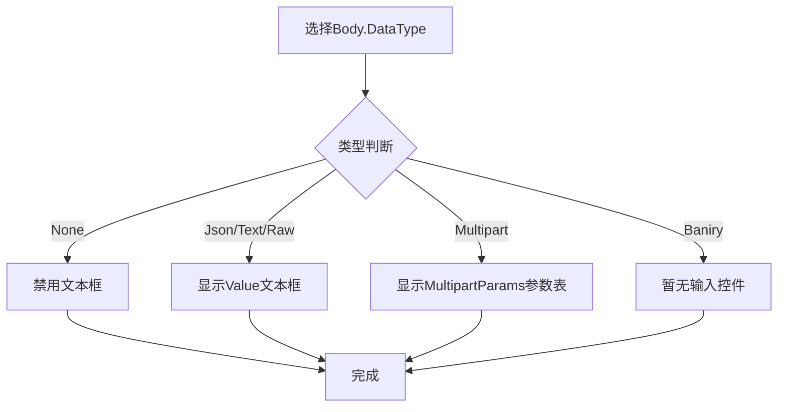
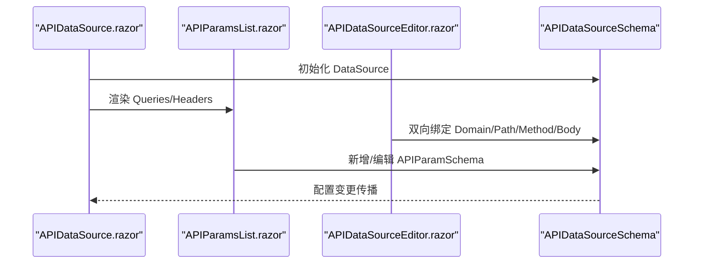
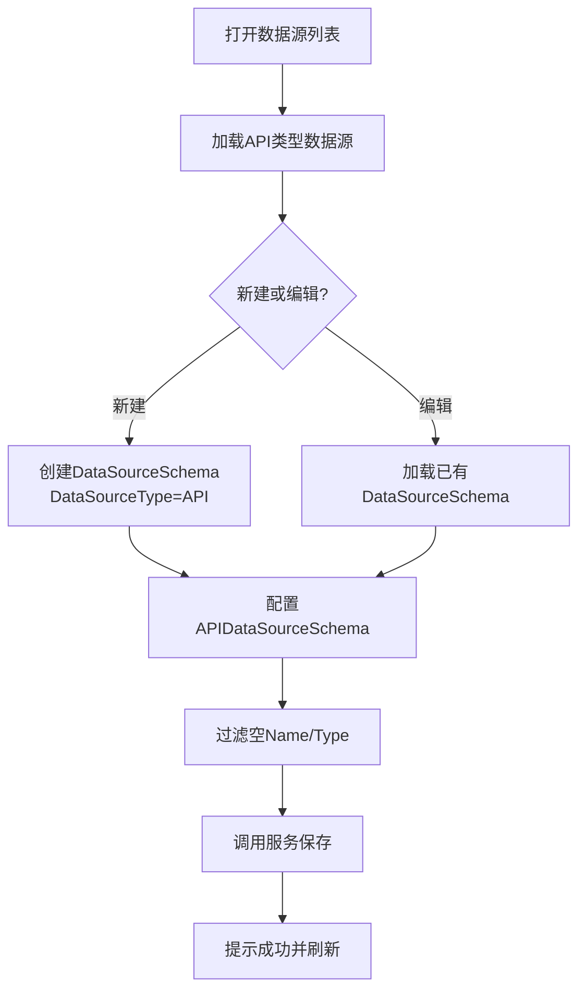
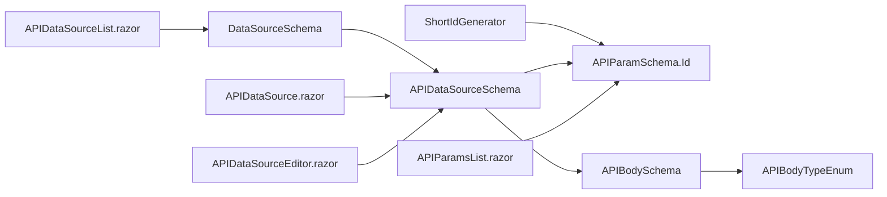

# API数据源Schema

<cite>
**本文引用的文件**   
- [APIDataSourceSchema.cs](file://src/LowCode/Common/H.LowCode.MetaSchema/DataSourceSchemas/APIDataSourceSchema.cs)
- [DataSourceSchema.cs](file://src/LowCode/Common/H.LowCode.MetaSchema/DataSourceSchema.cs)
- [APIParamsList.razor](file://src/LowCode/DesignEngine/H.LowCode.DesignEngineBase/Components/DataSources/APIParamsList.razor)
- [APIDataSource.razor](file://src/LowCode/DesignEngine/H.LowCode.DesignEngineBase/Components/DataSources/APIDataSource.razor)
- [APIDataSourceEditor.razor](file://src/LowCode/DesignEngine/H.LowCode.PartsDesignEngine/Pages/ComponentParts/Components/APIDataSourceEditor.razor)
- [APIDataSourceList.razor](file://src/LowCode/DesignEngine/H.LowCode.MyApp/Pages/DataSource/APIDataSourceList.razor)
</cite>

## 目录
1. [引言](#引言)
2. [项目结构定位](#项目结构定位)
3. [核心类型与配置结构](#核心类型与配置结构)
4. [架构总览](#架构总览)
5. [详细组件分析](#详细组件分析)
6. [依赖关系分析](#依赖关系分析)
7. [性能与可靠性建议](#性能与可靠性建议)
8. [排错指南](#排错指南)
9. [结论](#结论)
10. [附录：配置示例清单](#附录配置示例清单)

## 引言
本文面向 H.AppLab 低代码平台的 API 数据源 Schema，系统化说明 APIDataSourceSchema 的配置模型、字段语义、请求体类型、参数表编辑、以及设计器与运行时之间的交互关系。文档同时给出最佳实践与常见问题排查方法，帮助开发者快速理解并正确使用 API 数据源能力。

## 项目结构定位
API 数据源相关代码主要分布在以下模块：
- 元数据 Schema 定义：用于持久化与序列化 API 数据源的 JSON 结构。
- 设计引擎 UI：提供 API 地址、HTTP 方法、查询参数、请求头、请求体等可视化配置入口。
- 应用层数据源管理页面：负责 API 数据源的增删改查与发布状态管理。

图表来源
- [APIDataSourceSchema.cs:1-59](file://src/LowCode/Common/H.LowCode.MetaSchema/DataSourceSchemas/APIDataSourceSchema.cs#L1-L59)
- [DataSourceSchema.cs:1-69](file://src/LowCode/Common/H.LowCode.MetaSchema/DataSourceSchema.cs#L1-L69)
- [APIDataSource.razor:1-90](file://src/LowCode/DesignEngine/H.LowCode.DesignEngineBase/Components/DataSources/APIDataSource.razor#L1-L90)
- [APIParamsList.razor:1-129](file://src/LowCode/DesignEngine/H.LowCode.DesignEngineBase/Components/DataSources/APIParamsList.razor#L1-L129)
- [APIDataSourceEditor.razor:1-78](file://src/LowCode/DesignEngine/H.LowCode.PartsDesignEngine/Pages/ComponentParts/Components/APIDataSourceEditor.razor#L1-L78)
- [APIDataSourceList.razor:1-200](file://src/LowCode/DesignEngine/H.LowCode.MyApp/Pages/DataSource/APIDataSourceList.razor#L1-L200)

章节来源
- [APIDataSourceSchema.cs:1-59](file://src/LowCode/Common/H.LowCode.MetaSchema/DataSourceSchemas/APIDataSourceSchema.cs#L1-L59)
- [DataSourceSchema.cs:1-69](file://src/LowCode/Common/H.LowCode.MetaSchema/DataSourceSchema.cs#L1-L69)
- [APIDataSource.razor:1-90](file://src/LowCode/DesignEngine/H.LowCode.DesignEngineBase/Components/DataSources/APIDataSource.razor#L1-L90)
- [APIParamsList.razor:1-129](file://src/LowCode/DesignEngine/H.LowCode.DesignEngineBase/Components/DataSources/APIParamsList.razor#L1-L129)
- [APIDataSourceEditor.razor:1-78](file://src/LowCode/DesignEngine/H.LowCode.PartsDesignEngine/Pages/ComponentParts/Components/APIDataSourceEditor.razor#L1-L78)
- [APIDataSourceList.razor:1-200](file://src/LowCode/DesignEngine/H.LowCode.MyApp/Pages/DataSource/APIDataSourceList.razor#L1-L200)

## 核心类型与配置结构
APIDataSourceSchema 是 API 数据源的核心配置对象，描述一次 HTTP 请求的拓扑信息、参数、请求体与自定义头部。其关键属性如下：
- Domain：域名，作为 API 目标地址的基础部分。
- Path：路径，表示接口资源的路径片段。
- Method：HTTP 方法，当前 UI 支持 GET、POST、PUT、DELETE。
- Queries：查询参数数组，每个元素为 APIParamSchema，包含 Id、Name、Type、Description。
- Body：请求体，类型为 APIBodySchema，包含 DataType、Value、MultipartParams。
- Headers：请求头数组，同样使用 APIParamSchema 表达键值对及说明。

APIParamSchema 用于统一描述可配置的键值型元数据，典型用途包括查询参数、请求头、多部分表单参数等。其关键字段：
- Id：唯一标识，默认由短ID生成器填充。
- Name：显示或传输用的名称。
- Type：类型字符串，由业务侧解释（例如 string、number、boolean、file 等）。
- Description：可选说明。

APIBodySchema 描述请求体的结构与内容：
- DataType：枚举类型，当前支持 None、Json、Text、Multipart、Raw、Baniry。
- Value：文本型请求体内容，适用于 Json、Text、Raw 类型。
- MultipartParams：多部分表单参数列表，复用 APIParamSchema 表达键名、类型与说明。

需要注意：
- APIBodyTypeEnum 中“二进制”选项在枚举中拼写为 Baniry，而 UI 标签显示为 Binary；实际生效以枚举值为准。
- DataSourceSchema 通过 DataSourceType=API 分支承载 APIDataSourceSchema，从而将 API 数据源纳入整体数据源体系。

章节来源
- [APIDataSourceSchema.cs:1-59](file://src/LowCode/Common/H.LowCode.MetaSchema/DataSourceSchemas/APIDataSourceSchema.cs#L1-L59)
- [DataSourceSchema.cs:1-69](file://src/LowCode/Common/H.LowCode.MetaSchema/DataSourceSchema.cs#L1-L69)

## 架构总览
API 数据源的设计器与运行期流程大致如下：
- 用户在“新建/编辑 API 数据源”界面配置 URL、Method、Query、Header、Body。
- 设计器将这些配置绑定到 APIDataSourceSchema 对象。
- 数据源列表页面对配置进行过滤与校验后调用服务保存。
- 运行时根据 APIDataSourceSchema 构造 HTTP 请求，并发送出去。

图表来源
- [APIDataSource.razor:1-90](file://src/LowCode/DesignEngine/H.LowCode.DesignEngineBase/Components/DataSources/APIDataSource.razor#L1-L90)
- [APIDataSourceEditor.razor:1-78](file://src/LowCode/DesignEngine/H.LowCode.PartsDesignEngine/Pages/ComponentParts/Components/APIDataSourceEditor.razor#L1-L78)
- [APIDataSourceList.razor:1-200](file://src/LowCode/DesignEngine/H.LowCode.MyApp/Pages/DataSource/APIDataSourceList.razor#L1-L200)

## 详细组件分析

### APIDataSourceSchema 配置规范
- Domain/Path/Method：构成请求的目标地址与方法。Method 由 UI 下拉框限定为 GET、POST、PUT、DELETE。
- Queries：查询参数数组，每个条目具备 Id、Name、Type、Description。
- Body：
  - None：无请求体。
  - Json：JSON 文本体。
  - Text：纯文本体。
  - Raw：原始文本体。
  - Multipart：多部分表单，使用 MultipartParams 描述各字段。
  - Baniry：二进制流，当前 UI 未提供具体输入控件。
- Headers：请求头数组，结构与 Queries 一致，均使用 APIParamSchema。

图表来源
- [APIDataSourceSchema.cs:1-59](file://src/LowCode/Common/H.LowCode.MetaSchema/DataSourceSchemas/APIDataSourceSchema.cs#L1-L59)

章节来源
- [APIDataSourceSchema.cs:1-59](file://src/LowCode/Common/H.LowCode.MetaSchema/DataSourceSchemas/APIDataSourceSchema.cs#L1-L59)

### 查询参数与请求头：APIParamSchema 的使用
- APIParamSchema 被复用于 Queries 与 Headers，体现统一的键值型元数据建模。
- Id 默认自动生成，便于前端编辑缓存与行级操作。
- Name 与 Type 是必填语义字段；在保存前会进行非空过滤。
- Description 用于说明参数的含义，不直接参与传输。

图表来源
- [APIParamsList.razor:1-129](file://src/LowCode/DesignEngine/H.LowCode.DesignEngineBase/Components/DataSources/APIParamsList.razor#L1-L129)
- [APIDataSourceList.razor:1-200](file://src/LowCode/DesignEngine/H.LowCode.MyApp/Pages/DataSource/APIDataSourceList.razor#L1-L200)

章节来源
- [APIParamsList.razor:1-129](file://src/LowCode/DesignEngine/H.LowCode.DesignEngineBase/Components/DataSources/APIParamsList.razor#L1-L129)
- [APIDataSourceList.razor:1-200](file://src/LowCode/DesignEngine/H.LowCode.MyApp/Pages/DataSource/APIDataSourceList.razor#L1-L200)

### 请求体 Body 的多类型处理
Body 的类型选择直接影响 UI 行为与数据传输方式：
- None：禁用文本框，表示无请求体。
- Json/Text/Raw：显示大文本框，使用 Value 存储内容。
- Multipart：切换为参数表，使用 MultipartParams 逐项配置字段。
- Baniry：当前仅保留类型选项，没有输入控件，适合后续扩展二进制上传。

图表来源
- [APIDataSource.razor:1-90](file://src/LowCode/DesignEngine/H.LowCode.DesignEngineBase/Components/DataSources/APIDataSource.razor#L1-L90)
- [APIDataSourceSchema.cs:1-59](file://src/LowCode/Common/H.LowCode.MetaSchema/DataSourceSchemas/APIDataSourceSchema.cs#L1-L59)

章节来源
- [APIDataSource.razor:1-90](file://src/LowCode/DesignEngine/H.LowCode.DesignEngineBase/Components/DataSources/APIDataSource.razor#L1-L90)
- [APIDataSourceSchema.cs:1-59](file://src/LowCode/Common/H.LowCode.MetaSchema/DataSourceSchemas/APIDataSourceSchema.cs#L1-L59)

### 设计器与编辑器协作
- APIDataSource.razor 提供主面板，包括 URL、Method、Tabs（Query、Headers、Body、Auth、设置）。
- APIParamsList.razor 提供参数表格编辑器，支持新增、编辑、删除行。
- APIDataSourceEditor.razor 提供表单式配置入口，绑定到 APIDataSourceSchema，并在初始化时补全空集合。

图表来源
- [APIDataSource.razor:1-90](file://src/LowCode/DesignEngine/H.LowCode.DesignEngineBase/Components/DataSources/APIDataSource.razor#L1-L90)
- [APIParamsList.razor:1-129](file://src/LowCode/DesignEngine/H.LowCode.DesignEngineBase/Components/DataSources/APIParamsList.razor#L1-L129)
- [APIDataSourceEditor.razor:1-78](file://src/LowCode/DesignEngine/H.LowCode.PartsDesignEngine/Pages/ComponentParts/Components/APIDataSourceEditor.razor#L1-L78)

章节来源
- [APIDataSource.razor:1-90](file://src/LowCode/DesignEngine/H.LowCode.DesignEngineBase/Components/DataSources/APIDataSource.razor#L1-L90)
- [APIParamsList.razor:1-129](file://src/LowCode/DesignEngine/H.LowCode.DesignEngineBase/Components/DataSources/APIParamsList.razor#L1-L129)
- [APIDataSourceEditor.razor:1-78](file://src/LowCode/DesignEngine/H.LowCode.PartsDesignEngine/Pages/ComponentParts/Components/APIDataSourceEditor.razor#L1-L78)

### 数据源列表与保存逻辑
APIDataSourceList.razor 承担 API 数据源的列表展示与基础保存逻辑：
- 获取 API 类型的数据源列表。
- 新建/编辑弹窗中嵌入 APIDataSource 配置组件。
- 保存前过滤 Queries 与 Headers 中 Name 或 Type 为空的项。
- 调用服务保存 DataSourceSchema，其中 API 字段即为 APIDataSourceSchema。

图表来源
- [APIDataSourceList.razor:1-200](file://src/LowCode/DesignEngine/H.LowCode.MyApp/Pages/DataSource/APIDataSourceList.razor#L1-L200)
- [DataSourceSchema.cs:1-69](file://src/LowCode/Common/H.LowCode.MetaSchema/DataSourceSchema.cs#L1-L69)

章节来源
- [APIDataSourceList.razor:1-200](file://src/LowCode/DesignEngine/H.LowCode.MyApp/Pages/DataSource/APIDataSourceList.razor#L1-L200)
- [DataSourceSchema.cs:1-69](file://src/LowCode/Common/H.LowCode.MetaSchema/DataSourceSchema.cs#L1-L69)

## 依赖关系分析
- APIDataSourceSchema 依赖 ShortIdGenerator 生成参数 Id。
- DataSourceSchema 通过 DataSourceType=API 分支聚合 APIDataSourceSchema。
- 设计器 UI 组件依赖 APIDataSourceSchema 与 APIParamSchema 进行双向绑定与渲染。
- 列表页依赖 DataSourceSchema 的服务接口完成数据源持久化。

图表来源
- [APIDataSourceSchema.cs:1-59](file://src/LowCode/Common/H.LowCode.MetaSchema/DataSourceSchemas/APIDataSourceSchema.cs#L1-L59)
- [DataSourceSchema.cs:1-69](file://src/LowCode/Common/H.LowCode.MetaSchema/DataSourceSchema.cs#L1-L69)
- [APIDataSource.razor:1-90](file://src/LowCode/DesignEngine/H.LowCode.DesignEngineBase/Components/DataSources/APIDataSource.razor#L1-L90)
- [APIParamsList.razor:1-129](file://src/LowCode/DesignEngine/H.LowCode.DesignEngineBase/Components/DataSources/APIParamsList.razor#L1-L129)
- [APIDataSourceEditor.razor:1-78](file://src/LowCode/DesignEngine/H.LowCode.PartsDesignEngine/Pages/ComponentParts/Components/APIDataSourceEditor.razor#L1-L78)
- [APIDataSourceList.razor:1-200](file://src/LowCode/DesignEngine/H.LowCode.MyApp/Pages/DataSource/APIDataSourceList.razor#L1-L200)

章节来源
- [APIDataSourceSchema.cs:1-59](file://src/LowCode/Common/H.LowCode.MetaSchema/DataSourceSchemas/APIDataSourceSchema.cs#L1-L59)
- [DataSourceSchema.cs:1-69](file://src/LowCode/Common/H.LowCode.MetaSchema/DataSourceSchema.cs#L1-L69)
- [APIDataSource.razor:1-90](file://src/LowCode/DesignEngine/H.LowCode.DesignEngineBase/Components/DataSources/APIDataSource.razor#L1-L90)
- [APIParamsList.razor:1-129](file://src/LowCode/DesignEngine/H.LowCode.DesignEngineBase/Components/DataSources/APIParamsList.razor#L1-L129)
- [APIDataSourceEditor.razor:1-78](file://src/LowCode/DesignEngine/H.LowCode.PartsDesignEngine/Pages/ComponentParts/Components/APIDataSourceEditor.razor#L1-L78)
- [APIDataSourceList.razor:1-200](file://src/LowCode/DesignEngine/H.LowCode.MyApp/Pages/DataSource/APIDataSourceList.razor#L1-L200)

## 性能与可靠性建议
- 减少无效参数：保存前过滤 Name 或 Type 为空的项目，避免传输冗余数据。
- 合理拆分请求：复杂场景可将一个大数据集拆分为分页或按维度分片请求，降低单次负载。
- 控制请求体大小：Json/Text/Raw 文本体过大时应考虑压缩或后端分页返回。
- 复用公共 Header：将通用认证头与追踪头抽象为公共配置，减少重复录入。
- 谨慎使用 Multipart：多部分表单适合文件上传，但会增加协议开销，应仅在必要时启用。
- 注意枚举一致性：Binary 选项在枚举中为 Baniry，确保前后端与UI保持一致，避免解析异常。

## 排错指南
- 参数未生效：检查 Queries 或 Headers 中的 Name 与 Type 是否为空，保存前会被过滤。
- Body 无法提交：确认 Body.DataType 是否选择了合适的类型；None 不会发送请求体。
- 二进制上传异常：当前 UI 未提供二进制输入控件，需要后续扩展或在服务端适配。
- 配置丢失：确保在初始化时对 DataSource、Headers、Queries、Body 进行空值保护。
- 类型不一致：APIParamSchema.Type 由业务方定义，需与后端契约保持一致。

章节来源
- [APIDataSourceList.razor:1-200](file://src/LowCode/DesignEngine/H.LowCode.MyApp/Pages/DataSource/APIDataSourceList.razor#L1-L200)
- [APIDataSourceEditor.razor:1-78](file://src/LowCode/DesignEngine/H.LowCode.PartsDesignEngine/Pages/ComponentParts/Components/APIDataSourceEditor.razor#L1-L78)
- [APIDataSource.razor:1-90](file://src/LowCode/DesignEngine/H.LowCode.DesignEngineBase/Components/DataSources/APIDataSource.razor#L1-L90)
- [APIDataSourceSchema.cs:1-59](file://src/LowCode/Common/H.LowCode.MetaSchema/DataSourceSchemas/APIDataSourceSchema.cs#L1-L59)

## 结论
APIDataSourceSchema 提供了完整的 API 数据源配置模型，覆盖域名、路径、HTTP 方法、查询参数、请求体与请求头等核心要素。设计器 UI 通过双向绑定与参数表编辑器简化了配置过程，列表页则负责数据源的持久化管理。结合本文的最佳实践与排错建议，可在保证可靠性的前提下高效集成后端服务。

## 附录：配置示例清单
以下为不同类型 API 数据源配置的要点清单（不含具体代码内容）：
- GET 查询接口
  - Method：GET
  - Path：目标资源路径
  - Queries：若干 APIParamSchema，用于传递筛选条件
  - Headers：可选认证头或追踪头
  - Body：None
- POST JSON 接口
  - Method：POST
  - Path：目标资源路径
  - Queries：可选查询参数
  - Headers：Content-Type 通常为 application/json
  - Body：DataType=Json，Value 为 JSON 文本
- PUT 更新接口
  - Method：PUT
  - Path：目标资源路径
  - Queries：可选查询参数
  - Headers：Content-Type 通常为 application/json
  - Body：DataType=Json，Value 为 JSON 文本
- DELETE 删除接口
  - Method：DELETE
  - Path：目标资源路径
  - Queries：可选查询参数
  - Headers：可选认证头
  - Body：None
- Multipart 文件上传
  - Method：通常为 POST
  - Path：文件上传路径
  - Headers：Content-Type 由多部分表单自动设置
  - Body：DataType=Multipart，MultipartParams 配置文件字段与其他表单字段
- Raw 或 Text 文本接口
  - Method：POST 或 PUT
  - Path：目标资源路径
  - Body：DataType=Raw 或 Text，Value 为原始文本

章节来源
- [APIDataSourceSchema.cs:1-59](file://src/LowCode/Common/H.LowCode.MetaSchema/DataSourceSchemas/APIDataSourceSchema.cs#L1-L59)
- [APIDataSource.razor:1-90](file://src/LowCode/DesignEngine/H.LowCode.DesignEngineBase/Components/DataSources/APIDataSource.razor#L1-L90)
- [APIDataSourceEditor.razor:1-78](file://src/LowCode/DesignEngine/H.LowCode.PartsDesignEngine/Pages/ComponentParts/Components/APIDataSourceEditor.razor#L1-L78)