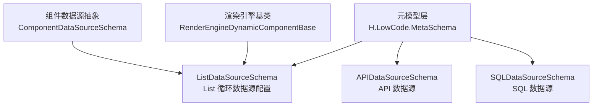
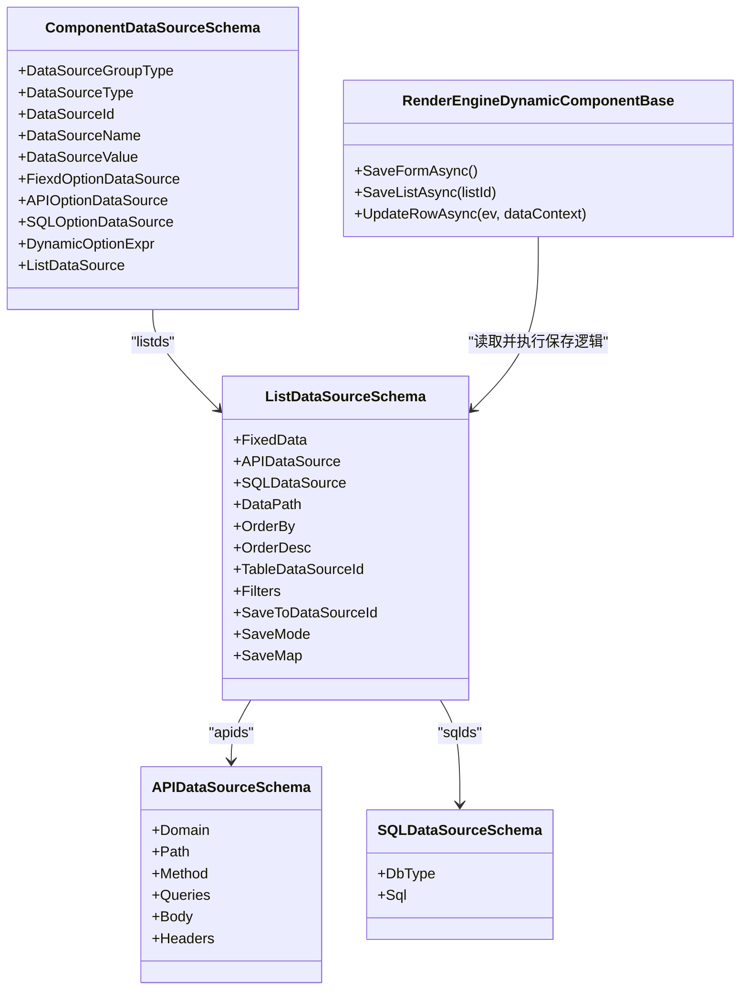
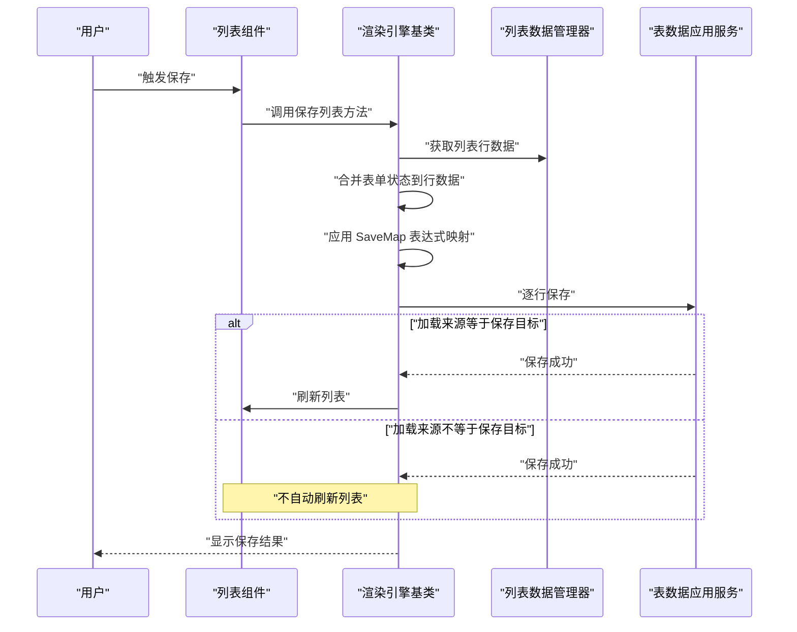
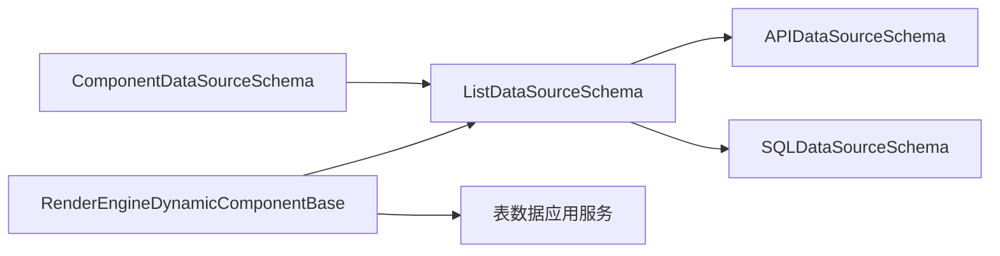

# List数据源Schema

<cite>
**本文引用的文件**
- [ListDataSourceSchema.cs](file://src/LowCode/Common/H.LowCode.MetaSchema/DataSourceSchemas/ListDataSourceSchema.cs)
- [APIDataSourceSchema.cs](file://src/LowCode/Common/H.LowCode.MetaSchema/DataSourceSchemas/APIDataSourceSchema.cs)
- [SQLDataSourceSchema.cs](file://src/LowCode/Common/H.LowCode.MetaSchema/DataSourceSchemas/SQLDataSourceSchema.cs)
- [ComponentDataSourceSchema.cs](file://src/LowCode/Common/H.LowCode.MetaSchema/DataSourceSchemas/ComponentDataSourceSchema.cs)
- [RenderEngineDynamicComponentBase.cs](file://src/LowCode/RenderEngine/H.LowCode.RenderEngineBase/RenderEngineDynamicComponentBase.cs)
</cite>

## 目录
1. [引言](#引言)
2. [项目结构定位](#项目结构定位)
3. [核心组件总览](#核心组件总览)
4. [架构概览](#架构概览)
5. [详细配置规范](#详细配置规范)
6. [数据加载与保存流程](#数据加载与保存流程)
7. [依赖关系分析](#依赖关系分析)
8. [性能优化建议](#性能优化建议)
9. [常见问题排查](#常见问题排查)
10. [结论](#结论)

## 引言
本文面向 H.AppLab 低代码平台中的 **List 数据源 Schema**，目标是给出完整、可操作的技术规范。重点覆盖以下能力：
- 设计时固定数据 `FixedData`
- API 数据源 `APIDataSource`
- SQL 数据源 `SQLDataSource`
- JSON 响应路径解析 `DataPath`
- 排序字段 `OrderBy` 与倒序开关 `OrderDesc`
- 表数据源引用 `TableDataSourceId`
- 过滤映射 `Filters`
- 保存目标 `SaveToDataSourceId`
- 保存模式 `SaveMode`（Upsert、InsertNew）
- 保存字段映射 `SaveMap` 及表达式变量语法

本规范以源码定义为依据，并结合渲染引擎中 List 数据保存逻辑进行说明。

## 项目结构定位
List 数据源 Schema 属于低代码元模型层，位于 Common/MetaSchema 的 DataSourceSchemas 目录下；其实际运行时行为由 RenderEngine 的动态组件基类驱动。

**图表来源**
- [ListDataSourceSchema.cs:1-92](file://src/LowCode/Common/H.LowCode.MetaSchema/DataSourceSchemas/ListDataSourceSchema.cs#L1-L92)
- [APIDataSourceSchema.cs:1-59](file://src/LowCode/Common/H.LowCode.MetaSchema/DataSourceSchemas/APIDataSourceSchema.cs#L1-L59)
- [SQLDataSourceSchema.cs:1-12](file://src/LowCode/Common/H.LowCode.MetaSchema/DataSourceSchemas/SQLDataSourceSchema.cs#L1-L12)
- [ComponentDataSourceSchema.cs:1-58](file://src/LowCode/Common/H.LowCode.MetaSchema/DataSourceSchemas/ComponentDataSourceSchema.cs#L1-L58)
- [RenderEngineDynamicComponentBase.cs:1300-1450](file://src/LowCode/RenderEngine/H.LowCode.RenderEngineBase/RenderEngineDynamicComponentBase.cs#L1300-L1450)

**章节来源**
- [ListDataSourceSchema.cs:1-92](file://src/LowCode/Common/H.LowCode.MetaSchema/DataSourceSchemas/ListDataSourceSchema.cs#L1-L92)
- [ComponentDataSourceSchema.cs:1-58](file://src/LowCode/Common/H.LowCode.MetaSchema/DataSourceSchemas/ComponentDataSourceSchema.cs#L1-L58)

## 核心组件总览
- `ListDataSourceSchema`：List 循环数据源的完整配置对象，包含加载、过滤、排序、保存等所有关键参数。
- `APIDataSourceSchema`：描述远程 API 调用的域名、路径、方法、查询参数、请求体与请求头。
- `SQLDataSourceSchema`：描述 SQL 数据源的数据库类型与 SQL 语句。
- `ComponentDataSourceSchema`：组件级数据源抽象，其中 `listds` 字段用于挂载 `ListDataSourceSchema`。
- `RenderEngineDynamicComponentBase`：运行时负责列表数据的保存、删除同步、刷新等控制流，并消费 `ListDataSourceSchema` 的配置。

**章节来源**
- [ListDataSourceSchema.cs:1-92](file://src/LowCode/Common/H.LowCode.MetaSchema/DataSourceSchemas/ListDataSourceSchema.cs#L1-L92)
- [APIDataSourceSchema.cs:1-59](file://src/LowCode/Common/H.LowCode.MetaSchema/DataSourceSchemas/APIDataSourceSchema.cs#L1-L59)
- [SQLDataSourceSchema.cs:1-12](file://src/LowCode/Common/H.LowCode.MetaSchema/DataSourceSchemas/SQLDataSourceSchema.cs#L1-L12)
- [ComponentDataSourceSchema.cs:1-58](file://src/LowCode/Common/H.LowCode.MetaSchema/DataSourceSchemas/ComponentDataSourceSchema.cs#L1-L58)
- [RenderEngineDynamicComponentBase.cs:1300-1450](file://src/LowCode/RenderEngine/H.LowCode.RenderEngineBase/RenderEngineDynamicComponentBase.cs#L1300-L1450)

## 架构概览
下图展示 List 数据源在“配置 → 运行”的整体关系：

**图表来源**
- [ComponentDataSourceSchema.cs:1-58](file://src/LowCode/Common/H.LowCode.MetaSchema/DataSourceSchemas/ComponentDataSourceSchema.cs#L1-L58)
- [ListDataSourceSchema.cs:1-92](file://src/LowCode/Common/H.LowCode.MetaSchema/DataSourceSchemas/ListDataSourceSchema.cs#L1-L92)
- [APIDataSourceSchema.cs:1-59](file://src/LowCode/Common/H.LowCode.MetaSchema/DataSourceSchemas/APIDataSourceSchema.cs#L1-L59)
- [SQLDataSourceSchema.cs:1-12](file://src/LowCode/Common/H.LowCode.MetaSchema/DataSourceSchemas/SQLDataSourceSchema.cs#L1-L12)
- [RenderEngineDynamicComponentBase.cs:1300-1450](file://src/LowCode/RenderEngine/H.LowCode.RenderEngineBase/RenderEngineDynamicComponentBase.cs#L1300-L1450)

## 详细配置规范

### ListDataSourceSchema 完整字段说明
| 字段名 | JSON 键 | 类型 | 是否必填 | 含义与规则 |
|---|---|---|---|---|
| FixedData | fxdata | 行数组 | 否 | 设计时固定数据，用于预览和调试。每条记录为键值对对象。 |
| APIDataSource | apids | 对象 | 否 | API 数据源配置，包含域名、路径、方法、查询参数、请求体、请求头。 |
| SQLDataSource | sqlds | 对象 | 否 | SQL 数据源配置，包含数据库类型与 SQL 语句。 |
| DataPath | datapath | 字符串 | 否 | 数据响应路径，用于从 API/SQL 返回结构中抽取数组数据。例如 `data.list`。 |
| OrderBy | orderby | 字符串 | 否 | 排序字段名。通常与服务端或表数据源支持的排序字段一致。 |
| OrderDesc | orderdesc | 布尔 | 否 | 是否倒序排列。配合 `OrderBy` 使用。 |
| TableDataSourceId | tbdsid | 字符串 | 否 | 加载来源的表数据源 Id，表示从应用级表数据源加载数据。 |
| Filters | flts | 键值对 | 否 | 过滤映射，key 为表字段名，value 为表达式，例如 `$query(id)`、`$(item.f_x)`。 |
| SaveToDataSourceId | saveto | 字符串 | 否 | 保存目标表数据源 Id。若未设置，则回退到 `TableDataSourceId`。 |
| SaveMode | savemode | 枚举 | 否 | 保存模式：Upsert（按主键新增或更新）、InsertNew（重新生成主键后新增）。默认 Upsert。 |
| SaveMap | savemap | 键值对 | 否 | 保存字段映射，key 为目标表字段名，value 为表达式。支持行数据、表单值、URL 参数、时间等变量。 |

**章节来源**
- [ListDataSourceSchema.cs:1-92](file://src/LowCode/Common/H.LowCode.MetaSchema/DataSourceSchemas/ListDataSourceSchema.cs#L1-L92)

### FixedData：设计时固定数据
- 用途：在设计器或预览阶段提供静态样例数据，便于 UI 布局验证。
- 数据结构：数组，每个元素是字典对象，键为字段名，值为任意 JSON 值。
- 注意事项：
  - 仅用于设计时预览，不替代运行时数据源。
  - 可与 `TableDataSourceId`、`APIDataSource`、`SQLDataSource` 组合使用，以便先预览再切换真实数据源。

**章节来源**
- [ListDataSourceSchema.cs:1-92](file://src/LowCode/Common/H.LowCode.MetaSchema/DataSourceSchemas/ListDataSourceSchema.cs#L1-L92)

### APIDataSource：API 数据源
- 作用：声明一个远程 API 调用，包括域名、路径、HTTP 方法、查询参数、请求体和请求头。
- 关键字段：
  - Domain：服务域名。
  - Path：接口路径。
  - Method：HTTP 方法。
  - Queries：查询参数列表，每项含 Id、Name、Type、Description。
  - Body：请求体，支持多种数据类型，如 Json、Text、Multipart、Raw、Binary。
  - Headers：请求头参数列表，结构与查询参数类似。
- 典型场景：
  - 对接外部系统 API。
  - 作为 List 的异步数据来源，并通过 `DataPath` 抽取数组结果。

**章节来源**
- [APIDataSourceSchema.cs:1-59](file://src/LowCode/Common/H.LowCode.MetaSchema/DataSourceSchemas/APIDataSourceSchema.cs#L1-L59)

### SQLDataSource：SQL 数据源
- 作用：声明一个 SQL 数据源，指定数据库类型和 SQL 语句。
- 关键字段：
  - DbType：数据库类型标识。
  - Sql：SQL 查询语句。
- 典型场景：
  - 直接访问后端数据库或只读视图。
  - 通过 SQL 实现复杂聚合、关联查询，再由 `DataPath` 抽取结果。

**章节来源**
- [SQLDataSourceSchema.cs:1-12](file://src/LowCode/Common/H.LowCode.MetaSchema/DataSourceSchemas/SQLDataSourceSchema.cs#L1-L12)

### DataPath：JSON 路径表达式与解析机制
- 目的：从 API/SQL 返回的 JSON 结构中定位列表数组。
- 示例：`data.list` 表示从顶层对象的 `data` 字段下取 `list` 数组。
- 解析机制要点：
  - 以点号分隔路径段。
  - 每一段对应 JSON 对象的一个属性。
  - 最终期望得到数组；若路径不存在或类型不符，应视为无效路径，避免空引用或类型错误。
- 建议：
  - 保持 API 返回结构稳定，或在后端封装统一响应格式。
  - 将分页信息放在列表数组之外，例如 `{ data: [], total: 100 }`，再通过 `DataPath` 指向 `data`。

**章节来源**
- [ListDataSourceSchema.cs:1-92](file://src/LowCode/Common/H.LowCode.MetaSchema/DataSourceSchemas/ListDataSourceSchema.cs#L1-L92)

### OrderBy 与 OrderDesc：排序配置
- `OrderBy`：指定排序字段。
- `OrderDesc`：是否为降序。
- 行为约定：
  - 当同时配置时，表示按指定字段倒序。
  - 当仅配置 `OrderBy` 时，通常表示升序。
  - 当两者均未配置时，不添加排序。
- 注意：具体排序实现取决于数据源类型。对于表数据源，应与字段定义一致；对于 API/SQL，需确保后端支持相应排序语义。

**章节来源**
- [ListDataSourceSchema.cs:1-92](file://src/LowCode/Common/H.LowCode.MetaSchema/DataSourceSchemas/ListDataSourceSchema.cs#L1-L92)

### TableDataSourceId：表数据源引用
- 作用：声明 List 的加载来源为某个应用级表数据源。
- 与 `SaveToDataSourceId` 的关系：
  - 加载来源是 `TableDataSourceId`。
  - 保存目标优先使用 `SaveToDataSourceId`；若未设置，则回退到 `TableDataSourceId`。
- 典型场景：
  - 同一张业务表的列表查询与保存。
  - 查询与落库分离：查询来自 A 表数据源，保存写入 B 表数据源。

**章节来源**
- [ListDataSourceSchema.cs:1-92](file://src/LowCode/Common/H.LowCode.MetaSchema/DataSourceSchemas/ListDataSourceSchema.cs#L1-L92)

### Filters：过滤映射
- 结构：键为表字段名，值为表达式。
- 常用表达式：
  - `$query(x)`：从 URL 查询参数取值。
  - `$(item.f_x)`：从当前行数据取值。
  - `$(form.key)`：从页面表单状态取值。
  - `$(now)`：当前时间。
- 作用：动态构造查询条件，将前端上下文注入到数据加载过程。
- 注意事项：
  - 表达式由表达式解析器求值。
  - 空值或未匹配表达式不应污染查询条件。

**章节来源**
- [ListDataSourceSchema.cs:1-92](file://src/LowCode/Common/H.LowCode.MetaSchema/DataSourceSchemas/ListDataSourceSchema.cs#L1-L92)

### SaveToDataSourceId：保存目标数据源
- 作用：指定列表数据保存的目标表数据源。
- 优先级：
  - 若配置 `SaveToDataSourceId`，则使用该值。
  - 否则使用 `TableDataSourceId`。
- 运行时处理：
  - 如果两者都为空，保存流程会提示未配置保存目标并中断。
  - 如果加载来源与保存目标不同，保存成功后不会自动刷新列表。

**章节来源**
- [ListDataSourceSchema.cs:1-92](file://src/LowCode/Common/H.LowCode.MetaSchema/DataSourceSchemas/ListDataSourceSchema.cs#L1-L92)
- [RenderEngineDynamicComponentBase.cs:1340-1420](file://src/LowCode/RenderEngine/H.LowCode.RenderEngineBase/RenderEngineDynamicComponentBase.cs#L1340-L1420)

### SaveMode：保存模式
枚举值及其业务场景如下：

| 枚举值 | 编号 | 业务含义 | 适用场景 |
|---|---:|---|---|
| Upsert | 0 | 按主键新增或更新 | 编辑现有记录、批量同步、幂等保存。 |
| InsertNew | 1 | 重新生成主键后新增 | 模板另存、复制数据、创建副本。 |

- 默认值：Upsert。
- 运行时影响：
  - 非 InsertNew 且数据来源与保存目标一致时，会尝试同步删除被移除的行。
  - InsertNew 模式下强制新增，不再走按主键更新逻辑。

**章节来源**
- [ListDataSourceSchema.cs:1-92](file://src/LowCode/Common/H.LowCode.MetaSchema/DataSourceSchemas/ListDataSourceSchema.cs#L1-L92)
- [RenderEngineDynamicComponentBase.cs:1340-1420](file://src/LowCode/RenderEngine/H.LowCode.RenderEngineBase/RenderEngineDynamicComponentBase.cs#L1340-L1420)

### SaveMap：保存字段映射与表达式语法
- 结构：键为目标表字段名，值为表达式。
- 表达式变量：
  - `$(item.f_x)`：当前行数据字段。
  - `$(form.key)`：页面表单值。
  - `$query(x)`：URL 查询参数。
  - `$(now)`：当前时间。
- 解析时机：
  - 对每行数据构建行字典后，再根据 `SaveMap` 逐项求值并叠加到行数据中。
  - 若表达式结果为空，则该映射字段不参与保存。
- 与行数据的关系：
  - `SaveMap` 是在已有行数据基础上叠加或覆盖，适合补充计算字段、审计字段、时间戳等。

**章节来源**
- [ListDataSourceSchema.cs:1-92](file://src/LowCode/Common/H.LowCode.MetaSchema/DataSourceSchemas/ListDataSourceSchema.cs#L1-L92)
- [RenderEngineDynamicComponentBase.cs:1360-1410](file://src/LowCode/RenderEngine/H.LowCode.RenderEngineBase/RenderEngineDynamicComponentBase.cs#L1360-L1410)

## 数据加载与保存流程

### 列表保存流程

**图表来源**
- [RenderEngineDynamicComponentBase.cs:1340-1420](file://src/LowCode/RenderEngine/H.LowCode.RenderEngineBase/RenderEngineDynamicComponentBase.cs#L1340-L1420)

### 保存失败与异常处理
- 未配置保存目标：
  - 若 `SaveToDataSourceId` 与 `TableDataSourceId` 均为空，则提示未配置保存目标并中止保存。
- 保存异常：
  - 捕获异常后记录日志，并向用户显示错误消息。
- 删除同步：
  - 仅在 Upsert 模式、列表已同步数据库、且加载来源与保存目标相同时，才会同步删除被移除的行。

**章节来源**
- [RenderEngineDynamicComponentBase.cs:1340-1420](file://src/LowCode/RenderEngine/H.LowCode.RenderEngineBase/RenderEngineDynamicComponentBase.cs#L1340-L1420)

## 依赖关系分析

- `ComponentDataSourceSchema` 通过 `listds` 引用 `ListDataSourceSchema`。
- `ListDataSourceSchema` 可选择引用 `APIDataSourceSchema` 或 `SQLDataSourceSchema`。
- `RenderEngineDynamicComponentBase` 在运行时读取 `ListDataSourceSchema`，并调用表数据应用服务完成保存。

**图表来源**
- [ComponentDataSourceSchema.cs:1-58](file://src/LowCode/Common/H.LowCode.MetaSchema/DataSourceSchemas/ComponentDataSourceSchema.cs#L1-L58)
- [ListDataSourceSchema.cs:1-92](file://src/LowCode/Common/H.LowCode.MetaSchema/DataSourceSchemas/ListDataSourceSchema.cs#L1-L92)
- [APIDataSourceSchema.cs:1-59](file://src/LowCode/Common/H.LowCode.MetaSchema/DataSourceSchemas/APIDataSourceSchema.cs#L1-L59)
- [SQLDataSourceSchema.cs:1-12](file://src/LowCode/Common/H.LowCode.MetaSchema/DataSourceSchemas/SQLDataSourceSchema.cs#L1-L12)
- [RenderEngineDynamicComponentBase.cs:1340-1420](file://src/LowCode/RenderEngine/H.LowCode.RenderEngineBase/RenderEngineDynamicComponentBase.cs#L1340-L1420)

**章节来源**
- [ComponentDataSourceSchema.cs:1-58](file://src/LowCode/Common/H.LowCode.MetaSchema/DataSourceSchemas/ComponentDataSourceSchema.cs#L1-L58)
- [ListDataSourceSchema.cs:1-92](file://src/LowCode/Common/H.LowCode.MetaSchema/DataSourceSchemas/ListDataSourceSchema.cs#L1-L92)
- [RenderEngineDynamicComponentBase.cs:1340-1420](file://src/LowCode/RenderEngine/H.LowCode.RenderEngineBase/RenderEngineDynamicComponentBase.cs#L1340-L1420)

## 性能优化建议

### 数据缓存
- 合理复用表数据源和 API 数据源实例，避免重复初始化。
- 对只读列表，优先考虑后端缓存或数据库索引优化。
- 设计时 `FixedData` 仅用于预览，不要将其作为生产数据源。

### 分页处理
- 建议在 API 或 SQL 层实现分页，并将分页信息与列表数据分离。
- 使用 `DataPath` 仅抽取列表数组，避免将整个响应对象当作数组处理。
- 对于大数据集，避免一次性加载全部数据到前端内存。

### 批量操作
- 使用 Upsert 模式减少不必要的插入开销。
- 仅在加载来源与保存目标一致时启用删除同步，避免跨数据源误删。
- 使用 `SaveMap` 集中补充计算字段，减少前端多次交互。

### 表达式与解析
- 避免在 `Filters` 和 `SaveMap` 中使用高开销表达式。
- 尽量将复杂计算下沉到后端，前端只做必要映射。
- 对频繁使用的表单值或查询参数，可在上层缓存后再传入表达式上下文。

[本节为通用性能建议，不直接分析具体文件]

## 常见问题排查

| 问题现象 | 可能原因 | 排查建议 |
|---|---|---|
| 保存时报未配置保存目标 | `SaveToDataSourceId` 与 `TableDataSourceId` 均未配置 | 至少配置其中一个；优先使用 `SaveToDataSourceId` 明确保存目标。 |
| 保存后列表未刷新 | 加载来源与保存目标不一致 | 确认 `TableDataSourceId` 与 `SaveToDataSourceId` 是否相同；若不同，手动刷新列表。 |
| 保存数据缺少字段 | `SaveMap` 表达式为空或解析失败 | 检查表达式变量是否正确，例如 `$(item.f_x)`、`$(form.key)`、`$query(x)`、`$(now)`。 |
| 列表数据为空 | `DataPath` 指向错误或 API/SQL 返回结构变化 | 核对 `DataPath` 是否与返回结构一致，并打印中间响应结构。 |
| 排序无效 | 数据源不支持该排序字段或方向 | 检查 `OrderBy` 和 `OrderDesc`，并确认后端或表数据源支持该排序。 |
| 删除行未生效 | 非 Upsert 模式或数据来源与保存目标不一致 | 确认 `SaveMode` 为 Upsert，且 `TableDataSourceId` 与 `SaveToDataSourceId` 相同。 |

**章节来源**
- [ListDataSourceSchema.cs:1-92](file://src/LowCode/Common/H.LowCode.MetaSchema/DataSourceSchemas/ListDataSourceSchema.cs#L1-L92)
- [RenderEngineDynamicComponentBase.cs:1340-1420](file://src/LowCode/RenderEngine/H.LowCode.RenderEngineBase/RenderEngineDynamicComponentBase.cs#L1340-L1420)

## 结论
`ListDataSourceSchema` 是 H.AppLab 低代码平台 List 数据源的核心配置对象，它将设计时固定数据、API 数据源、SQL 数据源、表数据源引用、过滤、排序、保存模式和字段映射整合到一个统一结构中。配合 `RenderEngineDynamicComponentBase` 的运行时逻辑，可以实现从数据加载、过滤、排序到保存、删除同步、列表刷新的完整闭环。

在实际项目中，建议：
- 明确区分加载来源与保存目标。
- 使用 `DataPath` 稳定抽取列表数组。
- 使用 `Filters` 和 `SaveMap` 的表达式能力连接前端上下文与后端数据。
- 谨慎选择 `SaveMode`，并根据业务场景决定是否启用删除同步。
- 关注分页、缓存、表达式开销等性能因素，避免前端内存压力过大。

[本节为总结性内容，不直接分析具体文件]