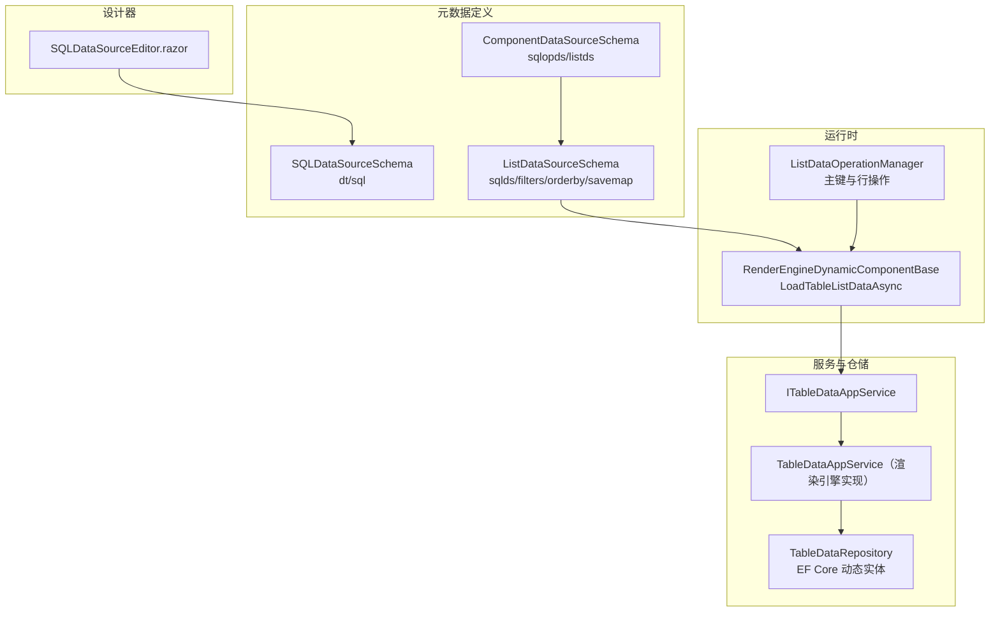
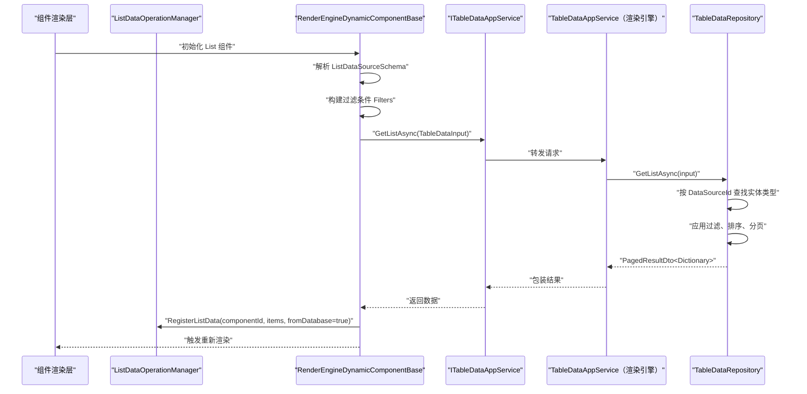
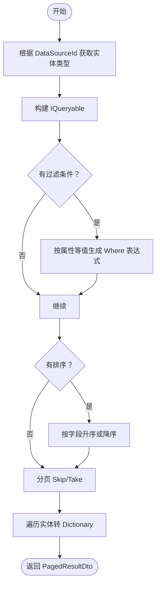
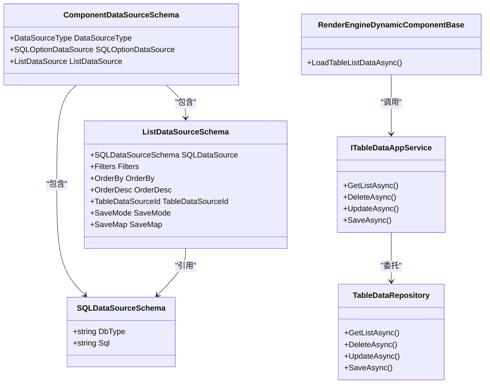
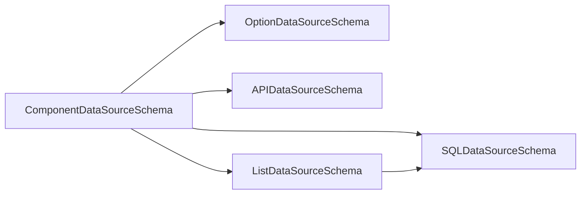

# SQL数据源Schema

<cite>
**本文引用的文件**   
- [SQLDataSourceSchema.cs](file://src/LowCode/Common/H.LowCode.MetaSchema/DataSourceSchemas/SQLDataSourceSchema.cs)
- [ComponentDataSourceSchema.cs](file://src/LowCode/Common/H.LowCode.MetaSchema/DataSourceSchemas/ComponentDataSourceSchema.cs)
- [ListDataSourceSchema.cs](file://src/LowCode/Common/H.LowCode.MetaSchema/DataSourceSchemas/ListDataSourceSchema.cs)
- [ComponentDataSourceTypeEnum.cs](file://src/LowCode/Common/H.LowCode.MetaSchema/Enums/ComponentDataSourceTypeEnum.cs)
- [SQLDataSourceEditor.razor](file://src/LowCode/DesignEngine/H.LowCode.PartsDesignEngine/Pages/ComponentParts/Components/SQLDataSourceEditor.razor)
- [RenderEngineDynamicComponentBase.cs](file://src/LowCode/RenderEngine/H.LowCode.RenderEngineBase/RenderEngineDynamicComponentBase.cs)
- [ListDataOperationManager.cs](file://src/LowCode/RenderEngine/H.LowCode.RenderEngineBase/ListDataOperationManager.cs)
- [ITableDataAppService.cs](file://src/LowCode/Common/H.LowCode.Application.Contracts/AppServices/ITableDataAppService.cs)
- [TableDataInput.cs](file://src/LowCode/Common/H.LowCode.Application.Contracts/Dtos/TableDataInput.cs)
- [TableDataSaveInput.cs](file://src/LowCode/Common/H.LowCode.Application.Contracts/Dtos/TableDataSaveInput.cs)
- [TableDataDeleteInput.cs](file://src/LowCode/Common/H.LowCode.Application.Contracts/Dtos/TableDataDeleteInput.cs)
- [TableDataUpdateInput.cs](file://src/LowCode/Common/H.LowCode.Application.Contracts/Dtos/TableDataUpdateInput.cs)
- [TableDataAppService.cs（渲染引擎实现）](file://src/LowCode/RenderEngine/H.LowCode.RenderEngine.Application/DataAppServices/TableDataAppService.cs)
- [TableDataRepository.cs](file://src/LowCode/RenderEngine/H.LowCode.RenderEngine.EntityFrameworkCore/DataRepositories/TableDataRepository.cs)
</cite>

## 目录
1. [引言](#引言)
2. [项目结构定位](#项目结构定位)
3. [核心数据结构](#核心数据结构)
4. [架构总览](#架构总览)
5. [详细组件分析](#详细组件分析)
6. [依赖关系分析](#依赖关系分析)
7. [性能与连接池说明](#性能与连接池说明)
8. [配置示例与CRUD规范](#配置示例与crud规范)
9. [调试、执行计划与监控实践](#调试执行计划与监控实践)
10. [与其他数据源的协作](#与其他数据源的协作)
11. [常见问题排查](#常见问题排查)
12. [结论](#结论)

## 引言
本文面向 H.AppLab 低代码平台中的“SQL数据源”能力，聚焦以下目标：
- 解释 SQLDataSourceSchema 的基本结构与字段含义。
- 明确 DbType 支持值及 SQLDataSourceEditor 提供的数据库类型选项。
- 梳理 List 组件中通过 ListDataSourceSchema 使用 SQL 数据源时的查询、过滤、排序、分页和保存流程。
- 说明当前仓库中实际的执行机制：列表数据最终由 EF Core 的实体模型驱动，而不是直接执行用户输入的 SQL 字符串。
- 给出安全、性能、调试方面的建议与最佳实践。
- 提供可落地的配置与 CRUD 编写规范，以及跨数据源协作方式。

## 项目结构定位
SQL 数据源在平台中的角色如下：
- 元数据定义层：SQLDataSourceSchema 描述 SQL 数据源的最小结构；ComponentDataSourceSchema 把 SQL 数据源纳入组件级数据源体系；ListDataSourceSchema 为 List 循环组件提供 SQL 数据源、API 数据源、固定数据源等统一入口。
- 设计器交互层：SQLDataSourceEditor.razor 暴露DbType 与 Sql 两个字段供设计器编辑。
- 运行时加载层：RenderEngineDynamicComponentBase 根据 ListDataSourceSchema 组装 TableDataInput 并调用 ITableDataAppService。
- 仓储执行层：TableDataRepository 基于 EF Core 动态解析实体、应用筛选、排序、分页，并将实体映射为 Dictionary<string, object>。

图示来源
- [SQLDataSourceSchema.cs:1-12](file://src/LowCode/Common/H.LowCode.MetaSchema/DataSourceSchemas/SQLDataSourceSchema.cs#L1-L12)
- [ComponentDataSourceSchema.cs](file://src/LowCode/Common/H.LowCode.MetaSchema/DataSourceSchemas/ComponentDataSourceSchema.cs)
- [ListDataSourceSchema.cs:1-92](file://src/LowCode/Common/H.LowCode.MetaSchema/DataSourceSchemas/ListDataSourceSchema.cs#L1-L92)
- [SQLDataSourceEditor.razor:1-48](file://src/LowCode/DesignEngine/H.LowCode.PartsDesignEngine/Pages/ComponentParts/Components/SQLDataSourceEditor.razor#L1-L48)
- [RenderEngineDynamicComponentBase.cs:2030-2145](file://src/LowCode/RenderEngine/H.LowCode.RenderEngineBase/RenderEngineDynamicComponentBase.cs#L2030-L2145)
- [ListDataOperationManager.cs:1-200](file://src/LowCode/RenderEngine/H.LowCode.RenderEngineBase/ListDataOperationManager.cs#L1-L200)
- [ITableDataAppService.cs:1-30](file://src/LowCode/Common/H.LowCode.Application.Contracts/AppServices/ITableDataAppService.cs#L1-L30)
- [TableDataRepository.cs:1-200](file://src/LowCode/RenderEngine/H.LowCode.RenderEngine.EntityFrameworkCore/DataRepositories/TableDataRepository.cs#L1-L200)

章节来源
- [SQLDataSourceSchema.cs:1-12](file://src/LowCode/Common/H.LowCode.MetaSchema/DataSourceSchemas/SQLDataSourceSchema.cs#L1-L12)
- [ComponentDataSourceSchema.cs](file://src/LowCode/Common/H.LowCode.MetaSchema/DataSourceSchemas/ComponentDataSourceSchema.cs)
- [ListDataSourceSchema.cs:1-92](file://src/LowCode/Common/H.LowCode.MetaSchema/DataSourceSchemas/ListDataSourceSchema.cs#L1-L92)
- [SQLDataSourceEditor.razor:1-48](file://src/LowCode/DesignEngine/H.LowCode.PartsDesignEngine/Pages/ComponentParts/Components/SQLDataSourceEditor.razor#L1-L48)
- [RenderEngineDynamicComponentBase.cs:2030-2145](file://src/LowCode/RenderEngine/H.LowCode.RenderEngineBase/RenderEngineDynamicComponentBase.cs#L2030-L2145)
- [ListDataOperationManager.cs:1-200](file://src/LowCode/RenderEngine/H.LowCode.RenderEngineBase/ListDataOperationManager.cs#L1-L200)
- [ITableDataAppService.cs:1-30](file://src/LowCode/Common/H.LowCode.Application.Contracts/AppServices/ITableDataAppService.cs#L1-L30)
- [TableDataRepository.cs:1-313](file://src/LowCode/RenderEngine/H.LowCode.RenderEngine.EntityFrameworkCore/DataRepositories/TableDataRepository.cs#L1-L313)

## 核心数据结构
本节梳理 SQL 数据源相关的关键类型及其职责。

### SQLDataSourceSchema
该类型是 SQL 数据源的轻量元数据结构，包含：
- DbType：数据库类型标识，用于前端展示与选择。
- Sql：用户配置的 SQL 查询语句，目前主要在设计器中使用，并由运行时以表数据源的方式间接执行。

该类型的 JSON 字段名为 dt 和 sql。

章节来源
- [SQLDataSourceSchema.cs:1-12](file://src/LowCode/Common/H.LowCode.MetaSchema/DataSourceSchemas/SQLDataSourceSchema.cs#L1-L12)

### ComponentDataSourceSchema
组件数据源基类，将多种数据源统一接入组件：
- DataSourceType：组件数据源类型枚举，其中 SQL=6。
- SQLOptionDataSource：SQL 选项数据源，类型为 SQLDataSourceSchema。
- ListDataSource：List 循环数据源配置，内部包含 sqlds（SQLDataSourceSchema）。

章节来源
- [ComponentDataSourceSchema.cs](file://src/LowCode/Common/H.LowCode.MetaSchema/DataSourceSchemas/ComponentDataSourceSchema.cs)
- [ComponentDataSourceTypeEnum.cs:1-15](file://src/LowCode/Common/H.LowCode.MetaSchema/Enums/ComponentDataSourceTypeEnum.cs#L1-L15)

### ListDataSourceSchema
List 循环组件的数据源配置，与 SQL 数据源密切相关：
- sqlds：SQLDataSourceSchema，表示 SQL 数据源片段。
- filters：过滤映射，运行时解析表达式后作为等值过滤条件传给后端。
- orderby / orderdesc：排序字段与是否倒序。
- tableDataSourceId：绑定的“表数据源 Id”，实际执行时通过该 Id 找到 EF Core 实体模型。
- saveMode / saveMap / saveToDataSourceId：保存模式与保存字段映射，用于新增或更新。

章节来源
- [ListDataSourceSchema.cs:1-92](file://src/LowCode/Common/H.LowCode.MetaSchema/DataSourceSchemas/ListDataSourceSchema.cs#L1-L92)

### 设计器编辑器
SQLDataSourceEditor.razor 提供 DbType 下拉框和 Sql 文本域：
- DbType 可选值：SqlServer、MySQL、PostgreSQL、Oracle、SQLite。
- Sql 文本域用于输入 SQL 查询语句，默认值为空字符串。

章节来源
- [SQLDataSourceEditor.razor:1-48](file://src/LowCode/DesignEngine/H.LowCode.PartsDesignEngine/Pages/ComponentParts/Components/SQLDataSourceEditor.razor#L1-L48)

## 架构总览
从组件渲染到数据返回的整体流程如下：

图示来源
- [RenderEngineDynamicComponentBase.cs:2030-2145](file://src/LowCode/RenderEngine/H.LowCode.RenderEngineBase/RenderEngineDynamicComponentBase.cs#L2030-L2145)
- [ITableDataAppService.cs:1-30](file://src/LowCode/Common/H.LowCode.Application.Contracts/AppServices/ITableDataAppService.cs#L1-L30)
- [TableDataAppService.cs（渲染引擎实现）:1-42](file://src/LowCode/RenderEngine/H.LowCode.RenderEngine.Application/DataAppServices/TableDataAppService.cs#L1-L42)
- [TableDataRepository.cs:1-200](file://src/LowCode/RenderEngine/H.LowCode.RenderEngine.EntityFrameworkCore/DataRepositories/TableDataRepository.cs#L1-L200)
- [ListDataOperationManager.cs:1-200](file://src/LowCode/RenderEngine/H.LowCode.RenderEngineBase/ListDataOperationManager.cs#L1-L200)

## 详细组件分析

### SQLDataSourceSchema 基本结构
SQLDataSourceSchema 是一个最小化的 SQL 配置对象：
- DbType：数据库类型字符串，主要用于 UI 选择。
- Sql：SQL 查询语句字符串，用于设计器表达意图。

它本身不包含连接字符串、参数化占位符、事务控制或执行上下文。

章节来源
- [SQLDataSourceSchema.cs:1-12](file://src/LowCode/Common/H.LowCode.MetaSchema/DataSourceSchemas/SQLDataSourceSchema.cs#L1-L12)

### 支持的数据库方言与语法限制
从 SQLDataSourceEditor.razor 可见，UI 暴露的 DbType 包括：
- SQL Server
- MySQL
- PostgreSQL
- Oracle
- SQLite

需要注意：
- 当前运行时并未直接使用 SqlDataSourceSchema.Sql 拼接 SQL。
- 列表查询最终走的是 TableDataRepository 的 EF Core 动态实体路径。
- 因此，DbType 与 Sql 在当前运行期更偏向设计器配置与元数据用途，而不是直接决定底层执行的 SQL 方言。

章节来源
- [SQLDataSourceEditor.razor:1-48](file://src/LowCode/DesignEngine/H.LowCode.PartsDesignEngine/Pages/ComponentParts/Components/SQLDataSourceEditor.razor#L1-L48)
- [TableDataRepository.cs:1-200](file://src/LowCode/RenderEngine/H.LowCode.RenderEngine.EntityFrameworkCore/DataRepositories/TableDataRepository.cs#L1-L200)

### 参数化查询与防注入机制
当前仓库中的 SQL 数据源并没有暴露“用户 SQL + 参数绑定”的直接执行通道：
- 用户通过 ListDataSourceSchema.Filters 传入过滤条件。
- 运行时将这些过滤条件转换为 LINQ 等值过滤表达式。
- TableDataRepository 通过反射获取实体属性，并使用 Expression.Equal 构造安全的 Where 条件。
- 这种机制天然避免字符串拼接导致的 SQL 注入风险。

需要强调：
- 如果未来扩展“直接执行用户 SQL”的能力，必须引入参数化查询、白名单校验、权限控制和审计日志。
- 当前实现更安全，但灵活性较低，因为查询逻辑受限于实体模型和等值过滤。

章节来源
- [ListDataSourceSchema.cs:1-92](file://src/LowCode/Common/H.LowCode.MetaSchema/DataSourceSchemas/ListDataSourceSchema.cs#L1-L92)
- [RenderEngineDynamicComponentBase.cs:2030-2145](file://src/LowCode/RenderEngine/H.LowCode.RenderEngineBase/RenderEngineDynamicComponentBase.cs#L2030-L2145)
- [TableDataRepository.cs:1-200](file://src/LowCode/RenderEngine/H.LowCode.RenderEngine.EntityFrameworkCore/DataRepositories/TableDataRepository.cs#L1-L200)

### 连接池管理与性能特性
当前仓储实现使用 DbContextFactory 创建 DbContext：
- 每次 GetListAsync、DeleteAsync、UpdateAsync、SaveAsync 都会创建新的 DbContext。
- 这保证了线程安全，但没有体现显式的连接池配置。
- 连接池行为通常由底层数据库提供程序（如 Npgsql、MySqlConnector、Microsoft.Data.SqlClient、Oracle.ManagedDataAccess.Core、Microsoft.Data.Sqlite）管理。

关键影响：
- 短生命周期 DbContext 适合微服务或按需查询场景。
- 高频查询应关注分页、索引、过滤字段优化，而不是手动复用 DbContext。

章节来源
- [TableDataRepository.cs:1-313](file://src/LowCode/RenderEngine/H.LowCode.RenderEngine.EntityFrameworkCore/DataRepositories/TableDataRepository.cs#L1-L313)

### 查询结果映射机制
TableDataRepository 将 EF Core 实体转换为 Dictionary<string, object>：
- 通过反射读取实体属性名和属性值。
- 查询、排序、分页都基于实体类型和属性。
- 最终返回给前端的数据结构是字典列表，便于低代码组件通用渲染。

图示来源
- [TableDataRepository.cs:1-200](file://src/LowCode/RenderEngine/H.LowCode.RenderEngine.EntityFrameworkCore/DataRepositories/TableDataRepository.cs#L1-L200)

章节来源
- [TableDataRepository.cs:1-200](file://src/LowCode/RenderEngine/H.LowCode.RenderEngine.EntityFrameworkCore/DataRepositories/TableDataRepository.cs#L1-L200)

## 依赖关系分析
SQL 数据源相关的类型依赖关系如下：

图示来源
- [SQLDataSourceSchema.cs:1-12](file://src/LowCode/Common/H.LowCode.MetaSchema/DataSourceSchemas/SQLDataSourceSchema.cs#L1-L12)
- [ComponentDataSourceSchema.cs](file://src/LowCode/Common/H.LowCode.MetaSchema/DataSourceSchemas/ComponentDataSourceSchema.cs)
- [ListDataSourceSchema.cs:1-92](file://src/LowCode/Common/H.LowCode.MetaSchema/DataSourceSchemas/ListDataSourceSchema.cs#L1-L92)
- [RenderEngineDynamicComponentBase.cs:2030-2145](file://src/LowCode/RenderEngine/H.LowCode.RenderEngineBase/RenderEngineDynamicComponentBase.cs#L2030-L2145)
- [ITableDataAppService.cs:1-30](file://src/LowCode/Common/H.LowCode.Application.Contracts/AppServices/ITableDataAppService.cs#L1-L30)
- [TableDataRepository.cs:1-313](file://src/LowCode/RenderEngine/H.LowCode.RenderEngine.EntityFrameworkCore/DataRepositories/TableDataRepository.cs#L1-L313)

章节来源
- [SQLDataSourceSchema.cs:1-12](file://src/LowCode/Common/H.LowCode.MetaSchema/DataSourceSchemas/SQLDataSourceSchema.cs#L1-L12)
- [ComponentDataSourceSchema.cs](file://src/LowCode/Common/H.LowCode.MetaSchema/DataSourceSchemas/ComponentDataSourceSchema.cs)
- [ListDataSourceSchema.cs:1-92](file://src/LowCode/Common/H.LowCode.MetaSchema/DataSourceSchemas/ListDataSourceSchema.cs#L1-L92)
- [ITableDataAppService.cs:1-30](file://src/LowCode/Common/H.LowCode.Application.Contracts/AppServices/ITableDataAppService.cs#L1-L30)
- [TableDataRepository.cs:1-313](file://src/LowCode/RenderEngine/H.LowCode.RenderEngine.EntityFrameworkCore/DataRepositories/TableDataRepository.cs#L1-L313)

## 性能与连接池说明
- 查询层：RenderEngineDynamicComponentBase 默认设置 MaxResultCount=1000，避免一次性拉取过多数据。
- 过滤层：Filters 被转换为等值过滤，不能直接表达复杂 SQL 语义。
- 排序层：Sorting 仅支持“字段名”或“字段名 desc”。
- 分页层：SkipCount 与 MaxResultCount 由 TableDataInput 控制。
- 映射层：实体到 Dictionary 的转换发生在内存中，大数据集可能带来额外开销。
- 连接层：DbContextFactory 保证每次操作新建 DbContext，连接池由底层提供程序管理。

建议：
- 对高频查询字段建立数据库索引。
- 尽量在前端做必要过滤，减少后端全量扫描。
- 避免过大的 MaxResultCount，必要时配合分页控件。
- 不要依赖 SQLDataSourceSchema.Sql 做复杂 SQL 直连，应优先使用实体建模能力。

[本节为通用性能建议，不直接分析具体文件]

## 配置示例与CRUD规范
由于当前运行期并不直接执行 SQLDataSourceSchema.Sql，真正的 CRUD 由 TableDataAppService 和 TableDataRepository 完成。因此，“SQL 数据源配置”在实际使用中表现为：
- 设计器中填写 SQLDataSourceSchema 的 DbType 与 Sql，用于表达数据来源意图。
- 在 List 组件中使用 ListDataSourceSchema，绑定 TableDataSourceId。
- 使用 Filters 表达等值过滤。
- 使用 OrderBy 与 OrderDesc 表达排序。
- 使用 SaveMode、SaveMap、SaveToDataSourceId 表达保存行为。

### 查询配置要点
- 设置 TableDataSourceId，使运行时能找到对应实体。
- 在 Filters 中配置字段过滤，例如订单号、状态、时间范围等。
- 在 OrderBy 中指定排序字段，必要时开启 OrderDesc。
- 控制分页大小，避免一次性加载过多记录。

### 新增与更新配置要点
- SaveMode 支持 Upsert 与 InsertNew。
- RowData 通过字段名映射到实体属性。
- 主键为空或 ForceInsert=true 时自动生成主键。
- 主键存在时执行更新。

### 删除配置要点
- DeleteAsync 需要 AppId、PageId、DataSourceId、Id 和 RowData。
- 删除前先根据主键查找实体，不存在则抛出异常。

章节来源
- [ListDataSourceSchema.cs:1-92](file://src/LowCode/Common/H.LowCode.MetaSchema/DataSourceSchemas/ListDataSourceSchema.cs#L1-L92)
- [TableDataInput.cs:1-29](file://src/LowCode/Common/H.LowCode.Application.Contracts/Dtos/TableDataInput.cs#L1-L29)
- [TableDataSaveInput.cs:1-28](file://src/LowCode/Common/H.LowCode.Application.Contracts/Dtos/TableDataSaveInput.cs#L1-L28)
- [TableDataDeleteInput.cs:1-32](file://src/LowCode/Common/H.LowCode.Application.Contracts/Dtos/TableDataDeleteInput.cs#L1-L32)
- [TableDataUpdateInput.cs:1-37](file://src/LowCode/Common/H.LowCode.Application.Contracts/Dtos/TableDataUpdateInput.cs#L1-L37)
- [TableDataRepository.cs:201-313](file://src/LowCode/RenderEngine/H.LowCode.RenderEngine.EntityFrameworkCore/DataRepositories/TableDataRepository.cs#L201-L313)

## 调试、执行计划与监控实践
当前仓库没有直接的 SQL 执行日志接口，但可以按以下方式调试与优化：

- 设计器调试：
  - 检查 SQLDataSourceSchema.DbType 是否与目标数据库一致。
  - 检查 Sql 内容是否符合目标数据库语法，尽管它不会直接执行。
  - 确认 ListDataSourceSchema.TableDataSourceId 指向正确的表数据源。

- 运行时调试：
  - 查看 Filters 是否正确解析，避免空值导致误过滤。
  - 检查 Sorting 格式是否为“字段名”或“字段名 desc”。
  - 观察 TableDataInput 的 SkipCount 与 MaxResultCount 是否合理。

- 执行计划分析：
  - 在数据库侧启用慢查询日志或执行计划工具。
  - 针对常用过滤字段和排序字段建立索引。
  - 避免无分页或超大分页。

- 监控建议：
  - 监控 ITableDataAppService 调用耗时。
  - 监控 TableDataRepository 的实体数量、过滤字段命中率。
  - 对高频查询增加缓存策略（例如 Redis），注意缓存失效与一致性。

[本节为通用调试与监控建议，不直接分析具体文件]

## 与其他数据源的协作
SQL 数据源在组件数据源体系中与其他数据源并列：
- Option 数据源：用于下拉选项等场景，可通过 SQLOptionDataSource 引用 SQLDataSourceSchema。
- API 数据源：通过 APIDataSourceSchema 配置远程接口。
- 固定数据源：用于设计时预览或静态选项。
- 表达式数据源：Expression 类型用于运行时表达式计算。

在 List 组件中，ListDataSourceSchema 可以组合：
- SQL 数据源：通过 sqlds 配置。
- API 数据源：通过 apids 配置。
- 固定数据源：通过 fxdata 配置。
- 表数据源引用：通过 tableDataSourceId 绑定 EF Core 实体。

图示来源
- [ComponentDataSourceSchema.cs](file://src/LowCode/Common/H.LowCode.MetaSchema/DataSourceSchemas/ComponentDataSourceSchema.cs)
- [ListDataSourceSchema.cs:1-92](file://src/LowCode/Common/H.LowCode.MetaSchema/DataSourceSchemas/ListDataSourceSchema.cs#L1-L92)
- [SQLDataSourceSchema.cs:1-12](file://src/LowCode/Common/H.LowCode.MetaSchema/DataSourceSchemas/SQLDataSourceSchema.cs#L1-L12)

章节来源
- [ComponentDataSourceSchema.cs](file://src/LowCode/Common/H.LowCode.MetaSchema/DataSourceSchemas/ComponentDataSourceSchema.cs)
- [ListDataSourceSchema.cs:1-92](file://src/LowCode/Common/H.LowCode.MetaSchema/DataSourceSchemas/ListDataSourceSchema.cs#L1-L92)

## 常见问题排查
- 列表为空：
  - 检查 TableDataSourceId 是否正确。
  - 检查 Filters 是否过滤掉了全部数据。
  - 检查实体是否存在对应属性。

- 保存失败：
  - 检查主键字段是否与实体主键一致。
  - 检查 SaveMode 与 ForceInsert 是否匹配业务需求。
  - 检查 RowData 字段名是否与实体属性名一致。

- 排序无效：
  - 检查 Sorting 是否为“字段名”或“字段名 desc”。
  - 检查实体是否有该属性。

- 类型转换异常：
  - TableDataRepository 会尝试将 Dictionary 值转换为实体属性类型。
  - 布尔、枚举、数值类型需要符合预期格式。

章节来源
- [RenderEngineDynamicComponentBase.cs:2030-2145](file://src/LowCode/RenderEngine/H.LowCode.RenderEngineBase/RenderEngineDynamicComponentBase.cs#L2030-L2145)
- [TableDataRepository.cs:201-313](file://src/LowCode/RenderEngine/H.LowCode.RenderEngine.EntityFrameworkCore/DataRepositories/TableDataRepository.cs#L201-L313)

## 结论
H.AppLab 低代码平台的 SQL 数据源在当前仓库中呈现为“设计器 SQL 元数据 + 运行时表数据源执行”的组合：
- SQLDataSourceSchema 提供 DbType 与 Sql 的最小配置。
- 设计器通过 SQLDataSourceEditor.razor 暴露数据库类型和 SQL 输入。
- 运行时通过 ListDataSourceSchema 将 SQL 数据源意图转化为 TableDataInput。
- 实际查询由 TableDataRepository 基于 EF Core 实体模型执行，具备类型安全和防注入优势。
- 若需支持直接执行用户 SQL，应谨慎引入参数化查询、白名单、权限控制与审计机制。

对于生产环境，建议优先使用实体建模能力，配合合理的索引、分页、过滤和监控策略，以获得稳定、安全、可维护的 SQL 数据源体验。

[本节为总结性内容，不直接分析具体文件]