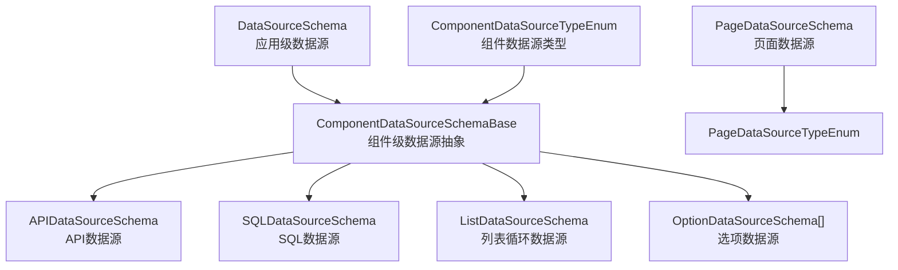
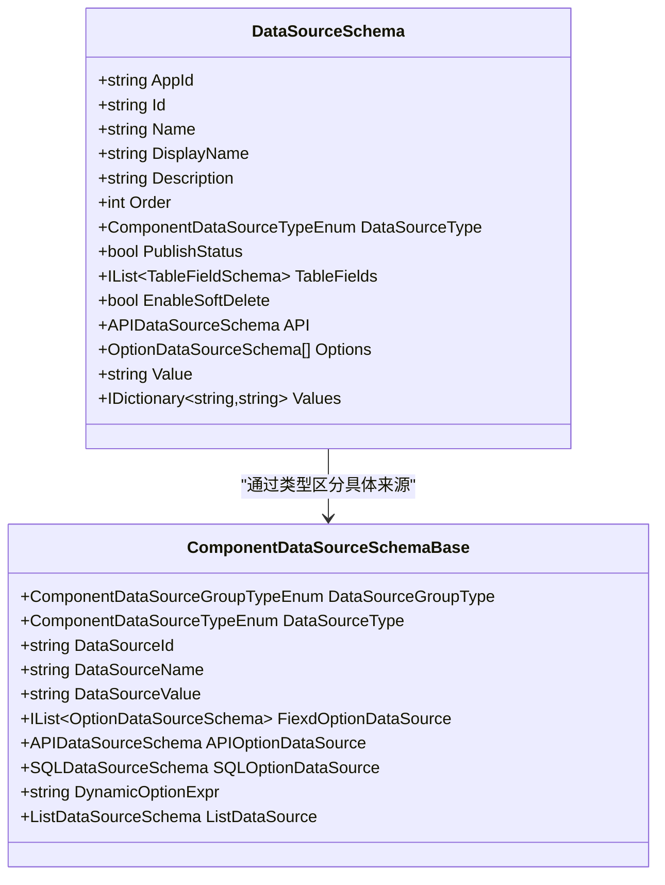
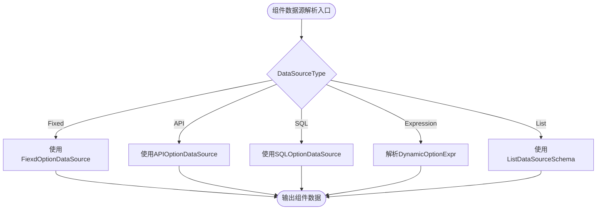
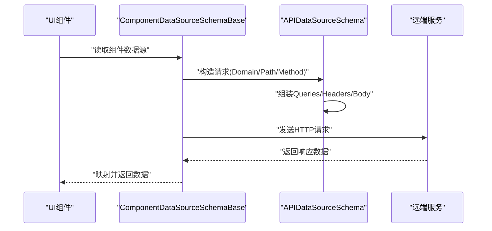
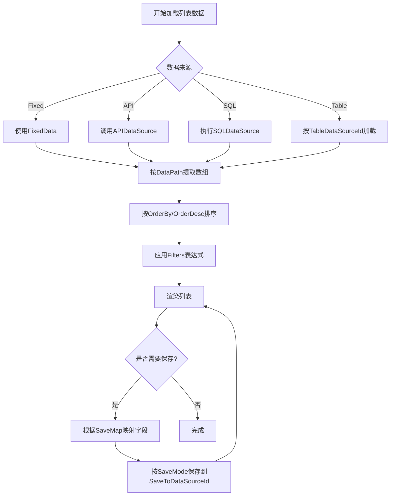

# 数据源Schema规范

<cite>
**本文引用的文件**   
- [DataSourceSchema.cs](file://src/LowCode/Common/H.LowCode.MetaSchema/DataSourceSchema.cs)
- [ComponentDataSourceSchema.cs](file://src/LowCode/Common/H.LowCode.MetaSchema/DataSourceSchemas/ComponentDataSourceSchema.cs)
- [APIDataSourceSchema.cs](file://src/LowCode/Common/H.LowCode.MetaSchema/DataSourceSchemas/APIDataSourceSchema.cs)
- [SQLDataSourceSchema.cs](file://src/LowCode/Common/H.LowCode.MetaSchema/DataSourceSchemas/SQLDataSourceSchema.cs)
- [ListDataSourceSchema.cs](file://src/LowCode/Common/H.LowCode.MetaSchema/DataSourceSchemas/ListDataSourceSchema.cs)
- [OptionDataSourceSchema.cs](file://src/LowCode/Common/H.LowCode.MetaSchema/DataSourceSchemas/OptionDataSourceSchema.cs)
- [ComponentDataSourceTypeEnum.cs](file://src/LowCode/Common/H.LowCode.MetaSchema/Enums/ComponentDataSourceTypeEnum.cs)
- [PageDataSourceTypeEnum.cs](file://src/LowCode/Common/H.LowCode.MetaSchema/Enums/PageDataSourceTypeEnum.cs)
- [PageDataSourceSchema.cs](file://src/LowCode/Common/H.LowCode.MetaSchema/DataSourceSchemas/PageDataSourceSchema.cs)
</cite>

## 目录
1. [引言](#引言)
2. [项目结构中的位置](#项目结构中的位置)
3. [核心概念与统一抽象](#核心概念与统一抽象)
4. [数据源类型枚举](#数据源类型枚举)
5. [组件数据源抽象](#组件数据源抽象)
6. [API数据源规范](#apidata源规范)
7. [SQL数据源规范](#sqldata源规范)
8. [列表数据源规范](#listdata源规范)
9. [选项数据源规范](#optiondata源规范)
10. [页面数据源规范](#pagedata源规范)
11. [响应映射机制](#响应映射机制)
12. [生命周期、缓存与错误处理](#生命周期缓存与错误处理)
13. [扩展开发指南](#扩展开发指南)
14. [性能优化建议](#性能优化建议)
15. [安全注意事项](#安全注意事项)
16. [完整Schema示例索引](#完整schema示例索引)
17. [故障排查](#故障排查)
18. [结论](#结论)

## 引言
本规范面向 H.AppLab 低代码平台的数据源 Schema，目标是帮助开发者理解并正确使用 DataSourceSchema 的统一抽象和 ComponentDataSourceSchema 的具体实现。文档覆盖数据源类型枚举、API 数据源、SQL 数据源、列表数据源、选项数据源以及页面数据源的配置字段、查询语义、响应映射方式，并提供扩展自定义数据源的方法、性能优化技巧和安全实践。

## 项目结构中的位置
数据源相关的核心类型集中在 MetaSchema 模块中：
- 顶层统一数据源定义位于 DataSourceSchema.cs。
- 组件级数据源抽象位于 ComponentDataSourceSchema.cs。
- 具体数据源类型定义包括 APIDataSourceSchema.cs、SQLDataSourceSchema.cs、ListDataSourceSchema.cs、OptionDataSourceSchema.cs。
- 类型枚举位于 ComponentDataSourceTypeEnum.cs 和 PageDataSourceTypeEnum.cs。
- 页面级数据源定义位于 PageDataSourceSchema.cs。

图表来源
- [DataSourceSchema.cs:1-69](file://src/LowCode/Common/H.LowCode.MetaSchema/DataSourceSchema.cs#L1-L69)
- [ComponentDataSourceSchema.cs:1-58](file://src/LowCode/Common/H.LowCode.MetaSchema/DataSourceSchemas/ComponentDataSourceSchema.cs#L1-L58)
- [APIDataSourceSchema.cs:1-59](file://src/LowCode/Common/H.LowCode.MetaSchema/DataSourceSchemas/APIDataSourceSchema.cs#L1-L59)
- [SQLDataSourceSchema.cs:1-12](file://src/LowCode/Common/H.LowCode.MetaSchema/DataSourceSchemas/SQLDataSourceSchema.cs#L1-L12)
- [ListDataSourceSchema.cs:1-92](file://src/LowCode/Common/H.LowCode.MetaSchema/DataSourceSchemas/ListDataSourceSchema.cs#L1-L92)
- [OptionDataSourceSchema.cs:1-28](file://src/LowCode/Common/H.LowCode.MetaSchema/DataSourceSchemas/OptionDataSourceSchema.cs#L1-L28)
- [PageDataSourceSchema.cs:1-18](file://src/LowCode/Common/H.LowCode.MetaSchema/DataSourceSchemas/PageDataSourceSchema.cs#L1-L18)
- [ComponentDataSourceTypeEnum.cs:1-15](file://src/LowCode/Common/H.LowCode.MetaSchema/Enums/ComponentDataSourceTypeEnum.cs#L1-L15)
- [PageDataSourceTypeEnum.cs:1-11](file://src/LowCode/Common/H.LowCode.MetaSchema/Enums/PageDataSourceTypeEnum.cs#L1-L11)

章节来源
- [DataSourceSchema.cs:1-69](file://src/LowCode/Common/H.LowCode.MetaSchema/DataSourceSchema.cs#L1-L69)
- [ComponentDataSourceSchema.cs:1-58](file://src/LowCode/Common/H.LowCode.MetaSchema/DataSourceSchemas/ComponentDataSourceSchema.cs#L1-L58)
- [APIDataSourceSchema.cs:1-59](file://src/LowCode/Common/H.LowCode.MetaSchema/DataSourceSchemas/APIDataSourceSchema.cs#L1-L59)
- [SQLDataSourceSchema.cs:1-12](file://src/LowCode/Common/H.LowCode.MetaSchema/DataSourceSchemas/SQLDataSourceSchema.cs#L1-L12)
- [ListDataSourceSchema.cs:1-92](file://src/LowCode/Common/H.LowCode.MetaSchema/DataSourceSchemas/ListDataSourceSchema.cs#L1-L92)
- [OptionDataSourceSchema.cs:1-28](file://src/LowCode/Common/H.LowCode.MetaSchema/DataSourceSchemas/OptionDataSourceSchema.cs#L1-L28)
- [PageDataSourceSchema.cs:1-18](file://src/LowCode/Common/H.LowCode.MetaSchema/DataSourceSchemas/PageDataSourceSchema.cs#L1-L18)
- [ComponentDataSourceTypeEnum.cs:1-15](file://src/LowCode/Common/H.LowCode.MetaSchema/Enums/ComponentDataSourceTypeEnum.cs#L1-L15)
- [PageDataSourceTypeEnum.cs:1-11](file://src/LowCode/Common/H.LowCode.MetaSchema/Enums/PageDataSourceTypeEnum.cs#L1-L11)

## 核心概念与统一抽象
DataSourceSchema 是应用级数据源的统一抽象，用于描述一个可被设计器和运行时解析的数据源元数据。它包含应用标识、数据源标识、名称、显示名、描述、排序、发布状态、数据源类型等通用字段，并按类型承载具体数据源配置：
- 表数据源字段：TableFields、EnableSoftDelete。
- API 数据源字段：API。
- 选项数据源字段：Options、Values、Value。

ComponentDataSourceSchemaBase 是组件级数据源抽象，强调“如何为某个组件提供数据”，支持分组类型、数据源类型、数据源引用（Id/Name/Value），以及多种数据来源形式：固定选项、API选项、SQL选项、动态表达式选项、列表循环数据源。

图表来源
- [DataSourceSchema.cs:1-69](file://src/LowCode/Common/H.LowCode.MetaSchema/DataSourceSchema.cs#L1-L69)
- [ComponentDataSourceSchema.cs:1-58](file://src/LowCode/Common/H.LowCode.MetaSchema/DataSourceSchemas/ComponentDataSourceSchema.cs#L1-L58)

章节来源
- [DataSourceSchema.cs:1-69](file://src/LowCode/Common/H.LowCode.MetaSchema/DataSourceSchema.cs#L1-L69)
- [ComponentDataSourceSchema.cs:1-58](file://src/LowCode/Common/H.LowCode.MetaSchema/DataSourceSchemas/ComponentDataSourceSchema.cs#L1-L58)

## 数据源类型枚举
组件数据源类型枚举定义了组件可用的数据源种类：
- None：无数据源。
- DB：数据库表数据源。
- API：远程接口数据源。
- Option：静态或字典型选项数据源。
- SQL：自定义 SQL 数据源。
- Expression：表达式数据源。
- Fiexd：固定值数据源。

页面数据源类型枚举更精简，仅包含 None、DB、API，适用于页面级别的数据加载场景。

章节来源
- [ComponentDataSourceTypeEnum.cs:1-15](file://src/LowCode/Common/H.LowCode.MetaSchema/Enums/ComponentDataSourceTypeEnum.cs#L1-L15)
- [PageDataSourceTypeEnum.cs:1-11](file://src/LowCode/Common/H.LowCode.MetaSchema/Enums/PageDataSourceTypeEnum.cs#L1-L11)

## 组件数据源抽象
ComponentDataSourceSchemaBase 提供了统一的组件数据源建模：
- DataSourceGroupType：分组类型，便于在设计器中组织不同来源类别。
- DataSourceType：具体数据类型，驱动渲染引擎选择对应执行策略。
- DataSourceId/DataSourceName/DataSourceValue：对已注册数据源的引用与快捷取值。
- FiexdOptionDataSource：固定选项数组，适合下拉框等控件的静态选项。
- APIOptionDataSource：通过 API 返回选项列表。
- SQLOptionDataSource：通过 SQL 返回选项列表。
- DynamicOptionExpr：动态表达式，例如将字段 JSON 字符串按换行拆分生成选项。
- ListDataSource：列表循环数据源，支持从 API/SQL/表数据源加载数据并进行排序、过滤、保存映射。

图表来源
- [ComponentDataSourceSchema.cs:1-58](file://src/LowCode/Common/H.LowCode.MetaSchema/DataSourceSchemas/ComponentDataSourceSchema.cs#L1-L58)
- [ListDataSourceSchema.cs:1-92](file://src/LowCode/Common/H.LowCode.MetaSchema/DataSourceSchemas/ListDataSourceSchema.cs#L1-L92)

章节来源
- [ComponentDataSourceSchema.cs:1-58](file://src/LowCode/Common/H.LowCode.MetaSchema/DataSourceSchemas/ComponentDataSourceSchema.cs#L1-L58)

## API数据源规范
APIDataSourceSchema 描述了 HTTP 接口的调用参数：
- Domain：目标域名或基础路径。
- Path：接口路径。
- Method：HTTP 方法。
- Queries：查询参数集合，每个参数包含 Id、Name、Type、Description。
- Body：请求体，支持 None、Json、Text、Multipart、Raw、Binary 等类型；当为 Multipart 时可通过 MultipartParams 描述多部分表单字段。
- Headers：请求头参数集合，结构与查询参数一致。

常见用途：
- 作为组件的 API 选项数据源，返回下拉项列表。
- 作为列表数据源的数据加载来源。
- 作为页面数据源，在页面初始化时拉取数据。

图表来源
- [ComponentDataSourceSchema.cs:1-58](file://src/LowCode/Common/H.LowCode.MetaSchema/DataSourceSchemas/ComponentDataSourceSchema.cs#L1-L58)
- [APIDataSourceSchema.cs:1-59](file://src/LowCode/Common/H.LowCode.MetaSchema/DataSourceSchemas/APIDataSourceSchema.cs#L1-L59)

章节来源
- [APIDataSourceSchema.cs:1-59](file://src/LowCode/Common/H.LowCode.MetaSchema/DataSourceSchemas/APIDataSourceSchema.cs#L1-L59)

## SQL数据源规范
SQLDataSourceSchema 描述自定义 SQL 查询：
- DbType：数据库类型，用于适配不同数据库方言。
- Sql：SQL 语句文本。

典型用法：
- 作为组件选项数据源，返回键值对列表。
- 作为列表数据源，结合 DataPath 提取数组结果。
- 作为页面数据源，在页面初始化阶段执行查询。

注意：
- Sql 内容应尽量避免拼接未经验证的用户输入。
- 建议配合后端服务封装，避免前端直接暴露数据库连接。

章节来源
- [SQLDataSourceSchema.cs:1-12](file://src/LowCode/Common/H.LowCode.MetaSchema/DataSourceSchemas/SQLDataSourceSchema.cs#L1-L12)

## 列表数据源规范
ListDataSourceSchema 是列表循环数据源的核心配置，支持多种数据来源和高级能力：
- FixedData：设计时预览用的固定数据数组。
- APIDataSource：API 数据源配置。
- SQLDataSource：SQL 数据源配置。
- DataPath：响应数据路径，例如 data.list，用于从复杂响应中提取数组。
- OrderBy/OrderDesc：排序字段及是否倒序。
- TableDataSourceId：表数据源引用 Id，用于加载应用级表数据源。
- Filters：过滤映射，key 为表字段名，value 为表达式，例如 $query(id)、$(item.f_x)。
- SaveToDataSourceId：保存目标表数据源 Id，可与加载来源不同。
- SaveMode：保存模式，Upsert 表示按主键新增或更新，InsertNew 表示重新生成主键后新增。
- SaveMap：保存字段映射，key 为目标表字段名，value 为表达式，支持 $(item.f_x)、$(form.key)、$query(x)、$(now) 等。

图表来源
- [ListDataSourceSchema.cs:1-92](file://src/LowCode/Common/H.LowCode.MetaSchema/DataSourceSchemas/ListDataSourceSchema.cs#L1-L92)

章节来源
- [ListDataSourceSchema.cs:1-92](file://src/LowCode/Common/H.LowCode.MetaSchema/DataSourceSchemas/ListDataSourceSchema.cs#L1-L92)

## 选项数据源规范
OptionDataSourceSchema 表示单个选项，包含：
- Label：显示标签。
- Value：选项值。
- IsSelected：是否默认选中。
- Order：排序顺序。
- Group：分组标签。
- Description：描述信息。

DataSourceSchema 支持 Options 数组与 Values 字典两种选项数据源形态：
- Options：结构化选项列表，适合下拉框、单选多选等。
- Values：键值对字典，适合快速配置简单映射。

此外，ComponentDataSourceSchemaBase 还支持：
- FiexdOptionDataSource：固定选项列表。
- APIOptionDataSource：通过 API 返回选项。
- SQLOptionDataSource：通过 SQL 返回选项。
- DynamicOptionExpr：动态表达式，例如将 JSON 字符串按换行拆分为选项。

章节来源
- [OptionDataSourceSchema.cs:1-28](file://src/LowCode/Common/H.LowCode.MetaSchema/DataSourceSchemas/OptionDataSourceSchema.cs#L1-L28)
- [DataSourceSchema.cs:1-69](file://src/LowCode/Common/H.LowCode.MetaSchema/DataSourceSchema.cs#L1-L69)
- [ComponentDataSourceSchema.cs:1-58](file://src/LowCode/Common/H.LowCode.MetaSchema/DataSourceSchemas/ComponentDataSourceSchema.cs#L1-L58)

## 页面数据源规范
PageDataSourceSchema 用于页面级别的数据源配置：
- DataSourceType：页面数据源类型，None、DB、API。
- DataSourceId：引用数据源 Id。
- DataSourceName：数据源名称。
- DataSourceValue：数据源值，可用于快速赋值。

页面数据源通常用于页面初始化时加载业务数据，例如用户信息、全局配置等。

章节来源
- [PageDataSourceSchema.cs:1-18](file://src/LowCode/Common/H.LowCode.MetaSchema/DataSourceSchemas/PageDataSourceSchema.cs#L1-L18)
- [PageDataSourceTypeEnum.cs:1-11](file://src/LowCode/Common/H.LowCode.MetaSchema/Enums/PageDataSourceTypeEnum.cs#L1-L11)

## 响应映射机制
数据源响应数据的映射主要依赖以下机制：
- DataPath：从复杂响应对象中提取数组数据，例如 data.list。
- Filters：将 URL 参数、上下文变量或行数据注入到查询条件中，如 $query(id)、$(item.f_x)。
- SaveMap：将列表行数据、表单值、URL 参数、时间函数等表达式映射到目标表字段，例如 $(item.f_x)、$(form.key)、$query(x)、$(now)。

这些机制共同构成“查询—转换—持久化”的完整数据流，使得低代码场景下的数据绑定更加灵活。

章节来源
- [ListDataSourceSchema.cs:1-92](file://src/LowCode/Common/H.LowCode.MetaSchema/DataSourceSchemas/ListDataSourceSchema.cs#L1-L92)

## 生命周期、缓存与错误处理
数据源生命周期通常包括：
- 设计时：使用 FixedData 进行可视化预览。
- 运行时加载：根据 DataSourceType 选择 API/SQL/表数据源执行。
- 数据处理：按 DataPath 提取、排序、过滤。
- 渲染：将数据绑定到 UI 组件。
- 保存：根据 SaveMode 与 SaveMap 进行 Upsert 或 InsertNew。

关于缓存与错误处理：
- 当前 Schema 定义未显式包含缓存控制字段，因此缓存策略应由运行时或服务层决定。
- 错误处理也未在 Schema 中直接体现，建议在数据访问层捕获异常并返回统一错误格式，由上层组件提示用户。
- 对于 API 数据源，建议设置超时、重试与熔断策略，避免雪崩。
- 对于 SQL 数据源，应避免长事务与全表扫描，合理分页与索引。

章节来源
- [ListDataSourceSchema.cs:1-92](file://src/LowCode/Common/H.LowCode.MetaSchema/DataSourceSchemas/ListDataSourceSchema.cs#L1-L92)
- [APIDataSourceSchema.cs:1-59](file://src/LowCode/Common/H.LowCode.MetaSchema/DataSourceSchemas/APIDataSourceSchema.cs#L1-L59)
- [SQLDataSourceSchema.cs:1-12](file://src/LowCode/Common/H.LowCode.MetaSchema/DataSourceSchemas/SQLDataSourceSchema.cs#L1-L12)

## 扩展开发指南
要扩展自定义数据源，建议遵循以下步骤：
1. 在 ComponentDataSourceTypeEnum 中添加新的类型值。
2. 创建新的 Schema 类，继承或组合现有结构，明确配置字段与约束。
3. 在 ComponentDataSourceSchemaBase 中增加对该类型的支持，例如新增属性以承载新数据源配置。
4. 在设计器中为新数据源提供编辑界面，绑定到对应 Schema 字段。
5. 在渲染引擎中实现该类型的解析与执行逻辑，确保与 DataPath/Filters/SaveMap 等机制兼容。
6. 编写单元测试与集成测试，覆盖正常流程、边界条件与异常场景。

最佳实践：
- 保持 Schema 字段的稳定命名与序列化约定，避免破坏向后兼容性。
- 对敏感字段（如密码、密钥）采用加密存储与最小权限原则。
- 对表达式引擎（如 $(item.f_x)、$query(x)）提供完善的校验与调试工具。
- 对外部数据源（API/SQL）统一封装，屏蔽底层差异。

章节来源
- [ComponentDataSourceTypeEnum.cs:1-15](file://src/LowCode/Common/H.LowCode.MetaSchema/Enums/ComponentDataSourceTypeEnum.cs#L1-L15)
- [ComponentDataSourceSchema.cs:1-58](file://src/LowCode/Common/H.LowCode.MetaSchema/DataSourceSchemas/ComponentDataSourceSchema.cs#L1-L58)

## 性能优化建议
- 优先使用 DataPath 精确提取所需数组，减少不必要的反序列化与内存占用。
- 合理使用 Filters，避免在前端拼装复杂 SQL，尽量在后端服务层完成过滤。
- 对列表数据启用分页与按需加载，避免一次性拉取大量数据。
- 对频繁访问的选项数据源考虑在服务层加缓存，减少重复请求。
- 对 API 调用设置合理的超时与重试上限，避免阻塞 UI。
- 对 SQL 查询添加必要索引，避免慢查询。

## 安全注意事项
- 严禁在前端直接拼接未经校验的用户输入到 SQL 或 API 路径中。
- 对 API 调用进行鉴权与限流，防止恶意请求。
- 对敏感字段（密码、令牌）不记录日志，不返回给前端。
- 对上传文件进行类型与大小限制，防止恶意文件上传。
- 对表达式引擎进行白名单与语法校验，防止注入攻击。

## 完整Schema示例索引
以下为各类数据源在仓库中的参考位置，可直接查看其字段结构：
- 应用级数据源统一抽象：[DataSourceSchema.cs](file://src/LowCode/Common/H.LowCode.MetaSchema/DataSourceSchema.cs)
- 组件级数据源抽象：[ComponentDataSourceSchema.cs](file://src/LowCode/Common/H.LowCode.MetaSchema/DataSourceSchemas/ComponentDataSourceSchema.cs)
- API 数据源：[APIDataSourceSchema.cs](file://src/LowCode/Common/H.LowCode.MetaSchema/DataSourceSchemas/APIDataSourceSchema.cs)
- SQL 数据源：[SQLDataSourceSchema.cs](file://src/LowCode/Common/H.LowCode.MetaSchema/DataSourceSchemas/SQLDataSourceSchema.cs)
- 列表数据源：[ListDataSourceSchema.cs](file://src/LowCode/Common/H.LowCode.MetaSchema/DataSourceSchemas/ListDataSourceSchema.cs)
- 选项数据源：[OptionDataSourceSchema.cs](file://src/LowCode/Common/H.LowCode.MetaSchema/DataSourceSchemas/OptionDataSourceSchema.cs)
- 页面数据源：[PageDataSourceSchema.cs](file://src/LowCode/Common/H.LowCode.MetaSchema/DataSourceSchemas/PageDataSourceSchema.cs)

## 故障排查
常见问题与建议：
- 数据无法加载：检查 DataSourceType 是否与预期一致，确认 DataSourceId/DataSourceName/DataSourceValue 引用正确。
- 列表为空：检查 DataPath 是否正确，确认 API/SQL 返回结构是否匹配。
- 过滤无效：检查 Filters 表达式语法，确认上下文变量是否可用。
- 保存失败：检查 SaveMap 映射关系与 SaveMode 设置，确认 SaveToDataSourceId 是否有效。
- API 报错：检查 Domain/Path/Method/Headers/Body 配置，确认跨域与鉴权。
- SQL 报错：检查 DbType 与 Sql 语法，确认数据库连接与权限。

章节来源
- [ListDataSourceSchema.cs:1-92](file://src/LowCode/Common/H.LowCode.MetaSchema/DataSourceSchemas/ListDataSourceSchema.cs#L1-L92)
- [APIDataSourceSchema.cs:1-59](file://src/LowCode/Common/H.LowCode.MetaSchema/DataSourceSchemas/APIDataSourceSchema.cs#L1-L59)
- [SQLDataSourceSchema.cs:1-12](file://src/LowCode/Common/H.LowCode.MetaSchema/DataSourceSchemas/SQLDataSourceSchema.cs#L1-L12)

## 结论
H.AppLab 的数据源 Schema 通过 DataSourceSchema 与 ComponentDataSourceSchemaBase 实现了应用级与组件级的统一抽象，并以 APIDataSourceSchema、SQLDataSourceSchema、ListDataSourceSchema、OptionDataSourceSchema 等具体类型支撑多样化数据场景。借助 DataPath、Filters、SaveMap 等机制，低代码平台能够灵活地完成数据加载、转换与持久化。开发者可在遵循本规范的前提下，扩展自定义数据源类型，同时结合性能优化与安全实践，构建稳定高效的数据接入体系。