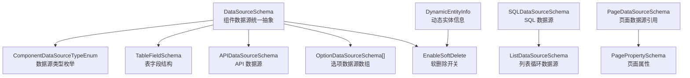
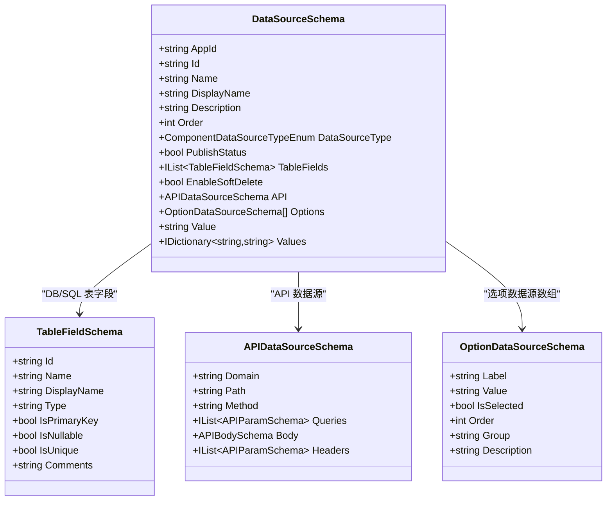
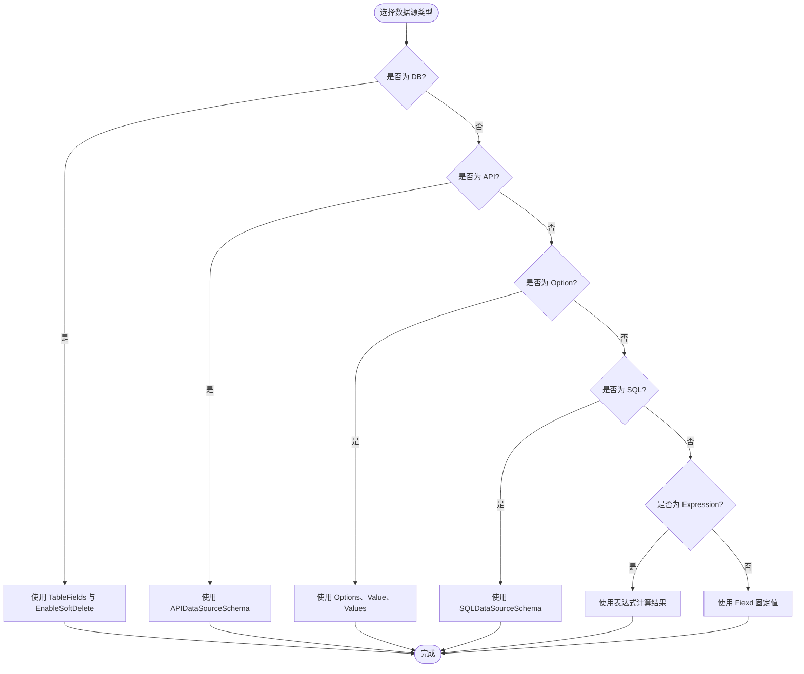
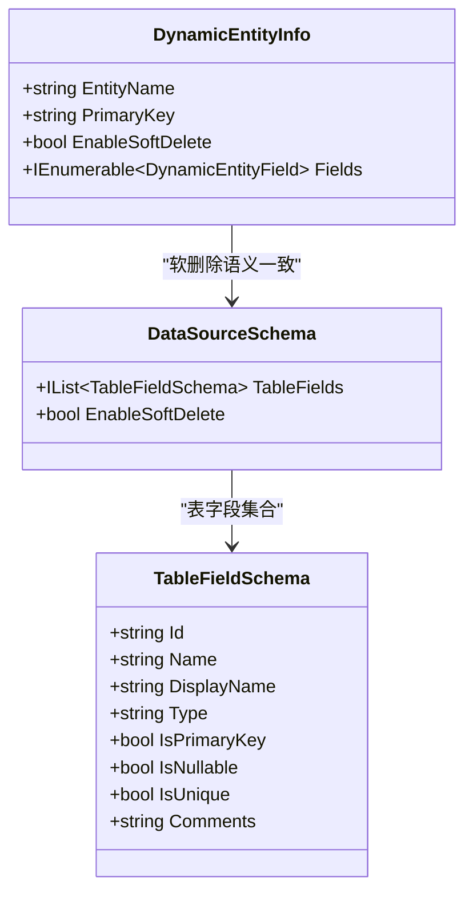
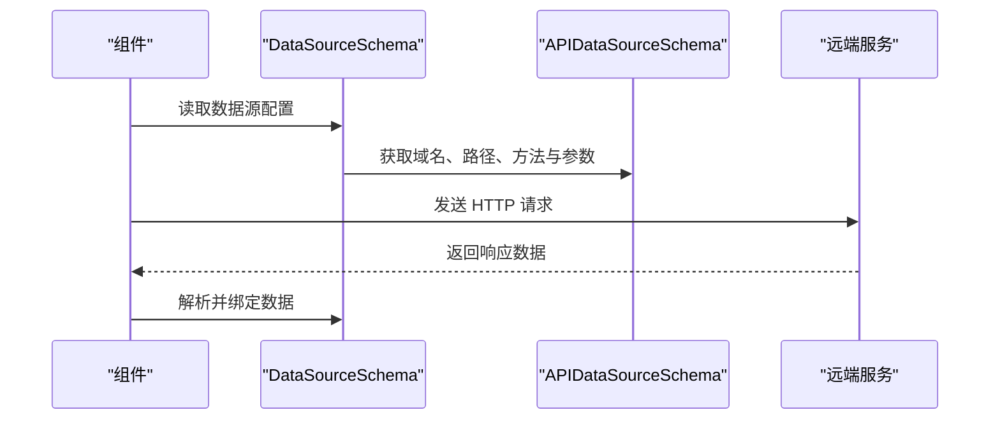
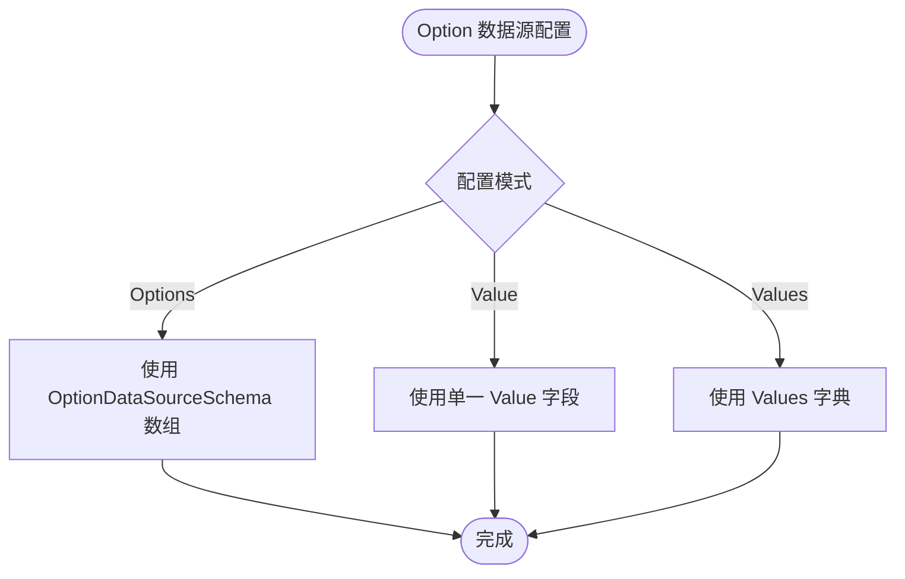
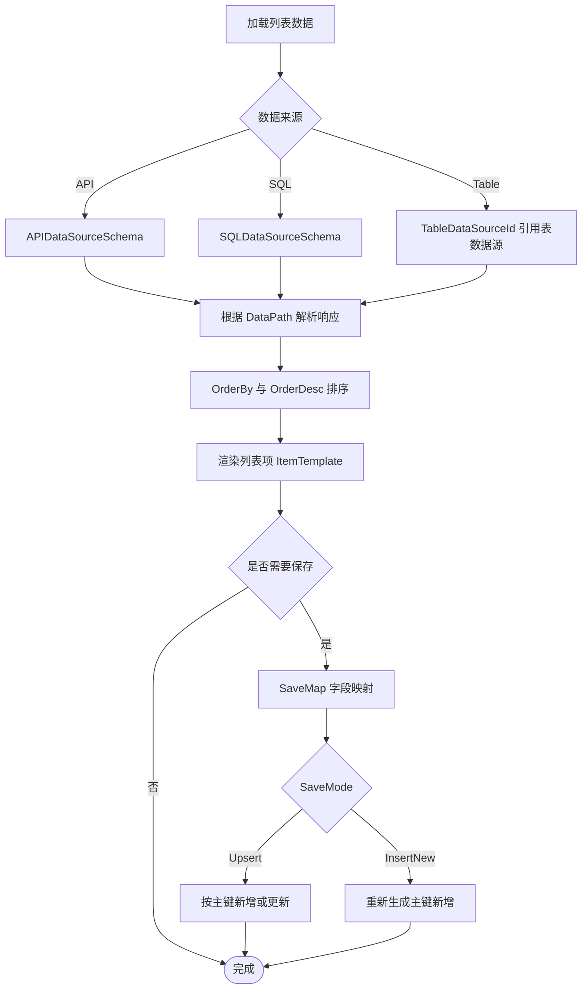
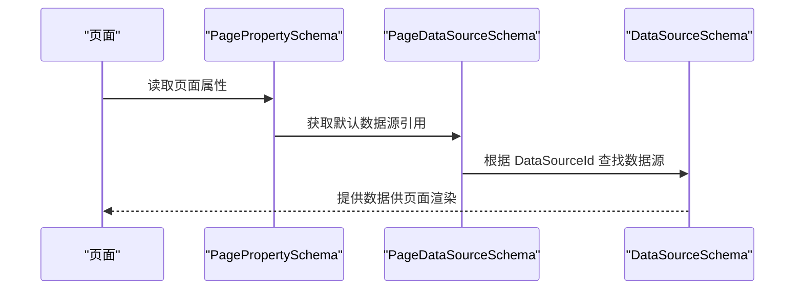
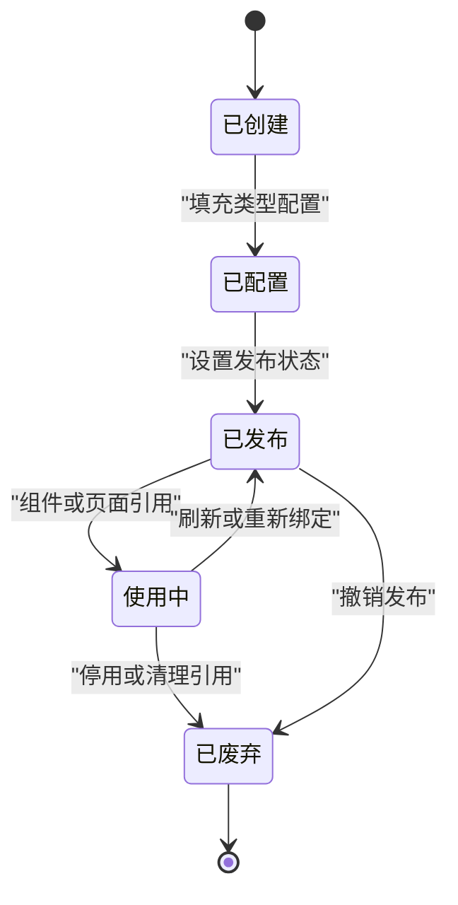
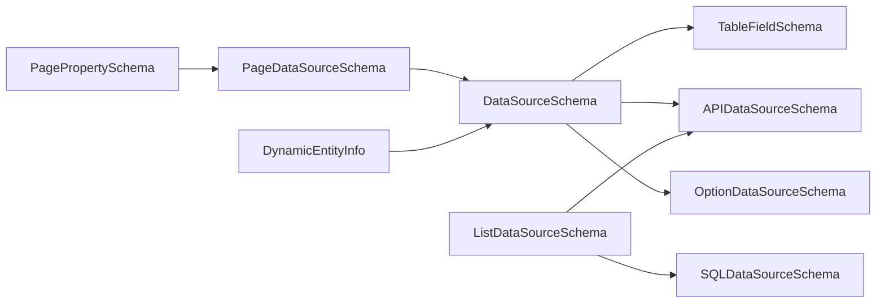

# 数据源基础Schema

<cite>
**本文引用的文件**
- [DataSourceSchema.cs](file://src/LowCode/Common/H.LowCode.MetaSchema/DataSourceSchema.cs)
- [ComponentDataSourceTypeEnum.cs](file://src/LowCode/Common/H.LowCode.MetaSchema/Enums/ComponentDataSourceTypeEnum.cs)
- [TableFieldSchema.cs](file://src/LowCode/Common/H.LowCode.MetaSchema/DataSourceSchemas/TableFieldSchema.cs)
- [APIDataSourceSchema.cs](file://src/LowCode/Common/H.LowCode.MetaSchema/DataSourceSchemas/APIDataSourceSchema.cs)
- [OptionDataSourceSchema.cs](file://src/LowCode/Common/H.LowCode.MetaSchema/DataSourceSchemas/OptionDataSourceSchema.cs)
- [SQLDataSourceSchema.cs](file://src/LowCode/Common/H.LowCode.MetaSchema/DataSourceSchemas/SQLDataSourceSchema.cs)
- [ListDataSourceSchema.cs](file://src/LowCode/Common/H.LowCode.MetaSchema/DataSourceSchemas/ListDataSourceSchema.cs)
- [PageDataSourceSchema.cs](file://src/LowCode/Common/H.LowCode.MetaSchema/DataSourceSchemas/PageDataSourceSchema.cs)
- [PagePropertySchema.cs](file://src/LowCode/Common/H.LowCode.MetaSchema/PropertySchemas/PagePropertySchema.cs)
- [DynamicEntityInfo.cs](file://src/LowCode/Common/H.LowCode.Entity/EntityManager/DynamicEntityInfo.cs)
</cite>

## 目录
1. [引言](#引言)
2. [项目结构定位](#项目结构定位)
3. [核心概念与统一抽象](#核心概念与统一抽象)
4. [数据源类型枚举](#数据源类型枚举)
5. [表字段结构与软删除机制](#表字段结构与软删除机制)
6. [API 数据源配置](#api-数据源配置)
7. [选项数据源配置方式](#选项数据源配置方式)
8. [SQL 与列表数据源](#sql-与列表数据源)
9. [页面级数据源引用](#页面级数据源引用)
10. [数据源 Schema JSON 示例说明](#数据源-schema-json-示例说明)
11. [生命周期与状态管理](#生命周期与状态管理)
12. [依赖关系分析](#依赖关系分析)
13. [性能与扩展建议](#性能与扩展建议)
14. [常见问题排查](#常见问题排查)
15. [结论](#结论)

## 引言
本文面向 H.AppLab 低代码平台的数据源基础 Schema，系统性梳理 DataSourceSchema 的统一抽象设计、数据源类型、表字段定义、API 与 Option 配置方式、SQL 与列表数据源、以及页面级数据源引用。文档同时解释 EnableSoftDelete 软删除机制在动态实体中的作用，并给出不同数据源类型的完整 JSON 配置思路。该规范适用于元数据建模、设计器开发、渲染引擎绑定和仓储序列化等场景。

## 项目结构定位
数据源基础 Schema 主要位于低代码公共元数据模块中，围绕组件数据源、页面数据源、列表循环数据源进行分层建模：
- 组件级数据源统一抽象：DataSourceSchema
- 组件数据源类型枚举：ComponentDataSourceTypeEnum
- 表字段模型：TableFieldSchema
- API 请求模型：APIDataSourceSchema
- 选项数据源模型：OptionDataSourceSchema
- SQL 查询模型：SQLDataSourceSchema
- 列表循环数据源模型：ListDataSourceSchema
- 页面数据源引用模型：PageDataSourceSchema
- 页面属性中的默认数据源：PagePropertySchema
- 动态实体运行时信息：DynamicEntityInfo

图示来源
- [DataSourceSchema.cs:1-69](file://src/LowCode/Common/H.LowCode.MetaSchema/DataSourceSchema.cs#L1-L69)
- [ComponentDataSourceTypeEnum.cs:1-15](file://src/LowCode/Common/H.LowCode.MetaSchema/Enums/ComponentDataSourceTypeEnum.cs#L1-L15)
- [TableFieldSchema.cs:1-33](file://src/LowCode/Common/H.LowCode.MetaSchema/DataSourceSchemas/TableFieldSchema.cs#L1-L33)
- [APIDataSourceSchema.cs:1-59](file://src/LowCode/Common/H.LowCode.MetaSchema/DataSourceSchemas/APIDataSourceSchema.cs#L1-L59)
- [OptionDataSourceSchema.cs:1-28](file://src/LowCode/Common/H.LowCode.MetaSchema/DataSourceSchemas/OptionDataSourceSchema.cs#L1-L28)
- [SQLDataSourceSchema.cs:1-12](file://src/LowCode/Common/H.LowCode.MetaSchema/DataSourceSchemas/SQLDataSourceSchema.cs#L1-L12)
- [ListDataSourceSchema.cs:1-92](file://src/LowCode/Common/H.LowCode.MetaSchema/DataSourceSchemas/ListDataSourceSchema.cs#L1-L92)
- [PageDataSourceSchema.cs:1-18](file://src/LowCode/Common/H.LowCode.MetaSchema/DataSourceSchemas/PageDataSourceSchema.cs#L1-L18)
- [PagePropertySchema.cs:1-36](file://src/LowCode/Common/H.LowCode.MetaSchema/PropertySchemas/PagePropertySchema.cs#L1-L36)
- [DynamicEntityInfo.cs:1-63](file://src/LowCode/Common/H.LowCode.Entity/EntityManager/DynamicEntityInfo.cs#L1-L63)

章节来源
- [DataSourceSchema.cs:1-69](file://src/LowCode/Common/H.LowCode.MetaSchema/DataSourceSchema.cs#L1-L69)
- [PagePropertySchema.cs:1-36](file://src/LowCode/Common/H.LowCode.MetaSchema/PropertySchemas/PagePropertySchema.cs#L1-L36)

## 核心概念与统一抽象
DataSourceSchema 是组件数据源的统一抽象，承载应用标识、数据源标识、名称、显示名称、描述、排序、类型、发布状态，以及按类型分化的具体配置。

- 应用标识 AppId：用于区分数据源所属的应用实例，保证多应用隔离。
- 数据源标识 Id：数据源唯一键，供组件和页面引用。
- 名称 Name：程序化命名，建议英文或下划线风格。
- 显示名称 DisplayName：用户界面展示名，可本地化或国际化。
- 描述 Description：数据源用途、数据来源、权限说明等元信息。
- 排序 Order：同一应用内数据源列表的展示顺序。
- 类型 DataSourceType：决定后续使用哪些具体配置块。
- 发布状态 PublishStatus：标记数据源是否已发布到运行环境。
- 表字段 TableFields：当类型为 DB 或 SQL 时，描述目标表的字段元数据。
- 软删除 EnableSoftDelete：当类型为 DB 且为表数据源时，启用逻辑删除能力。
- API 配置 API：当类型为 API 时，声明远端接口调用参数。
- 选项数据源 Options、Value、Values：当类型为 Option 时，提供静态选项、单选值或多选字典。

图示来源
- [DataSourceSchema.cs:1-69](file://src/LowCode/Common/H.LowCode.MetaSchema/DataSourceSchema.cs#L1-L69)
- [TableFieldSchema.cs:1-33](file://src/LowCode/Common/H.LowCode.MetaSchema/DataSourceSchemas/TableFieldSchema.cs#L1-L33)
- [APIDataSourceSchema.cs:1-59](file://src/LowCode/Common/H.LowCode.MetaSchema/DataSourceSchemas/APIDataSourceSchema.cs#L1-L59)
- [OptionDataSourceSchema.cs:1-28](file://src/LowCode/Common/H.LowCode.MetaSchema/DataSourceSchemas/OptionDataSourceSchema.cs#L1-L28)

章节来源
- [DataSourceSchema.cs:1-69](file://src/LowCode/Common/H.LowCode.MetaSchema/DataSourceSchema.cs#L1-L69)

## 数据源类型枚举
ComponentDataSourceTypeEnum 定义了组件数据源的类型集合，包括 None、DB、API、Option、SQL、Expression、Fiexd。

- None：占位或空数据源，常用于初始化、禁用或未配置状态。
- DB：数据库表数据源，配合 TableFields 与 EnableSoftDelete 使用。
- API：远程接口数据源，通过 APIDataSourceSchema 配置域名、路径、方法、查询参数、请求体与头部。
- Option：选项数据源，支持 Options 数组、Value 单选值和 Values 字典三种方式。
- SQL：自定义 SQL 数据源，结合 SQLDataSourceSchema 指定数据库类型与 SQL 语句。
- Expression：表达式数据源，通常由运行时计算生成结果，不依赖外部存储。
- Fiexd：固定值数据源，适合常量、枚举映射或静态配置。

图示来源
- [ComponentDataSourceTypeEnum.cs:1-15](file://src/LowCode/Common/H.LowCode.MetaSchema/Enums/ComponentDataSourceTypeEnum.cs#L1-L15)
- [DataSourceSchema.cs:1-69](file://src/LowCode/Common/H.LowCode.MetaSchema/DataSourceSchema.cs#L1-L69)

章节来源
- [ComponentDataSourceTypeEnum.cs:1-15](file://src/LowCode/Common/H.LowCode.MetaSchema/Enums/ComponentDataSourceTypeEnum.cs#L1-L15)

## 表字段结构与软删除机制
TableFieldSchema 描述表字段的元数据，包括字段标识、名称、显示名称、类型、主键、可空、唯一性与注释。它是 DB 与 SQL 数据源的基础结构，用于在设计器中呈现列信息，并在运行时参与数据映射与校验。

- Id：字段内部标识，便于 UI 与设计器交互。
- Name：字段程序名，通常对应数据库列名。
- DisplayName：字段显示名，面向用户界面。
- Type：字段类型字符串，例如文本、数字、日期等。
- IsPrimaryKey：是否为主键，影响保存模式与更新策略。
- IsNullable：是否允许为空，影响表单验证与数据写入。
- IsUnique：是否唯一，约束重复数据。
- Comments：字段注释，便于维护与文档化。

EnableSoftDelete 表示表数据源是否启用软删除。启用后，删除操作不会物理移除记录，而是通过逻辑标记实现“假删除”。该开关与 DynamicEntityInfo 的 EnableSoftDelete 共同体现动态实体的软删除语义，确保运行时实体管理器能正确执行逻辑删除与过滤查询。

图示来源
- [TableFieldSchema.cs:1-33](file://src/LowCode/Common/H.LowCode.MetaSchema/DataSourceSchemas/TableFieldSchema.cs#L1-L33)
- [DataSourceSchema.cs:1-69](file://src/LowCode/Common/H.LowCode.MetaSchema/DataSourceSchema.cs#L1-L69)
- [DynamicEntityInfo.cs:1-63](file://src/LowCode/Common/H.LowCode.Entity/EntityManager/DynamicEntityInfo.cs#L1-L63)

章节来源
- [TableFieldSchema.cs:1-33](file://src/LowCode/Common/H.LowCode.MetaSchema/DataSourceSchemas/TableFieldSchema.cs#L1-L33)
- [DataSourceSchema.cs:1-69](file://src/LowCode/Common/H.LowCode.MetaSchema/DataSourceSchema.cs#L1-L69)
- [DynamicEntityInfo.cs:1-63](file://src/LowCode/Common/H.LowCode.Entity/EntityManager/DynamicEntityInfo.cs#L1-L63)

## API 数据源配置
APIDataSourceSchema 描述远端 API 调用的完整请求结构，包括域名、路径、HTTP 方法、查询参数、请求体与请求头。

- Domain：服务域名或地址前缀。
- Path：接口路径。
- Method：HTTP 方法，如 GET、POST、PUT、DELETE。
- Queries：查询参数列表，每个参数包含 Id、Name、Type、Description。
- Body：请求体，支持多种数据类型，包括 None、Json、Text、Multipart、Raw、Binary。
- Headers：请求头列表，同样以 APIParamSchema 形式定义。

图示来源
- [APIDataSourceSchema.cs:1-59](file://src/LowCode/Common/H.LowCode.MetaSchema/DataSourceSchemas/APIDataSourceSchema.cs#L1-L59)
- [DataSourceSchema.cs:1-69](file://src/LowCode/Common/H.LowCode.MetaSchema/DataSourceSchema.cs#L1-L69)

章节来源
- [APIDataSourceSchema.cs:1-59](file://src/LowCode/Common/H.LowCode.MetaSchema/DataSourceSchemas/APIDataSourceSchema.cs#L1-L59)
- [DataSourceSchema.cs:1-69](file://src/LowCode/Common/H.LowCode.MetaSchema/DataSourceSchema.cs#L1-L69)

## 选项数据源配置方式
OptionDataSourceSchema 是单个选项的定义，包含标签、值、选中状态、排序、分组与描述。DataSourceSchema 在 Option 类型下提供三种配置方式：

- Options：选项数组，适合下拉框、复选框等需要多个选项的场景。
- Value：单选值，适合单项选择控件直接绑定固定值。
- Values：字典数据源，key-value 形式，适合键值映射、枚举翻译等场景。

图示来源
- [OptionDataSourceSchema.cs:1-28](file://src/LowCode/Common/H.LowCode.MetaSchema/DataSourceSchemas/OptionDataSourceSchema.cs#L1-L28)
- [DataSourceSchema.cs:1-69](file://src/LowCode/Common/H.LowCode.MetaSchema/DataSourceSchema.cs#L1-L69)

章节来源
- [OptionDataSourceSchema.cs:1-28](file://src/LowCode/Common/H.LowCode.MetaSchema/DataSourceSchemas/OptionDataSourceSchema.cs#L1-L28)
- [DataSourceSchema.cs:1-69](file://src/LowCode/Common/H.LowCode.MetaSchema/DataSourceSchema.cs#L1-L69)

## SQL 与列表数据源
SQLDataSourceSchema 用于声明自定义 SQL 查询，包括数据库类型 DbType 与 SQL 语句 Sql。它常与 ListDataSourceSchema 一起使用，构成列表循环数据源。

ListDataSourceSchema 描述列表循环数据源的加载、过滤、排序、保存等完整流程：
- FixedData：设计时预览固定数据。
- APIDataSource：API 数据源配置。
- SQLDataSource：SQL 数据源配置。
- DataPath：响应数据路径，例如 data.list。
- OrderBy、OrderDesc：排序字段与倒序标志。
- TableDataSourceId：引用 app 级表数据源 Id。
- Filters：过滤映射，将表字段名映射到表达式。
- SaveToDataSourceId：保存目标表数据源 Id。
- SaveMode：保存模式，Upsert 或 InsertNew。
- SaveMap：保存字段映射，将行数据、表单值、URL 参数等表达式映射到目标字段。

图示来源
- [SQLDataSourceSchema.cs:1-12](file://src/LowCode/Common/H.LowCode.MetaSchema/DataSourceSchemas/SQLDataSourceSchema.cs#L1-L12)
- [ListDataSourceSchema.cs:1-92](file://src/LowCode/Common/H.LowCode.MetaSchema/DataSourceSchemas/ListDataSourceSchema.cs#L1-L92)
- [DataSourceSchema.cs:1-69](file://src/LowCode/Common/H.LowCode.MetaSchema/DataSourceSchema.cs#L1-L69)

章节来源
- [SQLDataSourceSchema.cs:1-12](file://src/LowCode/Common/H.LowCode.MetaSchema/DataSourceSchemas/SQLDataSourceSchema.cs#L1-L12)
- [ListDataSourceSchema.cs:1-92](file://src/LowCode/Common/H.LowCode.MetaSchema/DataSourceSchemas/ListDataSourceSchema.cs#L1-L92)

## 页面级数据源引用
PageDataSourceSchema 用于页面级别的数据源引用，包含数据源类型、数据源标识、数据源名称与数据源值。PagePropertySchema 在页面属性中提供默认的 DataSource，使页面能够绑定一个全局数据源。

- DataSourceType：页面数据源类型，当前支持 None、DB、API。
- DataSourceId：引用 DataSourceSchema.Id。
- DataSourceName：可读的名称，用于界面展示。
- DataSourceValue：可选的值，用于简单绑定或表达式上下文。

图示来源
- [PageDataSourceSchema.cs:1-18](file://src/LowCode/Common/H.LowCode.MetaSchema/DataSourceSchemas/PageDataSourceSchema.cs#L1-L18)
- [PagePropertySchema.cs:1-36](file://src/LowCode/Common/H.LowCode.MetaSchema/PropertySchemas/PagePropertySchema.cs#L1-L36)
- [DataSourceSchema.cs:1-69](file://src/LowCode/Common/H.LowCode.MetaSchema/DataSourceSchema.cs#L1-L69)

章节来源
- [PageDataSourceSchema.cs:1-18](file://src/LowCode/Common/H.LowCode.MetaSchema/DataSourceSchemas/PageDataSourceSchema.cs#L1-L18)
- [PagePropertySchema.cs:1-36](file://src/LowCode/Common/H.LowCode.MetaSchema/PropertySchemas/PagePropertySchema.cs#L1-L36)

## 数据源 Schema JSON 示例说明
以下为不同数据源类型的 JSON 配置示例说明，字段名与 DataSourceSchema 的 JsonPropertyName 保持一致。

- 通用字段
  - aid：应用标识
  - id：数据源标识
  - n：名称
  - disn：显示名称
  - desc：描述
  - order：排序
  - type：数据源类型
  - pub：发布状态

- DB 类型示例要点
  - type 为 DB
  - fields 为 TableFieldSchema 数组
  - enableSoftDelete 为 true 或 false

- API 类型示例要点
  - type 为 API
  - api.domain、api.path、api.method
  - api.queries、api.headers 为 APIParamSchema 数组
  - api.body 包含 DataType、Value、MultipartParams

- Option 类型示例要点
  - type 为 Option
  - ops 为 OptionDataSourceSchema 数组，每项含 l、v、s、o、g、d
  - value 为单选值
  - vals 为键值对字典

- SQL 类型示例要点
  - type 为 SQL
  - sqlds.dbtype 与 sqlds.sql

- List 循环数据源示例要点
  - fxdata：固定数据数组
  - apids：API 数据源
  - sqlds：SQL 数据源
  - datapath：响应路径
  - orderby、orderdesc：排序
  - tbdsid：表数据源引用
  - flts：过滤映射
  - saveto：保存目标
  - savemode：保存模式
  - savemap：保存字段映射

注意：上述字段名均为 JSON 键名，实际使用时应遵循 DataSourceSchema 及其子类型的 JsonPropertyName 定义。

## 生命周期与状态管理
DataSourceSchema 的生命周期涵盖创建、配置、发布、使用与废弃五个阶段：

- 创建：设置 AppId、Id、Name、DisplayName、Description、Order。
- 配置：根据 DataSourceType 填充对应配置块（TableFields、API、Options、Values、SQL）。
- 发布：设置 PublishStatus，将数据源暴露给运行环境。
- 使用：组件或页面通过 DataSourceId 引用，加载数据并绑定 UI。
- 废弃：停用或删除数据源，避免被新页面或组件引用。

章节来源
- [DataSourceSchema.cs:1-69](file://src/LowCode/Common/H.LowCode.MetaSchema/DataSourceSchema.cs#L1-L69)

## 依赖关系分析
数据源 Schema 之间的依赖关系如下：
- DataSourceSchema 依赖 ComponentDataSourceTypeEnum、TableFieldSchema、APIDataSourceSchema、OptionDataSourceSchema。
- ListDataSourceSchema 依赖 APIDataSourceSchema 与 SQLDataSourceSchema。
- PageDataSourceSchema 与 PagePropertySchema 形成页面级数据源引用链。
- DynamicEntityInfo 与 DataSourceSchema 的 EnableSoftDelete 保持一致的软删除语义。

图示来源
- [DataSourceSchema.cs:1-69](file://src/LowCode/Common/H.LowCode.MetaSchema/DataSourceSchema.cs#L1-L69)
- [ListDataSourceSchema.cs:1-92](file://src/LowCode/Common/H.LowCode.MetaSchema/DataSourceSchemas/ListDataSourceSchema.cs#L1-L92)
- [PageDataSourceSchema.cs:1-18](file://src/LowCode/Common/H.LowCode.MetaSchema/DataSourceSchemas/PageDataSourceSchema.cs#L1-L18)
- [PagePropertySchema.cs:1-36](file://src/LowCode/Common/H.LowCode.MetaSchema/PropertySchemas/PagePropertySchema.cs#L1-L36)
- [DynamicEntityInfo.cs:1-63](file://src/LowCode/Common/H.LowCode.Entity/EntityManager/DynamicEntityInfo.cs#L1-L63)

## 性能与扩展建议
- 优先使用 TableDataSourceId 与 Filters，减少前端复杂过滤逻辑。
- 对于大数据列表，合理使用 DataPath 与分页，避免一次性加载过多数据。
- 对频繁访问的 Option 数据源，考虑缓存 Values 或 Options。
- 对 API 数据源，合理设置 Headers 与 Body，避免冗余请求。
- 启用 EnableSoftDelete 时，应在查询层统一添加逻辑删除过滤条件，避免数据泄露。
- 扩展新的数据源类型时，保持 DataSourceType 枚举与 DataSourceSchema 分支一致性。

## 常见问题排查
- 数据源未显示：检查 PublishStatus 与 DataSourceType 是否正确。
- 列表数据为空：确认 DataPath 是否能从 API 响应中提取数组。
- 选项无法多选：确认使用的是 Options 或 Values，而非单值 Value。
- 软删除异常：核对 EnableSoftDelete 是否与 DynamicEntityInfo 一致，并确保查询层过滤已生效。
- SQL 查询失败：检查 DbType 与 Sql 是否匹配，是否存在语法错误或权限不足。

## 结论
DataSourceSchema 为 H.AppLab 低代码平台提供了统一的数据源抽象，覆盖 DB、API、Option、SQL、Expression、Fiexd 等多种数据源类型。通过 TableFieldSchema、APIDataSourceSchema、OptionDataSourceSchema、SQLDataSourceSchema 与 ListDataSourceSchema，平台实现了从表结构、远端接口、静态选项、自定义 SQL 到列表循环绑定的完整数据流。页面级 PageDataSourceSchema 进一步将数据源与页面属性解耦，提升复用性与可维护性。EnableSoftDelete 与 DynamicEntityInfo 共同保障了软删除的一致性。按照本文规范进行建模与配置，可有效提升低代码应用的稳定性、可扩展性与用户体验。