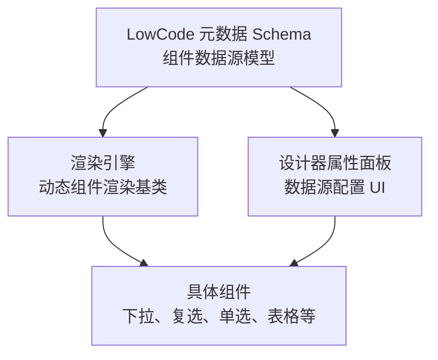
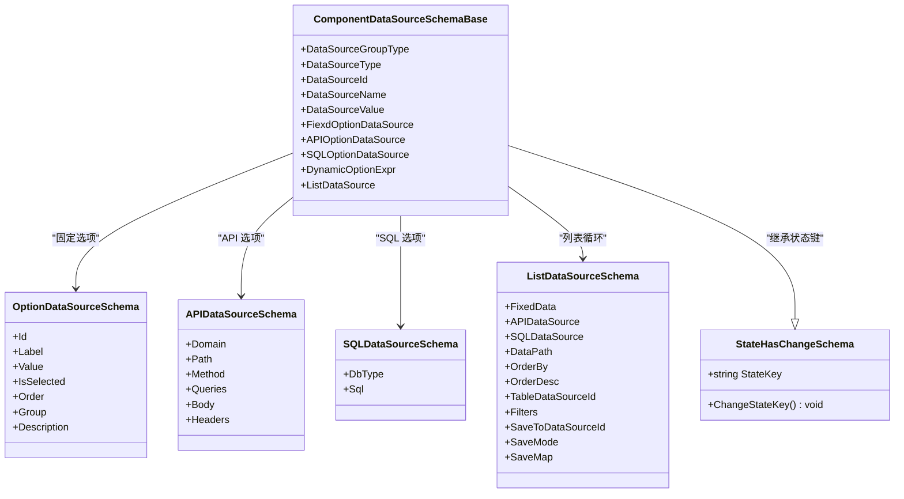
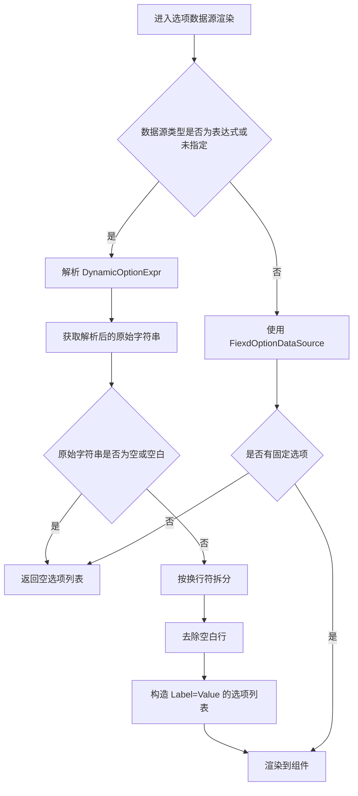
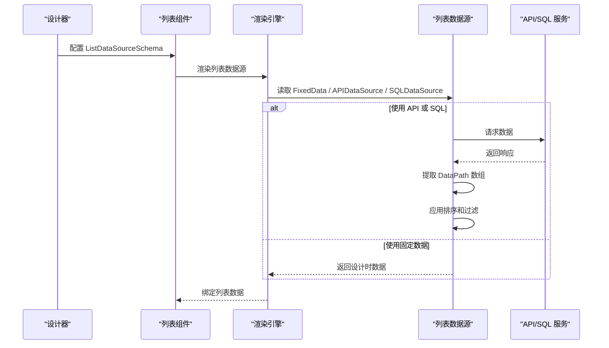
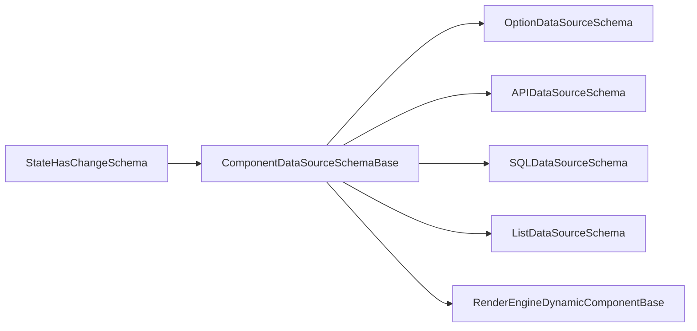

# 组件数据源Schema

<cite>
**本文引用的文件**
- [ComponentDataSourceSchema.cs](file://src/LowCode/Common/H.LowCode.MetaSchema/DataSourceSchemas/ComponentDataSourceSchema.cs)
- [OptionDataSourceSchema.cs](file://src/LowCode/Common/H.LowCode.MetaSchema/DataSourceSchemas/OptionDataSourceSchema.cs)
- [APIDataSourceSchema.cs](file://src/LowCode/Common/H.LowCode.MetaSchema/DataSourceSchemas/APIDataSourceSchema.cs)
- [SQLDataSourceSchema.cs](file://src/LowCode/Common/H.LowCode.MetaSchema/DataSourceSchemas/SQLDataSourceSchema.cs)
- [ListDataSourceSchema.cs](file://src/LowCode/Common/H.LowCode.MetaSchema/DataSourceSchemas/ListDataSourceSchema.cs)
- [ComponentDataSourceTypeEnum.cs](file://src/LowCode/Common/H.LowCode.MetaSchema/Enums/ComponentDataSourceTypeEnum.cs)
- [ComponentDataSourceGroupTypeEnum.cs](file://src/LowCode/Common/H.LowCode.MetaSchema/Enums/ComponentDataSourceGroupTypeEnum.cs)
- [StateHasChangeSchema.cs](file://src/LowCode/Common/H.LowCode.MetaSchema/StateHasChangeSchema.cs)
- [RenderEngineDynamicComponentBase.cs](file://src/LowCode/RenderEngine/H.LowCode.RenderEngineBase/RenderEngineDynamicComponentBase.cs)
</cite>

## 目录
1. [引言](#引言)
2. [项目结构与定位](#项目结构与定位)
3. [核心概念与抽象类设计](#核心概念与抽象类设计)
4. [数据源类型与分组类型](#数据源类型与分组类型)
5. [选项数据源配置模型](#选项数据源配置模型)
6. [动态选项表达式运行机制](#动态选项表达式运行机制)
7. [列表循环数据源集成方式](#列表循环数据源集成方式)
8. [完整配置示例](#完整配置示例)
9. [依赖关系分析](#依赖关系分析)
10. [性能与运行时行为](#性能与运行时行为)
11. [常见问题排查](#常见问题排查)
12. [结论](#结论)

## 引言
本技术规范面向 H.AppLab 低代码平台的“组件数据源 Schema”，重点说明组件在渲染时如何声明、绑定并解析不同类型的数据源。文档围绕以下目标展开：
- 解释 `ComponentDataSourceSchemaBase` 抽象类的设计模式及其在组件元数据中的作用。
- 说明 `DataSourceGroupType` 分组类型、`DataSourceType` 数据源类型、`DataSourceId` 和 `DataSourceName` 引用字段的意义。
- 对比固定选项数据源、API 选项数据源、SQL 选项数据源的配置方式和适用场景。
- 深入解释 `DynamicOptionExpr` 动态选项表达式的语法约定和运行时解析流程，包括类似 `$(item.f_options_json)` 的解析机制。
- 说明 `ListDataSource` 列表循环数据源的集成方式、加载路径、过滤映射、排序和保存映射。
- 给出可直接用于组件配置的 JSON Schema 示例，覆盖数据源绑定、表达式解析和运行时更新的关键路径。

## 项目结构与定位
组件数据源 Schema 位于 LowCode 公共元数据模块中，属于“组件元数据”的一部分；渲染引擎根据这些 Schema 在页面渲染阶段解析数据源、计算选项列表、绑定表格或列表数据，并在用户交互时触发刷新或保存。

该结构体现了“定义在元数据 Schema，消费在渲染引擎”的职责分离：
- 元数据层负责描述数据源的结构、类型、分组、引用和表达式。
- 渲染层负责根据 Schema 解析表达式、拉取数据、生成选项或列表项。
- 设计器层提供可视化编辑能力，帮助设计者填写 Schema。

**图表来源**
- [ComponentDataSourceSchema.cs:1-58](file://src/LowCode/Common/H.LowCode.MetaSchema/DataSourceSchemas/ComponentDataSourceSchema.cs#L1-L58)
- [RenderEngineDynamicComponentBase.cs:1540-1620](file://src/LowCode/RenderEngine/H.LowCode.RenderEngineBase/RenderEngineDynamicComponentBase.cs#L1540-L1620)

**章节来源**
- [ComponentDataSourceSchema.cs:1-58](file://src/LowCode/Common/H.LowCode.MetaSchema/DataSourceSchemas/ComponentDataSourceSchema.cs#L1-L58)
- [RenderEngineDynamicComponentBase.cs:1540-1620](file://src/LowCode/RenderEngine/H.LowCode.RenderEngineBase/RenderEngineDynamicComponentBase.cs#L1540-L1620)

## 核心概念与抽象类设计
`ComponentDataSourceSchemaBase` 是所有组件数据源 Schema 的抽象基类，它通过统一的字段描述一个组件绑定的数据来源。其核心设计点如下：

| 字段 | 作用 | 典型值或含义 |
|---|---|---|
| `DataSourceGroupType` | 数据源分组类型，决定数据在组件中的语义用途 | 通用、选项、表格、树、列表循环 |
| `DataSourceType` | 数据源实现类型，决定解析策略 | 无、数据库、API、选项、SQL、表达式、固定值 |
| `DataSourceId` | 数据源标识引用 | 通常指向应用级表数据源或外部数据源 ID |
| `DataSourceName` | 数据源名称展示引用 | 用于调试、日志、显示名 |
| `DataSourceValue` | 当前已解析的数据值缓存 | 用于避免重复解析或作为默认值 |
| `FiexdOptionDataSource` | 固定选项数据源集合 | 一组静态 label/value 选项 |
| `APIOptionDataSource` | API 选项数据源 | HTTP 域名、路径、方法、查询参数、请求头、请求体 |
| `SQLOptionDataSource` | SQL 选项数据源 | 数据库类型、SQL 语句 |
| `DynamicOptionExpr` | 动态选项表达式 | 运行时解析为字符串后按换行拆分形成选项 |
| `ListDataSource` | 列表循环数据源配置 | 支持固定数据、API、SQL、数据路径、排序、过滤、保存映射 |

此外，抽象基类继承自 `StateHasChangeSchema`，引入内部状态键 `StateKey`，用于触发组件状态变更和重新渲染。

**图表来源**
- [ComponentDataSourceSchema.cs:1-58](file://src/LowCode/Common/H.LowCode.MetaSchema/DataSourceSchemas/ComponentDataSourceSchema.cs#L1-L58)
- [OptionDataSourceSchema.cs:1-28](file://src/LowCode/Common/H.LowCode.MetaSchema/DataSourceSchemas/OptionDataSourceSchema.cs#L1-L28)
- [APIDataSourceSchema.cs:1-59](file://src/LowCode/Common/H.LowCode.MetaSchema/DataSourceSchemas/APIDataSourceSchema.cs#L1-L59)
- [SQLDataSourceSchema.cs:1-12](file://src/LowCode/Common/H.LowCode.MetaSchema/DataSourceSchemas/SQLDataSourceSchema.cs#L1-L12)
- [ListDataSourceSchema.cs:1-92](file://src/LowCode/Common/H.LowCode.MetaSchema/DataSourceSchemas/ListDataSourceSchema.cs#L1-L92)
- [StateHasChangeSchema.cs:1-15](file://src/LowCode/Common/H.LowCode.MetaSchema/StateHasChangeSchema.cs#L1-L15)

**章节来源**
- [ComponentDataSourceSchema.cs:1-58](file://src/LowCode/Common/H.LowCode.MetaSchema/DataSourceSchemas/ComponentDataSourceSchema.cs#L1-L58)
- [StateHasChangeSchema.cs:1-15](file://src/LowCode/Common/H.LowCode.MetaSchema/StateHasChangeSchema.cs#L1-L15)

## 数据源类型与分组类型
### 数据源类型
`ComponentDataSourceTypeEnum` 定义了组件数据源的多种来源形式：

| 枚举值 | 含义 | 使用建议 |
|---|---|---|
| `None` | 未显式指定类型 | 由渲染引擎根据已有配置推断 |
| `DB` | 数据库数据源 | 常用于表格、树等结构化数据 |
| `API` | API 数据源 | 调用远程接口获取数据 |
| `Option` | 选项数据源 | 用于下拉、单选、多选等选项型组件 |
| `SQL` | SQL 数据源 | 直接执行 SQL 获取选项或列表 |
| `Expression` | 表达式数据源 | 使用动态表达式生成选项或值 |
| `Fiexd` | 固定值数据源 | 使用静态选项集合 |

### 分组类型
`ComponentDataSourceGroupTypeEnum` 从组件语义角度划分数据源分组：

| 枚举值 | 含义 | 典型组件 |
|---|---|---|
| `General` | 通用数据源 | 表单字段、文本、富文本等 |
| `Option` | 选项数据源 | 下拉框、复选框、单选框 |
| `Table` | 表格数据源 | 表格组件 |
| `Tree` | 树形数据源 | 树形控件 |
| `List` | 列表循环数据源 | 列表循环容器、可编辑列表 |

分组类型主要用于渲染分支判断，例如当分组类型为 `List` 时，渲染引擎会走列表数据源渲染逻辑；当分组类型为 `Table` 时，会将数据源整体传递给表格组件。

**章节来源**
- [ComponentDataSourceTypeEnum.cs:1-15](file://src/LowCode/Common/H.LowCode.MetaSchema/Enums/ComponentDataSourceTypeEnum.cs#L1-L15)
- [ComponentDataSourceGroupTypeEnum.cs:1-13](file://src/LowCode/Common/H.LowCode.MetaSchema/Enums/ComponentDataSourceGroupTypeEnum.cs#L1-L13)
- [ComponentDataSourceSchema.cs:1-58](file://src/LowCode/Common/H.LowCode.MetaSchema/DataSourceSchemas/ComponentDataSourceSchema.cs#L1-L58)

## 选项数据源配置模型
### 固定选项数据源
固定选项数据源适合配置少量、稳定不变的选项，例如地区字典、状态枚举、开关选项等。每个选项包含：

| 字段 | 含义 |
|---|---|
| `Id` | 选项唯一标识 |
| `Label` | 显示文本 |
| `Value` | 提交值 |
| `IsSelected` | 是否选中 |
| `Order` | 排序序号 |
| `Group` | 分组标签 |
| `Description` | 描述信息 |

固定选项数据源的优势是简单可靠，缺点是难以维护大规模字典数据，也不适合随业务变化频繁调整。

### API 选项数据源
API 选项数据源通过 HTTP 接口动态获取选项。其核心字段包括：

| 字段 | 含义 |
|---|---|
| `Domain` | 服务域名 |
| `Path` | 接口路径 |
| `Method` | HTTP 方法 |
| `Queries` | 查询参数列表 |
| `Body` | 请求体，支持 JSON、文本、Multipart、Raw、Binary |
| `Headers` | 请求头参数列表 |

API 选项数据源适合需要远程字典、联动下拉、权限相关选项的场景。

### SQL 选项数据源
SQL 选项数据源直接声明数据库类型和 SQL 语句，适合对现有数据库有访问能力的后端环境。字段包括：

| 字段 | 含义 |
|---|---|
| `DbType` | 数据库类型 |
| `Sql` | SQL 语句 |

SQL 选项数据源灵活但风险较高，应避免拼接不可信输入，注意权限控制和性能影响。

### 三类选项数据源的区别
- **固定选项**：配置简单、无需网络调用，适合静态字典。
- **API 选项**：可远程获取、支持复杂参数和请求体，适合动态字典和业务关联选项。
- **SQL 选项**：直接操作数据库，适合后端可控且高性能要求的场景。

**章节来源**
- [OptionDataSourceSchema.cs:1-28](file://src/LowCode/Common/H.LowCode.MetaSchema/DataSourceSchemas/OptionDataSourceSchema.cs#L1-L28)
- [APIDataSourceSchema.cs:1-59](file://src/LowCode/Common/H.LowCode.MetaSchema/DataSourceSchemas/APIDataSourceSchema.cs#L1-L59)
- [SQLDataSourceSchema.cs:1-12](file://src/LowCode/Common/H.LowCode.MetaSchema/DataSourceSchemas/SQLDataSourceSchema.cs#L1-L12)
- [ComponentDataSourceSchema.cs:1-58](file://src/LowCode/Common/H.LowCode.MetaSchema/DataSourceSchemas/ComponentDataSourceSchema.cs#L1-L58)

## 动态选项表达式运行机制
动态选项表达式是 H.AppLab 组件数据源中最灵活的机制之一。`DynamicOptionExpr` 允许在运行时根据上下文数据生成选项字符串，渲染引擎将其解析后按换行拆分为选项。

### 表达式语法约定
- 表达式以 `$(...)` 形式引用上下文字段，例如 `$(item.f_options_json)`。
- 表达式结果通常是多行文本，每行表示一个选项。
- 渲染引擎将每一行同时作为 `Label` 和 `Value`。
- 空行会被忽略。

### 运行时解析流程
渲染引擎在以下情况下优先使用动态选项表达式：
1. `DataSourceType` 明确为 `Expression`。
2. `DataSourceType` 为 `None`，但存在 `DynamicOptionExpr`。

解析过程如下：

**图表来源**
- [RenderEngineDynamicComponentBase.cs:1540-1620](file://src/LowCode/RenderEngine/H.LowCode.RenderEngineBase/RenderEngineDynamicComponentBase.cs#L1540-L1620)

### 典型用法
- `$(item.f_options_json)`：从当前行数据的某个 JSON 字段读取选项字符串。
- `$(form.statusOptions)`：从表单上下文读取预定义的选项字符串。
- `$query.options`：从 URL 查询参数读取选项字符串。

这种机制特别适合“后端返回的选项格式与前端期望一致”的场景，例如后端统一返回多行文本形式的下拉选项。

**章节来源**
- [ComponentDataSourceSchema.cs:1-58](file://src/LowCode/Common/H.LowCode.MetaSchema/DataSourceSchemas/ComponentDataSourceSchema.cs#L1-L58)
- [RenderEngineDynamicComponentBase.cs:1540-1620](file://src/LowCode/RenderEngine/H.LowCode.RenderEngineBase/RenderEngineDynamicComponentBase.cs#L1540-L1620)

## 列表循环数据源集成方式
`ListDataSource` 用于为列表循环容器提供数据源，支持设计时预览数据和运行时动态加载。

### 主要配置字段
| 字段 | 含义 |
|---|---|
| `FixedData` | 设计时固定数据，便于预览 |
| `APIDataSource` | 运行时 API 数据源 |
| `SQLDataSource` | 运行时 SQL 数据源 |
| `DataPath` | 数据响应路径，例如 `data.list` |
| `OrderBy` | 排序字段 |
| `OrderDesc` | 是否倒序 |
| `TableDataSourceId` | 表数据源引用，用于加载来源 |
| `Filters` | 加载过滤映射，键为表字段，值为表达式 |
| `SaveToDataSourceId` | 保存目标表数据源 ID |
| `SaveMode` | 保存模式，新增或更新 |
| `SaveMap` | 保存字段映射，键为目标字段，值为表达式 |

### 列表数据渲染与加载
渲染引擎在检测到分组类型为 `List` 时，会调用列表数据源渲染逻辑。列表数据源支持：
- 设计时固定数据快速预览。
- 运行时从 API 或 SQL 加载数据。
- 从响应中提取数组数据。
- 排序、过滤、保存映射。

**图表来源**
- [ListDataSourceSchema.cs:1-92](file://src/LowCode/Common/H.LowCode.MetaSchema/DataSourceSchemas/ListDataSourceSchema.cs#L1-L92)
- [RenderEngineDynamicComponentBase.cs:1540-1620](file://src/LowCode/RenderEngine/H.LowCode.RenderEngineBase/RenderEngineDynamicComponentBase.cs#L1540-L1620)

### 过滤与保存映射
`Filters` 支持表达式，例如 `$query(id)`、`$(item.f_x)`，可将查询参数或上下文字段映射为数据库查询条件。`SaveMap` 支持将行数据、表单值、URL 参数、时间函数等表达式映射到目标表字段，从而简化保存逻辑。

**章节来源**
- [ListDataSourceSchema.cs:1-92](file://src/LowCode/Common/H.LowCode.MetaSchema/DataSourceSchemas/ListDataSourceSchema.cs#L1-L92)
- [RenderEngineDynamicComponentBase.cs:1540-1620](file://src/LowCode/RenderEngine/H.LowCode.RenderEngineBase/RenderEngineDynamicComponentBase.cs#L1540-L1620)

## 完整配置示例
以下示例展示不同类型数据源在组件中的配置方式。为保持规范性和可读性，仅列出关键字段及含义，不粘贴具体代码内容。

### 固定选项数据源
适用于静态下拉选项：
- 设置 `DataSourceGroupType` 为 `Option`。
- 设置 `DataSourceType` 为 `Fiexd`。
- 配置 `FiexdOptionDataSource`，每项包含 `Label`、`Value`、`Group`、`Order`。

### API 选项数据源
适用于远程字典或联动选项：
- 设置 `DataSourceGroupType` 为 `Option`。
- 设置 `DataSourceType` 为 `API`。
- 配置 `APIOptionDataSource`，包含 `Domain`、`Path`、`Method`、`Queries`、`Headers`、`Body`。

### SQL 选项数据源
适用于后端直连数据库的选项：
- 设置 `DataSourceGroupType` 为 `Option`。
- 设置 `DataSourceType` 为 `SQL`。
- 配置 `SQLOptionDataSource`，包含 `DbType`、`Sql`。

### 动态选项表达式
适用于从上下文字段解析选项字符串：
- 设置 `DataSourceGroupType` 为 `Option`。
- 设置 `DataSourceType` 为 `Expression` 或不设置。
- 配置 `DynamicOptionExpr`，例如 `$(item.f_options_json)`。
- 运行时解析后按换行拆分，每行作为选项的 label 和 value。

### 列表循环数据源
适用于列表循环容器：
- 设置 `DataSourceGroupType` 为 `List`。
- 配置 `ListDataSource`：
  - 设计时使用 `FixedData`。
  - 运行时使用 `APIDataSource` 或 `SQLDataSource`。
  - 使用 `DataPath` 提取数组数据。
  - 使用 `OrderBy`、`OrderDesc` 控制排序。
  - 使用 `Filters` 注入查询条件。
  - 使用 `SaveToDataSourceId`、`SaveMode`、`SaveMap` 配置保存行为。

### 数据源引用字段
- `DataSourceId`：用于引用应用级表数据源或外部数据源。
- `DataSourceName`：用于显示名称或调试信息。
- `DataSourceValue`：可用于缓存当前解析结果，减少重复计算。

**章节来源**
- [ComponentDataSourceSchema.cs:1-58](file://src/LowCode/Common/H.LowCode.MetaSchema/DataSourceSchemas/ComponentDataSourceSchema.cs#L1-L58)
- [OptionDataSourceSchema.cs:1-28](file://src/LowCode/Common/H.LowCode.MetaSchema/DataSourceSchemas/OptionDataSourceSchema.cs#L1-L28)
- [APIDataSourceSchema.cs:1-59](file://src/LowCode/Common/H.LowCode.MetaSchema/DataSourceSchemas/APIDataSourceSchema.cs#L1-L59)
- [SQLDataSourceSchema.cs:1-12](file://src/LowCode/Common/H.LowCode.MetaSchema/DataSourceSchemas/SQLDataSourceSchema.cs#L1-L12)
- [ListDataSourceSchema.cs:1-92](file://src/LowCode/Common/H.LowCode.MetaSchema/DataSourceSchemas/ListDataSourceSchema.cs#L1-L92)

## 依赖关系分析
组件数据源 Schema 的依赖关系可以概括为：
- 所有组件数据源都继承自 `StateHasChangeSchema`，获得状态键能力。
- 选项数据源可由固定选项、API 选项或 SQL 选项组成。
- 列表数据源可复用 API 和 SQL 数据源模型，并扩展出数据路径、排序、过滤、保存映射等能力。
- 渲染引擎依赖枚举和 Schema 决定渲染分支和数据加载策略。

**图表来源**
- [StateHasChangeSchema.cs:1-15](file://src/LowCode/Common/H.LowCode.MetaSchema/StateHasChangeSchema.cs#L1-L15)
- [ComponentDataSourceSchema.cs:1-58](file://src/LowCode/Common/H.LowCode.MetaSchema/DataSourceSchemas/ComponentDataSourceSchema.cs#L1-L58)
- [RenderEngineDynamicComponentBase.cs:1540-1620](file://src/LowCode/RenderEngine/H.LowCode.RenderEngineBase/RenderEngineDynamicComponentBase.cs#L1540-L1620)

**章节来源**
- [ComponentDataSourceSchema.cs:1-58](file://src/LowCode/Common/H.LowCode.MetaSchema/DataSourceSchemas/ComponentDataSourceSchema.cs#L1-L58)
- [RenderEngineDynamicComponentBase.cs:1540-1620](file://src/LowCode/RenderEngine/H.LowCode.RenderEngineBase/RenderEngineDynamicComponentBase.cs#L1540-L1620)

## 性能与运行时行为
- **状态键机制**：`StateKey` 用于触发组件状态更新。当数据源发生变化时，应调用状态更新逻辑以确保界面刷新。
- **表达式解析成本**：动态选项表达式会在渲染阶段解析，如果表达式涉及复杂上下文或远程数据，应注意避免频繁重渲染。
- **选项数量限制**：大量固定选项会影响渲染性能，建议对大型字典使用 API 或 SQL 数据源，并配合分页或搜索。
- **数据路径解析**：`DataPath` 用于从嵌套响应中提取数组，路径错误会导致列表为空，需确保后端响应结构稳定。
- **过滤表达式安全**：`Filters` 中的表达式应谨慎处理，避免注入风险；对于 SQL 数据源，建议使用参数化查询而非字符串拼接。

[本节为通用性能指导，不直接分析具体文件]

## 常见问题排查
### 动态选项为空
可能原因：
- `DynamicOptionExpr` 解析结果为空。
- 上下文中对应字段不存在或值为空。
- 表达式拼写错误。

排查建议：
- 检查表达式是否正确引用上下文字段。
- 在渲染前打印解析结果。
- 确认后端返回的选项字符串是否包含有效换行。

### 列表数据不显示
可能原因：
- `DataPath` 指向的路径不存在。
- API 或 SQL 返回的数据结构不符合预期。
- `Filters` 导致数据被过滤为空。

排查建议：
- 校验后端响应结构。
- 检查 `DataPath` 是否与响应结构匹配。
- 暂时移除 `Filters` 验证是否为过滤条件导致。

### 选项顺序异常
可能原因：
- 固定选项未正确设置 `Order`。
- 后端返回顺序不稳定。
- 未启用排序或排序字段不正确。

排查建议：
- 固定选项明确设置 `Order`。
- 列表数据源设置 `OrderBy` 和 `OrderDesc`。
- 后端返回稳定顺序或使用数据库排序。

### 保存映射无效
可能原因：
- `SaveMap` 表达式引用字段不存在。
- `SaveMode` 配置不符合业务需求。
- `SaveToDataSourceId` 指向的目标表数据源不正确。

排查建议：
- 检查表达式上下文字段是否存在。
- 确认保存模式为新增还是更新。
- 校验目标表数据源配置。

**章节来源**
- [RenderEngineDynamicComponentBase.cs:1540-1620](file://src/LowCode/RenderEngine/H.LowCode.RenderEngineBase/RenderEngineDynamicComponentBase.cs#L1540-L1620)
- [ListDataSourceSchema.cs:1-92](file://src/LowCode/Common/H.LowCode.MetaSchema/DataSourceSchemas/ListDataSourceSchema.cs#L1-L92)

## 结论
H.AppLab 的组件数据源 Schema 通过抽象基类统一了数据源的结构，并通过枚举区分数据源类型和分组类型，使渲染引擎能够根据配置自动选择解析策略。固定选项、API 选项、SQL 选项和动态表达式共同构成了灵活的选项数据源体系；列表循环数据源则在此基础上扩展了加载路径、排序、过滤和保存映射能力。

在实际使用中，建议：
- 静态小字典使用固定选项。
- 动态字典使用 API 或 SQL 数据源。
- 上下文驱动的选项使用动态表达式。
- 列表数据源明确配置数据路径、过滤条件和保存映射。
- 关注状态键和表达式解析性能，避免不必要的重渲染。