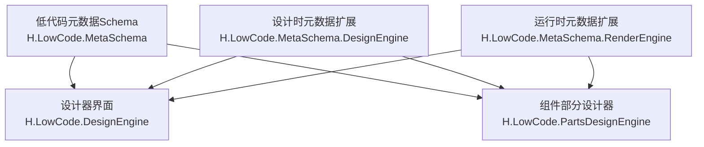
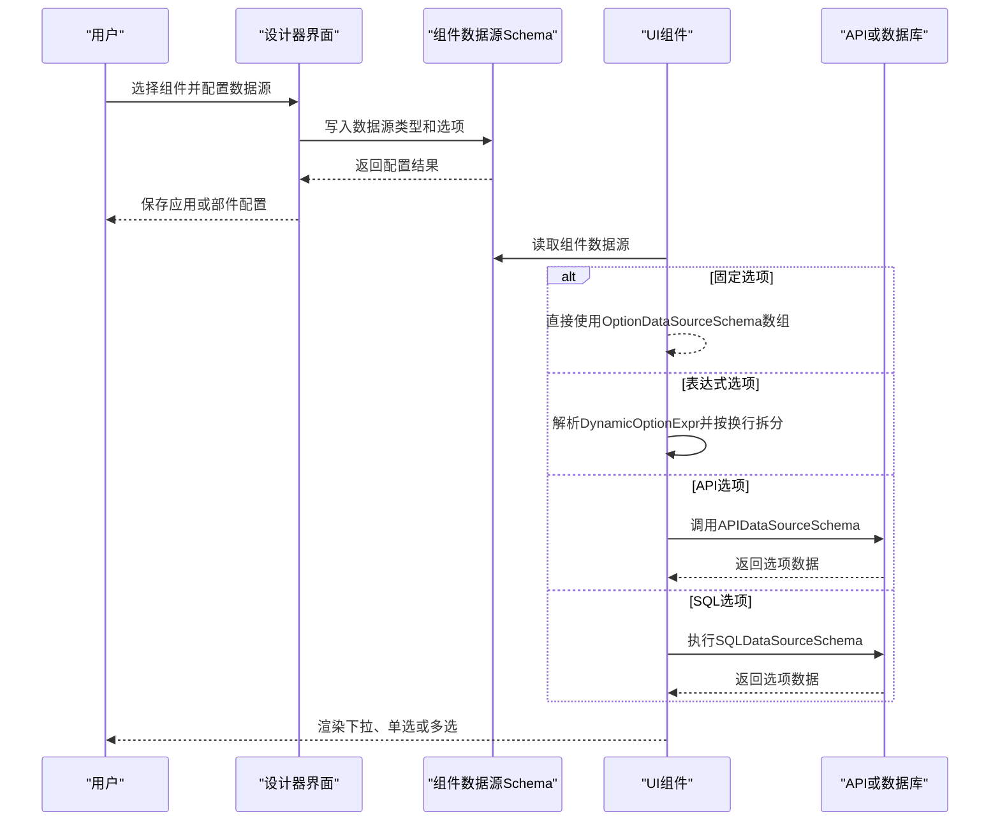
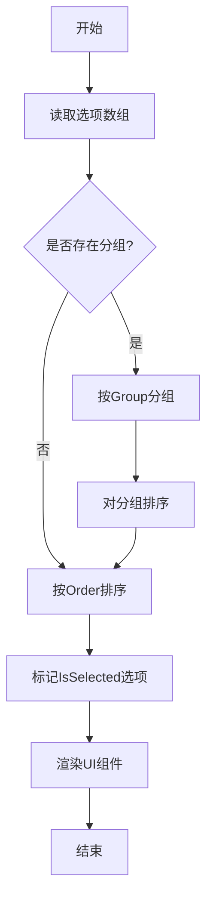

# 选项数据源Schema

<cite>
**本文引用的文件**   
- [OptionDataSourceSchema.cs](file://src/LowCode/Common/H.LowCode.MetaSchema/DataSourceSchemas/OptionDataSourceSchema.cs)
- [ComponentDataSourceSchema.cs](file://src/LowCode/Common/H.LowCode.MetaSchema/DataSourceSchemas/ComponentDataSourceSchema.cs)
- [DataSourceSchema.cs](file://src/LowCode/Common/H.LowCode.MetaSchema/DataSourceSchema.cs)
- [ComponentPartsDataSourceSchema.cs](file://src/LowCode/Common/H.LowCode.MetaSchema.DesignEngine/DataSourceSchemas/ComponentPartsDataSourceSchema.cs)
- [APIDataSourceSchema.cs](file://src/LowCode/Common/H.LowCode.MetaSchema/DataSourceSchemas/APIDataSourceSchema.cs)
- [SQLDataSourceSchema.cs](file://src/LowCode/Common/H.LowCode.MetaSchema/DataSourceSchemas/SQLDataSourceSchema.cs)
- [ListDataSourceSchema.cs](file://src/LowCode/Common/H.LowCode.MetaSchema/DataSourceSchemas/ListDataSourceSchema.cs)
- [ComponentDataSourceTypeEnum.cs](file://src/LowCode/Common/H.LowCode.MetaSchema/Enums/ComponentDataSourceTypeEnum.cs)
- [OptionDataSourceSetting.razor](file://src/LowCode/DesignEngine/H.LowCode.DesignEngine/SettingPanel/PropertySettingItems/OptionDataSource/OptionDataSourceSetting.razor)
- [FiexdForOptionDataSource.razor](file://src/LowCode/DesignEngine/H.LowCode.DesignEngine/SettingPanel/PropertySettingItems/OptionDataSource/FiexdForOptionDataSource.razor)
- [FixedOptionDataSourceEditor.razor](file://src/LowCode/DesignEngine/H.LowCode.PartsDesignEngine/Pages/ComponentParts/Components/FixedOptionDataSourceEditor.razor)
</cite>

## 目录

1. [引言](#引言)
2. [项目结构定位](#项目结构定位)
3. [核心数据结构](#核心数据结构)
4. [架构总览](#架构总览)
5. [组件与数据源关系](#组件与数据源关系)
6. [详细字段规范](#详细字段规范)
7. [静态配置与动态加载](#静态配置与动态加载)
8. [分组与排序机制](#分组与排序机制)
9. [完整配置示例](#完整配置示例)
10. [性能优化与大数据处理](#性能优化与大数据处理)
11. [与其他数据源的关联和同步](#与其他数据源的关联和同步)
12. [故障排查指南](#故障排查指南)
13. [结论](#结论)

## 引言

本文面向 H.AppLab 低代码平台的“选项数据源”能力，围绕 `OptionDataSourceSchema` 记录类型及其在表单控件、下拉选择器、单选框、多选框等 UI 组件中的应用场景，给出完整的技术规范说明。文档重点解释：

- 选项数据的静态配置方式。
- 通过表达式、API、SQL 实现的动态加载方式。
- `Label`、`Value`、`IsSelected`、`Order`、`Group`、`Description` 的语义、约束和渲染含义。
- 选项分组组织方式和排序规则。
- 与表数据源、列表数据源、API 数据源之间的关联关系和数据同步机制。
- 大数据量场景下的性能优化策略。

## 项目结构定位

选项数据源相关定义集中在低代码元数据 Schema 层中，主要由以下模块承担职责：

| 模块路径 | 职责 |
|---|---|
| `H.LowCode.MetaSchema` | 定义运行时使用的选项数据源结构、通用数据源结构、API 与 SQL 数据源结构、枚举类型。 |
| `H.LowCode.MetaSchema.DesignEngine` | 定义设计时组件部分的数据源扩展结构，用于设计器编辑组件时的选项配置。 |
| `H.LowCode.MetaSchema.RenderEngine` | 提供运行时组件数据源实现，与设计时结构对应但命名略有差异。 |
| `H.LowCode.DesignEngine` | 提供设计器中的选项数据源设置界面，包括固定选项、表达式、API、SQL 四类数据源切换。 |
| `H.LowCode.PartsDesignEngine` | 提供组件部分设计器中的固定选项编辑器，支持编辑显示文本、值、是否选中、分组、排序和描述。 |

**图示来源**  
- [ComponentDataSourceSchema.cs:5-58](file://src/LowCode/Common/H.LowCode.MetaSchema/DataSourceSchemas/ComponentDataSourceSchema.cs#L5-L58)  
- [ComponentPartsDataSourceSchema.cs:5-18](file://src/LowCode/Common/H.LowCode.MetaSchema.DesignEngine/DataSourceSchemas/ComponentPartsDataSourceSchema.cs#L5-L18)  
- [OptionDataSourceSetting.razor:1-57](file://src/LowCode/DesignEngine/H.LowCode.DesignEngine/SettingPanel/PropertySettingItems/OptionDataSource/OptionDataSourceSetting.razor#L1-L57)  
- [FixedOptionDataSourceEditor.razor:1-97](file://src/LowCode/DesignEngine/H.LowCode.PartsDesignEngine/Pages/ComponentParts/Components/FixedOptionDataSourceEditor.razor#L1-L97)

**章节来源**  
- [ComponentDataSourceSchema.cs:5-58](file://src/LowCode/Common/H.LowCode.MetaSchema/DataSourceSchemas/ComponentDataSourceSchema.cs#L5-L58)  
- [ComponentPartsDataSourceSchema.cs:5-18](file://src/LowCode/Common/H.LowCode.MetaSchema.DesignEngine/DataSourceSchemas/ComponentPartsDataSourceSchema.cs#L5-L18)  
- [OptionDataSourceSetting.razor:1-57](file://src/LowCode/DesignEngine/H.LowCode.DesignEngine/SettingPanel/PropertySettingItems/OptionDataSource/OptionDataSourceSetting.razor#L1-L57)  
- [FixedOptionDataSourceEditor.razor:1-97](file://src/LowCode/DesignEngine/H.LowCode.PartsDesignEngine/Pages/ComponentParts/Components/FixedOptionDataSourceEditor.razor#L1-L97)

## 核心数据结构

### OptionDataSourceSchema 记录类型

`OptionDataSourceSchema` 是单个选项的元数据记录。它使用 C# record 表示不可变为主的轻量对象，并通过 JSON 序列化属性控制键名压缩，便于在低代码配置中节省空间。

| 字段 | 类型 | JSON 键 | 默认行为 | 含义 |
|---|---|---|---|---|
| `Id` | `string` | 不序列化 | 自动生成短ID | 内部唯一标识，用于设计器编辑缓存、行级操作和状态管理。 |
| `Label` | `string?` | `l` | 空字符串 | 选项显示标签，供 UI 展示给用户。 |
| `Value` | `string?` | `v` | 空字符串 | 选项业务值，通常作为表单提交或绑定值。 |
| `IsSelected` | `bool` | `s` | `false` | 是否在初始化时标记为选中状态。 |
| `Order` | `int` | `o` | `0` | 排序权重；数值越小越靠前。 |
| `Group` | `string?` | `g` | 空字符串 | 分组名称；相同分组值的选项归入同一组。 |
| `Description` | `string?` | `d` | 空字符串 | 可选描述信息，可用于提示、辅助说明或调试。 |

该结构的 JSON 键非常紧凑：`l`、`v`、`s`、`o`、`g`、`d`。这意味着在应用配置、预览数据或持久化结构中，选项数组会表现为键名很短的对象数组。

**章节来源**  
- [OptionDataSourceSchema.cs:1-28](file://src/LowCode/Common/H.LowCode.MetaSchema/DataSourceSchemas/OptionDataSourceSchema.cs#L1-L28)

### 组件数据源基类

组件数据源抽象基类定义了所有组件数据源共享的结构：

| 字段 | 类型 | JSON 键 | 含义 |
|---|---|---|---|
| `DataSourceGroupType` | 枚举 | `dsgt` | 数据源分组类型。 |
| `DataSourceType` | 枚举 | `dst` | 数据源类型，例如固定值、表达式、API、SQL、表数据源等。 |
| `DataSourceId` | `string?` | `dsid` | 被引用数据源的 ID。 |
| `DataSourceName` | `string?` | `dsn` | 数据源显示名称。 |
| `DataSourceValue` | `string?` | `dsv` | 数据源当前值。 |
| `FiexdOptionDataSource` | `IList<OptionDataSourceSchema>?` | `fxopds` | 固定选项数据源。 |
| `APIOptionDataSource` | `APIDataSourceSchema?` | `apiopds` | API 选项数据源。 |
| `SQLOptionDataSource` | `SQLDataSourceSchema?` | `sqlopds` | SQL 选项数据源。 |
| `DynamicOptionExpr` | `string?` | `dynopexpr` | 动态选项表达式，运行时解析并按换行拆分为选项。 |
| `ListDataSource` | `ListDataSourceSchema?` | `listds` | 列表循环数据源配置。 |

其中 `DynamicOptionExpr` 是“表达式驱动选项”的关键字段，注释明确说明其按换行拆分结果生成选项。这与设计器中的“表达式”选项数据源类型直接对应。

**章节来源**  
- [ComponentDataSourceSchema.cs:5-58](file://src/LowCode/Common/H.LowCode.MetaSchema/DataSourceSchemas/ComponentDataSourceSchema.cs#L5-L58)

### 设计时组件数据源扩展

设计时组件数据源继承自组件数据源基类，并增加两个设计器专用字段：

| 字段 | 类型 | JSON 键 | 含义 |
|---|---|---|---|
| `DataSourceFragment` | `ComponentPartsFragmentSchema?` | `dsfrag` | 数据源渲染片段。 |
| `ItemTemplate` | `ComponentPartsSchema?` | `itemtpl` | 列表项模板，支持完整组件配置和条件渲染。 |

这说明在设计器中，组件数据源不仅决定“选项从哪来”，还可能参与“如何渲染”。

**章节来源**  
- [ComponentPartsDataSourceSchema.cs:5-18](file://src/LowCode/Common/H.LowCode.MetaSchema.DesignEngine/DataSourceSchemas/ComponentPartsDataSourceSchema.cs#L5-L18)

## 架构总览

选项数据源在整个低代码体系中处于“元数据 → 设计器 → 运行期 UI 组件”的中间层。它既是被配置的元数据，又是 UI 组件的下拉、单选、多选等选择型控件的数据来源。

**图示来源**  
- [OptionDataSourceSetting.razor:1-57](file://src/LowCode/DesignEngine/H.LowCode.DesignEngine/SettingPanel/PropertySettingItems/OptionDataSource/OptionDataSourceSetting.razor#L1-L57)  
- [ComponentDataSourceSchema.cs:5-58](file://src/LowCode/Common/H.LowCode.MetaSchema/DataSourceSchemas/ComponentDataSourceSchema.cs#L5-L58)  
- [APIDataSourceSchema.cs:1-59](file://src/LowCode/Common/H.LowCode.MetaSchema/DataSourceSchemas/APIDataSourceSchema.cs#L1-L59)  
- [SQLDataSourceSchema.cs:1-12](file://src/LowCode/Common/H.LowCode.MetaSchema/DataSourceSchemas/SQLDataSourceSchema.cs#L1-L12)

## 组件与数据源关系

在 H.AppLab 中，组件数据源由 `ComponentDataSourceSchemaBase` 统一抽象，设计器和运行期分别使用不同实现：

| 类型 | 位置 | 用途 |
|---|---|---|
| `ComponentDataSourceSchemaBase` | `H.LowCode.MetaSchema` | 抽象基类，定义通用字段。 |
| `ComponentPartsDataSourceSchema` | `H.LowCode.MetaSchema.DesignEngine` | 设计时组件部分数据源。 |
| `ComponentDataSourceSchema` | `H.LowCode.MetaSchema.RenderEngine` | 运行时组件数据源。 |

组件数据源类型由 `ComponentDataSourceTypeEnum` 指定，包括：

| 类型 | 值 | 含义 |
|---|---|---|
| `None` | `0` | 无数据源。 |
| `DB` | `1` | 表数据源。 |
| `API` | `2` | API 数据源。 |
| `Option` | `3` | 应用级选项数据源。 |
| `SQL` | `6` | SQL 数据源。 |
| `Expression` | `7` | 表达式数据源。 |
| `Fiexd` | `8` | 固定值数据源。 |

注意：设计器中的“选项数据源设置”允许选择固定值、表达式、API、SQL 四种选项数据源类型，而底层枚举还包含 `Option`、`DB` 等更广泛的数据源类型。这表示“选项数据源”是 UI 组件层面的一种用法，不一定等同于应用级 `DataSourceSchema.DataSourceType = Option`。

**章节来源**  
- [ComponentDataSourceSchema.cs:5-58](file://src/LowCode/Common/H.LowCode.MetaSchema/DataSourceSchemas/ComponentDataSourceSchema.cs#L5-L58)  
- [ComponentPartsDataSourceSchema.cs:5-18](file://src/LowCode/Common/H.LowCode.MetaSchema.DesignEngine/DataSourceSchemas/ComponentPartsDataSourceSchema.cs#L5-L18)  
- [ComponentDataSourceTypeEnum.cs:1-15](file://src/LowCode/Common/H.LowCode.MetaSchema/Enums/ComponentDataSourceTypeEnum.cs#L1-L15)  
- [OptionDataSourceSetting.razor:1-57](file://src/LowCode/DesignEngine/H.LowCode.DesignEngine/SettingPanel/PropertySettingItems/OptionDataSource/OptionDataSourceSetting.razor#L1-L57)

## 详细字段规范

### Label 显示标签

- **必填性**：逻辑上建议必填，因为 UI 需要向用户展示可读文本。
- **JSON 键**：`l`。
- **典型用途**：下拉框、单选框、多选框中显示的文本。
- **推荐实践**：
  - 保持简短、可读。
  - 不要混入业务主键或复杂结构。
  - 如果国际化需要，可保留多语言键，由上层渲染层解析。

### Value 值

- **必填性**：逻辑上建议必填，尤其是作为表单提交值时。
- **JSON 键**：`v`。
- **典型用途**：表单绑定值、API 请求参数、后端存储值。
- **推荐实践**：
  - 使用稳定、稳定的业务标识符。
  - 避免使用易变的自然语言作为值。
  - 对于多选场景，多个 `Value` 组合成集合。

### IsSelected 选中状态

- **JSON 键**：`s`。
- **默认值**：`false`。
- **典型用途**：初始化时标记某个选项为选中状态。
- **重要限制**：
  - 该字段是“静态默认选中标记”，不是运行期用户交互后最终选中状态的权威来源。
  - 多选组件若允许多个初始选中，应确保多个选项的 `IsSelected = true`。
  - 单选组件应避免多个 `IsSelected = true`，否则渲染行为可能不确定。

### Order 排序

- **JSON 键**：`o`。
- **默认值**：`0`。
- **典型用途**：控制选项显示顺序。
- **推荐实践**：
  - 从小到大排列。
  - 分组内可使用连续整数，如 `0、1、2`。
  - 分组间可使用较大间隔，便于插入新分组。

### Group 分组

- **JSON 键**：`g`。
- **默认值**：空字符串。
- **典型用途**：将多个选项归入同一分组，用于下拉分组、树形分组或分类展示。
- **渲染表现**：
  - 相同 `Group` 的选项属于同一组。
  - 空分组或未分组选项通常作为普通选项显示。
  - 分组本身一般不 selectable，除非显式实现。

### Description 描述

- **JSON 键**：`d`。
- **默认值**：空字符串。
- **典型用途**：辅助说明、提示信息、后台备注。
- **渲染建议**：
  - 可作为 tooltip、帮助文案或设计器侧的说明字段。
  - 不建议把描述当作用户可见的主展示内容。

### Id 内部标识

- **是否序列化**：否。
- **默认值**：自动生成的短ID。
- **典型用途**：
  - 设计器编辑缓存键。
  - 新增、删除、编辑行的内部索引。
  - 避免依赖 `Label` 或 `Value` 做行级操作，因为这两个字段可能被用户修改。

**章节来源**  
- [OptionDataSourceSchema.cs:1-28](file://src/LowCode/Common/H.LowCode.MetaSchema/DataSourceSchemas/OptionDataSourceSchema.cs#L1-L28)  
- [FixedOptionDataSourceEditor.razor:1-97](file://src/LowCode/DesignEngine/H.LowCode.PartsDesignEngine/Pages/ComponentParts/Components/FixedOptionDataSourceEditor.razor#L1-L97)

## 静态配置与动态加载

### 静态固定选项

静态选项通过 `FiexdOptionDataSource` 配置，即 `IList<OptionDataSourceSchema>`。它适合：

- 固定枚举值。
- 系统常量。
- 少量且变化频率低的选项。
- 设计时即可确定全部选项的场景。

设计器中的“固定值”选项数据源会渲染一个表格或卡片列表，支持新增、编辑、删除选项。

**章节来源**  
- [ComponentDataSourceSchema.cs:5-58](file://src/LowCode/Common/H.LowCode.MetaSchema/DataSourceSchemas/ComponentDataSourceSchema.cs#L5-L58)  
- [FiexdForOptionDataSource.razor:1-138](file://src/LowCode/DesignEngine/H.LowCode.DesignEngine/SettingPanel/PropertySettingItems/OptionDataSource/FiexdForOptionDataSource.razor#L1-L138)  
- [FixedOptionDataSourceEditor.razor:1-97](file://src/LowCode/DesignEngine/H.LowCode.PartsDesignEngine/Pages/ComponentParts/Components/FixedOptionDataSourceEditor.razor#L1-L97)

### 表达式动态选项

表达式选项通过 `DynamicOptionExpr` 配置。设计器说明明确指出：

> 选项来自表达式求值结果（按换行拆分为选项）。如 `$(item.f_options_json)`。

这意味着表达式可以引用上下文字段，运行时解析后按换行分割成多个选项。这种方式适合：

- 由其他字段或上游数据派生出的选项。
- 简单文本列表。
- 不需要复杂 API 调用的动态场景。

**章节来源**  
- [ComponentDataSourceSchema.cs:5-58](file://src/LowCode/Common/H.LowCode.MetaSchema/DataSourceSchemas/ComponentDataSourceSchema.cs#L5-L58)  
- [OptionDataSourceSetting.razor:1-57](file://src/LowCode/DesignEngine/H.LowCode.DesignEngine/SettingPanel/PropertySettingItems/OptionDataSource/OptionDataSourceSetting.razor#L1-L57)

### API 动态选项

API 选项通过 `APIOptionDataSource` 配置，底层类型为 `APIDataSourceSchema`，包含：

| 字段 | 类型 | JSON 键 | 含义 |
|---|---|---|---|
| `Domain` | `string` | `d` | API 域名。 |
| `Path` | `string` | `p` | API 路径。 |
| `Method` | `string` | `m` | HTTP 方法。 |
| `Queries` | `IList<APIParamSchema>` | `qs` | 查询参数。 |
| `Body` | `APIBodySchema` | `bd` | 请求体。 |
| `Headers` | `IList<APIParamSchema>` | `hs` | 请求头。 |

`APIBodySchema` 支持多种数据类型：

| 类型 | 值 | 含义 |
|---|---|---|
| `None` | `0` | 无请求体。 |
| `Json` | `1` | JSON 请求体。 |
| `Text` | `2` | 文本请求体。 |
| `Multipart` | `3` | 多部分请求体。 |
| `Raw` | `4` | 原始请求体。 |
| `Baniry` | `5` | 二进制请求体。 |

**章节来源**  
- [ComponentDataSourceSchema.cs:5-58](file://src/LowCode/Common/H.LowCode.MetaSchema/DataSourceSchemas/ComponentDataSourceSchema.cs#L5-L58)  
- [APIDataSourceSchema.cs:1-59](file://src/LowCode/Common/H.LowCode.MetaSchema/DataSourceSchemas/APIDataSourceSchema.cs#L1-L59)

### SQL 动态选项

SQL 选项通过 `SQLOptionDataSource` 配置，包含：

| 字段 | 类型 | JSON 键 | 含义 |
|---|---|---|---|
| `DbType` | `string` | `dt` | 数据库类型。 |
| `Sql` | `string` | `sql` | SQL 语句。 |

SQL 选项适合从现有表或视图直接获取选项，尤其当选项数据已经在数据库中维护时。

**章节来源**  
- [ComponentDataSourceSchema.cs:5-58](file://src/LowCode/Common/H.LowCode.MetaSchema/DataSourceSchemas/ComponentDataSourceSchema.cs#L5-L58)  
- [SQLDataSourceSchema.cs:1-12](file://src/LowCode/Common/H.LowCode.MetaSchema/DataSourceSchemas/SQLDataSourceSchema.cs#L1-L12)

## 分组与排序机制

### 分组组织方式

分组由 `Group` 字段决定。多个选项如果具有相同的 `Group` 值，则属于同一分组。常见组织方式：

| 场景 | 分组策略 |
|---|---|
| 省份城市 | `Group` 用“省份”，每个城市是一个选项。 |
| 产品分类 | `Group` 用“一级分类”，子产品在同一分组下。 |
| 字典表 | `Group` 用“字典类型”，如性别、状态、优先级。 |
| 未分组 | 留空或使用默认分组。 |

### 排序机制

排序由 `Order` 字段决定。通常：

- 同组内按 `Order` 升序。
- 不同组之间可以先按分组顺序，再按组内 `Order`。
- 如果未设置 `Order`，则默认值为 `0`，可能影响稳定排序。

### 渲染表现

虽然具体渲染细节由 UI 组件实现决定，但从 Schema 角度可以明确：

- `Label` 是用户可见文本。
- `Value` 是提交值。
- `IsSelected` 是初始选中标记。
- `Group` 是分组边界。
- `Order` 是显示顺序。
- `Description` 是辅助信息。

[本图为概念流程图，不直接映射具体源码，因此不提供图示来源]

## 完整配置示例

以下示例以“配置结构”的方式描述，不直接粘贴代码内容。

### 简单选项

适用于下拉选择器、单选框、多选框的基础选项。

| 字段 | 示例值 |
|---|---|
| `Label` | “启用” |
| `Value` | `"enabled"` |
| `IsSelected` | `true` 或 `false` |
| `Order` | `0` |
| `Group` | 空 |
| `Description` | “表示该项已启用” |

### 带默认选中的选项

适用于需要预置默认值的选择场景。

| 字段 | 示例值 |
|---|---|
| `Label` | “男” |
| `Value` | `"male"` |
| `IsSelected` | `true` |
| `Order` | `0` |
| `Group` | “性别” |
| `Description` | “男性” |

| 字段 | 示例值 |
|---|---|
| `Label` | “女” |
| `Value` | `"female"` |
| `IsSelected` | `false` |
| `Order` | `1` |
| `Group` | “性别” |
| `Description` | “女性” |

### 分组选项

适用于分类选择器，例如国家、地区、产品分类。

| 分组 | 选项 |
|---|---|
| “中国” | 北京、上海、广州 |
| “美国” | 纽约、洛杉矶、芝加哥 |
| “日本” | 东京、大阪、福冈 |

每个选项都应有独立 `Label`、`Value`、`Order`，`Group` 保持一致。

### 动态表达式选项

表达式字段示例语义：

| 字段 | 示例语义 |
|---|---|
| `DynamicOptionExpr` | 引用某字段，如 `$(item.f_options_json)` |
| 行为 | 运行时解析表达式，按换行拆分成多个选项 |

这种配置适合由其他数据源派生的文本列表。

### API 选项

API 选项配置应包含：

| 字段 | 示例语义 |
|---|---|
| `Domain` | 接口域名 |
| `Path` | 接口路径 |
| `Method` | GET、POST 等 |
| `Queries` | 查询参数列表 |
| `Body` | 请求体类型和内容 |
| `Headers` | 请求头 |

### SQL 选项

SQL 选项配置应包含：

| 字段 | 示例语义 |
|---|---|
| `DbType` | 数据库类型 |
| `Sql` | 查询选项的 SQL |

### 应用级选项数据源

应用级数据源通过 `DataSourceSchema` 的 `Options` 字段承载 `OptionDataSourceSchema[]`。它适用于整个应用共享的选项数据，而不是某个组件局部配置。

**章节来源**  
- [OptionDataSourceSchema.cs:1-28](file://src/LowCode/Common/H.LowCode.MetaSchema/DataSourceSchemas/OptionDataSourceSchema.cs#L1-L28)  
- [ComponentDataSourceSchema.cs:5-58](file://src/LowCode/Common/H.LowCode.MetaSchema/DataSourceSchemas/ComponentDataSourceSchema.cs#L5-L58)  
- [DataSourceSchema.cs:1-69](file://src/LowCode/Common/H.LowCode.MetaSchema/DataSourceSchema.cs#L1-L69)  
- [APIDataSourceSchema.cs:1-59](file://src/LowCode/Common/H.LowCode.MetaSchema/DataSourceSchemas/APIDataSourceSchema.cs#L1-L59)  
- [SQLDataSourceSchema.cs:1-12](file://src/LowCode/Common/H.LowCode.MetaSchema/DataSourceSchemas/SQLDataSourceSchema.cs#L1-L12)

## 性能优化与大数据处理

### 静态选项优化

静态选项适合数量较小的场景。优化建议：

- 控制在合理范围内，例如几百条以内。
- 合理设置 `Order`，避免频繁重排。
- 使用 `Group` 提升可读性，但不要过度细分导致分组过多。
- 仅在必要时保留 `Description`，以减少序列化体积。

### 表达式选项优化

表达式选项适合文本列表，但不适合超大结果集。优化建议：

- 表达式结果不应返回过大数组。
- 使用分页或筛选后再转换为选项。
- 对表达式结果做去重、过滤和排序。
- 避免在高频触发场景中重复计算。

### API 选项优化

API 选项适合动态、跨系统、较大的选项集合。优化建议：

- 使用分页接口。
- 使用防抖和缓存，避免重复请求。
- 对响应数据做字段映射，只取 `Label`、`Value` 等必要字段。
- 失败时提供降级选项或错误提示。
- 使用合适的缓存策略，例如按业务维度缓存。

### SQL 选项优化

SQL 选项适合直接从数据库获取选项。优化建议：

- 使用索引字段查询。
- 避免全表扫描。
- 对大表使用分页或限制返回条数。
- 对频繁变化的选项考虑缓存。
- 对敏感数据库连接做好权限控制。

### 大数据量 UI 优化

对于下拉、单选、多选等组件，大数据量场景还应考虑：

- 虚拟滚动。
- 搜索过滤。
- 懒加载。
- 分组折叠。
- 输入前缀匹配。
- 避免一次性渲染大量 DOM 节点。

[本节为通用性能指导，不直接分析具体源码文件，因此不提供章节来源]

## 与其他数据源的关联和同步

### 与应用级选项数据源的关系

`DataSourceSchema` 是应用级数据源定义，包含：

| 字段 | 类型 | JSON 键 | 含义 |
|---|---|---|---|
| `AppId` | `string` | `aid` | 应用ID。 |
| `Id` | `string` | — | 数据源ID。 |
| `Name` | `string` | `n` | 数据源名称。 |
| `DisplayName` | `string?` | `disn` | 显示名称。 |
| `Description` | `string?` | `desc` | 描述。 |
| `Order` | `int` | `order` | 排序。 |
| `DataSourceType` | 枚举 | `type` | 数据源类型。 |
| `PublishStatus` | `bool` | `pub` | 发布状态。 |
| `Options` | `OptionDataSourceSchema[]?` | `ops` | 选项数据源。 |
| `Values` | `IDictionary<string, string>?` | `vals` | 字典数据源。 |
| `Value` | `string?` | — | 值。 |

当 `DataSourceType` 为 `Option` 时，`Options` 字段承载 `OptionDataSourceSchema[]`。这是应用级选项数据源的核心结构。

### 与组件数据源的关系

组件数据源通过 `ComponentDataSourceSchemaBase` 支持多种选项来源：

- 固定选项：`FiexdOptionDataSource`。
- 表达式选项：`DynamicOptionExpr`。
- API 选项：`APIOptionDataSource`。
- SQL 选项：`SQLOptionDataSource`。
- 列表数据源：`ListDataSource`。

这表明组件层面的“选项数据源”和应用层面的“选项数据源”是两个层次：

| 层次 | 结构 | 作用 |
|---|---|---|
| 应用级 | `DataSourceSchema.Options` | 定义全局选项集合。 |
| 组件级 | `ComponentDataSourceSchemaBase` | 定义某个组件如何获取选项。 |

### 与列表数据源的关系

`ListDataSourceSchema` 支持从 API、SQL 或固定数据加载列表，并可配置：

| 字段 | 类型 | JSON 键 | 含义 |
|---|---|---|---|
| `FixedData` | `IList<Dictionary<string, object>>?` | `fxdata` | 设计时固定数据。 |
| `APIDataSource` | `APIDataSourceSchema?` | `apids` | API 数据源。 |
| `SQLDataSource` | `SQLDataSourceSchema?` | `sqlds` | SQL 数据源。 |
| `DataPath` | `string?` | `datapath` | 数据响应路径。 |
| `OrderBy` | `string?` | `orderby` | 排序字段。 |
| `OrderDesc` | `bool` | `orderdesc` | 是否倒序。 |
| `TableDataSourceId` | `string?` | `tbdsid` | 表数据源引用。 |
| `Filters` | `IDictionary<string, string>?` | `flts` | 加载过滤映射。 |
| `SaveToDataSourceId` | `string?` | `saveto` | 保存目标表数据源ID。 |
| `SaveMode` | 枚举 | `savemode` | 保存模式。 |
| `SaveMap` | `IDictionary<string, string>?` | `savemap` | 保存字段映射。 |

列表数据源与选项数据源的区别在于：

- 列表数据源返回的是“行数据集合”，常用于表格、卡片列表。
- 选项数据源返回的是“选择项集合”，常用于下拉、单选、多选。
- 但两者都可以复用 API 和 SQL 数据源结构。

### 数据同步机制

数据同步在不同层级有不同的含义：

| 场景 | 同步机制 |
|---|---|
| 设计器编辑固定选项 | 通过 `FiexdOptionDataSource` 直接修改 `OptionDataSourceSchema` 列表。 |
| 表达式选项 | 运行时解析表达式，按换行生成选项。 |
| API 选项 | 运行时调用 API，将响应映射为选项。 |
| SQL 选项 | 运行时执行 SQL，将结果映射为选项。 |
| 列表数据源 | 通过 `Filters`、`SaveMap`、`SaveMode` 与表数据源进行读写同步。 |
| 应用级选项 | 通过 `DataSourceSchema.Options` 统一管理。 |

**章节来源**  
- [DataSourceSchema.cs:1-69](file://src/LowCode/Common/H.LowCode.MetaSchema/DataSourceSchema.cs#L1-L69)  
- [ComponentDataSourceSchema.cs:5-58](file://src/LowCode/Common/H.LowCode.MetaSchema/DataSourceSchemas/ComponentDataSourceSchema.cs#L5-L58)  
- [ListDataSourceSchema.cs:1-92](file://src/LowCode/Common/H.LowCode.MetaSchema/DataSourceSchemas/ListDataSourceSchema.cs#L1-L92)

## 故障排查指南

### 选项没有显示

可能原因：

- `Label` 为空。
- `DataSourceType` 未正确设置。
- 表达式结果为空或格式不符合预期。
- API 返回数据未正确映射为选项。
- SQL 查询无结果。

排查步骤：

1. 检查 `DataSourceType` 是否为固定值、表达式、API 或 SQL。
2. 如果是固定选项，确认 `FiexdOptionDataSource` 非空。
3. 如果是表达式选项，检查 `DynamicOptionExpr` 解析结果。
4. 如果是 API 选项，检查 `APIDataSourceSchema` 配置。
5. 如果是 SQL 选项，检查 `SQLDataSourceSchema` 配置。

**章节来源**  
- [OptionDataSourceSetting.razor:1-57](file://src/LowCode/DesignEngine/H.LowCode.DesignEngine/SettingPanel/PropertySettingItems/OptionDataSource/OptionDataSourceSetting.razor#L1-L57)  
- [ComponentDataSourceSchema.cs:5-58](file://src/LowCode/Common/H.LowCode.MetaSchema/DataSourceSchemas/ComponentDataSourceSchema.cs#L5-L58)

### 选项顺序异常

可能原因：

- `Order` 未设置或值混乱。
- 分组与排序混合使用时未按预期分层排序。
- 前端渲染层未对 `Order` 做升序处理。

建议：

- 对同组选项使用连续 `Order`。
- 对分组间使用明确排序策略。
- 在前端渲染层对 `Order` 做稳定排序。

**章节来源**  
- [OptionDataSourceSchema.cs:1-28](file://src/LowCode/Common/H.LowCode.MetaSchema/DataSourceSchemas/OptionDataSourceSchema.cs#L1-L28)

### 默认选中不正确

可能原因：

- 多个选项同时设置 `IsSelected = true`。
- 单选组件允许多个默认选中。
- 运行期表单值覆盖默认选中。

建议：

- 单选场景只设置一个 `IsSelected = true`。
- 多选场景按需设置多个 `IsSelected = true`。
- 运行期以表单绑定值为准，`IsSelected` 仅作为初始默认值。

**章节来源**  
- [OptionDataSourceSchema.cs:1-28](file://src/LowCode/Common/H.LowCode.MetaSchema/DataSourceSchemas/OptionDataSourceSchema.cs#L1-L28)

### 分组无法识别

可能原因：

- `Group` 为空。
- 分组名称不一致，例如空格、大小写、编码差异。
- 渲染层未实现分组逻辑。

建议：

- 使用稳定、规范的分组名称。
- 避免多余空白字符。
- 在设计器中集中管理分组名称。

**章节来源**  
- [OptionDataSourceSchema.cs:1-28](file://src/LowCode/Common/H.LowCode.MetaSchema/DataSourceSchemas/OptionDataSourceSchema.cs#L1-L28)

### 表达式选项格式错误

可能原因：

- 表达式解析失败。
- 结果不是文本列表。
- 换行分隔符不符合预期。

建议：

- 确保表达式返回文本。
- 使用换行分隔多个选项。
- 在表达式外层做去重和过滤。

**章节来源**  
- [ComponentDataSourceSchema.cs:5-58](file://src/LowCode/Common/H.LowCode.MetaSchema/DataSourceSchemas/ComponentDataSourceSchema.cs#L5-L58)  
- [OptionDataSourceSetting.razor:1-57](file://src/LowCode/DesignEngine/H.LowCode.DesignEngine/SettingPanel/PropertySettingItems/OptionDataSource/OptionDataSourceSetting.razor#L1-L57)

## 结论

`OptionDataSourceSchema` 是 H.AppLab 低代码平台选项数据能力的核心数据结构。它通过简洁的 JSON 键表达选项的显示标签、值、选中状态、排序、分组和描述，并与组件数据源、应用级数据源、API 数据源、SQL 数据源、表达式数据源共同构成完整的选项加载体系。

在实际项目中，建议遵循以下原则：

- 小量、稳定选项优先使用固定选项。
- 动态、跨系统选项优先使用 API 或 SQL 选项。
- 简单文本派生选项使用表达式选项。
- 合理使用 `Group` 和 `Order` 提升可读性和稳定性。
- 对大数据量选项采用分页、缓存、虚拟滚动等优化手段。
- 将 `IsSelected` 视为初始默认值，运行期以表单绑定值为准。
- 在设计器中集中管理选项，保证一致性、可维护性和可测试性。